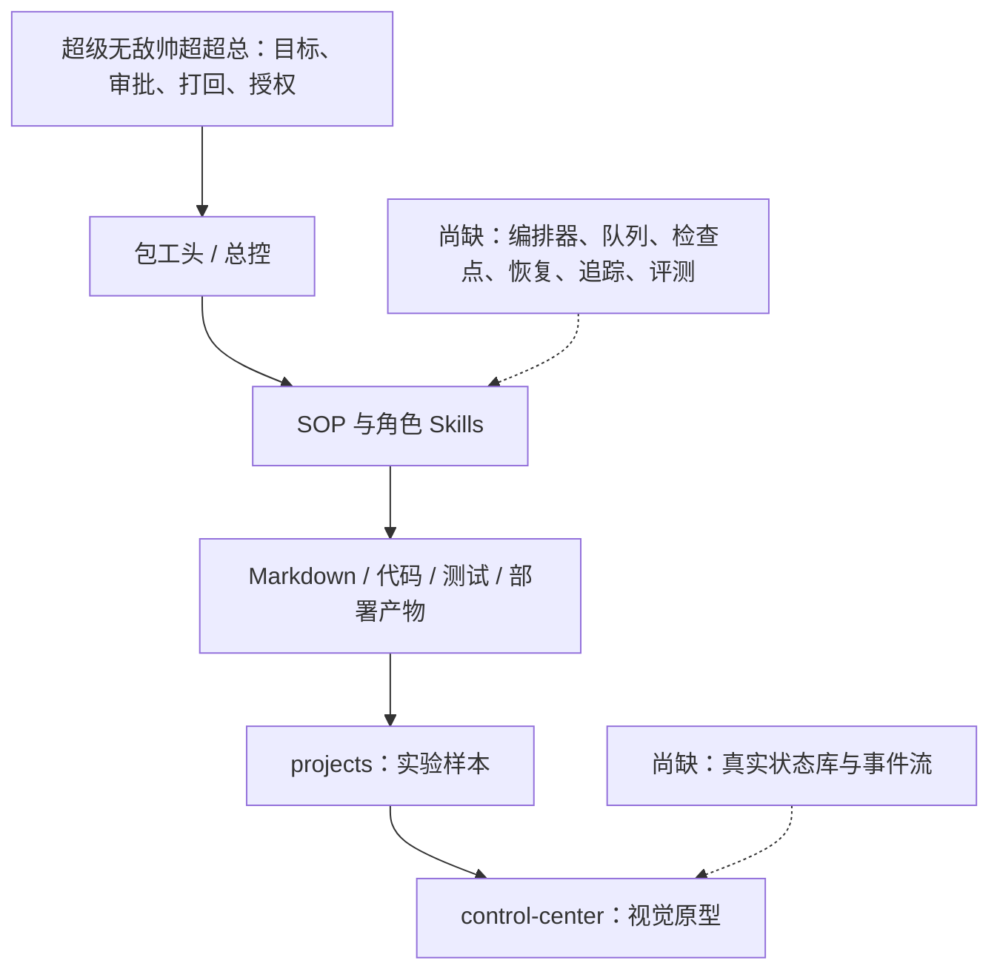
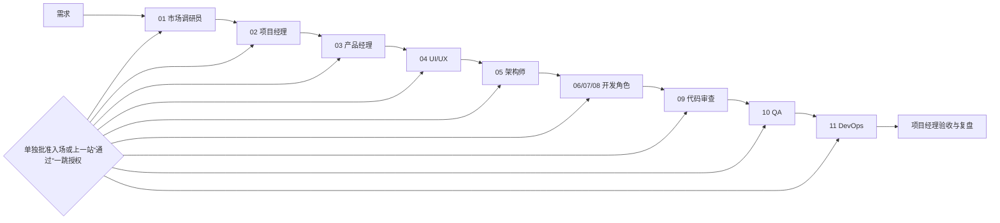
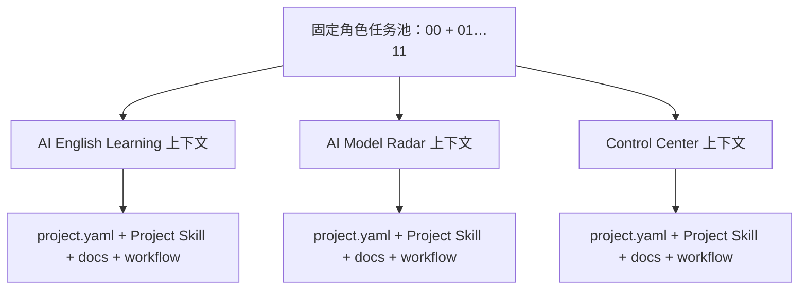
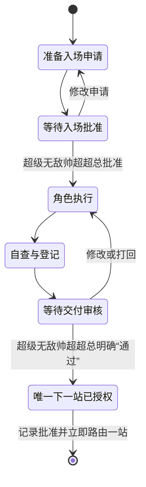
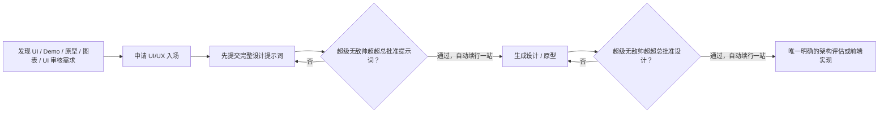
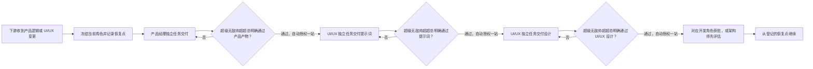
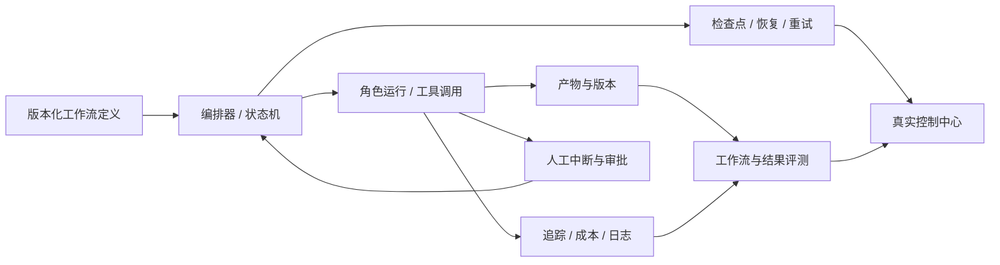

# AI 工作流实验架构

## 1. 当前层级

当前仓库实现的是“工作流定义层 + 人工执行层 + 视觉原型层”，尚未实现生产级运行时。

专业描述应为：**SOP 驱动、人在回路的 AI 软件工程工作流实验框架**。在运行时和数据层补齐前，不称为自主多 Agent 平台。

## 2. 角色与审批拓扑

角色 Agent 是跨项目共享的固定资源池，而不是项目内复制品：侧边栏只保留 `00 包工头` 与 `01` 至 `11` 这些任务。每个项目提供自己的上下文和状态，同一固定角色任务按 `project_id` 切换工作对象。

序号只表达首次主要入场。真实工程采用交叉参与：

- QA 在 PRD 阶段提出测试策略，开发后执行测试和复测。
- DevOps 在初始化/架构阶段建立环境与 CI，测试通过后负责发布。
- 代码审查按任务持续发生，不等待所有开发结束。
- 数据工程师只在复杂数据、ETL、迁移、分析或向量检索场景启用。
- AI/LLM、安全与隐私、AgentOps、工作流评测作为能力或 Skill 由固定角色承接，不再新增条件角色 Agent。

### 2.1 用户直达角色的临时调度

超级无敌帅超超总可以直接在任一固定角色任务中声明项目、范围和动作。该消息是角色对该精确工作单元的一次性入场或继续授权，无需先经过 `00 包工头`，并拥有 AIWorkFlow 内部最高业务调度优先级。角色在切换前保存原阶段、审核门、未提交现场、安全恢复点和返回点；临时单元结束后恢复原队列。

直达调度不改变状态机语义：它不自动批准待审产物、不解冻其他工作、不授权下游，也不允许接收角色越过专业边界。跨角色、冻结冲突和下游产品/UI 变更直接路由正确固定角色；生产发布、不可逆动作、付费、账号权限、隐私数据和外部发送仍要求本次具体授权。

## 3. 双门审批与一跳续行

每个角色都有两个不同的门：

超级无敌帅超超总对当前明确交付回复“通过”，同时批准当前交付，并授权唯一明确、输入完整且非高风险的下一站立即入场，无需再等“继续”。自动授权最多覆盖下一站一个交付单元；下一站交付后重新停在审核门。若下一站不唯一或涉及生产发布、不可逆操作、付费、账号权限、隐私数据或对外发送，只能停下请示或先准备方案，不能执行高风险动作。

## 4. UI/UX 特殊门

## 5. 下游变更回退门

产品、UI/UX 和开发必须使用各自已有的固定任务/对话。每一站只交付自己的专业产物并停在审核门；一次“通过”只自动授权紧邻的唯一下一站，不授权再下一站，因此不会自动跑完整回退链。

## 6. 工作流状态契约

每个实验项目至少维护：

| 文件 | 用途 |
|---|---|
| `workflow/state.yaml` | 当前阶段、当前角色、阻塞和下一审批 |
| `workflow/approvals.yaml` | 角色入场、交付、发布授权 |
| `workflow/artifacts.yaml` | 产物路径、版本、哈希、验证状态 |
| `workflow/events.jsonl` | 只追加的关键事件 |
| `docs/99-workflow-retrospective.md` | 工作流耗时、等待、返工、失败与改进 |

状态记录需要包含：项目、运行 ID、阶段、角色、输入引用、输出引用、状态、时间、审批人、审批结论、重试次数、失败原因和回退点。

控制中心必须从这些状态读取；未接入前统一标“演示数据”，不能显示伪实时“已同步”。

## 7. 目标运行时

建议演进优先级：

1. P0：统一 Skill 事实源；建立结构化状态、审批和产物契约。
2. P0：让首个样本真正走完审查、测试、复测、部署和验收。
3. P1：实现可恢复编排器、幂等重试、追踪和控制中心真实数据。
4. P1：建立工作流评测、AI 质量、安全、成本与延迟指标。
5. P2：再讨论自动化程度；高风险门继续由超级无敌帅超超总人工批准。
