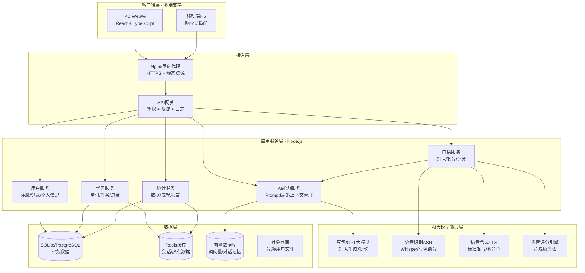
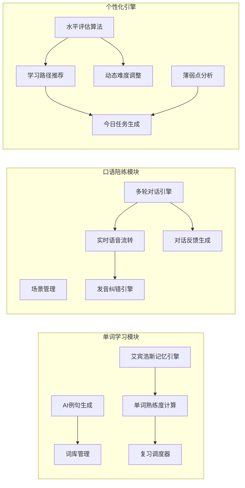
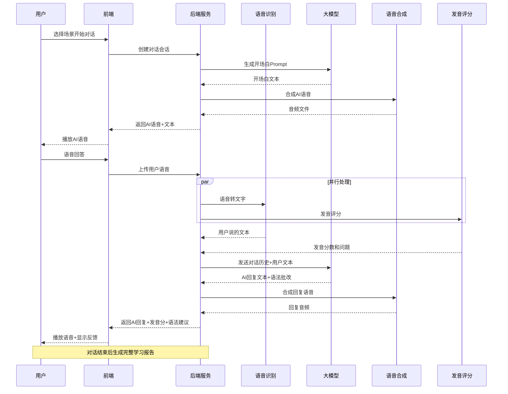
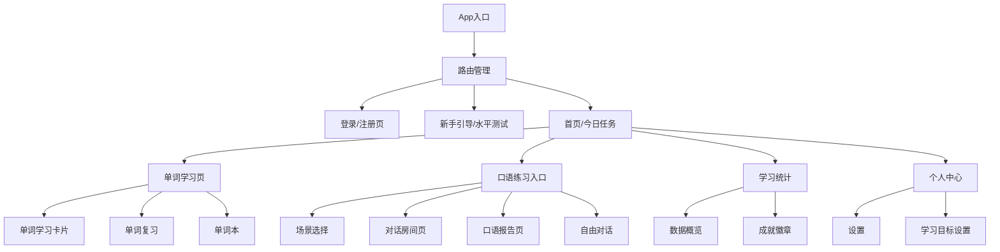

# AI英语智能学习 - 系统架构图

## 一、产品整体架构

---

## 二、核心业务模块架构

---

## 三、口语陪练核心流程

---

## 四、前端页面架构

---

## 五、技术栈选型

| 层级 | 技术选型 | 选型理由 |
|------|----------|----------|
| **前端框架** | React 18 + TypeScript | 生态成熟，多端适配好，类型安全 |
| **UI组件** | TailwindCSS + shadcn/ui | 开发快，设计现代，可定制性强 |
| **状态管理** | Zustand + React Query | 轻量，服务端状态管理优秀 |
| **后端框架** | Express.js + TypeScript | 简单灵活，MVP开发快 |
| **数据库** | SQLite (MVP) → PostgreSQL | 零依赖，后续可无缝升级 |
| **缓存** | Redis (可选) | 会话缓存、热点数据 |
| **大模型** | 豆包API / OpenAI API | 中文支持好，能力强 |
| **语音识别** | 豆包ASR / Whisper | 中文英语识别准确率高 |
| **语音合成** | 豆包TTS / Edge TTS | 发音自然，成本低 |
| **部署** | Docker Compose | 一键部署，环境一致 |
