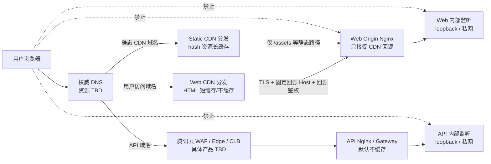
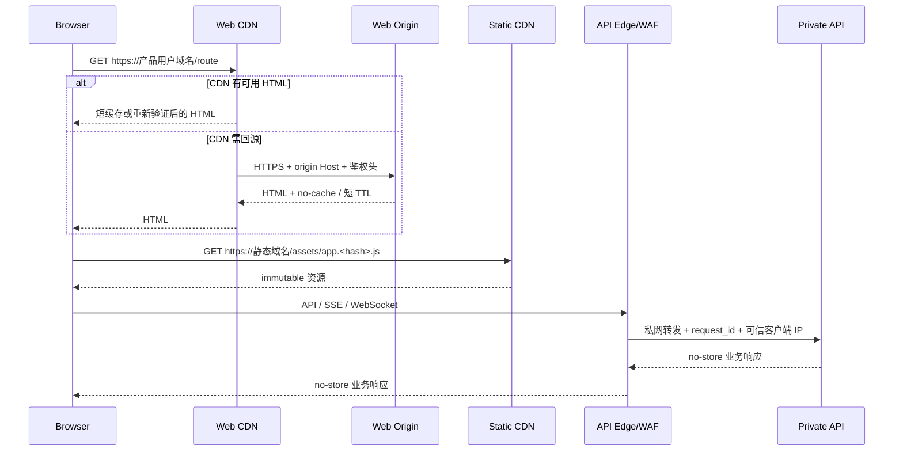

# AIWorkFlow 四项目域名 / CDN / 回源 / 服务边界架构

**版本**：v1.0

**日期**：2026-08-14

**Change ID**：`arch-20260814-four-project-domain-cdn-service-boundary-001`

**Artifact ID**：`artifact-four-project-domain-cdn-service-boundary-001`

**负责人**：固定 05 架构师（`role-architect`）

**覆盖项目**：`ai-english-learning`、`ai-model-radar`、`market-analysis-dev`、`control-center`（项目 ID `workflow-control-center`）

**状态**：待架构审核（`architecture-review`）

**生产状态**：冻结；本文不构成 DNS、CDN、证书、WAF、Nginx、腾讯云权限或生产发布授权

---

## 1. 执行结论

四项目生产候选统一采用“五类地址、四层隔离”的边界：

1. **用户访问域名**：只供浏览器访问产品页面，DNS 必须指向 Web CDN，不直连源站。
2. **静态 CDN 域名**：只分发内容寻址的 JS、CSS、字体、图片等不可变静态资源，与页面域名分离。
3. **API / 服务域名**：只承载浏览器到业务服务的 HTTP API、SSE 或 WebSocket，经 WAF / 负载均衡 / API 入口，不与静态 CDN 共用缓存行为。
4. **源站回源域名**：只供 CDN 回源；不得出现在页面、公开文档、前端配置或用户跳转中，且必须通过网络层和应用层双重防绕过。
5. **内部监听地址**：只在本机回环、VPC 私网或容器私网使用，不配置公共 DNS，不接受公网直连。

核心原则：

- 用户访问链路必须是 `Browser -> Web CDN -> Web Origin`，不能让用户域名解析到源站。
- HTML 与静态资源分别使用用户访问域名和静态 CDN 域名；两者不能再与 API 域名混用。
- API 默认不经过可缓存的静态 CDN；即使使用同一云厂商边缘产品，也必须是独立域名、独立行为和默认旁路缓存。
- 源站域名不能作为“备用访问地址”；源站绕过测试不通过即阻断部署。
- 开发、测试、生产使用不同 DNS 名称、证书、配置、数据和凭证，不允许生产域名指向开发监听地址。
- 当前没有可核验的正式域名、DNS 区、CDN 实例、证书、WAF、负载均衡、安全组或源站资源，全部标记 `TBD`，不得推断为已采购或已配置。
- 生产部署继续冻结。四项目功能、前后端本地联调、可用性、代码审查、QA、安全与回滚尚未全部完成前，本架构只能进入审核和后续部署方案准备。

---

## 2. 当前事实与非事实

### 2.1 2026-08-14 可核验事实

| 项目 | 当前本地 Web 入口 | 当前服务事实 | 生产事实 |
|---|---|---|---|
| AI English Learning | `http://127.0.0.1:4173/word` | Word API 架构约定 `127.0.0.1:4273`；`backend/` 仍只有空壳，不能声称 API 已可用 | 正式域名、CDN、WAF、源站均 `TBD` |
| AI Model Radar | `http://127.0.0.1:4174/today` | `backend/` 仍为空壳；真实来源和生产服务未获执行授权 | 正式域名、CDN、WAF、源站均 `TBD` |
| Frontend Career Radar | `http://127.0.0.1:4177/directions` | `backend/` 仍为空壳；当前浏览器内容和后端扩展边界分离 | 正式域名、CDN、WAF、源站均 `TBD` |
| AI Workflow Control Center | `http://127.0.0.1:4175/?view=overview` | 当前是 Sites / Worker 形态，真实状态后端仍在演进；既有提供商地址不是本规范的最终域名证明 | 自定义域、独立 API 域、CDN/WAF 能力与迁移路径均 `TBD` |

根级 `scripts/local-services.sh` 当前只监督四个本地 Web 服务。它不证明四项目已有生产后端、真实 API、CDN 或云端可用性。

### 2.2 明确未知项

以下项目在部署方案立项前必须保持 `TBD`：

- `TBD_PUBLIC_BASE_DOMAIN`：用户、静态和 API 域名所在的正式根域。
- `TBD_ORIGIN_BASE_DOMAIN`：仅供回源的域名区域；是否与公开根域分区尚未决定。
- DNS 托管商、账号、Zone ID、DNSSEC、CAA、TTL 和变更责任人。
- 腾讯云账号、地域、VPC、子网、CVM/TKE/Serverless、CLB、CDN、EdgeOne/WAF 产品组合。
- CDN 分发实例、CNAME 目标、源站地址、回源协议、回源 Host、回源鉴权能力和节点 IP 清单。
- 证书颁发机构、证书 ID、SAN、私钥保管位置、续期方式和告警责任人。
- WAF 实例、策略集、安全组 ID、负载均衡监听器和可信代理头名称。
- 除 English 本地契约外的 API 技术栈、内部端口、健康接口和部署单元。
- Control Center 自定义域、独立 API 域与现有 Sites / Worker 托管的兼容性。
- 预算、带宽、请求量、出网费、日志保留和合规区域。

本文出现的 `${...}` 都是配置占位符，不是真实资源。

---

## 3. 术语与职责边界

| 地址类别 | 面向对象 | DNS 指向 | 允许内容 | 禁止内容 |
|---|---|---|---|---|
| 用户访问域名 | 最终用户浏览器 | Web CDN CNAME | HTML、SPA fallback、SSR/RSC 响应（若有） | API、源站管理、内部健康详情、不可变资源主分发 |
| 静态 CDN 域名 | 浏览器资源加载器 | Static CDN CNAME | 带内容哈希的 JS/CSS/font/image/map（生产默认不发 map） | HTML、SSR、API、Cookie、个性化响应 |
| API / 服务域名 | 浏览器、受控客户端 | WAF / CLB / API 入口 | JSON API、SSE、WebSocket、公开健康探针的最小结果 | HTML 页面、静态站点、源站文件目录 |
| 源站回源域名 | CDN 回源节点 | 受限源站 LB / Nginx | CDN 所需 HTML 与静态对象 | 用户访问、浏览器 API、管理界面、公开索引 |
| 内部监听地址 | Nginx、Worker、服务间调用 | 私网 DNS / loopback | Web 进程、API 进程、内部 readiness | 公网解析、浏览器直连、CORS 入口 |

同一 IP 或同一 Nginx 实例可以承载多个逻辑入口，但必须通过不同 `server_name`、证书、访问控制、日志和缓存策略隔离。逻辑边界不得因为初期共机部署而消失。

---

## 4. 总体拓扑



### 4.1 请求流



---

## 5. 命名规范与环境隔离

### 5.1 项目短名

| Project ID | DNS 短名 | 说明 |
|---|---|---|
| `ai-english-learning` | `english` | 避免把环境或技术栈写进产品域名 |
| `ai-model-radar` | `model-radar` | 与 Career Radar 明确区分 |
| `market-analysis-dev` | `career-radar` | 使用产品名，不沿用含 `dev` 的仓库 ID |
| `workflow-control-center` | `workflow` | 面向治理控制中心，不使用内部目录名 |

### 5.2 FQDN 模板

生产：

| 类别 | 模板 | 示例性质 |
|---|---|---|
| 用户访问 | `${slug}.${TBD_PUBLIC_BASE_DOMAIN}` | 变量，不是真实域名 |
| 静态 CDN | `static-${slug}.${TBD_PUBLIC_BASE_DOMAIN}` | 变量，不是真实域名 |
| API | `api-${slug}.${TBD_PUBLIC_BASE_DOMAIN}` | 变量，不是真实域名 |
| 源站回源 | `origin-${slug}.${TBD_ORIGIN_BASE_DOMAIN}` | 变量，不是真实域名 |
| 内部 Web | `web-${slug}.${TBD_PRIVATE_ZONE}:${TBD_WEB_PORT}` | 只在 VPC / 服务发现中解析 |
| 内部 API | `api-${slug}.${TBD_PRIVATE_ZONE}:${TBD_API_PORT}` | 只在 VPC / 服务发现中解析 |

测试 / Staging：

| 类别 | 模板 |
|---|---|
| 用户访问 | `${slug}.stg.${TBD_PUBLIC_BASE_DOMAIN}` |
| 静态 CDN | `static-${slug}.stg.${TBD_PUBLIC_BASE_DOMAIN}` |
| API | `api-${slug}.stg.${TBD_PUBLIC_BASE_DOMAIN}` |
| 源站回源 | `origin-${slug}.stg.${TBD_ORIGIN_BASE_DOMAIN}` |
| 内部地址 | `${service}.${TBD_STG_PRIVATE_ZONE}:${port}` |

开发：

- 默认只使用 `127.0.0.1` 和固定端口，不创建公共开发 DNS。
- 如未来必须共享开发环境，使用 `${slug}.dev.${TBD_PUBLIC_BASE_DOMAIN}`，且必须与 Staging/生产使用不同账号、证书、数据和凭证。
- 禁止用 `/etc/hosts` 伪装生产域名进行验收；本地 hosts 只能做明确标注的开发验证。

### 5.3 DNS 规则

- 用户访问域名与静态域名分别 CNAME 到独立 CDN 分发配置；不能共用一个会混淆缓存策略的规则集。
- API 域名 CNAME 到 WAF / CLB / API 入口，不指向静态 CDN CNAME。
- 源站域名 A/AAAA/CNAME 到受限源站入口；DNS 可被解析不等于网络可访问。
- 内部监听名只存在私有 DNS / 服务发现中，不进入公共 Zone。
- 禁止 CNAME 循环和不必要的多级 CNAME；正式切换前记录完整解析链。
- Apex、DNSSEC、CAA、IPv6、TTL 与故障切换能力都保持 `TBD`，部署方案必须逐项确认。
- DNS 记录先低 TTL 灰度，稳定后提升；回滚 TTL 和旧目标保留时长必须在变更单明确。

---

## 6. 四项目逐一映射

所有 FQDN 均为保留模板。未实现的 API 域不得提前发布 DNS，也不得返回假健康成功。

### 6.1 AI English Learning

| 环境 | 用户访问 | 静态 CDN | API | 源站回源 | 内部监听 |
|---|---|---|---|---|---|
| local | `http://127.0.0.1:4173/word` | 同本地 Web 进程，仅开发例外 | 契约为 `http://127.0.0.1:4273/api/v1/word`，实现未证明 | 不适用 | Web `4173`；API `4273` |
| staging | `english.stg.${PUBLIC}` | `static-english.stg.${PUBLIC}` | `api-english.stg.${PUBLIC}` | `origin-english.stg.${ORIGIN}` | `web-english.${STG_PRIVATE}:TBD`、`api-english.${STG_PRIVATE}:TBD` |
| production | `english.${PUBLIC}` | `static-english.${PUBLIC}` | `api-english.${PUBLIC}` | `origin-english.${ORIGIN}` | `web-english.${PRIVATE}:TBD`、`api-english.${PRIVATE}:TBD` |

补充约束：

- `/api/v1/word` Cookie 必须改为 API 主机 host-only Cookie；不得设置共享父域 Cookie。
- API 域与页面域虽属于同一站点（同一可注册根域）但属于不同 origin，前端必须使用精确 CORS 和 `credentials` 策略。
- `/health/live`、`/health/ready` 只能从 API 域或内部探针访问，响应 `Cache-Control: no-store`。
- 当前本地游客身份不能直接当作生产账号体系；生产鉴权、数据删除和备份仍是独立阻断项。

### 6.2 AI Model Radar

| 环境 | 用户访问 | 静态 CDN | API | 源站回源 | 内部监听 |
|---|---|---|---|---|---|
| local | `http://127.0.0.1:4174/today` | 同本地 Web 进程，仅开发例外 | `TBD`；`backend/` 为空，禁止伪造 | 不适用 | Web `4174`；API `TBD` |
| staging | `model-radar.stg.${PUBLIC}` | `static-model-radar.stg.${PUBLIC}` | `api-model-radar.stg.${PUBLIC}`（实现前不建） | `origin-model-radar.stg.${ORIGIN}` | Web/API 私网名与端口 `TBD` |
| production | `model-radar.${PUBLIC}` | `static-model-radar.${PUBLIC}` | `api-model-radar.${PUBLIC}`（实现前不建） | `origin-model-radar.${ORIGIN}` | Web/API 私网名与端口 `TBD` |

补充约束：

- MVP 静态快照可经 CDN 发布，但快照 `as_of`、证据链和连接状态必须真实；CDN 新鲜不等于数据实时。
- `snapshots/latest` 等 API 即使未来可缓存，也必须先由业务架构逐接口显式批准 TTL、ETag、失败与过期语义；本规范默认 API `no-store`。
- 采集 Worker、管理 API、公开查询 API 使用不同内部身份；公开 Web 无权触发采集或发布。
- robots、API、登录、版权与来源许可不因使用 CDN 而改变。

### 6.3 Frontend Career Radar

| 环境 | 用户访问 | 静态 CDN | API | 源站回源 | 内部监听 |
|---|---|---|---|---|---|
| local | `http://127.0.0.1:4177/directions` | 同本地 Web 进程，仅开发例外 | `TBD`；`backend/` 为空，禁止伪造 | 不适用 | Web `4177`；API `TBD` |
| staging | `career-radar.stg.${PUBLIC}` | `static-career-radar.stg.${PUBLIC}` | `api-career-radar.stg.${PUBLIC}`（实现前不建） | `origin-career-radar.stg.${ORIGIN}` | Web/API 私网名与端口 `TBD` |
| production | `career-radar.${PUBLIC}` | `static-career-radar.${PUBLIC}` | `api-career-radar.${PUBLIC}`（实现前不建） | `origin-career-radar.${ORIGIN}` | Web/API 私网名与端口 `TBD` |

补充约束：

- 职业方向、技术栈和研究快照的静态内容可走 CDN；用户粘贴来源、分析状态和个人证据不得进入 CDN 缓存、URL、日志或静态对象。
- 任何 `POST /user-source-analyses` 类接口只能经 API 域，必须 `no-store`、精确 CORS、CSRF 防护和受审查的持久化/TTL。
- 前端使用的内容包通过 hash/manifest 版本化；数据更新时间与 CDN 资源发布时间分别展示。

### 6.4 AI Workflow Control Center

| 环境 | 用户访问 | 静态 CDN | API | 源站回源 | 内部监听 |
|---|---|---|---|---|---|
| local | `http://127.0.0.1:4175/?view=overview` | 同本地 Web 进程，仅开发例外 | 当前独立 API 域未定义 | 不适用 | 本地 Sites/Worker 适配器 `4175` |
| staging | `workflow.stg.${PUBLIC}` | `static-workflow.stg.${PUBLIC}` | `api-workflow.stg.${PUBLIC}` | `origin-workflow.stg.${ORIGIN}` 或提供商受控 origin，均 `TBD` | Worker/API 私网或提供商绑定 `TBD` |
| production | `workflow.${PUBLIC}` | `static-workflow.${PUBLIC}` | `api-workflow.${PUBLIC}` | `origin-workflow.${ORIGIN}` 或提供商受控 origin，均 `TBD` | Worker/API 私网或提供商绑定 `TBD` |

补充约束：

- 既有 Sites 提供商地址保留为历史/私有预览事实，不自动成为最终用户域名、CDN 域名或源站域名。
- 必须先验证托管平台是否支持自定义域、独立静态资源 host、独立 API host、回源 Host/SNI 和源站防绕过；任一能力不满足即需要新的托管方案评审。
- ChatGPT / Sites 身份 Cookie 的域、SameSite、回调地址和退出地址由平台约束，未核验前均为 `TBD`。
- 演示数据、待接入状态不能因使用正式域名或 CDN 而显示为实时数据。

---

## 7. CDN 缓存策略

### 7.1 默认策略矩阵

| 内容 | 匹配 | CDN 行为 | Origin Cache-Control | 关键限制 |
|---|---|---|---|---|
| hash JS/CSS | `/assets/*.<content-hash>.js`、`.css` | 缓存 1 年 | `public, max-age=31536000, immutable` | 文件内容不可原地替换 |
| hash 字体/图片 | `/assets/*.<content-hash>.woff2`、`.png`、`.webp`、`.svg` | 缓存 1 年 | 同上 | SVG 必须经过安全处理；不含用户内容 |
| HTML / SPA fallback | `/`、业务路由、`index.html` | 默认不缓存或 0–60 秒并强制重新验证 | `no-cache, must-revalidate` | 不得使用 immutable；发布后定点刷新 |
| SSR / RSC / 个性化 HTML | SSR/RSC 路径 | 旁路缓存 | `private, no-store` | 发现 `Set-Cookie` / `Authorization` 必须 bypass |
| manifest / release 指针 | `manifest.json`、`release.json` | 0–60 秒 | `no-cache` | 指针切换必须原子；内容对象不可变 |
| Service Worker | `service-worker.js` | 不缓存或极短缓存 | `no-cache` | 避免旧 SW 锁死发布 |
| Source map | `*.map` | 生产默认不发布 | 不适用 | 如获批只能鉴权访问 |
| API | `/api/**` | 默认旁路 | `private, no-store` | 不依赖 CDN 缓存修复性能 |
| 健康检查 | `/health/**`、`/__edge/**` | 旁路 | `no-store` | 不能返回旧健康结果 |
| SSE | `text/event-stream` | 旁路、禁缓冲 | `no-cache, no-transform` | 保持长连接与心跳 |
| WebSocket | Upgrade | 不缓存 | 不适用 | 独立超时、连接数和 WAF 策略 |

### 7.2 Cache Key

- 静态资源 key 至少包含 scheme、host、path 和编码协商；hash 文件默认忽略营销 query，但不能把不同内容用 query 伪版本化。
- HTML query 仅保留业务允许项；未知 query 是否影响内容必须在前端/SSR 契约中定义。
- API 不进入缓存 key 体系；若未来单接口获批缓存，必须显式定义授权头、Cookie、query、语言、压缩、过期和错误缓存策略。
- 404/5xx 默认不做长负缓存；负缓存 TTL 必须短且可刷新。
- 用户域和静态域使用独立 CDN Behavior，禁止仅靠路径顺序实现两类域名职责。

### 7.3 静态跨域

- HTML 从静态 CDN 域加载 ES Module、字体或其他需 CORS 的资源时，使用一致的 `crossorigin` 配置。
- 公共、不可变、无凭证静态资源可以返回 `Access-Control-Allow-Origin: *`；若存在许可限制则改为四个精确用户域 allowlist。
- 静态域永不接收 Cookie，CDN 回源时删除 `Cookie`、`Authorization` 和不必要的用户头。
- CSP 的 `script-src`、`style-src`、`font-src`、`img-src` 只加入对应静态域；`connect-src` 只加入对应 API 域。

---

## 8. 发布、刷新、版本化与回滚

### 8.1 发布顺序

1. 生成唯一 `release_id` 和内容哈希静态文件，上传为新前缀；旧对象保持只读。
2. 校验静态对象哈希、MIME、压缩、CORS、CSP 和 `immutable` 响应。
3. 部署新 Web/API 版本到未接流量的内部地址，readiness 必须通过。
4. 上传新 manifest / HTML，但先保持不可见或仅 Staging 可见。
5. 对 Staging 做页面、API、源站防绕过、CORS/CSRF、Cookie、SSE/WebSocket（若有）验证。
6. 获得具体生产发布授权后，原子切换 release 指针或源站版本。
7. 只刷新用户域的 HTML、manifest、service worker 等可变路径；hash 静态资源不全量刷新。
8. 从公共 DNS、不同网络和源站直连三种视角完成验收。

### 8.2 刷新规则

- 禁止日常使用全站 purge；全站刷新需要单独说明影响和授权。
- hash 静态资源发现内容错误时必须生成新 hash，不覆盖旧 URL。
- HTML/manifest 使用定点刷新，并验证 CDN 各区域是否返回目标 `release_id`。
- 安全事件可执行紧急定点封禁/刷新，但仍需记录操作者、路径、原因、时间和验证结果。

### 8.3 回滚

- 回滚优先切回上一已批准 `release_id` / manifest 指针，然后刷新 HTML/manifest。
- 上一版本静态对象必须至少保留到回滚窗口结束；保留时长 `TBD`。
- API 与数据库回滚遵守各项目业务迁移契约；本文不授权数据库逆迁移。
- Nginx 旧配置和旧 upstream 定义保留，不以删除旧配置完成回滚。
- 回滚后显示真实数据版本/`as_of`，不能把旧快照伪装成最新。

---

## 9. HTTPS、证书、SNI 与 DNS 切换

### 9.1 浏览器到边缘

- 用户、静态、API 域全部强制 HTTPS，最低 TLS 1.2，优先 TLS 1.3。
- HTTP 只做 308 到同 host HTTPS；不能跳到源站或其他项目域名。
- 每类域名可使用独立证书或受控 SAN / wildcard；证书清单、颁发方和私钥保管均 `TBD`。
- HSTS 先在单 host 小范围启用；所有子域和回滚能力未验证前禁止贸然 `includeSubDomains` / preload。
- 证书到期 30/14/7 天分级告警；续期失败必须在到期前阻断发布。

### 9.2 CDN 到源站

- 强制 HTTPS 回源并校验证书；禁止“忽略证书错误”。
- CDN 回源 SNI 和 HTTP `Host` 必须显式设置为 `origin-${slug}.${ORIGIN}`，不能沿用用户访问域名或提供商默认域。
- 源站证书只覆盖源站域，不复用浏览器侧私钥；私钥进入云秘密/证书管理，不入 Git、Nginx 文档或日志。
- 若腾讯云产品支持 mTLS，优先将其作为源站第二道认证；支持性和证书生命周期为 `TBD`。

### 9.3 切换控制

- 切换前导出 DNS/CDN 当前配置快照和 TTL，记录旧目标，不删除旧记录模板。
- 新 CNAME / A 记录先 Staging，再小流量或受控域验证；生产变更需要单独发布授权。
- DNS 生效不能作为成功结论；必须验证证书、Host/SNI、缓存、源站绕过、API 和真实用户路径。

---

## 10. 真实客户端 IP 与代理信任

客户端可伪造 `X-Forwarded-For`、`X-Real-IP` 和供应商同名头。只有来自已登记 CDN/WAF/CLB CIDR 的连接才能被 Nginx 信任。

规则：

1. CDN/WAF 在边缘覆盖而不是追加不可信客户端代理头。
2. Nginx `set_real_ip_from` 仅包含经腾讯云官方清单核验的 CIDR；清单和更新机制为 `TBD`。
3. `real_ip_header` 使用部署时核验的腾讯云真实 IP 头；当前写作 `${TBD_TENCENT_REAL_IP_HEADER}`，不得猜测。
4. 只有可信代理链启用 `real_ip_recursive on`；其他入口直接使用 TCP peer IP。
5. 传给上游的 `X-Forwarded-For`、`X-Forwarded-Proto`、`X-Forwarded-Host` 由 Nginx 重建。
6. 应用层限流、审计和安全告警同时保留 `edge_request_id`，避免只依赖 IP 识别用户。
7. 日志按隐私策略截断/哈希 IP；原始 IP 保留期限和合法依据为 `TBD`。

---

## 11. CORS、CSRF 与 Cookie

### 11.1 CORS

- 每个 API 只允许本项目对应的精确用户域和经批准 Staging 域；生产禁止 `*` 与凭证并用。
- `Origin: null`、未登记端口、源站域、静态域和其他项目域默认拒绝。
- 预检允许的方法、头和 `Access-Control-Max-Age` 按接口最小化；不回显任意 Origin。
- API 错误响应同样遵守 CORS，不能因异常路径泄露堆栈或切换通配规则。

### 11.2 CSRF

- 所有 Cookie 鉴权的变更请求必须验证 `Origin` / `Referer`，并使用 CSRF token 或等价的双重提交/会话绑定机制。
- `SameSite` 只是纵深防御，不能替代 CSRF 校验。
- Bearer Token 若未来使用，Token 不能放 URL、localStorage 或 CDN 日志；认证方案需项目单独审核。
- API 对不支持的 content type 返回 415，避免简单表单跨站提交绕过。

### 11.3 Cookie

- 默认使用 API host-only Cookie，**不设置 `Domain`**，避免 `english`、`model-radar`、`career-radar`、`workflow` 互相读取。
- 默认属性：`Secure; HttpOnly; SameSite=Lax`；需要 `SameSite=None` 的跨站嵌入属于新需求，必须单独安全评审。
- `Path` 限到实际 API 前缀，例如 English `/api/v1/word`。
- 静态 CDN 域不设置、不接收、不转发 Cookie。
- Session/游客 Cookie 的刷新、撤销、TTL、密钥轮换与多设备语义由各项目认证架构定义；当前均不得推定。

---

## 12. WebSocket 与 SSE

二者只使用 API 域，不使用用户访问域、静态域或源站域。

| 协议 | 边缘要求 | Nginx 要求 | 应用要求 |
|---|---|---|---|
| WebSocket | WAF/CLB 支持 Upgrade、连接数和空闲超时已核验 | `proxy_http_version 1.1`、显式 Upgrade/Connection、合理 read timeout | 鉴权、origin 校验、心跳、连接上限、背压 |
| SSE | 禁止缓存和响应转换，允许长连接 | `proxy_buffering off`、`proxy_cache off`、`X-Accel-Buffering: no` | `text/event-stream`、心跳、重连 ID、断线恢复边界 |

- CDN 若不能可靠支持长连接，浏览器直接连接 API/WAF 域；不得把 SSE/WS 塞进静态 CDN规则。
- 连接 URL 不携带长期 Token；日志不记录 query 中的临时凭证。
- 当前四项目是否需要生产 SSE/WebSocket 均以业务实现为准；没有实现时验收项标 `N/A`，不能伪造连接成功。

---

## 13. Nginx `server_name` / `upstream` 结构

本节是未来候选结构，不创建或修改服务器配置。

### 13.1 文件策略：只新增，不删除旧配置

候选文件使用新名称：

```text
/etc/nginx/conf.d/20-aiworkflow-shared-map.conf
/etc/nginx/conf.d/21-aiworkflow-trusted-edge.conf
/etc/nginx/sites-available/aiworkflow-english-v1.conf
/etc/nginx/sites-available/aiworkflow-model-radar-v1.conf
/etc/nginx/sites-available/aiworkflow-career-radar-v1.conf
/etc/nginx/sites-available/aiworkflow-workflow-v1.conf
```

要求：

- 实施前先保存 `nginx -T`、现有文件清单、监听端口与 `server_name` 清单。
- 新配置使用唯一文件名和不冲突的 `server_name`；不得覆盖、清空、重命名或删除旧文件。
- 先离线 `nginx -t`，再以未公开 Staging host 验证；未获生产授权不得 reload 生产实例。
- 回滚优先通过 DNS/CDN release 指针和旧 upstream 恢复，不删除旧 Nginx 配置。
- 如果后续必须停用或清理任何旧配置，必须另开变更单并获得明确授权。

### 13.2 结构模板

```nginx
# 共享 map：新文件，不能覆盖现有配置
map $http_upgrade $aiw_connection_upgrade {
    default upgrade;
    ''      close;
}

upstream aiw_english_web_v1 {
    server ${TBD_ENGLISH_WEB_PRIVATE_HOST}:${TBD_ENGLISH_WEB_PORT};
    keepalive 32;
}

upstream aiw_english_api_v1 {
    server ${TBD_ENGLISH_API_PRIVATE_HOST}:${TBD_ENGLISH_API_PORT};
    keepalive 32;
}

# Web 源站：只允许 CDN 回源
server {
    listen 443 ssl http2;
    server_name ${TBD_ORIGIN_ENGLISH_FQDN};

    # ssl_certificate / key 由证书管理注入，值 TBD
    # allow 仅来自已核验 CDN 回源 CIDR；当前不能填猜测地址
    # deny all;

    location = /__edge/live {
        proxy_pass http://aiw_english_web_v1;
        proxy_cache off;
        add_header Cache-Control "no-store" always;
    }

    location /assets/ {
        proxy_pass http://aiw_english_web_v1;
        proxy_set_header Host $host;
        proxy_hide_header Set-Cookie;
    }

    location / {
        proxy_pass http://aiw_english_web_v1;
        proxy_set_header Host $host;
        proxy_set_header X-Forwarded-Proto https;
        proxy_set_header X-Request-ID $request_id;
    }
}

# API 入口：独立 server_name，不承载 Web/静态内容
server {
    listen 443 ssl http2;
    server_name ${TBD_API_ENGLISH_FQDN};

    location /api/v1/word/ {
        proxy_pass http://aiw_english_api_v1;
        proxy_http_version 1.1;
        proxy_set_header Host $host;
        proxy_set_header X-Forwarded-Proto https;
        proxy_set_header X-Request-ID $request_id;
        proxy_cache off;
        add_header Cache-Control "no-store" always;
    }

}
```

其他三项目复制结构而不是复制真实值：

| 项目 | Web upstream | API upstream | Origin `server_name` | API `server_name` |
|---|---|---|---|---|
| English | `aiw_english_web_v1` | `aiw_english_api_v1` | `${TBD_ORIGIN_ENGLISH_FQDN}` | `${TBD_API_ENGLISH_FQDN}` |
| Model Radar | `aiw_model_radar_web_v1` | `aiw_model_radar_api_v1` | `${TBD_ORIGIN_MODEL_RADAR_FQDN}` | `${TBD_API_MODEL_RADAR_FQDN}` |
| Career Radar | `aiw_career_radar_web_v1` | `aiw_career_radar_api_v1` | `${TBD_ORIGIN_CAREER_RADAR_FQDN}` | `${TBD_API_CAREER_RADAR_FQDN}` |
| Control Center | `aiw_workflow_web_v1` 或托管 origin `TBD` | `aiw_workflow_api_v1` 或托管 Worker `TBD` | `${TBD_ORIGIN_WORKFLOW_FQDN}` | `${TBD_API_WORKFLOW_FQDN}` |

SSE/WS 只在项目已有批准契约时增加对应 `location`，并采用第 12 节的禁缓存、禁缓冲、Upgrade、超时和鉴权规则。不得为展示完整性而添加假路径；实际路径必须来自已批准 API 契约。

---

## 14. 源站防绕过与腾讯云边界

### 14.1 Web 源站

至少需要三层：

1. **安全组 / ACL**：源站 443 仅允许已核验的 CDN 回源 CIDR 或专用回源链路。
2. **TLS / SNI**：只接受源站域证书与正确 SNI；未知 host 命中 default server 后立即拒绝。
3. **回源鉴权**：CDN 注入由秘密管理的固定头或 mTLS，源站校验；秘密不得写入本文、Git 或普通日志。

固定头不能替代安全组；IP allowlist 也不能替代 TLS 和 Host 校验。

### 14.2 API 边界

- 公网只暴露 WAF / EdgeOne / CLB 受控入口，应用端口只在私网安全组开放。
- WAF 到 API Nginx / 服务的安全组只允许 WAF/CLB 子网或安全组引用。
- 管理 API 与公开 API 需要不同路径、身份和限流；高风险管理接口优先使用独立内部域，不对浏览器公开。
- 腾讯云具体产品组合、WAF 规则、Bot 管理、DDoS、防护阈值和安全组 ID 全部 `TBD`，本文不实际修改权限。

### 14.3 防绕过验收

- 公网直接访问源站 IP：连接超时或拒绝。
- 手工绑定源站 IP 并发送用户域 Host：拒绝。
- 使用源站域但无 CDN 回源身份：拒绝。
- 伪造 `X-Forwarded-For`：应用看到的真实 IP 不被伪造值覆盖。
- CDN 正常回源：页面和静态资源成功；错误域、错误路径和 API 路径不能从 Web origin 穿透。

任何一项失败都阻断生产切换。

---

## 15. 健康检查与可观测性

### 15.1 健康层级

| 层级 | 检查 | 缓存 | 目标 |
|---|---|---|---|
| DNS | 三类公共域解析到预期 CNAME / 边缘 | 不适用 | 发现漂移、过期记录和错误环境 |
| CDN | 用户页、hash 资源、cache status、release ID | 按内容策略 | 确认命中正确分发和版本 |
| Web origin live | `/__edge/live` 或等价 | `no-store` | 仅证明 Web 进程可响应 |
| API live | `/health/live` | `no-store` | 进程存活 |
| API ready | `/health/ready` | `no-store` | 依赖、迁移、配置满足接流量条件 |
| 业务 synthetic | 每项目关键只读流程和受控写流程 | 不缓存业务结果 | 证明用户路径真实可用 |
| 源站防绕过 | 直接 IP / Host / 无鉴权请求 | 不适用 | 必须拒绝 |

健康接口只返回状态、版本、`release_id` 和最小依赖摘要，不返回秘密、内部地址、数据库 DSN、堆栈或账号信息。

### 15.2 请求追踪

- 边缘生成或接受格式合法的 `request_id`，经 CDN/WAF/Nginx/API 贯穿；应用响应回显安全的 ID。
- 日志最少包含：时间、环境、项目、host、route template、状态码、耗时、upstream、cache status、release_id、request_id、边缘错误码。
- 日志不得包含 Cookie、Authorization、CSRF token、用户粘贴正文、学习答案、完整 query、秘密回源头或证书私钥。
- 客户端 IP 的记录、脱敏和保留按隐私审批执行；未批准前只保留故障所需最小信息。

### 15.3 指标与告警

- DNS 解析漂移、证书到期、TLS/回源失败。
- CDN 4xx/5xx、回源比例、命中率、带宽、刷新失败和版本不一致。
- API 4xx/5xx、p50/p95/p99、连接数、SSE/WS 断连、限流和 WAF 命中。
- Web/API readiness、发布后错误率、关键 synthetic 失败。
- 源站出现非 CDN/WAF 来源连接尝试时告警。
- 成本预算、日志量和出网量阈值均 `TBD`，未配置不能声称受控。

---

## 16. 安全响应头基线

候选基线必须按项目测试，不能盲目复制：

- `Strict-Transport-Security`：确认全子域 HTTPS 后逐步启用。
- `Content-Security-Policy`：`default-src 'self'`，显式加入对应静态域和 API 域；不允许通配所有子域。
- `X-Content-Type-Options: nosniff`。
- `Referrer-Policy: strict-origin-when-cross-origin` 或更严格。
- `Permissions-Policy`：默认关闭未用浏览器能力。
- `frame-ancestors`：默认 `'none'`；Control Center 若必须嵌入，单独批准精确来源。
- 静态资源设置正确 MIME；HTML 不以静态资源 MIME 返回，避免缓存污染。

Control Center 的提供商托管若不能设置所需响应头，必须登记限制并在生产托管选择前解决。

---

## 17. 环境与配置隔离

| 类别 | local | staging | production |
|---|---|---|---|
| DNS | 无公共 DNS，`127.0.0.1` | 独立 `stg` 名称 | 正式名称 |
| 证书 | HTTP 或本地开发证书 | 独立 Staging 证书 | 正式证书 |
| CDN/WAF | 不使用 | 独立测试实例/配置 | 正式实例/配置 |
| 数据 | 演示/本地 | 脱敏或合成；不得默认复制生产 | 仅经批准真实数据 |
| 凭证 | 开发最小权限 | Staging 独立凭证 | 生产秘密管理 |
| Cookie | 本地 host-only | Staging host-only | 生产 API host-only |
| 日志 | 本机、短保留 | 独立索引 | 生产索引与受审查保留 |
| 发布 | 根脚本本地监督 | 自动化候选、需审核 | 明确生产授权后执行 |

禁止在前端构建中内嵌源站域、私网地址、回源鉴权值、WAF 旁路地址或生产秘密。前端只允许编译用户域、静态域和 API 域的公开配置。

---

## 18. 验收清单

### 18.1 架构验收

- [ ] 五类地址职责明确，用户域、静态域、API 域和源站域没有复用。
- [ ] 四项目 local / staging / production 映射完整，未知资源全部为 `TBD`。
- [ ] 用户访问域 DNS 明确指向 CDN，而非源站。
- [ ] 静态 hash 资源长缓存，HTML/SSR/API/健康/SSE 不误缓存。
- [ ] 发布、定点刷新、内容版本化和回滚顺序可执行。
- [ ] HTTPS、SNI、回源 Host、可信真实 IP 链和证书责任边界明确。
- [ ] CORS、CSRF、Cookie Domain/SameSite、WebSocket/SSE 规则明确。
- [ ] 源站有安全组 + TLS/Host + 回源身份三层防绕过。
- [ ] 腾讯云资源和权限仅定义边界，没有声称已配置。
- [ ] Nginx 采用新文件、新 server_name、新 upstream，不删除旧配置。
- [ ] 健康、日志、指标、告警、synthetic 与部署阻断条件完整。

### 18.2 部署前技术验收

- [ ] 四项目用户功能完成并分别通过对应交付审核。
- [ ] 四项目要求的后端服务已实现，前后端本地联调通过；未需要后端的项目有明确批准的静态边界。
- [ ] 代码审查 P0/P1 已关闭或由超级无敌帅超超总明确接受。
- [ ] QA 覆盖功能、异常、无障碍、安全、性能和回归，且不存在本轮必须修复项。
- [ ] 域名所有权、DNS Zone、CDN/WAF/CLB、源站、证书、VPC 和安全组资源均有真实 ID 与责任人。
- [ ] Staging 完成缓存、CORS/CSRF/Cookie、SSE/WS（若有）、真实 IP 和防绕过测试。
- [ ] 发布、刷新、回滚、证书续期、DNS 回退和数据恢复完成演练。
- [ ] 监控、告警、日志脱敏、保留、预算和 on-call 责任人已配置。
- [ ] 生产变更单列出精确 DNS/CDN/Nginx/云资源 diff，且只新增配置、不删旧配置。
- [ ] 获得针对该次生产发布的单独明确授权。

---

## 19. 部署阻断条件

任一条件成立，生产继续冻结：

1. 任一项目功能、后端服务、前后端联调或可用性未完成。
2. 正式域名、DNS、CDN、证书、WAF、源站或责任人仍为 `TBD`。
3. 用户访问域可直达源站，或源站 IP/域可被普通公网请求访问。
4. 用户域、静态域、API 域、源站域发生职责混用。
5. HTML/SSR/API/健康接口被长缓存，或 hash 静态资源可被原地覆盖。
6. 回源 HTTPS、SNI、Host 或证书校验未开启。
7. 应用信任来自任意客户端的 `X-Forwarded-For`。
8. CORS 使用凭证通配、CSRF 未覆盖变更请求、Cookie 设置父域共享。
9. SSE/WS 所需边缘能力未验证却被业务依赖。
10. Nginx 变更需要删除/覆盖旧配置，且没有单独授权和恢复点。
11. Staging 未完成真实 DNS/CDN/WAF 链路验证和回滚演练。
12. 存在 P0/P1、QA 必修缺陷、安全高风险、秘密泄露或合规未决项。
13. 没有本次生产发布的明确高风险授权。

---

## 20. 成本与容量边界

本文不采购资源。部署方案必须基于四项目真实流量预测补齐：

- CDN 请求、带宽、回源流量、刷新次数和日志费用。
- WAF / EdgeOne / CLB 套餐、QPS、连接数和 SSE/WS 长连接成本。
- 源站计算、磁盘、数据库、备份、跨区和公网出网成本。
- 证书、DNS、监控、日志存储、告警和安全服务成本。
- 每项目和每环境预算、硬上限、异常增幅告警和停机策略。

在容量数据缺失时不宣称 CDN 节省比例、命中率、SLA、QPS 或成本金额。

---

## 21. 架构决策记录

| ADR | 决策 | 原因 | 代价 / 重审条件 |
|---|---|---|---|
| ADR-EDGE-001 | 用户访问域必须走 Web CDN | 隐藏源站、统一 TLS/缓存/防护 | CDN 不支持所需动态能力时重审托管 |
| ADR-EDGE-002 | 静态 CDN 域与用户域分离 | 避免 HTML 与 immutable 规则混淆 | 增加证书、DNS、CORS 和运维对象 |
| ADR-EDGE-003 | API 域独立且默认不缓存 | 隔离业务状态、Cookie、WAF 和长连接 | 增加跨 origin CORS/CSRF 配置 |
| ADR-EDGE-004 | 源站域只供回源且双重防绕过 | 防止绕过 CDN/WAF 直接攻击源站 | 需维护 CDN CIDR、回源身份和证书 |
| ADR-EDGE-005 | hash 资源不可变，HTML 指针可回滚 | 避免全站 purge，支持版本并存 | 需保留旧静态对象和 release manifest |
| ADR-EDGE-006 | Nginx 只新增候选配置，不删旧配置 | 保护既有现场与可恢复性 | 后续清理需单独变更单 |
| ADR-EDGE-007 | 未知云资源全部 `TBD` | 防止用示例冒充已配置资源 | 部署前必须完成真实资源清单 |
| ADR-EDGE-008 | 生产在四项目联调与 QA 完成前冻结 | 先保证产品可用，再建设上线链路 | 域名/CDN 只能审核和准备，不能执行 |

---

## 22. 自检与停止门

- [x] 定义用户域、静态 CDN 域、API 域、源站域、内部监听地址的职责与命名。
- [x] 完成四项目和 local/staging/production 的逐项映射。
- [x] 定义静态长缓存、HTML/SSR/API 旁路、刷新、版本化和回滚。
- [x] 覆盖证书/SNI、DNS/CNAME、回源 Host、真实 IP、CORS、CSRF、Cookie、SSE/WS。
- [x] 覆盖源站防绕过、腾讯云安全组/WAF 边界且未改权限。
- [x] 给出 Nginx `server_name` / `upstream` 候选结构，并要求只新增、不删旧配置。
- [x] 定义健康、可观测性、验收和部署阻断条件。
- [x] 所有未知域名、DNS、CDN、证书和云资源均标 `TBD`，没有编造。
- [x] 未写业务代码、未部署、未改云端、未修改四项目业务或审核文件。

本交付停止在 `architecture-review`。审核选项：**通过 / 修改 / 打回**。根据本次明确授权，即使通过也不自动路由固定 02、开发或 DevOps；后续任务拆解、实施和生产发布必须另行明确授权。
