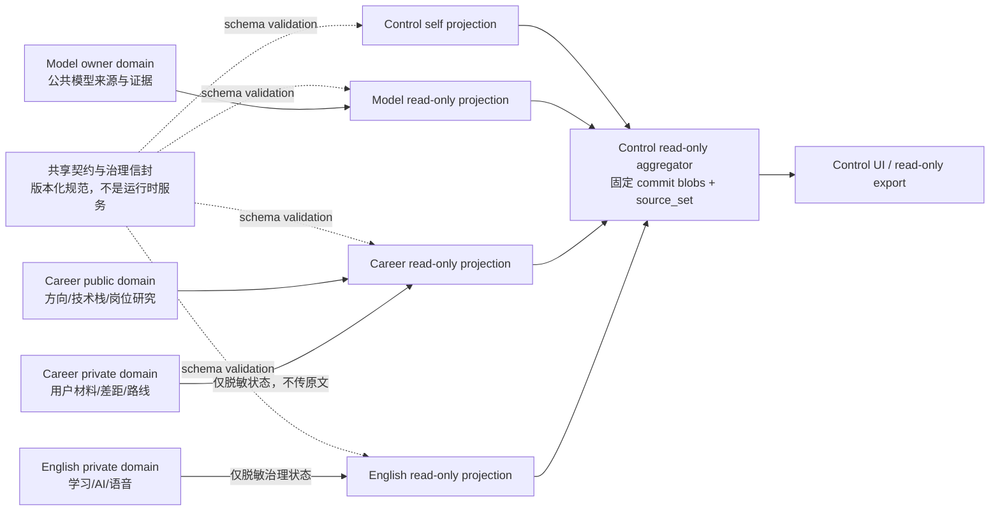

# 四项目共享与独有边界 ADR

> - 版本：v1.0
> - 状态：待架构审核（architecture-review）
> - 工作项：`XR-ARC-001`
> - 变更：`arch-20260816-four-project-shared-boundary-001`
> - 入场授权：`approval-20260817-four-project-shared-boundary-architecture-entry`
> - 决策基线：`8d4020ff6fac2c1558c9cb2b5f12dcb4e6cd20e2`
> - 修订基线：`a2dff74e9beffb005b33fda60934bd349a558018`
> - 候选修订：2（前候选 SHA-256 `2d3e7fb026b4366f8c9fda033fc8e7866a9a653d19674e2241dccb79aca07c45`，独立内容终审 changes-requested）
> - 产物：`artifact-four-project-shared-boundary-adr-001`
> - 责任角色：固定 `05 架构师`（`role-architect`）
> - 生产发布：冻结
> - 停止门：`architecture-review`

## 1. 决策摘要

四项目只共享稳定、版本化、可验证的**契约与治理信封**；不共享万能业务模型、业务数据库、用户账号、运行时、部署单元或故障域。

- AI Model Radar 独占公共来源研究、模型事件、证据、快照与趋势域。
- Frontend Career Radar 独占职业公共研究域，并以硬边界隔离用户私有资料、差距分析与个人路线域。
- AI English Learning 独占私有学习、记忆调度、AI 对话、语音与学习统计域。
- AI Workflow Control Center 只消费同一 `root_head` 冻结 commit blobs 形成的版本化只读治理投影；`source_set` 必须证明 blob 属于该 commit。缓存不具权威性，单项目解析失败必须隔离，业务、Git 与 workflow 写副作用恒为 `0`。
- Model 与 Career 的来源研究批准不等于连接器执行授权。当前两项目均为 `runtime_enabled=false`、live connector `0`、live snapshot `0`；所有 conditional 来源继续 fail closed。
- `live / empty / not_ready / stale / degraded / failed` 采用统一信封语义，但每个项目保留自身业务含义；demo、mock、seed、HTTP 200、CDN 新鲜度均不能冒充 `live`。
- 五类地址严格区分：用户访问域、静态 CDN 域、API / 服务域、源站回源域、内部监听地址。浏览器访问走 CDN，API 默认 `private, no-store`，源站不得给浏览器直连。

这是一份边界 ADR，不是实现或生产方案。本单元不选择云厂商，不分配正式域名、端口、预算或凭证，不修改 DNS、CDN、证书、Nginx、云资源、业务代码、服务状态或部署。

## 2. 权威输入与完整性

以下 SHA-256 均在决策基线工作树中重新计算，结果与路由要求一致。

| # | 权威输入 | SHA-256 |
|---|---|---|
| 1 | `docs/04-four-project-release-completeness-replanning-plan.md` | `96decb8f1835cc85bd530c21b2969d4d077f31e6086425ea911f9d5b187bbe26` |
| 2 | `docs/05-four-project-real-usable-product-delta.md` | `e613e79f44100840542fb6531e155cf0edd0079a6fc213af328fba075750bc01` |
| 3 | `architecture/02-domain-cdn-service-boundary.md` | `d8d7a594b18195e85795b01c7c9c6829222571ba65ddb9629256fab2cf29114b` |
| 4 | `projects/ai-model-radar/ui/05-release-completeness-ui-design.md` | `a731232994db118117043aa50503273c91e5c438bc20f948d9e5137e43ba9324` |
| 5 | `projects/market-analysis-dev/ui/12-release-completeness-ui-design-v1.7.md` | `636d3fcecc3266b8cdc3234614dda68222f67294016d9f22129f87fd552d7fae` |
| 6 | `projects/ai-english-learning/ui/06-release-completeness-ui-design-v1.0.md` | `7c1f2318ec636b5f18ee4af543a042c5b873c511bfb3f95274c3d50c36ff899d` |
| 7 | `control-center/ui/03-release-completeness-ui-design-v1.0.md` | `c7c2f707f76afaae78d3da4404484cd12f0fb3a4e288da06bbeb7496ae5700c3` |
| 7a | `control-center/ui/release-completeness-v1.0/manifest.json` | `24cc9d208ba378f9191a86c83fe68f5be18b1a015f10ace39610405f2a53d5b1` |
| 7b | Control 视觉包 80 项内容聚合 | `a3296c16557ff224c0c456a4529544ce15e8cc6812069665164e842e87e9895c` |
| 8a | `projects/ai-model-radar/docs/00-source-allowlist.md` | `9aa9bb926cc52aae28d11bbf676507ca313add83238cd81be6300a4d9f2f0498` |
| 8b | `projects/ai-model-radar/docs/00-source-registry.csv` | `c303e79e1fa9f7a1664ac718a1678bbcb6610b5309a5d5e4006e6d4b1d438f91` |
| 8c | `projects/ai-model-radar/docs/00-source-runtime-readiness.md` | `c59c0647204caa63b4ac9acc9f229dfab22c8b239b4b844a957c1e065681649f` |
| 9a | `projects/market-analysis-dev/docs/00-source-allowlist.md` | `8e590b31a19b8d4aecd910561ebcc5ee5e423d1dc299ebc4c2d6e4379c3e607e` |
| 9b | `projects/market-analysis-dev/docs/00-source-registry.csv` | `43355d302df64a323e3ee6fe299530d72fd6df8a54bb4b24a06158a9f3621b06` |
| 9c | `projects/market-analysis-dev/docs/00-source-runtime-readiness.md` | `ee6f32549187ed51939a3b2c11accf4c9cd67b9e50d3c5fbcc70c29949536dbd` |

Control 视觉包聚合值按 manifest 约定，以 NFC 规范化项目相对路径、文件 SHA-256、路径排序和末尾换行独立复算；它只证明资产完整性，不证明任何实时后端或业务数据已存在。

## 3. 范围与不做项

### 3.1 本 ADR 冻结的内容

1. 共享契约与项目独占业务边界。
2. 数据分类、数据 owner、允许的消费者与禁止流向。
3. 跨项目只读投影信封、冻结 commit/blob/source_set 强一致性和失败隔离。
4. 统一真相态、错误信封、来源与身份硬门。
5. 无环依赖 DAG 与 Control 零写副作用。
6. 五类地址在四项目及 local / staging / production 的逻辑映射。
7. 风险、TBD、拒绝方案和后续实现前验证门。

### 3.2 明确不做

- 不进入 `MR-ARC-101` 或任何项目级任务拆解。
- 不设计或修改项目业务数据库、API 实现、前后端代码、采集器、Reader、Worker 或测试代码。
- 不启用来源、连接器、canary、调度、数据采集或 live 快照。
- 不启动、停止或重启任何本地或远端服务。
- 不选择或采购云厂商能力，不创建 DNS、CDN、证书、WAF、负载均衡、安全组、Nginx 或云资源。
- 不发布、不迁移、不切流、不改变权限或凭证。

## 4. 架构不变量

| ID | 不变量 | 违反时结果 |
|---|---|---|
| INV-01 | 共享层只包含稳定契约、枚举、错误与治理信封 | 阻断设计或实现 |
| INV-02 | 四项目业务数据、数据库、账号、运行时与部署单元独立 | 阻断合并与发布 |
| INV-03 | Control 只读且所有业务、Git、workflow 写副作用为 `0` | P0 阻断 |
| INV-04 | Control 只从选定 `root_head` 的不可变 Git commit blobs 读取；index/worktree 永不进入权威快照 | 非 commit-blob 读取立即失败，不发布投影 |
| INV-05 | `source_set` 必须以 commit tree entry + blob OID + 内容 SHA 证明每个字节属于声明 commit | 归属或哈希不一致则隔离失败 |
| INV-06 | 缓存不是权威来源，键至少包含 `root_head + source_set_sha256 + schema_version + projection_kind` | 不得展示为当前事实 |
| INV-07 | 单项目解析失败不拖垮其他项目 | 局部 `failed/degraded`，其余继续 |
| INV-08 | 来源政策与运行启用分轴，且唯一启用序列的最后一步前 `runtime_enabled=false` | fail closed |
| INV-09 | demo / mock / seed 与 live 命名空间和指标隔离 | 不计入完成度或 live |
| INV-10 | 用户域、静态域、API 域、源站域和 internal 不混用 | 部署阻断 |
| INV-11 | 未核验的供应商、域名、端口、预算、账号和凭证为 `TBD/UNKNOWN` | 不得推断或伪造 |

## 5. 共享与独有责任矩阵

| 能力 / 资产 | 共享稳定契约 | Model owner | Career owner | English owner | Control owner |
|---|---|---|---|---|---|
| 真相态名称与最低语义 | 是 | 映射模型来源/快照语义 | 映射研究与私有分析语义 | 映射学习/AI/语音语义 | 只读呈现聚合，不重写事实 |
| 版本、SHA、来源、时间、新鲜度信封 | 是 | 产出本项目事实 | 产出本项目事实 | 产出本项目事实 | 校验并投影 |
| 错误信封字段与安全约束 | 是 | 产出局部错误 | 产出局部错误 | 产出局部错误 | 隔离并呈现局部错误 |
| 来源政策与执行硬门 | 只共享门控语义 | 独占公共模型来源策略 | 独占职业公共来源策略 | 仅项目批准的 AI/STT/TTS 提供方 | 不授权、不执行来源 |
| 证据链 | 只共享引用结构 | 模型事件/版本/官方来源证据 | 岗位/技能/研究来源证据 | 学习事件与用户可见结果证据 | 只读治理证据索引 |
| 身份语义 | 只共享主体/权限最小字段 | 本项目访问策略 | 公共阅读与私有用户资料隔离 | 游客/账号、同步与删除策略 | 只读监管主体，不冒充项目用户 |
| 业务实体与业务规则 | 否 | ModelEvent/Snapshot/Trend 等 | Direction/Stack/Job/Gap/Roadmap 等 | Word/Attempt/Schedule/Conversation 等 | GovernanceProjection 等只读视图 |
| 业务数据库 | 否 | 项目独占 | 公共与私有存储仍须项目内隔离 | 项目独占 | 只读索引/缓存可有但不权威，当前未实现 |
| 用户账号、会话、Cookie | 否 | 项目独占或无账号 | 项目独占 | 项目独占 | 项目独占，不跨域 SSO 推断 |
| 运行时与部署 | 否 | 项目独立 | 项目独立 | 项目独立 | 项目独立 |
| 故障恢复与回滚 | 只共享结果语义 | 项目独立 | 项目独立 | 项目独立 | 读失败隔离，不能反向修改项目 |

共享契约不得演变成“万能业务 DTO”。任何业务字段只有在两个以上项目含义、生命周期、权限与证据要求均稳定一致，且经新 ADR 审核后，才可进入共享层。

## 6. 数据域、分类与 owner

### 6.1 分类

| 分类 | 权威 owner | 权威存储 | 允许的派生缓存 | 写权限 | 默认控制 |
|---|---|---|---|---|---|
| `PUBLIC_RESEARCH` | 产生事实的 Model 或 Career 项目 | 各项目批准的来源 registry、证据与未来项目库；具体实现未形成时为 `TBD` | 项目内或 CDN 上仅限已批准、可公开、可重建的派生视图 | 仅 owner 项目经本项目授权写；Control 只读 | allowlist、署名、保留策略、证据链 |
| `PRIVATE_USER_MATERIAL` | Career 项目及对应用户主体 | Career 私有用户存储，技术实现当前 `TBD` | 仅用户/请求隔离的短期派生缓存；不得进公共 CDN 或 Control | 对应主体和 Career 受控服务；其他项目与 Control 无写权 | 明示同意、最小化、API `no-store`、日志脱敏 |
| `PRIVATE_LEARNING` | English 项目及对应游客/账号主体 | English 项目私有学习存储；当前已批准 local Word 边界不等于全域实现 | 仅主体隔离、可失效、可重建的项目内缓存 | 对应主体和 English 受控服务；Career/Model/Control 无写权 | 最小留存、导出/删除、供应商传输需单独同意 |
| `GOVERNANCE_METADATA` | 各项目治理文件 owner；根 Git 提交为版本锚点 | AIWorkFlow 同一根仓的 allowlisted workflow/project commit blobs | Control 可按 `root_head + source_set_sha256 + schema_version + projection_kind` 建非权威只读缓存 | 仅原工作流角色在既有审批链内写；Control runtime 无写权 | 根路径约束、commit tree 归属、blob OID、SHA、同 commit 读取 |
| `SECRET_OR_CREDENTIAL` | 对应项目/平台的安全责任人，当前责任人 `TBD` | 经批准的秘密管理设施，当前 `TBD`；永不以 Git 为权威存储 | 禁止业务缓存、Control 投影、CDN 和日志缓存 | 最小权限受控主体；普通应用/Control 读取默认拒绝 | 不进 Git、前端、日志、导出或 ADR |

“公共来源”不等于“可无限复制内容”。版权、robots、API 条款、登录和署名限制仍由项目来源策略逐项约束。

### 6.2 项目 owner 与流向

| 项目域 | Owner | 可产出给 Control 的内容 | 禁止跨界内容 |
|---|---|---|---|
| Model 公共来源域 | `ai-model-radar` | 来源政策摘要、证据引用、快照状态、版本/新鲜度/覆盖率 | 未授权采集内容、登录态、凭证、原始受限全文 |
| Career 公共研究域 | `market-analysis-dev` | 方向/技术栈/岗位来源治理摘要、公开证据状态 | conditional 招聘源数据在未授权前不得成为 live |
| Career 私有资料域 | `market-analysis-dev` | 仅脱敏的存在性、处理状态和局部错误，不投影原文 | 用户粘贴文本、简历、个人差距细节、第三方请求体 |
| English 私有学习/AI/语音域 | `ai-english-learning` | 仅脱敏的服务/能力状态与治理事实 | 作答内容、记忆明细、对话、音频、账号、供应商载荷 |
| Control 只读治理投影域 | `workflow-control-center` | 相同冻结 commit 与可证明 `source_set` 的只读治理视图、导出与局部错误 | 任何业务/Git/workflow 写操作；读取 index/worktree；把缓存当权威；读取秘密 |

数据 owner 对采集合法性、权限、保留、删除、质量与项目语义负责。Control 只是治理投影消费者，不能因展示或导出而取得业务数据所有权。

## 7. 跨项目只读契约

### 7.1 契约形态

共享的是逻辑契约，不预设 HTTP、文件 Reader、数据库或消息总线实现。未来实现至少满足下列信封：

```text
ProjectionEnvelope<T> {
  schema_version: string
  projection_id: string
  project_id: enum
  projection_kind: string
  snapshot_mode: "git_commit_blobs"
  root_head: 40-hex-git-sha
  source_set_sha256: sha256
  source_set: [{ path, tree_mode, git_blob_oid, sha256 }]
  truth: TruthState
  mode: "real" | "demo"
  as_of: timestamp | null
  observed_at: timestamp
  last_success_at: timestamp | null
  freshness: { status, age_seconds?, policy_id? }
  coverage: { expected?, observed?, ratio? }
  revision: string | integer | null
  data: T | null
  errors: ErrorEnvelope[]
}
```

约束：

1. `schema_version` 不兼容变更必须升主版本；消费者不得猜字段。信封中的 `root_head + source_set` 是 `source + version` 的权威组合。
2. `source_set.path` 必须相对 allowlisted 项目根并规范化；每项必须记录声明 commit tree 中的 `tree_mode`、`git_blob_oid` 与对实际 blob bytes 计算的 SHA-256。
3. `source_set_sha256` 必须对按 path 排序的 `path<TAB>tree_mode<TAB>git_blob_oid<TAB>sha256<LF>` 规范串计算；它证明完整集合，不能由读取工作树后独立记录文件 SHA 来替代。
4. `root_head` 必须解析为存在的完整 commit。Reader 只能从该 commit 的 tree / object database 取 blob；不得读取 index、worktree、未提交文件或在读取后把独立文件 SHA 贴到该 commit 上。
5. 当前 HEAD 在读取期间变化时，commit-blob 快照本身仍一致，但不能作为“当前”结果发布；整轮丢弃并在新 head 重读。
6. `observed_at` 是观察/读取时间，不替代业务事件时间 `as_of`；缺失业务时间时必须为 `null/UNKNOWN`。
7. `revision` 只用于可变业务资源或投影修订；不能替代 Git SHA、blob OID 或来源 SHA。
8. `mode=demo` 与 `mode=real` 必须正交；demo 只能展示为 demo，不能映射到 `truth=live`。
9. 数据为空时必须区分 `empty` 与 `not_ready`，不得以空数组掩盖依赖未就绪；`UNKNOWN` 表示未观察或不可判定，绝不等于数值 `0`。
10. 错误只影响声明的 `impact_scope`；其他项目和其他投影继续返回真实状态。

### 7.2 Control 冻结 commit-blob 读取算法

Control 默认允许根仅为：

- `projects/ai-english-learning/`
- `projects/ai-model-radar/`
- `projects/market-analysis-dev/`
- `control-center/`

每个允许根内的默认允许文件只包括 `project.yaml`、`workflow/state.yaml`、`workflow/approvals.yaml`、`workflow/artifacts.yaml` 与 `workflow/events.jsonl`。未来 issue、release 或 source registry 只有在 `project.yaml` 或已验证 workflow artifact 中以**项目相对路径 + schema version + SHA-256** 显式登记后，才能逐文件加入 allowlist。Control 默认只消费 artifact ledger 中的业务产物元数据，不因出现一个 path 就读取业务正文；`.git/`、`.env*`、凭证/数据库、`node_modules/`、缓存、session、浏览器状态、未登记隐藏文件和四个允许根之外的路径全部拒绝。

1. 从唯一允许的 AIWorkFlow 根取得 `root_head_before`，解析为完整 commit 并固定；缺失、歧义、不可达或对象损坏立即失败。
2. 仅从 `root_head_before^{tree}` 枚举 allowlisted project path。路径先规范化并匹配精确 allowlist；拒绝 `..`、绝对路径、NUL、非普通 blob mode、Git symlink、submodule、未登记文件及大小/行长超限对象。
3. 按 tree entry 的 blob OID 从 Git object database 读取 bytes，重新计算内容 SHA-256；不得调用工作树文件读取作为权威输入，也不得读取 index 中的 staged blob。worktree/index 即使并发变化，也不能影响本轮 bytes。
4. 为每项记录 `path/tree_mode/git_blob_oid/sha256`，按规范串计算 `source_set_sha256`，再反查每个 OID 确实是 `root_head_before` 对应 path 的 tree entry。任一归属或哈希不符，只隔离失败的项目投影。
5. 每个项目独立验证 schema、时间与语义；坏文件或单条 JSONL 坏行只产生该项目/该记录的局部错误信封。只有依赖该坏行的投影降级或失败，不得终止其他项目解析。
6. 聚合结果只引用 `root_head_before` 与对应 `source_set_sha256`；缓存键至少包含 `root_head + source_set_sha256 + schema_version + projection_kind`。
7. 读取结束取得当前 `root_head_after`。若和 `root_head_before` 不同，整轮不作为当前结果发布；丢弃并在新 head 重读。禁止把两个 commit 的项目投影拼接。
8. 成功结果可进入短期只读缓存；缓存命中仍须校验完整键并展示 root_head、source_set_sha256、observed_at 与新鲜度，且绝不能写回源项目。缓存可随时删除并只从 commit blobs 重建。

### 7.3 写副作用预算

| 操作 | Control 允许 | 副作用预算 |
|---|---:|---:|
| 读取 allowlisted 项目治理文件 | 是 | `0` 写 |
| 生成内存投影或本地非权威缓存 | 条件允许 | 业务/Git/workflow `0` 写；缓存可删除并从权威源重建 |
| 搜索、过滤、只读导出投影 | 是 | 源项目 `0` 写 |
| 写 approval/artifact/event/state | 否 | `0` |
| `git add/commit/push/checkout/reset` | 否 | `0` |
| 修改业务数据库、启动任务或连接器 | 否 | `0` |

这里的“导出”只导出当前只读投影，不得包含秘密、私有原文或隐藏路径；导出本身也不能改变源事实。

## 8. 无环依赖 DAG



禁止反向边：`Control -> 项目写入`、`共享契约 -> 业务运行时控制`、`Model <-> Career <-> English 业务数据库/账号`。任何未来新增边都必须证明 DAG 无环且不扩大数据所有权。

上图只描述**运行时事实读取依赖**。AIWorkFlow 中“产品 → UI → 架构 → 开发 → 审查”的治理门顺序，以及固定角色同一时间只能承担有限工作项的容量排队，是治理/调度关系，不得画成项目运行时调用边。四个项目在 Control 不可用、未部署或读取失败时仍须独立运行；项目事实只允许单向流入 Control，Control 绝不是项目启动、读写、恢复或发布的前置依赖。

后续契约或实现变更必须对运行时图执行有向环检测，并分别检查治理图，不能用“流程上后执行”推导“运行时依赖”。若出现 `Control -> 任一项目 runtime`、项目间业务读写闭环或共享契约服务成为在线必经点，必须重新架构审核。

## 9. 真相态与错误信封

### 9.1 统一真相态

| 状态 | 最低统一语义 | 项目语义保留要求 |
|---|---|---|
| `live` | 已授权真实依赖成功，证据、时间、新鲜度、覆盖率满足该能力门 | 每项目自行定义成功阈值；HTTP 200 本身不够 |
| `empty` | 真实查询成功且在明确范围内确无记录 | 必须给出 query scope 与 as_of，不能代替 not_ready |
| `not_ready` | 依赖、授权、实现、配置或首个真实快照尚未满足 | 必须列出缺失门，不得展示 demo 为兜底 live |
| `stale` | 存在最近一次真实成功结果，但已超过项目新鲜度策略 | 显示 last_success_at、age 与策略；不可伪装当前 |
| `degraded` | 仍有可用真实子集，但覆盖、依赖或局部能力受损 | 标明受影响 scope 与缺失比例；未受影响部分可继续 |
| `failed` | 本次真实操作失败且没有可安全作为当前结果的可用子集 | 给出安全错误、重试性和关联 ID；不回退为假 live |

项目可保留 `loading/offline/unauthorized/forbidden/conflict/processing/unconfirmed` 等更细状态，但对 Control 的归一化不能丢失原始状态；应通过 `project_state` 字段并列呈现。

真相态判定优先级按安全性处理：身份/来源硬门失败优先于业务结果；没有首次真实成功时只能是 `not_ready` 或 `failed`，不能是 `stale`；只有曾经真实成功的结果才可能 `stale`；局部真实可用才可能 `degraded`。

### 9.2 标准错误信封

```text
ErrorEnvelope {
  schema_version: string
  code: string
  message_zh_cn: string
  impact_scope: { project_id, projection_kind?, source_id?, record_id?, field? }
  retryable: boolean
  occurred_at: timestamp
  request_id: string
  root_head: 40-hex-git-sha | null
  source_set_sha256: sha256 | null
  source: [{ source_id?, path?, tree_mode?, git_blob_oid?, sha256? }]
  version: { schema_version, root_head?, source_set_sha256?, revision? }
  as_of: timestamp | null
  observed_at: timestamp
  last_success_at: timestamp | null
  freshness: { status, age_seconds?, policy_id? } | null
  coverage: { expected?, observed?, ratio? } | null
  revision: string | integer | null
  safe_details: object | null
}
```

首批稳定错误码：

| 错误码 | 含义 | 默认结果 |
|---|---|---|
| `ROOT_HEAD_CHANGED` | commit-blob 读取期间当前 HEAD 前移 | 冻结快照虽一致，但不作为当前结果发布；整轮丢弃并重读 |
| `DECLARED_COMMIT_UNAVAILABLE` | 声明 root_head 不是可读取的完整 commit 或对象缺失/损坏 | 整轮 `failed`，不得回退读取工作树 |
| `SOURCE_NOT_IN_DECLARED_COMMIT` | path/blob OID 不能由声明 commit tree 证明 | 隔离对应项目投影并重建 source_set |
| `SOURCE_BLOB_MISMATCH` | commit tree 的 blob OID、实际 bytes 或 SHA-256 不一致 | 隔离对应项目投影；缓存失效并告警 |
| `WORKTREE_READ_FORBIDDEN` | Reader 试图用 index/worktree 作为权威投影输入 | 整轮阻断，修复实现后重试 |
| `PROJECTION_SCHEMA_UNSUPPORTED` | 契约版本不支持 | 该项目 `failed`，其他项目继续 |
| `PROJECTION_PARSE_FAILED` | 项目治理源解析失败 | 该项目 `failed/degraded`，其他项目继续 |
| `SOURCE_NOT_AUTHORIZED` | 来源未通过政策或运行授权 | fail closed，`not_ready/forbidden` |
| `DEPENDENCY_NOT_READY` | 实现、服务、配置或首个快照缺失 | `not_ready` |
| `SNAPSHOT_STALE` | 最近真实快照超过策略 | `stale` |
| `IDENTITY_REQUIRED` | 能力要求主体但当前无有效身份 | `unauthorized` |
| `IDENTITY_FORBIDDEN` | 主体无该资源权限 | `forbidden` |
| `PRIVATE_DATA_REDACTED` | 私有内容按边界不进入投影 | 可审计的脱敏提示，不泄漏内容 |
| `SOURCE_RUNTIME_SEQUENCE_VIOLATION` | runtime 启用步骤缺失、乱序或证据修订不一致 | 保持/恢复 `runtime_enabled=false`，返回 owner 修复 |

错误信封不得包含凭证、Cookie、用户粘贴原文、对话/音频、堆栈中的秘密、绝对本机私密路径或第三方完整请求体。`impact_scope` 必须精确到可隔离的最小项目、投影、来源或记录；未观察到某项时使用 `null/UNKNOWN`，不能填 `0` 伪装已测量。

## 10. 身份与来源硬门

### 10.1 身份门

| 项目 | 最小主体模型 | 硬边界 |
|---|---|---|
| Model | 公共读取可匿名；刷新、采集与治理动作必须是内部受控主体 | 公共用户不能启用来源或伪造快照 |
| Career | 公共研究可匿名；用户材料与个性化分析必须绑定项目内游客/账号主体 | 公共研究缓存和私有用户资料物理/逻辑隔离；不得跨用户读取 |
| English | 项目内游客或账号主体；同步、导出、删除、AI/语音传输按能力授权 | 不共享 Career 账号、Cookie 或私有资料；供应商传输需明确边界 |
| Control | 只读监管主体或本地受控读取上下文 | 不能冒充项目用户，不能通过 Control 获得源项目写权限 |

本 ADR 不批准跨项目 SSO、共享 Cookie、统一账号库或父域 Cookie。未来若引入身份联盟，必须另行定义 issuer、audience、subject 映射、撤销和隐私边界。

English 与 Career 必须维持独立账户/游客主体域，主体 ID 不跨项目复用或相互推导。需要同步或解决并发写的私有资源必须由各项目使用服务端 `revision` 与 CAS / `If-Match`（或等价原子条件写）判定冲突；客户端时间戳和 localStorage 都不能作为同步权威事实。浏览器凭证只能使用对应项目 API 可验证的 host-only Cookie 或明确 audience 的令牌，并配合精确 CORS、状态变更 CSRF 防护、`Secure`、`HttpOnly` 与适当 `SameSite`；禁止父域 Cookie。

### 10.2 来源双轴门控

来源 policy 必须保持四态：`allow / conditional / manual_only / disabled`。该枚举只表达政策结论，和布尔运行轴 `runtime_enabled` 完全分离。每个精确 endpoint、实现修订与目标环境的运行启用只能按以下唯一顺序前进：

1. **政策获批**：endpoint 已在批准 registry 中；`conditional` 的全部前置条件已逐项形成证据，`manual_only/disabled` 不得进入自动运行序列。
2. **单独执行授权**：针对精确 endpoint、用途和环境登记执行授权；研究报告、allowlist、registry 或 readiness 获批不能代替此步骤。
3. **实现完成**：连接器实现产物形成不可变 revision/SHA，失败开关、速率、版权、robots、登录、署名和保留策略均可验证；此时 `runtime_enabled=false`。
4. **canary 通过**：只在执行授权限定的隔离 canary 范围内验证；canary 不是 live 调度，不得将 `runtime_enabled` 改为 true。
5. **对应 `.REV` 通过**：独立审查员对同一 endpoint、政策修订、实现 revision 与 canary 证据审查，结论必须为 P0=0、P1=0。
6. **对应 `.QA` PASS**：独立 QA 对同一组不可变证据与目标环境给出 PASS；实现、政策或 canary 证据变化会使 `.REV/.QA` 同时失效。
7. **环境登记启用**：只在前六步证据完整且同修订时，才可在已批准环境原子登记 `runtime_enabled=true`。该登记不自动授权其他 endpoint、环境或生产发布。

步骤 7 是唯一允许从 false 变为 true 的位置。在此之前 `runtime_enabled` 必须始终为 false；任一步失败、缺失、乱序、修订不一致或条件变化，都返回对应 owner 修复并保持/恢复 false，产生 `SOURCE_RUNTIME_SEQUENCE_VIOLATION`。禁止“先启用再补 canary、`.REV` 或 `.QA`”。

当前冻结事实：

- Model：批准的 P0/allow 原子 endpoint 数 `N=22`；`AIR-END-030` 仍是待审提案，不能加入 N。当前 `runtime_enabled=false`，连接器、调度、canary、对应 `.REV`、对应 `.QA` 和 live 快照均为 `0`，没有 endpoint 到达步骤 7。
- Career：批准的 P0/allow 技术 endpoint 数 `T=13`，批准的具体招聘实例数 `R=0`；`CAR-END-017` 仍是 conditional 候选，不是已批准招聘实例。当前 `runtime_enabled=false`、招聘连接器和 live 快照均为 `0`，`CR-CONN-002` 继续 `blocked-not-instantiated`；不存在可跳过步骤 1–6 的启用依据。
- 401/403、登录挑战、条款/robots/Host 变化、持续 429、跨未批准域或无法履行署名时必须关闭该来源，不自动换源。

## 11. 五类地址映射

本节继承 `architecture/02-domain-cdn-service-boundary.md`，不替代其缓存、TLS、DNS、CORS、CSRF、Cookie、SSE/WebSocket、健康检查和源站防绕过规则。

### 11.1 地址职责

| 地址类 | 浏览器可见 | 职责 | 缓存 / 安全默认值 |
|---|---:|---|---|
| 用户访问域 | 是 | HTML、SPA fallback、经批准的 SSR/RSC | DNS/CNAME 指向 Web CDN；HTML 版本化且不按 immutable 缓存 |
| 静态 CDN 域 | 是 | 内容哈希 JS/CSS/font/image | `public, max-age=31536000, immutable`；不带 Cookie |
| API / 服务域 | 是 | JSON API、SSE、WebSocket、最小健康结果 | 经 WAF/API 入口；默认 `private, no-store`；精确 CORS/CSRF |
| 源站回源域 | 否 | 仅供 CDN 回源 HTML/静态对象 | 限 CDN 身份与网络；显式 Host/SNI；不得作为备用访问地址 |
| internal | 否 | loopback/VPC/私有发现、内部健康与依赖 | 不进前端配置和公共 DNS；端口/名称未核验均 `TBD` |

### 11.2 四项目 local / staging / production

`${PUBLIC}`、`${ORIGIN}`、`${PRIVATE}` 与 `${STG_PRIVATE}` 均是未赋值模板，不是真实域名或已配置资源。

| 项目 | 环境 | 用户访问 | 静态 CDN | API / 服务 | 源站回源 | internal |
|---|---|---|---|---|---|---|
| English | local | `http://127.0.0.1:4173/word` | 与本地 Web 同进程，仅开发例外 | 契约 `http://127.0.0.1:4273/api/v1/word`，实现状态须另证 | 不适用 | Web `4173`；API `4273` |
| English | staging | `english.stg.${PUBLIC}` | `static-english.stg.${PUBLIC}` | `api-english.stg.${PUBLIC}` | `origin-english.stg.${ORIGIN}` | Web/API 私网名与端口 `TBD` |
| English | production | `english.${PUBLIC}` | `static-english.${PUBLIC}` | `api-english.${PUBLIC}` | `origin-english.${ORIGIN}` | Web/API 私网名与端口 `TBD` |
| Model | local | `http://127.0.0.1:4174/today` | 与本地 Web 同进程，仅开发例外 | `TBD`，不得伪造 | 不适用 | Web `4174`；API `TBD` |
| Model | staging | `model-radar.stg.${PUBLIC}` | `static-model-radar.stg.${PUBLIC}` | `api-model-radar.stg.${PUBLIC}`，实现前不建 | `origin-model-radar.stg.${ORIGIN}` | Web/API 私网名与端口 `TBD` |
| Model | production | `model-radar.${PUBLIC}` | `static-model-radar.${PUBLIC}` | `api-model-radar.${PUBLIC}`，实现前不建 | `origin-model-radar.${ORIGIN}` | Web/API 私网名与端口 `TBD` |
| Career | local | `http://127.0.0.1:4177/directions` | 与本地 Web 同进程，仅开发例外 | `TBD`，不得伪造 | 不适用 | Web `4177`；API `TBD` |
| Career | staging | `career-radar.stg.${PUBLIC}` | `static-career-radar.stg.${PUBLIC}` | `api-career-radar.stg.${PUBLIC}`，实现前不建 | `origin-career-radar.stg.${ORIGIN}` | Web/API 私网名与端口 `TBD` |
| Career | production | `career-radar.${PUBLIC}` | `static-career-radar.${PUBLIC}` | `api-career-radar.${PUBLIC}`，实现前不建 | `origin-career-radar.${ORIGIN}` | Web/API 私网名与端口 `TBD` |
| Control | local | `http://127.0.0.1:4175/?view=overview` | 与本地 Web 同进程，仅开发例外 | 独立 API 未定义 | 不适用 | 本地适配器 `4175`；Reader/API `TBD` |
| Control | staging | `workflow.stg.${PUBLIC}` | `static-workflow.stg.${PUBLIC}` | `api-workflow.stg.${PUBLIC}` | `origin-workflow.stg.${ORIGIN}` 或受控 origin，均 `TBD` | Worker/API 私网或提供商绑定 `TBD` |
| Control | production | `workflow.${PUBLIC}` | `static-workflow.${PUBLIC}` | `api-workflow.${PUBLIC}` | `origin-workflow.${ORIGIN}` 或受控 origin，均 `TBD` | Worker/API 私网或提供商绑定 `TBD` |

这些值是命名契约，不是资源存在证明。正式域名、DNS zone、CNAME 目标、证书、WAF、负载均衡、源站、VPC、安全组、回源身份、端口、责任人和预算仍全部 `TBD/UNKNOWN`。

### 11.3 跨域与长连接

- 静态域不接收、设置或转发 Cookie。
- API CORS 只允许对应环境的精确用户域；禁止 `*` 配合凭证，禁止把源站、静态域、其他项目域或 `Origin: null` 默认加入。
- Cookie 默认 host-only、`Secure`、`HttpOnly`、适当 `SameSite`；不得设置共享父域 Cookie。若业务必须跨站，另行威胁建模和授权。
- 有 Cookie 的状态变更请求必须有 CSRF 防护；Bearer API 也必须限制 audience、CORS 和重放。
- SSE / WebSocket 只连接 API 域，校验 `Origin`、身份、超时和连接上限；不得塞入静态 CDN 规则。
- API、健康和错误响应默认 `no-store`；未来若逐接口缓存，必须另行批准 TTL、ETag、身份、过期和失败语义。
- 源站必须通过安全组/ACL、正确 TLS Host/SNI、CDN 回源身份三层防绕过；任一缺失阻断部署。

## 12. 失败隔离与恢复边界

| 失败场景 | 隔离策略 | 恢复策略 | 禁止行为 |
|---|---|---|---|
| 单项目 YAML/JSONL/schema 解析失败 | 仅该项目 `failed`；其余投影继续 | 修复源后在同一新 root_head 重读 | Control 自动改源文件 |
| 读取期间 root_head 变化 | 已读 commit blobs 自身一致，但整轮不作为当前结果发布 | 在新 root_head 从 commit blobs 全量重读 | 混用旧新 commit 投影或回退工作树 |
| index/worktree 并发变化或出现未提交文件 | 对 commit-blob 快照无影响；若 Reader 尝试读取则整轮阻断 | 移除工作树读取路径并从声明 commit 重试 | 对未提交 bytes 贴 root_head/source SHA |
| path/blob 不属于声明 commit，或 blob/SHA 不一致 | 仅对应项目 `failed`，其余 commit 投影继续 | 从 commit tree 重建 source_set；对象损坏时停止并修复仓库 | 改读工作树、忽略 OID 或复用旧缓存 |
| 缓存过期或损坏 | 回退到声明 commit blobs；必要时 `stale/failed` | 按 `root_head + source_set_sha256` 丢弃缓存 | 把缓存时间当业务新鲜度 |
| 来源未授权、步骤乱序或条件变化 | 单来源 fail closed 且 `runtime_enabled=false` | 从缺失步骤返回 owner 修复并重新取得后续同修订证据 | 自动换域、先启用后 canary/REV/QA |
| Model/Career 无 live 快照 | `not_ready` | 等待后续被授权实现和首个真实快照 | 用 demo、HTTP 200 或 UI 占位替代 |
| Career/English 私有数据处理失败 | 只影响该主体与该能力 | 幂等重试、用户可见恢复路径由项目架构定义 | 进入公共缓存、Control 原文投影或普通日志 |
| Control 自身不可用 | 不影响四项目源事实和业务运行 | 独立恢复 Control | 让 Control 成为四项目运行时单点 |

## 13. 被拒绝的方案

| 方案 | 拒绝原因 |
|---|---|
| 四项目共用万能业务模型 | 字段同名不等于语义、权限、生命周期和证据一致；会形成耦合与错误归一化 |
| 四项目共用数据库或数据湖作为在线真相源 | 扩大权限与故障半径，破坏 owner、删除与隐私边界 |
| 四项目共用账号库、父域 Cookie 或默认 SSO | 未有身份联盟需求与威胁模型，存在跨项目越权与隐私风险 |
| 共用单一运行时/部署单元 | Control 或单项目故障会扩散，不能独立回滚和验证 |
| Control 直接修复 workflow、Git 或业务数据 | 违反只读监管与零写副作用，是不可接受的控制面越权 |
| 把 Control 缓存作为权威 | 缓存可能陈旧、混 head 或部分失败，不能替代项目源事实 |
| allowlist/readiness 获批后自动启用连接器 | 混淆研究批准与执行授权，绕过实现、canary、同修订 `.REV` P0/P1=0 和 `.QA` PASS |
| 无数据时自动展示 demo/mock 为 live | 破坏产品真实性与完成度判断 |
| 用户域、静态域、API 域和源站域复用 | 缓存、Cookie、安全、回源和故障策略互相污染 |
| 把 origin 当备用用户访问地址 | 绕过 CDN/WAF、缓存与回源身份边界，扩大攻击面 |
| 设置父域 Cookie 供四项目复用 | 扩大 Cookie 泄漏与会话固定半径，破坏账户域独立性 |
| 真实数据失败时静默回退 demo/mock | 用户无法分辨事实与演示，污染完成度、告警与审核 |
| 本 ADR 直接选择腾讯云或其他供应商、创建正式域名和端口 | 当前资源事实未知且生产冻结，超出授权与证据范围 |

### 13.1 重审触发条件

出现以下任一情况，必须重开共享边界架构审核，不能由实现自行放宽：

1. 两个以上项目拟共享业务数据库、账号、Cookie、在线运行时、消息总线必经点或生产故障域。
2. Control 拟增加项目写入、审批、Git、workflow、任务触发、修复或发布能力。
3. 共享信封出现不兼容主版本、项目语义无法无损映射，或拟把项目业务实体提升为共享万能 schema。
4. 需要跨项目 SSO、父域 Cookie、跨项目私有数据流、第三方 AI/语音/招聘数据传输或新身份提供方。
5. 来源 policy 四态、runtime 双轴或 fail-closed 规则拟变化，或 `AIR-END-030` / `CAR-END-017` 等候选拟进入运行时。
6. 用户域、静态域、API 域、origin、internal 的职责拟合并，或 origin 拟开放给浏览器。
7. Control 无法维持冻结 commit-blob 读取、source_set 归属证明、一项目失败隔离、缓存可重建或零业务/Git/workflow 写。
8. 正式云厂商、域名、证书、网络拓扑、SLO、预算或生产授权形成，需要进入具体部署架构。

## 14. TBD、风险与缓解

### 14.1 仍为 TBD / UNKNOWN

| TBD / UNKNOWN | 解决 owner | 最早解决阶段 | 未解决时阻断范围 |
|---|---|---|---|
| 正式域名所有权、DNS zone、CDN/WAF/负载均衡/源站/VPC/安全组资源 ID | 固定 11 DevOps + 账号/资源 owner；具体人 `TBD` | 功能与联调完成后的部署方案审核 | staging/production 域名与部署 |
| 证书签发、SNI/回源 Host、回源身份、秘密管理与轮换 | 固定 11 DevOps + 安全责任人 `TBD` | 部署方案与安全审核 | TLS、源站开放、生产切流 |
| 除已记录 local 入口外的 API/internal 端口与服务发现 | 各项目架构 owner（固定 05）+ 后端/DevOps | 项目级架构与任务拆解 | 对应项目服务实现与联调，不阻断纯静态本地预览 |
| 四项目后端、业务数据库、Reader、连接器、Worker 和部署拓扑 | 对应项目固定 05；实现 owner 由固定 00 路由 | 各项目级架构审核 | 对应业务开发、真实数据、Control Reader |
| 生产 SLO、流量、容量、日志、存储、带宽、出网、备份、灾备与预算 | 产品 owner + 固定 05/11 + 付费决策 owner | 容量规划/生产准备审核 | 生产采购、容量承诺与发布 |
| 身份提供方、是否需要身份联盟、隐私/合规责任人 | 各项目产品/架构 owner；合规 owner `TBD` | 身份能力项目级设计前 | 登录、跨设备同步、第三方传输；不允许临时共享账号域 |
| 各项目新鲜度、覆盖率和告警阈值 | 各项目产品 owner + 固定 05，来源类还需来源 owner | 项目级架构/验收标准 | 对应能力宣称 `live` 与生产告警 |
| 正式云厂商、区域、账号、凭证、责任人和成本上限 | 超级无敌帅超超总的具体高风险授权 + 固定 11 方案 owner | 生产方案审核 | 一切付费、账号、云资源和生产动作 |

### 14.2 主要风险

| 风险 | 影响 | 缓解 / 门 |
|---|---|---|
| 共享契约膨胀为万能模型 | 项目迭代互相阻塞 | 共享字段需语义/权限/生命周期三重一致并另审 |
| Control 从 index/worktree 混读或 source_set 不属于声明 commit | 展示同一 root_head 下实际不可能同时成立的治理事实 | 只读冻结 commit blobs，记录 tree mode/blob OID/SHA/source_set digest；当前 HEAD 前移则整轮重读 |
| 私有资料误入投影、CDN 或日志 | 隐私泄漏 | 分类、脱敏、allowlist、`no-store`、负向测试 |
| conditional 来源被误启用 | 条款/版权/账号/稳定性风险 | 政策轴与运行轴双门，默认 false，审计 fail-closed |
| demo/HTTP 200 被当作 live | 错误发布判断 | mode 与 truth 正交，live 需证据/时间/覆盖门 |
| 源站或 API 被 CDN 规则误缓存 | 数据泄漏或陈旧写结果 | 五域分离，API/健康 `no-store`，部署前缓存负测 |
| Control 成为运行时单点 | 四项目联动故障 | 只读旁路投影，项目不得依赖 Control 才能运行 |
| 未知云资源被文档假定存在 | 错误采购/部署操作 | 全部维持 `TBD/UNKNOWN`，真实资源清单前阻断 |

## 15. 验证门与部署阻断条件

### 15.1 本 ADR 审核门

- [x] 共享与项目独有责任矩阵明确，未共享业务数据库、账号或运行时。
- [x] Model、Career 公共/私有、English 私有、Control 只读域的 owner 与禁止流向明确。
- [x] Control 只读冻结 commit blobs；`source_set` 可证明内容归属声明 commit，index/worktree 并发不进入快照，缓存非权威、项目级失败隔离与零写副作用明确。
- [x] 统一真相态、项目原始状态、demo 隔离和错误信封明确。
- [x] 来源 policy 与 runtime 分离；唯一七步启用序列要求 canary 后依次通过同修订 `.REV` P0/P1=0 与 `.QA` PASS，最后一步前 runtime 始终 false。
- [x] 无环 DAG 和禁止反向边明确。
- [x] 五类地址及四项目三环境映射明确，未知项未编造。
- [x] 被拒绝方案、TBD、风险与后续验证门明确。
- [x] 未进入代码、服务、数据采集、云资源或部署。

### 15.2 后续实现前验证门

1. 共享信封必须有版本兼容、未知字段、缺字段、`UNKNOWN != 0`、错误脱敏和项目语义保持的契约测试。
2. 运行时 DAG 和治理 DAG 必须分别自动判环；项目运行测试须证明 Control 不可用时四项目仍可独立工作。
3. Control 必须有 root_head 中途变化、HEAD 不变但 index/worktree 并发变化、未提交文件、source path 不属于声明 commit、blob OID/SHA 不一致、单项目坏 YAML、单条 JSONL 坏行、未知 schema、缓存损坏/删除重建、`..` 路径穿越、Git symlink/submodule 和秘密文件的负向测试；必须证明输出 bytes 只来自冻结 commit blobs。
4. 必须以文件、Git index、workflow ledger、业务数据库和调用记录前后快照证明 Control 的业务、Git 与 workflow 写为零；只读搜索/导出也不能改变源事实。
5. Model/Career 必须验证 policy 四态与 `runtime_enabled` 分轴，并逐步验证“政策→独立执行授权→实现→canary→同修订 `.REV` P0/P1=0→同修订 `.QA` PASS→获批环境登记 true”。缺步、乱序、证据 revision 不一致、审查有 P0/P1、QA 非 PASS 及 conditional/401/403/robots/条款变化时，都必须保持/恢复 false 且不得产生 live 快照。
6. Career 与 English 必须通过独立账号域、跨账号/游客隔离、revision/CAS 冲突、日志脱敏、CDN 排除、第三方传输同意和删除边界测试；localStorage 不能通过同步权威测试。
7. 五类地址映射必须逐项目逐环境校验，覆盖 DNS/CNAME、证书/SNI、回源 Host、源站绕过、CORS/CSRF、host-only Cookie、SSE/WebSocket 和缓存负向测试。
8. TBD 清单必须检查 owner、解决阶段和阻断范围完整性；未解决项不能用默认供应商、域名、端口、预算、凭证或 `0` 填充。

### 15.3 生产部署阻断条件

任一条件成立均维持 NO-GO：

- 正式域名、DNS、CDN、证书、WAF、源站、责任人、预算或凭证仍为 `TBD/UNKNOWN`。
- 用户域未走 CDN，或浏览器能直连源站。
- API、HTML、静态资源或源站发生职责混用，或 API/健康被公共缓存。
- Control 可产生业务/Git/workflow 写副作用，读取 index/worktree，无法证明 source_set 属于声明 commit，或无法保证同一冻结 commit 快照。
- 私有数据可进入公共投影、CDN、跨用户响应或普通日志。
- Model/Career 把研究批准当运行授权、在 `.REV` P0/P1=0 与 `.QA` PASS 前登记 true，或尚无真实快照却宣称 live。
- demo/mock/seed、HTTP 200 或 CDN 新鲜度能计入 live 完成度。
- 四项目功能、前后端联调、失败恢复和真实性验收尚未完成。
- 没有本次具体生产发布授权。

## 16. 决策结果与停止门

采用“**稳定共享信封 + 四项目独立业务域 + Control 同 head 只读投影 + 五类地址硬分离**”方案。其代价是需要维护项目级适配器与独立运行边界，但可换取清晰的数据所有权、隐私隔离、可独立演进与回滚、真实状态可审计以及 Control 不成为业务单点。

`XR-ARC-001` 到此只形成 v1.0 待审 ADR。下一状态是 `architecture-review`。本产物不自动授权或路由 `MR-ARC-101`、项目任务拆解、开发、数据采集、服务、云资源或部署。
