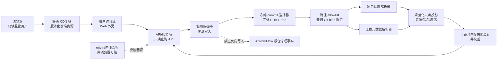

# AI Workflow Control Center 发布完整性架构

## 0. 交付元数据

| 字段 | 值 |
|---|---|
| 文档版本 | v1.1 |
| 工作项 | `CC-ARC-101` |
| 变更 | `arch-20260817-control-release-completeness-001` |
| 架构产物 | `artifact-control-release-completeness-architecture-001` |
| 进入授权 | `approval-20260817-control-release-completeness-architecture-entry` |
| 基线 | `5c88e3d177a059369fb98a7861a4953556f0dcb9`（路由前安全检查点：`9aa80dee3bb35dd729423e4fad88944073b413f6`） |
| 当前结论 | 架构候选；不代表 Reader、服务或真实数据已经实现 |
| 停止门 | `architecture-review` |
| 生产状态 | `frozen` |

本文件只冻结未来发布完整性实现必须遵守的只读架构契约。它不写入应用代码、数据库、worker、连接器、服务、Git 或工作流，也不授权任务拆解、下游路由、DNS/CDN/证书/Nginx/云资源或部署。

### 0.1 当前事实（不可被设计稿覆盖）

- 当前仪表盘数据是 `demo/pending static data`；设计资产和旧静态前端不是实时监管服务。
- 真实 workflow Reader、真实数据接入和服务均为 `not-implemented`；当前正式数据状态只能是 `not_ready`。
- `control-center/db/schema.ts` 为空；本架构不把它当作已存在的事实库，也不引入权威监管数据库。
- 对业务文件、Git 工作树/索引/远端、workflow ledger、数据库和外部系统的写副作用预算恒为 `0`。
- Control 是四项目治理事实的旁路消费者。它不可成为任一项目的启动、运行、恢复、发布或审批前置条件。

### 0.2 v1.1 定向修订历史

v1.0（SHA-256：`e0b16cc08d65aaf758a2d04de27764859cc2b554eea064103f62ee33d630fad6`，提交：`c05528150e32f88d88eb92b59afda13944dca5e8`）独立审查结论为 P0=0、P1=1、P2=0，`decision=changes-requested`。唯一 P1-01 指出：冻结 blob Reader 禁读 worktree/index，但 PRD 仍要求以不泄露内容的方式报告工作副本状态。本 v1.1 仅补充与 `CommitSnapshot Reader` 严格隔离的 `WorkingCopyStatusProbe`、哈希验证语义和负向验收；不改变投影来源、数据边界、运行状态或任何实现授权。

## 1. 权威输入与裁决顺序

下列内容均在本次入场时重新计算 SHA-256；哈希不一致时应停止架构交付而不是用记忆补全。

| 输入 | 路径 | SHA-256 |
|---|---|---|
| 共享边界 ADR | `architecture/03-four-project-shared-boundary-adr.md` | `e3073a01ceda280b8dda4d77b58de7e9755d3f77d21f6ebb5497c8882508840a` |
| 四项目重排计划 | `docs/04-four-project-release-completeness-replanning-plan.md` | `96decb8f1835cc85bd530c21b2969d4d077f31e6086425ea911f9d5b187bbe26` |
| 真实可用产品增量 | `docs/05-four-project-real-usable-product-delta.md` | `e613e79f44100840542fb6531e155cf0edd0079a6fc213af328fba075750bc01` |
| 五类地址边界 | `architecture/02-domain-cdn-service-boundary.md` | `d8d7a594b18195e85795b01c7c9c6829222571ba65ddb9629256fab2cf29114b` |
| Control PRD | `control-center/docs/02-prd.md` | `cb41e5e4184fd8df69b8bf1269ae0ef11b540f17f2cb621f6e5da484f9660b93` |
| 发布完整性附录 | `control-center/docs/02-prd-release-completeness-appendix.md` | `624e6e8cfc724f909e912faa00de8726101a38bd1a05ef7f10471f9d20ad4aa5` |
| UI Prompt | `control-center/ui/02-release-completeness-ui-prompt.md` | `caafe53a51a77283c363483bf34b9dba843f5a1add8d7fd17c9d74a1d336570e` |
| 已批准 UI 设计 | `control-center/ui/03-release-completeness-ui-design-v1.0.md` | `c7c2f707f76afaae78d3da4404484cd12f0fb3a4e288da06bbeb7496ae5700c3` |

裁决顺序为：已批准共享 ADR 与本项目 PRD/附录优先于 UI 视觉表述；结构化治理事实优先于 README、硬编码演示数据与聊天推测；冲突必须并列标为 `conflict`，不得静默挑选结论。

## 2. 架构决策与边界

| 决策 | 冻结内容 | 原因与禁止行为 |
|---|---|---|
| AD-01 | 使用现有 Node.js 22.13+、TypeScript、npm 和现有 Web 外壳；未来 Reader 是同一项目中的独立只读模块。 | 不把现有 `next`/`vinext` 演示外壳说成已具备服务端事实读取；不在本轮改动入口或依赖。 |
| AD-02 | `CommitSnapshot Reader` 真实模式只从一个已解析的**冻结 Git commit tree 的 blob**读取。 | 禁止把 worktree、index、未提交文件或“读取后自行算 SHA”伪装为该 commit 的事实；独立状态 Probe 也不得反向提供其内容。 |
| AD-03 | 只允许项目治理路径及已登记、可结构化确认的问题/发布证据；输出仅为最小字段投影。 | 禁止任意路径、根仓外路径、隐藏目录、原始聊天、业务正文、凭证或 `.git` 内部内容回显。 |
| AD-04 | 每项目、每数据域和每条 JSONL 记录独立隔离解析；失败只影响声明的 `impact_scope`。 | 禁止一个坏 YAML/JSONL 行使其他项目的真实结果消失，或静默跳过坏行。 |
| AD-05 | 监管快照仅是可丢弃的内存派生缓存，键必须绑定 commit 与 source set。 | 禁止建权威 Control 数据库、把缓存当真相、把缓存时间当业务更新时间，或把缓存写回源项目。 |
| AD-06 | 所有查询、刷新、筛选和导出都是零源写的只读动作。 | 禁止审批/状态迁移/问题流转/发布/Git/备份执行、自动修复或等价的间接写入。 |
| AD-07 | 健康、就绪、内容真相态与 demo 模式分离。 | HTTP 200、静态页面、演示数据、CDN 新鲜度或空数组不得冒充 `live`。 |
| AD-08 | 采用用户访问、静态 CDN、API、origin、internal 五类地址分层；当前未配置的资源保持 `TBD/UNKNOWN`。 | 禁止编造域名、端口、云厂商、证书、预算、凭证或让浏览器直连 origin。 |
| AD-09 | `WorkingCopyStatusProbe` 只产生 `clean`、`working_copy_modified` 或 `unknown` 三态 sidecar 元数据。 | 禁止返回/缓存变更路径、diff、正文、未提交 SHA、索引内容或把状态用于 source set、投影、优先级、哈希裁决或批准推断。 |

### 2.1 明确不做项

本候选不授权 `CC-PM-101`、读取器/数据库/worker/连接器实现、真实文件或 Git 读取、服务启停、测试执行、UI 改造、数据采集、生产部署或任何云端操作。它也不共享四项目业务模型、数据库、账号、Cookie、运行时或写控制面。

## 3. 目标架构（未来实现契约）



运行时事实边只允许 `项目治理事实 → Control 只读投影 → 用户查询`。治理/角色排队顺序不是运行时依赖图；Control 不可用时，四个项目仍必须可独立工作。

### 3.1 模块边界与未来目录责任

| 模块（未来） | 职责 | 允许输入/输出 | 禁止职责 |
|---|---|---|---|
| `app/` 与 UI adapter | 渲染 12 个 P0 目的页、调用只读 API、展示简中真相态/来源/无障碍等价表。 | 只接收版本化 API 信封；demo 必须物理/逻辑标识。 | 从浏览器读取根仓、硬编码真实汇总、静默静态回退或写操作。 |
| `reader/commit-snapshot` | 解析一个完整 commit、枚举 allowlist tree entry、读取 blob 并建立 source set。 | 完整 `root_head`、固定 allowlist、Git object bytes。 | worktree/index 读取、任意 ref/path、Git 写命令或远端网络操作。 |
| `reader/working-copy-status-probe` | 以受控、不带参数的本地状态原语观察三态工作副本元数据。 | 仅状态枚举 `clean`、`working_copy_modified`、`unknown`；观察时间由协调器另行附加。 | 路径/列表/diff/正文/未提交 SHA/index 内容、source set、缓存、事实裁决、批准推断和任何写操作。 |
| `reader/parsers` | YAML/JSONL/已登记结构化证据的安全解析、schema 版本校验、逐项目错误隔离。 | 单个受限 blob；规范化记录/错误。 | 执行源文本指令、加载插件、网络访问、跨项目推断。 |
| `projection/` | 项目、角色、审批、产物、事件、问题、发布、来源和成熟度的只读投影。 | 已验证记录与来源元数据。 | 修改源、生成审批/路由、用文件存在推断正式性。 |
| `api/` | 有界查询、读刷新、导出、健康/就绪、错误信封。 | 规范化快照。 | 文件路径参数、写 API、缓存作权威事实。 |
| `observability/` | 脱敏日志、指标、审计读事件与零写断言。 | 元数据、耗时、错误码。 | 文件正文、凭证、根仓外绝对路径或原始聊天。 |
| `db/schema.ts` | 保持当前为空。 | 不适用。 | 用空 schema 暗示已有权威库，或在本架构阶段创建表/迁移。 |

未来实现可新增上述模块，但不得移动既有 `app/`、`db/`、`worker/`、`public/` 或 `.openai/` 入口；目录变更和实现必须经后续工作项独立授权。

## 4. 数据分类、owner 与允许流向

| 数据类别 | 权威 owner / 存储 | Control 可读投影 | 派生缓存 | 写权限 |
|---|---|---|---|---|
| 项目身份与项目级治理 | 对应项目；`project.yaml` 与 `workflow/*` 的冻结 commit blob | 项目 ID、阶段、门、角色、批准/待审、产物元数据、事件摘要与来源证明 | 内存、按 snapshot key 可重建 | Control：`0` |
| 已登记问题/发布证据 | 对应项目；工作流记录或已登记、带类型/版本/SHA 的结构化证据 | 结构化问题/发布字段、覆盖状态、来源关系；不投影正文 | 内存、可丢弃 | Control：`0` |
| Control 自身演示数据 | `control-center` 静态演示资产 | 仅 `mode=demo` 页面；永不并入真实统计/导出/就绪 | 静态包，不是监管缓存 | 本单元：`0` |
| 项目业务/私有数据 | 各项目自己的业务域 | 不可读、不可返回、不可记录其内容 | 不缓存 | Control：`0` |
| Git 元数据与工作副本 | 根仓 | 仅完整 commit 标识及受控观测状态；不返回对象正文 | 不适用 | Control：`0` |
| 凭证、环境、聊天、浏览器/Codex 状态 | 不属于 Control 数据域 | 一律拒绝 | 一律拒绝 | Control：`0` |

Control 只消费共享 ADR 所定义的稳定治理信封，不引入万能业务 schema。公共、私有、用户、AI/语音或来源内容均不得经 Control 成为跨项目数据通道。

## 5. 一致观测、allowlist 与隔离解析

### 5.1 允许路径和硬拒绝规则

未来 Reader 只允许从固定的 AIWorkFlow 根及如下路径集合读取；allowlist 是代码配置/经审核 policy，不接受客户端参数扩张：

1. `control-center/project.yaml` 与 `projects/*/project.yaml`，仅用来发现已登记项目；项目 ID 和相对根必须符合受限标识符规则。
2. 每个已登记项目根下的 `workflow/state.yaml`、`workflow/approvals.yaml`、`workflow/artifacts.yaml`、`workflow/events.jsonl`。
3. 只有被第 2 项中已验证的 artifact registry 显式登记为**问题或发布证据**、同时具备项目相对路径、允许 artifact type、schema version 和 SHA-256 的普通文本 blob，才能进入二级 allowlist；只提取已定义的结构化字段，不输出正文。

下列任一输入必须在打开内容前拒绝：绝对路径、`..`、NUL、反斜杠歧义、根仓外路径、未登记隐藏文件、`.git/`、`.env*`、凭证、数据库、缓存、session、浏览器状态、源代码正文、Git symlink（mode `120000`）、submodule（mode `160000`）、非普通 blob、超出 ReaderPolicy 限制的对象、未验证的证据路径。`project.yaml` 中出现的路径也只是待验证声明，不是读取授权。

### 5.2 冻结 commit-blob 算法

真实模式只采用以下强一致模式，禁止 worktree/index 回退：

1. 观测协调器在唯一允许根中取得 `root_head_before`，解析为一个可读的完整 commit `C`；无法解析、歧义或对象损坏时本轮 `failed`。
2. 只在 `C^{tree}` 中列举第 5.1 节 allowlist，逐项验证规范化路径、tree mode、所属项目和 blob OID。客户端不得提供 ref、path、glob 或 Git 参数。
3. 仅从 `C` 的 object database 读取对应 blob bytes，重新计算每个内容 SHA-256；禁止读取工作树、index、未提交文件，也禁止用工作树 SHA 给 `C` 背书。
4. 建立按 path 排序的 `source_set`：`{path, tree_mode, git_blob_oid, sha256, source_kind, project_id}`。`source_set_sha256` 对规范串 `path<TAB>tree_mode<TAB>git_blob_oid<TAB>sha256<LF>` 求 SHA-256，并反查每项仍为 `C` 对应 tree entry。
5. 在受限解析器中逐文件验证 schema、大小、行数、深度和解析时限；每项目/数据域独立产生 `ProjectionResult` 或 `ProjectionFailure`。JSONL 坏行必须记录 line number、内容哈希和错误码，其他可解析行仍可用。
6. 只有在 source set 完整可证明归属 `C` 后，才计算投影、事实优先级冲突和快照 hash。快照键为 `root_head + source_set_sha256 + projection_schema_version + projection_kind`。
7. 结束时读取 `root_head_after`。若其不同于 `C`，本轮 blob 虽自身一致，却不是“当前”观测：丢弃为当前快照、返回 `ROOT_HEAD_CHANGED`，再从新 head 全量读取；绝不跨 commit 拼接。
8. `HEAD` 未变化但 worktree/index 改动不会污染 commit-blob bytes；这些未提交内容不得进入 source set。若实现路径试图读取它们，整轮以 `WORKTREE_READ_FORBIDDEN` 阻断。

`source_set_sha256` 证明内容属于声明 commit，不是若干独立文件 SHA 的松散列表。若任一 blob 不属于 `C`、tree mode/OID/hash 不符、path 逃逸或 schema 失配，受影响投影必须失败/降级；禁止改读工作树或复用不匹配缓存。

### 5.3 `WorkingCopyStatusProbe`（三态、零内容 sidecar）

`WorkingCopyStatusProbe` 是为满足 PRD 的工作副本状态展示而定义的**独立元数据通道**，不是 `CommitSnapshot Reader` 的输入、回退或权限扩张。它只能由观测协调器在可信根上调用；客户端不能提供 path、ref、glob、命令、环境变量或任何读取目标。

1. Probe 使用经过实现审查的固定、只读本地状态原语，只得出 `clean`、`working_copy_modified` 或 `unknown`。它在边界处立即丢弃路径、文件名、diff、正文、字节数、未提交 SHA、index 条目和对象内容；响应、日志、trace、导出和错误信封均不得恢复这些信息。
2. Probe 在调用前后各读取一次受控根的当前 `HEAD` 标识；只有两次均等于本轮冻结 commit `C` 时，才可返回 `clean` 或 `working_copy_modified`。Probe 不可用、权限不足、根身份不可证明、任一检查失败或 `HEAD` 变化时，一律返回 `unknown`，不尝试工作树内容回退。
3. Probe 结果只能作为 API 响应上的 `working_tree_state` sidecar。它不进入 `source_set`、`source_set_sha256`、projection hash、缓存键/缓存值、`as_of`、事实优先级、内容真相态、coverage、readiness、审批/产物状态或其哈希验证、错误裁决；快照仍只由 `C` 的普通 blob 建立。
4. `working_copy_modified` 只表示“受控 Probe 观察到该根存在未提交状态”，不说明哪个路径、是否为 allowlisted 路径、是否为敏感路径、内容或影响范围，更不表示任何记录已批准、已核验或将被纳入投影。`clean` 也不构成工作副本内容哈希验证。
5. Probe 不得执行 Git 写命令、远端操作、文件修复、缓存持久化或任何业务/workflow/数据库写入。它的不可用不会触发写入、重试风暴或用 demo 代替真实状态。

### 5.4 解析与事实冲突策略

- 同一事实的优先级固定为：`state + 最新结构化 event` → `approvals/artifacts` → 已验证 commit/部署证据 → `project.yaml` → 概述文档。高优先级冲突保留双方来源并标 `conflict`；Control 不作裁决。
- `hash_mismatch` 只比较登记的历史哈希与**同一冻结 commit `C`**中可读取的对应 blob；无权读取或未登记的文件不得被当作 mismatch 依据。Probe 为 `working_copy_modified` 时，工作副本哈希验证必须为 `not_verified_due_to_working_copy`：服务只能说明“登记哈希与 `C` 的 blob 的关系”，不得称当前工作副本文件匹配/不匹配。Probe 为 `clean` 也不读取或核验工作副本字节；Probe 为 `unknown` 时工作副本哈希同样为未知。
- 问题/发布无结构化登记时，分别返回 `coverage=not_available`，不能返回未经证明的 `0` 或成功发布。
- 缺失后端/真实数据/生产证据必须为 `unknown/not_ready`；目录存在、URL、HTTP 200、UI 设计或 demo 都不构成完成证据。

## 6. 只读投影模型与版本语义

所有 API 响应与导出采用兼容的 `GovernanceEnvelope v1`。未知字段只可忽略；缺失必填字段、未知主版本或 hash 不可证明均不得猜测。

```yaml
GovernanceEnvelope:
  schema_version: "1.x"
  project_id: workflow-control-center | ai-model-radar | market-analysis-dev | ai-english-learning | null
  projection_kind: projects|roles|approvals|artifacts|events|issues|releases|sources|maturity|system
  mode: live|demo
  truth: live|empty|not_ready|degraded|stale|failed|conflict|hash_mismatch
  root_head: 40-hex-git-sha | null
  source_set_sha256: sha256 | null
  source_set: [{path, tree_mode, git_blob_oid, sha256, source_kind, project_id}]
  source: [{path, sha256, source_updated_at, git_blob_oid, line_number?}]
  version: {projection_schema_version, root_head, source_set_sha256, revision?}
  as_of: timestamp | null
  observed_at: timestamp
  last_success_at: timestamp | null
  freshness: current|stale|unknown
  coverage: complete|partial|not_available
  working_tree_state: clean|working_copy_modified|unknown  # WorkingCopyStatusProbe sidecar only
  working_copy_probe_observed_at: timestamp | null
  working_copy_hash_verification: not_verified_due_to_working_copy|not_verified_due_to_probe|not_performed
  impact_scope: {project_id, data_domain, record_id?, source_path?}
  data: object | array | null
  errors: [ErrorEnvelope]
```

`as_of` 是被投影事实自身的业务时间，不可用 `observed_at` 替代；时间不明即为 `null/UNKNOWN`。`UNKNOWN` 不等于 `0`，`empty` 不等于 `not_ready`，`demo` 不等于 `live`。前端须将 `mode=demo` 物理/视觉隔离，且 demo 数据不能进入真实统计、导出、readiness 或发布证据。

`working_tree_state` 与 `working_copy_probe_observed_at` 是临近响应时由第 5.3 节 Probe 附加的非权威 sidecar，不属于 `source`、`source_set`、版本、缓存或投影事实。`working_copy_hash_verification` 只描述**未执行**的工作副本验证原因：dirty 时固定为 `not_verified_due_to_working_copy`，Probe 不可用或 HEAD 不稳定时为 `not_verified_due_to_probe`，clean 时为 `not_performed`。任何 `hash_mismatch` 仍只针对登记历史与冻结 `C` 的 blob。

主要投影实体为 `ProjectProjection`、`RoleOccupancy`、`ApprovalProjection`、`ArtifactProjection`、`EventProjection`、`IssueProjection`、`ReleaseProjection`、`SourceCoverage` 和 `MaturityEvidence`。每个实体必须保留 `project_id`、来源、哈希、观测时间与 `root_head`；角色 ID 固定为 00–11，不能按项目复制角色。

## 7. API 契约（未来，尚未实现）

所有未来 API 位于 `/api/v1`，只接受枚举、ID、时间区间、受限筛选与分页 cursor；不接收文件路径、Git ref、命令、SQL、URL 或自由数据源。响应始终带第 6 节信封，错误也遵从第 8 节。

| 方法与路径 | 用途与成功语义 | 只读/边界 |
|---|---|---|
| `GET /healthz` | 仅进程/版本/启动时间。 | `200` 不能代替 readiness 或真实数据。`Cache-Control: no-store`。 |
| `GET /readyz` | 返回 `ready/degraded/not_ready`、覆盖、最近成功、根提交与错误摘要。 | 无成功快照或根不可定位即 `not_ready`；不填充 demo。 |
| `POST /observations:refresh` | 发起一次仅内存中的读观测；请求体只含 `idempotency_key` 与固定枚举 scope。 | 不创建源写入、不接受路径、不执行 Git 写命令；同键同 scope 返回同一进行中/已完成结果。 |
| `POST /observations/{observation_id}:cancel` | 取消尚未越过发布 fence 的读操作。 | 只终止内存任务；已形成快照不得被“取消”改写，重复取消稳定返回状态。 |
| `GET /projects`、`GET /projects/{project_id}` | 项目、阶段、真实性四轨、门、阻塞、来源。 | 有界分页；未登记后端/生产即 `unknown`，不推断。 |
| `GET /roles` | 唯一固定角色及跨项目 active/queued/awaiting-review/blocked/unknown 关系。 | 不提供在线/绩效猜测。 |
| `GET /approvals`、`GET /artifacts` | 已决策与待审分离；产物版本、哈希、关系和 mismatch。 | 不提供批准、打回或路由动作。 |
| `GET /events` | 稳定排序的结构化事件及坏行缺口。 | cursor、时间和类型均受限；不返回原文件正文。 |
| `GET /issues`、`GET /releases` | 已登记的真实问题/发布证据和覆盖。 | 无登记为 `coverage_not_available`；URL/HTTP 200 不形成发布。 |
| `GET /sources`、`GET /maturity`、`GET /system-status` | allowlist、source set、新鲜度、错误、成熟度证据及三态工作副本 sidecar。 | Probe 只返回三态；不返回路径、diff、正文、未提交 SHA 或 index 内容，且不影响内容快照。 |
| `GET /exports/current` | 流式导出当前**真实**查询快照、筛选、来源、hash、生成时间和模式。 | 不落盘、不输出原文/凭证/绝对路径；demo 导出必须带 demo 标签。 |

`POST` 在此仅为语义清晰的读操作命令，不代表对任何业务、Git、workflow 或数据库的写权限。若未来 API 认证、局域网/远程访问或导出格式需要扩展，必须先补权限模型与安全审核；当前授权模式为 `UNKNOWN`，默认只绑定本机受控访问。

### 7.1 刷新、取消与快照发布

`ObservationRequest(idempotency_key, scope)` 在进程内聚合为一个 `ObservationRun`；状态仅为 `queued → running → cancelled|failed|completed`，并在 `publication_fence` 前检查取消。完成快照须同时满足：完整 frozen commit 证明、source set 验证、至少一个有效项目、无 `root_head` 前移、所有结果来自同一 `C`。只有该条件满足才能原子替换内存 `current_snapshot`。`WorkingCopyStatusProbe` 仅能在快照形成后附加响应元数据；它不参与 `publication_fence`、快照写入、缓存命中或缓存失效。

单项目/单数据域失败允许产生 `degraded` 快照，并保留成功项目的真实事实与失败清单；根不可定位、没有有效项目、commit 不可证明或 Reader 触碰 worktree/index 时为 `not_ready/failed`，不发布伪部分结果。已有成功快照遇本轮失败可按规则保留为 `stale`，但它的 `root_head`、`last_success_at` 和失败原因不可覆盖为当前。

## 8. 真相态、错误信封与失败恢复

| 真相态 | 判定 | 可返回内容 |
|---|---|---|
| `live` | 同一 frozen commit 的真实读观测成功，当前 head 未前移且覆盖完整。 | 当前投影、完整来源与覆盖。 |
| `empty` | 已成功查询，且在声明范围内确实无匹配。 | 空结果、过滤范围与 `coverage=complete`。 |
| `not_ready` | 无有效观测、根/项目清单不可形成或服务刚重启无内存快照。 | 安全状态/错误，不返回 demo 项目。 |
| `degraded` | 至少一个项目/数据域成功，另有可定位失败或覆盖缺口。 | 可用范围、失败范围、最后成功和恢复说明。 |
| `stale` | 最近真实成功快照仍存在，但后续读取失败或超过 freshness policy。 | 原快照及显著的旧时间/失败原因；不称实时。 |
| `failed` | 本次不能安全产生或保留可用真实结果。 | 脱敏错误和影响范围。 |
| `conflict` / `hash_mismatch` | 高优先级源冲突，或登记/冻结 blob 哈希不一致。 | 并列来源；不自动修复或裁决。 |

错误统一为：

```yaml
ErrorEnvelope:
  code: string
  message: localized-safe-summary
  retryable: boolean
  occurred_at: timestamp
  request_id: string
  source: [{path, git_blob_oid?, sha256?, line_number?}]
  root_head: 40-hex-git-sha | null
  source_set_sha256: sha256 | null
  impact_scope: {project_id, data_domain, record_id?, source_path?}
  remediation: retry|fix-source-outside-control|contact-owner|not-applicable
```

最低错误码包括：`ROOT_UNAVAILABLE`、`DECLARED_COMMIT_UNAVAILABLE`、`ROOT_HEAD_CHANGED`、`SOURCE_PATH_FORBIDDEN`、`SOURCE_NOT_IN_DECLARED_COMMIT`、`SOURCE_BLOB_MISMATCH`、`WORKTREE_READ_FORBIDDEN`、`WORKING_COPY_PROBE_UNAVAILABLE`、`WORKING_COPY_PROBE_HEAD_CHANGED`、`SCHEMA_UNSUPPORTED`、`YAML_PARSE_FAILED`、`JSONL_LINE_INVALID`、`EVIDENCE_NOT_REGISTERED`、`COVERAGE_NOT_AVAILABLE`、`CACHE_MISS_AFTER_RESTART`、`CACHE_CORRUPT`、`QUERY_LIMIT_EXCEEDED` 与 `WRITE_CAPABILITY_FORBIDDEN`。Probe 错误只允许使 sidecar 为 `unknown`，不得泄露正文、秘密、根仓外绝对路径、变更路径或 index 内容。

### 8.1 缓存、重建、备份与回滚

- MVP 只允许可丢弃的**内存**快照缓存；不使用 `db/schema.ts`、不建立持久化监管事实库、也不把缓存写入源项目。
- 缓存键包含 `root_head + source_set_sha256 + projection_schema_version + projection_kind`。读取前须验证键和 envelope；不匹配/损坏即丢弃。
- `WorkingCopyStatusProbe` 的三态、观察时间和任何失败原因均不写入快照缓存或缓存键；每次响应只能重新附加一个 sidecar，不能从旧缓存复活 dirty/clean 结论。
- 服务重启后缓存为空：`not_ready`，直到从冻结 commit blobs 重新建立快照。缓存丢失不会丢失源事实。
- 根仓恢复/应用回滚后只能重新观测被明确的冻结 commit；输出标出恢复点与 `root_head`。Control 不执行 Git restore、backup、rollback 或任何源修复。
- 已允许旧快照的前提是最近成功真实快照存在且 freshness policy 允许；没有首个真实成功时绝不返回 `stale`。阈值、保留期和容量目前均为 `TBD`，在具体实现/运营审核前不得声明 SLA。

## 9. 安全、最小权限与零写威胁模型

| 威胁 | 必须的架构控制 | 负向验收 |
|---|---|---|
| 任意路径/路径穿越 | 固定 allowlist、tree path 规范化、拒绝绝对路径/`..`/NUL/非 blob。 | 请求 path/ref/glob、artifact 恶意路径均被拒绝且不读内容。 |
| symlink、submodule、index/worktree 混读 | `CommitSnapshot Reader` 只读 commit tree 普通 blob，拒绝 mode `120000/160000`；Probe 仅输出三态并丢弃所有细节。 | symlink、未提交文件、HEAD 不变但 index 改动均不能进入 source set、投影或缓存。 |
| Git/命令注入与远端副作用 | Reader 不接受命令参数；Probe 也不接受参数，只能调用固定只读状态原语；无 fetch/push/merge/add/commit/reset/stash。 | 审计 Git index/refs/远端前后不变，写次数为 `0`。 |
| 工作副本状态泄露或误作事实 | Probe 只返回三态，HEAD 前后不一致/不可用即 `unknown`，与 commit 投影隔离。 | dirty allowlisted/敏感路径与 index-only 均不泄露路径/正文/哈希，不改变批准、source set 或真相态。 |
| 恶意 YAML/JSONL/Markdown | 安全 parser、禁锚/别名扩张、大小/深度/时限、文本不作为指令执行。 | 畸形、超限、指令样式内容只产生局部错误，不执行任何动作。 |
| 缓存投毒/陈旧冒充当前 | content-addressed key、完整 source set、过期显式化、缓存非权威。 | hash 不符、cache 损坏、失败重读不会成为 `live`。 |
| 控制面越权 | API 无审批/状态/Git/发布/问题写能力；服务身份无源写权限。 | 所有写路径 404/405 或 `WRITE_CAPABILITY_FORBIDDEN`，源文件/Git/workflow/DB/外部写均为零。 |
| 日志或导出泄露 | 字段白名单、脱敏日志、导出只含投影与来源元数据。 | 凭证、正文、原聊天、根仓外路径、环境变量在响应/日志/trace 中为零。 |
| 误把 Control 作为项目控制面 | 单向数据 DAG、项目不依赖 Control ready、接口不含路由操作。 | Control 不可用时四项目独立路径仍可运行；无反向调用。 |

未来服务应以专用、最小权限本地读取身份运行：仅能读取受控根与 Git object database，不能写根仓、Git、workflow、业务数据库或网络目标；默认禁止外网 egress。该账号、OS 权限、容器/沙箱、认证与密钥管理的具体实现均为 `TBD`，在权限评审前不得扩大网络可见范围。

## 10. 五类地址、缓存与网络边界

| 环境 | 用户访问域 | 静态 CDN 域 | API/服务域 | origin 回源域 | internal 监听 | 当前结论 |
|---|---|---|---|---|---|---|
| local | 已知 UI 入口：`http://127.0.0.1:4175/?view=overview` | 与本地 Web 同进程（开发例外） | Reader/API 端口 `TBD` | 不适用 | `TBD` | 仅有静态演示，非真实 Reader。 |
| test/staging | `workflow.stg.${PUBLIC}` | `static-workflow.stg.${PUBLIC}` | `api-workflow.stg.${PUBLIC}` | `origin-workflow.stg.${ORIGIN}` | 私网/提供商绑定 `TBD` | 命名契约，非资源存在证明。 |
| production | `workflow.${PUBLIC}` | `static-workflow.${PUBLIC}` | `api-workflow.${PUBLIC}` | `origin-workflow.${ORIGIN}` | 私网/提供商绑定 `TBD` | 生产冻结，域名/资源均未知。 |

- 浏览器访问用户域/静态 CDN；源站不作为浏览器备用入口。静态 hash 资源可长缓存并以版本化文件名回滚；HTML/SSR、API、`/healthz`、`/readyz`、导出和错误响应均为 `Cache-Control: no-store`，不得误缓存治理事实。
- DNS、CNAME、SNI/证书、回源 Host、WAF、安全组、真实客户端 IP、CORS、CSRF、Cookie、WebSocket/SSE、具体端口、云厂商、预算和责任人全部 `TBD/UNKNOWN`。本单元不创建或修改任何此类资源。
- 若未来使用 Cookie，其必须 host-only、精确 SameSite/CORS/CSRF 策略；不得使用父域 Cookie、跨项目会话或将 localStorage 当访问控制事实。当前本地受控访问不声明已存在登录/认证。

## 11. 可观测性、测试与验证门

### 11.1 最小可观测性

未来实现必须输出无正文、可关联的 `request_id`、`observation_id`、`root_head`、`source_set_sha256`、`mode`、`truth`、`coverage`、`impact_scope`、解析耗时、项目成功/失败数、缓存命中和重建原因。必需指标包括：

- `control_observation_total{result,truth}`、`control_project_parse_total{project_id,result}`、`control_jsonl_invalid_lines_total`；
- `control_snapshot_age_seconds`、`control_source_coverage{project_id,data_domain}`、`control_root_head_changed_total`；
- `control_working_copy_probe_total{state}`、`control_working_copy_probe_unavailable_total`；指标不得含路径、文件名、hash 或 diff；
- `control_cache_total{result}`、`control_read_bytes_total`、`control_query_rejected_total{reason}`；
- `control_source_write_attempt_total`、`control_git_write_attempt_total`、`control_workflow_write_attempt_total`、`control_external_write_attempt_total`，四者必须持续为 `0`；非零即安全阻断。

日志/trace 不得记录 YAML/JSONL/Markdown 原文、凭证、Cookie、环境变量、用户输入、聊天或完整本机绝对路径。告警阈值、日志保留期、SLO、遥测后端和预算均为 `TBD`，不在此架构中假定存在。

### 11.2 命令与测试矩阵

现有 `npm run lint`、`npm run typecheck`、`npm test`、`npm run build` 是当前静态 UI 项目的命令；它们**不是** Reader/真实服务已实现或已验证的证据。下表是后续实现必须登记的唯一测试类别，当前全部 `NOT_IMPLEMENTED`，不得在本架构交付中宣称已运行。

| 类别 | 未来命令合同 | 当前状态 | owner / 最晚门 |
|---|---|---|---|
| 静态/类型 | `npm run lint`；`npm run typecheck` | 现有 UI 命令，不覆盖 Reader；Reader 覆盖 `NOT_IMPLEMENTED` | 固定 07；代码审查前 |
| 单元 | `npm run test:reader-unit` | `NOT_IMPLEMENTED` | 固定 07；CC-BE-002 前 |
| 契约 | `npm run test:reader-contract` | `NOT_IMPLEMENTED` | 固定 07/10；CC-BE-003 前 |
| 集成 | `npm run test:reader-integration` | `NOT_IMPLEMENTED` | 固定 07；CC-BE-003 前 |
| 快照重放 | `npm run test:snapshot-replay` | `NOT_IMPLEMENTED` | 固定 08/07；CC-DATA-001/CC-BE-003 前 |
| 恢复/缓存 | `npm run test:cache-rebuild` | `NOT_IMPLEMENTED` | 固定 08/10；CC-QA-101 前 |
| 安全零写 | `npm run test:reader-security` | `NOT_IMPLEMENTED` | 固定 09/10；CC-REV-001/CC-QA-101 前 |
| E2E/可访问性 | `npm run test:control-e2e` | `NOT_IMPLEMENTED` | 固定 06/10；CC-QA-102 前 |
| 性能 | `npm run test:reader-performance` | `NOT_IMPLEMENTED` | 固定 07/10；发布证据前 |

必须覆盖的负向样本至少包括：根不可读、commit 缺失、CommitSnapshot Reader 的 HEAD 中途变化、HEAD 不变但 index-only/worktree 改动、path traversal、symlink/submodule、秘密路径、对象超限、坏 YAML、坏 JSONL 单行、schema drift、单项目隔离、冲突优先级、hash mismatch、cache 损坏/删除/重启重建、`empty != not_ready`、demo 不进入 live、HTTP 200 不替代 readiness、导出不含正文以及所有源/Git/workflow/数据库/外部写计数为零。

`WorkingCopyStatusProbe` 还必须独立验证：dirty allowlisted 路径只返回 `working_copy_modified`，投影仍来自 `C`；dirty 敏感路径同样不泄露路径/正文/未提交 SHA；仅 index 改动且 HEAD 不变仍不会进入 source set 或批准判断；Probe 不可用返回 `unknown` 且不读取工作副本内容；Probe 前后 HEAD 变化返回 `unknown`，同时保留 CommitSnapshot 的 `ROOT_HEAD_CHANGED` 丢弃/重读规则。上述每项均断言 source/Git/workflow/业务/远端写为 `0`，且 dirty 状态不会推导出批准、拒绝或任何已核验结论。

### 11.3 发布阻断条件

在以下任一条件下，不得称 Control 发布完整、真实可用或生产就绪：Reader/真实 API 未实现；任一 P0 目的页仍依赖 demo/static 回退；source set 无法证明归属冻结 commit；读取 worktree/index；允许路径或敏感字段存在逃逸；一次观测混合 commit；缓存被当权威；健康替代 readiness；单项目失败无法隔离；零写测试非零；中文/键盘/屏幕阅读器/320px/200% 无法完成 P0；或 P0/P1 审查问题未清零。

## 12. AC 映射、已知限制与重审触发器

本架构覆盖 `AC-CC-BE-01..28` 与 `AC-CC-REL-01..16`：健康/就绪（第 7–8 节）、所有治理域及来源（第 6–7 节）、hash/事件损坏/覆盖（第 5–6 节）、真实前后端分离（第 0、7、10 节）、重启重建与降级（第 8 节）、零写安全（第 9、11 节）以及访问/缓存边界（第 10 节）。实际 AC 通过只能由后续实现、审查和 QA 证据确认。

| TBD / 风险 | owner | 最晚解决门 | 阻断范围 |
|---|---|---|---|
| ReaderPolicy 的对象大小、行数、解析时限、freshness 阈值、并发和缓存容量 | 固定 05 + 固定 07 + 产品 owner | CC-DATA-001 / CC-BE-001 | 真实 Reader 实现与性能声明 |
| workflow schema 版本、已登记问题/发布证据的精确 artifact type | 固定 08 + 各项目 owner | CC-DATA-001 | 二级证据 allowlist 与跨项目聚合 |
| 本地/远程身份、专用最小权限读取账号、授权和审计保留 | 固定 05 + 固定 09 + 固定 11 | CC-REV-001 | 网络暴露、远程访问与生产 |
| 域名、CDN、API/origin/internal 端口、DNS、TLS、WAF、云厂商、预算、SLO | 固定 11 + 安全/产品 owner `TBD` | CC-OPS-101 | 任意部署、切流或容量承诺 |
| UI 到真实 API 的联调、演示数据移除与完整无障碍证据 | 固定 06 + 固定 10 | CC-FE-003 / CC-QA-102 | 正式可用性声明 |

以下变化必须重新进入架构审核：Control 拟写项目/Git/workflow 或成为项目依赖；allowlist 扩展到私有/原始内容；拟从 worktree/index 读取；拟引入权威数据库、索引或跨项目账号；API/地址职责混用；引入远程访问/身份/第三方服务；或任何来源/缓存/测试证据被用于冒充实时事实。

## 13. 自查与停止门

- [x] 当前 demo/static、Reader/服务未实现、空 `db/schema.ts` 与零写事实明确，未被架构语言掩盖。
- [x] 冻结 commit blob、source set 归属、HEAD 前移丢弃、worktree/index 禁读和项目级隔离明确。
- [x] `WorkingCopyStatusProbe` 只返回三态 sidecar；不泄露路径/正文/哈希/index，不进入 snapshot/cache/优先级/批准，dirty 时工作副本哈希明确为未核验。
- [x] allowlist、二级证据门、最小投影、非权威内存缓存、API、错误/真相态、恢复与零写威胁模型明确。
- [x] 五类地址、CDN 缓存、origin 禁直连、未知资源 `TBD/UNKNOWN` 与生产冻结明确。
- [x] 所有实现/测试/服务/部署/下游工作项仍未授权；本文未创建它们。

本 v1.1 仅形成 `artifact-control-release-completeness-architecture-001` 的修订待审候选，停止在 `architecture-review`。它不自动授权 `CC-PM-101`、任何开发、服务、测试、云资源或部署。
