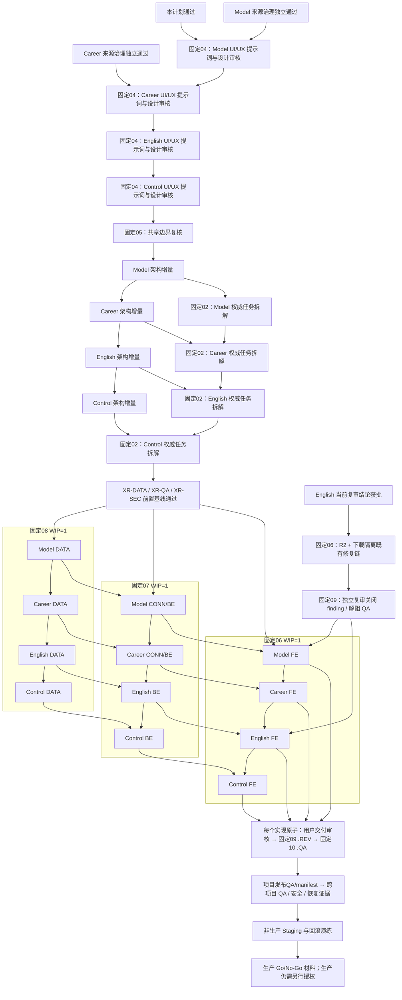

# 四项目发布完整性跨项目重排实施计划

> 版本：v1.0
> 状态：ready-for-review
> 负责人：固定 02 项目经理（`role-pm`）
> 产物 ID：`artifact-four-project-release-replanning-plan-001`
> 变更组 / 变更 ID：`plan-20260814-four-project-release-replanning-001`
> 入场授权：`approval-20260814-four-project-release-replanning-pm-entry`
> 权威路径：`docs/04-four-project-release-completeness-replanning-plan.md`
> 停止门：`cross-project-replanning-plan-review`
> 生产发布：`frozen`
> 安全编制基线：`4a7c4db030c8d873824cc3e32d3194cfc3cd4d22`
> 编制日期：2026-08-14（Asia/Shanghai）

## 1. 执行结论

四项目当前统一判定为 **NO-GO**。本计划把四份已批准发布完整性产品范围、已批准统一域名/CDN/API/origin 边界、当前实现缺口和来源治理输入，收敛为一个非生产实施序列。计划遵循以下原则：

1. 四项目全部纳入，但不并发启动多个下游角色；每次审批只前进一步。
2. 先完成发布增量 UI/UX 提示词与设计审核，再更新项目架构与权威任务拆解，之后才允许开发。
3. 采用 `AI Model Radar → Frontend Career Radar → AI English Learning → AI Workflow Control Center` 的主纵切顺序：先建立公共真实来源与证据链，再扩展到公共/私有分域、账号与 AI/语音，最后让 Control Center 消费稳定的真实治理事实。
4. 固定角色各自 `WIP=1`；允许不同角色在输入完整、文件不重叠且各自获批时形成流水线，但同一固定角色不并行两个工作项。
5. 生产 DNS、CDN、证书、云资源、Nginx、域名和发布继续冻结；本计划最多推进到非生产 Staging 验证和生产 Go/No-Go 材料准备。
6. 本计划只定义范围、依赖、任务、门禁和交接，不替产品、UI/UX、架构、开发、审查、QA 或 DevOps 作专业方案决定。

本计划的唯一下一站建议是 `MR-UI-001`：由固定 04 UI/UX 设计师编制 AI Model Radar 发布完整性 UI/UX 增量提示词，交付后停在 `ui-prompt-review`。Model 来源治理已在 commit `4a7c4db` 获批并返回重排方向门；当前计划交付仍不会启动该项。只有本计划随后获“通过”且固定04 WIP 可用时，该次计划审批才可一跳授权它。

## 2. 授权、输入与事实边界

### 2.1 已批准输入

| 输入 | 状态 | 权威证据 | 本计划用途 |
|---|---|---|---|
| 四项目发布完整性产品包 | approved | commit `b55ffe422639e3eac99dd0d73b50b41f32e01a64` | 定义完整 P0、发布 AC 与产品非目标 |
| 统一域名/CDN/API/origin 边界 v1.0 | approved / architecture-only | commit `0d7ff69d93be8b376073f83be3596a973c2483a2`；SHA256 `d8d7a594b18195e85795b01c7c9c6829222571ba65ddb9629256fab2cf29114b` | 约束五类地址、边缘安全、缓存、回源和回滚；不构成部署授权 |
| AI English Learning PRD v1.4 | approved | `artifact-english-release-completeness-prd-001`；SHA256 `8badf942aefc7ebd2c62526511aa69f0da334cefeb5688fd7281d0924e557e46` | 账号、定级、真实词库、Word、AI/语音、统计、同步与数据权利 |
| Frontend Career Radar PRD v1.3 | approved | `artifact-career-release-completeness-prd-001`；SHA256 `680a399c4984c443e7bf5f5c0aa0c628e919a061839d5659c3ddbc22ddf08705` | 方向→技术栈、持续来源、输入确认、个人证据、差距/路线与数据权利 |
| AI Model Radar 发布完整性附录 v1.0 | approved | `artifact-radar-release-completeness-appendix-001`；SHA256 `a27cfecc196c29749387302a692d93af0b5b534af7da6805b6b297e064133f1d` | 真实 live 来源、快照、趋势、来源质量与 demo 隔离 |
| AI Workflow Control Center 发布完整性附录 v1.0 | approved | `artifact-control-release-completeness-appendix-001`；SHA256 `624e6e8cfc724f909e912faa00de8726101a38bd1a05ef7f10471f9d20ad4aa5` | 真实只读治理聚合、降级/未就绪、重启重建与零写副作用 |
| Model 来源 allowlist + registry v1.0 | approved / research-only | delivery commit `102f5c2`，approval commit `4a7c4db`；`approval-20260814-radar-source-allowlist-v1`；报告 SHA256 `9aa9bb926cc52aae28d11bbf676507ca313add83238cd81be6300a4d9f2f0498`；registry SHA256 `c303e79e1fa9f7a1664ac718a1678bbcb6610b5309a5d5e4006e6d4b1d438f91` | 72 行/35 列、29 个原子端点裁决；只批准研究证据与四值决策，不代表连接器、canary 或 runtime 已启用 |
| Career 来源 allowlist + registry v1.0 | approved / research-only | delivery commit `102f5c2`，approval commit `4a7c4db`；`approval-20260814-career-source-allowlist-v1`；报告 SHA256 `8e590b31a19b8d4aecd910561ebcc5ee5e423d1dc299ebc4c2d6e4379c3e607e`；registry SHA256 `43355d302df64a323e3ee6fe299530d72fd6df8a54bb4b24a06158a9f3621b06` | 60 行/35 列、16 个原子端点裁决；13 个 P0/allow 均为技术源，`CAR-JOB-001..003` 招聘 ATS 均为 P0/conditional 且缺公司/域名允许清单；研究批准不等于自动采集授权 |

### 2.2 待审或缺失输入

| 输入 | 当前状态 | 使用规则 |
|---|---|---|
| English 存储恢复复审 | `artifact-spaced-recall-storage-recovery-code-rereview-002` 已由固定 09 交付，结论 `changes-requested`：旧 `CR-P1-001-R1` 仅 partial closure；仍有 1 个 Major `CR-P1-001-R2`（跨标签非原子 compare-then-set）+ 1 个 Minor `CR-P2-005`（浏览器测试污染 `~/Downloads`） | 当前停 `code-rereview-conclusion-review` 且 QA blocked；用户批准该结论后也只可一跳路由固定 06 修复这两个 finding，修复仍须回固定 09 复审。当前不得覆盖修复、重跑污染下载测试或启动 Word 服务适配 |
| Career 招聘 ATS 公司/域名允许清单 | 缺失；`CAR-JOB-001` Greenhouse、`CAR-JOB-002` Lever、`CAR-JOB-003` Ashby 当前均为 P0/conditional | 至少一个 ATS 模板必须绑定获批公司/board/site、具体 URL、最小字段复用和条件证据后，才能实例化 `CR-CONN-002`；缺失时 Career 完整 P0、招聘调度与发布 QA 均保持 blocked |
| Control Center 旧用户生成 UI 资产 | 原审核门保留，仍待用户资产/审核 | 仅保留旧链；不得把旧原型或私有站点标识当作本轮完整设计已获批，新发布增量按最新全局规则由固定04本人生成 |
| 四项目新版 UI/UX、业务架构与权威任务拆解 | 缺失 | 必须逐项目独立交付、独立审核，不能由本计划替代 |
| 正式域名、DNS Zone、CDN/WAF/LB、证书、源站、VPC、预算、容量、日志保留、owner/on-call | UNKNOWN / 未授权 | 不阻塞非生产规划；阻断 DevOps 实施和生产发布 |

### 2.3 当前真实实现

| 项目 | 已有能力 | 发布完整性缺口 | 当前独立门 |
|---|---|---|---|
| AI Model Radar | 可浏览 Today 纵切和 seed demo | 来源研究已批准但运行时真实连接器仍为 0；后端、持久化、真实刷新、完整页面与质量证据未齐 | 来源治理已返回 `cross-project-replanning-direction`；旧 `ui-design-review`、`frontend-delivery-review` 保留 |
| Frontend Career Radar | 可浏览方向页与内存态 Source Workbench | 来源研究已批准但运行时采集仍为 0；后端为空，账号/个人证据、差距/路线/历史与同步未实现 | 来源治理已返回 `cross-project-replanning-direction`；旧前端门和 `ui-prompt-review` 保留 |
| AI English Learning | 可运行前端与局部 Word/间隔复习能力 | 无满足 PRD v1.4 的真实后端；账号、定级、真实词库、AI/语音、跨设备未完成 | 最新固定 09 复审 `changes-requested`，`CR-P1-001-R2` + `CR-P2-005` 阻断 QA；旧 `code-rereview-conclusion-review` 与 `task-breakdown-review` 保留 |
| AI Workflow Control Center | 可浏览管理面与脚手架 | 业务数据仍含 Demo；无完整真实只读聚合、持久化/重建和发布证据 | 旧代码审查结论与用户 UI 资产门保留 |

“已有页面可浏览”不等于“功能完成”；HTTP 200、静态快照、`seed_demo`、空后端或未接真实来源均不能作为发布通过证据。

本计划必须原样保留、不得 supersede 或关闭的并行门如下；其中新 UI 增量只能另起版本链：

| 项目 | 保留 artifact / gate | 本计划处理 |
|---|---|---|
| Control | `artifact-control-center-code-review-001 / code-review-conclusion-review`；`artifact-control-center-user-ui-design-001 / ui-design-review` | held；不改变既有审查结论或用户资产等待 |
| Model | `artifact-radar-live-daily-user-ui-design-001 / ui-design-review`；`artifact-radar-frontend-001 / frontend-delivery-review-held` | held；来源治理已独立批准并返回重排方向门，不解冻旧设计/前端 |
| Career | `artifact-career-frontend-001 / frontend-delivery-review`；`artifact-career-f10-input-ui-preview-001 / frontend-delivery-review`；`artifact-career-backend-ui-prompt-001 / ui-prompt-review` | held；来源治理已独立批准并返回重排方向门，不解冻旧前端/Prompt |
| English | `artifact-spaced-recall-code-rereview-001 / code-rereview-conclusion-review`；`artifact-english-word-backend-integration-task-breakdown-001 / task-breakdown-review`；`artifact-spaced-recall-storage-recovery-code-rereview-002 / code-rereview-conclusion-review` | 前两门继续保留；第三门已 `ready-for-review / changes-requested`，开放 `CR-P1-001-R2`（Major）与 `CR-P2-005`（Minor），QA blocked；本计划不代批结论或关闭 finding |

## 3. 目标、范围与非目标

### 3.1 计划目标

- 为四项目建立一张无环依赖图、统一里程碑、固定角色容量规则和原子任务队列。
- 确保所有批准的 P0/发布 AC 都能追溯到 UI、架构、实现、测试和发布证据 owner。
- 优先形成真实数据端到端纵切，并显式隔离 demo/mock、事实/推断、公共/私有数据和读/写权限。
- 在进入生产决策前完成前后端联调、E2E、P0/P1 清零、恢复演练、安全/隐私、可观测性和可追溯制品。

### 3.2 纳入范围

- 四项目发布增量 UI/UX 提示词、固定04本人生成的设计资产审核和业务架构增量。
- 各项目权威任务拆解、真实后端/API/数据库或只读事实层、前端真联调。
- Model/Career 来源合规与真实度；English 词库、AI/语音供应能力的授权边界；Control 的只读治理事实边界。
- 单元、契约、集成、E2E、安全、隐私、简中、无障碍、备份恢复和回滚证据。
- 非生产 Staging 准备与最终生产 Go/No-Go 材料。

### 3.3 非目标

- 本计划不批准任何 UI 设计、架构技术栈、数据库、供应商、云平台或部署方案。
- 不联网采集招聘、模型或技术趋势数据，不采购数据/API/AI/语音服务。
- 不执行 DNS、CDN、证书、WAF/LB、Nginx、云资源、生产数据库或正式发布变更。
- 本轮不删除 `~/Downloads` 中现有的 22 个 `ai-english-learning-recall-backup-*.json`；仅登记测试隔离与最终可恢复清理门。
- 不把已批准的来源研究扩张成连接器/runtime 授权，不批准 English 最新复审结论、旧 UI/前端/代码审查产物，也不关闭 `CR-P1-001-R2`、`CR-P2-005` 或任何其他现存缺陷。
- 不把四项目合并成一个运行时或一个万能数据模型；共享只限稳定契约、证据与治理方法。

## 4. 共享能力与项目独有能力

| 能力域 | 适用项目 | 共享最小约束 | 项目独有边界 |
|---|---|---|---|
| 简体中文与可访问性 | 四项目 | 完整简中导航、操作、状态、图表、错误/空态、键盘、屏幕阅读、320px 响应式 | 学习、职业、模型情报、治理控制台各自术语不可互换 |
| 真相态 | 四项目 | `live / empty / not_ready / stale / degraded / failed` 可区分；禁止静默 demo 回退 | Model/Career 还需来源覆盖与样本口径；Control 还需项目级读取错误 |
| 基础可追溯性 | 四项目 | 版本、SHA、生成/读取时间、`as_of`、freshness 和错误原因可追溯 | English 追溯学习事件与词库；Model/Career 额外追溯外部来源；Control 追溯 workflow 事实 |
| 事实/推断/置信度 | Model + Career；Control 仅原样展示已登记字段 | 事实、推断、未知和置信度不可混写；Control 不自行生成业务推断 | Career 以用户确认作为事实升级门；Model 保留事件证据和推断规则版本 |
| 服务基线 | 四项目 | 配置、health/readiness、稳定错误码、脱敏日志、幂等、迁移/重建、测试入口 | 具体技术栈、端口、数据库和运行命令由各项目架构决定 |
| 身份与数据权利 | English + Career | 最小权限、租户隔离、导出/删除/保留、备份语义 | 两项目各自独立账号与业务 schema；Model 公共读为主；Control 只读治理，不复用此模型 |
| 外部来源治理 | Model + Career | robots/条款/许可/登录/付费/限流/ETag/失败降级和版本化 allowlist 的方法一致 | 两项目使用不同业务 registry 和 schema，不因方法相似而共用允许清单 |
| 发布证据 | 四项目 | AC→测试→制品→SHA→环境映射；P0/P1 与 must_fix 清零 | 每项目独立 release manifest 与独立回滚单元 |
| 边缘边界 | 四项目 | 用户域→Web CDN、静态域→Static CDN、API 域→WAF/LB、origin 仅回源、internal 仅 loopback/VPC | 域名、路径、缓存 TTL、SSE/WS、源站端口须由后续架构/DevOps冻结 |

项目独有能力如下：

- **AI Model Radar**：来源硬门、采集运行、Observation→Event/Evidence、去重/排序、不可变快照、趋势/开源口径、来源质量与刷新状态。
- **Frontend Career Radar**：职业方向→技术栈全景、招聘目的抽样、F10 双轴分类与用户确认、个人事实/证据、差距/路线/未来/历史。
- **AI English Learning**：A1–C2 定级、真实词库、Word 记忆闭环、今日计划、20 场景+自由 AI、STT/TTS、统计与提醒。
- **AI Workflow Control Center**：根仓允许路径的只读解析、固定角色/审批/产物/事件/问题/发布聚合、降级/重建、零业务写副作用。

## 5. 总体依赖图

图中 English `R2 + 下载隔离` 是既有复审返回链的独立前置分支，不受未来 Model→Career→English 前端容量排程倒置；它复审解阻后，固定06才可进入本计划的 Model→Career→English→Control 新增前端泳道。泳道内箭头只表示同一固定角色的 WIP=1 容量顺序；项目纵向箭头表示 DATA→BE→FE 输入依赖。不同固定角色在各自上游、原子 `.REV/.QA` 和不重叠写入门齐全时可流水线重叠，不表示必须等前一项目整体完成。

主关键路径按固定角色容量与持续伴随门串行为：

`计划审核 → MR-UI-001 → 四项目 UI 审核链 → 共享边界复核 → 四项目架构/任务拆解流水线 → 固定08/07/06按 Model→Career→English→Control 的 WIP=1 泳道并穿插每原子 .REV/.QA → 项目发布QA/manifest → 跨项目QA → Staging分项回滚 → 生产决策门`。

## 6. 里程碑与退出口径

时间使用“有效工作日”，不含用户审核、外部供应商、采购、账号权限、来源审批和并发锁等待；它是容量预测，不是上线承诺。

| 里程碑 | 目标窗口 | 退出条件 |
|---|---:|---|
| M0 计划与输入收敛 | T+1–5 日 | Model/Career 来源产物已分别获批；本计划获批；所有并发旧门已登记且未被误关闭 |
| M1 UI/UX 发布增量 | T+10–25 日 | 四项目提示词、固定04本人生成的设计资产和设计审核逐项通过；完整简中、真相态、错误/空态、移动端和无障碍入口有明确设计证据 |
| M2 架构与权威拆解 | T+20–40 日 | 共享边界、四项目业务架构、来源连接器队列和四份项目任务拆解分别获批；所有验证命令与数据/权限/恢复边界已冻结 |
| M3 Model 真实来源纵切 | T+35–65 日 | 全部获准P0源形成采集/刷新调度→证据→日报快照→API→前端→持续审查/QA闭环；无demo静默回退 |
| M4 Career 公共/私有纵切 | T+55–95 日 | 至少一个公司级 ATS 条件源已明确获批，全部获准技术/招聘端点、6h/每日09:00调度、公共全景、账号/输入确认、证据/差距/路线/同步和数据权利闭环通过 |
| M5 English 完整学习纵切 | T+80–135 日 | English P1独立关闭；账号、定级、词库、Word、20场景/自由AI、语音、统计、多端CAS和数据权利形成真实服务闭环 |
| M6 Control 真实监管纵切 | T+105–155 日 | 真实只读聚合替代Demo；降级、未就绪、重启重建、可观测性和零写副作用通过 |
| M7 跨项目质量与 Staging | T+130–180 日 | 四项目持续伴随门、发布QA、安全/隐私、简中/a11y、恢复/回滚、可观测性和可追溯制品全部PASS |
| M8 生产决策 | M7 后单独排期 | 四项目和跨项目门全部 PASS，工作树/制品/manifest 一致，且取得本次明确生产授权；否则保持 NO-GO |

## 7. 固定角色容量泳道与交接

| 固定角色 | WIP | 本计划内职责 | 交接点 |
|---|---:|---|---|
| 01 市场调研员 | 1 | Model/Career 来源允许清单、样本与限制证据已获批；继续只负责研究更新和 Career 公司级 ATS 条件证据，不执行运行时采集 | 可在对应工作项后续单独获批入场后供固定 04/05/08 使用；当前来源审批未路由或授权任何下游角色；端点是否 runtime enabled 仍须实现 canary/审查/QA 与对应单步审批 |
| 02 项目经理 | 1 | 本计划；各项目新版架构批准后的权威任务拆解；末端完整性验收 | 每份计划/拆解独立停门，不代路由多个开发角色 |
| 03 产品经理 | 1 | 仅在批准范围出现变更或发现未覆盖产品决策时回退处理 | PRD 增量审核通过后重新进入固定 04 |
| 04 UI/UX 设计师 | 1 | 按 Model→Career→English→Control 串行交付增量提示词，并在提示词通过后由本人生成设计说明、原型/视觉稿 | 提示词先停 `ui-prompt-review`；本人设计交付后再停 `ui-design-review` |
| 05 架构师 | 1 | 共享边界复核和四项目架构增量；冻结 API/数据/安全/运行/恢复验证边界 | 每份架构审核通过后交固定 02 拆解 |
| 06 前端工程师 | 1 | 若用户批准 English 最新复审结论，只在既有单步修复链内处理 `CR-P1-001-R2` 与 `CR-P2-005`；固定 09 再复审通过前不得做 Word 服务适配；其余按获批项目任务逐项真联调 | 每个纵切交固定 09，不并行跨项目改前端 |
| 07 后端工程师 | 1 | 按 Model→Career→English→Control 串行实现真实服务纵切 | 契约/集成证据齐备后才交固定 06/09 |
| 08 数据工程师 | 1 | 来源装载、schema、迁移、seed、备份恢复与数据质量 | 数据 artifact 通过后交固定 07；不得替来源角色批准数据 |
| 09 代码审查员 | 1 | English 当前复审已交付 `changes-requested`，等待用户审核；若后续固定06修复获批交付，先复审并确认 `CR-P1-001-R2` 关闭、`CR-P2-005` 解决且 QA 解阻；之后逐实现原子项执行2h `.REV`，再做项目发布范围与安全/隐私汇总审查 | 每个原子P0/P1=0才交固定10对应`.QA`；不同项目结论不互相替代 |
| 10 测试工程师 | 1 | 每个实现原子项执行2h `.QA`；另做AC追踪、项目发布QA、简中/a11y、恢复和跨项目回归 | 原子QA通过才申请下一实现项；发布`must_fix=0`才交固定11 |
| 11 DevOps | 1 | 收集环境缺口、生成四项目可追溯制品/manifest；只在明确批准后做Staging边缘、安全、可观测性和分项回滚演练 | 生产配置/发布必须另行获批；本机Downloads清理为独立可选分支 |

跨角色可流水线，跨文件不可抢写。任何角色开始前必须：回读最新 `HEAD==origin/main`、确认 index 无锁、识别其他角色未提交现场、取得不重叠写入窗口，并在自己固定任务宣布范围与停止门。

表内预留基线为139个显式任务/544h，加85个实现原子项自动派生的170个持续审查/QA任务/340h，合计 **309任务/884h（约110.5人日）**。基线角色容量为：固定02 25h、固定04 32h、固定05 20h、固定06 96h、固定07 190h、固定08 52h、固定09 190h、固定10 234h、固定11 45h；在尚未展开全部已批准端点时，固定10是基线瓶颈。

N/M 只统计“已获批、`tier=P0`、对应精确 `endpoint_id`、`decision=allow`，或 `conditional` 条件已逐项满足并另行允许进入实现”的 Model/Career **可执行原子端点候选**；组合生态束、非端点说明行、`manual_only`、`disabled` 和条件未满足的 `conditional` 一律不计。生成任务时 `runtime_enabled=false`，只有该精确连接器 canary、`.REV`、`.QA` 全部通过后才可在获批环境转为 true。

当前已批准 registry 中，Model 有 22 个 `P0/allow` 原子端点，另有 4 个 `P0/conditional` 尚不计入；Career 有 13 个 `P0/allow` 原子端点，且这13个全部是技术源。Career 招聘 P0 仅有 `CAR-JOB-001..003` 三个 conditional ATS 模板，当前还没有满足公司/域名允许清单的可执行实例。

因此 `N=22`；Career 技术端点 `T=13`，当前招聘端点 `R=0`，但完整 P0 硬要求 `R≥1`。表内 `CR-CONN-002` 是一个 blocked、尚未实例化的最低招聘容量槽位，不得伪装成可执行连接器。按 `M_min=T+1=14` 预留最低完整范围：在309任务/884h基线之上增加33个连接器容量及其66个伴随门，最低完整排程为 **408任务/1148h（约143.5人日）**；其中招聘槽位在条件满足前不可执行，故整体仍 NO-GO。角色容量为固定02 25h、固定04 32h、固定05 20h、固定06 96h、固定07 322h、固定08 52h、固定09 256h、固定10 300h、固定11 45h；固定07是最大瓶颈。若三个 ATS 条件全部满足，则为 `M=16`、**414任务/1164h**；每个以后获准进入P0的其他conditional原子端点再增加3任务/8h。MR-PM-102/CR-PM-102必须按 `endpoint_id + concrete_instance ↔ task_id` 双向清单复核。

## 8. 原子任务通用 DoR、DoD 与验证

### 8.1 通用 DoR

每个任务开始前必须同时满足：

1. 直接上游 artifact 已明确“通过”，且只授权该唯一工作项；`ready-for-review` 不等于 approved。
2. 角色、范围、输入路径/版本/SHA、预期输出、停止门和安全基线已登记。
3. 共享工作树无重叠改动、无 Git 锁；现存并发现场被显式保留。
4. 涉及来源、个人数据、AI/语音、账号、云资源时，相应许可/隐私/权限输入已完成；UNKNOWN 不得按默认值推进。

### 8.2 通用 DoD

每个任务结束时必须：

- 只改获批路径；产物、版本、SHA、验证结果和已知限制登记一致。
- 不把 mock/demo、HTTP 200、静态页面、未运行命令或推断写成真实完成。
- 新增/修改用户界面具备完整简中、320px、键盘、屏幕阅读、加载/空/错误/陈旧/降级状态。
- 数据能追溯到来源、时间、版本/哈希和事实/推断边界；权限和日志通过负向验证。
- 独立交付并停在自己的审核门；不得自动启动表中下一行。

### 8.3 验证别名

- `V-DOC`：批准 AC 映射、链接/路径/版本/SHA、任务依赖和角色边界检查；0 个无 owner 的 P0。
- `V-MR-FE`：`cd projects/ai-model-radar/frontend && npm run lint && npm run typecheck && npm test && npm run build`。
- `V-CR-FE`：`cd projects/market-analysis-dev/frontend && npm run lint && npm run typecheck && npm test && npm run build`。
- `V-EL-FE`：仅在 `EL-TEST-001` 获批完成后运行 `cd projects/ai-english-learning/frontend && npm run lint && npm test && npm run build`；在此之前禁止运行会触发真实下载的 `npm test`，只允许已确认不下载的 lint/build 子命令。
- `V-CC`：`cd control-center && npm run lint && npm test`；构建/后端命令须由新版架构补齐后再登记。
- `V-BE(X)`：执行项目 X 的新版获批架构与权威任务拆解登记的 lint、typecheck、unit、contract、integration、migration/restore 命令。四项目当前不存在统一可运行后端命令，本计划不得伪造。
- `V-GIT`：`scripts/check-git-boundary.sh`、`git diff --check`、精确路径 diff、敏感信息扫描、`HEAD==origin/main` 与干净工作树核对。

### 8.4 每个实现原子项的持续审查/QA伴随门

项目表中 ID 匹配 `MR|CR|EL|CC` + `TEST|DATA|BE|FE|CONN` 的每一行都是一个实现原子项，并自动派生两个同样属于本计划的精确任务：

| 派生 ID | owner | 工时 | DoR | DoD / 停止门 |
|---|---|---:|---|---|
| `<SOURCE-ID>.REV` | 固定09 | 2h | `<SOURCE-ID>` 自测完成并经用户批准其开发交付 | 只审该原子 diff、架构/安全/测试/真相边界；登记 P0/P1/P2；停 `code-review-conclusion-review` |
| `<SOURCE-ID>.QA` | 固定10 | 2h | `<SOURCE-ID>.REV` 结论获批且 P0/P1=0 | 只验证该原子契约、回归和负向路径；登记证据；停 `atomic-qa-review` |

路由规则：实现原子项交付后先停用户审核；“通过”只路由其 `.REV`；审查结论“通过”且无 P0/P1 时只路由其 `.QA`；原子 QA“通过”后才可申请下一个实现原子项。若审查或 QA 失败，只授权原 owner 的单项修复，不得越过失败门。固定09/10各自 WIP=1。

因此，项目表中一个实现 ID 被后续任务引用时，依赖语义统一为“该 ID 的 `.QA` 已获通过”，而不是仅有源码提交。来源队列 `MR-CONN-NNN` / `CR-CONN-NNN` 也按同一规则逐项派生 `.REV/.QA`。这条规范消除批量写完后才统一审查的空窗；末端 `*-REV-*` 与 `*-QA-*` 仍承担发布范围整体验证，不替代持续伴随门。

## 9. 原子任务登记

表内工时均为 1–4 小时的单人有效工时估算；“交付”是候选交付类型，不替对应角色决定最终技术路径。对本计划新增发布重排主线而言，`MR-UI-001` 是唯一的 `proposed-first / input-ready-awaiting-plan-review`，其余新增任务均为 `queued-no-downstream-authorization`。`EL-TEST-001` 仅映射计划外已存在的 English finding 返回链，其是否入场只由该链当前 `code-rereview-conclusion-review` 决定，绝不由本计划“通过”授权。

依赖别名：`MR-SRC` / `CR-SRC` 分别表示对应固定 01 来源 allowlist+registry 已通过 `source-allowlist-review`；`EL-P1` 表示 `CR-P1-001-R2` 已由固定 06 修复并经固定 09 正式复审关闭，且 `CR-P2-005` 的下载隔离改动处于同一独占写入窗口、不得被本计划重复覆盖。`EL-TEST-001` 是现有 English finding 修复链在本计划中的范围映射：其授权只来自当前独立 `code-rereview-conclusion-review`，不来自本计划审批，也不构成第二个全局首项。新发布增量统一遵循最新规则：提示词通过后只授权同一固定04本人生成设计，设计交付后再次停门；旧项目里已存在的“用户生成资产”授权只保留原链，不外推到本计划。

### 9.1 UI/UX、架构与权威拆解

| ID | owner | h | 依赖/输入 | 任务与 DoD | 验证 | 交付 / 主要风险 |
|---|---|---:|---|---|---|---|
| MR-UI-001 | 固定 04 | 4 | 本计划 approved；MR-SRC approved | 编制 Model 发布完整性 UI/UX 增量提示词，覆盖完整简中、真实/空/陈旧/降级、来源/质量/刷新和移动端；停 `ui-prompt-review` | V-DOC + PRD AC 映射 | `ui/` 提示词 artifact；风险：演示态冒充 live |
| MR-UI-002 | 固定 04 | 4 | MR-UI-001 approved | 固定04本人按批准提示词生成发布增量设计说明、原型/视觉稿，覆盖页面/状态/导航/表格等价文本与可访问性；停 `ui-design-review` | 设计检查表、全路由/状态覆盖 | `ui/` 设计 artifact；风险：视觉稿遗漏真相态 |
| CR-UI-001 | 固定 04 | 4 | MR-UI-002 完成（04 容量）；CR-SRC approved | 编制 Career 增量提示词，保持“方向→技术栈”前两层，覆盖公共/私有、双轴确认、证据与数据权利 | V-DOC + Career 36 AC | `ui/` 提示词；风险：推断冒充事实 |
| CR-UI-002 | 固定 04 | 4 | CR-UI-001 approved | 固定04本人生成增量设计，覆盖样本边界、输入确认、个人证据/路线/历史、删除确认和多端状态；停 `ui-design-review` | 设计检查表、隐私/空态/320px | `ui/` 设计 artifact；风险：敏感正文暴露 |
| EL-UI-001 | 固定 04 | 4 | CR-UI-002 完成（04 容量） | 编制 English v1.4 增量提示词，覆盖账号、定级、今日、Word、AI/语音、统计、同步和数据权利 | V-DOC + English 36 AC | `ui/` 提示词；风险：旧 Word 局部范围替代完整 P0 |
| EL-UI-002 | 固定 04 | 4 | EL-UI-001 approved | 固定04本人生成增量设计，覆盖全学习链、AI/语音降级、无障碍、跨设备和删除/导出确认；停 `ui-design-review` | 设计检查表、失败/离线/恢复状态 | `ui/` 设计 artifact；风险：供应能力未知 |
| CC-UI-001 | 固定 04 | 4 | EL-UI-002 完成（04 容量）；旧 UI 门/资产回读 | 编制 Control 发布完整性增量提示词，覆盖真实只读聚合、not_ready/degraded、来源新鲜度与零写边界 | V-DOC + Control 16 AC | `ui/` 提示词；风险：旧 Demo 页面被默认沿用 |
| CC-UI-002 | 固定 04 | 4 | CC-UI-001 approved | 固定04本人生成增量设计，覆盖项目/角色/审批/产物/事件/问题/发布/来源全入口和真相态；停 `ui-design-review` | 设计检查表、只读动作清单 | `ui/` 设计 artifact；风险：UI 暗示可写操作 |
| XR-ARC-001 | 固定 05 | 4 | MR-UI-002、CR-UI-002、EL-UI-002、CC-UI-002 approved | 复核共享/独有边界、五类地址、身份/来源/证据/真相态/只读监管接缝，产出 ADR；不选生产平台 | V-DOC + 依赖无环 | 共享边界 ADR；风险：过度共用领域模型 |
| MR-ARC-101 | 固定 05 | 4 | XR-ARC-001 approved；MR-UI-002 approved；MR-SRC approved | 冻结连接器、持久化、快照、查询/刷新/降级、安全和测试边界 | V-DOC；后端命令明确或标 UNKNOWN | Model 架构增量；风险：来源条款/成本未决 |
| CR-ARC-101 | 固定 05 | 4 | MR-ARC-101 完成（05 容量）；CR-UI-002；CR-SRC | 冻结公共来源域与私有用户域、刷新、账号/证据/路线/历史/数据权利 | V-DOC + 数据分类审查 | Career 架构增量；风险：公共/私有串域 |
| EL-ARC-101 | 固定 05 | 4 | CR-ARC-101 完成；EL-UI-002 | 冻结多用户、定级、词库、服务端记忆、AI/语音、同步/删除及旧本地子范围迁移 | V-DOC + 供应/隐私 UNKNOWN 显式化 | English 架构增量；风险：旧 SQLite 假设不适合发布 |
| CC-ARC-101 | 固定 05 | 4 | EL-ARC-101 完成；CC-UI-002 | 冻结允许路径只读采集、隔离解析、缓存非权威、API、降级/重建、最小权限 | V-DOC + 零写威胁审查 | Control 架构增量；风险：越权写 Git/泄密 |
| MR-PM-101 | 固定 02 | 4 | MR-ARC-101 approved | 把 Model 架构拆成 1–4h 权威开发任务、唯一首项和逐项停止门 | 任务 ID/依赖/工时/owner 校验 | Model 任务拆解；风险：把本计划当开发授权 |
| MR-PM-102 | 固定 02 | 3 | MR-PM-101、MR-SRC approved | 只为每个符合 N 定义的 P0 可执行原子端点生成一个 1–4h `MR-CONN-NNN` 连接器任务及 `.REV/.QA` 伴随门；用 `endpoint_id ↔ task_id` 双向登记。组合束、非端点行、manual_only/disabled、未满足条件的conditional不得生成自动连接器；不得授权实现 | 端点裁决→runtime_enabled→任务 ID 双向覆盖、无重复/遗漏/越权启用 | Model 来源覆盖队列；风险：组合束或首源被误当完整覆盖 |
| CR-PM-101 | 固定 02 | 4 | CR-ARC-101 approved；MR-PM-102 完成（02 容量） | 形成 Career 权威任务拆解并保留来源/隐私门 | 同上 | Career 任务拆解；风险：草稿来源入权威范围 |
| CR-PM-102 | 固定 02 | 3 | CR-PM-101、CR-SRC approved | 为13个 P0/allow 技术原子端点逐项生成 `CR-CONN-NNN` 及伴随门；另将 `CR-CONN-002` 登记为 blocked 招聘容量槽，候选仅限 `CAR-JOB-001..003`，在公司/board/site允许清单和具体URL获批前不得实例化或授权。用 `endpoint_id + concrete_instance ↔ task_id` 双向登记；组合束、manual_only/disabled、未满足条件的conditional不得自动化 | 13个技术端点0遗漏；招聘槽明确blocked且无伪endpoint；条件满足后再复算M/任务/工时 | Career 来源覆盖队列；风险：目的抽样、组合束或未批准公司被误称总体/可采集 |
| EL-PM-101 | 固定 02 | 4 | EL-ARC-101 approved；CR-PM-102 完成 | 形成 English 权威任务拆解，吸收而不覆盖 P1 返回点 | 同上 | English 任务拆解；风险：并行 P1 被误关闭 |
| CC-PM-101 | 固定 02 | 4 | CC-ARC-101 approved；EL-PM-101 完成 | 形成 Control 权威任务拆解，明确只读和其他项目契约依赖 | 同上 | Control 任务拆解；风险：把消费者变成上游阻塞源 |

### 9.2 跨项目非业务基线

| ID | owner | h | 依赖/输入 | 任务与 DoD | 验证 | 交付 / 主要风险 |
|---|---|---:|---|---|---|---|
| XR-DATA-001 | 固定 08 | 4 | MR-ARC-101、CR-ARC-101、EL-ARC-101、CC-ARC-101 approved | 定义 provenance、as_of/freshness、版本/哈希、幂等、迁移/备份钩子的最小兼容语义和项目映射 | schema fixture/双向映射设计审查 | 数据语义 artifact；风险：万能 schema |
| XR-QA-001 | 固定 10 | 4 | MR-PM-101、MR-PM-102、CR-PM-101、CR-PM-102、EL-PM-101、CC-PM-101 approved | 建立全部发布 AC→unit/contract/integration/E2E/security/a11y/recovery 的 owner 与阻断矩阵 | 0 个 P0 无测试；0 个 HTTP200-only | AC 追踪矩阵；风险：测试面无优先级 |
| XR-SEC-001 | 固定 09 | 4 | MR-ARC-101、CR-ARC-101、EL-ARC-101、CC-ARC-101 approved | 对身份、来源内容、SSRF/注入、Cookie/CORS/CSRF/CSP、秘密、日志、删除和只读边界做预实施审查 | 威胁清单逐项有 owner/测试/返回门 | 安全预审 artifact；风险：把审查当实现完成 |
| XR-OPS-001 | 固定 11 | 3 | MR-ARC-101、CR-ARC-101、EL-ARC-101、CC-ARC-101 approved | 列出平台/域名/区域/存储/秘密/预算/监控/容量/发布窗/回滚/owner 的已知与 UNKNOWN；生产动作=0 | 逐字段非空或显式 UNKNOWN | 环境输入缺口单；风险：UNKNOWN 被写成默认值 |

### 9.3 AI Model Radar 真实来源纵切

| ID | owner | h | 依赖/输入 | 任务与 DoD | 验证 | 交付 / 主要风险 |
|---|---|---:|---|---|---|---|
| MR-DATA-001 | 固定 08 | 4 | MR-PM-101、MR-SRC、XR-DATA-001、XR-QA-001、XR-SEC-001 approved | 完整装载 `allow/conditional/manual_only/disabled` 四值裁决，并把裁决与独立 `runtime_enabled` 分开；仅精确 P0 原子端点在 allow 或条件逐项满足且 canary 通过后可启用，其他全部 fail-closed；登记 policy version | V-BE(MR) 四值/组合束/条件/runtime_enabled registry fixtures | 来源策略装载；风险：待审、组合束或人工源被启用 |
| MR-DATA-002 | 固定 08 | 4 | MR-DATA-001 | 建立采集运行、Observation/Event/Evidence、不可变快照的迁移与恢复钩子 | migration up/down、空库、重放、恢复设计命令 | 数据层 artifact；风险：不可复算/不可恢复 |
| MR-DATA-003 | 固定 08 | 3 | MR-DATA-002 | 建立 `live` 与 `seed_demo` 独立命名空间、存储和查询硬门；生产模式禁止 demo 回落 | 命名空间隔离、交叉写入/读取负测、模式重启测试 | 模式隔离 artifact；风险：演示数据污染 live |
| MR-CONN-001 | 固定 07 | 4 | MR-DATA-003；MR-PM-102 中首个合格 P0 官方原子 `endpoint_id` | 实现该精确无登录/无付费端点连接器，含 ETag/限流/超时/重试；失败不清旧数据；不得扩到同一生态束的其他 URL | V-BE(MR) connector contract + endpoint_id/禁止域/组合束负测 | 首源连接器；风险：条款变化/SSRF/端点越界 |
| MR-BE-002 | 固定 07 | 4 | MR-CONN-001 | 规范化 Event/Evidence，事实/推断/未知分层并保留 source/as_of/hash | golden fixtures、缺字段反例 | 规范化管线；风险：臆测补齐 |
| MR-BE-003 | 固定 07 | 4 | MR-BE-002 | 实现硬键去重、相似候选、硬门后排序和不可变发布快照 | 去重/排序/0–20 条/单厂商/replay | 快照管线；风险：误合并/黑盒排序 |
| MR-BE-007 | 固定 07 | 4 | MR-BE-003；MR-PM-102 生成的全部 `MR-CONN-001..N` 原子 QA 通过 | 实现幂等 refresh run、互斥锁、失败续跑和仅内部/管理员可用的手动刷新命令；公开查询端无写权限 | duplicate-run/lock/resume/manual-auth tests | 刷新运行服务；风险：并发重复发布 |
| MR-BE-008 | 固定 07 | 4 | MR-BE-007 | 实现时区明确的调度、错过运行补偿、退避和关闭/重启恢复 | fake-clock/missed-run/restart/backoff tests | 刷新调度器；风险：停机后永久缺报 |
| MR-BE-009 | 固定 07 | 4 | MR-BE-008 | 生成并原子发布每日情报快照，记录空日/失败日/规则版本和上一成功版本 | day-boundary/empty/failure/atomic-publish tests | 日报发布服务；风险：半成品快照可见 |
| MR-BE-004 | 固定 07 | 4 | MR-BE-009 | 提供 today/events/trends 列表、搜索、稳定排序、筛选和游标分页；公开端不触发采集/发布 | contract/integration、分页无重漏、搜索/排序反例 | 列表查询 API；风险：分页漂移/刷新越权 |
| MR-BE-005 | 固定 07 | 4 | MR-BE-004 | 提供事件详情、模型版本演进和开源专题查询，保留证据、规则版本和未知态 | detail/version/open-source contract + 历史重放 | 详情/版本/开源 API；风险：版本关系臆测 |
| MR-BE-006 | 固定 07 | 3 | MR-BE-005 | 提供 sources/quality/refresh-status，只读展示 freshness、覆盖和失败；不暴露采集写入口 | not_ready/stale/degraded/forbidden-refresh tests | 来源质量 API；风险：质量分数失真 |
| MR-BE-010 | 固定 07 | 4 | MR-BE-006 | 增加 health/readiness、采集/发布指标、结构化脱敏日志和告警阈值输出；不配置生产告警目标 | health/ready/log-redaction/metric-failure tests | Model 可观测性；风险：日志泄露源内容 |
| MR-FE-001 | 固定 06 | 4 | MR-BE-010；固定06当前 English P1 单元已结束 | Today 接真实 API，删除正式路径中的 hardcoded demo 回退，展示来源/as_of/freshness | V-MR-FE + Today E2E | Today 真联调；风险：demo 静默回退 |
| MR-FE-002 | 固定 06 | 4 | MR-FE-001 | 启用全部事件/趋势入口、搜索、筛选、稳定排序、分页、样本量/覆盖/缺失日和表格等价文本 | V-MR-FE + 搜索/分页/320px/键盘 E2E | 事件/趋势页面；风险：趋势称作市场总体 |
| MR-FE-003 | 固定 06 | 4 | MR-FE-002 | 启用事件详情、版本演进与开源专题，显示证据、规则版本、未知/缺失关系 | V-MR-FE + detail/version/open-source E2E | 详情/版本/开源页面；风险：未知被绘成确定关系 |
| MR-FE-004 | 固定 06 | 4 | MR-FE-003 | 启用来源、质量和安全刷新状态；受限/失败/陈旧原因可见，不增加采集写权限 | V-MR-FE + 真相态 E2E | 来源/质量页面；风险：UI 暗示可强刷 |
| MR-REV-001 | 固定 09 | 4 | MR-DATA-003、MR-BE-010、MR-FE-004、MR-PM-102 全部连接器伴随 QA 通过 | 汇总审查来源合规、SSRF/注入、调度、去重/排序、证据、可观测性和前端真相态；只审未被伴随门覆盖的集成差异 | 重跑 V-BE(MR)、V-MR-FE、伴随门清单 | 发布范围代码审查；风险：跨原子集成缺陷 |
| MR-QA-101 | 固定 10 | 4 | MR-REV-001 无 P0/P1 | 验证全部获准 P0 源、刷新命令/调度/错过运行、live/demo隔离、快照恢复与日报生成 | 来源覆盖=100%、时钟/重启/恢复 E2E | Model 来源/调度 QA；风险：单一连接器冒充完整覆盖 |
| MR-QA-102 | 固定 10 | 4 | MR-QA-101 | 验证 Today/全部/趋势/详情/版本/开源/来源/质量，含搜索排序分页和全真相态 | V-MR-FE + API/UI 全路由 E2E | Model 功能 QA；风险：页面入口或状态漏测 |
| MR-QA-103 | 固定 10 | 4 | MR-QA-102 | 验证安全负测、简中、a11y、320px、性能基线、日志/指标与 AC 追踪闭合 | Model P0=100%、must_fix=0 | Model 发布 QA；风险：外部源波动 |
| MR-OPS-101 | 固定 11 | 4 | MR-QA-103 PASS；Model 架构定义的非生产制品规则 | 生成可复现构建制品、依赖/SHA/配置版本清单、health/readiness与回滚输入；不部署 | 两次构建哈希或差异解释、manifest↔artifact SHA | Model release manifest；风险：不可复现制品 |

### 9.4 Frontend Career Radar 公共/私有纵切

| ID | owner | h | 依赖/输入 | 任务与 DoD | 验证 | 交付 / 主要风险 |
|---|---|---:|---|---|---|---|
| CR-DATA-001 | 固定 08 | 4 | MR-DATA-003 后（08 容量）；CR-PM-101、CR-SRC、XR-DATA-001、XR-QA-001、XR-SEC-001 approved | 验证 registry、四值裁决、精确 endpoint_id、权利、目的抽样标签、快照链接/哈希，并把 `runtime_enabled` 独立登记；组合束、manual_only/disabled、未满足条件的conditional全部 fail-closed | V-BE(CR) 四值/组合束/条件/runtime_enabled source fixtures | 公共来源装载；风险：草稿、人工源或组合束入权威库 |
| CR-DATA-002 | 固定 08 | 4 | CR-DATA-001 | 建立 FetchRun、公共 Observation/Claim、日快照与趋势聚合 schema 及首迁移 | migration/replay/hash-link fixtures | 公共数据层；风险：历史不可重放 |
| CR-DATA-003 | 固定 08 | 4 | CR-DATA-002 | 建立账号、目标、个人证据、确认、差距/路线/历史的私有 schema 与 A/B 隔离 | migration/A-B/isolation fixtures | 私有数据层；风险：公共/私有串域 |
| CR-DATA-004 | 固定 08 | 4 | CR-DATA-003 | 建立私有域备份/恢复、导出、删除 tombstone 和备份到期钩子 | backup/restore/delete/expiry fixtures | 数据权利恢复层；风险：删除与备份冲突 |
| CR-CONN-001 | 固定 07 | 4 | MR-BE-010 后（07 容量）；CR-DATA-002；CR-PM-102 首个合格 P0 官方技术原子 `endpoint_id` | 实现该精确官方技术端点连接器，含 ETag/限流/失败保旧；不得扩到组合束其他 URL | endpoint_id/connector contract/禁止域/组合束/失败降级 | 技术源连接器；风险：条款变化/端点越界 |
| CR-CONN-002 | 固定 07 | 4 | CR-CONN-001；`CAR-JOB-001..003` 至少一个已绑定获批公司/board/site、具体URL与最小字段复用条件；CR-PM-102 已把该实例精确映射 | 仅在依赖满足后实例化并实现该精确招聘 ATS 连接器，保留地区/层级/样本时间；当前状态 blocked-not-instantiated，禁止用模板URL、manual_only或未满足条件的端点执行 | endpoint_id+concrete_instance/connector contract/字段最小化/robots/条件负测 | 招聘源连接器；风险：登录/版权限制/公司越界 |
| CR-BE-001 | 固定 07 | 4 | CR-PM-102 生成的全部 `CR-CONN-001..M` 原子 QA 通过 | 规范化技术/招聘记录、硬键去重、相似候选和目的抽样标签；不推断市场份额 | golden/dedupe/sample-boundary tests | 公共规范化管线；风险：误合并/伪总体 |
| CR-BE-002 | 固定 07 | 4 | CR-BE-001 | 生成带来源/哈希/覆盖/缺失原因的不可变日快照和 freshness 状态 | day-boundary/empty/failure/replay tests | 日快照服务；风险：失败日被补造 |
| CR-BE-003 | 固定 07 | 4 | CR-BE-002 | 计算7/30/90日样本量、地区/层级覆盖和趋势差异，保留口径版本 | aggregate/recompute/sparse-window tests | 趋势聚合；风险：小样本过度外推 |
| CR-BE-004 | 固定 07 | 4 | CR-BE-003 | 实现技术源每6小时、招聘源每日本地09:00的时区明确调度与互斥 | fake-clock/timezone/duplicate-run tests | 来源调度器；风险：频率错配 |
| CR-BE-005 | 固定 07 | 4 | CR-BE-004 | 实现错过运行补偿、失败退避、手动重放和重启恢复，不重复发布快照 | missed-run/backoff/replay/restart tests | 调度恢复；风险：停机缺口永久化 |
| CR-BE-006 | 固定 07 | 4 | CR-BE-005 | 提供 directions/stacks/claims/sources/version/trends 公共查询；F10正文拒绝且不落日志 | contract/privacy-negative/pagination tests | 公共查询 API；风险：私有正文泄漏 |
| CR-BE-007 | 固定 07 | 4 | CR-BE-006；CR-DATA-003 | 实现鉴权、账号 A/B 隔离及 profile/goal/evidence 最小 CRUD、版本和确认人 | authn/authz/isolation/log-negative | 私有证据 API；风险：越权 |
| CR-BE-008 | 固定 07 | 4 | CR-BE-007 | 生成双轴分类候选、摘要及事实/观点/推断分层；原文与模型输出隔离 | classification/golden/redaction tests | 输入候选分析；风险：推断冒充事实 |
| CR-BE-009 | 固定 07 | 4 | CR-BE-008 | 实现用户确认/纠正、同意范围、幂等重试与可审计版本 | consent/correction/idempotency tests | 确认 API；风险：静默确认/传输 |
| CR-BE-010 | 固定 07 | 4 | CR-BE-009 | 基于目标要求和已确认证据生成可解释 gap，记录规则、缺失证据和可推翻条件 | deterministic/missing-evidence/recompute tests | 差距服务；风险：成功保证话术 |
| CR-BE-011 | 固定 07 | 4 | CR-BE-010 | 生成路线、未来方向和历史版本；更正/删除证据触发带原因重算 | roadmap/history/recompute tests | 路线/历史服务；风险：历史依据丢失 |
| CR-BE-012 | 固定 07 | 4 | CR-BE-011 | 实现服务端 revision/CAS、多设备冲突协议和幂等收敛 | two-device/offline/CAS/conflict tests | 同步 API；风险：静默覆盖事实 |
| CR-BE-013 | 固定 07 | 4 | CR-BE-012；CR-DATA-004 | 实现机器+人类可读导出、删除撤权、备份到期和可审计状态 | export/delete/recovery/expiry tests | 数据权利 API；风险：删除与备份不一致 |
| CR-BE-014 | 固定 07 | 4 | CR-BE-013 | 增加health/readiness、来源/调度/隐私错误指标、脱敏日志和告警阈值输出 | health/log-redaction/metric-failure tests | Career 可观测性；风险：日志泄露用户正文 |
| CR-FE-001 | 固定 06 | 4 | MR-FE-004 后（06 容量）；CR-BE-006 | 接入方向→技术栈前两层、来源版本/freshness/降级与完整简中状态 | V-CR-FE + 路由/真相态 E2E | 公共全景；风险：静态快照冒充实时 |
| CR-FE-002 | 固定 06 | 4 | CR-FE-001；CR-BE-006 | 接入技术/招聘趋势、样本量/地区/层级、证据与口径说明 | V-CR-FE + trend/sample E2E | 趋势/证据页面；风险：目的抽样误称总体 |
| CR-FE-003 | 固定 06 | 4 | CR-FE-002；CR-BE-007 | 接入登录、档案、目标和个人证据 CRUD，明确公共/私有边界 | V-CR-FE + A/B/privacy E2E | 账号/证据页面；风险：越权 |
| CR-FE-004 | 固定 06 | 4 | CR-FE-003；CR-BE-008 | 接入输入双轴候选、摘要及事实/观点/推断标签，展示发送范围和失败 | V-CR-FE + classification/a11y E2E | 输入候选页面；风险：静默上传 |
| CR-FE-005 | 固定 06 | 4 | CR-FE-004；CR-BE-009 | 接入确认/纠正、保存、重试和版本状态；未经确认不得升级为事实 | V-CR-FE + consent/retry E2E | 确认页面；风险：默认确认 |
| CR-FE-006 | 固定 06 | 4 | CR-FE-005；CR-BE-011 | 展示证据类型/置信度/可推翻条件、gap、路线、未来和历史依据 | V-CR-FE + recompute/history E2E | 差距/路线页面；风险：保证性话术 |
| CR-FE-007 | 固定 06 | 4 | CR-FE-006；CR-BE-013 | 展示多端冲突、同步、导出/删除确认和恢复状态 | V-CR-FE + multi-device/data-rights E2E | 同步/数据权利；风险：误删/不同步 |
| CR-REV-001 | 固定 09 | 4 | CR-DATA-004、CR-BE-014、CR-FE-007、CR-PM-102 全部连接器伴随 QA；MR-REV-001 后（09容量） | 汇总审查来源合规、公私隔离、输入安全、权限、删除、调度、可观测性和真相态 | V-BE(CR)+V-CR-FE+伴随门清单 | 发布范围代码审查；风险：高敏用户材料 |
| CR-QA-101 | 固定 10 | 4 | CR-REV-001 无 P0/P1；MR-QA-103 后（10容量）；`R≥1` | 验证全部批准技术源和至少一个公司级 ATS 招聘源、6h/每日09:00调度、错过运行、快照/趋势口径与恢复 | 技术端点覆盖=100%、招聘端点≥1且实例在允许清单、fake-clock/replay E2E | Career 来源/调度 QA；风险：外部源波动或只有技术趋势无招聘事实 |
| CR-QA-102 | 固定 10 | 4 | CR-QA-101 | 验证公共全景、账号隔离、输入候选/确认、证据/gap/路线/历史 | API/UI/多账号/重算 E2E | Career 功能/隐私 QA；风险：敏感材料泄漏 |
| CR-QA-103 | 固定 10 | 4 | CR-QA-102 | 验证同步冲突、导出/删除/恢复、简中/a11y/320px、可观测性和 AC 闭合 | Career P0=100%、must_fix=0 | Career 发布 QA；风险：删除语义不一致 |
| CR-OPS-101 | 固定 11 | 4 | CR-QA-103 PASS；MR-OPS-101 后（11容量） | 生成可复现制品、依赖/SHA/配置/来源策略版本 manifest、health/readiness与回滚输入；不部署 | 重复构建、manifest↔artifact SHA | Career release manifest；风险：来源策略未固化 |

### 9.5 AI English Learning 完整学习纵切

| ID | owner | h | 依赖/输入 | 任务与 DoD | 验证 | 交付 / 主要风险 |
|---|---|---:|---|---|---|---|
| EL-TEST-001 | 固定 06 | 4 | 用户已批准当前 `changes-requested` 结论并一跳授权既有固定06修复单元；该单元独占相关测试脚本；设备A manifest 已冻结 | 作为既有修复单元内 `CR-P2-005` 的计划映射，在任何后续 English `npm test` 前，将浏览器下载拦截或定向到 `mktemp` 临时目录，并在成功、失败、超时和中断路径自动清理；断言测试前后用户 `~/Downloads` 无新增；不得另起并行实现 | 临时目录生命周期、异常退出清理、Downloads 零增量测试；不得先调用污染版 V-EL-FE；本项随既有修复 artifact 一并回固定09复审 | 测试隔离改动；风险：异常退出残留或与 `CR-P1-001-R2` 修复抢写 |
| EL-DATA-001 | 固定 08 | 4 | CR-DATA-004 后（08 容量）；EL-PM-101、XR-DATA-001、XR-QA-001、XR-SEC-001 approved | 建立账号、目标、学习事件、记忆状态的分域 schema 和首迁移 | V-BE(EL) migration/isolation | 核心 schema；风险：旧本地 ID 语义冲突 |
| EL-DATA-002 | 固定 08 | 3 | EL-DATA-001；词库许可/版本 approved | 建立有来源、版本、校验和的最小词库 seed；禁止无权内容入库 | seed checksum/重复/缺字段测试 | 词库 seed；风险：版权/覆盖不足 |
| EL-DATA-003 | 固定 08 | 3 | EL-DATA-002 | 完成迁移回退、备份/恢复、导出/删除与备份到期验证钩子 | 空库/升级/回滚/恢复演练 | 恢复 artifact；风险：删除后备份仍可直接访问 |
| EL-DATA-004 | 固定 08 | 4 | EL-DATA-003 | 建立20场景目录、自由会话、turn/history、辅助与会后反馈 schema 和迁移 | session/turn/history migration fixtures | AI会话数据层；风险：会话状态不可重放 |
| EL-DATA-005 | 固定 08 | 4 | EL-DATA-004 | 建立服务端 revision/CAS、跨设备冲突、provider trace与音频最小元数据 schema | CAS/conflict/provider-metadata fixtures | 同步/供应追踪数据层；风险：正文或音频过度留存 |
| EL-BE-001 | 固定 07 | 4 | CR-BE-014 后（07 容量）；EL-DATA-001 | 实现鉴权、会话、账号隔离和稳定错误契约 | authn/authz/session/负测 | 身份服务；风险：跨账号读写 |
| EL-BE-002 | 固定 07 | 4 | EL-BE-001；EL-DATA-002 | 实现 A1–C2 定级、目标保存和可解释结果 | assessment/level-boundary/idempotency tests | 定级 API；风险：分级不可解释 |
| EL-BE-003 | 固定 07 | 4 | EL-BE-002 | 生成今日学习计划、逾期队列、版本化词库引用和重复请求幂等 | plan/overdue/clock/idempotency tests | 今日计划 API；风险：计划重复/丢项 |
| EL-BE-004 | 固定 07 | 4 | EL-BE-003 | 接收 Word attempt/reveal/hint/submit/finalize 事件，验证 revision/idempotency 并原子结算 | event-contract/double-submit/stale-revision tests | Word 事件服务；风险：重复结算 |
| EL-BE-005 | 固定 07 | 4 | EL-BE-004 | 实现服务端记忆状态迁移、日内插题与跨日复习调度，规则版本可重放 | state-transition/schedule/replay tests | 记忆调度服务；风险：记忆状态漂移 |
| EL-BE-006 | 固定 07 | 4 | EL-BE-005；EL-DATA-003 | 实现可复算学习统计、来源事件链接和重算版本 | recompute/event-link/version tests | 统计 API；风险：统计不可复算 |
| EL-BE-007 | 固定 07 | 4 | EL-BE-006 | 实现时区、静默期、提醒偏好和待发送状态；不在本任务发送外部通知 | timezone/quiet-hours/preference tests | 提醒契约；风险：骚扰/时区错误 |
| EL-BE-008 | 固定 07 | 4 | EL-BE-007；EL-DATA-003 | 实现导出、删除撤权、备份到期和状态查询 | export/delete/recovery/expiry tests | 数据权利 API；风险：删除后备份仍可访问 |
| EL-BE-009 | 固定 07 | 4 | EL-BE-008；AI 供应/隐私/成本 approved | 实现真实文本模型适配、超时/限额、重试与降级，不持久化未授权正文 | provider contract/failure/budget tests | AI 传输适配；风险：费用/供应商波动 |
| EL-BE-010 | 固定 07 | 3 | EL-BE-009 | 实现内容安全、发送前最小化/脱敏、响应标记和审计边界 | redaction/unsafe-content/log-negative tests | AI 安全层；风险：隐私/不当内容 |
| EL-BE-011 | 固定 07 | 4 | EL-BE-010；STT 供应 approved | 实现 STT 适配、大小/时长/格式限制、超时和文字输入降级 | STT contract/failure/redaction | STT 适配；风险：录音隐私/延迟 |
| EL-BE-012 | 固定 07 | 4 | EL-BE-011；TTS 供应 approved | 实现 TTS 适配、缓存/限额、超时和文字/本地朗读降级 | TTS contract/failure/fallback | TTS 适配；风险：费用/音频版权 |
| EL-BE-013 | 固定 07 | 4 | EL-BE-012；EL-DATA-005 | 实现服务端 revision/CAS、多设备冲突检测、合并/拒绝策略和幂等重试 | two-device/offline/CAS/conflict tests | 跨设备同步 API；风险：静默覆盖学习状态 |
| EL-BE-014 | 固定 07 | 4 | EL-BE-013；EL-DATA-004 | 实现20场景目录、自由会话创建、目标/难度/语言配置和会话权限 | catalog/session-start/authz tests | 场景/会话 API；风险：目录与PRD不一致 |
| EL-BE-015 | 固定 07 | 4 | EL-BE-014 | 实现 turn 状态机、对话历史、重试幂等和中断恢复 | turn/history/retry/resume tests | 对话状态服务；风险：上下文错序 |
| EL-BE-016 | 固定 07 | 4 | EL-BE-015 | 实现实时辅助、提示/纠错和用户可控触发，标明模型生成与失败 | hint/correction/consent/failure tests | 实时辅助服务；风险：过度代答 |
| EL-BE-017 | 固定 07 | 4 | EL-BE-016 | 生成会后反馈、证据化进度和下次建议，事实/推断分层且可重算 | feedback/recompute/inference-label tests | 会后反馈服务；风险：评价冒充事实 |
| EL-BE-018 | 固定 07 | 4 | EL-BE-017 | 增加health/readiness、学习/AI/语音/同步指标、脱敏日志和告警阈值输出 | health/log-redaction/metric-failure tests | English可观测性；风险：日志泄露学习正文 |
| EL-FE-001 | 固定 06 | 4 | EL-TEST-001；CR-FE-007 后（06 容量）；EL-BE-002 | 真联调账号、定级、目标和全状态 | V-EL-FE + 账号/定级 E2E | 账号/定级页面；风险：localStorage冒充账号 |
| EL-FE-002 | 固定 06 | 4 | EL-FE-001；EL-BE-003 | 接入今日计划、逾期队列、版本化词库来源和真相态 | V-EL-FE + today/overdue E2E | 今日学习页面；风险：静态计划冒充服务端 |
| EL-FE-003 | 固定 06 | 4 | EL-FE-002；EL-BE-005；EL-P1 | 以服务端为唯一事实源适配 Word；禁止localStorage+API双写，保留已审P1保护 | V-EL-FE + replay/offline/recovery E2E | Word服务适配；风险：覆盖P1修复 |
| EL-FE-004 | 固定 06 | 4 | EL-FE-003；EL-BE-014 | 接入20场景目录、自由会话创建和目标/难度配置 | V-EL-FE + catalog/session-start E2E | 场景入口；风险：伪造场景可用性 |
| EL-FE-005 | 固定 06 | 4 | EL-FE-004；EL-BE-015 | 接入对话turn、历史、中断恢复和明确发送/失败状态 | V-EL-FE + turn/history/retry E2E | 对话页面；风险：上下文错序 |
| EL-FE-006 | 固定 06 | 4 | EL-FE-005；EL-BE-016 | 接入实时辅助、提示/纠错和会后反馈入口，模型生成标识可见 | V-EL-FE + hint/feedback/a11y E2E | 辅助/反馈界面；风险：过度代答 |
| EL-FE-007 | 固定 06 | 4 | EL-FE-006；EL-BE-011、EL-BE-012 | 接入 STT/TTS、录音许可、文字/本地朗读降级和供应失败 | V-EL-FE + voice/fallback/privacy E2E | 语音界面；风险：假语音/录音泄漏 |
| EL-FE-008 | 固定 06 | 4 | EL-FE-007；EL-BE-006、EL-BE-007 | 接入可复算统计、提醒偏好、时区/静默期和错误状态 | V-EL-FE + stats/reminder E2E | 统计/提醒页面；风险：统计失真/骚扰 |
| EL-FE-009 | 固定 06 | 4 | EL-FE-008；EL-BE-008、EL-BE-013 | 接入多设备冲突、同步、导出/删除确认和恢复状态 | V-EL-FE + multi-device/data-rights E2E | 同步/数据权利；风险：误删/静默覆盖 |
| EL-REV-001 | 固定 09 | 4 | EL-TEST-001、EL-DATA-005、EL-BE-018、EL-FE-009；CR-REV-001 后（09容量） | 汇总审查身份、事件幂等、同步、AI/语音、隐私、P1不回归、迁移/删除、可观测性和测试隔离 | V-BE(EL)+V-EL-FE+伴随门清单 | 发布范围代码审查；风险：旧缺陷复发 |
| EL-QA-101 | 固定 10 | 4 | EL-REV-001 无 P0/P1；CR-QA-103 后（10容量） | 验证A/B账号、定级、词库、今日、Word事件/记忆/调度和P1回归 | identity/assessment/word/replay E2E | English核心学习QA；风险：状态迁移错误 |
| EL-QA-102 | 固定 10 | 4 | EL-QA-101 | 验证20场景、自由会话、turn/history、实时辅助、会后反馈与失败恢复 | scenario/free-chat/session E2E | English AI领域QA；风险：仅模型响应无领域闭环 |
| EL-QA-103 | 固定 10 | 4 | EL-QA-102 | 验证STT/TTS、文字降级、内容安全、费用/限额、隐私与供应失败 | provider/voice/safety/fallback E2E | English AI/语音QA；风险：供应商不稳定 |
| EL-QA-104 | 固定 10 | 4 | EL-QA-103 | 验证统计/提醒、CAS多端冲突、导出/删除/恢复、简中/a11y/320px、可观测性和AC闭合 | English P0=100%、must_fix=0、Downloads零增量 | English发布QA；风险：删除/同步不一致 |
| EL-OPS-101 | 固定 11 | 4 | EL-QA-104 PASS；CR-OPS-101 后（11容量） | 生成可复现制品、依赖/SHA/词库/供应配置版本 manifest、health/readiness与回滚输入；不部署 | 重复构建、manifest↔artifact SHA、秘密不入库 | English release manifest；风险：供应配置不可追溯 |

### 9.6 AI Workflow Control Center 真实只读监管纵切

| ID | owner | h | 依赖/输入 | 任务与 DoD | 验证 | 交付 / 主要风险 |
|---|---|---:|---|---|---|---|
| CC-DATA-001 | 固定 08 | 3 | EL-DATA-005 后（08 容量）；CC-PM-101；四项目 workflow schema/version 已由 CC-ARC-101 冻结；XR-DATA-001、XR-QA-001、XR-SEC-001 approved | 定义只读事实快照、非权威缓存、版本/哈希、重建和损坏隔离 | fixture/rebuild/corruption tests | 读取模型；风险：缓存被当权威库 |
| CC-BE-001 | 固定 07 | 4 | EL-BE-018 后（07 容量）；CC-DATA-001 | 实现允许路径解析、路径穿越/软链接防护和系统级零写保证；秘密/原聊天永不读取 | allowlist/path traversal/symlink/zero-write | 安全读取层；风险：越权/泄密 |
| CC-BE-002 | 固定 07 | 4 | CC-BE-001 | 对每项目 state/approval/artifact/event 做隔离解析、错误封装和规范化；单项目损坏不拖垮全局 | malformed/schema-drift/project-isolation tests | 解析/规范化层；风险：坏文件级联 |
| CC-BE-003 | 固定 07 | 4 | CC-BE-002 | 提供只读查询、freshness、not_ready/degraded、重启重建和一致快照 | contract/integration/restart/zero-write | 查询 API；风险：跨项目半快照 |
| CC-BE-004 | 固定 07 | 4 | CC-BE-003 | 增加health/readiness、解析失败/陈旧/重建指标、脱敏日志和告警阈值输出；保持零业务写 | health/metric/log-redaction/zero-write tests | Control可观测性；风险：日志泄露根仓路径/内容 |
| CC-FE-001 | 固定 06 | 4 | EL-FE-009 后（06 容量）；CC-BE-004 | Overview/Projects/Roles 去 Demo 真联调，显示读取时间和降级原因 | V-CC + truth-state E2E | 总览/项目/角色；风险：硬编码回退 |
| CC-FE-002 | 固定 06 | 4 | CC-FE-001 | Approvals/Artifacts/Events 真联调，哈希、决策和事件顺序可追溯 | V-CC + consistency E2E | 审批/产物/事件；风险：状态拼接失真 |
| CC-FE-003 | 固定 06 | 4 | CC-FE-002 | Issues/Releases/Sources 真联调，真实空态/陈旧/错误和零写动作清晰 | V-CC + readonly/a11y/320px | 问题/发布/来源；风险：UI 暗示可写 |
| CC-REV-001 | 固定 09 | 4 | CC-DATA-001、CC-BE-004、CC-FE-003；EL-REV-001 后（09容量） | 汇总审查路径允许清单、解析隔离、秘密、快照一致性、零写副作用、可观测性和前端真相态 | V-CC + 后端安全/伴随门清单 | 发布范围代码审查；风险：根仓写副作用 |
| CC-QA-101 | 固定 10 | 4 | CC-REV-001 无 P0/P1；EL-QA-104 后（10容量） | 验证malformed/missing/permission denied、跨项目隔离、一致快照、重启重建、降级、指标和零写 | backend contract/integration/zero-write E2E | Control后端QA；风险：夹具掩盖真实根仓差异 |
| CC-QA-102 | 固定 10 | 4 | CC-QA-101 | 验证项目/角色/审批/产物/事件/问题/发布/来源全入口、简中/a11y/320px和AC闭合 | V-CC + 全路由 E2E、must_fix=0 | Control发布QA；风险：Demo回退 |
| CC-OPS-101 | 固定 11 | 4 | CC-QA-102 PASS；EL-OPS-101 后（11容量） | 生成可复现制品、依赖/SHA/workflow schema版本 manifest、health/readiness与回滚输入；不部署 | 重复构建、manifest↔artifact SHA、零写 | Control release manifest；风险：读取契约漂移 |

### 9.7 跨项目收口

| ID | owner | h | 依赖/输入 | 任务与 DoD | 验证 | 交付 / 主要风险 |
|---|---|---:|---|---|---|---|
| XR-QA-002 | 固定 10 | 4 | MR-QA-103、CR-QA-103、EL-QA-104、CC-QA-102、MR-OPS-101、CR-OPS-101、EL-OPS-101、CC-OPS-101 PASS；XR-QA-001 | 验证四项目契约版本、真相态、来源/时间/SHA传播、一致快照和重启重建 | contract matrix/restart/truth-state E2E | 跨项目契约QA；风险：单项目PASS掩盖契约漂移 |
| XR-QA-003 | 固定 10 | 4 | XR-QA-002 | 验证四项目完整简中、键盘/屏幕阅读、320px、错误/空态和跨项目性能基线 | cross-project zh-CN/a11y/responsive/perf | 跨项目体验QA；风险：局部中文版冒充完整 |
| XR-QA-004 | 固定 10 | 4 | XR-QA-003 | 审计安全/隐私负测、备份恢复证据、四份release manifest、制品SHA、P0/P1和must_fix清零 | V-GIT + manifest/recovery/security matrix | 跨项目发布证据QA；风险：证据链断裂 |
| EL-OPS-001 | 固定 11 | 2 | XR-QA-004；EL-TEST-001 approved；附录14清单确认无保留价值；取得设备A本机清理门执行授权 | 仅在设备A/macOS逐项按附录14绝对路径+SHA256+字节数+JSON标记核对，拒绝symlink/集合漂移；把完全匹配的22项逐文件移入唯一带时间戳的废纸篓子目录，不扫描或触碰其他下载文件 | 清理前后manifest、22/22、总字节1716、非目标零变化、可恢复路径 | 独立本机卫生记录；风险：误动用户文件；任何漂移整批停止，禁止rm/动态glob |
| XR-OPS-002 | 固定 11 | 4 | XR-QA-004、XR-OPS-001；Staging平台/域名/权限 approved | 在非生产环境验证用户/静态/API/origin/internal路由、TLS/SNI、精确CORS/CSRF/Cookie/CSP；生产动作=0 | staging route/TLS/security evidence | Staging边缘入口；风险：误用生产账号 |
| XR-OPS-003 | 固定 11 | 4 | XR-OPS-002 | 验证缓存分层、版本化静态资源、源站防绕过、Nginx additive和SSE/WS适用链路 | cache/origin-bypass/config-diff tests | 缓存/回源证据；风险：覆盖宿主配置 |
| XR-OPS-004 | 固定 11 | 4 | XR-OPS-003 | 演练四项目应用制品部署、健康门、逐项目回滚和失败中止；不触碰生产 | deployment/rollback timing + manifest SHA | 应用回滚证据；风险：跨项目同时回滚 |
| XR-OPS-005 | 固定 11 | 4 | XR-OPS-004 | 演练数据库/快照备份、恢复、迁移回退、RTO/RPO记录和删除语义 | restore/replay/checksum/RTO-RPO | 数据恢复证据；风险：恢复副本泄露数据 |
| XR-OPS-006 | 固定 11 | 4 | XR-OPS-005 | 仅用批准的Staging配置演练DNS/CDN切换与回滚、TTL等待和源站保底，不修改生产记录 | staging DNS/CDN rollback timing | 边缘回滚证据；风险：误触生产DNS |
| XR-OPS-007 | 固定 11 | 4 | XR-OPS-006 | 汇总四项目health/readiness、日志/指标/告警、owner/on-call、发布窗、运行手册和不可变证据目录 | health/alert/runbook/evidence-index drill | Staging运行证据；风险：告警无人负责 |
| XR-PM-002 | 固定 02 | 3 | XR-OPS-007 | 汇总四项目与跨项目Gate、SHA/manifest、缺口和生产授权条件，给出最终Go/No-Go建议 | V-DOC + V-GIT + 证据链完整性 | 发布完整性验收包；风险：证据不全却建议GO |

`EL-OPS-001` 是设备A/macOS独立本机卫生分支，不是Staging或生产Gate；若用户届时拒绝/延期清理，22项继续留在原位并保持可追溯，不得因此伪造“已清理”，但不阻断产品发布证据链。`EL-TEST-001` 的零新增保证仍是English质量硬门。

## 10. 联调、真实数据、安全、QA 与回滚门

### 10.1 项目级 Gate（全部必需）

每个项目必须独立满足：

1. **功能与中文版**：批准 P0 全入口可实际使用；完整简中覆盖导航、操作、状态、图表、错误/空态、移动端和无障碍。
2. **真实数据**：正式路径无 mock/demo 静默回退；Model/Career 的来源获准并可追溯；English 的词库/AI/语音有真实授权边界；Control 读取真实 workflow 事实。
3. **后端/API/数据库**：架构规定的服务、API、迁移、持久化/重建、备份恢复均有可重跑证据。
4. **前后端联调**：成功、空、not_ready、stale、degraded、failed、权限失败和重试路径均通过；HTTP 200 不能替代业务断言。
5. **质量**：unit/contract/integration/E2E 全部通过；代码审查 P0/P1=0；QA `must_fix=0`。
6. **安全与隐私**：最小权限、身份隔离、SSRF/注入、路径遍历、CORS/CSRF/CSP/Cookie、秘密/日志脱敏、导出/删除和只读边界通过负向验证。
7. **运维证据**：health/readiness、结构化日志、指标/告警、备份/恢复、迁移回退、应用/数据回滚和可追溯制品齐备。
8. **本机测试卫生**：English 下载测试只写临时目录并自动清理，后续测试对用户 Downloads 零新增。附录14的22个既有夹具清理是设备A独立、可选、可恢复分支，不是产品/Staging/生产Gate。

### 10.2 跨项目边缘 Gate（全部必需）

- 用户域只到 Web CDN；静态域只到 Static CDN；API 域只到 WAF/LB；origin 仅接受 CDN 回源；internal 仅 loopback/VPC。
- DNS/TLS/SNI、精确 CORS、CSRF、Cookie、CSP、缓存分层和源站防绕过有 Staging 证据。
- Nginx/网关配置只能 additive，不得覆盖宿主已有服务；SSE/WS 如使用必须逐链路验证。
- 应用、数据库、DNS/CDN 均有独立回滚步骤、owner、RTO/RPO 或明确 UNKNOWN；UNKNOWN 阻断生产。

### 10.3 总 Go/No-Go 判据

只有同时满足以下条件才能向用户申请生产授权：

- 四项目项目级 Gate 全部 PASS，跨项目边缘 Gate 全部 PASS。
- 代码审查 P0/P1=0，QA `must_fix=0`。
- `HEAD==origin/main`、工作树干净、制品 SHA 与不可变 manifest 一致。
- Staging 健康、真实数据、备份恢复和回滚证据可追溯。
- 本次生产所需域名/云资源/权限/预算/发布窗已明确，并取得单独、具体的生产授权。

任何一项未满足都保持 **NO-GO**。

未来可由架构师/DevOps 审核是否采用机器门候选：`release/gates/<project>.yaml`、`scripts/release-gate.sh`、`output/release-evidence/<release-id>/...`。本计划不正式采纳路径或实现。

## 11. 风险登记

| 风险 | 概率/影响 | 预警 | 缓解与 owner |
|---|---|---|---|
| 四项目都无满足完整 P0 的真实后端 | 高/高 | 架构或任务仍把静态页当完成 | 固定05冻结真实服务边界；固定02拆解；固定07/08逐纵切实现 |
| Model/Career 来源合规或可用性变化 | 高/高 | robots/条款/登录/限流变化、样本失效；Career 无获批公司级 ATS | 固定01版本化 allowlist并补公司/域名条件证据；固定08 fail-closed；固定09合规审查；`R=0` 时 Career P0 硬阻断 |
| English 现存 finding 与新服务适配冲突 | 中/高 | 固定06同文件重叠、复审未关即改 Word | `EL-P1` 作为 EL-FE-003 硬依赖；`EL-TEST-001` 复用既有修复链而不另开并行写入；固定09独立复审 |
| AI/语音/词库版权、隐私和费用未知 | 高/高 | 无供应商/许可/预算却进入实现 | 未批准前任务 blocked；固定03/05/11分别补产品、架构、环境输入 |
| 公共来源与个人材料串域 | 中/极高 | F10 正文进入公共 API/日志/模型 | Career 公私分域、负向测试、脱敏日志、固定09/10阻断 |
| Control Center 越权读取/写根仓 | 中/极高 | 读取凭证/原聊天或产生 Git 写入 | 允许路径、隔离解析、只读账号、零写测试；固定09阻断 |
| 固定角色单点容量拉长关键路径 | 高/中 | 04/05/06/07/09/10 队列堆积 | WIP=1、跨角色流水线、每项≤4h；不以并发多个同角色规避治理 |
| 共享抽象过度耦合四项目 | 中/高 | 万能 schema/运行时共享成为强依赖 | 只共享稳定语义与证据；各项目独立业务 schema/部署/回滚 |
| 正式环境参数长期 UNKNOWN | 高/高 | M7 后仍缺域名/平台/预算/owner | XR-OPS-001 提前建缺口单；UNKNOWN 不阻塞开发但硬阻断生产 |
| Demo/mock 静默回退掩盖失败 | 中/高 | live 失败时页面仍“正常” | 运行模式硬隔离、真相态 E2E、代码审查和 QA 负测 |
| English 浏览器测试污染用户 Downloads | 已发生/中 | 出现 `ai-english-learning-recall-backup-*.json` 新文件 | 固定06用临时目录和 finally 清理；固定10验证零增量；固定11仅在单独门精确移动本批22文件到废纸篓 |
| 多项目共享工作树并发夹带 | 中/高 | workflow 重叠、index.lock、非本任务 staged | 每任务先回读 clean HEAD，协调锁，精确路径暂存与 V-GIT |
| 里程碑被误解为上线承诺 | 中/中 | 审批/供应商等待未计入 | 使用有效工作日区间；每次门禁重估，不以日期覆盖证据 |

## 12. 唯一首个下游工作项与停止规则

### 12.1 唯一首项建议

| 字段 | 值 |
|---|---|
| work item | `MR-UI-001` |
| owner | 固定 04 UI/UX 设计师（`role-ui-designer`） |
| 估算 | 4h |
| 范围 | 只编制 AI Model Radar 发布完整性 UI/UX 增量提示词；不生成代码、不做架构、不接来源 |
| DoR | 本计划 approved；Model 来源 allowlist/registry approved；最新 PRD/UI/来源输入及 SHA 已回读；固定04 WIP 空闲 |
| 交付 | 项目 `ui/` 下的提示词 artifact 及必要 workflow 登记 |
| 停止门 | `ui-prompt-review` |
| 自动推进限制 | 只允许该一个工作项入场；不得同时启动 Career/English/Control UI、固定05或任何开发角色 |

选择 Model 作为首项的原因是：它以公共只读真实来源为主，能先验证最小来源治理、证据、快照和真相态模式；Career 可复用方法但保持独立业务 registry，English 再叠加身份/AI/语音复杂度，Control 最后消费稳定治理事实。这是项目排程建议，不是技术方案批准。

Model 来源产物现已先于本计划获批；该来源审批本身明确 `auto_route=false`，所以没有追溯启动固定04。`MR-UI-001` 当前仍是 `declared-not-authorized`；只有超级无敌帅超超总随后明确“通过”本计划且固定04 WIP 可用时，该次计划审批才一跳形成它的入场授权。

### 12.2 本次停止规则

- 当前产物停在 `cross-project-replanning-plan-review`。
- 本次不启动固定 04、05、06、07、08、09、10、11，不执行联网采集或部署。
- 用户可选择“通过 / 修改 / 打回”。Model 来源治理输入已通过；若固定04 WIP 可用，本计划“通过”才同时授权 `MR-UI-001` 一站。该站一旦获准并交付，仍必须再次停门；本次 ready-for-review 交付本身不路由。
- 生产发布始终需要另一次明确授权；本计划通过不构成生产授权。

## 13. 本计划验收口径

- [ ] 四份批准产品范围和统一边缘架构均有版本/SHA 追溯。
- [ ] 四项目共享与独有能力、真实实现缺口和独立旧门均被保留。
- [ ] 依赖图无环；每个原子任务 1–4h、owner 唯一、输入/DoD/验证/交付/风险明确。
- [ ] 固定角色 WIP=1，跨角色交接点和单步审批限制明确。
- [ ] 前后端联调、真实数据、来源合规、安全/隐私、QA、恢复/回滚和生产冻结均有硬门。
- [ ] 全计划只有一个全局首项 `MR-UI-001`，其他任务均未授权。
- [ ] 未把已批准来源研究写成连接器/runtime 已启用，也未把 English finding、旧 UI/前端/代码审查或任何生产动作写成已批准/已完成。
- [ ] English 测试下载隔离位于所有后续 `V-EL-FE` 之前；22 个既有夹具已用绝对路径、SHA256、字节数和生成标记冻结，当前未删除。
- [ ] 文档最终 SHA 已计算并随根级单文件提交交付；按本次安全窗口约束不修改四项目 workflow。

## 14. English Downloads 测试夹具冻结清单

清单 ID：`english-recall-download-fixture-batch-20260814-001`，适用范围仅为设备A/macOS。2026-08-14 只读盘点结果为 22 个普通文件、0 个符号链接、总计 1716 字节；所有 JSON 均为 `storageVersion=99` 的测试哨兵内容。盘点未移动、删除或改写任何文件；Windows/设备B不得按这些绝对路径执行清理。

该清单只用于未来 `EL-OPS-001` 的逐项身份核验。未来新增的同名模式文件不自动进入本批；若任一路径、SHA、字节数、JSON 标记、文件类型或总集合发生漂移，必须整批停止并重新请求方向，不得动态扩展匹配。

| # | 冻结绝对路径 | bytes | SHA256 | JSON 生成标记 |
|---:|---|---:|---|---|
| 1 | `/Users/qichao/Downloads/ai-english-learning-recall-backup-2026-08-14T08-10-23-526Z.json` | 78 | `909db64264d3d3619727bddc3efd44282c4994473be3723c6474d33e8f17afa7` | `storageVersion=99; revision=7; sentinel=未来版本 ✓\n逐字保留` |
| 2 | `/Users/qichao/Downloads/ai-english-learning-recall-backup-2026-08-14T08-10-23-878Z.json` | 78 | `fb93165bcf0cc7a54567ea3975dff6f14facee9a07c41c69c430642b1539b0c7` | `storageVersion=99; revision=8; sentinel=另一页面的新原始记录` |
| 3 | `/Users/qichao/Downloads/ai-english-learning-recall-backup-2026-08-14T08-11-50-146Z.json` | 78 | `909db64264d3d3619727bddc3efd44282c4994473be3723c6474d33e8f17afa7` | `storageVersion=99; revision=7; sentinel=未来版本 ✓\n逐字保留` |
| 4 | `/Users/qichao/Downloads/ai-english-learning-recall-backup-2026-08-14T08-11-50-704Z.json` | 78 | `fb93165bcf0cc7a54567ea3975dff6f14facee9a07c41c69c430642b1539b0c7` | `storageVersion=99; revision=8; sentinel=另一页面的新原始记录` |
| 5 | `/Users/qichao/Downloads/ai-english-learning-recall-backup-2026-08-14T08-14-18-183Z.json` | 78 | `909db64264d3d3619727bddc3efd44282c4994473be3723c6474d33e8f17afa7` | `storageVersion=99; revision=7; sentinel=未来版本 ✓\n逐字保留` |
| 6 | `/Users/qichao/Downloads/ai-english-learning-recall-backup-2026-08-14T08-14-18-410Z.json` | 78 | `fb93165bcf0cc7a54567ea3975dff6f14facee9a07c41c69c430642b1539b0c7` | `storageVersion=99; revision=8; sentinel=另一页面的新原始记录` |
| 7 | `/Users/qichao/Downloads/ai-english-learning-recall-backup-2026-08-14T08-23-39-767Z.json` | 78 | `909db64264d3d3619727bddc3efd44282c4994473be3723c6474d33e8f17afa7` | `storageVersion=99; revision=7; sentinel=未来版本 ✓\n逐字保留` |
| 8 | `/Users/qichao/Downloads/ai-english-learning-recall-backup-2026-08-14T08-23-40-015Z.json` | 78 | `fb93165bcf0cc7a54567ea3975dff6f14facee9a07c41c69c430642b1539b0c7` | `storageVersion=99; revision=8; sentinel=另一页面的新原始记录` |
| 9 | `/Users/qichao/Downloads/ai-english-learning-recall-backup-2026-08-14T08-29-21-244Z.json` | 78 | `909db64264d3d3619727bddc3efd44282c4994473be3723c6474d33e8f17afa7` | `storageVersion=99; revision=7; sentinel=未来版本 ✓\n逐字保留` |
| 10 | `/Users/qichao/Downloads/ai-english-learning-recall-backup-2026-08-14T08-29-21-627Z.json` | 78 | `fb93165bcf0cc7a54567ea3975dff6f14facee9a07c41c69c430642b1539b0c7` | `storageVersion=99; revision=8; sentinel=另一页面的新原始记录` |
| 11 | `/Users/qichao/Downloads/ai-english-learning-recall-backup-2026-08-14T08-32-28-636Z.json` | 78 | `909db64264d3d3619727bddc3efd44282c4994473be3723c6474d33e8f17afa7` | `storageVersion=99; revision=7; sentinel=未来版本 ✓\n逐字保留` |
| 12 | `/Users/qichao/Downloads/ai-english-learning-recall-backup-2026-08-14T08-32-28-949Z.json` | 78 | `fb93165bcf0cc7a54567ea3975dff6f14facee9a07c41c69c430642b1539b0c7` | `storageVersion=99; revision=8; sentinel=另一页面的新原始记录` |
| 13 | `/Users/qichao/Downloads/ai-english-learning-recall-backup-2026-08-14T08-33-08-555Z.json` | 78 | `909db64264d3d3619727bddc3efd44282c4994473be3723c6474d33e8f17afa7` | `storageVersion=99; revision=7; sentinel=未来版本 ✓\n逐字保留` |
| 14 | `/Users/qichao/Downloads/ai-english-learning-recall-backup-2026-08-14T08-33-08-851Z.json` | 78 | `fb93165bcf0cc7a54567ea3975dff6f14facee9a07c41c69c430642b1539b0c7` | `storageVersion=99; revision=8; sentinel=另一页面的新原始记录` |
| 15 | `/Users/qichao/Downloads/ai-english-learning-recall-backup-2026-08-14T08-33-49-355Z.json` | 78 | `909db64264d3d3619727bddc3efd44282c4994473be3723c6474d33e8f17afa7` | `storageVersion=99; revision=7; sentinel=未来版本 ✓\n逐字保留` |
| 16 | `/Users/qichao/Downloads/ai-english-learning-recall-backup-2026-08-14T08-33-49-596Z.json` | 78 | `fb93165bcf0cc7a54567ea3975dff6f14facee9a07c41c69c430642b1539b0c7` | `storageVersion=99; revision=8; sentinel=另一页面的新原始记录` |
| 17 | `/Users/qichao/Downloads/ai-english-learning-recall-backup-2026-08-14T08-36-07-118Z.json` | 78 | `909db64264d3d3619727bddc3efd44282c4994473be3723c6474d33e8f17afa7` | `storageVersion=99; revision=7; sentinel=未来版本 ✓\n逐字保留` |
| 18 | `/Users/qichao/Downloads/ai-english-learning-recall-backup-2026-08-14T08-36-07-391Z.json` | 78 | `fb93165bcf0cc7a54567ea3975dff6f14facee9a07c41c69c430642b1539b0c7` | `storageVersion=99; revision=8; sentinel=另一页面的新原始记录` |
| 19 | `/Users/qichao/Downloads/ai-english-learning-recall-backup-2026-08-14T08-38-29-331Z.json` | 78 | `909db64264d3d3619727bddc3efd44282c4994473be3723c6474d33e8f17afa7` | `storageVersion=99; revision=7; sentinel=未来版本 ✓\n逐字保留` |
| 20 | `/Users/qichao/Downloads/ai-english-learning-recall-backup-2026-08-14T08-38-29-603Z.json` | 78 | `fb93165bcf0cc7a54567ea3975dff6f14facee9a07c41c69c430642b1539b0c7` | `storageVersion=99; revision=8; sentinel=另一页面的新原始记录` |
| 21 | `/Users/qichao/Downloads/ai-english-learning-recall-backup-2026-08-14T08-51-57-075Z.json` | 78 | `909db64264d3d3619727bddc3efd44282c4994473be3723c6474d33e8f17afa7` | `storageVersion=99; revision=7; sentinel=未来版本 ✓\n逐字保留` |
| 22 | `/Users/qichao/Downloads/ai-english-learning-recall-backup-2026-08-14T08-51-57-419Z.json` | 78 | `fb93165bcf0cc7a54567ea3975dff6f14facee9a07c41c69c430642b1539b0c7` | `storageVersion=99; revision=8; sentinel=另一页面的新原始记录` |
