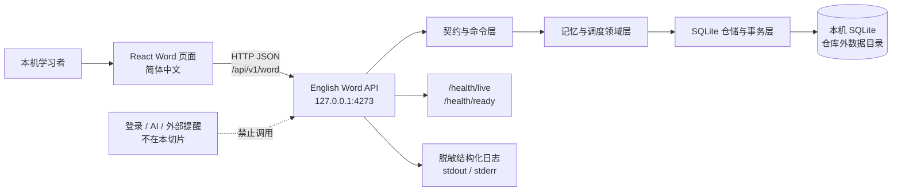
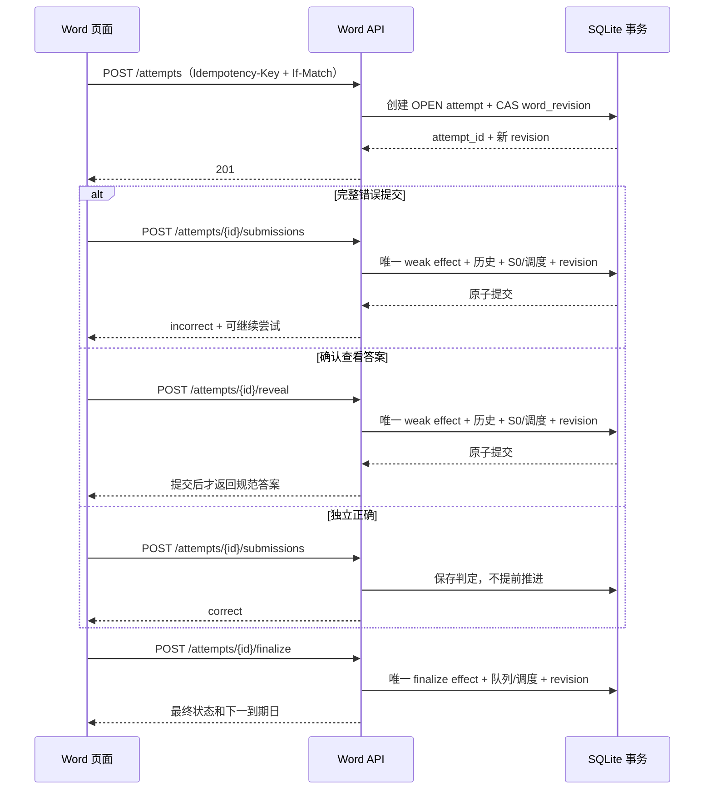
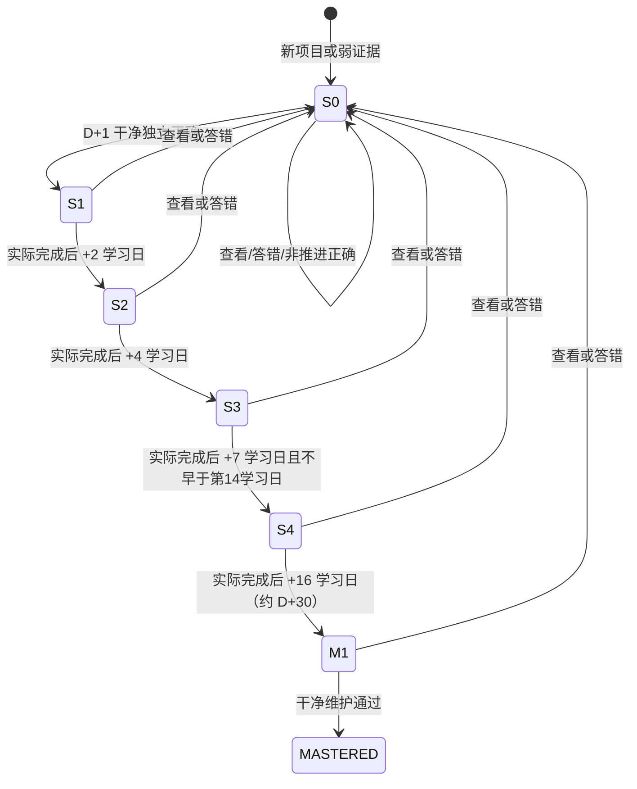
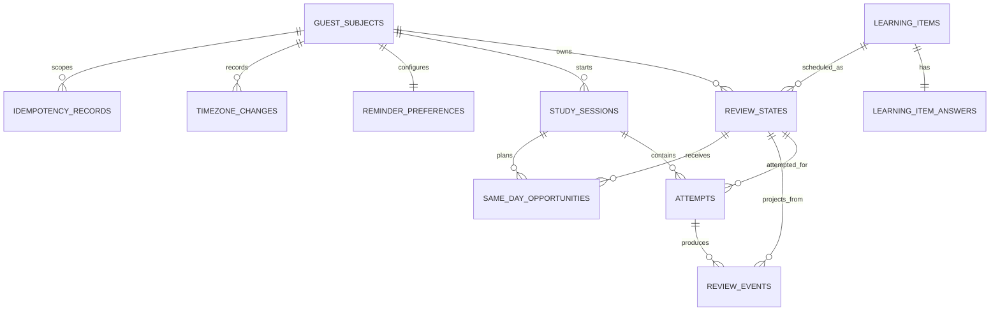

# AI English Learning：Word v1.3 本地后端服务架构契约

**文档版本**：v1.1

**产品基线**：`docs/01-prd.md` v1.3

**UI/交互基线**：`ui/04-spaced-recall-ui-prompt-v1.3.md` v1.3

**状态**：待架构审核（architecture-review）

**日期**：2026-08-07

**负责人**：固定 05 架构师（role-architect）

---

## 1. 结论与边界

本交付把原 v1.0 的宽泛全产品设想收敛为一个可以由后端工程师直接实现和验证的 **Word v1.3 本地服务契约**。本地服务负责游客主体、今日/逾期队列、答题尝试、查看答案与答错的幂等结算、日内插题、S0–S4/D+30 调度、历史、跳过/暂停/重置、提醒偏好、时区与 SQLite 持久化。

### 1.1 本次包含

- 一个仅绑定本机回环地址的 Node.js + TypeScript HTTP 服务。
- 以 SQLite 为唯一持久化数据库，以追加历史和当前状态投影共同保证可追溯性。
- 健康检查、就绪检查、启动入口、迁移、最小种子数据和测试边界。
- `/api/v1/word` 下的版本化接口、统一成功/错误信封、幂等键和乐观并发修订号。
- PRD v1.3 记忆曲线和异常恢复规则的确定性实现边界。
- 从当前浏览器本地状态向服务模式切换时的单一事实源约束。

### 1.2 本次明确不包含

- 登录、注册、账号体系、跨设备同步或多人协作。
- AI 对话、AI 评判、模型调用、语音服务或外部 API。
- 完整词库、词库运营、收藏、全量统计、排行榜或推荐系统。
- 短信、邮件、推送等真实外部提醒投递；本服务只保存提醒偏好和计算到期状态。
- 离线答题结算；前端离线时不得积攒可在恢复联网后补交的学习结果。
- 生产部署、公网暴露、Docker、TLS、云数据库、高可用或水平扩展。
- 本轮后端代码、前端适配器、数据库文件和部署脚本的实现。

### 1.3 事实边界

`backend/` 当前尚无可运行服务，因此 UI 不得宣称“后端已连接”“数据已同步”或“提醒已送达”。架构获批且后端通过契约/集成测试后，前端才能切换到服务模式。

现有前端 `localStorage` 记忆引擎是已批准 UI 的当前实现和迁移参考，不是未来服务端的并行事实源。接入后必须在一次显式切换中选择以下之一：

1. 保留浏览器本地模式，不调用后端；或
2. 切换服务模式，由后端成为唯一事实源。

严禁同一学习动作同时写入 `localStorage` 和后端。历史导入需要独立产品决定和迁移设计，本次不自动导入、不删除浏览器数据。

---

## 2. 输入基线与架构原则

| 输入 | 版本 | SHA-256 | 用途 |
|---|---:|---|---|
| `docs/01-prd.md` | 1.3 | `0b065ec4ffb4881d6893ec23a1d9c4ec57627fe173f43ada73cdf5c3f4b02385` | 产品规则与验收基线 |
| `ui/04-spaced-recall-ui-prompt-v1.3.md` | 1.3 | `72791c27d60851710868ea5f5c30deb4215dea61c0628b287252a9843ad08017` | 中文状态、操作和恢复语义 |
| `frontend/src/utils/spacedRecall.ts` | 当前实现 | 只读参考 | 已批准前端的确定性行为参考，不构成后端契约 |

架构遵循以下原则：

- **服务端权威**：学习状态、队列、调度、历史、修订号均以 SQLite 已提交事务为准。
- **证据先于答案**：查看答案接口必须先原子落库弱证据，再返回规范答案。
- **每个命令可重放**：网络重试不得重复计分、重复重置阶段或重复创建历史。
- **历史不可改写**：用户操作写追加事件；当前状态是事件在事务内同步更新的投影。
- **学习日优先**：调度基于用户确认的 IANA 时区和学习日，而不是服务器 UTC 日期。
- **本地最小化**：只引入当前切片所需进程和依赖，不预建登录、AI、全词库和生产设施。
- **可失败、可恢复**：进程崩溃后只承认已提交事务；就绪失败不得伪装可用。

---

## 3. 技术选型

| 层级 | 选型 | 约束版本 | 选择理由 | 本次不选 |
|---|---|---:|---|---|
| 运行时 | Node.js | 22.12+ LTS | 与现有 TypeScript 前端一致；本地安装和调试成本低 | 多语言微服务 |
| 语言 | TypeScript | strict | 契约、领域状态和错误码可静态约束 | JavaScript 弱类型实现 |
| HTTP | Express | 稳定主版本 | 成熟、轻量、适合单进程本地 API；中间件边界清晰 | NestJS 的额外框架层 |
| 校验 | Zod + 导出的 JSON Schema/OpenAPI | 同锁文件 | 请求/响应运行时校验与契约测试共源 | 手写散落校验 |
| 数据库 | SQLite | 3.x | 本地单用户、零外部服务、事务与约束足够 | PostgreSQL、云数据库 |
| SQLite 访问 | `better-sqlite3` + 参数化 SQL 仓储 | 同锁文件 | 同步事务边界明确，便于实现 CAS 和幂等原子结算 | Prisma 的生成层与迁移复杂度 |
| 日志 | 结构化 JSON 到 stdout/stderr | 内建封装 | 可被根级本地服务监督器接管；不增加日志服务 | 外部 APM/日志平台 |
| 测试 | Node 测试运行器或 Vitest + Supertest | 实现时锁定 | 契约和临时 SQLite 集成测试直接 | 真实外部服务测试 |

SQLite 启动时必须启用：

```sql
PRAGMA foreign_keys = ON;
PRAGMA journal_mode = WAL;
PRAGMA synchronous = NORMAL;
PRAGMA busy_timeout = 5000;
```

`WAL` 用于提高本地读写并行度，不代表提供多主或网络文件系统安全性。数据库必须位于本机普通磁盘；不得放在同步盘、NFS 或仓库内。

---

## 4. 系统上下文与运行边界



### 4.1 进程与端口

| 项目 | 契约 |
|---|---|
| 服务标识 | `english-api` |
| 默认监听 | `127.0.0.1:4273` |
| API 基址 | `http://127.0.0.1:4273/api/v1/word` |
| 存活地址 | `http://127.0.0.1:4273/health/live` |
| 就绪地址 | `http://127.0.0.1:4273/health/ready` |
| 前端开发接入 | 优先由前端开发服务器把 `/api/v1/word` 代理到 `4273`；或显式配置同源允许列表 |
| 配置 | `HOST`、`PORT`、`ENGLISH_DB_PATH`、`LOG_LEVEL`；不得把密钥写入仓库 |

默认只监听 IPv4 回环地址。若改为 `0.0.0.0`、局域网或公网，本架构的游客身份和安全假设立即失效，必须先补登录鉴权、TLS、CSRF、防滥用和网络部署设计。

### 4.2 健康与就绪

- `GET /health/live`：只证明事件循环能响应，不访问数据库；成功返回 HTTP 200。
- `GET /health/ready`：只有以下条件全部成立才返回 HTTP 200：
  - SQLite 文件可打开且可执行短读写探针；
  - `foreign_keys` 已开启、WAL 模式符合配置；
  - 所有迁移版本和校验和与应用匹配；
  - 目标种子版本存在；
  - 数据库未处于恢复失败或已知损坏状态。
- 任一就绪条件失败返回 HTTP 503 和稳定错误码，不自动吞错，不把未迁移数据库视为可用。

---

## 5. 模块边界

| 模块 | 职责 | 可依赖 | 禁止承担 |
|---|---|---|---|
| `http` | 路由、Cookie、头、信封、状态码、请求体上限 | application/contracts | 直接 SQL、调度计算 |
| `contracts` | Zod schema、DTO、错误码、OpenAPI | 无领域实现 | 数据库访问 |
| `application` | 命令/查询编排、事务入口、权限与修订检查 | domain/repositories | 自行复制领域规则 |
| `identity` | 游客主体、Cookie 绑定、IANA 时区 | repositories | 账号、密码、OAuth |
| `queue` | 今日/逾期/日内/新词排序、游标和 20 条上限 | scheduler/repositories | 修改历史 |
| `attempts` | attempt 生命周期、提示、提交、查看、最终结算 | settlement/repositories | AI 判分 |
| `settlement` | 弱证据/干净正确/非推进正确的唯一效果 | scheduler/history | HTTP 细节 |
| `scheduler` | S0–S4/M1、学习日、日内间隔与容量 | clock/domain | 系统本地时区隐式计算 |
| `history` | 追加学习事件与查询 | repositories | 覆盖或删除既往事实 |
| `item-actions` | skip/pause/resume/reset | scheduler/history | 全局批量操作 |
| `reminders` | 偏好、静默时段、当日可提醒判定 | identity/repositories | 真实短信/邮件/推送 |
| `persistence` | SQLite 连接、SQL 仓储、迁移、种子、备份钩子 | SQLite | 业务 HTTP 响应 |
| `observability` | request_id、耗时、错误码、就绪原因 | 无敏感载荷 | 记录答案、Cookie、完整输入 |

所有写操作必须从 application 层进入一个 SQLite 事务；领域模块不得自行提交半个流程。

---

## 6. 领域规则与状态机

### 6.1 证据和 attempt 生命周期



attempt 状态为 `OPEN -> FINALIZED`。以下规则不可放宽：

- “弱证据”只来自确认后的 `reveal` 或一次**完整且错误**的提交。
- 不完整提交、校验失败、取消查看确认均不产生学习证据。
- 同一 attempt 的多次答错、答错后查看、重复查看共享一个 `weak` 效果族，只允许一次阶段重置和一次弱证据结算。
- 重放同一请求返回第一次已保存结果；新建 attempt 才能产生新的独立证据。
- 查看答案的规范答案不得在弱证据事务提交前返回。
- 曾在当前 attempt 使用提示、查看答案或产生错误提交，即使随后答对也不是“干净独立正确”，不得推进掌握阶段。
- `finalize` 每个 attempt 只执行一次；已结算的 weak 效果不会在 finalize 中再次写入。

### 6.2 跨日阶段



架构中的 `D+1/D+3/D+7/D+14/D+30` 是用户可理解的目标里程碑；实际下一到期按**本次实际完成的学习日**计算连续间隔 `1、2、4、7、16`，不得从错过的原计划日追赶。掌握至少需要四个不同学习日上的干净独立正确，S4 不得早于进入学习后的第 14 个学习日。

逾期项目始终保留为一条逾期任务，不按漏掉天数复制。完成后从实际完成日计算下一到期。

### 6.3 日内插题与队列顺序

服务端按以下稳定优先级生成候选：

1. 逾期项目，按原到期学习日、稳定 tie-breaker 排序；
2. 今日到期项目；
3. 满足间隔条件的日内加固项目；
4. 新项目。

每次对外最多返回 20 条今日/逾期任务；未展示的逾期总数必须在 `meta.overdue_remaining` 中真实可见。

日内加固必须同时满足：

- 同一项目同一学习日最多额外出现 2 次；
- 两次出现之间完成 3–7 个其他已结算项目；
- 当前 session 日内加固总数不超过 `min(8, ceil(base_planned_count * 0.30))`；
- 容量不足或间隔不满足时顺延到当日后续 session，仍无法安排则到 D+1；
- 不允许相邻强插，也不允许日内任务抢占逾期/今日到期任务。

`next-item` 命令在事务中预留一个确定的 session position；相同幂等键返回同一项目，避免刷新页面改变随机结果。3–7 的间隔可由可种子的确定性伪随机数产生，并把选定值持久化到 `same_day_opportunities.required_gap`。

### 6.4 跳过、暂停、恢复、重置

| 动作 | 规则 | 历史 |
|---|---|---|
| 第一次 `skip` | 移到当前学习日队尾 | 追加 `ITEM_SKIPPED_TO_TAIL` |
| 同日第二次 `skip` | 移到下一学习日 | 追加 `ITEM_SKIPPED_TO_NEXT_DAY` |
| `pause` | 只接受 1/3/7/30 学习日；阶段不变 | 保存暂停起止学习日 |
| `resume` | 可提前恢复；重新进入正常优先级 | 不补造暂停期任务 |
| `reset` | 必须 `confirmed=true`；S0，下一学习日到期 | 保留全部旧历史并追加重置事件 |

### 6.5 时区

- 主体必须保存一个经过 IANA 数据库验证的时区，如 `Asia/Shanghai`。
- 每个历史事件同时保存 UTC 时间戳、当时 IANA 时区和解析后的 `study_date`。
- 修改时区只重算尚未结算的未来到期和提醒窗口，不改写既往事件的学习日。
- 时区修改在一个事务内完成，必须防止重复生成掌握证据、日内机会或提醒资格。
- 服务器系统时区不参与领域判断；测试注入 `Clock`，禁止在领域代码到处直接调用 `new Date()`。

---

## 7. HTTP 与 API 契约

### 7.1 通用约定

- 内容类型：`application/json; charset=utf-8`。
- API 版本：`/api/v1/word`；健康接口不带业务版本。
- 时间戳：RFC 3339 UTC；学习日：`YYYY-MM-DD`；时区：IANA 名称。
- 所有 ID 为服务端生成的不透明 UUID，客户端不得推导语义。
- 列表游标是不透明字符串；服务端校验其查询类型、排序位置和过期条件。
- 请求体默认上限 64 KiB；历史列表 `limit` 最大 100，队列 `limit` 最大 20。
- 除游客初始化外，所有业务接口必须携带游客 Cookie。

成功信封：

```json
{
  "data": {},
  "meta": {
    "request_id": "req_opaque",
    "server_time": "2026-08-07T12:00:00.000Z",
    "word_revision": 42
  }
}
```

错误信封：

```json
{
  "error": {
    "code": "REVISION_CONFLICT",
    "message": "学习状态已在其他页面更新，请刷新后重试。",
    "request_id": "req_opaque",
    "retryable": true,
    "details": {
      "current_word_revision": 43
    }
  }
}
```

用户可见 `message` 必须为简体中文；程序只能依赖稳定 `code`，不得解析文案。

### 7.2 游客身份、幂等与修订号

- `POST /subjects/guest` 生成游客主体并设置 `HttpOnly; SameSite=Lax; Path=/api/v1/word` Cookie。开发环境不伪设 `Secure`；若启用 HTTPS 必须设 `Secure`。
- Cookie 是本机浏览器绑定标识，不是登录凭据，不能提供跨设备身份保证。
- 游客初始化需要 `Idempotency-Key`，但不需要 `If-Match`。
- 其余 `POST`/`PUT` 命令必须同时提供：
  - `Idempotency-Key: <uuid-or-opaque-key>`；
  - `If-Match: \"<word_revision>\"`。
- 服务端先按主体、路由、幂等键读取已保存结果：
  - 键与规范化请求哈希一致：原样重放首次状态码和响应体，不再检查旧修订号；
  - 同键不同请求哈希：HTTP 409 `IDEMPOTENCY_KEY_REUSED`；
  - 未命中：再执行 `word_revision` CAS；不一致返回 HTTP 409 `REVISION_CONFLICT`。
- 每个成功写事务把主体 `word_revision` 加 1；失败或回滚不增加。
- 幂等响应必须与业务状态写入同一事务，避免“业务已成功但重试记录丢失”。

### 7.3 完整接口清单

| 方法 | 路径 | 用途 | 关键输入 | 关键输出/状态 |
|---|---|---|---|---|
| GET | `/health/live` | 进程存活 | 无 | 200；无数据库承诺 |
| GET | `/health/ready` | 服务就绪 | 无 | 200 或 503 `DB_NOT_READY` |
| POST | `/api/v1/word/subjects/guest` | 创建/重放游客 | `learning_timezone`、幂等键 | 201/200，设置 Cookie、revision=0 |
| GET | `/api/v1/word/bootstrap` | 页面一次性初始化 | Cookie | 主体、时区、提醒偏好、队列摘要、revision |
| GET | `/api/v1/word/queue` | 今日/逾期可浏览队列 | `limit<=20`、`cursor?` | 分组条目、总数、剩余逾期数 |
| POST | `/api/v1/word/sessions` | 创建学习 session | `base_planned_count` | session、日内加固容量 |
| POST | `/api/v1/word/sessions/{session_id}/next-item` | 原子领取下一题 | 可选 `exclude_item_ids` | 固定 position、item 摘要、来源类型 |
| POST | `/api/v1/word/attempts` | 开始答题尝试 | `session_id`、`item_id`、`mode` | OPEN attempt |
| POST | `/api/v1/word/attempts/{attempt_id}/hints` | 登记提示使用 | `hint_kind` | attempt 变为非干净候选 |
| POST | `/api/v1/word/attempts/{attempt_id}/submissions` | 校验完整答案 | `answer`、`complete` | incomplete/correct/incorrect、是否产生 weak effect |
| POST | `/api/v1/word/attempts/{attempt_id}/reveal` | 确认查看规范答案 | `confirmed=true` | 先结算 weak，再返回答案 |
| POST | `/api/v1/word/attempts/{attempt_id}/finalize` | 结束 attempt | `outcome` | 最终结算、阶段/到期变化、队列摘要 |
| GET | `/api/v1/word/items/{item_id}` | 查看学习项详情 | Cookie | 词项、当前阶段、到期、暂停状态 |
| GET | `/api/v1/word/items/{item_id}/history` | 分页历史 | `limit<=100`、`cursor?` | 追加事件，按时间倒序 |
| POST | `/api/v1/word/items/{item_id}/skip` | 跳过 | `study_date` | 当日队尾或下一学习日 |
| POST | `/api/v1/word/items/{item_id}/pause` | 暂停 | `learning_days`∈1/3/7/30 | 暂停边界，阶段不变 |
| POST | `/api/v1/word/items/{item_id}/resume` | 提前恢复 | 无业务载荷 | 恢复后的下一到期 |
| POST | `/api/v1/word/items/{item_id}/reset` | 重置 | `confirmed=true` | S0、下一学习日到期、历史保留 |
| GET | `/api/v1/word/reminder-preferences` | 读取提醒偏好 | Cookie | 本地时间、静默窗口、外部提醒许可 |
| PUT | `/api/v1/word/reminder-preferences` | 更新提醒偏好 | `local_time`、quiet hours、`external_allowed` | 规范化偏好；不代表已发送 |
| POST | `/api/v1/word/timezone-changes` | 修改学习时区 | `from_timezone`、`to_timezone` | 未来到期重算摘要 |

### 7.4 关键命令语义

`POST /attempts/{id}/submissions`：

- `complete=false` 只返回 `status=incomplete`，不保存答案文本、不写证据、不改调度。
- `complete=true` 后由确定性规范化器比较当前词项的允许答案；本切片不调用 AI 做同义改写判断。
- 错误时在同一事务内插入唯一 weak effect、追加历史、重置 S0、安排日内机会/下一学习日；重复错误只重放。
- 正确时只记录判定；是否为可推进的干净正确由 `finalize` 统一结算。

`POST /attempts/{id}/reveal`：

- 只接受 `confirmed=true`；否则 422。
- 事务内先写唯一 weak effect和调度，再读取并返回规范答案。
- 若 weak effect 已由同一 attempt 的错误提交创建，返回既有结算，不重复计分。

`POST /attempts/{id}/finalize`：

- 核对 attempt 当前判定、是否使用提示/查看/答错，以及是否已最终结算。
- 只允许服务端从记录推导 outcome，客户端值只用于一致性校验，不能让客户端自行宣称干净正确。
- 原子写 finalize effect、review event、review state、session position 和 revision。

### 7.5 错误码

| HTTP | code | retryable | 场景 |
|---:|---|---|---|
| 400 | `MALFORMED_JSON` | false | JSON 无法解析 |
| 401 | `GUEST_REQUIRED` | false | 缺少或无效游客 Cookie |
| 404 | `NOT_FOUND` | false | 主体范围内资源不存在；不泄露其他主体资源 |
| 409 | `IDEMPOTENCY_KEY_REUSED` | false | 同键不同规范化请求 |
| 409 | `REVISION_CONFLICT` | true | 多标签页或旧页面修订号过期 |
| 409 | `ATTEMPT_ALREADY_FINALIZED` | false | 使用新幂等键修改已结束 attempt |
| 409 | `ITEM_UNAVAILABLE` | true | 项目暂停、已被其他 session 领取或不再到期 |
| 409 | `OFFLINE_SETTLEMENT_DISABLED` | false | 客户端试图补交离线动作 |
| 422 | `VALIDATION_FAILED` | false | 字段、时区、枚举或确认值非法 |
| 429 | `TOO_MANY_REQUESTS` | true | 本地防失控保护触发 |
| 503 | `DB_NOT_READY` | true | 数据库、迁移、种子或恢复状态不可用 |
| 500 | `INTERNAL_ERROR` | true | 未分类服务错误；响应不暴露堆栈/SQL |

---

## 8. 数据模型

### 8.1 ER 图



### 8.2 表与关键约束

| 表 | 关键字段 | 关键约束/用途 |
|---|---|---|
| `schema_migrations` | `version`, `checksum`, `applied_at_utc` | 版本唯一；校验和不一致则 readiness 失败 |
| `seed_versions` | `version`, `checksum`, `applied_at_utc` | 种子幂等版本；只含本切片最小稳定词项 |
| `guest_subjects` | `id`, `learning_timezone`, `word_revision`, `created_at_utc`, `updated_at_utc` | `word_revision>=0`；不保存姓名、邮箱、密码 |
| `learning_items` | `id`, `surface`, `meaning_zh`, `phonetic`, `seed_version`, `active` | 稳定 ID；同拼写不同义项必须不同 ID |
| `learning_item_answers` | `item_id`, `canonical_answer`, `normalized_answer`, `answer_version` | 一对一；答案只在需要时读取，不进入日志 |
| `review_states` | `subject_id`, `item_id`, `stage`, `due_study_date`, `first_learning_date`, `clean_day_count`, `paused_until`, `same_day_count`, `skip_count_today`, `updated_revision` | 主键 `(subject_id,item_id)`；当前状态投影 |
| `study_sessions` | `id`, `subject_id`, `study_date`, `base_planned_count`, `reinforcement_cap`, `next_position`, `status` | session 容量和位置单调递增 |
| `same_day_opportunities` | `id`, `review_state_id`, `study_date`, `ordinal`, `required_gap`, `eligible_after_position`, `status` | 唯一 `(review_state_id,study_date,ordinal)`；ordinal 1..2 |
| `attempts` | `id`, `subject_id`, `session_id`, `review_state_id`, `position`, `mode`, `status`, `used_hint`, `had_incorrect`, `revealed`, `server_outcome`, `opened_at_utc`, `finalized_at_utc` | 一个 position 最多一个活动 attempt；状态只前进 |
| `review_events` | `id`, `subject_id`, `review_state_id`, `attempt_id?`, `effect_family`, `event_type`, `payload_json`, `occurred_at_utc`, `event_timezone`, `study_date`, `resulting_revision` | 追加写；唯一 `(attempt_id,effect_family)`（attempt 非空） |
| `reminder_preferences` | `subject_id`, `local_time`, `quiet_start`, `quiet_end`, `external_allowed`, `last_eligible_study_date` | 默认 20:00、22:00–08:00、外部提醒 false；最多一个资格/学习日 |
| `timezone_changes` | `id`, `subject_id`, `from_timezone`, `to_timezone`, `changed_at_utc`, `affected_future_count`, `revision` | 审计未来重算，不改历史 |
| `idempotency_records` | `subject_id`, `route_key`, `idempotency_key`, `request_hash`, `response_status`, `response_body_json`, `created_at_utc`, `expires_at_utc` | 唯一 `(subject_id,route_key,idempotency_key)`；与业务事务同提交 |

所有布尔值以 `INTEGER CHECK(value IN (0,1))` 保存；阶段、状态和事件类型使用 `CHECK` 约束。时间不使用 SQLite 隐式本地时间函数。

### 8.3 必要索引

```sql
CREATE INDEX idx_review_states_queue
  ON review_states(subject_id, paused_until, due_study_date, stage, item_id);

CREATE INDEX idx_review_events_history
  ON review_events(subject_id, review_state_id, occurred_at_utc DESC, id DESC);

CREATE UNIQUE INDEX uq_attempt_effect
  ON review_events(attempt_id, effect_family)
  WHERE attempt_id IS NOT NULL;

CREATE INDEX idx_same_day_eligible
  ON same_day_opportunities(study_date, status, eligible_after_position, id);

CREATE INDEX idx_attempts_session_position
  ON attempts(session_id, position, status);

CREATE INDEX idx_idempotency_expiry
  ON idempotency_records(expires_at_utc);
```

队列查询必须通过 `idx_review_states_queue`，历史必须走键集分页，不允许对全表使用大 offset。

### 8.4 事务不变量

每个业务写事务遵循固定顺序：

1. `BEGIN IMMEDIATE`，读取主体和幂等记录；
2. 幂等命中则返回保存结果；未命中再 CAS `word_revision`；
3. 锁定/读取目标 review state、attempt、session；
4. 执行领域规则，写追加事件和当前状态投影；
5. 增加 `word_revision`；
6. 写入完整幂等响应；
7. `COMMIT` 后才向客户端发送成功。

任一步失败必须整体回滚。响应在 commit 前断开不影响后续同键重放。

幂等记录保留期由实现配置，默认 7 天；清理只删除已过期的重放缓存，不删除 review history。对仍可能被客户端重试的最近记录不得提前清理。

---

## 9. 隐私与安全

### 9.1 数据最小化

- 主体为不透明游客 ID；不收集姓名、邮箱、手机号、密码、设备指纹或广告标识。
- 错误答案仅用于当前请求判定，默认不持久化原始输入；历史保存结果类型和必要规则元数据。
- 规范答案、原始输入、Cookie、幂等键和完整请求体不得写日志。
- SQLite 文件、WAL、SHM、备份、覆盖率和测试数据库必须在仓库忽略范围内。

### 9.2 本地 HTTP 防护

- 只绑定 `127.0.0.1`；校验 `Host` 和精确允许的 `Origin`，拒绝通配 CORS。
- Cookie 为 `HttpOnly`、`SameSite=Lax`；状态变更请求同时要求允许 Origin 和 JSON 内容类型。
- 所有 SQL 参数化；枚举、长度、时区、ID 和分页参数在入口校验。
- 禁止任意 URL 抓取、文件路径输入、模板执行、shell 调用和外部网络请求。
- 设置请求体、并发和每主体速率上限，避免错误页面循环写满磁盘。
- 数据目录建议权限 `0700`，数据库/备份文件 `0600`；启动时权限过宽应告警。
- 错误响应不暴露堆栈、绝对路径、SQL、依赖版本或其他主体是否存在。

### 9.3 第三方与外部传输

本切片没有第三方传输。提醒偏好中的 `external_allowed=true` 只表示未来允许接入的用户选择，不触发任何短信、邮件、浏览器通知或模型请求。将来增加任何第三方前必须独立定义：目的、字段、同意、保留期、撤回、失败语义、版权/条款和密钥管理。

---

## 10. 失败恢复与一致性

| 故障 | 行为 | 恢复 |
|---|---|---|
| 请求超时/断连 | 客户端不得换新幂等键盲重试 | 原键重试，服务端重放首次结果 |
| 多标签页同时写 | 仅一个 revision CAS 成功 | 409 后重新 bootstrap/queue，再由用户重做尚未成功的动作 |
| 进程在事务中崩溃 | 未 commit 事务由 SQLite 回滚 | 重启后 readiness 检查，原幂等键重试 |
| WAL/数据库忙 | 等待不超过 busy timeout | 返回 retryable 503；不得绕过事务降级写本地状态 |
| 迁移缺失/校验和改变 | readiness=503 | 停止业务流量，修复迁移或从备份恢复 |
| 数据库损坏 | readiness=503，保留现场 | 复制文件后执行完整性检查；用最近备份恢复，不自动重建覆盖 |
| 种子版本缺失 | readiness=503 | 幂等执行目标 seed；不得以空词库假装正常 |
| 磁盘空间不足 | 写事务失败并回滚 | 释放空间/备份后重试；不删除学习历史做自动自救 |
| 前端离线 | 禁止结算、查看答案和队列变更 | 显示中文不可用状态；恢复后重新读取服务端 revision |

正常退出时停止接收新请求，等待短时在途事务结束，关闭 SQLite 连接。异常退出依赖 SQLite 原子性，不以未刷新的内存状态作为恢复来源。

备份边界：迁移执行器在不可逆迁移前创建带时间戳的 SQLite 一致性备份；备份保留策略由后续本地服务运维方案确定。本轮不实现自动定时备份。

---

## 11. 性能、容量与成本

### 11.1 本地目标

| 指标 | 目标 | 测量边界 |
|---|---:|---|
| 健康接口 p95 | < 50 ms | 热进程、本机 |
| 队列/详情读取 p95 | < 100 ms | 10,000 个 review state、命中索引 |
| 单次写命令 p95 | < 200 ms | 不含进程启动、无外部调用 |
| 就绪启动 | < 3 s | 无待执行大迁移 |
| 队列单页 | <= 20 | PRD 今日可见上限 |
| 历史单页 | <= 100 | 键集分页 |

这些是开发验收目标，不是公网 SLA。目标运行模型为一个本地服务进程、一个 SQLite 文件和少量浏览器标签页，不宣称支持千级并发。

### 11.2 成本

- 无云资源、无第三方 API、无模型 token、无外部数据库费用。
- 主要成本是本机磁盘：历史事件和幂等结果。实现时需提供按表行数/文件大小的诊断命令。
- 不为假想规模提前引入 Redis、消息队列、对象存储或 Kubernetes。

---

## 12. 目录、启动、迁移与种子契约

以下是后端实现后的目标目录，本轮不创建这些代码文件：

```text
projects/ai-english-learning/backend/
├── package.json
├── tsconfig.json
├── src/
│   ├── server.ts                 # 读取配置、启动和优雅退出
│   ├── app.ts                    # Express 组装，不监听端口
│   ├── config.ts
│   ├── contracts/               # Zod、DTO、OpenAPI、错误码
│   ├── http/                     # routes/middleware/error envelope
│   ├── application/              # command/query handlers
│   ├── domain/
│   │   ├── attempts/
│   │   ├── queue/
│   │   ├── scheduler/
│   │   ├── settlement/
│   │   ├── reminders/
│   │   └── clock.ts
│   ├── persistence/
│   │   ├── sqlite.ts
│   │   ├── repositories/
│   │   ├── migrations/
│   │   └── seeds/
│   └── observability/
├── migrations/                   # 有序、带校验和的前向 SQL
├── seeds/                        # 稳定 ID 的最小 Word fixture
└── tests/
    ├── contract/
    ├── integration/
    └── fixtures/
```

### 12.1 必须提供的脚本

| 命令 | 契约 |
|---|---|
| `npm run dev -- --host 127.0.0.1 --port 4273` | 本地开发服务，显式监听参数优先 |
| `npm run build` | 严格 TypeScript 编译，产物不提交 |
| `npm run start -- --host 127.0.0.1 --port 4273` | 运行已构建服务 |
| `npm run db:migrate` | 校验并按序事务执行前向迁移 |
| `npm run db:seed` | 幂等写入目标最小种子版本 |
| `npm run test:contract` | 验证 HTTP 契约和 schema |
| `npm run test:integration` | 使用临时 SQLite 文件验证事务/调度 |

推荐首次本地启动顺序：

```bash
cd projects/ai-english-learning/backend
npm run db:migrate
npm run db:seed
npm run dev -- --host 127.0.0.1 --port 4273
```

根级 `scripts/local-services.sh` 的接入属于后续 DevOps/实现工作。只有后端实际可运行且 `/health/ready` 通过后，才可将 `english-api` 加入监督器；本轮不修改监督脚本。

### 12.2 迁移与 seed

- 迁移为只追加、不可改写的有序 SQL；已应用版本的内容或 checksum 变化必须失败。
- 每个迁移在事务中执行，记录版本、checksum 和时间；需要表重建时先备份。
- seed 使用稳定学习项 ID，幂等 upsert；不得把 seed 当完整词库。
- seed 内容变化必须提升 seed 版本，不能静默改变已学习项目的语义或答案。
- 测试数据库用临时目录创建并在测试结束清理；开发数据库不得进 Git。

---

## 13. 契约与集成测试边界

### 13.1 契约测试

必须从同一 schema 源验证：

- 所有接口的请求、成功信封、错误信封、HTTP 状态和简体中文错误文案；
- 游客 Cookie 属性、Origin/Host 限制、请求体上限；
- `Idempotency-Key`、`If-Match`、revision 更新和精确响应重放；
- 不同幂等键修改已 finalize attempt 的冲突；
- readiness 在未迁移、缺 seed、checksum 错误和数据库不可写时返回 503；
- OpenAPI 与路由不存在漂移，未登记接口不能静默出现。

### 13.2 SQLite 集成测试

每个测试使用真实临时 SQLite 文件，不用内存 mock 替代事务行为。至少覆盖：

1. 迁移从空库到目标版本，重复执行无变化，checksum 变更失败；
2. seed 首次/重复执行稳定，学习项 ID 不变；
3. reveal 在返回答案前完成 weak event + S0 + due + idempotency 原子提交；
4. 完整答错与随后 reveal 只产生一个 weak effect；不完整提交不产生事件；
5. 相同幂等键重放完全相同响应，同键不同载荷冲突；
6. 两个并发 revision 只有一个成功，失败请求不留半条历史；
7. 进程/连接异常模拟后只保留已 commit 事务；
8. 逾期/今日/日内/新词优先级、20 条上限和 remaining 计数；
9. 日内每项 2 次、间隔 3–7、session `min(8, ceil(base*0.30))` 上限；
10. S0–S4/M1 的 1/2/4/7/16 学习日间隔、实际完成日起算、S4 最早日限制；
11. 四个不同学习日干净正确的掌握条件，提示/查看/答错后的正确不推进；
12. skip 第一次队尾、第二次 D+1；pause 1/3/7/30；提前 resume；reset 保留历史；
13. IANA 时区切换只重算未来，不重复证据/提醒，历史的原时区和学习日不变；
14. 默认提醒 20:00、静默期 22:00–08:00、最多一个资格/日，且无真实外部发送；
15. 同拼写不同含义的项目 ID 隔离；跨主体资源返回 404；
16. 10,000 状态/历史样本下查询计划命中预期索引并满足本地目标。

### 13.3 不属于本切片测试

- 浏览器视觉回归和 UI 端到端流程；由前端接入任务补充。
- 登录、AI 对话、真实通知、云部署、跨设备同步。
- 第三方模型或网络依赖的测试。

---

## 14. 可观测性

每个请求生成或接受可信格式的 `request_id`，日志最少包含：时间、级别、request_id、路由模板、方法、状态码、耗时、主体的单向短期关联标识、错误码、revision 前后值。不得包含 Cookie、原始答案、规范答案、完整请求/响应体、绝对数据库路径。

建议提供不暴露敏感内容的本地诊断摘要：数据库 schema/seed 版本、文件大小、WAL 大小、各表行数、最近迁移时间、当前 readiness 原因。诊断只读，不提供编辑数据库的 HTTP 接口。

---

## 15. 后续演进与部署门

### 15.1 后端实现获批后

固定后端角色只能按本契约实现 Word v1.3 最小切片；如果发现产品规则矛盾，必须回到产品/架构审核，不能自行引入账号、AI 或完整词库。

### 15.2 前端接入

前端适配器必须：

- bootstrap 后缓存当前 revision，每个命令发送 `If-Match`；
- 超时使用原幂等键重试；409 revision 冲突时重新加载事实，不在客户端合并计分；
- 离线时禁用结算类动作并显示简体中文真实状态；
- 服务模式不再写 `localStorage` 学习状态；迁移另行获批。

### 15.3 生产部署后置

任何公网或共享设备部署前，必须新增并审核：账号/鉴权、TLS、CSRF 策略、数据删除/导出、备份保留、监控告警、密钥管理、依赖漏洞处置、限流、防滥用、隐私说明和 SQLite 到生产数据库的容量决策。本地游客 Cookie 不得直接沿用为生产身份。

---

## 16. 架构决策记录

| ADR | 决定 | 原因 | 触发重审条件 |
|---|---|---|---|
| ADR-001 | 后端为服务模式唯一事实源 | 防双写、重复结算和状态漂移 | 产品要求离线可写或多端同步 |
| ADR-002 | SQLite + 参数化 SQL，不用 ORM | 本地单用户、原子事务、迁移透明 | 公网多实例或显著并发写入 |
| ADR-003 | 主体级单调 `word_revision` | 简化多标签页冲突和可解释恢复 | 一个主体出现高并发独立写域 |
| ADR-004 | 追加事件 + 同事务状态投影 | 历史可追溯且读取高效 | 引入跨服务事件总线 |
| ADR-005 | 同 attempt 的 weak effect 唯一 | reveal/incorrect 重试不重复重置 | 产品改变“每次答错都计一次”定义 |
| ADR-006 | 无外部提醒投递 | 本切片无账号、权限和第三方边界 | 用户批准通知渠道与隐私方案 |
| ADR-007 | 回环地址 4273 | 与前端 4173 区分，便于本地监督 | 端口冲突或统一端口规范变更 |

---

## 17. 需求覆盖矩阵

| 要求 | 架构落点 |
|---|---|
| health/readiness | 4.2、7.3、13.1 |
| 游客主体 | 7.2、8.2、9 |
| 今日/逾期队列 | 6.3、7.3、8.3 |
| attempt/reveal/incorrect 幂等结算 | 6.1、7.2、7.4、8.4 |
| 日内插题 | 6.3、8.2、13.2 |
| S0–S4/D+30 | 6.2、13.2 |
| history | 7.3、8.2、8.3 |
| skip/pause/reset | 6.4、7.3、13.2 |
| reminder prefs | 6.5、7.3、8.2、9.3 |
| SQLite 持久化 | 3、8、10、12 |
| revision/idempotency/timezone | 6.5、7.2、8.4 |
| 错误信封 | 7.1、7.5 |
| 启动入口、迁移、seed | 4.1、12 |
| 契约/集成测试 | 13 |
| 安全、失败恢复、成本 | 9、10、11 |

---

## 18. 架构自检与停止门

- [x] 技术选型说明了理由、约束和未选方案。
- [x] 系统上下文、模块依赖和禁止边界清晰。
- [x] API 清单覆盖健康、游客、队列、attempt、历史、操作、提醒和时区。
- [x] SQLite 表、关系、索引、事务、迁移和种子契约完整。
- [x] reveal/incorrect/重试不会重复计分，revision 冲突有确定恢复路径。
- [x] S0–S4/D+30、日内插题、掌握、跳过、暂停、重置和时区规则可测试。
- [x] 隐私、第三方传输、日志、安全、失败恢复、性能和成本边界明确。
- [x] 登录、AI、完整词库/统计、外部提醒、生产部署未被自动纳入。
- [x] 本轮不写后端业务代码、不改前端、不部署、不宣称服务已运行。

本交付到此停止在 `architecture-review`。审核选项为：**通过 / 修改 / 打回**。即使通过，也不在固定 05 任务中自动启动固定 02 或固定 07。
