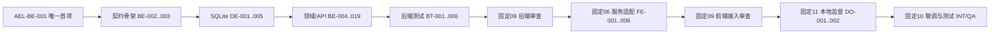

# AI English Learning：Word v1.3 本地后端与前后端联调任务拆解

**文档版本**：v1.1

**状态**：待任务拆解审核（`task-breakdown-review`）

**日期**：2026-08-11

**负责人**：固定 02 项目经理（`role-pm`）

**change_id**：`plan-20260811-english-word-backend-integration-task-breakdown-001`

**artifact_id**：`artifact-english-word-backend-integration-task-breakdown-001`

---

## 1. 结论

本版整体替换 v1.0 的宽泛任务表，只拆解已批准的 Word v1.3 本地服务切片。共 **43 个 1–4 小时原子任务、161 角色小时**；工时是任务复杂度估算，不是日历承诺。

唯一首个开发工作项是：

- **任务**：`AEL-BE-001`——Express + TypeScript 后端骨架、回环监听与健康基线；
- **唯一角色**：固定 `07 后端工程师`（`role-backend-dev`，固定任务 `019fb74a-a6f7-7e31-826f-799d3e713642`）；
- **建议 change_id**：`dev-20260811-english-word-backend-foundation-001`；
- **首项停止门**：`backend-foundation-delivery-review`；
- **授权语义**：本任务拆解当前尚未获批，因此 `AEL-BE-001` 只是声明的唯一下一项；超级无敌帅超超总对本交付回复“通过”后，才自动授权这一项。`AEL-BE-002+` 以及固定 08/09/06/11/10 均继续未授权。

## 2. 已批准输入与现场事实

| 输入/事实 | 当前状态 | 约束 |
|---|---|---|
| `docs/02-architecture.md` | v1.1；SHA256 `0f80bfd20820d795904893778f68f40a2366b29d13db2766d4f3dabd190b88c6`；审批 `approval-20260811-english-word-architecture-v1-1` | 本任务不得改变架构、技术栈、接口或数据边界 |
| `backend/` | 只有 `.gitkeep`；没有 package、锁文件、TypeScript、迁移、seed 或测试 | 当前任何后端 npm/数据库命令都不可运行；下表命令是相应任务完成后的 DoD |
| `frontend/` | React + TypeScript + Vite 已存在；`lint/build/test` 可运行 | 当前浏览器 `localStorage` 仍是真实实现；服务模式接入前不得宣称后端已连接 |
| 根级 `scripts/local-services.sh` | 只监督四个 Web 静态/前端服务；English 为 `4173/word` | 尚无 `english-api:4273`；现有 HTML 健康检查不能冒充 JSON readiness |
| 并行前端复审 | `artifact-spaced-recall-code-rereview-001` 待审，`CR-P1-001` 仍有 1 项 Major | 本分支不得批准、覆盖或关闭该结论；`AEL-FE-001` 前必须完成其独立审核/修复链 |

## 3. 本版范围与非目标

### 3.1 包含

- Express + TypeScript 本地后端骨架、回环监听、健康与就绪。
- SQLite 迁移、checksum、稳定 seed、索引、事务和仓库外数据边界。
- `/api/v1/word` 契约、游客主体、队列、session、attempt、幂等结算、历史、操作、提醒偏好与时区。
- 真实临时 SQLite 契约/集成测试、并发、恢复、性能和安全验证。
- 后端通过审查后，前端服务适配、单一事实源和中文失败状态。
- 后端与前端审查无阻断后，根级本地服务监督和最终本机联调。

### 3.2 明确不做

- 登录、账号、跨设备同步、AI 对话/判分、完整词库、全量统计、收藏和推荐。
- 真实短信、邮件、推送或任何第三方传输。
- 浏览器历史自动导入、删除或双写；服务模式不与 `localStorage` 同时结算。
- Docker、公网、生产部署、TLS、云数据库、付费资源或账号权限。
- 本次项目经理交付不写任何前后端业务代码，不修改根级监督脚本，不启动固定 07/08/09/06/11/10。

## 4. 全局执行契约

### 4.1 每项通用 DoR

每个任务开始前必须同时满足：

1. 该任务已获得独立授权，且其全部依赖已交付、审核并落盘；表内“规划”不等于授权。
2. `docs/02-architecture.md` v1.1 SHA 未漂移；发现产品或架构矛盾时回到对应审核门。
3. 已 fetch 最新根仓，`HEAD==origin/main`，目标路径无重叠改动且无 `.git/index.lock`。
4. 只暂存本任务路径；数据库、WAL、SHM、备份、覆盖率、依赖和构建产物均在仓库外、临时目录或忽略范围。
5. 执行者本人在固定角色任务宣布入场、范围、产物和停止门。

### 4.2 每项通用 DoD

1. 任务特定 DoD 和验证命令全部通过，失败/未运行项必须写实。
2. 新接口、字段、错误码、迁移和行为与批准架构一致；测试与实现同批交付。
3. 不记录 Cookie、答案、完整请求、幂等键、绝对数据库路径或凭证。
4. 精确登记产物、哈希、验证、限制和 Git 提交；完成后停在该任务审核门。
5. 不从一个任务的批准递归启动后续任务或角色。

## 5. 里程碑、依赖与工时

| 里程碑 | 任务范围 | 任务数 | 本段工时 | 累计工时 | 可验证结果 |
|---|---|---:|---:|---:|---|
| M0 唯一首项 | `AEL-BE-001` | 1 | 4h | 4h | 后端严格 TS 骨架可启动；live=200，数据库未就绪时 ready=503 |
| M1 契约骨架 | `AEL-BE-001..003` | 3 | 11h | 11h | 包、脚本、通用信封、接口 schema/OpenAPI 骨架可验证 |
| M2 SQLite 基线 | `AEL-DE-001..005` | 5 | 18h | 29h | 迁移/seed/checksum/索引/临时库测试边界闭合 |
| M3 领域与 API | `AEL-BE-004..019` | 16 | 59h | 88h | 架构列明的 Word v1.3 本地 API 和领域规则实现齐备 |
| M4 后端质量门 | `AEL-BT-001..006` | 6 | 23h | 111h | 契约与真实 SQLite 集成套件覆盖成功、失败、并发与性能 |
| M5 接入与联调 | `AEL-CR/FE/DO/INT/QA` | 13 | 50h | 161h | 后端审查、前端单一事实源、本地监督和最终联调依次闭环 |

角色工时：固定 07 后端 93h、固定 08 数据 18h、固定 06 前端 24h、固定 09 审查 8h、固定 11 DevOps 7h、固定 10 QA 11h。

## 6. 原子任务

表中所有任务初始状态均为 `planned-not-authorized`。

### 6.1 Express + TypeScript 与契约基础（11h）

| ID / 工时 / 优先级 | Owner | 依赖 | 输入 | 专项 DoR | 交付文件 | 专项 DoD | 验证命令 | 主要风险 |
|---|---|---|---|---|---|---|---|---|
| `AEL-BE-001` / 4h / P0 | 固定 07 `role-backend-dev` | 仅本任务拆解通过 | 架构 §3/4/12；空 `backend/`；Node ≥22.12 | 通用 DoR；端口 4273 可用或占用者已识别；不要求 SQLite 已存在 | `backend/package.json`、`package-lock.json`、`tsconfig.json`、`src/app.ts`、`src/server.ts`、`src/config.ts`、最小 health 契约测试 | strict TS；必需脚本入口存在；默认仅 `127.0.0.1:4273`；`/health/live`=200；无数据库时 `/health/ready`=503 且不伪装成功；优雅退出入口可测 | `cd backend && npm run build && npm run test:contract`；启动后分别 `curl` live/ready | 依赖安装失败、端口冲突、误监听 `0.0.0.0`、把 ready 写成假 200 |
| `AEL-BE-002` / 3h / P0 | 固定 07 | `AEL-BE-001` | 架构 §7.1/7.5；首项包与测试入口 | 通用 DoR；`AEL-BE-001` 审核通过 | `backend/src/contracts/{common,envelope,errors}.ts`、对应 contract tests | Zod 共源；成功/错误信封、稳定 code、中文 message、分页/ID/日期基础 schema 闭合；业务逻辑不进入契约层 | `cd backend && npm run build && npm run test:contract` | 文案被程序解析、错误码漂移、schema 与类型分叉 |
| `AEL-BE-003` / 4h / P0 | 固定 07 | `AEL-BE-002` | 架构 §7.3 全接口清单；通用 schema | 通用 DoR；接口数和路径已与架构逐项对账 | `backend/src/contracts/word/`、路由清单、导出的 `backend/openapi/word-v1.json`、漂移测试骨架 | 2 个健康接口和 19 个业务接口均有请求/响应 schema；未实现路由不得假返回成功；OpenAPI 可重复生成 | `cd backend && npm run build && npm run test:contract`；OpenAPI 生成前后 `git diff --exit-code` | 漏接口、未登记接口静默出现、契约骨架夹带业务实现 |

### 6.2 SQLite migration / seed（18h）

| ID / 工时 / 优先级 | Owner | 依赖 | 输入 | 专项 DoR | 交付文件 | 专项 DoD | 验证命令 | 主要风险 |
|---|---|---|---|---|---|---|---|---|
| `AEL-DE-001` / 4h / P0 | 固定 08 `role-data-engineer` | `AEL-BE-003` | 架构 §3/8/12；后端 config | 通用 DoR；`ENGLISH_DB_PATH` 指向仓库外/临时目录 | `backend/src/persistence/sqlite.ts`、迁移 runner 基础、临时库 fixture | 启用 FK/WAL/NORMAL/busy_timeout；参数化连接；路径边界；迁移版本/checksum 框架；关闭连接可测 | `cd backend && npm run build && npm run db:migrate && npm run test:integration` | 数据库落入仓库/同步盘、路径穿越、原生依赖与 Node 不兼容 |
| `AEL-DE-002` / 4h / P0 | 固定 08 | `AEL-DE-001` | 架构 §8.2/8.4 核心表和不变量 | 通用 DoR；空临时库可重复创建 | `backend/migrations/0001_word_core.sql`、仓储类型/测试 | 主体、词项、答案、review state、session、attempt、review event 表；FK/CHECK/唯一 weak/finalize 约束完整 | `cd backend && npm run db:migrate && npm run test:integration` | 表约束不足导致重复结算、跨主体串数据、迁移不可回滚 |
| `AEL-DE-003` / 4h / P0 | 固定 08 | `AEL-DE-002` | 架构 §8.2/8.3 辅助表与索引 | 通用 DoR；核心迁移 checksum 固定 | `backend/migrations/0002_word_auxiliary.sql`、索引/查询计划测试 | 日内机会、提醒、时区、幂等表与架构索引齐全；历史键集分页；布尔/枚举均 CHECK | `cd backend && npm run db:migrate && npm run test:integration`；SQLite `EXPLAIN QUERY PLAN` | 大 offset、漏唯一索引、幂等记录无法同事务保存 |
| `AEL-DE-004` / 3h / P0 | 固定 08 | `AEL-DE-003` | 架构 §12.2；最小稳定 Word fixture | 通用 DoR；seed 内容和稳定 ID 已显式评审 | `backend/seeds/`、seed runner、`seed_versions` 测试 | `db:seed` 幂等；重复运行不改已学习语义；seed 不冒充完整词库 | `cd backend && npm run db:seed && npm run db:seed && npm run test:integration` | 静默改答案/ID、把 seed 当 500 词完整词库 |
| `AEL-DE-005` / 3h / P0 | 固定 08 | `AEL-DE-004` | 全部迁移/seed；失败恢复契约 | 通用 DoR；只使用临时数据库 | `backend/tests/integration/migrations-and-seeds.test.*`、备份钩子/清理 fixture | 空库、重复迁移、checksum 变更失败、seed 幂等、表重建前备份、临时库清理均有正反例；不删除开发库 | `cd backend && npm run test:integration`；`git status --short` 不出现 db/wal/shm/backup | 测试误删开发库、备份进入 Git、失败后自动覆盖损坏现场 |

### 6.3 后端基础设施与领域实现（59h）

| ID / 工时 / 优先级 | Owner | 依赖 | 输入 | 专项 DoR | 交付文件 | 专项 DoD | 验证命令 | 主要风险 |
|---|---|---|---|---|---|---|---|---|
| `AEL-BE-004` / 4h / P0 | 固定 07 | `AEL-DE-005` | 架构 §7.1/9/14；契约和 SQLite | 通用 DoR；允许 Host/Origin 已明确 | `backend/src/http/middleware/`、`observability/request-log.ts`、contract tests | Host/Origin 白名单、JSON 64KiB、Cookie/安全头、限流、request_id、统一异常、脱敏日志和优雅退出闭合 | `cd backend && npm run build && npm run test:contract` | 日志泄露 Cookie/答案/路径/完整请求；通配 CORS |
| `AEL-BE-005` / 3h / P0 | 固定 07 | `AEL-BE-004` | 架构 §4.2/10；迁移/seed 状态 | 通用 DoR；可构造未迁移、缺 seed、checksum 错、只读库 | health/readiness handler、`tests/contract/health*` | live 不触库；ready 检查 DB/PRAGMA/迁移/seed/可写性；失败 503 + 稳定 code，探针不污染业务 | `cd backend && npm run test:contract && npm run test:integration`；`curl` live/ready | readiness 吞错、探针写脏业务、损坏库被自动重建 |
| `AEL-BE-006` / 4h / P0 | 固定 07 | `AEL-BE-005` | 架构 §7.2/7.3；主体表 | 通用 DoR；IANA 校验器和 Cookie 环境差异明确 | identity/application/repository、guest/bootstrap routes/tests | 游客初始化幂等；HttpOnly/SameSite/Path 正确；bootstrap 返回主体、时区、偏好、队列摘要和 revision；跨主体不泄露 | `cd backend && npm run test:contract && npm run test:integration` | Cookie 被当登录凭据、Secure 环境误设、主体串读 |
| `AEL-BE-007` / 4h / P0 | 固定 07 | `AEL-BE-006` | 架构 §7.2/8.4；幂等表 | 通用 DoR；事务顺序和规范请求哈希已评审 | application transaction/idempotency/CAS、repositories、integration tests | 同键同载荷精确重放；同键异载荷 409；未命中再 CAS；revision 单调；业务与幂等响应同事务 | `cd backend && npm run test:integration` | 先写业务后写重放记录、重试重复计分、失败事务增加 revision |
| `AEL-BE-008` / 3h / P0 | 固定 07 | `AEL-BE-007` | 架构 §6.5；IANA/学习日规则 | 通用 DoR；测试 Clock 可注入 | `backend/src/domain/clock.ts`、timezone/study-date utilities/tests | UTC、事件时区、study_date 三元记录；领域层不散用系统时区/`new Date()`；DST/跨日可测 | `cd backend && npm run test:integration` | 服务器时区渗入领域、DST 边界不稳定 |
| `AEL-BE-009` / 4h / P0 | 固定 07 | `AEL-BE-008` | 架构 §6.2；review state | 通用 DoR；阶段枚举/不变量固定 | scheduler stage module/tests | S0–S4/M1；1/2/4/7/16 学习日；实际完成日起算；S4 最早日；四个不同学习日掌握 | `cd backend && npm run test:integration` | 把日历天当学习日、从旧计划日追赶、提示后错误推进 |
| `AEL-BE-010` / 4h / P0 | 固定 07 | `AEL-BE-009` | 架构 §6.3/7.3；队列索引 | 通用 DoR；稳定 tie-breaker 与游标版本固定 | queue query/repository/routes/tests | 逾期→今日→日内→新词；<=20；不透明游标；真实 `overdue_remaining`；逾期不复制 | `cd backend && npm run test:contract && npm run test:integration` | 游标漏项/重复、计数失真、日内项抢占逾期 |
| `AEL-BE-011` / 4h / P0 | 固定 07 | `AEL-BE-010` | 架构 §6.3；session/opportunity 表 | 通用 DoR；确定性伪随机种子可测试 | session/next-item/opportunity application/domain/routes/tests | 原子 position；同幂等键同题；每项日内<=2；间隔3–7；总 cap=`min(8,ceil(base*0.30))`；不相邻强插 | `cd backend && npm run test:integration` | 刷新换题、并发重复领取、容量越界 |
| `AEL-BE-012` / 4h / P0 | 固定 07 | `AEL-BE-011` | 架构 §6.1/7.4；attempt 表 | 通用 DoR；答案规范化只接受确定性规则 | attempts/hints/submissions domain/application/routes/tests | OPEN attempt、提示登记；不完整提交不存答案/不写证据；完整答案确定性判定；不引入 AI | `cd backend && npm run test:contract && npm run test:integration` | 不完整输入产生证据、原始答案持久化、引入同义词 AI 判分 |
| `AEL-BE-013` / 4h / P0 | 固定 07 | `AEL-BE-012` | 架构 §6.1/7.4/8.4；weak 唯一约束 | 通用 DoR；可模拟错误→reveal→重试 | settlement weak/reveal handlers/routes/tests | 完整答错与 reveal 共用唯一 weak effect；S0/历史/到期/幂等原子提交；规范答案只在 commit 后返回 | `cd backend && npm run test:integration` | 答错后 reveal 重复重置、commit 前泄露答案、重复历史 |
| `AEL-BE-014` / 4h / P0 | 固定 07 | `AEL-BE-013` | 架构 §6.1/7.4；attempt 证据 | 通用 DoR；所有 outcome 由服务记录推导 | finalize handler/domain/tests | finalize 唯一；客户端不能自称干净正确；提示/查看/答错后正确不推进；weak 不二次结算；重复请求确定重放/冲突 | `cd backend && npm run test:integration` | 客户端伪造推进、finalize 二次计分、半事务 |
| `AEL-BE-015` / 3h / P1 | 固定 07 | `AEL-BE-014` | 架构 §7.3/8.3；追加事件 | 通用 DoR；历史排序键稳定 | item detail/history query/routes/tests | 详情真实；历史只追加、时间倒序、键集分页<=100；跨主体统一 404 | `cd backend && npm run test:contract && npm run test:integration` | 历史覆盖、资源存在性泄露、大 offset |
| `AEL-BE-016` / 4h / P0 | 固定 07 | `AEL-BE-015` | 架构 §6.4；scheduler/history | 通用 DoR；确认语义/允许暂停天数锁定 | item-actions domain/application/routes/tests | skip 首次队尾、第二次 D+1；pause 1/3/7/30；提前 resume；confirmed reset=S0+D+1；历史全保留 | `cd backend && npm run test:integration` | reset 删除历史、暂停期补造任务、skip 次数跨日未归零 |
| `AEL-BE-017` / 3h / P1 | 固定 07 | `AEL-BE-016` | 架构 §6.5/7.3；提醒偏好表 | 通用 DoR；无任何外部发送器 | reminders domain/routes/tests | 默认20:00、静默22:00–08:00、最多一个资格/学习日；`external_allowed` 只保存偏好，不发送 | `cd backend && npm run test:contract && npm run test:integration` | 把偏好误写成通知已送达、跨午夜静默错误 |
| `AEL-BE-018` / 4h / P0 | 固定 07 | `AEL-BE-017` | 架构 §6.5/7.3；Clock 与未来到期 | 通用 DoR；from/to IANA 可验证 | timezone-change application/domain/routes/tests | 只重算未来到期/提醒；历史时区/study_date 不改；不重复掌握证据、日内机会或提醒资格 | `cd backend && npm run test:integration` | DST/跨日重复证据、改写历史、重复提醒 |
| `AEL-BE-019` / 3h / P1 | 固定 07 | `AEL-BE-018` | 架构 §10/11/14；日志/幂等/DB 状态 | 通用 DoR；故障注入范围明确 | diagnostics、idempotency cleanup、failure/recovery tests/docs | 只读诊断含 schema/seed/大小/行数/readiness；过期重放缓存可清；DB忙/磁盘/损坏不吞错、不删历史、不自动覆盖 | `cd backend && npm run test:integration`；诊断输出敏感扫描 | 清理最近重试记录、泄露路径/答案、损坏时重建覆盖 |

### 6.4 契约与真实 SQLite 集成测试（23h）

| ID / 工时 / 优先级 | Owner | 依赖 | 输入 | 专项 DoR | 交付文件 | 专项 DoD | 验证命令 | 主要风险 |
|---|---|---|---|---|---|---|---|---|
| `AEL-BT-001` / 3h / P0 | 固定 07 | `AEL-BE-019` | 全部 routes/schema；临时库 fixture | 通用 DoR；runner 已锁定且不使用开发库 | `backend/tests/contract/`、`integration/fixtures/`、OpenAPI 路由漂移门 | contract/integration 脚本稳定；每测试真实临时 SQLite；OpenAPI 与路由双向对账 | `cd backend && npm run test:contract && npm run test:integration` | 用内存 mock 代替 SQLite、测试污染开发库 |
| `AEL-BT-002` / 4h / P0 | 固定 07 | `AEL-BT-001` | 全接口 schema/中间件 | 通用 DoR；成功/错误用例矩阵完整 | contract success/error/security tests | 全接口信封/状态/中文 message、Cookie、Origin/Host、64KiB、分页上限均有正反例 | `cd backend && npm run test:contract` | 只测 happy path、错误文案与 code 混用 |
| `AEL-BT-003` / 4h / P0 | 固定 07 | `AEL-BT-002` | 幂等/CAS/readiness | 通用 DoR；可构造所有失败状态 | contract + integration concurrency/readiness tests | 同键重放体/状态完全一致；同键异载荷/旧 revision/finalized 冲突；未迁移/缺 seed/checksum 错/不可写均 503 | `cd backend && npm run test:contract && npm run test:integration` | 重放仅近似相同、失败请求残留状态 |
| `AEL-BT-004` / 4h / P0 | 固定 07 | `AEL-BT-003` | migration/seed/transaction | 通用 DoR；只用真实临时文件库 | migration/seed/CAS/crash integration tests | 空库、重复执行、checksum 反例；并发 CAS 仅一成功；连接异常后只承认 commit；无半条历史 | `cd backend && npm run test:integration` | 测试未真正并发、异常模拟绕过事务 |
| `AEL-BT-005` / 4h / P0 | 固定 07 | `AEL-BT-004` | queue/session/attempt/scheduler | 通用 DoR；Clock/随机种子固定 | domain-flow integration tests | 队列、日内 cap/gap、S0–M1、掌握、incomplete/error/reveal/finalize 的组合正反例覆盖 | `cd backend && npm run test:integration` | 组合漏测导致重复计分或错误推进 |
| `AEL-BT-006` / 4h / P0 | 固定 07 | `AEL-BT-005` | actions/timezone/reminder/security/performance | 通用 DoR；10,000 状态 fixture 可重复 | integration regression/performance tests | skip/pause/resume/reset、时区、提醒、同拼写异义、主体隔离、索引计划、架构本地 p95 目标有证据 | `cd backend && npm run test:integration`；查询计划检查 | 性能样本过小、时间测试抖动、主体隔离漏测 |

### 6.5 审查、前端适配、本地监督与最终联调（50h）

| ID / 工时 / 优先级 | Owner | 依赖 | 输入 | 专项 DoR | 交付文件 | 专项 DoD | 验证命令 | 主要风险 |
|---|---|---|---|---|---|---|---|---|
| `AEL-CR-001` / 4h / P0 | 固定 09 `role-code-reviewer` | `AEL-BT-006` | 后端/数据提交、架构和测试证据 | 通用 DoR；只读审查范围唯一 | `docs/06-code-review.md` 新增后端审查单元、问题登记 | 审查 Express/TS、SQL、事务、隐私、安全、性能、测试和架构一致性；P0/P1 唯一归责；不代修 | `cd backend && npm run build && npm run test:contract && npm run test:integration` | 审查通过被误当产品完整、依赖审计未跑却声称安全 |
| `AEL-FE-001` / 4h / P0 | 固定 06 `role-frontend-dev` | `AEL-CR-001` 无阻断；并行 `CR-P1-001` 修复/复审门闭环 | 批准 API/OpenAPI；现有前端测试 | 通用 DoR；固定 06 无其他活动工作；目标文件无重叠 | API client、契约类型、revision/idempotency coordinator、中文错误映射及测试 | Cookie 请求、revision 缓存、一个动作一个幂等键、超时保留原键；不接页面/不双写 | `cd frontend && npm run lint && npm test && npm run build` | 同一动作换键重试、夹带并行恢复修复、错误 code 映射漂移 |
| `AEL-FE-002` / 4h / P0 | 固定 06 | `AEL-FE-001` | API client；现有 localStorage engine | 通用 DoR；模式切换产品语义不新增 | 服务模式选择/状态适配层及测试 | 显式本地/服务模式；bootstrap 后服务端唯一事实源；不自动导入、不删除；服务模式学习动作零 localStorage 双写 | `cd frontend && npm run lint && npm run test:spaced-recall && npm run build` | 静默迁移旧历史、localStorage 与后端双写 |
| `AEL-FE-003` / 4h / P0 | 固定 06 | `AEL-FE-002` | queue/session/attempt API；Word 页面 | 通用 DoR；后端契约测试通过 | Word 队列/答题主链适配与 browser tests | queue→session→next→attempt→hint/submission/reveal/finalize 全链；阶段/outcome 只信服务端 | `cd frontend && npm test && npm run build` | reveal 顺序错误、客户端自行推进、破坏本地模式 |
| `AEL-FE-004` / 4h / P1 | 固定 06 | `AEL-FE-003` | item/action/reminder/timezone API | 通用 DoR；中文交互基线保持 | 详情/历史/skip/pause/resume/reset/reminder/timezone 适配及测试 | revision 更新一致；确认操作真实；本地乐观状态不覆盖服务端；提醒不宣称已送达 | `cd frontend && npm test && npm run build` | reset 文案/确认漂移、偏好冒充通知、历史双源 |
| `AEL-FE-005` / 4h / P0 | 固定 06 | `AEL-FE-004` | 错误码/retryable；中文 UI | 通用 DoR；断网/409/503 可稳定注入 | 离线/冲突/不可用状态、无障碍反馈、browser tests | 离线禁用结算；超时原键重试；409 重 bootstrap；503/空态/错误态中文、可聚焦、可恢复 | `cd frontend && npm run test:browser && npm run lint && npm run build` | 离线积攒动作、409 客户端合并计分、错误态无可达恢复 |
| `AEL-FE-006` / 4h / P0 | 固定 06 | `AEL-FE-005` | 完整服务适配；本地模式回归 | 通用 DoR；4173/4273 可本机联调 | 前端集成/回归测试、design QA 证据、交付登记 | 本地模式原测试不退化；服务模式主链/失败链通过；1440/390/320；控制台干净；证明学习状态无双写 | `cd frontend && npm run lint && npm test && npm run build` | 只验证视觉未验证事实源、截图冒充后端证据 |
| `AEL-CR-002` / 4h / P0 | 固定 09 | `AEL-FE-006` | 前端适配提交与后端契约 | 通用 DoR；只读审查范围唯一 | `docs/06-code-review.md` 前端接入审查单元 | 审查契约、幂等、revision、单一事实源、中文错误、无障碍和测试；不代修 | 重跑前端全验证与后端契约套件 | 页面可用但仍在 localStorage 结算、错误恢复与契约分叉 |
| `AEL-DO-001` / 4h / P0 | 固定 11 `role-devops` | `AEL-CR-002` 无阻断；backend ready=200 | 现有四 Web 服务监督器；4273 API 入口 | 通用 DoR；明确只做本机服务，不生产发布 | 根级 `scripts/local-services.sh`、必要本地服务配置/测试/说明 | 保留 4173 和其他三项目；新增 `english-api:4273`、仓库外数据目录、独立日志、优雅启停、JSON readiness；不把 DB 打包进静态 release | `scripts/local-services.sh restart`；`status`；API readiness | 破坏其他服务、误杀未知 PID、数据库进 release、把本地监督说成部署 |
| `AEL-DO-002` / 3h / P0 | 固定 11 | `AEL-DO-001` | 更新后的本地监督器 | 通用 DoR；可安全创建临时数据目录/失败场景 | 本地运行说明、恢复/回退验证记录 | start/stop/restart/status/health/logs、ready 失败、进程崩溃恢复、权限/日志边界和回退均验证；无公网/生产动作 | `scripts/local-services.sh status`；`health`；`logs english-api 80`；失败恢复命令 | launchd 残留、日志/数据权限过宽、全量 restart 干扰其他项目 |
| `AEL-INT-001` / 4h / P0 | 固定 10 `role-qa` | `AEL-DO-002` | 临时主体/库；前后端与监督器 | 通用 DoR；不得使用真实用户/开发数据库 | 集成用例与证据、缺陷记录 | 游客→队列→session→答题→答错/reveal→finalize→历史→重启持久化主链通过；服务模式零双写 | 后端两类测试、前端 browser test、根级 health/status | 联调缺陷被跨角色顺手改、测试污染真实数据 |
| `AEL-QA-001` / 4h / P0 | 固定 10 | `AEL-INT-001` | 主链联调环境；架构失败矩阵 | 通用 DoR；Clock/网络/并发故障可控 | QA 自动化/手工证据、Bug 列表 | revision 并发、超时重放、离线、skip/pause/reset、时区、提醒、主体隔离、安全、性能回归；缺陷标明必修/遗留 | 完整后端/前端套件及本机浏览器验证 | 时区用例不稳定、并发测试假通过、必修缺陷漏标 |
| `AEL-QA-002` / 3h / P0 | 固定 10 | `AEL-QA-001` | 全部命令结果、缺陷与限制 | 通用 DoR；证据可复核 | `docs/07-test-report.md` 更新、本地服务验收建议 | 报告逐项对应真实命令/版本/结果；明确本地运行≠生产上线；CR-P1-001 及其他遗留保持写实 | 报告哈希/命令/结果交叉核验 | 把本地可用说成已上线、带必修缺陷建议发布 |

## 7. 架构覆盖矩阵

| 架构要求 | 任务覆盖 |
|---|---|
| Express + TypeScript、回环服务、健康/就绪 | `AEL-BE-001..005` |
| Zod、错误信封、OpenAPI、路由漂移 | `AEL-BE-002..003`、`AEL-BT-001..003` |
| SQLite migration/seed/checksum/backup/索引 | `AEL-DE-001..005` |
| 游客、Cookie、主体隔离 | `AEL-BE-006`、`AEL-BT-002`、`AEL-QA-001` |
| 幂等、revision、原子事务 | `AEL-BE-007`、`AEL-BT-003..004`、`AEL-FE-001/005` |
| 学习日、S0–S4/M1 | `AEL-BE-008..009`、`AEL-BT-005` |
| 队列、session、日内插题 | `AEL-BE-010..011`、`AEL-BT-005` |
| attempt、答错、reveal、finalize | `AEL-BE-012..014`、`AEL-BT-005` |
| history、skip/pause/resume/reset | `AEL-BE-015..016`、`AEL-BT-006` |
| reminder、timezone | `AEL-BE-017..018`、`AEL-BT-006` |
| 恢复、诊断、性能、安全与日志 | `AEL-BE-004/019`、`AEL-BT-006`、`AEL-CR-001` |
| 前端服务适配与单一事实源 | `AEL-FE-001..006` |
| 根级本地服务监督 | `AEL-DO-001..002` |
| 最终前后端联调与 QA | `AEL-INT-001`、`AEL-QA-001..002` |

## 8. 风险登记

| 风险 | 触发信号 | 应对 | Owner |
|---|---|---|---|
| `CR-P1-001` 尚未闭环 | 暂停态损坏数据仍不可逐项恢复；整体 JSON/未知版本无导出与安全重建 UI | 保留固定 09 顶层审核门；后端首项可独立等待审批，但所有前端适配任务必须等该独立链闭环 | 固定 09 / 06 |
| `better-sqlite3` 原生依赖不兼容 | Node 22.12+ 安装/构建失败 | 首次数据任务先验证锁文件和本机/CI 构建；不绕回弱持久化 | 固定 08 / 07 |
| 数据库或备份误入 Git | status 出现 db/wal/shm/backup | 仓库外路径、临时目录、忽略检查和提交前敏感扫描 | 固定 08 / 11 |
| 客户端与服务端双写 | 服务模式仍修改记忆 `localStorage` | 模式互斥、Storage 写入断言、服务端唯一 revision、FE 审查门 | 固定 06 / 09 |
| 幂等/事务边界错误 | 重试重复计分、revision 跳号、半条历史 | 先幂等再 CAS、同事务保存响应、真实 SQLite 并发/崩溃测试 | 固定 07 / 08 |
| 学习日/时区错误 | DST 或跨日重复掌握/提醒 | 注入 Clock、保留事件时区/study_date、未来重算测试 | 固定 07 / 10 |
| 根级监督器影响其他项目 | restart 导致其他服务异常或未知 PID 被停 | 精确 PID/端口校验、保留现有服务、回退验证、逐服务证据 | 固定 11 |
| 旧 v1.0 范围回流 | 出现 Prisma、500 词、AI 对话、Docker/生产任务 | 本文整体取代 v1.0；架构覆盖矩阵与非目标作为审查硬门 | 全角色 |
| 161h 被误当日期承诺 | 未考虑固定角色串行审核与等待时间 | 每项单独授权、滚动估算；项目经理按实际吞吐更新日历 | 固定 02 |

## 9. 验收自检与停止门

- [x] 43 个任务均为 1–4h，工时合计 161h。
- [x] 每项均列明 owner、依赖、输入、专项 DoR、交付文件、专项 DoD、验证命令和风险。
- [x] 依赖只指向前置任务或明确审核门，无循环依赖。
- [x] Express/TS、SQLite migration/seed、契约/集成测试、前端适配、根级本地监督和最终联调完整覆盖。
- [x] 唯一首项为 `AEL-BE-001 → 固定 07 后端工程师`；其他任务/角色均未授权。
- [x] 固定 09 的 `code-rereview-conclusion-review` 顶层门被保留，`CR-P1-001` 没有写成关闭。
- [x] 未包含业务代码、生产部署、账号、AI、外部提醒或自动数据迁移。

本交付停止在 `task-breakdown-review`。审核选项：**通过 / 修改 / 打回**。若通过，只批准本任务拆解并自动授权唯一下一站 `AEL-BE-001 → 固定 07 后端工程师` 一个交付单元；其交付后停在 `backend-foundation-delivery-review`，不代表 `AEL-BE-002+`、固定 08/09/06/11/10 或任何生产动作获批。
