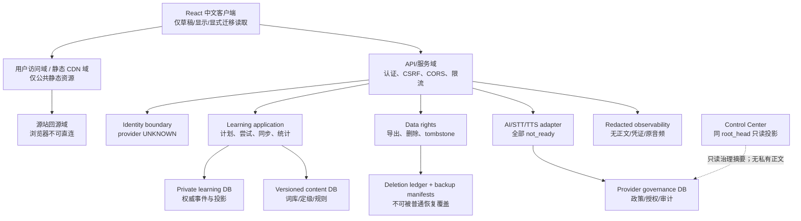
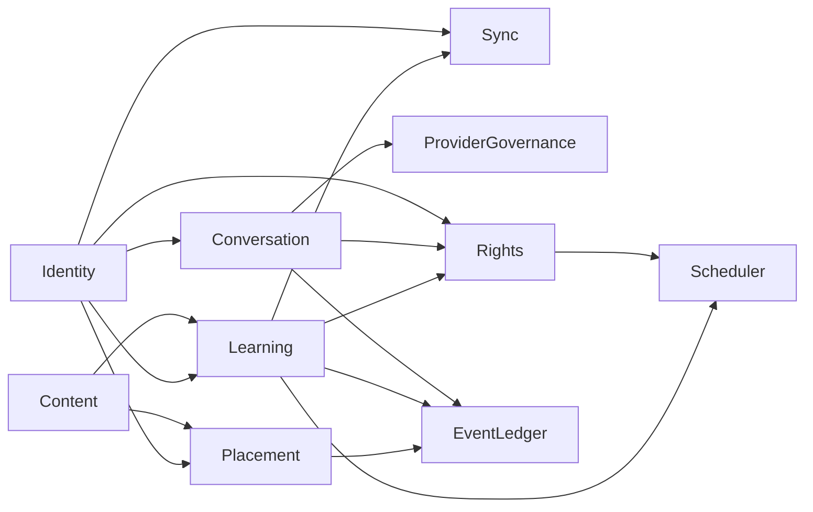
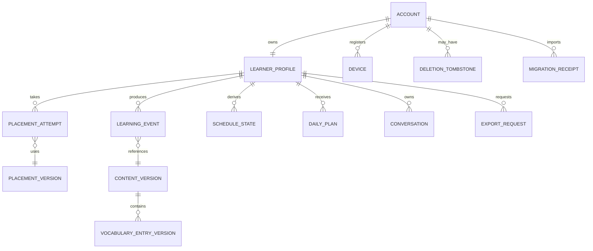
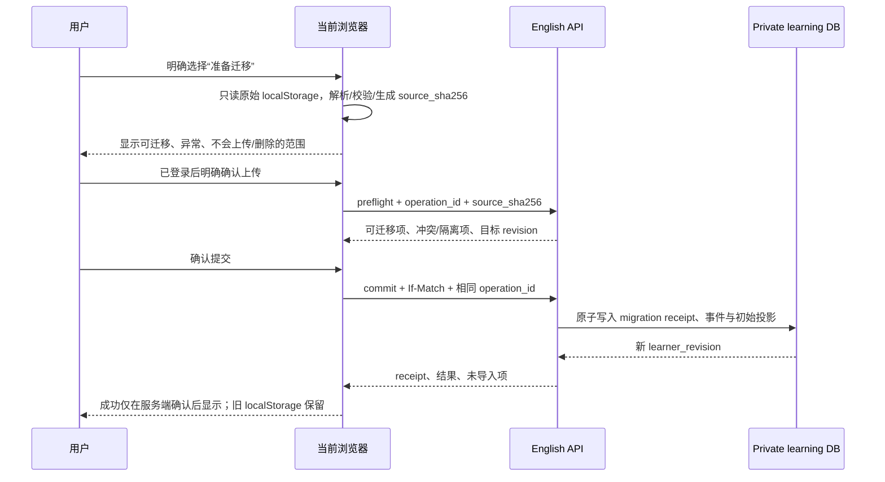

# AI English Learning：发布完整性架构

**文档版本**：v1.0
**工作项**：EL-ARC-101
**变更 ID**：arch-20260817-english-release-completeness-001
**产物 ID**：artifact-english-release-completeness-architecture-001
**负责人**：固定 05 架构师（role-architect）
**状态**：待架构审核（architecture-review）
**日期**：2026-08-17
**历史保留**：docs/02-architecture.md v1.1 是 Word v1.3 本地服务子切片的历史契约，本文件不覆盖、不改写或自动批准其下游任务。

---

## 0. 结论、范围与当前真相

本文件定义 AI English Learning 从当前浏览器单设备 Word 子切片走向正式 P0 发布完整性的目标架构契约。它规定多用户、定级、版本化词库、服务端学习记忆、间隔复习、真实 AI/STT/TTS 的受控接入、跨设备同步、导出、删除和恢复的边界；它不实现这些能力。

当前运行事实必须保持如下表述，任何设计稿、静态页面、种子数据、HTTP 200 或文档均不得改变：

| 事实 | 当前状态 | 本文件的处理 |
|---|---|---|
| Word 间隔复习 | 仅当前浏览器、当前设备的 localStorage 子范围 | 作为可选、显式、可核验迁移来源，不作为服务端或跨设备事实 |
| 后端运行时 | 未实现 | 定义未来服务契约；当前整体 readiness 为 not_ready |
| 登录与真实账号 | 未实现且未获真实账号/凭证授权 | 只定义身份边界与接口，不创建账号、不处理真实身份数据 |
| 跨设备同步 | 未实现 | 只定义服务端权威、revision 与冲突语义 |
| AI、STT、TTS provider | UNKNOWN | 不选择、配置、调用或模拟第三方 provider |
| 正式词库、20 场景、统计 | 尚无真实服务闭环 | 定义版本、证据与验收门，不把现有静态内容计为完成 |
| 生产发布 | 冻结 | 不选云厂商、域名、端口、凭证、预算或部署方案 |

本单元只交付本文档以及必要的项目 workflow 事实登记。它不修改前端、后端、registry、服务、测试实现、部署配置或任何真实用户/第三方数据；不启动 EL-PM-101 或任何下游角色。

---

## 1. 权威输入与追溯

下列输入均在入场时按 SHA-256 回算；本文的实现约束以其内容为准。

| 输入 | 路径 | SHA-256 | 本文使用方式 |
|---|---|---|---|
| 共享边界 ADR | architecture/03-four-project-shared-boundary-adr.md | e3073a01ceda280b8dda4d77b58de7e9755d3f77d21f6ebb5497c8882508840a | 共享治理、五类地址、Control 只读投影与真相态 |
| 发布重排计划 | docs/04-four-project-release-completeness-replanning-plan.md | 96decb8f1835cc85bd530c21b2969d4d077f31e6086425ea911f9d5b187bbe26 | P0 完整性与工作流顺序 |
| 真实可用产品增量 | docs/05-four-project-real-usable-product-delta.md | e613e79f44100840542fb6531e155cf0edd0079a6fc213af328fba075750bc01 | 当前真相、入口关闭与 English 增量 AC |
| 域名/CDN/服务边界 | architecture/02-domain-cdn-service-boundary.md | d8d7a594b18195e85795b01c7c9c6829222571ba65ddb9629256fab2cf29114b | 地址、缓存、回源、CORS 与安全边界 |
| 发布 PRD | projects/ai-english-learning/docs/01-prd.md | 8badf942aefc7ebd2c62526511aa69f0da334cefeb5688fd7281d0924e557e46 | P0 范围与 AC-AEL-REL-01..36 |
| 历史 Word 架构 | projects/ai-english-learning/docs/02-architecture.md | 0f80bfd20820d795904893778f68f40a2366b29d13db2766d4f3dabd190b88c6 | 本地 Word v1.3 的幂等、队列、提醒和 SQLite 子切片 |
| 发布 UI 提示词 | projects/ai-english-learning/ui/05-release-completeness-ui-prompt.md | 2adba179503582f9c1bc9524a64ec1f04fd624fc653403e23ff69713bfa6a5ad | 中文、状态、响应式与数据权利界面契约 |
| 发布 UI 设计 | projects/ai-english-learning/ui/06-release-completeness-ui-design-v1.0.md | 7c1f2318ec636b5f18ee4af543a042c5b873c511bfb3f95274c3d50c36ff899d | 12 桌面、4 平板、10+10 移动页面与 36 条 AC 映射 |

输入批准不等于代码、数据、provider、网络、账号、服务或生产环境已经可用。

---

## 2. 架构决策与不变量

### 2.1 技术基线

| 层 | 决策 | 原因 | 不采用的做法 |
|---|---|---|---|
| Web 客户端 | 保留现有 React + TypeScript + Vite 入口；未来用查询缓存承载只读服务数据，用本地草稿承载未提交输入 | 现有入口已存在，适合 320px、键盘和读屏的完整中文页面 | 以前端内存、localStorage 或预置 JSON 冒充服务端学习事实 |
| API | Node.js 22.12+、TypeScript strict、Express HTTP 边界；业务核心为无框架依赖的 domain modules | 与历史 Word v1.1 的 Express + TypeScript 契约连续，降低迁移与联调成本 | 浏览器直接访问数据库、provider 或将调度逻辑散入页面 |
| 事务存储 | 关系模型与迁移接口；SQLite 仅允许本地开发/集成切片，正式多用户与跨设备前必须采用支持并发事务、备份和行级隔离的关系数据库，具体托管形态 UNKNOWN | 正式 P0 有账户隔离、并发 CAS、删除/恢复和跨设备一致性要求 | 把浏览器存储、单个 SQLite 文件或缓存作为正式多用户权威 |
| 异步任务 | 受服务端持久化 job/worker 调度；每日计划、提醒、导出、删除、备份均有可重试任务记录 | 任务不能依赖用户页面是否打开 | 浏览器定时器、页面刷新或仅 HTTP 成功作为完成证据 |
| AI/STT/TTS | provider adapter + 版本化政策/授权门；provider 与凭证均 UNKNOWN | 每类外部处理需单独审查数据用途、权利、成本与可用性 | 固定回复、MOCK_TRANSCRIPT、固定评分或浏览器朗读冒充真实能力 |
| 缓存 | 只缓存公开、内容寻址的静态资源；私有 API、HTML、导出和语音数据默认 no-store | 防止 CDN、浏览器或中间层泄露跨账号数据 | 将个人计划、对话、音频、导出或 API 响应放入共享 CDN 缓存 |

### 2.2 发布不变量

1. 每个学习事实必须可追溯至所属 learner、版本化内容/规则、服务端接收时间、操作 ID 与 revision；客户端时间只可作为诊断字段，不能决定学习日、排名、结算或冲突胜负。
2. 服务端学习事件是权威；派生计划、统计、队列和缓存均可由事件与版本重放。未确认写入、离线草稿和 localStorage 永远不是已同步事实。
3. 每一个用户数据读取和写入都必须按 account_id 与 learner_id 双重作用域过滤。跨账号、跨项目、跨环境读取默认拒绝。
4. reveal、完整拼写错误和其他不可逆薄弱证据不得被覆盖或静默丢失；重复请求不重复计数。
5. 用户确认、系统推断、外部可验证事实、来源观点、UNKNOWN 与冲突必须独立建模。特别是“用户已确认”不等于“外部已核验”。
6. 未获完整七步授权的 AI/STT/TTS 能力恒为 not_ready，外部网络字节为 0；canary 不会隐式开启 runtime。
7. 任何当前页面、UI 设计资产、seed/demo 或健康端点都不能把全产品状态标为 live；当前整体状态为 not_ready。

### 2.3 总体结构



---

## 3. 数据域、owner 与禁止流向

### 3.1 权威 owner 矩阵

| 数据域 | 权威 owner | 权威存储 | 可再生派生物 | 写权限 | 禁止流向 |
|---|---|---|---|---|---|
| 身份映射与会话 | English Identity boundary | 身份服务/会话存储，provider UNKNOWN | 会话内 claims、短期服务器 session | 仅身份模块 | 不写入学习事件、日志或 CDN 的真实标识 |
| learner 档案、目标、时区、设备 | Learning domain | Private learning DB | 只读 profile cache | 仅所属 learner 经 API | 其他账号、Career、Model、Control 正文投影 |
| 定级、学习计划、Word 事件、队列、统计 | Learning domain | Private learning DB 的不可变事件表与事务投影 | today cache、统计物化视图 | 仅学习命令处理器 | 前端本地状态、共享 CDN、跨项目数据库 |
| 版本化词库、定级题、答案、规则 | English Content governance | Content DB / immutable version bundle | 内容索引、只读缓存 | 内容治理流程；当前未实施 | 将原始版权内容放入日志、Control 或未经许可的 CDN |
| 对话、转写、语音元数据 | Conversation/Voice domain | Private conversation store；原音频默认临时对象存储，provider/storage UNKNOWN | UI 片段、用户导出包 | 所属 learner 与受权 provider adapter | Control、共享缓存、训练用途、未同意第三方 |
| provider 政策、执行授权、审查和环境登记 | English provider governance | 独立 governance DB | 只读审核摘要 | 治理写入流程，不由业务请求写入 | 业务学习事实库、浏览器、用户可编辑设置 |
| 导出、删除、tombstone、恢复锚点 | Data rights domain | 删除账本 + backup manifest 存储，与 learning DB 隔离 | 用户可见进度、无正文审计摘要 | 受权的数据权利工作流 | 从普通恢复流程回写为活动账号 |
| 遥测与审计 | Observability domain | 独立、最小化日志/指标存储 | 聚合指标 | 系统组件；不可由用户正文驱动 | 凭证、完整对话、答题原文、原音频、导出内容 |

English 的身份域、Cookie、私有学习域与 Career 独立。Control Center 只可读取同一 root_head 下版本化的、最小化治理投影，例如项目 ID、状态、版本、hash、observed_at 和 non-sensitive readiness；它无权读取账号、简历式资料、学习事件、对话、转写、证据正文或音频，且业务/Git/workflow 写副作用恒为 0。

### 3.2 数据分类与保留原则

| 分类 | 例子 | 默认保留/处理原则 |
|---|---|---|
| 公共或受许可参考 | 词条身份、词形、题库版本、规则版本、许可说明 | 仅在权利允许范围内分发；没有有效版本、来源、许可或答案完整性即隔离，不能出题 |
| 私有学习事实 | 定级、目标、作答、reveal、错误、复习状态、统计、提醒 | 仅对应 learner；用于计划/统计的每次推断保存规则版本与证据引用 |
| 高敏感私有内容 | 自由对话正文、转写、可选长期音频 | 默认最小化；未经单独明确选择不得用于训练或二次用途 |
| 安全/审计元数据 | request_id、operation_id、版本、状态、错误码 | 不记录凭证、答案明文、输入正文或原音频；保留期由隐私政策确定，当前 UNKNOWN |
| 删除/恢复安全数据 | tombstone generation、删除请求状态、备份 manifest/hash | 独立账本优先于普通备份；用于防复活，不用于产品画像 |

私有数据只能沿“用户授权的浏览器 → English API → 私有存储/受权 provider”流动。不得从私有域回流至公共内容域、CDN、公开指标、Control 投影、其他项目或训练数据集。

---

## 4. 模块边界与无环依赖

| 模块 | 职责 | 允许依赖 | 明确不负责 |
|---|---|---|---|
| identity | 会话、账号/访客主体、登出、授权上下文、设备撤销 | session store、identity adapter | 学习业务、词库、provider 调用 |
| placement | 版本化定级题、作答、结果、置信/限制、初始计划输入 | content read port、learning event port | 默认等级、客户端评分、跨账号结果 |
| content | 词库/题库/答案/规则版本及权利校验 | content store、governance metadata | 用户进度、私人对话、实时 provider |
| learning | today、队列、attempt/reveal/incorrect、S0-S4、统计、时区 | content read port、learning store、job port | 认证、直接 SQL 以外的 provider/浏览器逻辑 |
| sync | bootstrap、delta cursor、revision/CAS、冲突摘要 | identity、learning read/write ports | 客户端 LWW、离线静默结算 |
| conversation-voice | 20 场景、自由对话、AI/STT/TTS adapter、文本降级 | identity、provider governance、private conversation store | 固定脚本冒充生成、未授权 provider 调用 |
| data-rights | 导出、删除、tombstone、恢复核验 | identity、learning/conversation stores、deletion ledger | 删除前显示成功、普通备份直接恢复 |
| scheduler-worker | daily plan、提醒、导出/删除任务、重试/死信 | transaction ports、clock、job store | 浏览器可见状态的直接修改 |
| transport | HTTP、认证、CSRF、输入验证、error envelope、rate limit | application modules | 业务规则或跨租户 SQL |
| observability | 最小日志、指标、trace correlation | redaction policy | 存放用户正文、原音频或凭证 |



箭头只表示运行时依赖。治理/角色容量顺序不是运行时依赖：Control 不成为 English 运行前置，English 事实也不反向依赖 Control。所有模块只能依赖下层 port/interface，不得互相导入实现，从而避免循环依赖。

---

## 5. 数据模型、关系与事务规则

### 5.1 核心实体



| 实体 | 最小关键字段/约束 | 说明 |
|---|---|---|
| Account / LearnerProfile | account_id、learner_id、status、profile_revision、time_zone_version；account_id + learner_id 唯一 | 单账号单学习者；不支持家庭子档案、组织班级或跨项目共享身份 |
| GuestSession | guest_session_id、browser_scope、expires_at、capability_set | 仅体验；无导出、删除、跨设备、长期记忆或正式统计资格 |
| Device | device_id、learner_id、registered_at、revoked_at、last_sync_cursor | 设备 ID 是服务端注册的随机标识，不以浏览器 localStorage 作为权威 |
| PlacementAssessmentVersion / Attempt / Result | assessment_version、question_version、answer_event、result_level、confidence、limitations、completed_at | 覆盖 A1-C2；未完成、答案不足或评分失败只能为 incomplete/not_ready，不能产生默认等级 |
| VocabularyCatalogVersion / EntryVersion | catalog_version、entry_id、entry_version、level、meaning、example、target_answer、accepted_answer_set、source_ref、rights_status、content_hash、active | 任一必填字段/许可/身份缺失即 data-exception，禁止出题与计错 |
| LearningPlanVersion / DailyPlan / PlanItem | plan_version、reason、study_day、timezone_revision、item_version、capacity、status | 每项推荐原因只能来自定级、用户目标、到期或薄弱证据，并保留引用 |
| Attempt | attempt_id、learner_id、item_version、opened_at_server、attempt_revision、settlement_key、status | 一次尝试只允许一个调度结算；同一次的 hint/reveal/incorrect 证据可保留但不得重复推进 |
| LearningEvent | event_id、operation_id、effect_key、event_type、occurred_at_server、content_version、rule_version、before/after evidence ref | 追加式、不可变；个人删除时以受控 redaction/tombstone 取代直接回滚 |
| ScheduleState | learner_id、item_version、rule_version、state_revision、stage、due_day、weak_evidence_ref、paused_until | 是事件投影，不允许前端直接写入 |
| ReminderPreference / ReminderJob | learner_id、timezone_revision、quiet hours、preference_revision、job_id、status | 偏好不等于已送达；provider/推送能力未就绪时状态为 not_ready |
| Conversation / Turn / VoiceRecord | conversation_id、scenario_version 或 free-topic、turn_id、provider_ref、consent_revision、retention_mode | 只有真实 provider 完成后可有真实生成/转写/音频结果；原音频默认临时 |
| OperationRecord | account_id、operation_id、request_hash、result_code、response_revision、expires_at | 同一 account + operation_id 唯一；同键不同 body 返回冲突，不重复执行业务副作用 |
| SyncCursor | learner_id、cursor、source_revision、issued_at | 服务端签发/校验；客户端 cursor 非信任输入 |
| MigrationReceipt | learner_id、legacy_storage_version、legacy_generation、legacy_revision、source_sha256、mapping_version、result_revision | learner_id + source_sha256 唯一；证明导入结果，不把 localStorage 原始值当永久权威 |
| ExportRequest | export_id、snapshot_revision、format、status、expires_at、manifest_hash | 可读与机器可读是两次独立请求；空文件不是成功 |
| DeletionTombstone / BackupManifest | account_id、deletion_generation、applied_generation、backup_generation、schema_version、hash、audit_head | 删除账本独立于普通备份；恢复前必须比较 generation 与账本 |

### 5.2 复合租户、版本与索引约束

1. 每个私有表包含 account_id 和 learner_id。所有外键优先采用复合键，例如 (account_id, learner_id, item_version)；查询层必须先由认证主体注入 account_id，禁止只按 item_id、attempt_id 或 email 查询。
2. Account/learner 的每次可见状态修改在同一事务递增 learner_revision。写入请求必须携带 If-Match 的期望 revision；冲突返回 409，不执行客户端时间 LWW。
3. OperationRecord 对 (account_id, operation_id) 唯一，保存 canonical request_hash。相同 operation_id + 相同 request_hash 返回首次结果；相同 operation_id + 不同 request_hash 返回 IDEMPOTENCY_PAYLOAD_MISMATCH。
4. LearningEvent 对 (learner_id, effect_key) 唯一；一个 attempt 的 settlement_key 也唯一。重复 reveal、错误或网络重试返回原事件/结果，不再增加薄弱计数、阶段或统计。
5. 词条、题目、答案集合、定级、调度规则、统计公式与 provider policy 均不可原地覆盖。新版本追加，历史事件引用当时版本。
6. 必要索引至少覆盖：(account_id, learner_id, learner_revision)、(learner_id, item_version, due_day)、(learner_id, occurred_at_server)、(learner_id, operation_id)、(learner_id, cursor)、(account_id, deletion_generation) 和所有外键。

### 5.3 原子写入边界

以下动作必须在一个事务中完成：身份/租户校验 → Idempotency 校验 → 当前 revision/CAS 校验 → 追加事件 → 更新 ScheduleState/DailyPlan/统计投影 → 写 OperationRecord → 递增 learner_revision → 写最小审计记录。任一部分失败则回滚；不允许“事件已写但状态未投影”或“页面先称成功、稍后再补写”。

对于 provider 调用，网络请求本身不与数据库事务保持锁。服务先创建具幂等键的 operation，获得真实结果后以新事务落库；若超时/失败则 operation 为 failed/unconfirmed，绝不伪造回复、转写或音频。当前 provider 未授权，因此该路径不产生网络字节。

---

## 6. 服务端学习记忆、调度与时间语义

### 6.1 Word 事件与成绩规则

Word 命令至少包括 begin attempt、hint used、complete answer、confirm reveal、incorrect、skip、pause、resume 和 reset。答案揭晓必须经显式确认；在确认前不得从 API、辅助文本、日志或缓存泄露完整答案。

| 结果 | 事件/证据 | 统计语义 | 调度语义 |
|---|---|---|---|
| clean-independent-correct | 无泄露答案辅助且完整拼写正确 | 计入独立正确 | 仅按规则版本推进 |
| assisted-correct | 使用非泄露提示后正确 | 单列，不计独立正确率 | 不得以此单独形成掌握证据 |
| revealed / correct-after-reveal | 用户确认查看后，或查看后答对 | 单列，不计独立正确 | 形成薄弱证据；同尝试不重复推进 |
| submitted-incorrect | 完整错误提交 | 单列错误 | 形成薄弱证据；同尝试不重复推进 |
| unconfirmed / offline | 服务端未确认 | 不计题量、正确、掌握或同步 | 保留用户可见重试，不暗中补造 |

### 6.2 规则版本、学习日与 S0-S4

正式服务使用版本化 MemoryRuleVersion。当前 PRD 定义的目标规则为：薄弱证据进入 S0；在容量允许时进行受控日内复现；跨日复习以 D+1、D+3、D+7、D+14 推进；掌握后进行 D+30 maintenance；已掌握项再次独立错误或 reveal 时立即回到薄弱状态并保留历史。每次计划和事件记录 rule_version、timezone_revision、server-calculated study_day 及具体 due_day。

历史 Word v1.3 本地引擎存在其既有间隔和状态实现。本文件不将其历史日期强行改写为新规则；迁移时用映射版本将可验证的 legacy state 转成初始服务端状态，并将原始规则/日期保留在 MigrationReceipt。无法安全映射的项目进入 data-exception，不计错、不静默“修复”。

学习日由服务端接收时刻加 learner 当前有效 IANA 时区计算。时区变更写入 TimeZoneChangeEvent，带 effective_from_study_day 和旧/新 timezone_revision：已确认历史事件的学习日永不重写；新计划仅从生效边界向后重新生成。客户端日期、设备时钟和浏览器时区只能提示异常，不能覆盖该规则。

### 6.3 每日计划与提醒

1. scheduler 根据服务端时钟、当前时区版本、到期/逾期、容量、目标和薄弱证据生成或重放 DailyPlan。
2. 每个 PlanItem 带 reason_code 和 evidence_ref；没有推荐依据不能标为个性化计划。
3. missed、failed、no-change 是三种不同作业结果：错过执行只记录 missed 并在下次安全补算；依赖失败为 failed；计划已存在则 no-change。三者均不能虚构完成量。
4. 全部待处理项为空时返回 empty；依赖/内容/服务未就绪返回 not_ready；已有可读旧计划但刷新失败可为 stale/degraded，并显示 last_success_at。
5. ReminderPreference 只是偏好。直到提醒通道、权限、限流、时区、免打扰和送达证据均真实可用前，提醒能力为 not_ready；浏览器通知请求或静态页面不能冒充服务端提醒。

### 6.4 localStorage Word 子范围的显式迁移

唯一可识别的历史来源是浏览器 key “ai-english-learning:spaced-recall:v1”，其 storageVersion 为 1，保存 generation、revision、items、attempts、eventsByEffectKey、sessions、reminderSettings 和 reminderRequests。临时 sessionStorage 的 “ai-english-learning:recall-session:<learningDay>” 仅是页面会话辅助，不导入为学习事实；写锁 key 也不是数据源。



迁移硬门如下：

| 阶段 | 契约 |
|---|---|
| 用户同意 | 迁移默认关闭；预检只读本地，不传输正文；上传与本地删除是两个独立确认 |
| 预检 | 校验 storageVersion、schema、generation、revision、时区、内容身份、答案与数据异常；raw 不完整/损坏/版本不支持时只报告，原数据不覆盖 |
| 身份 | 仅已认证的单一 learner 可提交；guest 不能把体验状态升格为正式账户事实 |
| 幂等 | learner_id + source_sha256 唯一；同一 source 重试返回同一 receipt；不同 payload 复用 operation_id 拒绝 |
| 映射 | 使用 versioned LegacyRecallMapping；原始历史标为 legacy-imported，不产生虚假的独立正确或实时作答事件 |
| 冲突 | 必须带 If-Match；冲突返回 409 和可读摘要，用户刷新后重新确认，不做静默覆盖 |
| 提交 | receipt、导入事件、ScheduleState、revision 在同一事务内写入；部分无效项隔离并可见，不能将全批错误计为成功 |
| 失败恢复 | 服务端失败、网络超时、CAS 冲突或校验失败均不清理 localStorage；成功后也只提供单独、二次确认的本地副本删除建议 |

迁移不是当前已存在的功能，不能作为跨设备已实现的证据。

---

## 7. 身份、同步、冲突与访客边界

### 7.1 身份与会话

1. 正式账号为一个 account 对应一个 learner profile。Career、Model、Control 不共享 English account_id、Cookie、session、数据库或授权集合。
2. 身份 provider、注册方式、密码策略、MFA 和凭证管理均为 UNKNOWN。架构仅要求 adapter 在服务端验证身份，并将稳定、不可猜的 auth subject 映射到 English account_id；浏览器不保存长期 bearer token。
3. 会话 Cookie 必须是 host-only、Secure、HttpOnly、SameSite=Lax 或更严格；禁止父域 Cookie、跨项目 Cookie 和把 localStorage 当身份/同步事实。
4. 登出、账号切换、会话失效和账号删除必须先清除私有页面缓存、内存草稿之外的个人响应，再渲染下一主体。身份未验证、无权或已删除时返回零私有数据。
5. guest session 仅限明示的短期体验；其 capability_set 不包含完整计分、跨端、导出、删除或长期账户历史。guest 演示记录不得混入注册用户统计。

### 7.2 Revision、CAS 与跨设备收敛

每个写请求使用三个不同标识：

| 标识 | 用途 | 禁止替代 |
|---|---|---|
| operation_id / Idempotency-Key | 重试去重与结果回放 | 不能作为并发版本 |
| learner_revision / If-Match | 比较服务端当前聚合版本 | 不能由客户端时间推导 |
| event_id / effect_key | 追溯不可变事件和单一业务效果 | 不能被 UI 按钮或随机页面 ID 重写 |

读取使用 bootstrap 或 delta cursor 获取同一 learner 的服务端权威状态。在线设备成功写入后，另一在线设备在下一次主动刷新、进入页面或自动同步中应在 10 秒内取得服务端收敛结果；该目标只在真实服务和联调测试通过后才能标为 live。

冲突处理规则：

1. 同一操作重试：operation_id 相同且 request_hash 相同，返回原结果，不增加事件。
2. 同一 attempt 的并发结算：仅第一个有效 settlement_key 可改变调度；后续返回已结算或 conflict，不重复推进。
3. 不同 attempt 的 reveal/incorrect：每条有效不可逆证据追加并保留，按服务端 accepted_at 与稳定 event_id 排序重放；若当前投影版本不匹配，客户端取得 delta 后由服务端在新的事务中应用，不按最后页面覆盖。
4. 偏好、目标、计划选择等非可交换状态：If-Match 不匹配即 409 REVISION_CONFLICT；响应包含当前 revision、冲突字段与安全重读路径，用户明确选择后重新提交。
5. 离线：客户端可保留本地草稿或未确认 intent，但不能结算、显示已保存或自动静默补发。联网后由用户确认，以原 operation_id 进行幂等重试。

---

## 8. AI、STT、TTS 与外部网络硬门

### 8.1 三类能力独立治理

AI 对话、语音转写和语音合成是三个独立 capability。每一个都有独立的 ProviderPolicyVersion、ExecutionAuthorization、ConnectorRevision、CanaryEvidence、RevReviewEvidence、QaEvidence 和 EnvironmentRuntimeRegistration。一个 capability 的批准、canary 或运行登记不授权其他两个。

唯一启用序列固定为：

1. 政策、数据用途、来源/权利和保留边界获批；
2. 获得独立执行授权；
3. 实现指定 connector revision；
4. 在精确、限时、同修订 canary 授权内运行 canary，且 runtime_enabled 始终为 false；
5. 同 connector revision 的安全/架构复审 P0/P1 为 0；
6. 同 connector revision 的 QA 为 PASS；
7. 在获批 environment 写入 EnvironmentRuntimeRegistration，才可将该 capability 的 runtime_enabled 设为 true。

第 7 步前，任何 runtime 请求、readiness 绿色标记、真实 provider 网络字节、真实 AI 输出、真实转写或真实 TTS 音频均为 0。本单元当前连步骤 1 的具体 provider/权利输入也未形成，因此 AI/STT/TTS 全部为 UNKNOWN/not_ready；不得运行 canary。

### 8.2 精确网络与数据最小化边界

未来每个 provider connector 必须在 governance 中冻结 exact scheme、hostname、port、path 前缀、DNS 解析、重定向规则、最大 body、timeout、并发、rate limit、TLS 和 response schema。网络前门按 allowlist 执行，拒绝 IP literal、私网/loopback/link-local、DNS rebinding、非 HTTPS、越界重定向、未登记 host 和未登记 path；浏览器不得直连 provider。

| capability | 允许传输的最小数据（须另获用户同意） | 默认禁止 |
|---|---|---|
| AI 对话 | 当前会话所需的用户输入、已确认等级/目标和有限上下文，带 purpose/consent revision | 账号标识、其他账号资料、未提供个人事实、训练用途、完整导出内容 |
| STT | 为本次转写所需的短时音频和最小关联 ID | 未授权录音、永久原音频保存、日志原音频、把 mock 文本标为转写 |
| TTS | 需要朗读的已确认回复文本和语言/声音参数 | 用户原音频、跨会话隐私上下文、把浏览器朗读标成 provider TTS 成功 |

AI 全失败时保留已确认历史和用户输入，返回 failed/not_ready 与重试动作；绝不插入固定脚本作为新回复。STT/TTS 失败时文本路径永远可用，但文本可用不等于语音能力 live。

20 个场景由不可变 ScenarioCatalogVersion 管理。正式环境只有在该版本明确列出 20 个 active 场景、每个场景可进入且真实 AI 的成功/真实失败路径均完成验证时，才能声明“20 场景可用”；场景目录、欢迎语或静态示例本身不构成真实 AI 结果。自由对话与场景对话共享同一安全/授权门，但分别保存 conversation type、scenario_version（自由对话为空）和上下文边界。

---

## 9. HTTP 契约、真相态与错误信封

### 9.1 共同协议

所有未来业务接口位于 API 服务域的 /api/v1 前缀下，使用 JSON、UTF-8 与 request_id。所有变更请求携带：

- 认证会话或受限 guest session；
- Idempotency-Key（映射为 operation_id）；
- If-Match: learner revision（若动作修改 learner 聚合）；
- CSRF token（Cookie 会话的同源变更请求）；
- 客户端可观测时间仅作为 client_observed_at，服务端绝不据此判定学习日。

成功响应不是万能对象，而是三部分明确的语义：

```json
{
  "data": {"resource_specific": true},
  "truth": {
    "state": "live|empty|not_ready|stale|degraded|failed|offline|unconfirmed|conflict",
    "source": "english-learning-service",
    "version": "content/rule/provider version or null",
    "as_of": "server-known instant or null",
    "observed_at": "server response instant",
    "last_success_at": "instant or null",
    "freshness": "fresh|stale|unknown",
    "coverage": "complete|partial|unknown"
  },
  "user": {
    "storage_scope": "server_private|guest_session",
    "revision": 42,
    "subject_scope": "current-learner-only"
  },
  "operation": {
    "operation_id": "optional for writes",
    "status": "applied|duplicate|queued|failed|not_applicable",
    "request_mode": "runtime|control",
    "data_mode": "live|guest_experience|null"
  },
  "request_id": "opaque"
}
```

“live”只能表示该资源由真实、已授权运行路径产生；它不代表当前用户已有数据、外部 provider 已启用或全产品已经发布。empty 不等于 not_ready；unknown 不等于 0；HTTP 200 不等于业务完成。

错误响应固定为：

```json
{
  "error": {
    "code": "REVISION_CONFLICT",
    "message": "简体中文、可行动且不泄露他人信息的说明",
    "retryable": false,
    "impact_scope": {
      "project_id": "ai-english-learning",
      "capability": "learning-sync",
      "resource_id": "optional opaque id"
    },
    "details": {"safe_fields_only": true}
  },
  "truth": {"state": "conflict", "observed_at": "server instant"},
  "request_id": "opaque"
}
```

标准错误码至少包括 UNAUTHENTICATED、FORBIDDEN、ACCOUNT_DELETED、VALIDATION_FAILED、IDEMPOTENCY_PAYLOAD_MISMATCH、REVISION_CONFLICT、ATTEMPT_ALREADY_SETTLED、OFFLINE_SETTLEMENT_DISABLED、CONTENT_DATA_EXCEPTION、PROVIDER_NOT_READY、PROVIDER_POLICY_DENIED、RATE_LIMITED、EXPORT_NOT_READY、DELETION_PENDING、DELETION_FAILED、BACKUP_RESTORE_BLOCKED、DEPENDENCY_NOT_READY 和 INTERNAL_SAFE_FAILURE。

### 9.2 API 资源契约

| 资源 | 未来接口 | 关键输入与返回 | 失败/安全规则 |
|---|---|---|---|
| 健康/就绪 | GET /healthz；GET /readyz | healthz 仅进程存活；readyz 返回 overall 与 capability map | healthz 200 不等于 ready；当前无运行时，不能声称接口存在 |
| 会话 | GET /api/v1/session；POST /api/v1/guest-sessions；DELETE /api/v1/session | 当前主体、scope、过期和清屏指令 | 不暴露其他账号是否存在；登出/失效清私有缓存 |
| 定级 | GET /placement/active；POST /placement-attempts；POST /placement-attempts/{id}/answers；POST /placement-attempts/{id}/complete | 版本化题、有效作答、A1-C2 结果/限制 | 未完成/失败不能返回默认等级 |
| 今日和队列 | GET /today；GET /review-queue；GET /learning-items/{id} | plan/version/reason、due/overdue、时间/规则版本 | 内容缺项为 data-exception，不能出题或计错 |
| Word 尝试 | POST /attempts；POST /attempts/{id}/hints；POST /attempts/{id}/answers；POST /attempts/{id}/reveal；POST /attempts/{id}/settle | attempt/revision、无泄露的提示、显式 reveal confirm、结果 | 所有写操作幂等/CAS；离线/未确认不结算；答案不能提前泄露 |
| 学习控制 | POST /learning-items/{id}/skip；POST /pause；POST /resume；POST /reset；PUT /reminder-preferences | 原因、有效时区、状态与新 revision | 正确禁用而非假成功；提醒未就绪必须明示 |
| 同步 | GET /sync/bootstrap；GET /sync/changes?cursor= | 权威 revision、delta、cursor、冲突摘要 | 只读取当前 learner；不触发 provider、计划生成或隐式写入 |
| 本地迁移 | POST /migrations/spaced-recall/preflight；POST /migrations/spaced-recall/commit | source_sha256、legacy metadata、显式确认、receipt | 仅已认证主体；失败不触碰本地原件；不导入临时 sessionStorage |
| 对话与语音 | GET /conversation-scenarios；POST /conversations；POST /conversations/{id}/turns；POST /speech/transcriptions；POST /speech/synthesis | 场景/会话版本、同意版本、operation | 当前全部 PROVIDER_NOT_READY；不得返回脚本、mock transcript 或固定分数 |
| 统计 | GET /statistics?from=&to= | 指标、公式/规则版本、as_of、证据抽屉引用 | 指标重放差异非零时状态 data-exception/核对中 |
| 导出 | POST /exports；GET /exports/{id} | format=human|machine、snapshot_revision、进度、过期 | 两格式独立；空文件/未生成不可称成功；私有下载 no-store |
| 删除 | POST /deletion-requests；GET /deletion-requests/{id} | 二次确认、deletion_generation、状态/申诉路径 | 受理后立即撤权；失败不能显示已删除；当前服务未实现 |

所有列表接口使用服务器签发 cursor，不接受 offset 作为一致性承诺。所有私有 GET 均返回 Cache-Control: no-store，响应不含其他用户数据、凭证、内部 SQL、provider secret、答案揭晓前的完整答案或原始音频。

---

## 10. 五类地址、CDN、缓存与接入边界

没有已知的正式域名、DNS、CDN、证书、云厂商、端口、WAF 或预算。下表中的名字是职责占位，不是可配置、可访问或已部署资源。

| 地址类 | 开发 | 测试 | 生产 | 职责与硬门 |
|---|---|---|---|---|
| 用户访问域 | TBD | TBD | TBD | 用户只访问该入口；页面不得暴露 origin |
| 静态 CDN 域 | TBD | TBD | TBD | 仅 hash 静态 JS/CSS/图片；不含个人数据、HTML、API、导出或音频 |
| API/服务域 | TBD | TBD | TBD | 认证后的 JSON/流式受控接口；默认 private/no-store |
| 源站回源域 | TBD | TBD | TBD | 仅 CDN/WAF/reverse proxy 回源；禁止浏览器直连和“origin 备用访问” |
| internal 监听地址 | TBD；本地仅可绑定 loopback/私网 | TBD 私网 | TBD 私网 | worker、DB、provider adapter 仅内部可达；浏览器无路由 |

缓存与回滚规则：

1. 内容寻址/文件名含 hash 的公开静态资源可 immutable 长缓存；发布清单指向新版本。HTML/SSR（如以后引入）、API、会话、导出、语音、错误响应和包含用户状态的任何内容均不得被共享缓存。
2. 静态回滚只切换已验证的 manifest/版本，不回滚数据库、学习事件、tombstone 或 learner_revision。数据回滚需独立恢复演练和删除账本核验。
3. CNAME、DNS、证书/SNI、origin Host、真实客户端 IP 传递、WAF 与安全组均待单独 DevOps/生产授权，当前 UNKNOWN。任何将源站直接暴露给浏览器的配置违反本架构。
4. CORS 仅允许精确用户访问 origin 的 scheme+host；禁止通配符加 Cookie。Cookie 会话请求必须校验 Origin/CSRF token。WebSocket/SSE 如以后使用，同样仅经 API 域、认证、origin 校验、心跳/断线重连和 no-store；目前未实现。

---

## 11. 可靠性、失败恢复、导出删除与备份

### 11.1 状态优先级与局部失败

| 情形 | 对外真相 | 恢复方式 |
|---|---|---|
| 无任何已确认服务数据且依赖未接通 | not_ready | 展示依赖/范围；不能回 seed/demo |
| 有真实旧计划/历史，刷新依赖暂时失败 | degraded 或 stale，附 last_success_at | 仅展示标明版本/时间的旧事实，允许显式重试 |
| 写入超时且服务端结果未知 | unconfirmed | 保留 operation_id，用户确认后安全重试；不推进 UI |
| 同步版本冲突 | conflict | 获取 delta、显示不可逆证据与字段差异、用户重新确认 |
| 一个词条缺字段/版本/权利 | data-exception | 隔离该题，继续其他合格题，不计错 |
| AI/STT/TTS 未授权或不可用 | not_ready/failed | 文字路径、保留输入和已确认历史；不插入 mock |
| 全部业务服务失败 | not_ready 或 failed | 页面不以静态界面或健康 200 称可用 |
| 统计重放与投影不一致 | degraded/data-exception | 冻结确定指标为核对中，保留原始事件、重建投影 |

### 11.2 导出

导出由异步 ExportRequest 表示，状态为 requested、authorizing、building、ready、expired、failed 或 cancelled。请求时固定 snapshot_revision、schema/rule/content versions、scope、created_at 和 manifest_hash；服务读取同一 revision 的私有数据，不在导出时混入以后事件。

人类可读摘要和机器可读数据是两个独立 format，各自有独立状态、下载 URL/令牌、到期时间与审计记录。下载只能由当前 account 通过 API 域获取，使用 no-store、短时/单主体授权；无文件、空文件、生成失败或授权失效均不是 ready。确切导出保留期、加密实现和储存供应商为 UNKNOWN，必须在数据权利实施门前由产品、固定 05 和安全/运维 owner 定案。

### 11.3 删除、tombstone 与不复活恢复

账号删除的未来状态机为 requested → identity-revoked → deleting-active-data → backup-expiry-pending → completed，或 failed。受理并确认后立即撤销登录和正常访问；活动数据在 24 小时内删除；备份残留最长 30 天自然到期。未完成时必须显示实际状态、失败原因与重试/申诉路径，绝不显示“已删除”。

每次账户删除生成单调的 deletion_generation 并写入独立 DeletionTombstone ledger。单条证据删除使用 evidence tombstone/redaction 记录，删除私有可识别内容后按规则版本重新计算受影响计划/统计；不可将删除前投影继续作为确定事实。若法律必须保留最小记录，必须另行列明目的、字段和期限；当前没有该例外清单，不能主张已满足。

备份 manifest 至少含 schema_version、backup_generation、source revision、tenant 分区计数、hash、audit head、deletion_generation 和 applied_tombstone_generation。恢复流程固定为：

1. 恢复到隔离路径，不替换活动库；
2. 验证 schema、哈希、外键、事件链、租户分区与 manifest；
3. 读取独立 deletion ledger，比较所有 deletion/tombstone generation；
4. 重放缺失 tombstone，确认没有已删除主体、证据或音频重新成为活动数据；
5. 仅在核验通过、读写健康和审计记录完成后，以受控切换恢复服务。

backup generation 低于 ledger、ledger 不可得、generation 倒退、manifest 损坏、账户 tombstone 缺失或无法重放时，恢复必须 fail closed。普通备份绝不能复活已撤销登录、已删除账号或已删除证据。当前没有备份/恢复实现与演练证据，因此 readiness 不能为 live。

---

## 12. 安全、隐私与可观测性

### 12.1 安全控制

- 认证后所有资源按 account_id + learner_id 二次授权；不存在“通过 UUID 即可读”的接口。
- Cookie 使用 host-only、Secure、HttpOnly、SameSite；变更请求执行 CSRF、Origin 和 Content-Type 校验。禁止 parent-domain Cookie、CORS 通配符凭证和 localStorage token。
- 输入采用 schema 校验、长度/结构限制、输出编码与参数化查询；词条、答案、对话、导出文件名、时区和 cursor 分别校验。
- API 按 account、session/device、IP 和 capability 进行限流；认证、导出、删除、provider 和迁移请求使用更严格的独立配额。限流响应不泄露账号存在性。
- 密钥、provider credential、数据库密码和证书只允许未来受控 secret store 注入；不得提交、回显、日志记录或通过 Control 投影暴露。具体 secret system UNKNOWN。
- 原始音频不进入普通日志/trace；对话和答案正文不进入应用日志。调试必须使用合成数据并经单独授权。
- 浏览器 CSP、frame-ancestors、防 MIME 嗅探、referrer policy、上传大小/类型限制和依赖漏洞处理在实现/安全评审门验证；当前未声明已实施。

### 12.2 可观测性与审计

每个请求有 request_id；每个写操作额外有 operation_id、learner_revision、capability 和安全的 impact_scope。指标仅汇总以下无正文数据：请求延迟/错误率、not_ready/degraded/stale 数、认证/CSRF 拒绝、幂等命中、revision 冲突、队列生成/延迟、内容异常、导出/删除任务状态、备份/恢复核验、provider gate 状态和外部网络字节。

审计记录保存操作类型、主体的不可逆散列/内部 ID、时间、版本、结果、前后 revision 和最小影响范围；不保存 token、密码、完整对话、答案、音频或下载正文。监控、告警阈值、存储位置、保留周期和访问控制 owner 均为 UNKNOWN，必须在上线前形成独立审计/运维证据。

---

## 13. 未来目录、迁移与命令合同

下列目录和命令是实现边界，不在本单元创建、移动或执行。现有 frontend 入口保持不动。

```text
frontend/                         # 既有 React 应用；本单元不修改
backend/                          # 当前未实现
  src/
    transport/                    # HTTP、session、CSRF、schema、error envelope
    identity/                     # account/guest/session adapter
    placement/                    # 定级领域
    content/                      # 版本化词库、题库、规则读取
    learning/                     # event、schedule、today、statistics
    sync/                         # cursor、revision、conflict
    conversation-voice/           # provider adapter，默认 not_ready
    data-rights/                  # export、deletion、tombstone
    jobs/                         # plan/reminder/export/delete worker
    persistence/                  # migration、transaction、repository ports
    observability/                # redaction、metrics、audit
  migrations/                     # 不可变、可验证的 schema migration
  tests/
    unit/ integration/ contract/ e2e/ security/ fixtures/
docs/                             # 本文件与保留的历史 Word 契约
```

| 未来命令合同 | 当前状态 | owner | 最晚验证门 |
|---|---|---|---|
| npm run lint | 前端已有入口；后端命令 NOT_IMPLEMENTED | 固定 06/02 | 代码审查前 |
| npm run typecheck | 后端 NOT_IMPLEMENTED | 固定 02 | 代码审查前 |
| npm run test:unit | NOT_IMPLEMENTED | 固定 02 | 实现单元验收 |
| npm run test:integration | NOT_IMPLEMENTED | 固定 02/08 | 服务/数据库联调前 |
| npm run test:contract | NOT_IMPLEMENTED | 固定 02/10 | 前后端联调前 |
| npm run test:scheduler-fake-clock | NOT_IMPLEMENTED | 固定 02/10 | S0-S4/时区/提醒验收前 |
| npm run test:migration | NOT_IMPLEMENTED | 固定 02/08/10 | localStorage 迁移前 |
| npm run test:backup-restore | NOT_IMPLEMENTED | 固定 08/10/11 | 删除/恢复与发布前 |
| npm run test:e2e | NOT_IMPLEMENTED | 固定 10 | 36 条发布 AC 前 |
| npm run test:security | NOT_IMPLEMENTED | 固定 09/10 | 安全发布门前 |
| npm run test:accessibility | NOT_IMPLEMENTED | 固定 06/10 | 320px、键盘、读屏、200% 门前 |
| npm run db:migrate / db:rollback | NOT_IMPLEMENTED；操作命令，不是“测试通过”别名 | 固定 08/11 | 每次 schema 变更与恢复演练前 |

命令表不等于命令已经存在或已运行。当前可见的前端 lint/build/浏览器 Word QA 仅证明已审范围的当前浏览器、当前设备子切片，不可替代本架构的后端、跨设备、provider、导出、删除、备份或发布测试。

---

## 14. 验证矩阵与发布阻断条件

| 验证域 | 至少应证明 | 当前状态 |
|---|---|---|
| 租户隔离 | A/B 账号、guest、删除/登出切换零泄露；复合 FK/RLS 或等价隔离 | NOT_IMPLEMENTED |
| 定级/词库 | A1-C2、版本/许可/答案完整性、异常隔离、无默认等级 | NOT_IMPLEMENTED |
| Word/记忆 | attempt/reveal/incorrect 幂等、S0-S4/D+30、日内插题、跳过/暂停/重置、时区 | 仅历史浏览器子切片通过；服务端 NOT_IMPLEMENTED |
| 并发/同步 | revision/CAS、重复请求、双设备冲突、10 秒成功同步目标、离线不结算 | NOT_IMPLEMENTED |
| 统计 | 原始事件重放、规则版本、独立正确率、时长/连续学习、差异隔离 | NOT_IMPLEMENTED |
| AI/STT/TTS | 三类独立七步门、精确 endpoint/SSRF、真实失败、文本降级、无 mock | NOT_IMPLEMENTED；provider UNKNOWN |
| 迁移 | v1 localStorage 预检、幂等、映射、隔离异常、失败保留原件、不导入 session helper | NOT_IMPLEMENTED |
| 数据权利 | 两种导出、活动删除 24h、备份 ≤30 天、tombstone、防旧备份复活 | NOT_IMPLEMENTED |
| 运行质量 | health/readiness 分离、观察性、限流、backup/restore、rollback | NOT_IMPLEMENTED |
| 中文/无障碍 | 全 P0 简中、320px、键盘、读屏、200% 状态/错误/图表等价表 | UI 规范已批准；实现与 E2E NOT_IMPLEMENTED |

正式 P0 发布必须同时满足：真实服务和真实数据闭环；所有相关单元/契约/集成/E2E/恢复/安全测试通过；P0/P1 未关闭为 0；所有资料保留其来源、版本、as_of、observed_at、last_success_at、freshness、coverage、revision 和 impact_scope；且生产部署另获具体授权。任一条件缺失均阻断“全功能完成”或 live 声明。

---

## 15. TBD、风险与解决门

| TBD/风险 | 当前值 | 解决 owner | 最晚门 | 未解决时的阻断范围 |
|---|---|---|---|---|
| 身份 provider、注册与凭证策略 | UNKNOWN | 产品 + 固定 05 + 固定 02/09 | 身份实现前 | 真实账号、跨设备、导出、删除全部阻断 |
| 正式数据库托管/加密/备份介质 | UNKNOWN | 固定 05 + 08 + 11 | 多用户实现前 | 正式多用户与恢复声明阻断 |
| 词库/题库来源、许可、A1-C2 覆盖 | UNKNOWN | 产品 + 内容/来源 owner + 固定 05 | 内容导入前 | 正式定级、出题、推荐阻断 |
| AI/STT/TTS provider、条款、成本、区域、保留期 | UNKNOWN | 产品 + 安全/隐私 owner + 固定 05 | 任一 capability 步骤 1 前 | 对应真实 provider、canary、runtime 全部阻断 |
| 提醒通道、送达证据、频率与免打扰政策 | UNKNOWN | 产品 + 固定 02/11 | 提醒实现前 | 服务端提醒保持 not_ready |
| 导出/删除隐私政策、法定保留、审计保留期 | UNKNOWN | 产品 + 法务/隐私 owner + 固定 05 | 数据权利实现前 | 导出/删除正式功能阻断 |
| 域名、CDN、API/origin/internal、证书、WAF、端口、预算 | UNKNOWN | 固定 11 + 固定 05 | 非生产部署方案前 | 生产访问/部署阻断；不得编造 |
| 可观测性、告警、RPO/RTO、容量目标 | UNKNOWN | 固定 11 + 固定 05 | 生产 readiness 前 | production go-live 阻断 |

---

## 16. 明确拒绝的方案与停止门

本架构明确拒绝：

1. 用当前 localStorage、预置 Alex、固定对话、MOCK_TRANSCRIPT、固定 86 分、静态统计或 HTTP 200 作为正式 P0 完成证据；
2. 用一个跨项目万能账号、父域 Cookie、共享数据库或共享私有档案模型替代 English 独立身份/私有边界；
3. 以客户端时间 LWW、页面整体覆盖或静默离线补写处理跨设备冲突；
4. 将词库版本/来源/许可、AI/STT/TTS policy、canary 或浏览器成功等同于 runtime enabled；
5. 将私有正文、对话、音频、导出、API 响应或源站回源地址放进 CDN、Control 投影、日志或浏览器可直连 origin；
6. 用普通备份恢复绕过 deletion ledger，或让已删除账户/证据复活；
7. 在未知 provider、域名、云、预算、凭证或真实用户授权下实施、采集、启服务、发送数据或部署。

重新评审触发条件包括：PRD/词库/隐私或 UI 变更；身份/provider/数据权利决策形成；历史 Word 子切片需真正迁移；任何安全、跨租户、删除/恢复、统计重放或可用性缺陷；以及准备进入任务拆解、实现、真实集成或生产。

**本交付停在 architecture-review。**
它不批准 EL-PM-101、后端/前端/数据/DevOps/QA、真实账号、provider、服务、采集、域名、CDN、云资源或部署；下一步必须由既有治理在本产物独立审查后单独决定。
