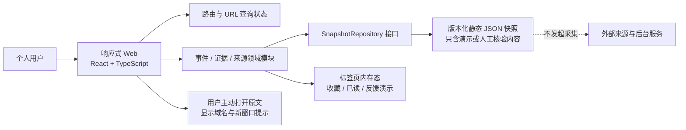
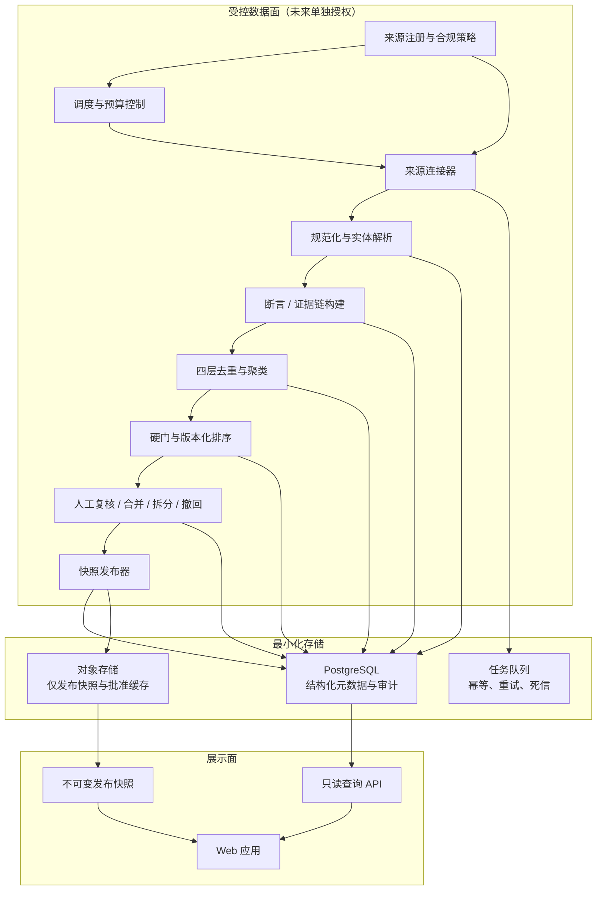
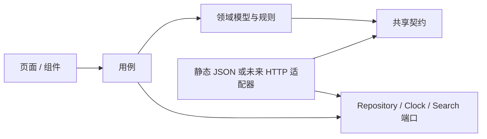
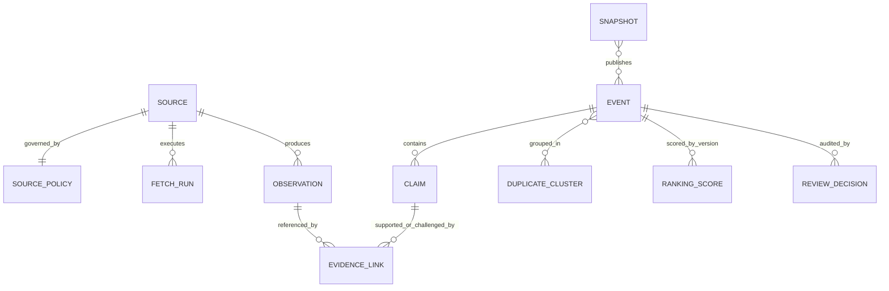
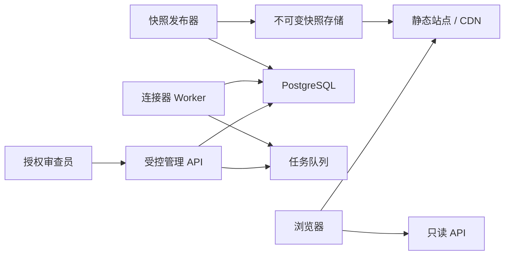

# AI Model Radar｜系统架构设计

## 0. 交付元数据

| 项目 | 内容 |
|---|---|
| `project_id` | `ai-model-radar` |
| 文档版本 | `1.0` |
| `change_id` | `arch-20260804-ai-model-radar-001` |
| 角色 | 固定 `05 架构师` / `role-architect` |
| 入场审批 | `approval-20260804-radar-architecture-entry` |
| 已批准 PRD | `docs/02-prd.md` v1.0，SHA256 `4d08c008bf0b2cd73d89a7771851bddd87b5b34a7b1e1465ec0e801fe12306fc` |
| 已批准 UI/UX Prompt | `ui/03-ui-prompt.md` v1.0，SHA256 `d001cea2e85c36317ca1e38c657a32527b3705a3f276f8d938b8b0ac6e450318` |
| 已批准视觉基线 | `ui/` 下 9 张图片，审批 `approval-20260804-radar-ui-baseline` |
| 当前里程碑 | MVP-1 可浏览 Web 内容版 |
| 当前停止门 | `architecture-review` |
| 本轮不包含 | 代码、真实来源接入、数据库实例、账号、付费 API、影子运行、生产部署 |

本文只定义架构决策、约束和未来契约，不代表任何服务已经运行。当前实现基线必须持续展示：

> 演示数据 · 人工快照 · 截至 `<演示时间>` · 未连接自动采集服务

## 1. 架构目标与不可突破的边界

### 1.1 架构目标

1. 先交付无需后端即可浏览、筛选和核对证据的简体中文 Web 内容版。
2. 让“事件、断言、证据、来源角色、事实标签、置信度、重要性”成为独立且可追溯的数据概念。
3. 把来源合规作为采集前硬门，而不是采集完成后的补充说明。
4. 用确定性规则完成规范化、硬门、去重和排序基线；任何模型能力只能作为可关闭的候选增强器。
5. 保留上一份可用快照，允许单来源失败、部分成功、撤回、更正、合并和拆分被完整审计。
6. 将 MVP-1 浏览面与未来 MVP-2 采集控制面隔离，避免静态演示代码演变成未经批准的隐形爬虫。

### 1.2 真实性不变量

- 没有真实采集运行凭证时，连接状态只能是 `demo_snapshot` 或 `not_connected`。
- “刷新”在 MVP-1 只重新读取当前版本化静态快照，不发起外部网络请求。
- 9 张视觉基线中的“真实连接”“系统运行中”“活动源”“延迟”“部分成功”均为未来状态示意。
- 图片中的真实厂商、模型、事件、来源数量、日期、百分比和性能结论均不是业务事实。
- 重要性与置信度是两套字段；来源数量不等于独立佐证数量；传播热度不等于证据质量。
- 没有 14–30 天影子运行前，质量指标的当前值只能是 `未实测`。
- 超过 24 小时的快照标记“可能过期”；超过 48 小时且无成功刷新时，不再称为“今日”。

### 1.3 当前与未来边界

| 能力 | MVP-1 本轮架构基线 | MVP-2 未来授权后 | 当前是否实施 |
|---|---|---|---|
| Web 浏览 | 静态构建、版本化演示快照 | 读取已发布快照 API | 否 |
| 搜索筛选 | 浏览器内针对公开字段 | 服务端分页与索引 | 否 |
| 来源采集 | 无；来源目录只是研究快照 | 合规连接器与调度 | 否 |
| 规范化/去重/排序 | 预生成演示结果，规则说明可见 | 后台确定性流水线 | 否 |
| 数据库/队列 | 无 | PostgreSQL + 任务队列 | 否 |
| 用户偏好 | 当前标签页内存态 | 经另行批准后持久化 | 否 |
| 账号/跨设备 | 无 | 独立产品与隐私评审 | 否 |
| 部署 | 不部署 | 独立发布审批后实施 | 否 |

## 2. 核心架构决策

| ADR | 决策 | 原因 | 被放弃方案 |
|---|---|---|---|
| ADR-001 | MVP-1 采用静态快照驱动的单页 Web | 先验证内容组织与证据体验；不制造后台已存在的错觉 | 直接建设全栈采集平台 |
| ADR-002 | 前端使用 React + TypeScript + Vite | 类型安全、组件化、静态构建成熟，适合现有 Web 优先路线 | SSR 全栈框架；当前没有动态服务端收益 |
| ADR-003 | 数据契约使用 JSON Schema + Zod 边界校验 | 同一契约可供静态快照、未来 API、测试夹具和迁移校验复用 | 只依赖 TypeScript 编译期类型 |
| ADR-004 | 事实标签作用于“断言”，置信度作用于“断言/事件”，重要性作用于“事件” | 防止把厂商观点、系统推断和业务影响混成单一分数 | 一个不可解释的 AI 总分 |
| ADR-005 | 去重采用确定性四层管线，语义相似只生成候选 | 版本相近事件容易误合并，必须以实体、动作和日期硬约束收口 | 只用向量相似度自动合并 |
| ADR-006 | 排序规则版本化且先过硬门 | 分数不能让无主源、受限或待核验内容进入正式日榜 | 纯点击、热度或黑盒模型排序 |
| ADR-007 | 来源准入默认拒绝，访问资格与内容权利分开评审 | robots 允许不等于版权、条款或 API 许可 | 发现 URL 即自动抓取 |
| ADR-008 | MVP-2 使用模块化单体 + 独立 Worker，不先拆微服务 | 规模未知，先保持事务、审计和运维简单，同时隔离采集风险 | 一开始建设多套微服务 |
| ADR-009 | 默认不使用生成式模型完成事实判定 | 降低幻觉、成本和提示注入风险；先建立可测确定性基线 | 全流程 LLM 摘要、分类、去重 |
| ADR-010 | 已发布快照不可原地覆盖 | 支持审计、回滚、撤回和失败时继续阅读 | 只保留数据库当前态 |

实施时只锁定当时仍受支持的稳定版本；依赖大版本升级必须单独验证，不在本文虚构 2026 年的具体版本号。

## 3. 总体架构

### 3.1 MVP-1 当前目标形态



浏览器应用不得在加载、筛选、搜索、重新载入快照时访问第三方来源。用户主动点击原文是显式导航，不是后台采集。

### 3.2 MVP-2 未来目标形态



连接器和 Worker 与公开查询 API 分开进程运行；即使采集面失败，已发布快照仍可独立浏览。

### 3.3 信任边界

1. **浏览器边界**：所有快照字段视为不可信文本，渲染前校验并默认转义。
2. **外部来源边界**：URL、重定向、响应正文、Feed、API 返回、文档内指令均不可信。
3. **控制面边界**：刷新、来源启停、人工审查和发布不是公共能力，必须鉴权并审计。
4. **发布边界**：只有通过硬门与人工抽检的版本化快照可进入展示面。
5. **第三方能力边界**：付费 API、模型服务、登录源、浏览器自动化均默认关闭；授权不能由代码配置暗中扩大。

## 4. 技术选型

### 4.1 MVP-1 前端

| 层 | 选择 | 约束 |
|---|---|---|
| 语言 | TypeScript 严格模式 | 禁止业务模型中的隐式 `any` |
| UI | React 函数组件 | 页面负责组合，领域规则不得散落在视图组件 |
| 构建 | Vite 静态构建 | 输出可由本地静态服务器验证；不等于生产部署 |
| 路由 | React Router | 日期、查询、筛选、排序写入 URL；详情返回可恢复上下文 |
| 领域状态 | reducer + Context | 事件选择、筛选、演示反馈；避免早期引入全局状态平台 |
| 远端状态 | MVP-1 不启用网络查询层 | 未来接 API 时再引入 TanStack Query 等缓存层 |
| 契约 | JSON Schema + Zod | 构建期校验快照，运行时失败进入可恢复错误页 |
| 样式 | CSS Modules + CSS Custom Properties | 落实浅/深色 Token、320–2560px 与 200% 缩放 |
| 图表 | ECharts 按需加载 | 只用于 Prompt 指定的少量图；必须有文本结论与数据表 |
| 测试 | Vitest、Testing Library、Playwright、axe | 覆盖领域规则、键盘、读屏状态、响应式和返回上下文 |

不引入 Markdown/HTML 富文本渲染器；摘要、断言和依据均按纯文本或受控结构化片段渲染。

### 4.2 MVP-2 服务端候选

在后续架构复核与实施批准后，采用 Node.js + TypeScript 的模块化单体：

- Fastify：公开查询和受控管理 API，使用 JSON Schema 校验与 OpenAPI 生成。
- PostgreSQL：事件、断言、证据、来源策略、运行记录、审计和快照元数据。
- BullMQ + Redis 兼容队列：来源任务、重试、并发与死信；仅在采集获批时引入。
- 对象存储：只保存不可变公开快照和经权利评审批准的临时响应缓存；默认不保存外部全文或媒体。
- OpenTelemetry 语义：链路、指标和结构化日志；日志禁止正文、凭证和个人偏好内容。

初期不拆微服务。来源连接器作为独立包和 Worker 进程隔离，待真实吞吐、团队和故障域数据证明需要后再拆分。

## 5. 模块边界

### 5.1 Web 模块

| 模块 | 职责 | 明确不负责 |
|---|---|---|
| `app-shell` | 导航、数据模式条、错误边界、主题、跳到主内容 | 事件排序与证据判断 |
| `today-radar` | 0–20 正式事件、紧急事件分区、日期切换 | 修改后台事件 |
| `event-catalog` | 跨日期搜索、组合筛选、排序、结果计数 | 搜索未授权全文 |
| `event-evidence` | 断言、证据根、支持/反证、更新时间线 | 把转载数当独立佐证 |
| `source-catalog` | 来源研究快照、访问级别、限制与核验日期 | 声称已接入运行 |
| `preferences-feedback` | 标签页内演示偏好、收藏、已读、不相关与撤销 | 云端保存或改变客观重要性 |
| `quality-explainer` | 硬门、去重、排序和指标定义 | 填写未实测指标 |
| `snapshot-loader` | 读取、校验、迁移静态快照 | 对第三方发起请求 |
| `truth-banner` | 从元数据唯一生成真实性文案 | 接受页面任意硬编码运行状态 |

### 5.2 未来数据面模块

| 模块 | 输入 | 输出 | 失败策略 |
|---|---|---|---|
| `source-registry` | 人工批准的来源与政策 | 可执行 `SourcePolicy` | 任一硬门未知则拒绝运行 |
| `scheduler` | 来源节奏、预算、最近成功 | 幂等 `FetchRun` | 超预算、暂停或重复任务不入队 |
| `connectors` | 允许的官方 API/Feed/页面 | 最小化 `Observation` | 单源失败隔离，不清空旧快照 |
| `normalizer` | Observation | 标准时间、实体、动作、语言、URL | 无法解析进入隔离区，不猜测 |
| `evidence-builder` | 规范化观察 | Claim、EvidenceLink、证据根 | 无主张-证据映射不得正式发布 |
| `deduplicator` | 实体键、指纹、候选相似 | DuplicateCluster | 自动层只做高确定合并，其余人工 |
| `ranker` | 合格事件、规则版本、偏好 | 分项得分与排名 | 硬门失败时分数无效 |
| `review-console` | 候选、冲突、合并建议 | ReviewDecision | 所有覆盖决定可回放、可撤销 |
| `publisher` | 已审核事件集合 | 不可变 Snapshot | 原子发布；失败继续服务上一版 |
| `audit-observability` | 所有状态迁移 | 审计、指标、告警 | 不记录正文、秘密或用户隐私 |

### 5.3 依赖方向



领域层不得依赖 React、Fastify、PostgreSQL 或具体连接器，保证同一规则可被构建校验、后台流水线和测试复用。

## 6. 建议目录规范

```text
projects/ai-model-radar/
├── docs/
│   └── 04-architecture.md
├── ui/
├── frontend/
│   ├── public/data/radar/v1/
│   │   ├── manifest.json
│   │   └── snapshots/<snapshot-id>.json
│   ├── src/
│   │   ├── app/
│   │   ├── pages/
│   │   ├── features/
│   │   │   ├── today-radar/
│   │   │   ├── event-catalog/
│   │   │   ├── event-evidence/
│   │   │   ├── source-catalog/
│   │   │   ├── preferences-feedback/
│   │   │   └── quality-explainer/
│   │   ├── domain/
│   │   ├── contracts/
│   │   ├── infrastructure/snapshot/
│   │   ├── components/
│   │   ├── styles/
│   │   └── test/
│   └── e2e/
├── backend/                         # 仅未来单独批准后创建业务实现
│   ├── apps/api/
│   ├── apps/worker/
│   ├── modules/
│   │   ├── sources/
│   │   ├── acquisition/
│   │   ├── normalization/
│   │   ├── evidence/
│   │   ├── deduplication/
│   │   ├── ranking/
│   │   ├── review/
│   │   └── publishing/
│   └── packages/contracts/
└── docker/                          # 仅未来部署阶段使用
```

`frontend/`、`backend/` 和 `docker/` 仍是 AIWorkFlow 根仓普通目录，禁止嵌套 `.git`、独立 remote 或 submodule。

## 7. 数据与证据模型

### 7.1 核心实体

| 实体 | 关键字段 | 不变量 |
|---|---|---|
| `Snapshot` | `id`, `schema_version`, `mode`, `as_of`, `published_at`, `connection_state`, `event_ids`, `quality_state` | MVP-1 的 `mode=demo_manual` 且 `connection_state=not_connected` |
| `Source` | `id`, `publisher`, `name`, `canonical_domain`, `region`, `source_type`, `status` | 来源身份与访问策略分离 |
| `SourcePolicy` | `source_id`, `access_method`, `robots_checked_at`, `terms_checked_at`, `rights_basis`, `retention_policy`, `auth_requirement`, `rate_limit`, `owner`, `review_due_at` | 任一必要字段缺失时不可自动启用 |
| `FetchRun` | `id`, `source_id`, `policy_version`, `idempotency_key`, `started_at`, `finished_at`, `outcome`, `error_code` | 同一时间窗和策略版本不重复执行 |
| `Observation` | `id`, `source_id`, `canonical_url`, `title`, `published_at`, `obtained_at`, `language`, `content_fingerprint`, `minimal_fields` | 默认不保存全文、图片、字幕、评论或个人资料 |
| `Event` | `id`, `event_type`, `organization`, `model_product`, `version`, `action`, `effective_at`, `status`, `importance`, `urgency` | 相似标题不能覆盖版本/动作硬约束 |
| `Claim` | `id`, `event_id`, `text`, `truth_label`, `confidence`, `speaker`, `basis` | 来源观点必须有发言者；系统推断必须有依据 |
| `EvidenceLink` | `claim_id`, `observation_id`, `evidence_root_id`, `role`, `relation`, `independence` | 同根转载共享 `evidence_root_id` |
| `DuplicateCluster` | `id`, `member_ids`, `method`, `rule_version`, `confidence`, `decision` | 自动合并和人工合并均留痕，可拆分 |
| `RankingScore` | `event_id`, `rule_version`, `components`, `penalties`, `total`, `hard_gate`, `explanation` | 分项可解释，失败硬门时不得上榜 |
| `ReviewDecision` | `id`, `actor`, `action`, `reason`, `before`, `after`, `created_at` | 合并、拆分、改分、撤回和更正不可静默 |

### 7.2 事实标签

`truth_label` 只能取以下值：

- `confirmed_fact`：有可识别主源，且断言没有超出主源表述。
- `source_opinion`：厂商、作者、媒体或其他主体的主张，必须展示“谁称”。
- `independent_validation`：与被验证主体组织上独立、方法和限制可见的验证。
- `system_inference`：由已列事实推导出的判断，必须列出依据和可反驳边界。
- `pending_verification`：主源不足、证据冲突或尚不能确认，默认不进正式日榜。

`confidence` 只能取 `high | medium | low`，它描述证据支持程度，不描述影响大小。UI 可显示可访问文本，不使用伪精确百分比作为唯一表达。

### 7.3 事件状态

`candidate → verified → ranked → published → corrected | withdrawn | superseded`

- `candidate` 允许缺字段，但不可进入正式快照。
- `verified` 表示通过最小字段与来源硬门，不等于事实永远正确。
- `published` 必须引用规则版本、审查记录和快照版本。
- `corrected`、`withdrawn` 不删除旧记录，生成新版本并在详情显著显示。

### 7.4 实体关系



## 8. 采集与来源合规架构

### 8.1 来源分级与状态

| 状态 | 含义 | 自动任务 |
|---|---|---|
| `enabled` | 访问方式、条款、权利、保留、频率和责任人均已批准 | 仅 MVP-2 获批后允许 |
| `manual-only` | 可由人查看并记录最小元数据，不允许自动取得 | 禁止 |
| `pending-review` | 资格或权利尚未完成复核 | 禁止 |
| `restricted` | 登录、付费、API 申请、合同、robots 或访问控制构成限制 | 禁止 |
| `paused` | 条款变化、异常率、投诉、成本或风险触发暂停 | 禁止 |
| `retired` | 永久停用；保留历史审计 | 禁止 |

MVP-1 来源目录即使显示 `enabled`，也必须解释为“研究建议可启用，尚未接入运行”。

### 8.2 准入硬门

连接器运行前按顺序验证：

1. 来源已存在且状态允许。
2. 访问方式是已批准的官方 API、Feed 或公开页面；域名、路径模式和重定向目标在允许列表。
3. robots 核验未禁止该自动访问方式。
4. 服务条款、API 条款、许可证或书面许可支持拟定用途。
5. 版权与再分发边界允许保存拟定字段；robots 通过不能替代此项。
6. 不需要 Cookie、共享账号、模拟登录、验证码绕过、付费墙绕过或反爬规避。
7. 保留期限、删除责任人、速率、日预算和复核日期有效。
8. 响应体积、内容类型、网络目标和下载时长满足安全上限。

任一条件为未知或失败，结果均为拒绝，不降级为“先抓后审”。

### 8.3 外部平台约束

- X、Reddit、微博、哔哩哔哩在未单独取得访问与内容权利批准前只能是发现线索或人工查看，不是 MVP 刚性依赖。
- 登录态、Cookie、浏览器个人会话、共享账号、付费订阅内容和内部页面不得被连接器读取。
- Newsletter、媒体和视频默认只保存来源、标题、作者/发布方、时间、规范 URL、内容类型、自写短摘要和指纹。
- 不保存或再分发全文、图片、视频、完整字幕、评论、个人资料或付费内容。
- 原文撤回、链接失效或条款变化触发来源暂停与事件复核，不用二手链接静默替换主源。

### 8.4 网络安全

未来连接器必须具备：HTTPS 优先、DNS/IP 解析后私网阻断、重定向逐跳复核、域名允许列表、端口限制、响应大小上限、超时、并发与速率限制、压缩炸弹防护、MIME 校验。它不得访问环回、链路本地、云元数据地址、内部 DNS 或用户提供的任意 URL。

## 9. 规范化、证据链与去重

### 9.1 规范化顺序

1. 规范 URL：去追踪参数、标准化主机和路径、保留会改变资源身份的参数。
2. 规范时间：保存原始时区与 UTC；区分发布时间、取得时间、生效时间和更新时间。
3. 解析实体：组织、模型/产品、版本、事件类型、动作、生效日期；无法确认时保持空值。
4. 分离断言：一句摘要不能混合事实、观点和推断；每个关键断言单独标注。
5. 识别证据根：新闻稿转载、同一稿件镜像和聚合摘要归入同一根。
6. 建立限制：保存反证、适用范围、版本条件和原文更正。

### 9.2 四层去重

| 层 | 方法 | 自动动作 | 禁止事项 |
|---|---|---|---|
| L1 URL | 规范 URL + 规范链接 | 同资源合并观察记录 | 不因不同 URL 就视为独立来源 |
| L2 精确内容 | 授权字段指纹、标题/时间/发布方 | 识别镜像与转载 | 不保存全文来换取去重便利 |
| L3 事件实体 | 组织 + 模型/产品 + 事件类型 + 版本 + 生效日期 + 动作 | 硬键一致时合并候选 | 版本或动作冲突时禁止强并 |
| L4 跨语言 | 实体、日期、动作确认后再做语义候选 | 只产生人工复核建议 | 语义相似不得直接合并 |

拆分与合并都生成 `ReviewDecision`。误合并修复不能删除原事件，应保留簇版本、原因和前后成员。

### 9.3 证据独立性

- `primary`：发布主体的一手公告、文档、状态页或仓库。
- `technical_support`：可复核的代码、基准、复现或技术文档。
- `independent_support`：组织上独立且方法透明的验证。
- `discovery_only`：媒体、社区或聚合线索，不提升独立验证计数。
- `counter_evidence`：对某一断言的反证、限制或冲突结果。

独立证据计数按 `evidence_root_id` 与组织关系去重。多个媒体转载同一新闻稿只能计一个证据根。

## 10. 硬门与排序

### 10.1 正式事件硬门

事件进入日榜前必须同时满足：

1. 处于产品范围内，事件类型属于批准枚举。
2. 组织、模型/产品、事件类型、事件时间、取得时间和主源可识别。
3. 至少有合格主源；无主源的社区或媒体单源保持 `pending_verification`。
4. 每个高影响关键断言都有 Claim → EvidenceLink 映射。
5. 来源没有 `restricted | paused | retired | pending-review` 违规取得记录。
6. 撤回、重大冲突和适用范围已正确显示。
7. 排名总分不低于 65；该阈值仍需影子运行验证，不能对外宣称已证明最优。

偏好、收藏、点击和热度都不能绕过硬门。

### 10.2 版本化排序公式

所有分项先归一到 0–100：

```text
base = impact × 0.25
     + novelty × 0.18
     + actionability × 0.18
     + evidence_quality × 0.16
     + scope × 0.10
     + urgency × 0.08
     + diversity × 0.05

total = clamp(base - penalties, 0, 100)
```

`penalties` 覆盖证据冲突、时间过旧、重复、适用范围窄和厂商集中度。每个结果保存 `rule_version`、分项、扣分、硬门结果和一句可读解释。

### 10.3 榜单约束

- 正式日榜 0–20 条；目标 10–20 不是配额，禁止低质补齐。
- 单厂商普通事件默认最多 3 条；重大事件例外必须写明原因，或合并为专题簇。
- 紧急事件独立展示、不占配额，但也必须满足真实性标签和来源硬门。
- 用户偏好只能在合格集合内调整行动价值，不改变事实、证据质量和客观重要性。

## 11. 接口契约

### 11.1 MVP-1 浏览器内端口

```ts
interface SnapshotRepository {
  loadManifest(): Promise<SnapshotManifest>;
  loadSnapshot(snapshotId: string): Promise<RadarSnapshot>;
}

interface RadarQueryService {
  listEvents(query: EventQuery): EventPage;
  getEvent(eventId: string): EventDetail | null;
  listSources(query: SourceQuery): SourcePage;
}

interface DemoSessionStore {
  getState(): DemoSessionState;
  dispatch(command: DemoSessionCommand): void;
  reset(): void;
}
```

以上是架构契约，不是已实现代码。`DemoSessionStore` 默认使用标签页内存；页面刷新后可清空，UI 必须如实说明。

### 11.2 静态快照信封

```json
{
  "schema_version": "1.0",
  "snapshot_id": "demo-20260804-001",
  "mode": "demo_manual",
  "as_of": "2026-08-04T17:25:00+08:00",
  "published_at": "2026-08-04T17:25:00+08:00",
  "connection_state": "not_connected",
  "measured_quality": false,
  "events": [],
  "sources": [],
  "quality_definitions": []
}
```

快照校验失败时不做字段猜测：显示“快照无法读取”，保留重试和质量说明入口，不回退为虚假空数据。

### 11.3 未来只读 API

| 方法与路径 | 用途 | 关键约束 |
|---|---|---|
| `GET /api/v1/snapshots/latest` | 获得最近已发布快照信封 | 返回模式、截至时间、连接状态和过期状态 |
| `GET /api/v1/events` | 分页、搜索、筛选、排序 | 只搜索批准字段；游标分页；回显有效条件 |
| `GET /api/v1/events/{event_id}` | 事件、断言、证据链、历史 | 证据根与关系显式返回 |
| `GET /api/v1/sources` | 来源目录 | 公开字段不含秘密、内部备注和凭证 |
| `GET /api/v1/quality/definitions` | 指标定义与测量状态 | 未实测值为 `null`，不能伪填 0 |

统一响应元数据：`request_id`、`snapshot_id`、`data_mode`、`as_of`、`connection_state`、`stale_state`。公开 API 的 `connection_state=connected` 必须来自最近成功发布记录，而不是前端常量。

### 11.4 未来受控 API

| 方法与路径 | 权限 | 幂等/审计 |
|---|---|---|
| `POST /api/v1/admin/refresh-runs` | 管理员 | 必须使用 `Idempotency-Key`；重复请求返回同一任务 |
| `GET /api/v1/admin/refresh-runs/{id}` | 管理员/审查员 | 返回来源级成功、失败、跳过和最近成功时间 |
| `POST /api/v1/admin/review-decisions` | 审查员 | 保存前后状态、理由、角色与时间 |
| `POST /api/v1/admin/snapshots/{id}/publish` | 发布者 | 原子发布；需规则版本与审查清单 |
| `POST /api/v1/feedback` | 未来单独批准的用户能力 | 不得改变客观分；隐私和持久化另审 |

错误信封：`code`、`message_zh_cn`、`request_id`、`retryable`、`details`。错误信息不返回堆栈、SQL、凭证、内部 URL 或来源正文。

## 12. 数据库设计边界（仅 MVP-2 候选）

### 12.1 表与索引

| 表 | 主键/唯一约束 | 关键索引 |
|---|---|---|
| `sources` | `id`；`canonical_domain + source_type` 唯一 | `status`, `review_due_at` |
| `source_policy_versions` | `id`；`source_id + version` 唯一 | `effective_at`, `review_due_at` |
| `fetch_runs` | `id`；`idempotency_key` 唯一 | `source_id + started_at`, `outcome` |
| `observations` | `id`；`source_id + canonical_url + content_fingerprint` 唯一 | `published_at`, `obtained_at` |
| `events` | `id`；稳定 `event_key` 唯一 | `effective_at`, `event_type`, `organization_id`, `status` |
| `claims` | `id` | `event_id`, `truth_label`, `confidence` |
| `evidence_links` | 复合唯一 `claim_id + observation_id + relation` | `evidence_root_id`, `independence` |
| `duplicate_clusters` | `id + version` | `decision`, `updated_at` |
| `ranking_scores` | `event_id + rule_version` | `total`, `hard_gate` |
| `review_decisions` | `id` | `event_id`, `created_at`, `actor_id` |
| `snapshots` | `id`；发布序号唯一 | `published_at`, `mode`, `status` |
| `snapshot_events` | `snapshot_id + event_id` | `rank`, `section` |

### 12.2 保留与删除

- `FetchRun`、策略版本、审查和发布审计按合规批准期限保留，保证可追溯。
- Observation 默认只含最小结构字段、短自写摘要和指纹；不把原始全文塞入 JSONB。
- 经批准的临时响应缓存必须有来源级 TTL、对象标签与删除任务；默认关闭。
- 来源要求删除、更正或撤回时，发布面生成新版本并去除受限内容，同时保留不含受限正文的审计事实。
- 用户偏好和反馈不与以上公共证据数据混表；未来启用前需另行完成个人信息、导出、删除和保留设计。

## 13. 安全架构

### 13.1 威胁与控制

| 威胁 | 控制 |
|---|---|
| XSS / 恶意标题 | 纯文本渲染、默认转义、禁止任意 HTML、严格 CSP |
| 恶意外链 / 钓鱼 | 展示规范域名；外链新窗口使用 `noopener,noreferrer`；不把不明域伪装官方 |
| SSRF | 域名允许列表、解析后私网阻断、逐跳重定向校验、端口/协议限制 |
| 提示注入 | 外部文档永远是数据；模型若未来启用无工具权限，输出必须经结构校验和人工门 |
| 数据投毒 | 主源优先、证据根、冲突并列、来源状态和人工抽检 |
| 供应链攻击 | 锁文件、依赖审计、最小依赖、构建制品清单、根仓边界检查 |
| 凭证泄露 | 秘密只进部署秘密管理；日志、快照、前端和仓库禁止 Key/Token/Cookie |
| 越权发布 | 控制面鉴权、最小角色、双步骤发布、不可变审计 |
| 重放/重复刷新 | 幂等键、任务唯一约束、状态机与时间窗锁 |
| 版权/条款违规 | 来源策略硬门、最小保留、默认拒绝、暂停和删除流程 |

### 13.2 Web 响应头候选

- `Content-Security-Policy`：MVP-1 默认 `connect-src 'self'`，不允许第三方采集；脚本和样式仅自身。
- `Referrer-Policy: strict-origin-when-cross-origin`。
- `X-Content-Type-Options: nosniff`。
- `Permissions-Policy` 默认关闭摄像头、麦克风、定位等无关能力。
- 不引入第三方分析脚本；若未来需要，必须单独隐私评审和用户可见说明。

### 13.3 模型能力安全边界

若后续确需模型辅助跨语言候选、分类或短摘要：

1. 默认关闭，并由规则基线先运行。
2. 仅发送许可字段和必要最短文本，不发送 Cookie、账号、个人偏好或付费内容。
3. 记录供应商、模型版本、提示版本、输入字段清单、成本和结果，不记录秘密。
4. 模型只能生成候选，不可自行改变来源资格、硬门、事实标签或发布状态。
5. 结构校验失败、成本超限或供应商不可用时，自动退回确定性管线。

## 14. 失败恢复与可靠性

### 14.1 MVP-1

- Manifest 读取失败：显示明确错误和本地重试，不显示空榜。
- 指定快照损坏：若 Manifest 明确指向一份已验证上一版，可降级并显示其真实截至时间；否则停止。
- 原文不可用：事件和证据关系仍可浏览，标记链接失效，不静默换源。
- 标签页演示状态丢失：提示当前作用域，不声称恢复或云端同步。
- 构建回滚：保留上一份通过校验的静态制品；回滚不修改快照时间。

### 14.2 MVP-2

| 故障 | 处理 |
|---|---|
| 单来源超时/限流 | 指数退避 + 抖动；遵循 `Retry-After`；达到上限进入死信与来源级告警 |
| 部分来源失败 | 保留成功观察，发布状态标记部分成功及失败范围，不清空旧快照 |
| 全部来源失败 | 不发布新快照；继续提供最近成功快照并显示失败时间 |
| 规范化异常 | 原记录进入隔离区，不能以猜测字段继续 |
| 去重冲突 | 保持独立事件并进入人工复核，优先避免误合并 |
| 排序规则错误 | 固定规则版本回放；回滚到上一个已验证版本重新生成候选快照 |
| 发布中断 | 数据库事务 + 临时对象 + 原子指针切换，旧快照始终可读 |
| 更正/撤回 | 生成新事件与快照版本，详情展示更正/撤回时间线 |

### 14.3 状态与服务目标

- `fresh`：最近成功快照不超过 24 小时。
- `stale`：超过 24 小时，显示可能过期。
- `last_available`：超过 48 小时，不得称“今日”。
- 影子运行的内部恢复目标：控制面故障后 4 小时内恢复处理，RPO 为最近成功发布快照；这不是当前生产 SLA。
- 任何 SLA、成功率、精度或召回率在真实测量前都显示为目标或未实测。

## 15. 可观测性与质量验证

### 15.1 运行指标（未来）

- 来源：运行数、成功/失败/跳过、速率限制、延迟、最近成功、策略拒绝原因。
- 流水线：候选量、规范化失败、独立事件量、聚类压缩率、硬门拒绝原因。
- 质量：去重 precision/recall、重复泄漏率、人工相关性通过率、高影响漏报、人工改分率、平均核验时间。
- 发布：快照事件数、0–20 约束、单厂商占比、规则版本、过期状态、回滚次数。
- 成本：来源调用、传输字节、队列任务、数据库增长、模型调用数与费用。

日志只记录 ID、状态、错误码和必要计数；不记录正文、Token、Cookie、个人资料或用户偏好。

### 15.2 影子运行门

1. 连续至少 14 日，样本不足延长至 30 日。
2. 100% 自动启用来源具备访问方式、robots/条款时间、权利、保留和停用责任。
3. 正式事件 100% 具备主源、发布方、事件/取得时间、事实标签和置信度。
4. 去重 precision 目标 ≥95%，recall 目标 ≥85%；未达标不得宣称稳定。
5. 正式事件人工相关性通过率目标 ≥80%；受限来源违规、无证据高影响断言为阻断项。
6. 重复泄漏率目标 ≤5%；高影响漏报逐条复盘。
7. 30 日平均每天少于 6 个独立高分事件时，必须选择降低数量、扩大范围或停止。

## 16. 性能与无障碍设计

### 16.1 性能预算

- MVP-1 首个可读内容目标 2.5 秒内；静态快照按页面需求拆分，首屏不加载全部证据详情。
- 搜索、筛选、排序和偏好预览在本地目标 300 毫秒内产生可感知反馈。
- 路由级和图表代码分块；图表库仅在有决策价值的页面加载。
- 长列表优先分页或分段加载；若使用虚拟化，必须验证键盘与读屏顺序。
- 图片视觉基线不是运行时资产依赖；正式 UI 不应为复刻截图而加载大图。

### 16.2 无障碍不变量

- 完整简体中文版覆盖导航、操作、状态、错误、空状态、图表、移动端和无障碍名称。
- WCAG 2.2 AA；普通文字对比至少 4.5:1，图形/控件边界至少 3:1。
- 事实、来源角色、置信度、连接和错误都有文字，不依赖颜色或图标。
- 证据关系图同时提供线性列表/表格；所有图表提供结论、口径和等价数据表。
- 320px、200% 缩放、键盘、可见焦点、跳到主内容、弹层焦点返回和 `aria-live` 状态合并播报必须进入自动与人工测试。

## 17. 成本架构

### 17.1 MVP-1 成本

- 构建和本地/测试静态服务，不采购数据库、队列、采集 API、模型服务或生产托管。
- 演示快照体积和前端包体设置 CI 预算，防止把全文、媒体或全部历史塞入制品。

### 17.2 MVP-2 成本控制

| 成本源 | 默认策略 | 保护措施 |
|---|---|---|
| 来源 API | 免费/官方公开方式优先 | 来源日调用、字节和并发预算；超限暂停 |
| 页面取得 | 仅批准页面与频率 | 条件请求、缓存头、速率限制，不做全网扫描 |
| 数据库 | 结构化最小字段 | 分区/归档、索引审计、禁止原文 JSONB 堆积 |
| 队列 | 按来源和时间窗去重 | 幂等键、批处理、死信上限 |
| 对象存储 | 只存发布快照和批准缓存 | 生命周期规则与来源级删除 |
| 生成式模型 | 默认 0 调用 | 每日硬预算、字段最小化、规则回退、超限自动关闭 |

付费 API、Newsletter、模型服务、账号或托管扩容必须单独审批。架构只定义预算开关，不预先承诺费用。

## 18. 部署边界与演进路线

### 18.1 当前阶段

本轮不创建运行环境、不配置云平台、不接 DNS/HTTPS、不创建数据库、不启动队列、不发布公网地址。开发者后续获批时，先在根仓内实现 MVP-1 静态内容，并在本地完成真实性与无障碍验收。

### 18.2 未来环境拓扑候选



- `dev`：只使用虚构/演示数据，禁止生产凭证。
- `shadow`：仅在真实来源和隐私/合规获批后运行，不对公众声称实时产品。
- `production`：必须在影子指标、QA、安全、成本、回滚和发布审批全部通过后单独授权。
- Web 展示面、查询 API、采集 Worker 使用不同身份与最小权限；公开 Web 无权触发采集或发布。

### 18.3 发布与回滚

1. 构建期验证 Schema、真实性字段、0–20 条、厂商上限、证据链和秘密扫描。
2. 生成内容寻址的快照对象，先保持不可见。
3. 运行抽样、无障碍、链接和合规检查。
4. 人工批准后原子更新 `latest` 指针。
5. 回滚只切回已批准旧指针，并如实显示旧 `as_of`；禁止修改时间伪装成新数据。

## 19. 视觉基线到架构映射

| 视觉表达 | 架构承载 | 真实性修正 |
|---|---|---|
| 今日雷达桌面/移动卡片 | `today-radar` + Event/RankingScore | 数量 0–20；真实厂商事件仅作占位 |
| 全部事件表格与筛选 | `event-catalog` + URL Query | 只搜索批准字段，不暗示全文索引 |
| 事件证据详情 | Claim + EvidenceLink + ReviewDecision | “12 个来源”须按证据根拆分，不能等同 12 个独立佐证 |
| 来源目录 | Source + SourcePolicy | “允许抓取”不能由 robots 单项推导；登录/API/版权分别判断 |
| 偏好与反馈 | DemoSessionStore | 当前只在标签页演示，不云端保存、不改变客观分 |
| 质量说明 | `quality-explainer` | 所有未测百分比显示“未实测” |
| 状态与组件总览 | Snapshot.connection_state + FetchRun | “真实连接/运行中/活动源”当前替换为未连接演示态 |
| 移动证据页 | 响应式 event-evidence | 百分比、影响数字和事实必须有证据，否则只作中性演示 |

批准视觉基线缺少完整平板、深色与 36 个状态逐项证明。实现验收必须以 PRD 和 Prompt 的完整状态矩阵为准，不能把 9 张图片视为范围缩减依据。

## 20. 测试与架构验收门

### 20.1 MVP-1 实施前必须可测试

- Schema：错误枚举、未知字段策略、时间/时区、快照模式和连接状态。
- 真实性：任何页面都不能在 `not_connected` 下显示实时、运行中、活动源或下一次自动更新。
- 领域规则：硬门、0–20、单厂商上限、紧急事件、事实标签、置信度与重要性分离。
- 去重夹具：同 URL、镜像稿、同事件跨语言、相似但不同版本、合并后拆分。
- 排序夹具：固定规则版本与分项可复算；偏好不能让不合格事件上榜。
- 失败：损坏快照、原文失效、空结果、过期、上一快照、部分/全部失败的未来状态稿。
- 交互：搜索筛选、详情返回、滚动恢复、撤销和标签页作用域。
- 无障碍：320px、200%、键盘、读屏、焦点、状态播报、深色、减少动态。
- 安全：XSS 载荷、恶意 URL、CSP、秘密扫描、依赖审计和根仓边界。

### 20.2 MVP-2 入场前重新审核

以下任一项出现都必须重新进入架构/安全/产品审核：

- 新来源类别、登录/付费/API 申请、版权或条款用途变化。
- 自动摘要、跨语言模型、向量服务或第三方模型传输。
- 账号、跨设备偏好、真实用户反馈、个人数据或对外推送。
- 生产发布、付费采购、公开 SLA、自动紧急告警。
- 微服务拆分、跨区域存储、原文/媒体保留或新增云供应商。

## 21. 风险与权衡

| 风险/权衡 | 当前选择 | 代价 | 缓解 |
|---|---|---|---|
| 静态快照不实时 | 诚实优先 | 不能验证采集及时性 | 先验证内容体验，后续影子运行 |
| 确定性去重覆盖有限 | 防误合并优先 | 人工复核量增加 | 四层候选、标注集和可回放规则 |
| 不默认使用 LLM | 可测与低成本优先 | 跨语言召回和摘要效率较低 | 未来作为可关闭候选增强器 |
| 最小化存储 | 合规与版权优先 | 重新处理能力受限 | 保存指纹、结构字段、原文链接和审计 |
| 模块化单体 | 运维简单优先 | 极端扩展性后置 | Worker 进程隔离，基于实测再拆 |
| 标签页内演示偏好 | 隐私与范围优先 | 刷新后可能丢失 | 明确作用域并支持一键重置 |

## 22. 架构师自查与停止点

- [x] Web 可浏览内容优先，后端、真实来源和生产部署后置。
- [x] 覆盖采集、规范化、证据链、四层去重、硬门、排序和人工复核边界。
- [x] robots、条款、版权、API、登录、Cookie、付费和第三方传输采用默认拒绝。
- [x] 事实、来源观点、独立验证、系统推断、待核验、置信度和重要性分离。
- [x] 定义模块、目录、接口、未来数据库、索引、安全、失败恢复、成本和部署边界。
- [x] 9 张视觉基线已映射，运行状态与真实厂商内容明确只作占位。
- [x] 当前无代码、无真实连接、无数据库、无影子指标、无部署事实。
- [x] 当前交付只停在 `architecture-review`，不进入项目拆解或开发。

本架构 v1.0 完成后停止。超级无敌帅超超总可以选择：

1. **通过**：只批准当前架构交付；按本轮明确要求，不自动路由项目拆解或开发。
2. **修改**：指出需要调整的技术选型、模块、数据、接口、来源合规、安全、成本或部署边界。
3. **打回**：说明原因，由固定 `05 架构师`重做。
