# AI Model Radar 发布完整性架构

> - 版本：v1.0
> - 状态：待架构审核（`architecture-review`）
> - 工作项：`MR-ARC-101`
> - 变更：`arch-20260817-radar-release-completeness-001`
> - 入场授权：`approval-20260817-radar-release-architecture-entry`
> - 安全写入基线：`7e786f24ae16cbb13aa8d7e9028d52f2ceb12d71`
> - 产物：`artifact-radar-release-completeness-architecture-001`
> - 责任角色：固定 `05 架构师`（`role-architect`）
> - 生产发布：冻结
> - 停止门：`architecture-review`

## 1. 决策摘要

本架构把 AI Model Radar 从“静态/演示可浏览前端”推进为**未来可实现、可在本地完成真实前后端联调的模块化单体契约**，但本交付本身不实现后端、不连接来源、不采集数据、不启用运行时、不启动服务且不部署。

核心决策如下：

1. 采用 `Node.js + TypeScript + Fastify` 的模块化单体，API 与 Worker 使用同一领域包、不同进程入口；本地持久化选择 `SQLite`，以最小依赖支持真实重启持久化、迁移、幂等和备份恢复。
2. 当前旧架构中的 PostgreSQL、Redis/BullMQ、对象存储只保留为**未来生产候选**，本轮均为 `UNKNOWN/TBD`，不得作为本地可用性的前置依赖。是否迁移必须由真实容量、并发、SLO 和部署事实触发新审核。
3. 来源政策装载、精确 endpoint 网络门、采集、解析、证据、去重、排序、发布与查询分模块；单一来源失败不能清空或污染最近成功快照。
4. `Observation` 与 `Evidence` 追加且不可变；`Event` 通过追加修订演进；`PublishedSnapshot` 发布后不可变。发布使用数据库事务和原子当前指针，不允许半成品成为当前快照。
5. `live` 与 `seed_demo` 在存储、查询、指标、刷新历史和快照身份上硬隔离。当前真实状态是 `not_ready`：`N=22`，`runtime_enabled=false`，live connector `0`，live snapshot `0`。
6. 来源运行启用只能遵守共享 ADR 的唯一七步序列。第七步获批环境原子登记前，任何 endpoint 的 `runtime_enabled` 必须保持 `false`。
7. 浏览器的查询只读，不得隐式触发外部采集；刷新只允许本地 owner/受控主体显式触发，具有幂等、限频、审计与真实进度。
8. 生产域名、API 端口、云厂商、数据库、队列、对象存储、预算、凭证、SLO、RPO/RTO 均为 `UNKNOWN/TBD`。本地前端已记录入口为 `http://127.0.0.1:4174/today`；本地 API 监听端口仍为 `UNKNOWN`。

本架构是对 `docs/04-architecture.md` 的发布完整性增量。两者冲突时，本文件在真实服务、本地持久化、运行真相态、来源七步门和发布完整性范围内优先；旧文档的历史视觉基线与静态演示约束仍保留。

## 2. 权威输入与完整性

以下内容 SHA-256 已在安全写入基线重新计算，均与路由要求一致；审批旁车另作完整性记录，不替代 ADR 正文。

| # | 权威输入 | SHA-256 |
|---|---|---|
| 1 | `architecture/03-four-project-shared-boundary-adr.md` | `e3073a01ceda280b8dda4d77b58de7e9755d3f77d21f6ebb5497c8882508840a` |
| 1a | `architecture/03-four-project-shared-boundary-adr.approval.yaml` | `ee43ecd4106d858a11284ced1256bff99f8bfb2b50fd04232de672d504b0bfdc` |
| 2 | `docs/04-four-project-release-completeness-replanning-plan.md` | `96decb8f1835cc85bd530c21b2969d4d077f31e6086425ea911f9d5b187bbe26` |
| 3 | `docs/05-four-project-real-usable-product-delta.md` | `e613e79f44100840542fb6531e155cf0edd0079a6fc213af328fba075750bc01` |
| 4 | `architecture/02-domain-cdn-service-boundary.md` | `d8d7a594b18195e85795b01c7c9c6829222571ba65ddb9629256fab2cf29114b` |
| 5 | `projects/ai-model-radar/docs/02-prd.md` | `3ce842ef8e2b9661f2114b3b4a2b3361eeb8fac0f98a5071cd8e27c38a81a020` |
| 6 | `projects/ai-model-radar/docs/02-prd-release-completeness-appendix.md` | `a27cfecc196c29749387302a692d93af0b5b534af7da6805b6b297e064133f1d` |
| 7 | `projects/ai-model-radar/ui/05-release-completeness-ui-design.md` | `a731232994db118117043aa50503273c91e5c438bc20f948d9e5137e43ba9324` |
| 8 | `projects/ai-model-radar/docs/00-source-allowlist.md` | `9aa9bb926cc52aae28d11bbf676507ca313add83238cd81be6300a4d9f2f0498` |
| 9 | `projects/ai-model-radar/docs/00-source-registry.csv` | `c303e79e1fa9f7a1664ac718a1678bbcb6610b5309a5d5e4006e6d4b1d438f91` |
| 10 | `projects/ai-model-radar/docs/00-source-runtime-readiness.md` | `c59c0647204caa63b4ac9acc9f229dfab22c8b239b4b844a957c1e065681649f` |

输入事实冻结：

- 已批准的 `P0/allow` 原子 endpoint 数为 `N=22`。
- `AIR-END-030` 仍为 `proposed/pending-review/not-in-registry/not-counted`；本架构不批准它，也不把 N 改成 23。
- 当前 `runtime_enabled=false`、live connector `0`、live snapshot `0`、调度 `0`、canary `0`、对应 `.REV` `0`、对应 `.QA` `0`。
- HTTP 200、readiness 研究、UI 目标稿、静态样例或 `seed_demo` 均不是 live 证据。

## 3. 范围、目标与不做项

### 3.1 本架构冻结

- Web 优先、本地可联调的后端技术栈与模块依赖方向。
- 来源策略装载、精确 endpoint、SSRF、条件请求、速率、超时、重试、canary 与失败开关边界。
- Observation/Event/Evidence/PublishedSnapshot、幂等、迁移、备份恢复与 live/seed 隔离。
- Today、Events、Trends、Open Source、Source Quality、Detail、Refresh 以及本地偏好/反馈的 API 契约。
- 调度、部分失败、旧快照保留、真相态、错误信封、健康/就绪、可观测性和测试矩阵。
- 本地与未来环境的五类地址职责、成本 UNKNOWN 和生产部署阻断条件。

### 3.2 明确不做

- 不修改 `docs/00-source-registry.csv` 或任何来源政策事实。
- 不实现连接器、后端、前端或测试代码，不创建迁移、seed、数据库或运行配置。
- 不执行 canary、联网采集、来源重试、影子运行、质量测量或服务启停。
- 不登记 `runtime_enabled=true`，不生成或冒充 live snapshot。
- 不选择生产云厂商、正式域名、端口、数据库、队列、对象存储、WAF、凭证或预算。
- 不进入 `CR-ARC-101`、`MR-PM-101`、开发、审查、QA 或部署。
- 不自动引入账号/跨设备同步、第三方生成模型、向量库、消息推送或完整全文存储。

## 4. 架构不变量

| ID | 不变量 | 违反时结果 |
|---|---|---|
| `MR-INV-01` | policy 四态与 `runtime_enabled` 是两条独立轴 | fail closed |
| `MR-INV-02` | 七步启用序列第七步之前 `runtime_enabled=false` | `SOURCE_RUNTIME_SEQUENCE_VIOLATION` |
| `MR-INV-03` | 只允许批准 bundle 中的精确 endpoint；重定向逐跳重验 | 请求阻断、来源失败 |
| `MR-INV-04` | 外部响应、HTML、Feed、README 与提示词均是不可信数据 | 隔离，不执行内容指令 |
| `MR-INV-05` | Observation/Evidence/已发布 Snapshot 不可原地修改 | 阻断写入，生成新修订 |
| `MR-INV-06` | live 与 seed_demo 的存储、查询、任务、指标、快照 ID 分区 | P0 阻断 |
| `MR-INV-07` | HTTP 200、进程健康、CDN 新鲜或 demo 不等于 `live` | 返回 `not_ready/degraded` |
| `MR-INV-08` | 全部刷新失败不发布新当前快照；最近成功快照保持可读 | 原子发布失败并保旧 |
| `MR-INV-09` | 公开 GET 不触发采集；刷新与发布是受控写能力 | `forbidden` |
| `MR-INV-10` | 未观察到的量为 `UNKNOWN/null`，不能用 `0` 代替 | 契约校验失败 |
| `MR-INV-11` | 默认只保留最小结构事实和自写短摘要，不保存外部全文/媒体 | 来源暂停与合规复核 |
| `MR-INV-12` | 正式日榜为 0–20 条，不以低质候选凑数 | 发布阻断 |
| `MR-INV-13` | 所有时间保留原值/时区与规范值，抓取时间不冒充发布时间 | 记录隔离 |
| `MR-INV-14` | 用户访问、静态 CDN、API、origin、internal 五类地址不混用 | 部署阻断 |

## 5. 技术选型与演进边界

### 5.1 当前批准的架构选择

| 层 | 选择 | 理由与边界 |
|---|---|---|
| Web 前端 | 现有 React 19 + TypeScript + Vite + React Router | 保留现有前端；新增真实 API adapter，不以静态回退冒充 live |
| 运行时 | Node.js `>=22.12.0` + npm | 与当前前端 `engines` 和 lockfile 对齐；后端精确 patch/lockfile 由实现提交冻结 |
| 语言 | TypeScript strict | API、Worker、领域和契约共享类型；禁止隐式 `any` |
| HTTP | Fastify + JSON Schema/OpenAPI | 结构校验、错误映射和低开销；OpenAPI 是生成物而非手工真相源 |
| 持久化 | SQLite + WAL + foreign keys | 满足本地单机真实持久化、事务、迁移与备份；数据库文件不进 Git |
| 数据访问 | 显式 Repository 端口；具体库 `UNKNOWN` | 避免领域依赖 ORM；实现拆解时再选择 SQLite driver/query layer |
| 调度 | 数据库租约 + Worker 轮询/本地定时入口 | 本地无需 Redis；调度关闭时必须如实 `not_ready` |
| 校验 | JSON Schema + 领域不变量 | 外部输入、数据库读取和 API 输出均校验 |
| 日志 | 结构化 JSON + request/run/source IDs | 不记录正文、Token、Cookie、用户偏好内容或高基数完整 URL |
| 指标/链路 | OpenTelemetry 语义，exporter `UNKNOWN` | 本地可无 exporter；生产后端与费用另审 |
| 测试 | Vitest 或 Node test runner（二选一待实现冻结）、Fastify inject、真实临时 SQLite | 不用 Mock 替代持久化/迁移/恢复关键证据 |

SQLite 选择只冻结**本地完整纵切**。当且仅当并发写、数据规模、可用性、跨进程租约或生产拓扑的实测超过 SQLite 边界时，才评审 PostgreSQL。Redis/BullMQ、对象存储、向量库和生成式模型默认不引入。

### 5.2 当前可运行性真相

`backend/` 当前只有 `.gitkeep`，不存在 `package.json`、源码、迁移或测试。因此：

- 本文定义的命令是后续实现必须满足的接口，不是已存在命令。
- 当前后端 `dev/build/test/lint` 结论均为 `NOT_IMPLEMENTED`，不能声称通过。
- API 端口、SQLite 路径、Node 精确 patch 和后端依赖锁定均为 `UNKNOWN`。

未来实现必须提供以下稳定入口：

| 目的 | 规范命令 | 当前状态 |
|---|---|---|
| 本地开发 | `cd projects/ai-model-radar/backend && npm run dev` | `NOT_IMPLEMENTED` |
| 构建 | `cd projects/ai-model-radar/backend && npm run build` | `NOT_IMPLEMENTED` |
| 全部测试 | `cd projects/ai-model-radar/backend && npm run test` | `NOT_IMPLEMENTED` |
| 静态检查 | `cd projects/ai-model-radar/backend && npm run lint` | `NOT_IMPLEMENTED` |
| 契约测试 | `cd projects/ai-model-radar/backend && npm run test:contract` | `NOT_IMPLEMENTED` |
| 集成测试 | `cd projects/ai-model-radar/backend && npm run test:integration` | `NOT_IMPLEMENTED` |
| 数据库迁移 | `cd projects/ai-model-radar/backend && npm run db:migrate` | `NOT_IMPLEMENTED` |
| 备份恢复演练 | `cd projects/ai-model-radar/backend && npm run test:restore` | `NOT_IMPLEMENTED` |

## 6. 总体架构与无环依赖

```mermaid
flowchart LR
    B[Browser Web]
    API[Fastify API]
    DB[(SQLite authoritative store)]
    PL[Approved SourcePolicyBundle]
    SCH[Scheduler / Refresh coordinator]
    NET[Endpoint + SSRF gate]
    F[Fetcher]
    P[Parser / Normalizer]
    EV[Evidence builder]
    DD[Deduplicator]
    RK[Hard gate / Ranker]
    PUB[Atomic Snapshot Publisher]
    W[Worker]
    EXT[Approved exact external endpoint]

    B -->|read queries| API
    B -->|controlled refresh| API
    API --> DB
    API --> SCH
    PL --> SCH
    SCH --> W
    W --> NET
    NET --> EXT
    EXT --> F
    F --> P
    P --> EV
    EV --> DD
    DD --> RK
    RK --> PUB
    PUB --> DB
```



依赖只能指向领域端口：`api/worker adapters → application use cases → domain → contract primitives`。领域层不得依赖 Fastify、SQLite、网络客户端或前端。查询 API 不依赖 Worker 正常才可读取最近成功快照；Worker 不依赖前端或 Control Center。

### 6.1 模块责任

| 模块 | 责任 | 禁止责任 |
|---|---|---|
| `policy-loader` | 校验并装载不可变 SourcePolicyBundle | 修改 registry、自动批准来源 |
| `runtime-gate` | 核对七步证据和目标环境登记 | 根据 HTTP 200 自动启用 |
| `scheduler` | 生成有租约的幂等刷新任务、识别遗漏窗口 | 公开查询触发采集 |
| `endpoint-gate` | 精确 URL、DNS/IP、端口、重定向逐跳 SSRF 校验 | 接受用户任意 URL |
| `fetcher` | 条件 GET、超时、限频、响应上限、最小原始缓存 | 绕登录、验证码、付费墙或 403 |
| `parser` | 按 endpoint revision 解析允许字段 | 执行外部脚本/提示词 |
| `normalizer` | 时间、URL、组织、对象、版本、动作规范化 | 用当前时间填未知发布时间 |
| `evidence` | Claim/Evidence/证据根与支持/反证关系 | 转载数冒充独立证据 |
| `deduplication` | URL、内容、实体、跨语言候选四层去重 | 模糊相似直接覆盖不同版本 |
| `ranking` | 硬门、版本化分项、惩罚、0–20 与厂商约束 | 偏好绕过硬门 |
| `publisher` | 事务内生成不可变快照并原子切换 current pointer | 失败时清空上一版 |
| `query` | Today/Events/Trends/Open Source/Quality/Detail | 修改来源或事件 |
| `preferences` | 本地单用户偏好、收藏、已读、不相关、纠错与撤销 | 声称账号/跨设备同步 |
| `audit-observability` | 安全日志、指标、审计、告警事实 | 保存正文、秘密或个人资料 |

### 6.2 建议目录契约

```text
backend/
├── package.json
├── src/
│   ├── apps/api/
│   ├── apps/worker/
│   ├── modules/
│   │   ├── policy/
│   │   ├── acquisition/
│   │   ├── normalization/
│   │   ├── evidence/
│   │   ├── deduplication/
│   │   ├── ranking/
│   │   ├── publishing/
│   │   ├── query/
│   │   ├── preferences/
│   │   └── observability/
│   ├── contracts/
│   ├── domain/
│   └── infrastructure/sqlite/
├── migrations/
├── tests/{unit,contract,integration,fixtures}/
└── var/                    # gitignored local DB/backups/runtime files
```

目录仅是后续实现契约；本轮不创建这些业务文件。

## 7. 来源政策装载与唯一七步启用序列

### 7.1 SourcePolicyBundle

运行时不得把可变 CSV 工作树直接当授权开关。后续获批实现必须由批准 registry revision 生成不可变、内容寻址的 `SourcePolicyBundle`：

```text
SourcePolicyBundle {
  schema_version
  project_id = "ai-model-radar"
  registry_sha256
  approval_id
  generated_from_commit
  generated_at
  endpoints[]
  bundle_sha256
}

EndpointPolicy {
  source_id
  policy_state: allow | conditional | manual_only | disabled
  scheme
  exact_host
  effective_port
  exact_path
  allowed_query_keys
  access_method
  auth_mode
  redirect_policy
  robots_checked_at
  terms_checked_at
  rights_summary
  allowed_fields
  prohibited_use
  retention_ttl
  polling_min_interval
  rate_limit_policy
  timeout_policy
  response_size_limit
  content_types
  disable_conditions
  policy_revision
}
```

Bundle 生成本身不构成执行授权；`approval_id`、registry SHA、commit 和 bundle SHA 必须一致。未知字段、重复 `source_id`、组合束、模板未实例化、空 endpoint、非法 scheme 或 policy 非四态均拒绝装载。

当前 bundle 若未来按现 registry 形成，也只能包含已批准事实；`AIR-END-030` 不得进入当前 `N=22` bundle。

### 7.2 唯一启用序列

每个精确 endpoint、实现 revision 和目标环境只能按以下顺序推进：

1. **policy approved**：精确 endpoint 已在批准 registry；`conditional` 条件全有证据，`manual_only/disabled` 不进入自动序列。
2. **separate execution authorization**：针对 source_id、精确 endpoint、用途和环境取得单独执行授权。
3. **implementation**：连接器实现形成不可变 revision/SHA，kill switch、限频、版权、robots、登录、署名与保留策略可验证；仍为 `runtime_enabled=false`。
4. **canary**：仅在授权的隔离范围运行并通过；canary 不是 live 调度，仍为 `false`。
5. **same revision `.REV`**：同一 policy、endpoint、实现 revision 与 canary 证据的独立审查必须 `P0=0/P1=0`。
6. **same revision `.QA`**：同一不可变证据和目标环境必须 `PASS`。
7. **approved environment registration**：前六步同修订完整后，才可在获批环境原子登记 `runtime_enabled=true`。

任何缺步、乱序、revision 不一致、P0/P1 非零、QA 非 PASS、条件变化或证据失效，都必须返回 owner 修复并保持/恢复 `false`。步骤 7 不授权其他 endpoint、其他环境或生产发布。

### 7.3 当前门状态

| 项 | 当前事实 | 架构行为 |
|---|---|---|
| 批准 P0/allow endpoint | `N=22` | 只作为政策基线，不代表运行 |
| `AIR-END-030` | pending、不在 registry、不计数 | 拒绝进入 bundle/任务 |
| execution authorization | 0 | 所有连接器 fail closed |
| implementation/canary/REV/QA | 0/0/0/0 | 不得登记 true |
| runtime/live connector/live snapshot | false/0/0 | Readiness 失败，UI 为 `not_ready` |

## 8. 精确 endpoint、SSRF 与取得协议

### 8.1 请求前门

连接器只接受 `source_id + policy_revision`，不得接受前端或外部记录提供的任意 URL。请求前必须：

1. 从已装载 bundle 解析唯一 endpoint，校验 `runtime_enabled=true` 及七步证据。
2. 仅允许 HTTPS；HTTP 例外必须另审，当前无例外。
3. 主机、有效端口、路径和允许 query key 精确匹配。URL 用户名、密码、片段、未批准端口和 Unicode 混淆主机全部拒绝。
4. DNS 解析后拒绝环回、私网、链路本地、组播、保留网段、云元数据、内部 DNS 与 Unix socket；IPv4/IPv6 同验。
5. 连接时将目标约束到已验证地址；DNS 变化、CNAME 链或解析结果变化时重新执行完整门，防止 DNS rebinding。
6. 每次 3xx 都对新 URL 从第一步重新校验；跨未批准 host/path、降级到 HTTP、循环或超过最大跳数即停止。
7. 校验 MIME、Content-Length 和流式实际字节上限；压缩后/解压后双上限，防压缩炸弹。

### 8.2 条件请求、超时、限流与重试

- 只对批准的幂等 GET 使用 `ETag/If-None-Match` 或 `Last-Modified/If-Modified-Since`；无可靠验证器时使用允许字段规范化哈希。
- `304` 只表示端点相对验证器未变，不表示事实已核验、快照已发布或来源 live。
- 连接、首字节、总请求和解析各有独立上限；具体值由 endpoint policy 冻结，未定为 `UNKNOWN`，不能用无限值。
- 限流以来源响应头和批准策略较严格者为准；按 host/source 建 token bucket 和并发上限。
- 仅对网络瞬断、408、429 和允许的 5xx 做有限指数退避 + 抖动；遵守 `Retry-After`。401、403、404 路径变化、TLS 身份失败、登录挑战、robots/条款变化不自动重试。
- 单次 run 设最大尝试、最大累计时间和字节预算；达到上限进入可审计失败，不形成重试风暴。
- `conditional/manual_only/disabled`、kill switch、预算上限和来源熔断优先于调度。

### 8.3 Fetch/Parse/Evidence 边界

| 阶段 | 输入 | 成功输出 | 失败结果 |
|---|---|---|---|
| Fetch | endpoint policy + run | 响应元数据、最小临时 bytes、内容哈希 | 来源级失败，保留旧快照 |
| Parse | bytes + parser revision | 结构化允许字段 | 原观察隔离，不猜字段 |
| Normalize | parsed item | 标准 URL/时间/实体/动作 | 隔离并记录安全原因 |
| Evidence | normalized item | Observation + Claim + Evidence | 无主源映射不得正式发布 |

原始响应默认关闭长期存储；确需排障时只在隔离区短暂保留、按来源 TTL 自动删除且上限不超过批准政策。不得保存全文、图片、视频、完整字幕、评论、权重或个人资料。

## 9. 数据、证据与持久化模型

### 9.1 权威对象

| 对象 | 关键字段 | 不变量 |
|---|---|---|
| `SourcePolicyVersion` | source_id, bundle_sha, policy_revision, four-state policy, runtime registration evidence | 政策与 runtime 分轴，版本不可改写 |
| `RefreshRequest` | id, idempotency_key, actor, scope, requested_at, status | 重复 key 返回同一逻辑任务 |
| `FetchRun` | run_id, source_id, policy_revision, connector_revision, attempt, validators, times, outcome | 同一租约只一个 owner，运行结果可追溯 |
| `Observation` | id, source_id, canonical_url, source times, obtained/fetched times, allowed fields, fingerprint | 追加且不可变；外部正文不入主表 |
| `Evidence` | id, observation_id, root_id, role, relation, independent_party, hash | 不可变；转载共用 evidence_root |
| `EventIdentity` | event_id, stable event key, created_at | 身份不因标题改写 |
| `EventRevision` | event_id, revision, normalized facts, claims, status, rule version, previous revision | 追加修订；更正/撤回不删除历史 |
| `DuplicateDecision` | cluster, members, method, revision, actor/reason | 合并和拆分均可回放 |
| `RankingResult` | event revision, rule version, components, penalties, total, hard gate | 可复算；硬门失败不发布 |
| `PublishedSnapshot` | snapshot_id, mode, schema/rule/policy revisions, as_of, published_at, truth metadata, manifest hash | 发布后不可变 |
| `SnapshotItem` | snapshot_id, event_id, event_revision, rank, section | 固定引用，不跟随事件后续修改 |
| `CurrentSnapshotPointer` | mode, snapshot_id, revision | 事务内 CAS/原子切换 |
| `Preference/Interaction` | local subject, revision, event, type, value, times | 不修改客观证据/重要性；可撤销 |
| `AuditRecord` | actor, action, target, before/after refs, request_id, time | 不含秘密或外部正文 |

### 9.2 模式硬隔离

每张业务表必须有受 CHECK/外键保护的 `data_mode = live | seed_demo`，或使用物理独立 SQLite 文件。实现必须选择一种并通过负向测试；禁止只依赖 API 参数过滤。

- live observation 只能由七步已启用来源的真实 FetchRun 产生。
- seed_demo 使用独立 source IDs、run IDs、event IDs、snapshot IDs、指标和刷新历史。
- `CurrentSnapshotPointer` 按 mode 唯一；live 查询永不回退 seed pointer。
- 趋势、来源覆盖、成功率、质量和完成度按 mode 分区，seed 对 live 指标贡献恒为 0。
- 导入 seed 不能写 live 表；复制 seed 为 live 的管理能力不设计、不实现。

### 9.3 幂等与并发

- Refresh：客户端 `Idempotency-Key` + local subject + normalized scope 建唯一约束；重复请求返回原 run。
- Schedule：`source_id + policy_revision + schedule_window` 唯一；租约含 owner、expiry、heartbeat 和 CAS revision。
- Observation：`source_id + endpoint_revision + canonical_url + content_fingerprint` 唯一；同内容重复取得只增加 FetchRun 关联，不复制事实。
- Event：稳定实体键提出候选，自动合并仍需硬约束；不确定时保持两个 event。
- Publish：`candidate_manifest_hash + rule_revision + policy_bundle_sha + data_mode` 唯一；事务写 snapshot/items 后 CAS current pointer。
- Preference：`If-Match/revision` 或等价 CAS；冲突返回 `409 REVISION_CONFLICT`，不以 last-write-wins 静默覆盖。

### 9.4 SQLite 事务与迁移

- 启用 foreign keys；WAL、busy timeout 和同步级别由本地基准冻结，当前值 `UNKNOWN`。
- 迁移为仅前进、编号、校验和、事务化脚本；应用启动先读取 schema version，不支持时 readiness 失败，不自动破坏性迁移。
- 删除列、重建大表或不可逆数据变换必须有预迁移备份、dry-run 和单独审核。
- 每次发布 transaction 同时校验 event revision、证据、硬门、0–20、mode 与 current pointer revision。
- 时区存储为 UTC 时间戳 + 原始时间/时区字段；产品日界使用 `Asia/Shanghai`，不得使用宿主机本地日期作为权威。

### 9.5 备份与恢复

- 使用 SQLite online backup API 或经过验证的一致快照，不在写入时直接复制单个数据库文件。
- 备份包含数据库、schema/migration manifest、policy/rule/parser revision 清单和 SHA-256；不包含凭证、临时正文缓存或 seed 与 live 混合包。
- 恢复在新路径完成：校验哈希 → 运行 integrity/foreign-key check → 校验迁移版本 → 查询 last successful snapshot → 再原子替换本地运行目标。
- 恢复演练必须证明事件身份、证据关系、去重决定、快照不可变性和 current pointer 一致，且重放 refresh 不产生重复事件。
- 本地保留数量、RPO、RTO、异地备份和生产加密方案均为 `UNKNOWN`；未冻结前阻断生产承诺。

## 10. 发布流水线、调度与失败恢复

### 10.1 调度合同

PRD 给出的目标基线为：机器可读官方源每 1–2 小时、研究/评测每日 1–2 次、Asia/Shanghai 08:30 生成过去 24 小时日报。它们是产品目标，不自动覆盖 endpoint policy 的更严格频率。

调度器必须：

1. 读取已启用 endpoint 的实际 policy cadence；当前 endpoint 均未启用，因此不得产生外部任务。
2. 以 `schedule_window` 和数据库租约避免并发重复；崩溃后过期租约可安全接管。
3. 记录 planned/start/end/missed/cancelled 和实际来源范围；服务停机期间不伪造成功。
4. 来源级成功独立提交 Observation；整个 RefreshRun 汇总成功、失败、跳过、熔断和最近成功。
5. 发布前固定 candidate cut-off、policy/parser/rule revision，避免运行中混版本。
6. 08:30 日报未生成时显示延迟/遗漏；不得用旧日报改日期冒充当日。

### 10.2 发布算法

```text
freeze candidate cut-off and revisions
  -> validate observations and time contracts
  -> build claims/evidence roots
  -> deduplicate with auditable decisions
  -> apply formal-event hard gates
  -> rank with versioned formula
  -> enforce 0..20 and publisher diversity constraints
  -> build immutable manifest and content hash
  -> transactionally persist snapshot/items
  -> compare-and-swap current live pointer
  -> expose new snapshot; old remains immutable
```

若任何发布硬门失败，事务回滚，不改变 current pointer。

### 10.3 失败矩阵

| 场景 | 真相态 | 读取行为 | 恢复 |
|---|---|---|---|
| 无执行授权/实现/首快照 | `not_ready` | 无 live 数据；可显式访问 seed_demo | 完成七步门与首个真实发布 |
| 单源失败、仍有足够真实子集 | `degraded` | 返回最近/本轮可用数据并标影响范围 | 来源级有限重试/修复 |
| 全源失败、有旧真实快照 | `stale` 或 `degraded` | 返回旧 snapshot_id、真实 as_of/last_success | 修复后新发布；不混 seed |
| 全源失败、无旧快照 | `failed` 或 `not_ready` | 无假空榜/假 live | 修复依赖并首发 |
| 查询成功且明确范围内 0 条 | `empty` | 返回空数组 + query scope/as_of/coverage | 无需凑数 |
| 快照 >24h | `stale` | 标“可能过期” | 成功刷新 |
| 快照 >48h | `stale` | 不称“今日” | 成功刷新 |
| 未来时间/时间冲突 | 局部 `failed/degraded` | 记录隔离，不入榜/趋势 | 修正 parser/来源事实 |
| 发布中断 | 保持旧 truth | current pointer 不变 | 幂等重试发布 |
| SQLite 不可读/迁移不兼容 | `failed` readiness | 健康可成功、业务查询失败 | 恢复备份或兼容迁移 |

## 11. 真相态、状态信封与错误信封

### 11.1 统一状态

| truth | Model 语义 |
|---|---|
| `live` | 至少一个获准真实连接器成功，当前不可变 live 快照可读，来源/时间/新鲜度/覆盖满足项目门 |
| `empty` | 对明确快照与查询范围成功计算后确无正式事件 |
| `not_ready` | 授权、实现、配置、存储、调度或首快照缺失；当前默认 |
| `stale` | 有历史真实成功，但超过新鲜度策略 |
| `degraded` | 真实子集仍可用，但来源、覆盖或能力局部受损 |
| `failed` | 本次真实操作失败且没有可安全当作当前结果的子集 |

UI 的 `degraded_live` 映射为统一 `degraded`，原始值保存在 `project_state`。`empty != not_ready`，`UNKNOWN != 0`。

### 11.2 API 状态信封

```text
RadarEnvelope<T> {
  schema_version
  request_id
  data_mode: live | seed_demo
  truth: live | empty | not_ready | stale | degraded | failed
  project_state
  snapshot_id: string | null
  snapshot_revision: string | null
  policy_bundle_sha256: string | null
  rule_revision: string | null
  as_of: timestamp | null
  observed_at: timestamp
  last_success_at: timestamp | null
  freshness: { status, age_seconds?, policy_id? }
  coverage: { approved, runtime_enabled, attempted?, succeeded?, ratio? }
  data: T | null
  errors: RadarError[]
}
```

当前 live 请求必须返回 `truth=not_ready`、`coverage.approved=22`、`coverage.runtime_enabled=0`，其余未观察计数使用 `null/UNKNOWN`，并列出缺失门。

### 11.3 错误信封

```text
RadarError {
  schema_version
  code
  message_zh_cn
  impact_scope: { capability?, source_id?, run_id?, event_id?, field? }
  retryable
  occurred_at
  request_id
  source: { source_id?, policy_revision?, endpoint_hash? } | null
  version: { connector_revision?, parser_revision?, rule_revision?, snapshot_id? }
  as_of
  observed_at
  last_success_at
  freshness
  coverage
  safe_details
}
```

首批错误码：

| code | 含义 | 默认行为 |
|---|---|---|
| `SOURCE_NOT_AUTHORIZED` | policy/执行授权不满足 | fail closed |
| `SOURCE_RUNTIME_SEQUENCE_VIOLATION` | 七步缺失、乱序或 revision 不同 | 保持/恢复 false |
| `SOURCE_ENDPOINT_NOT_ALLOWED` | URL 不匹配精确 endpoint | 阻断请求 |
| `SOURCE_SSRF_BLOCKED` | DNS/IP/端口/重定向违反网络门 | 阻断并告警 |
| `SOURCE_TERMS_OR_ROBOTS_CHANGED` | 条款/robots/Host 变化 | 熔断、等待复核 |
| `SOURCE_AUTH_CHALLENGE` | 401/403/登录/验证码 | 不重试、不绕过 |
| `SOURCE_RATE_LIMITED` | 429 或来源预算耗尽 | 遵守 Retry-After |
| `FETCH_TIMEOUT` | 请求阶段超时 | 有限重试 |
| `RESPONSE_LIMIT_EXCEEDED` | MIME/字节/解压上限失败 | 停止读取 |
| `PARSE_FAILED` | parser revision 不能解析允许字段 | 单观察隔离 |
| `TIME_CONTRACT_INVALID` | 未来时间/时区/顺序冲突 | 不进入发布 |
| `REVISION_CONFLICT` | CAS/If-Match 失败 | 409，客户端重读 |
| `DEPENDENCY_NOT_READY` | 存储/配置/首快照缺失 | readiness 失败 |
| `SNAPSHOT_STALE` | 快照超过策略 | 标 stale |
| `SNAPSHOT_PUBLISH_FAILED` | 原子发布失败 | current pointer 不变 |
| `DATA_MODE_VIOLATION` | live/seed 混合尝试 | P0 阻断 |

错误不得包含 Token、Cookie、账号、外部正文、完整 URL query、内部堆栈、SQL、数据库路径或本机私密绝对路径。

## 12. API 契约

所有 API 以 `/api/v1` 为前缀，返回 `RadarEnvelope`；业务响应默认 `Cache-Control: private, no-store`。游标必须绑定 snapshot_id 与 query hash，跨快照使用返回 `409 SNAPSHOT_CHANGED`，避免分页混合。

### 12.1 只读查询

| 方法与路径 | 用途 | 关键契约 |
|---|---|---|
| `GET /radar/today` | Asia/Shanghai 自然日或过去 24h 的 0–20 条正式事件 | `window`, snapshot, coverage, truth；不足不凑数 |
| `GET /radar/events` | 搜索、筛选、排序、游标分页 | 只搜批准字段；回显有效条件；绑定 snapshot |
| `GET /radar/events/{event_id}` | 事件详情 | 固定 event revision、Claim/Evidence、修正/撤回、完整时间契约 |
| `GET /radar/trends` | 7/30/90 日趋势与版本演进 | 样本量、覆盖、缺失天、规则版本、as_of、断点、等价表数据 |
| `GET /radar/open-source` | open-source/open-weights/source-available 专题 | 许可证/未知、版本/tag/commit、开发者动作 |
| `GET /radar/source-quality` | 来源政策、runtime、刷新、覆盖和质量 | policy 四态与 runtime 分开；未实测为 null |
| `GET /radar/sources` | 公开来源目录 | 不返回秘密、内部备注、完整条款副本或未批准配置 |
| `GET /radar/refresh-runs/{run_id}` | 受控主体查看刷新进度 | 来源级成功/失败/跳过、最近成功、新快照 ID |

标准查询参数：`mode` 默认为 `live`；`seed_demo` 必须显式选择。`as_of/snapshot_id/window/timezone/cursor/query/sort/filter` 经过 schema 校验；未知筛选值返回 400，不静默忽略。

### 12.2 刷新写契约

`POST /radar/refresh` 只允许本地 owner/受控主体；必须提供 `Idempotency-Key`。请求仅允许选择批准的 scope（如全部已启用来源或批准 source IDs），不得提交 URL、凭证或 policy override。

响应：

- 已有相同任务：`200` 返回原 run。
- 新任务已接受：`202` 返回 run ID、真实状态、scope 与轮询位置。
- 当前没有已启用来源：`409 DEPENDENCY_NOT_READY`，不得返回虚假成功任务。
- 并发同 scope：返回“共用既有任务”及其 ID，不重复入队。
- 限频/预算/熔断：`429/409` + 安全错误信封，不绕过策略。

取消只允许取消未发布的调度/刷新工作，不删除已写 Observation 或历史；是否提供取消端点由任务拆解冻结，当前 `UNKNOWN`。

### 12.3 本地偏好与反馈

发布完整性 P0 包含本地单用户服务持久化，但不批准账号或跨设备：

| 方法与路径 | 用途 | 约束 |
|---|---|---|
| `GET /me/preferences` | 读取关注/不想看 | 返回 revision |
| `PUT /me/preferences` | 原子更新偏好 | `If-Match`；不改变硬门/客观分 |
| `PUT /me/events/{id}/interaction` | 已读、收藏、不相关、纠错候选 | 幂等 + revision；纠错不直接修改事实 |
| `DELETE /me/events/{id}/interaction` | 撤销 | 保留最小审计 |
| `GET /me/export` | 导出本地个人使用数据 | 不包含第三方全文/秘密 |
| `DELETE /me/data` | 删除本地偏好/反馈 | 高风险确认、可验证结果；不删公共事件证据 |

localStorage 只能保存非权威 UI 缓存，不能作为服务持久化或同步完成证据。

### 12.4 健康与就绪

| 路径 | 成功含义 | 不代表 |
|---|---|---|
| `GET /health/live` | 进程事件循环可响应 | 数据、来源、快照或功能可用 |
| `GET /health/ready` | SQLite 可读写、schema 兼容、查询可用；对 live 还需 policy/runtime/current snapshot 门 | HTTP 200 或进程健康即 live |

当前尚无后端，两个端点均 `NOT_IMPLEMENTED`。未来即使 health 200，因 runtime=0/live snapshot=0，live readiness 也必须失败或明确 `not_ready`。

## 13. 身份、CORS、CSRF 与接口安全

- Public read 可匿名；刷新、运行详情中的内部字段、偏好写、导出和删除需要项目内本地主体。
- 本地开发默认只绑定 `127.0.0.1`，拒绝 Host 不匹配和非预期 Origin。局域网/公网开放必须另审。
- 若使用 Cookie，必须是 API host-only、`HttpOnly`、适当 `SameSite`，生产必须 `Secure`；禁止父域 Cookie。
- 状态变更使用精确 CORS allowlist、CSRF token/Origin 校验和 JSON content type；不得使用 `*` + credentials。
- 如果改用 bearer token，必须定义 issuer/audience/expiry/revocation；当前为 `UNKNOWN`，不能在 localStorage 长期保存秘密。
- refresh 具主体、scope、幂等、限频和审计；公开查询调用外部来源次数恒为 0。
- 外链显示规范域名，使用 `noopener,noreferrer`；不把重定向或相似域冒充官方。
- 外部文本只按纯文本/受控结构渲染；不执行 HTML、脚本、Markdown 中危险协议、提示词或工具指令。
- API、日志、错误和快照不得暴露 API Key、Cookie、内部路径、原始第三方响应或受限正文。

## 14. 可观测性

### 14.1 结构化日志

必须包含：`timestamp, level, request_id, run_id?, source_id?, event_id?, snapshot_id?, policy_revision?, connector_revision?, outcome, safe_error_code, duration_ms?`。

必须脱敏/禁止：凭证、Cookie、Authorization、完整 query、外部正文、用户偏好内容、个人资料、数据库绝对路径。完整 URL 改为 `source_id + endpoint_hash`，防止秘密 query 和高基数。

### 14.2 指标

- 来源：计划/尝试/成功/304/失败/跳过、延迟、字节、429、熔断、最近成功、policy 拒绝。
- 管线：解析失败、时间隔离、候选、主源匹配、证据根、去重压缩、硬门拒绝、正式事件。
- 发布：快照年龄、发布时延、事件数、规则/policy revision、原子切换失败、回滚/保旧次数。
- 查询：按能力的延迟、错误、truth 分布、snapshot_changed、游标冲突。
- 调度：scheduler lag、遗漏窗口、租约冲突/接管、队列深度。
- 质量：precision/recall、相关性通过率、重复泄漏、高影响漏报、人工改分；未完成影子运行前均 `UNKNOWN`。
- 成本：请求数、出站字节、存储增长、备份大小、模型调用数；当前模型调用预算固定 0，其他费用 `UNKNOWN`。

指标不得按完整 URL、标题、用户输入或 event text 建 label。告警渠道、保留期和 exporter 均为 `UNKNOWN`。

## 15. 成本、条款与数据保留边界

| 项 | 当前值 | 控制 |
|---|---|---|
| 外部 API/账号费用 | `UNKNOWN` | 未单独付费授权不得采购或使用 |
| 本地 SQLite/磁盘 | `UNKNOWN` | 最小字段、大小预算、备份保留待实测 |
| 网络出站/带宽 | `UNKNOWN` | 条件请求、限频、响应上限、无全网扫描 |
| 生成式模型 | 0 调用 | 默认关闭；启用需隐私、成本、质量新审核 |
| 队列/对象存储/云数据库 | `UNKNOWN/TBD` | 当前不引入 |
| 版权/robots/API 条款 | 逐 endpoint policy | 变化即熔断，不能以 robots Allow 替代版权/合同 |

默认长期只保留来源 ID、标题、发布方、时间、对象、版本/动作、canonical URL、短自写摘要、许可、证据角色、哈希和审计。临时响应缓存默认关闭；若获批，来源级 TTL 不超过 policy 且必须可删除。

## 16. 五类地址与部署边界

### 16.1 地址职责

| 类别 | Model Radar 映射 | 当前事实 |
|---|---|---|
| 用户访问域 | `${model-radar}.${TBD_PUBLIC_BASE_DOMAIN}`；浏览器访问必须走 CDN | 正式域名 `TBD`；本地记录入口 `http://127.0.0.1:4174/today` |
| 静态 CDN 域 | `static-model-radar.${TBD_PUBLIC_BASE_DOMAIN}` | `TBD`，只用于 hash 静态资源 |
| API/服务域 | `api-model-radar.${TBD_PUBLIC_BASE_DOMAIN}` | `TBD`，业务响应 private/no-store |
| origin 回源域 | `origin-model-radar.${TBD_ORIGIN_BASE_DOMAIN}` | `TBD`，只接受 CDN/边缘受控回源 |
| internal | `api-model-radar.${TBD_PRIVATE_ZONE}:${TBD_API_PORT}` | 本地仅 loopback；端口 `UNKNOWN` |

源站不得作为浏览器备用访问地址。正式 API 的 CORS、证书、DNS、CNAME、回源 Host、SNI、真实客户端 IP、WAF/安全组、SSE/WebSocket 均留待部署架构；当前不得创建或变更。

### 16.2 缓存

- hash 静态资源：未来可 `public, max-age=31536000, immutable`。
- HTML/SSR：no-cache 或短缓存并可重新验证；不得固定旧真相栏。
- API、health、refresh、偏好与错误：默认 `private, no-store`，CDN 不缓存。
- PublishedSnapshot 若未来公开 CDN 化，必须是内容寻址、只读、无个人数据的单独批准产物；API current pointer 仍 no-store。
- CDN 新鲜度不等于业务快照新鲜度。

## 17. 测试与验证矩阵

| 层 | 必测内容 | 关键负向证据 |
|---|---|---|
| Unit | 时间、URL、四态 policy、硬门、排名、0–20、真相映射 | unknown 变 0、抓取时间替发布时间必须失败 |
| Policy contract | registry→bundle、SHA、重复 ID、组合束、四态 | AIR-END-030、conditional/manual/disabled 不得运行 |
| Seven-step gate | 七步顺序与同 revision | 缺 canary/REV/QA、P1>0、QA 非 PASS 均保持 false |
| SSRF | DNS/IP/端口/path/query/redirect/MIME/压缩 | loopback、私网、metadata、DNS rebind、跨域 redirect 阻断 |
| Fetch | ETag、Last-Modified、304、timeout、429、Retry-After、预算 | 401/403/login 不重试，不绕过 |
| Parser fixtures | 每 endpoint revision 的固定合法/异常样本 | 提示注入、脚本、未来时间、超限正文不执行/不发布 |
| Evidence | Claim/Evidence/root/反证/撤回 | 同稿转载不能提升独立证据数 |
| Dedup | URL、精确、实体、跨语言候选、拆分 | 不同 version/tag/action 不得误并 |
| Persistence | 迁移、FK、事务、CAS、重启恢复 | 半发布、重复 refresh、并发偏好不能静默覆盖 |
| Mode isolation | live/seed 表、ID、查询、指标、备份 | seed 对 live 事件/趋势/成功率贡献必须 0 |
| API contract | today/events/trends/open-source/quality/detail/refresh | empty/not_ready/stale/degraded/failed 可区分 |
| Scheduler | lease、重入、遗漏、停机恢复、取消 | 公开 GET 外部请求数必须 0 |
| Snapshot | manifest hash、不可变、current CAS、旧快照保留 | 全失败不得生成当前快照 |
| Backup/restore | online backup、hash、integrity、重放幂等 | 恢复后身份/证据/快照不可变化或重复 |
| Security | CORS/CSRF/host-only Cookie、XSS、外链、秘密扫描 | 父域 Cookie、`*` credentials、日志正文为 0 |
| Observability | 日志脱敏、指标语义、last_success/freshness | HTTP 200/CDN fresh 不得产生 live 指标 |
| Integration | 真实临时 SQLite + API + Worker fixture server | Mock 不能替代迁移/恢复/幂等证据 |
| E2E | 简中、320px、200%、键盘/读屏、八类页面状态 | disabled/占位/seed 不得算正式完成 |

影子运行只有在 22 个 endpoint 各自到达第七步后才能用于完成门；首个连接器不能替代 N=22 覆盖。质量目标沿用 PRD：至少 14 日、必要时 30 日；去重 precision ≥95%、recall ≥85%、相关性通过率 ≥80%、重复泄漏 ≤5%，未实测时不得声称达标。

## 18. 迁移、回滚与恢复策略

1. **应用回滚**：只能回到兼容当前 schema 的已验证版本；不伪改快照 as_of/published_at。
2. **规则回滚**：使用旧 rule revision 从同一冻结输入重算候选，发布新 snapshot；不原地改旧 snapshot。
3. **parser 回滚**：新 Observation 关联实际 parser revision；旧记录不重写，重处理产生新 revision/关联。
4. **policy 回滚/停用**：条款或访问变化立即将 runtime 恢复 false；已发布事实进入复核，不静默删除审计。
5. **数据库恢复**：从已验证备份恢复到新路径，完成一致性检查后切换；失败继续保留原库只读副本。
6. **全部失败**：不切 seed，不清 current pointer；展示旧真实快照的准确陈旧状态。

## 19. TBD、风险与重审触发

### 19.1 TBD/UNKNOWN

| 未知项 | 解决 owner | 最早解决阶段 | 未解决阻断范围 |
|---|---|---|---|
| Node 大版本、包管理器、SQLite driver/query layer、API 端口/DB 路径 | 固定 02 拆解 + 后端实现 owner，架构复核 | 任务拆解/实现前 | 后端开工与联调 |
| endpoint 级 timeout/bytes/concurrency/retention 数值 | 来源 owner + 架构/安全 | 对应连接器设计 | 该 endpoint canary |
| 生产 PostgreSQL/queue/object storage 是否需要 | 固定 05/11 + 实现 owner | 本地实测后生产方案 | 生产扩展，不阻断本地纵切 |
| 正式域名、证书、DNS/CDN/WAF/origin/internal 拓扑 | 固定 11 + 资源 owner | 生产部署审核 | staging/production |
| 身份实现、token/cookie 方案、公开 refresh 是否存在 | 产品/架构/安全 | 身份/部署设计 | 非 loopback 写能力 |
| SLO、RPO/RTO、流量、数据量、日志/备份保留 | 产品 + 架构 + DevOps | 容量与发布准备 | 生产承诺 |
| API/云/存储/带宽预算与付费 owner | 超级无敌帅超超总具体高风险授权 | 采购前 | 付费与生产 |
| 告警渠道、OTel backend、责任人 | DevOps/运维 owner `TBD` | 联调/生产准备 | 生产告警 |

### 19.2 主要风险

| 风险 | 缓解门 |
|---|---|
| allow 被误当 runtime true | 七步序列、独立 revision 证据、默认 false、负测 |
| SSRF/DNS rebind/redirect 越界 | 精确 endpoint、逐跳校验、IP 阻断、连接绑定 |
| 外部提示注入或正文执行 | 只作不可信数据、无工具权限、纯文本/结构校验 |
| 版权/条款/登录变化 | 最小字段、变更熔断、no bypass、删除/撤回流程 |
| SQLite 并发/损坏 | 单写租约、事务、WAL 参数实测、online backup/restore drill |
| 误合并污染历史 | 四层去重、保守候选、可拆分审计、快照固定 revision |
| seed 静默回退 | 物理/约束隔离、mode 必填、指标和指针分区、P0 负测 |
| 全失败清空内容 | 原子 current pointer、失败不发布、旧快照保留 |
| UI 把进程健康说成 live | health/readiness/truth 分离、统一信封 |
| 未知成本被默认成 0 | `UNKNOWN/null` 契约、预算形成前禁止生产 |

### 19.3 重审触发

- `AIR-END-030` 或新 endpoint 拟进入 registry/runtime，或 N 发生变化。
- policy 四态、七步启用序列、精确 endpoint/SSRF 门拟放宽。
- 需要登录、Cookie、付费、浏览器自动化、受限全文、图片/视频/权重存储。
- 引入 LLM、向量服务、跨语言第三方传输或自动摘要发布。
- 引入账号、跨设备同步、多用户、公开写 API、消息通知。
- SQLite 迁移 PostgreSQL，或引入 Redis/BullMQ、对象存储、微服务/消息总线。
- 正式域名、云资源、预算、SLO、生产发布或外部访问形成。

## 20. DoD 与部署阻断条件

### 20.1 本架构交付自查

- [x] 输入 SHA 逐项复算，N=22、AIR-END-030 和 runtime/live 事实未篡改。
- [x] 技术选型、模块 DAG、来源装载、精确 endpoint、SSRF、fetch/parse/evidence 边界明确。
- [x] Observation/Event/Evidence/不可变 PublishedSnapshot、幂等、迁移、备份恢复明确。
- [x] Today/Events/Trends/Open Source/Source Quality/Detail/Refresh API 与健康就绪明确。
- [x] live/seed_demo 硬隔离，empty/not_ready/stale/degraded/failed 和旧快照保留明确。
- [x] 七步启用唯一序列在第七步前始终 false。
- [x] 安全、可观测性、成本/条款 UNKNOWN、测试矩阵和后端命令边界明确。
- [x] 未修改 registry、代码、服务、runtime、数据或部署。

### 20.2 实现完成门

只有以下全部通过，才能声明本地发布完整性纵切完成：

1. 22 个批准 endpoint 分别有同修订七步证据并在获批本地环境登记 true；若产品/政策以后批准新 N，必须先修订完成门。
2. 真实持久化和完整查询 API 通过前后端联调；正式路径 Mock/seed/静态回退为 0。
3. 重启、迁移、幂等、部分/全部失败、旧快照、备份恢复和应用回滚通过。
4. health/readiness/truth、来源/时间/覆盖/失败范围可追溯；HTTP 200 不能替代。
5. 契约、单元、集成、E2E、安全、无障碍、恢复、独立 `.REV` 和 `.QA` 均通过，未关闭 P0/P1 为 0。

### 20.3 生产 NO-GO

任一条件成立均阻断生产：

- 正式域名、DNS/CDN/证书/WAF/origin/internal、云资源、预算、凭证或 owner 为 `TBD/UNKNOWN`。
- runtime 未按七步启用、N 覆盖不完整、无真实 live snapshot 或影子质量未达门。
- API/源站可被浏览器绕过边界，业务响应被 CDN 误缓存，或五类地址混用。
- seed/demo/HTTP 200/CDN 新鲜度可冒充 live。
- 备份恢复、回滚、安全、CORS/CSRF/身份、条款或合规未验证。
- 四项目功能与联调未完成，或生产部署没有本次具体授权。

## 21. 被拒绝的方案

| 方案 | 拒绝原因 |
|---|---|
| 研究/allowlist 获批即自动运行 | 绕过执行授权、实现、canary、REV、QA 与环境登记 |
| 首个连接器替代 N=22 完成门 | 覆盖与完成度失真 |
| AIR-END-030 直接加入当前 bundle | 尚未进 registry、未计数、未获政策批准 |
| 查询时现场抓取 | 公开读取产生外部副作用，无法幂等、限频和保旧 |
| 全部失败回退 seed_demo | 污染 live 真相、趋势和完成度 |
| 前端内存/JSON/localStorage 作为 live 真相源 | 不能证明重启持久化、并发和恢复 |
| 已发布事件/快照原地更新 | 破坏证据链、历史复算与审计 |
| 默认使用 LLM 摘要/去重 | 成本、隐私、提示注入和可复算边界未批准 |
| 现在引入 PostgreSQL+Redis+对象存储 | 本地纵切不需要，增加运维与未知成本 |
| 单一域名混用 Web/CDN/API/origin | 缓存、Cookie、回源和攻击面互相污染 |

## 22. 停止门

本产物只完成 `MR-ARC-101` 的架构候选，停在 `architecture-review`。它不构成 `CR-ARC-101` 内容审查结论，不授权 `MR-PM-101`、开发、连接器、数据采集、服务启停、runtime 登记或部署，也不预先形成任何未来 artifact。

架构审核只针对本文件与登记的不可变 SHA；任何内容修订都必须重算 SHA 并重新审核。
