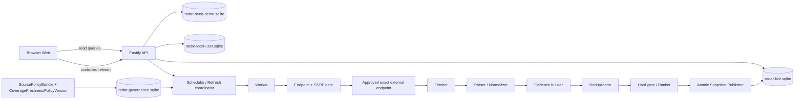
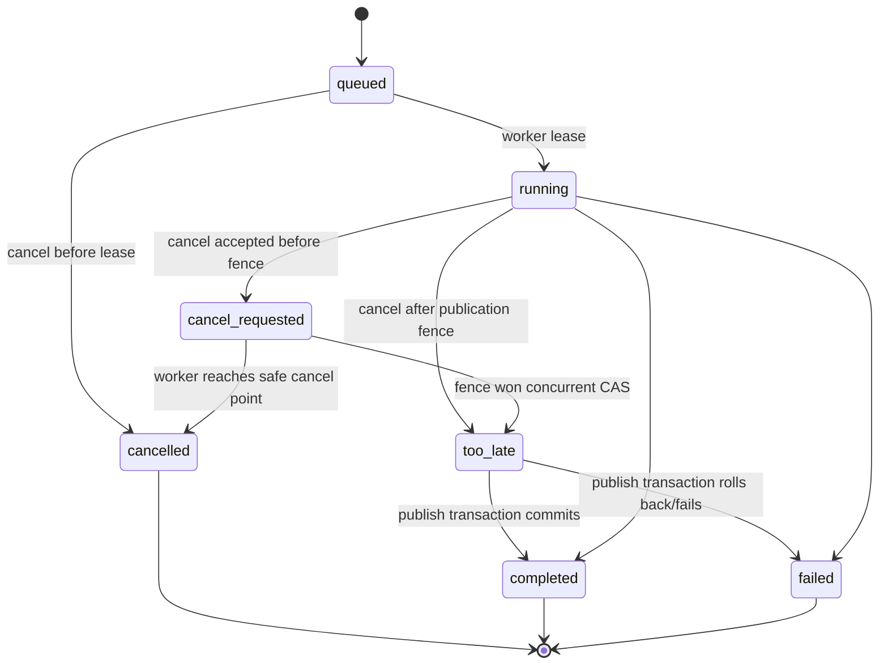

# AI Model Radar 发布完整性架构

> - 版本：v1.2
> - 状态：独立合并终审定向修订候选，待架构复审（`architecture-review`）
> - 工作项：`MR-ARC-101`
> - 变更：`arch-20260817-radar-release-completeness-001`
> - 入场授权：`approval-20260817-radar-release-architecture-entry`
> - 安全写入基线：`7e786f24ae16cbb13aa8d7e9028d52f2ceb12d71`
> - 修订基线：`e966a1c84b6411852cf5cc23fab89d4cc51ffcd1`
> - 前候选：v1.1，SHA-256 `edf2ee2528e2f85066f23c21f9871d361b5c472f5b5a554961edd840cb60cf24`
> - 独立合并终审：`changes-requested`，`P0=0 / P1=8 / P2=2`
> - 产物：`artifact-radar-release-completeness-architecture-001`
> - 责任角色：固定 `05 架构师`（`role-architect`）
> - 生产发布：冻结
> - 停止门：`architecture-review`

## 1. 决策摘要

本架构把 AI Model Radar 从“静态/演示可浏览前端”推进为**未来可实现、可在本地完成真实前后端联调的模块化单体契约**，但本交付本身不实现后端、不连接来源、不采集数据、不启用运行时、不启动服务且不部署。

核心决策如下：

1. 采用 `Node.js + TypeScript + Fastify` 的模块化单体，API 与 Worker 使用同一领域包、不同进程入口；本地持久化选择 `SQLite`，以最小依赖支持真实重启持久化、迁移、幂等和备份恢复。
2. 当前旧架构中的 PostgreSQL、Redis/BullMQ、对象存储只保留为**未来生产候选**，本轮均为 `UNKNOWN/TBD`，不得作为本地可用性的前置依赖。是否迁移必须由真实容量、并发、SLO 和部署事实触发新审核。
3. 来源政策装载、精确 endpoint 网络门、采集、解析、证据、去重、排序、发布与查询分模块；单一来源失败不能清空或污染最近成功快照。
4. `Observation` 与 `Evidence` 追加且不可变；`Event` 通过追加修订演进；`PublishedSnapshot` 发布后不可变。发布使用数据库事务和原子当前指针，不允许半成品成为当前快照。
5. `live`、`seed_demo` 与本地偏好采用物理独立 SQLite 数据库和独立备份清单；查询、指标、刷新历史与快照身份不得跨库拼接。当前真实状态是 `not_ready`：`N=22`，`runtime_enabled=false`，live connector `0`，live snapshot `0`。
6. 唯一网络请求前门显式区分 `canary` 与 `runtime`。canary 只允许步骤 1–3 已成立且具有精确、限时、同修订授权的请求，期间 `runtime_enabled` 恒为 `false`；runtime 请求才要求七步证据与环境登记完整闭环。
7. 来源运行启用只能遵守共享 ADR 的唯一七步序列。运行证据使用独立追加式权威对象，并以同一 `(source_id, policy_revision, connector_revision, environment_id)` 关联；不得写回 `SourcePolicyVersion`。
8. 浏览器的查询只读，不得隐式触发外部采集；刷新只允许唯一可写人类主体 `local-owner` 显式触发，具有幂等、限频、审计、取消状态机与真实进度。
9. 覆盖与新鲜度由不可变 `CoverageFreshnessPolicyVersion` 冻结。发布必须先完成逐源水位与继承/排除判定，再求共同 `as_of`，裁掉晚于该时点的事实后重新聚合、去重、排序和截断；禁止先排名再回退时间。
10. 生产域名、API 端口、云厂商、数据库、队列、对象存储、预算、凭证、SLO、RPO/RTO 均为 `UNKNOWN/TBD`。本地前端已记录入口为 `http://127.0.0.1:4174/today`；本地 API 监听端口仍为 `UNKNOWN`。

### 1.1 v1.2 定向闭环

| 终审项 | v1.2 冻结结果 |
|---|---|
| P1 覆盖策略缺失 | 新增不可变 `CoverageFreshnessPolicyVersion`，内容寻址并进入水位、manifest 与发布硬门 |
| P1 发布时间回退污染 | 唯一算法改为“水位判定 → 共同 as_of → 裁剪事实 → 重聚合/去重/排序/截断 → 发布” |
| P1 未尝试来源语义 | 冻结 not-due/skipped/circuit-open/out-of-requested-scope 水位、分母、继承和子 scope 发布规则 |
| P1 刷新身份混淆 | 冻结 `RefreshRequest → RefreshRun → 1:N FetchRun`，取消只接受 `refresh_run_id` |
| P1 信封维度混淆 | 内容、本地用户和操作三类信封分离并逐 API 映射 |
| P1 命令重复 | 后端命令只在一张合同定义；`test:backup-restore` 唯一，npm test 聚合与操作命令语义明确 |
| P1 治理物理边界 | 新增 `radar-governance.sqlite` 与表归属；canary 证据可在 runtime=false 时保存，登记+审计同事务 |
| P1 删除代际不完整 | local_user 元数据和备份 manifest 双代际，恢复先重放 tombstone、验零并更新水位后才 readiness |
| P2 旧快照真相优先级 | 全源失败时按旧快照 freshness 决定 degraded/stale；硬策略失败不改指针且错误优先展示 |
| P2 主体权限模糊 | 当前唯一可写人类主体为 `local-owner`；内部服务主体不是更高管理员，身份实现仍为 UNKNOWN |

v1.1 已通过的 canary/runtime 双模式、六类逻辑运行证据、七态取消行为、npm、`impact_scope.project_id` 与冻结来源事实全部保留。

本架构是对 `docs/04-architecture.md` 的发布完整性增量。两者冲突时，本文件在真实服务、本地持久化、运行真相态、来源七步门和发布完整性范围内优先；旧文档的历史视觉基线与静态演示约束仍保留。

## 2. 权威输入与完整性

以下内容 SHA-256 已在安全写入基线重新计算，均与路由要求一致；审批旁车另作完整性记录，不替代 ADR 正文。

| # | 权威输入 | SHA-256 |
|---|---|---|
| 1 | `architecture/03-four-project-shared-boundary-adr.md` | `e3073a01ceda280b8dda4d77b58de7e9755d3f77d21f6ebb5497c8882508840a` |
| 1a | `architecture/03-four-project-shared-boundary-adr.approval.yaml` | `ee43ecd4106d858a11284ced1256bff99f8bfb2b50fd04232de672d504b0bfdc` |
| 2 | `docs/04-four-project-release-completeness-replanning-plan.md` | `96decb8f1835cc85bd530c21b2969d4d077f31e6086425ea911f9d5b187bbe26` |
| 3 | `docs/05-four-project-real-usable-product-delta.md` | `e613e79f44100840542fb6531e155cf0edd0079a6fc213af328fba075750bc01` |
| 4 | `architecture/02-domain-cdn-service-boundary.md` | `d8d7a594b18195e85795b01c7c9c6829222571ba65ddb9629256fab2cf29114b` |
| 5 | `projects/ai-model-radar/docs/02-prd.md` | `3ce842ef8e2b9661f2114b3b4a2b3361eeb8fac0f98a5071cd8e27c38a81a020` |
| 6 | `projects/ai-model-radar/docs/02-prd-release-completeness-appendix.md` | `a27cfecc196c29749387302a692d93af0b5b534af7da6805b6b297e064133f1d` |
| 7 | `projects/ai-model-radar/ui/05-release-completeness-ui-design.md` | `a731232994db118117043aa50503273c91e5c438bc20f948d9e5137e43ba9324` |
| 8 | `projects/ai-model-radar/docs/00-source-allowlist.md` | `9aa9bb926cc52aae28d11bbf676507ca313add83238cd81be6300a4d9f2f0498` |
| 9 | `projects/ai-model-radar/docs/00-source-registry.csv` | `c303e79e1fa9f7a1664ac718a1678bbcb6610b5309a5d5e4006e6d4b1d438f91` |
| 10 | `projects/ai-model-radar/docs/00-source-runtime-readiness.md` | `c59c0647204caa63b4ac9acc9f229dfab22c8b239b4b844a957c1e065681649f` |

输入事实冻结：

- 已批准的 `P0/allow` 原子 endpoint 数为 `N=22`。
- `AIR-END-030` 仍为 `proposed/pending-review/not-in-registry/not-counted`；本架构不批准它，也不把 N 改成 23。
- 当前 `runtime_enabled=false`、live connector `0`、live snapshot `0`、调度 `0`、canary `0`、对应 `.REV` `0`、对应 `.QA` `0`。
- HTTP 200、readiness 研究、UI 目标稿、静态样例或 `seed_demo` 均不是 live 证据。

## 3. 范围、目标与不做项

### 3.1 本架构冻结

- Web 优先、本地可联调的后端技术栈与模块依赖方向。
- 来源策略装载、精确 endpoint、SSRF、条件请求、速率、超时、重试、canary 与失败开关边界。
- Observation/Event/Evidence/PublishedSnapshot、幂等、迁移、备份恢复与 live/seed 隔离。
- Today、Events、Trends、Open Source、Source Quality、Detail、Refresh 以及本地偏好/反馈的 API 契约。
- 调度、部分失败、旧快照保留、真相态、错误信封、健康/就绪、可观测性和测试矩阵。
- 本地与未来环境的五类地址职责、成本 UNKNOWN 和生产部署阻断条件。

### 3.2 明确不做

- 不修改 `docs/00-source-registry.csv` 或任何来源政策事实。
- 不实现连接器、后端、前端或测试代码，不创建迁移、seed、数据库或运行配置。
- 不执行 canary、联网采集、来源重试、影子运行、质量测量或服务启停。
- 不登记 `runtime_enabled=true`，不生成或冒充 live snapshot。
- 不选择生产云厂商、正式域名、端口、数据库、队列、对象存储、WAF、凭证或预算。
- 不进入 `CR-ARC-101`、`MR-PM-101`、开发、审查、QA 或部署。
- 不自动引入账号/跨设备同步、第三方生成模型、向量库、消息推送或完整全文存储。

## 4. 架构不变量

| ID | 不变量 | 违反时结果 |
|---|---|---|
| `MR-INV-01` | policy 四态与 `runtime_enabled` 是两条独立轴 | fail closed |
| `MR-INV-02` | 七步启用序列第七步之前 `runtime_enabled=false` | `SOURCE_RUNTIME_SEQUENCE_VIOLATION` |
| `MR-INV-03` | 只允许批准 bundle 中的精确 endpoint；重定向逐跳重验 | 请求阻断、来源失败 |
| `MR-INV-04` | 外部响应、HTML、Feed、README 与提示词均是不可信数据 | 隔离，不执行内容指令 |
| `MR-INV-05` | Observation/Evidence/已发布 Snapshot 不可原地修改 | 阻断写入，生成新修订 |
| `MR-INV-06` | live 与 seed_demo 的存储、查询、任务、指标、快照 ID 分区 | P0 阻断 |
| `MR-INV-07` | HTTP 200、进程健康、CDN 新鲜或 demo 不等于 `live` | 返回 `not_ready/degraded` |
| `MR-INV-08` | 全部刷新失败不发布新当前快照；最近成功快照保持可读 | 原子发布失败并保旧 |
| `MR-INV-09` | 公开 GET 不触发采集；刷新与发布是受控写能力 | `forbidden` |
| `MR-INV-10` | 未观察到的量为 `UNKNOWN/null`，不能用 `0` 代替 | 契约校验失败 |
| `MR-INV-11` | 默认只保留最小结构事实和自写短摘要，不保存外部全文/媒体 | 来源暂停与合规复核 |
| `MR-INV-12` | 正式日榜为 0–20 条，不以低质候选凑数 | 发布阻断 |
| `MR-INV-13` | 所有时间保留原值/时区与规范值，抓取时间不冒充发布时间 | 记录隔离 |
| `MR-INV-14` | 用户访问、静态 CDN、API、origin、internal 五类地址不混用 | 部署阻断 |
| `MR-INV-15` | canary/runtime 必须显式选一；canary 时 runtime 恒为 false，且结果不得进入 live 数据面 | P0 阻断 |
| `MR-INV-16` | 执行授权、实现、canary、REV、QA、环境登记独立追加，tuple 同修订同环境 | 启用事务拒绝 |
| `MR-INV-17` | live、seed_demo、本地偏好物理分库，备份与恢复不得跨 mode | `DATA_MODE_VIOLATION` |
| `MR-INV-18` | 每份 live 快照包含不可变逐源水位，整体 as_of 不晚于任何被计入来源的 included_until | 发布阻断 |
| `MR-INV-19` | live 发布必须绑定获批且内容寻址的 CoverageFreshnessPolicyVersion；UNKNOWN 不得默认放行 | `COVERAGE_POLICY_NOT_READY` |
| `MR-INV-20` | 共同 as_of 在证据聚合、去重、排序和 0–20 截断之前确定；晚于 as_of 的事实不可进入候选 | 发布阻断 |
| `MR-INV-21` | 取消只作用于聚合 refresh_run_id；fetch_run_id 永不作为取消资源 ID | `REFRESH_RUN_ID_REQUIRED` |
| `MR-INV-22` | 内容、local_user 与 control operation 使用不同信封，不得用 live 状态替代存储或操作真相 | 契约校验失败 |
| `MR-INV-23` | 治理权威与 live/seed/user 业务事实物理分库；环境登记及其 AuditRecord 在治理库同事务 | readiness/runtime 阻断 |
| `MR-INV-24` | local_user 恢复必须追平 deletion ledger 代际并验零，才可替换数据库和通过 readiness | `DELETION_GENERATION_VIOLATION` |

## 5. 技术选型与演进边界

### 5.1 当前批准的架构选择

| 层 | 选择 | 理由与边界 |
|---|---|---|
| Web 前端 | 现有 React 19 + TypeScript + Vite + React Router | 保留现有前端；新增真实 API adapter，不以静态回退冒充 live |
| 运行时 | Node.js `>=22.12.0` + npm | npm 已冻结为包管理器；与当前前端 `engines` 和 lockfile 对齐，后端精确 patch/lockfile 由实现提交冻结 |
| 语言 | TypeScript strict | API、Worker、领域和契约共享类型；禁止隐式 `any` |
| HTTP | Fastify + JSON Schema/OpenAPI | 结构校验、错误映射和低开销；OpenAPI 是生成物而非手工真相源 |
| 持久化 | SQLite + WAL + foreign keys | 满足本地单机真实持久化、事务、迁移与备份；数据库文件不进 Git |
| 数据访问 | 显式 Repository 端口；具体库 `UNKNOWN` | 避免领域依赖 ORM；实现拆解时再选择 SQLite driver/query layer |
| 调度 | 数据库租约 + Worker 轮询/本地定时入口 | 本地无需 Redis；调度关闭时必须如实 `not_ready` |
| 校验 | JSON Schema + 领域不变量 | 外部输入、数据库读取和 API 输出均校验 |
| 日志 | 结构化 JSON + request/refresh_run/fetch_run/source IDs | 不记录正文、Token、Cookie、用户偏好内容或高基数完整 URL |
| 指标/链路 | OpenTelemetry 语义，exporter `UNKNOWN` | 本地可无 exporter；生产后端与费用另审 |
| 测试 | Vitest 或 Node test runner（二选一待实现冻结）、Fastify inject、真实临时 SQLite | 不用 Mock 替代持久化/迁移/恢复关键证据 |

SQLite 选择只冻结**本地完整纵切**。当且仅当并发写、数据规模、可用性、跨进程租约或生产拓扑的实测超过 SQLite 边界时，才评审 PostgreSQL。Redis/BullMQ、对象存储、向量库和生成式模型默认不引入。

### 5.2 当前可运行性真相

`backend/` 当前只有 `.gitkeep`，不存在 `package.json`、源码、迁移或测试。因此：

- 本文定义的命令是后续实现必须满足的接口，不是已存在命令。
- 当前后端 `dev/build/test/lint` 结论均为 `NOT_IMPLEMENTED`，不能声称通过。
- API 端口、SQLite 路径、Node 精确 patch 和后端依赖锁定均为 `UNKNOWN`；包管理器已确定为 npm，不属于未知项。

后端命令的**唯一权威合同**在第 17.1 节；本节不再维护第二份命令清单。该合同同时区分开发/迁移/canary 等操作命令与验证命令，冻结 npm test 聚合关系，并明确 `test:restore` 不是有效别名。

## 6. 总体架构与无环依赖



依赖只能指向领域端口：`api/worker adapters → application use cases → domain → contract primitives`。领域层不得依赖 Fastify、SQLite、网络客户端或前端。查询 API 不依赖 Worker 正常才可读取最近成功快照；Worker 不依赖前端或 Control Center。

### 6.1 模块责任

| 模块 | 责任 | 禁止责任 |
|---|---|---|
| `policy-loader` | 校验并装载不可变 SourcePolicyBundle | 修改 registry、自动批准来源 |
| `coverage-policy` | 装载/校验 CoverageFreshnessPolicyVersion，计算 required/count/ratio/stale 与共同 as_of | 用 attempted 数缩分母、代码默认放行 UNKNOWN |
| `runtime-gate` | 核对七步证据和目标环境登记 | 根据 HTTP 200 自动启用 |
| `scheduler` | 生成 RefreshRequest→RefreshRun→FetchRun、有租约的幂等刷新任务、识别遗漏窗口 | 公开查询触发采集、混用聚合/单源 ID |
| `endpoint-gate` | 精确 URL、DNS/IP、端口、重定向逐跳 SSRF 校验 | 接受用户任意 URL |
| `fetcher` | 条件 GET、超时、限频、响应上限、最小原始缓存 | 绕登录、验证码、付费墙或 403 |
| `parser` | 按 endpoint revision 解析允许字段 | 执行外部脚本/提示词 |
| `normalizer` | 时间、URL、组织、对象、版本、动作规范化 | 用当前时间填未知发布时间 |
| `evidence` | Claim/Evidence/证据根与支持/反证关系 | 转载数冒充独立证据 |
| `deduplication` | URL、内容、实体、跨语言候选四层去重 | 模糊相似直接覆盖不同版本 |
| `ranking` | 硬门、版本化分项、惩罚、0–20 与厂商约束 | 偏好绕过硬门 |
| `publisher` | 水位判定后求共同 as_of、裁剪并重算候选，再事务生成不可变快照和切换 current pointer | 先排名后回退 as_of、非法 subset 更新指针、失败清空上一版 |
| `query` | Today/Events/Trends/Open Source/Quality/Detail | 修改来源或事件 |
| `preferences` | 本地单用户偏好、收藏、已读、不相关、纠错与撤销 | 声称账号/跨设备同步 |
| `audit-observability` | 安全日志、指标、审计、告警事实 | 保存正文、秘密或个人资料 |

### 6.2 建议目录契约

```text
backend/
├── package.json
├── src/
│   ├── apps/api/
│   ├── apps/worker/
│   ├── modules/
│   │   ├── policy/
│   │   ├── coverage/
│   │   ├── refresh/
│   │   ├── acquisition/
│   │   ├── normalization/
│   │   ├── evidence/
│   │   ├── deduplication/
│   │   ├── ranking/
│   │   ├── publishing/
│   │   ├── query/
│   │   ├── preferences/
│   │   └── observability/
│   ├── contracts/
│   ├── domain/
│   └── infrastructure/sqlite/{governance,live,seed,user,ledger}/
├── migrations/
├── tests/{unit,contract,integration,fixtures}/
└── var/                    # gitignored local DB/backups/runtime files
```

目录仅是后续实现契约；本轮不创建这些业务文件。

## 7. 来源政策装载与唯一七步启用序列

### 7.1 SourcePolicyBundle

运行时不得把可变 CSV 工作树直接当授权开关。后续获批实现必须由批准 registry revision 生成不可变、内容寻址的 `SourcePolicyBundle`：

```text
SourcePolicyBundle {
  schema_version
  project_id = "ai-model-radar"
  registry_sha256
  approval_id
  generated_from_commit
  generated_at
  endpoints[]
  bundle_sha256
}

EndpointPolicy {
  source_id
  policy_state: allow | conditional | manual_only | disabled
  scheme
  exact_host
  effective_port
  exact_path
  allowed_query_keys
  access_method
  auth_mode
  redirect_policy
  robots_checked_at
  terms_checked_at
  rights_summary
  allowed_fields
  prohibited_use
  retention_ttl
  polling_min_interval
  rate_limit_policy
  timeout_policy
  response_size_limit
  content_types
  disable_conditions
  policy_revision
}
```

Bundle 生成本身不构成执行授权；`approval_id`、registry SHA、commit 和 bundle SHA 必须一致。未知字段、重复 `source_id`、组合束、模板未实例化、空 endpoint、非法 scheme 或 policy 非四态均拒绝装载。

当前 bundle 若未来按现 registry 形成，也只能包含已批准事实；`AIR-END-030` 不得进入当前 `N=22` bundle。

### 7.2 CoverageFreshnessPolicyVersion

覆盖与新鲜度不是代码常量，也不能由“本轮成功多少源”临时推断。每个可发布环境必须引用一个已批准、不可变、内容寻址的 `CoverageFreshnessPolicyVersion`：

```text
CoverageFreshnessPolicyVersion {
  coverage_policy_id
  project_id = "ai-model-radar"
  revision
  environment_id
  eligible_source_ids[]
  required_source_ids[]
  minimum_included_count
  minimum_coverage_ratio
  stale_after_by_source: { source_id -> duration }
  subset_publish_rule: never | full-policy-recomposition
  approved_by
  approval_id
  approved_at
  effective_from
  supersedes_revision: string | null
  canonical_payload_sha256
}
```

约束：

- `eligible_source_ids` 与 `required_source_ids` 都是排序、去重后的精确 source_id 集合，required 必须是 eligible 子集；集合、阈值、逐源 stale 上限、环境或 subset 规则任一变化都生成新 revision/hash，禁止原地覆盖。
- `minimum_included_count` 与 `minimum_coverage_ratio` 同时成立才可发布；所有 required source 必须可计入。比率分母固定为该版本对目标环境的 eligible source 数，不随本轮 attempted 数或手动 scope 缩小。
- RefreshRun、每条 `RefreshSourceWatermark`、Snapshot manifest 与每条 `SnapshotSourceWatermark` 都必须保存 coverage_policy_id、revision 与 payload SHA；任一不一致或 hash 不可复算时发布失败。
- policy 的 `UNKNOWN`、未批准、环境不匹配、引用不存在、阈值自相矛盾或 required stale 上限缺失全部 fail closed。它不阻断 fixture 测试或步骤 1–3 的限时 canary，但阻断步骤 7 的 runtime 登记、任何 live RefreshRun 发布和 live readiness。
- 当前不存在已批准的该对象，状态为 `UNKNOWN/TBD`；不得据此制造 live snapshot。

### 7.3 唯一启用序列

每个精确 endpoint、实现 revision 和目标环境只能按以下顺序推进；证据关联键统一为 `runtime_tuple = (source_id, policy_revision, connector_revision, environment_id)`：

1. **policy approved**：精确 endpoint 已在批准 registry；`conditional` 条件全有证据，`manual_only/disabled` 不进入自动序列。
2. **separate execution authorization**：形成追加式 `ExecutionAuthorization`，针对精确 source_id、endpoint hash、用途、环境、policy revision、时间窗和请求/字节预算授权；研究批准不能代替。
3. **implementation**：形成追加式 `ConnectorRevision`，以不可变 artifact SHA 绑定 source_id、policy revision、connector revision 与安全控制；仍为 `runtime_enabled=false`。
4. **canary**：仅在步骤 1–3 成立且 `ExecutionAuthorization.mode=canary`、未过期、tuple 同修订时运行；结果形成追加式 `CanaryEvidence`。canary 不是 live 调度，`runtime_enabled` 必须仍为 `false`。
5. **same revision `.REV`**：形成 `RevReviewEvidence`，绑定相同 tuple 与 CanaryEvidence；独立审查必须 `P0=0/P1=0`。
6. **same revision `.QA`**：形成 `QaEvidence`，绑定相同 tuple、CanaryEvidence 与 RevReviewEvidence，结论必须 `PASS`。
7. **approved environment registration**：前六步同修订完整、目标环境已有获批 `CoverageFreshnessPolicyVersion` 后，才可事务内追加 `EnvironmentRuntimeRegistration(enabled=true)`；该对象是运行启用的唯一权威来源。

步骤 2 的 ExecutionAuthorization 必须预留目标 `connector_revision` 标识；步骤 3 只能以同一标识和实际 artifact SHA 完成 ConnectorRevision。实现产生不同 revision 时原授权失效，必须重新取得授权，禁止授权“任意未来版本”。

任何缺步、乱序、revision/environment 不一致、P0/P1 非零、QA 非 PASS、授权过期、条件变化或证据失效，都必须返回 owner 修复并保持/恢复 `false`。步骤 7 不授权其他 endpoint、其他环境或生产发布。步骤 4 的 canary 成功只产生审查证据，不得隐式创建 EnvironmentRuntimeRegistration，也不得把同一次 FetchRun 改标为 runtime。

### 7.4 原子环境登记

`runtime_enabled` 不是 `SourcePolicyVersion` 字段，也不能由配置文件默认值推导。环境登记事务必须：

1. 以完整 `runtime_tuple` 锁定 SourcePolicyVersion、ExecutionAuthorization、ConnectorRevision、CanaryEvidence、RevReviewEvidence 与 QaEvidence，并锁定目标环境的 CoverageFreshnessPolicyVersion revision/hash。
2. 校验所有外键对象未撤销、未过期、SHA 完整，REV 为 `P0=0/P1=0`、QA 为 `PASS`，环境与 tuple 完全一致。
3. 校验该 `(source_id, environment_id)` 没有另一条 active registration；以唯一约束和 CAS revision 防止并发双启用。
4. 在 `radar-governance.sqlite` 同一事务追加 EnvironmentRuntimeRegistration 与 AuditRecord；只有事务提交后 runtime 请求前门才可读到 `enabled=true`。
5. 任一条件变化时追加 `enabled=false/revoked` 的后继登记；不得删除历史，也不得回写 policy 对象。

### 7.5 当前门状态

| 项 | 当前事实 | 架构行为 |
|---|---|---|
| 批准 P0/allow endpoint | `N=22` | 只作为政策基线，不代表运行 |
| `AIR-END-030` | pending、不在 registry、不计数 | 拒绝进入 bundle/任务 |
| execution authorization | 0 | 所有连接器 fail closed |
| implementation/canary/REV/QA | 0/0/0/0 | 不得登记 true |
| CoverageFreshnessPolicyVersion | `UNKNOWN/0 approved` | 阻断步骤 7、live publish 与 live readiness；不阻断获批 canary 证据 |
| runtime/live connector/live snapshot | false/0/0 | Readiness 失败，UI 为 `not_ready` |

## 8. 精确 endpoint、SSRF 与取得协议

### 8.1 唯一网络请求前门：canary/runtime 双模式

连接器请求必须携带不可变 `NetworkRequestPermit`，其中显式包含 `request_mode=canary | runtime`、完整 `runtime_tuple`、endpoint hash、有效期和预算，并使用互斥权威引用：canary 填 `canary_authorization_id`、runtime 填 `runtime_registration_id`；不得同时填写或省略。不得从调用路径、环境变量或 `runtime_enabled` 猜测模式，也不得接受前端或外部记录提供的任意 URL。

**canary 模式前置：**

1. 步骤 1 policy approved 已成立，且 endpoint 精确存在于对应批准 bundle；`manual_only/disabled` 不得 canary，`conditional` 仅在条件证据已纳入同一 policy revision 时允许。
2. 步骤 2 的 `ExecutionAuthorization(mode=canary)` 必须绑定相同 source_id、policy revision、connector revision、environment_id、endpoint hash，具有明确 `not_before/expires_at`、最大请求数、最大字节、允许方法与可停止责任人。
3. 步骤 3 的 ConnectorRevision 必须存在且 artifact SHA 匹配；permit 签发时和每次请求前均强制断言 `runtime_enabled=false`、没有 active EnvironmentRuntimeRegistration。
4. canary 不进入 scheduler，不写 live Observation/Event/Snapshot/CurrentPointer，不计 live 成功率；只追加最小 CanaryEvidence。canary permit 到期、预算耗尽、授权撤销或 tuple 变化即拒绝。

**runtime 模式前置：**

1. 相同 runtime_tuple 的步骤 1–7 必须全部闭环，`runtime_registration_id` 必须引用 active `EnvironmentRuntimeRegistration(enabled=true)`；前置 policy、connector、canary、REV、QA 证据均未撤销或失效。步骤 2 的限时 canary ExecutionAuthorization 只授权 canary，不得被 runtime permit 复用为网络权威。
2. FetchRun 从创建时即固定 `request_mode=runtime`；canary FetchRun/evidence 不可重标、复制或提升为 runtime Observation。

**两种模式共用且不可绕过的网络安全门：**

1. 仅允许 HTTPS；HTTP 例外必须另审，当前无例外。
2. 主机、有效端口、路径和允许 query key 精确匹配。URL 用户名、密码、片段、未批准端口和 Unicode 混淆主机全部拒绝。
3. DNS 解析后拒绝环回、私网、链路本地、组播、保留网段、云元数据、内部 DNS 与 Unix socket；IPv4/IPv6 同验。
4. 连接时将目标约束到已验证地址；DNS 变化、CNAME 链或解析结果变化时重新执行完整门，防止 DNS rebinding。
5. 每次 3xx 都按原模式重新校验完整 permit、exact endpoint 与网络门；跨未批准 host/path、降级到 HTTP、循环或超过最大跳数即停止。
6. 校验 MIME、Content-Length 和流式实际字节上限；压缩前/解压后双上限，防压缩炸弹。

canary 结果无论成功与否都不能隐式开启 runtime；唯一开启动作仍是步骤 7 的原子 EnvironmentRuntimeRegistration。任何前门失败均不得发出网络字节。

### 8.2 条件请求、超时、限流与重试

以下控制对 canary 与 runtime 两种模式完全共用；canary 的限时授权与请求/字节预算是在同一安全门之上的更严格上限，不能放宽 endpoint policy。

- 只对批准的幂等 GET 使用 `ETag/If-None-Match` 或 `Last-Modified/If-Modified-Since`；无可靠验证器时使用允许字段规范化哈希。
- `304` 只表示端点相对验证器未变，不表示事实已核验、快照已发布或来源 live。
- 连接、首字节、总请求和解析各有独立上限；具体值由 endpoint policy 冻结，未定为 `UNKNOWN`，不能用无限值。
- 限流以来源响应头和批准策略较严格者为准；按 host/source 建 token bucket 和并发上限。
- 仅对网络瞬断、408、429 和允许的 5xx 做有限指数退避 + 抖动；遵守 `Retry-After`。401、403、404 路径变化、TLS 身份失败、登录挑战、robots/条款变化不自动重试。
- 单个 FetchRun 设最大尝试、最大累计时间和字节预算；达到上限进入可审计失败，不形成重试风暴。
- `conditional/manual_only/disabled`、kill switch、预算上限和来源熔断优先于调度。

### 8.3 Fetch/Parse/Evidence 边界

| 阶段 | 输入 | 成功输出 | 失败结果 |
|---|---|---|---|
| Fetch | endpoint policy + FetchRun | 响应元数据、最小临时 bytes、内容哈希 | 来源级失败，保留旧快照 |
| Parse | bytes + parser revision | 结构化允许字段 | 原观察隔离，不猜字段 |
| Normalize | parsed item | 标准 URL/时间/实体/动作 | 隔离并记录安全原因 |
| Evidence | normalized item | Observation + Claim + Evidence | 无主源映射不得正式发布 |

原始响应默认关闭长期存储；确需排障时只在隔离区短暂保留、按来源 TTL 自动删除且上限不超过批准政策。不得保存全文、图片、视频、完整字幕、评论、权重或个人资料。

## 9. 数据、证据与持久化模型

### 9.1 权威对象

| 对象 | 关键字段 | 不变量 |
|---|---|---|
| `SourcePolicyVersion` | source_id, bundle_sha, policy_revision, four-state policy, exact endpoint/rights/retention | 只承载政策；版本不可改写，禁止写入执行或运行证据 |
| `CoverageFreshnessPolicyVersion` | coverage_policy_id, revision, environment_id, eligible/required source sets, minimum count/ratio, per-source stale limits, approval, payload hash | 不可变且内容寻址；UNKNOWN 阻断 runtime 登记与 live 发布 |
| `ExecutionAuthorization` | authorization_id, runtime_tuple, mode, endpoint_hash, not_before/expires_at, request/byte budget, approved_by | 独立追加；精确、限时、同修订，撤销追加新记录 |
| `ConnectorRevision` | runtime_tuple, artifact_path, artifact_sha256, security_controls_sha256, created_at | artifact SHA 不可变；tuple 唯一关联 policy/environment |
| `CanaryEvidence` | evidence_id, runtime_tuple, authorization_id, refresh_run_id, fetch_run_ids, limits, started/finished, result, evidence_sha256 | 只来自 canary 模式；不得进入 live 数据面或开启 runtime |
| `RevReviewEvidence` | review_id, runtime_tuple, canary_evidence_id, reviewer, P0/P1/P2, decision, evidence_sha256 | 启用候选必须 P0=0/P1=0 且同 tuple |
| `QaEvidence` | qa_id, runtime_tuple, canary_evidence_id, rev_review_id, environment_fingerprint, result, evidence_sha256 | 启用候选必须 PASS 且同环境同修订 |
| `EnvironmentRuntimeRegistration` | registration_id, runtime_tuple, execution/canary/rev/qa refs, enabled, revision, registered_at/revoked_at | 唯一 runtime 权威；事务追加，禁止回写 policy |
| `RefreshRequest` | request_id, idempotency_key, actor_type/id, requested_scope, request_mode, requested_at | 每个逻辑请求唯一；重复 key 返回同一 request_id/refresh_run_id |
| `RefreshRun` | refresh_run_id, request_id, scope_mode, target_as_of, policy/bundle hashes, status, status_revision, cancel flag, publication_fence_at | 聚合任务唯一身份；持有 1:N FetchRun 和唯一发布决定 |
| `CancelCommand` | cancel_id, refresh_run_id, idempotency_key, actor, requested_at, result, observed_status_revision | 只接受聚合 ID；同一 key 永远返回同一取消结果 |
| `FetchRun` | fetch_run_id, refresh_run_id, source_id, request_mode, runtime_tuple, attempt, validators, times, outcome | 必须 FK 到聚合 RefreshRun；不可作为取消 API 资源 ID；同一租约只一个 owner |
| `Observation` | id, source_id, canonical_url, source times, obtained/fetched times, allowed fields, fingerprint | 追加且不可变；外部正文不入主表 |
| `Evidence` | id, observation_id, root_id, role, relation, independent_party, hash | 不可变；转载共用 evidence_root |
| `EventIdentity` | event_id, stable event key, created_at | 身份不因标题改写 |
| `EventRevision` | event_id, revision, normalized facts, claims, status, rule version, previous revision | 追加修订；更正/撤回不删除历史 |
| `DuplicateDecision` | cluster, members, method, revision, actor/reason | 合并和拆分均可回放 |
| `RankingResult` | event revision, rule version, components, penalties, total, hard gate | 可复算；硬门失败不发布 |
| `PublishedSnapshot` | snapshot_id, mode, schema/rule/source-policy/coverage-policy revisions+hashes, as_of, published_at, truth metadata, manifest hash | 发布后不可变；绑定最终共同 as_of 与 coverage policy |
| `SnapshotItem` | snapshot_id, event_id, event_revision, rank, section | 固定引用，不跟随事件后续修改 |
| `RefreshSourceWatermark` | refresh_run_id, source_id, attempted, attempt_disposition, succeeded, included_until, last_success, error, source/connector/coverage-policy revisions+hashes, inclusion_mode | 每个 RefreshRun 的每个 coverage 分母来源一行；evidence-only RefreshRun 也必须保留 |
| `SnapshotSourceWatermark` | snapshot_id, refresh_run_id, source_id, refresh_watermark_sha256, immutable core fields | 发布时逐行复制已冻结 RefreshSourceWatermark；进入 manifest hash |
| `CurrentSnapshotPointer` | mode, snapshot_id, revision | 事务内 CAS/原子切换 |
| `Preference/Interaction` | local subject, revision, event, type, value, times | 不修改客观证据/重要性；可撤销 |
| `UserStoreMetadata` | storage_id, schema_version, deletion_generation, applied_tombstone_generation, ledger_head_sha256 | local_user 单例元数据；readiness 前必须追平 ledger |
| `DeletionTombstone` | tombstone_id, subject_scope, delete_through_revision, deletion_generation, deleted_at, retain_until | 防旧备份恢复复活；独立追加账本优先于备份 |
| `AuditRecord` | audit_id, actor, action, target, before/after refs, request_id, transaction_id, time | 治理控制面审计；不含秘密或外部正文 |

### 9.2 运行证据约束

六类运行证据与 policy 严格分表/分对象；所有对象都追加式、内容寻址且带撤销后继，不允许原地改结论。

| 约束 | 冻结规则 |
|---|---|
| tuple | `runtime_tuple=(source_id, policy_revision, connector_revision, environment_id)` 四项均非空 |
| policy FK | tuple 的 `(source_id, policy_revision)` 必须引用唯一 SourcePolicyVersion |
| authorization unique | `authorization_id` 唯一；同 tuple + mode + authorization revision 唯一，时间窗与预算必填 |
| connector unique | `(source_id, policy_revision, connector_revision, environment_id)` 唯一，artifact SHA 与安全控制 SHA 必填 |
| canary FK | CanaryEvidence 必须引用同 tuple 的 active canary ExecutionAuthorization 与 ConnectorRevision |
| REV FK | RevReviewEvidence 必须引用同 tuple 的 CanaryEvidence；用于启用的结论只能是 P0=0/P1=0 |
| QA FK | QaEvidence 必须引用同 tuple 的 CanaryEvidence 与 RevReviewEvidence，environment fingerprint 相同且结果 PASS |
| active registration | `(source_id, environment_id)` 最多一条 active `enabled=true`；registration 逐项 FK 到同 tuple 的五类前置证据 |
| atomicity | 环境登记、active 唯一约束、CAS revision 与 AuditRecord 同事务提交，任一失败整笔回滚 |

撤销 authorization、policy、connector、canary、REV 或 QA 时，必须追加对应 revoked/superseded 事实和 `EnvironmentRuntimeRegistration(enabled=false)` 后继；runtime 前门每次请求都读当前 active 链，不能只在进程启动时缓存一次。

### 9.3 治理物理权威库与事务边界

新增独立 `radar-governance.sqlite` 作为唯一治理权威库；它不是 live 内容库，也不参与排行榜、趋势或来源成功率计算。物理表归属冻结如下：

| 治理表 | 权威对象 | 写入规则 |
|---|---|---|
| `source_policy_versions` | SourcePolicyVersion | 仅追加获批 revision/hash；禁止运行证据字段 |
| `coverage_freshness_policy_versions` | CoverageFreshnessPolicyVersion | 仅追加获批环境策略；payload SHA 可复算 |
| `execution_authorizations` | ExecutionAuthorization | 精确、限时、同 tuple；撤销追加后继 |
| `connector_revisions` | ConnectorRevision | revision + artifact/security SHA 不可变 |
| `canary_refresh_requests` / `canary_refresh_runs` / `canary_fetch_runs` | request_mode=canary 的 RefreshRequest→RefreshRun→FetchRun 链 | runtime=false 可追加；只保存最小运行元数据/安全结果，不写 live Observation/Event/Snapshot |
| `canary_evidence` | CanaryEvidence | runtime_enabled=false 时允许且必须持久化；永不写 live 业务事实库 |
| `rev_review_evidence` | RevReviewEvidence | 同 tuple 引用 canary；P0/P1 结论不可改写 |
| `qa_evidence` | QaEvidence | 同 tuple/环境引用 REV+canary；结果不可改写 |
| `environment_runtime_registrations` | EnvironmentRuntimeRegistration | active 唯一 + CAS；启停均追加 |
| `audit_records` | AuditRecord | 与对应治理写同 transaction_id；只记最小 before/after refs |

`EnvironmentRuntimeRegistration(enabled=true|false)` 与其 `AuditRecord` 必须在 `radar-governance.sqlite` 同一 SQLite 事务提交：锁定 active registration/CAS → 验证六类前置证据和 CoverageFreshnessPolicyVersion → 插入后继 registration → 插入 audit → commit。任一步失败整笔回滚，runtime 前门看不到半登记。

`radar-live.sqlite` 只保存 request_mode=runtime/data_mode=live 的 RefreshRequest/RefreshRun/FetchRun、Observation/Event/Evidence、PublicationRecord、PublishedSnapshot 与水位；`radar-seed-demo.sqlite` 保存 seed 事实及显式 control 运行；`radar-local-user.sqlite` 保存用户域。治理库不得 `ATTACH` 任一业务库，业务库也不得 `ATTACH` 治理库。

跨治理与 live 业务库不宣称分布式原子事务。RefreshRun 创建时冻结 governance revision/hash；每次网络请求和打开发布事务前重新读取治理 active 链及 coverage policy hash。发生撤销/换版时该 RefreshRun 失败且不发布。live 发布事务只在 live DB 内原子写 snapshot/items/watermarks/PublicationRecord/current pointer；其治理引用为不可变外部内容地址。

### 9.4 模式硬隔离：物理三库

本架构冻结物理隔离，不再把“逻辑字段或物理文件二选一”留给实现：

- `radar-live.sqlite`：只含 runtime 运行、真实 Observation/Event/Evidence/PublishedSnapshot 与逐源水位。
- `radar-seed-demo.sqlite`：只含 seed_demo 数据、演示刷新历史和 seed current pointer。
- `radar-local-user.sqlite`：只含本地单用户偏好、收藏、已读、不相关、纠错候选与 revision。
- `deletion-ledger.sqlite`：只追加删除 tombstone 与 generation；不随前三个业务备份回滚。

Repository 在构造时按 mode 绑定唯一数据库句柄；一个事务、查询或备份任务只能持有一个业务 mode，禁止 attach live+seed、跨库 JOIN 或运行时复制。API mode 路由只选择 repository，不能靠 WHERE `data_mode` 过滤来证明隔离。

- live observation 只能由七步已启用来源的真实 FetchRun 产生。
- seed_demo 使用独立 source IDs、refresh_run_ids、fetch_run_ids、event IDs、snapshot IDs、指标和刷新历史。
- `CurrentSnapshotPointer` 按 mode 唯一；live 查询永不回退 seed pointer。
- 趋势、来源覆盖、成功率、质量和完成度按 mode 分区，seed 对 live 指标贡献恒为 0。
- 导入 seed 不能写 live 表；复制 seed 为 live 的管理能力不设计、不实现。

### 9.5 幂等与并发

- RefreshRequest：`actor_id + Idempotency-Key + normalized scope + request_mode` 唯一；重复请求返回原 `request_id` 与 `refresh_run_id`。
- RefreshRun：`refresh_runs.request_id` 是非空、唯一 FK；每个 request_id 恰好一个聚合 `refresh_run_id`。状态以 `status_revision` CAS 演进，`cancel_requested_at/by` 与 `publication_fence_at` 都只属于聚合 run。
- FetchRun：一个 refresh_run_id 对应 1:N `fetch_run_id`；`fetch_runs.refresh_run_id` 为非空 FK，`(refresh_run_id, source_id, attempt)` 唯一。单源租约、响应与错误都落 FetchRun，但不能独立发布或取消聚合任务。
- Cancel/Publish：`cancel_commands.refresh_run_id` 与 `published_snapshots.refresh_run_id` 都是非空 FK；一个 RefreshRun 最多关联一个成功 PublishedSnapshot，evidence_only/cancelled/failed 为 0 个。
- Schedule：`source_id + policy_revision + schedule_window` 唯一；租约含 owner、expiry、heartbeat 和 CAS revision。
- Observation：`source_id + endpoint_revision + canonical_url + content_fingerprint` 唯一；同内容重复取得只增加 FetchRun 关联，不复制事实。
- Event：稳定实体键提出候选，自动合并仍需硬约束；不确定时保持两个 event。
- Publish：`candidate_manifest_hash + rule_revision + policy_bundle_sha + coverage_policy_sha + data_mode` 唯一；事务写 snapshot/items 后 CAS current pointer。
- Preference：`If-Match/revision` 或等价 CAS；冲突返回 `409 REVISION_CONFLICT`，不以 last-write-wins 静默覆盖。

身份链不可缩写为一个含混 `run_id`：

```text
RefreshRequest.request_id
  1:1 -> RefreshRun.refresh_run_id
           1:N -> FetchRun.fetch_run_id
```

API、日志、错误信封和数据库 FK 必须写明 ID 类型。只有 `refresh_run_id` 可用于查询聚合进度、发取消命令和关联 published snapshot；`fetch_run_id` 只用于单源诊断。任何接收到 fetch_run_id 的取消请求都返回 `400 REFRESH_RUN_ID_REQUIRED`，不得猜测父 run。

### 9.6 SQLite 事务与迁移

- 启用 foreign keys；WAL、busy timeout 和同步级别由本地基准冻结，当前值 `UNKNOWN`。
- 迁移为仅前进、编号、校验和、事务化脚本；应用启动先读取 schema version，不支持时 readiness 失败，不自动破坏性迁移。
- 删除列、重建大表或不可逆数据变换必须有预迁移备份、dry-run 和单独审核。
- 每次发布 transaction 同时校验 event revision、证据、硬门、0–20、mode 与 current pointer revision。
- 时区存储为 UTC 时间戳 + 原始时间/时区字段；产品日界使用 `Asia/Shanghai`，不得使用宿主机本地日期作为权威。

### 9.7 分模式备份、恢复与删除防复活

- 使用 SQLite online backup API 或经过验证的一致快照，不在写入时直接复制单个数据库文件。
- 每个备份包只能对应 `live`、`seed_demo` 或 `local_user` 一种 mode，manifest 必须含 `backup_mode, source_database_id, schema_version, migration_manifest_sha256, policy/rule/parser revisions, created_at, expires_at, database_sha256`；local_user manifest 还必须含 `deletion_generation, applied_tombstone_generation, ledger_head_sha256`。任一字段缺失、代际非法或 mode 不匹配立即拒绝。
- `live` 与 `seed_demo` 使用不同目录、文件前缀和恢复 allowlist；恢复器要求请求 mode、manifest mode 与目标数据库三者一致，禁止跨 mode 导入、合并或“缺数据时回退”。
- 恢复在新路径完成：校验 manifest/数据库哈希 → 校验 mode → 运行 integrity/foreign-key check → 校验迁移版本 → 查询对应 mode 的 last successful snapshot → 再原子替换目标；live 恢复不得打开 seed 备份。
- 恢复演练必须证明事件身份、证据关系、去重决定、快照不可变性和 current pointer 一致，且重放 refresh 不产生重复事件。
- 本地业务备份保留冻结为最多 `30` 个自然日且不超过 `30` 份；达到任一上限先删除最旧备份。RPO、RTO、异地备份和生产加密仍为 `UNKNOWN`，未冻结前阻断生产承诺。

本地偏好删除使用防复活两阶段：

1. 先在 `deletion-ledger.sqlite` 追加并 fsync DeletionTombstone，包含 subject scope、`delete_through_revision`、单调 `deletion_generation`、deleted_at 与 retain_until。
2. 再事务删除/匿名化 `radar-local-user.sqlite` 中不高于该 revision 的活动记录并写完成审计，同时把单例 `user_store_metadata.deletion_generation` 与 `applied_tombstone_generation` 更新到本次 generation、写入 ledger head SHA；崩溃重启会按 tombstone 重放，不能跳过。
3. 删除发生前创建的 local_user 备份立即标记 `tombstone-required`，在本机 `24h` 内物理清除；即使尚未清除也不得直接恢复为可用库。
4. local_user 只能恢复到隔离新路径。先验证备份 DB 元数据与 manifest 的 `deletion_generation/applied_tombstone_generation/ledger_head_sha256` 完全一致，且 `0 <= applied <= deletion <= 当前 ledger generation`；任一缺失、损坏、manifest/DB 不一致，或 ledger generation 低于备份/当前活动库代际即失败。
5. 对旧备份的恢复不允许直接“代际倒退后上线”：加载当前 deletion ledger，按 `(applied_tombstone_generation, current_ledger_generation]` 顺序重放 tombstone，验证所有 `delete_through_revision` 范围记录为 0，再在同一 user DB 事务把 `deletion_generation=applied_tombstone_generation=current_ledger_generation` 并写入当前 ledger head SHA。随后再次 integrity/foreign-key/验零；全部通过才可原子替换目标并开放 readiness。
6. tombstone 至少保留到所有受影响备份到期/清除后再加 `31` 天；删除 tombstone 本身需要新的数据权利审核，不能随用户库备份回滚。

## 10. 发布流水线、调度与失败恢复

### 10.1 调度合同

PRD 给出的目标基线为：机器可读官方源每 1–2 小时、研究/评测每日 1–2 次、Asia/Shanghai 08:30 生成过去 24 小时日报。它们是产品目标，不自动覆盖 endpoint policy 的更严格频率。

调度器必须：

1. 读取已启用 endpoint 的实际 policy cadence；当前 endpoint 均未启用，因此不得产生外部任务。
2. 以 `schedule_window` 和数据库租约避免并发重复；崩溃后过期租约可安全接管。
3. 记录 planned/start/end/missed/cancelled 和实际来源范围；服务停机期间不伪造成功。
4. 来源级成功独立提交 Observation；整个 RefreshRun 汇总成功、失败、跳过、熔断和最近成功。
5. 发布前固定 candidate cut-off、policy/parser/rule revision，避免运行中混版本。
6. 08:30 日报未生成时显示延迟/遗漏；不得用旧日报改日期冒充当日。

### 10.2 发布算法

```text
freeze RefreshRun target_as_of, full/subset scope, runtime tuples,
SourcePolicyBundle and CoverageFreshnessPolicyVersion
  -> finish one watermark for every coverage denominator source
  -> decide current-success / inherited / excluded / blocked
     for attempted and attempted=false sources
  -> enforce required-set + minimum-count + minimum-ratio policy
  -> compute final common as_of = min(included_until)
  -> discard Observation / Evidence / EventRevision versions later than as_of
  -> rebuild claims and evidence-root aggregation from the trimmed fact set
  -> re-run deduplication and formal-event hard gates
  -> re-run versioned ranking and publisher diversity
  -> enforce 0..20 only after the re-run
  -> build immutable manifest and content hash
  -> revalidate governance revisions/hashes and publication fence
  -> transactionally persist snapshot/items/watermarks/PublicationRecord
  -> compare-and-swap current live pointer
  -> expose new snapshot; old remains immutable
```

`as_of` 是候选事实集的输入边界，不是排名完成后的展示字段。任何 Observation、Evidence 或 EventRevision 的 `snapshot_eligible_at` 晚于最终共同 `as_of` 都必须先裁掉；其中 `snapshot_eligible_at` 取该版本影响快照可知性的最晚时间（规范化 source/effective time、observation obtained time、evidence observed time、revision created time 的最大值）。裁剪后必须从头重做证据计数、独立 evidence root、去重、硬门、排名和 0–20 截断，禁止沿用裁剪前分数、簇或 rank。

若任何覆盖策略、来源水位、事实时间、治理 revision、发布临界点或内容硬门失败，不生成新 manifest，不改变 current pointer。生成 manifest 后发现输入变化也必须整轮丢弃并从新 RefreshRun 重来，不能修补已哈希候选。

### 10.3 部分来源失败、逐源水位与整体 as_of

每次 RefreshRun 开始时冻结 `target_as_of`、`scope_mode=full|subset`、requested source set、SourcePolicyBundle SHA、CoverageFreshnessPolicyVersion id/revision/hash、完整 eligible/required 集合与 runtime tuples；运行期间新增、撤销或换 revision 的来源不得混入本轮。**每个 coverage denominator source** 都必须形成一条不可变 `RefreshSourceWatermark`，即使本轮没有发网络请求；发布时逐行复制为带 snapshot_id 和原水位 SHA 的 `SnapshotSourceWatermark`，不得重算字段：

```text
RefreshSourceWatermark {
  refresh_run_id
  source_id
  attempted: boolean
  attempt_disposition: attempted | not_due | skipped | circuit_open | out_of_requested_scope
  disposition_reason: safe_reason_code | null
  attempted_at: timestamp | null
  succeeded: boolean
  succeeded_at: timestamp | null
  included_until: timestamp | null
  last_success_at: timestamp | null
  error: safe_error_code | null
  policy_revision
  connector_revision
  environment_id
  coverage_policy_id
  coverage_policy_revision
  coverage_policy_sha256
  coverage_role: required | optional
  inclusion_mode: current_success | inherited_last_success | excluded | blocked
  inherited_from_snapshot_id: string | null
  watermark_sha256
}
```

`included_until` 表示该来源已完成取得、解析与证据门后可证明覆盖到的观察窗口上界，不是最后一条事件的发布时间，也不得晚于本轮 `target_as_of`。组成规则唯一如下：

1. **本轮成功**：`attempted=true/attempt_disposition=attempted/succeeded=true/inclusion_mode=current_success`；`included_until` 取本轮已验证覆盖上界，`last_success_at=succeeded_at`。
2. **尝试失败但可继承**：`attempted=true/succeeded=false/inclusion_mode=inherited_last_success`；只在 runtime tuple 完全一致、授权/policy/权利未撤销、Evidence 未撤回，且上一 `last_success_at` 未超过 CoverageFreshnessPolicyVersion 对该 source 的 stale 上限时允许。只能继承上一 `included_until` 并记录本轮 error。
3. **not_due**：调度尚未到期时 `attempted=false/attempt_disposition=not_due`。有同 tuple、未过 stale 的上一成功水位则继承；否则 excluded。not_due 不是 succeeded，也不能把调度计划时间写成 included_until。
4. **skipped**：只有冻结 RefreshRun 前已批准的安全/预算/人工暂停 reason code 可标 `skipped`；静默跳过非法。可继承条件与第 2 条相同，否则 excluded，并在 coverage 中单独计数。
5. **circuit_open**：熔断开启时不得发网络字节，标 `attempted=false/circuit_open`；仅可继承未过 stale 的同 tuple 水位，否则 excluded。不得通过另一 source 或 seed 填洞。
6. **out_of_requested_scope**：手动 subset 外的 denominator source 标 `attempted=false/out_of_requested_scope`；它们仍参与发布 coverage 分母，只能按相同 stale/tuple 规则继承或排除。
7. **必须排除**：tuple/revision 改变、授权/条款/rights 撤销、证据损坏/撤回、超过逐源 stale 上限、没有上一成功水位时，`inclusion_mode=excluded/included_until=null`。
8. **必须阻断发布**：任一 required source 无法计入，或 included count/eligible denominator 不同时满足策略最小 count 与 ratio，或 CoverageFreshnessPolicyVersion 为 UNKNOWN/不匹配时，相关水位标 blocked；本轮不发布，current pointer 不变。
9. **允许降级发布**：仅当 required 集合完整、count/ratio 达标而存在 inherited/excluded/circuit-open/skipped 时允许；truth 固定为 `degraded`，逐源失败与 disposition 完整暴露。

整体字段计算：

- `coverage.approved=22` 保持来源政策计数；`eligible/required` 来自当前 CoverageFreshnessPolicyVersion，`runtime_enabled` 是本轮冻结运行源数，三者不得互换。
- 发布分母固定为 `eligible`；分子是 current_success + inherited_last_success。`attempted/not_due/skipped/circuit_open/out_of_requested_scope/succeeded/current_success/inherited/excluded/blocked/included` 都直接计数水位行。
- `coverage.ratio=included/eligible`；eligible 或 policy 为 UNKNOWN 时 ratio 为 `null` 且发布阻断。runtime_enabled=0 仍为 not_ready，不能以空分母通过。
- 新快照 `as_of=min(included_until)`，范围是所有 `current_success` 与 `inherited_last_success` 来源；任一计入来源的 included_until 更早，整体 as_of 必须随之回退。
- `published_at` 只表示不可变快照发布时刻，不能覆盖 as_of；每条事件仍保留自己的 source_published_at/effective_at/obtained_at。

因此，不同水位可以在一份**显式 degraded 的集合**中被引用，但只能以最早共同水位作为整体 as_of，并展示逐源水位与 coverage；绝不允许把不同已知截止点标成同一“当前完整事实”。

**手动 subset 与唯一 live current pointer：** subset RefreshRun 的 operation coverage 分母是 requested source 数，用于进度；publish coverage 分母仍是完整 eligible 集合。subset 只有在 `subset_publish_rule=full-policy-recomposition`，全部 denominator source 都形成合法水位，required/count/ratio/stale 门通过，并按第 10.2 节对完整可计入事实集重新求 as_of、裁剪、聚合、排序和哈希时，才可更新唯一 live current pointer。其余 subset RefreshRun 只保存 RefreshRun/FetchRun/RefreshSourceWatermark/Observation/错误等非发布运行证据，`publication_decision=evidence_only`，不得生成 PublishedSnapshot 或移动 current pointer。

### 10.4 失败矩阵

| 场景 | 真相态 | 读取行为 | 恢复 |
|---|---|---|---|
| 无执行授权/实现/首快照 | `not_ready` | 无 live 数据；可显式访问 seed_demo | 完成七步门与首个真实发布 |
| 单源失败、coverage policy 允许降级 | `degraded` | 按逐源水位继承/排除，整体 as_of 取最早 included_until | 来源级有限重试/修复 |
| 全源失败、有旧真实快照且旧快照仍在 policy freshness 内 | 内容 `degraded`，操作 `failed` | current pointer 不变；返回旧 snapshot_id，并把本轮全失败错误置于提示最高优先级 | 修复后新发布；不混 seed |
| 全源失败、有旧真实快照但超过任一适用硬 freshness 门 | 内容 `stale`，操作 `failed` | current pointer 不变；显著陈旧警告 + 本轮全失败错误，错误优先 | 修复来源；不得改日期或回退 seed |
| 全源失败、无旧快照 | `not_ready`（从未首发）或 `failed`（旧快照不可安全服务） | 无假空榜/假 live | 修复依赖并首发 |
| 查询成功且明确范围内 0 条 | `empty` | 返回空数组 + query scope/as_of/coverage | 无需凑数 |
| 超过 CoverageFreshnessPolicyVersion 的适用 freshness/stale 门 | `stale` | 按逐源阈值标记，禁止硬编码放宽 | 成功刷新或新策略获批 |
| 未来时间/时间冲突 | 局部 `failed/degraded` | 记录隔离，不入榜/趋势 | 修正 parser/来源事实 |
| 发布中断 | 保持旧 truth | current pointer 不变 | 幂等重试发布 |
| SQLite 不可读/迁移不兼容 | `failed` readiness | 健康可成功、业务查询失败 | 恢复备份或兼容迁移 |

优先级固定为：**安全/权利不可服务错误 > 本轮操作 failed > 内容 stale > 内容 degraded > live/empty**。硬 coverage policy 失败永不移动 current pointer；它可以继续让安全的旧快照被读取，但错误信封必须先于内容状态展示。只有旧快照自身仍满足 integrity/rights 且未越 freshness 门时才是 degraded；越门即 stale；没有可安全读取的旧快照才是 failed/not_ready。

## 11. 真相态、状态信封与错误信封

### 11.1 统一状态

| truth | Model 语义 |
|---|---|
| `live` | 至少一个获准真实连接器成功，当前不可变 live 快照可读，来源/时间/新鲜度/覆盖满足项目门 |
| `empty` | 对明确快照与查询范围成功计算后确无正式事件 |
| `not_ready` | 授权、实现、配置、存储、调度或首快照缺失；当前默认 |
| `stale` | 有历史真实成功，但超过新鲜度策略 |
| `degraded` | 真实子集仍可用，但来源、覆盖或能力局部受损 |
| `failed` | 本次真实操作失败且没有可安全当作当前结果的子集 |

UI 的 `degraded_live` 映射为统一 `degraded`，原始值保存在 `project_state`。`empty != not_ready`，`UNKNOWN != 0`。

### 11.2 三类 API 状态信封

内容真相、用户存储真相和控制操作真相分成三种不相交合同；共同字段只有 `schema_version/request_id/observed_at/errors`，不得把一种信封强转成另一种。

```text
RadarContentEnvelope<T> {
  schema_version
  request_id
  data_mode: live | seed_demo                 // 必填
  truth: live | empty | not_ready | stale | degraded | failed
  project_state
  snapshot_id: string | null
  snapshot_revision: string | null
  policy_bundle_sha256: string | null
  coverage_policy: { id, revision, sha256 } | null
  rule_revision: string | null
  as_of: timestamp | null
  observed_at: timestamp
  last_success_at: timestamp | null
  freshness: { status, age_seconds?, policy_id?, policy_revision? }
  coverage: { approved, eligible?, required?, runtime_enabled, attempted?, not_due?, skipped?, circuit_open?, out_of_requested_scope?, succeeded?, current_success?, inherited?, excluded?, blocked?, included?, ratio? }
  source_watermarks: SnapshotSourceWatermark[]
  data: T | null
  errors: RadarError[]
}

UserEnvelope<T> {
  schema_version
  request_id
  storage_scope: local_user                  // 不是 live/seed data_mode
  subject_id: local-owner
  revision: integer | null
  deletion_generation: integer
  applied_tombstone_generation: integer
  observed_at: timestamp
  data: T | null
  errors: RadarError[]
}

OperationEnvelope<T> {
  schema_version
  request_id
  request_mode: canary | runtime | control
  data_mode: live | seed_demo | null
  operation_id
  refresh_run_id: string | null
  fetch_run_id: string | null
  operation_state
  status_revision: integer | null
  observed_at: timestamp
  data: T | null
  errors: RadarError[]
}
```

约束：canary 的 `request_mode=canary/data_mode=null`，不能称 live；内容查询必须使用 RadarContentEnvelope；偏好/收藏/导出/删除必须使用 UserEnvelope；refresh 运行使用 `request_mode=runtime` 且 data_mode 必填；取消、health/readiness、迁移/备份状态等控制能力使用 `request_mode=control`，data_mode 仅在确有目标业务库时填写，否则为 null。

当前 live 内容请求必须返回 `truth=not_ready`、`coverage.approved=22`、`coverage.runtime_enabled=0`、`coverage_policy=null`，其余未观察计数使用 `null/UNKNOWN`，并列出缺失门。本地用户数据即使可持久化，也只能返回 `storage_scope=local_user`，不得因此产生 live truth。

### 11.3 错误信封

```text
RadarError {
  schema_version
  code
  message_zh_cn
  impact_scope: { project_id: "ai-model-radar", capability?, source_id?, refresh_run_id?, fetch_run_id?, event_id?, field? }
  retryable
  occurred_at
  request_id
  source: { source_id?, policy_revision?, endpoint_hash? } | null
  version: { connector_revision?, parser_revision?, rule_revision?, coverage_policy_revision?, snapshot_id? }
  as_of
  observed_at
  last_success_at
  freshness
  coverage
  safe_details
}
```

首批错误码：

| code | 含义 | 默认行为 |
|---|---|---|
| `SOURCE_NOT_AUTHORIZED` | policy/执行授权不满足 | fail closed |
| `SOURCE_RUNTIME_SEQUENCE_VIOLATION` | 七步缺失、乱序或 revision 不同 | 保持/恢复 false |
| `CANARY_PERMIT_INVALID` | canary 步骤 1–3、时间窗、tuple 或预算不成立 | 不发出网络请求，runtime 保持 false |
| `REQUEST_MODE_VIOLATION` | canary/runtime 模式缺失、推断或跨模式重标 | P0 阻断 |
| `COVERAGE_POLICY_NOT_READY` | 覆盖策略 UNKNOWN、未批准、环境/hash/阈值不合法 | runtime 登记与 live 发布阻断 |
| `COVERAGE_POLICY_VIOLATION` | required/count/ratio/stale 门不满足 | 不生成新快照，current pointer 不变 |
| `SOURCE_ENDPOINT_NOT_ALLOWED` | URL 不匹配精确 endpoint | 阻断请求 |
| `SOURCE_SSRF_BLOCKED` | DNS/IP/端口/重定向违反网络门 | 阻断并告警 |
| `SOURCE_TERMS_OR_ROBOTS_CHANGED` | 条款/robots/Host 变化 | 熔断、等待复核 |
| `SOURCE_AUTH_CHALLENGE` | 401/403/登录/验证码 | 不重试、不绕过 |
| `SOURCE_RATE_LIMITED` | 429 或来源预算耗尽 | 遵守 Retry-After |
| `FETCH_TIMEOUT` | 请求阶段超时 | 有限重试 |
| `RESPONSE_LIMIT_EXCEEDED` | MIME/字节/解压上限失败 | 停止读取 |
| `PARSE_FAILED` | parser revision 不能解析允许字段 | 单观察隔离 |
| `TIME_CONTRACT_INVALID` | 未来时间/时区/顺序冲突 | 不进入发布 |
| `REVISION_CONFLICT` | CAS/If-Match 失败 | 409，客户端重读 |
| `DEPENDENCY_NOT_READY` | 存储/配置/首快照缺失 | readiness 失败 |
| `SNAPSHOT_STALE` | 快照超过策略 | 标 stale |
| `SNAPSHOT_PUBLISH_FAILED` | 原子发布失败 | current pointer 不变 |
| `DATA_MODE_VIOLATION` | live/seed 混合尝试 | P0 阻断 |
| `ENVELOPE_SCOPE_VIOLATION` | 内容/用户/操作信封或 mode/storage_scope 混用 | 契约拒绝 |
| `REFRESH_RUN_ID_REQUIRED` | 取消请求使用 fetch_run_id 或含混 run_id | 400，不猜父 run |
| `REFRESH_CANCEL_TOO_LATE` | 取消到达时已越过 publication fence | 返回已发布/进行中真实状态，不回滚指针 |
| `DELETION_GENERATION_VIOLATION` | ledger/manifest/DB 代际缺失、倒退、不一致或损坏 | 恢复失败，readiness 失败 |

`impact_scope.project_id` 在所有错误中必填且固定为 `ai-model-radar`；其余 scope 细化到最小受影响能力/来源/运行/事件/字段。错误不得包含 Token、Cookie、账号、外部正文、完整 URL query、内部堆栈、SQL、数据库路径或本机私密绝对路径。

## 12. API 契约

所有 API 以 `/api/v1` 为前缀，并按第 11.2 节返回唯一适用的 Content/User/Operation 信封；业务响应默认 `Cache-Control: private, no-store`。游标必须绑定 snapshot_id 与 query hash，跨快照使用返回 `409 SNAPSHOT_CHANGED`，避免分页混合。

### 12.1 只读查询

| 方法与路径 | 信封 | 用途与关键契约 |
|---|---|---|
| `GET /radar/today` | RadarContentEnvelope | Asia/Shanghai 自然日或过去 24h 的 0–20 条正式事件；snapshot/coverage/truth，不足不凑数 |
| `GET /radar/events` | RadarContentEnvelope | 搜索、筛选、排序、游标分页；只搜批准字段，绑定 snapshot |
| `GET /radar/events/{event_id}` | RadarContentEnvelope | 固定 event revision、Claim/Evidence、修正/撤回、完整时间契约 |
| `GET /radar/trends` | RadarContentEnvelope | 7/30/90 日趋势；样本量、覆盖、缺失天、规则版本、as_of、断点 |
| `GET /radar/open-source` | RadarContentEnvelope | open-source/open-weights/source-available；许可证/未知、版本/tag/commit |
| `GET /radar/source-quality` | RadarContentEnvelope | policy 四态、runtime、逐源水位、CoverageFreshnessPolicyVersion 与质量分开；未实测为 null |
| `GET /radar/sources` | RadarContentEnvelope | 公开来源目录；不返回秘密、内部备注、完整条款副本或未批准配置 |
| `GET /radar/refresh-runs/{refresh_run_id}` | OperationEnvelope(runtime) | 聚合进度、status_revision、1:N FetchRun 摘要、publication decision/新快照 ID；单源详情另以 fetch_run_id 字段嵌套/受控查询 |

内容查询参数 `mode` 默认为 `live`；`seed_demo` 必须显式选择。`as_of/snapshot_id/window/timezone/cursor/query/sort/filter` 经过 schema 校验；未知筛选值返回 400，不静默忽略。Operation/User API 不接受把 `mode=live` 当作权限或 storage_scope。

### 12.2 刷新写契约

`POST /radar/refresh` 只允许当前唯一可写人类主体 `local-owner`；必须提供 `Idempotency-Key`。该端点只创建 `request_mode=runtime/data_mode=live` 的运行，请求仅允许选择批准的 full/subset scope（如全部已启用来源或批准 source IDs），不得提交 URL、凭证或 policy override。服务先形成 RefreshRequest，再以 1:1 关系形成聚合 RefreshRun；响应使用 `OperationEnvelope(request_mode=runtime, data_mode=live)`。seed_demo 若未来需要重建，只能走独立 control 能力并写 seed DB，不能复用 live refresh 身份。

响应：

- 已有相同任务：`200` 返回原 request_id/refresh_run_id。
- 新任务已接受：`202` 返回 request_id、refresh_run_id、真实聚合状态、scope 与轮询位置。
- 当前没有已启用来源：`409 DEPENDENCY_NOT_READY`，不得返回虚假成功任务。
- 并发同 scope：返回“共用既有任务”及其 ID，不重复入队。
- 限频/预算/熔断：`429/409` + 安全错误信封，不绕过策略。

取消契约在本架构冻结，不再留为 `UNKNOWN`：

`POST /radar/refresh-runs/{refresh_run_id}/cancel` 只允许 `local-owner`，必须提供独立 `Idempotency-Key`。当前不存在“更高受控人类主体”或隐藏 admin；内部 scheduler/worker 也不是更高权限用户，只能按预授予 capability 处理其系统任务。服务创建/读取 `CancelCommand(refresh_run_id, key)`；同一 refresh_run_id + key 的任意重试都返回第一次保存的 HTTP 结果、`status_revision` 与 cancel result，不重复写取消信号。响应使用 `OperationEnvelope(request_mode=control)`；路径参数若是 fetch_run_id/含混 run_id，返回 `REFRESH_RUN_ID_REQUIRED`。

状态机：



对外状态枚举固定为 `queued | running | cancel-requested | cancelled | too-late | completed | failed`；存储可用下划线，API 必须映射为上述连字符形式。

| 当前状态 | 首次取消结果 | 副作用 |
|---|---|---|
| `queued` | `202 cancelled` | 原子撤销租约候选，不发网络请求 |
| `running` 且未越 fence | `202 cancel-requested` | 写 cancel flag，等待安全取消点 |
| `cancel-requested` | `200 cancel-requested` | 不重复发信号；新 key 也返回当前事实 |
| 已越 publication fence | `409 too-late` + `REFRESH_CANCEL_TOO_LATE` | 不打断发布事务，随后进入 completed/failed |
| `cancelled` | `200 cancelled` | 终态，无新副作用 |
| `completed` | `200 completed` + `cancel_applied=false` | 不回滚已发布快照 |
| `failed` | `200 failed` + `cancel_applied=false` | 不改写失败历史 |

安全可取消点固定在：取得 worker lease 后首次网络请求前、两个来源任务之间、解析批次之间、快照候选构建前，以及**打开发布事务之前的最后一次 cancel flag 复核**。发布者通过 CAS 写入 `publication_fence_at` 并取得 current pointer publication fence 后即进入不可取消区；snapshot/items/watermarks 写入与 current pointer CAS 在同一事务完成，禁止中途取消形成半发布。

取消不删除已经追加的 FetchRun、Observation、Evidence 或审计；在 fence 前取消时不得生成新 PublishedSnapshot，current pointer 保持不变。canary RefreshRun 也使用同一取消协议，但永远没有 live publication fence，且取消/完成结果都不能改变 runtime_enabled。

### 12.3 本地偏好与反馈

发布完整性 P0 包含本地单用户服务持久化，但不批准账号或跨设备：

| 方法与路径 | 信封 | 用途与约束 |
|---|---|---|
| `GET /me/preferences` | UserEnvelope(local_user) | 读取关注/不想看；返回 revision 与双 deletion generation |
| `PUT /me/preferences` | UserEnvelope(local_user) | `If-Match` 原子更新；不改变硬门/客观分 |
| `PUT /me/events/{id}/interaction` | UserEnvelope(local_user) | 已读、收藏、不相关、纠错候选；幂等 + revision，纠错不直接修改事实 |
| `DELETE /me/events/{id}/interaction` | UserEnvelope(local_user) | 撤销；保留最小审计 |
| `GET /me/export` | UserEnvelope(local_user) | 导出本地个人使用数据；不包含第三方全文/秘密 |
| `DELETE /me/data` | UserEnvelope(local_user) | 高风险确认；先写 tombstone，再删除活动数据并使旧备份不可直接恢复；不删公共事件证据 |

删除响应必须返回 deletion generation、删除范围、活动数据结果、受影响备份数量和最晚清除时间；不得在 tombstone 未持久化时返回成功。localStorage 只能保存非权威 UI 缓存，不能作为服务持久化或同步完成证据。

### 12.4 健康与就绪

| 路径 | 信封 | 成功含义 | 不代表 |
|---|---|---|---|
| `GET /health/live` | OperationEnvelope(control, data_mode=null) | 进程事件循环可响应 | 数据、来源、快照或功能可用 |
| `GET /health/ready` | OperationEnvelope(control, data_mode=目标 mode 或 null) | 治理/目标 SQLite 可读写、schema 兼容、查询可用；对 live 还需 policy/runtime/current snapshot 门 | HTTP 200 或进程健康即 live |

当前尚无后端，两个端点均 `NOT_IMPLEMENTED`。未来即使 health 200，因 runtime=0/live snapshot=0，live readiness 也必须失败或明确 `not_ready`。

## 13. 身份、CORS、CSRF 与接口安全

- 当前主体模型只含三种明确身份，不存在含混的“更高受控主体”：

| 主体 | 类型/层级 | 允许 | 禁止 |
|---|---|---|---|
| `anonymous-reader` | 人类，read-only | 公开 RadarContentEnvelope 查询 | refresh/cancel、用户写、导出/删除、内部运行详情 |
| `local-owner` | **唯一可写人类主体**，由启动本地服务的 OS 用户拥有 | 全部本地偏好；创建/查看/取消任一本机 RefreshRun；在独立授权下执行 canary 控制入口 | 绕过 policy、七步门、SSRF、预算、生产权限或删除确认 |
| `service-internal` | 非人类 scheduler/worker capability principal，不是管理员 | 仅执行已排程/已授权 RefreshRun/FetchRun、租约、心跳、聚合和发布 | 代表人类扩大 scope、生成审批、改变偏好、获得“更高”权限 |

身份实现方式（OS peer credential、loopback session、host-only Cookie 或其他）当前为 `UNKNOWN`，但授权语义不能改变：只有 local-owner 是写操作的人类 owner；不设计第二本地管理员、超级管理员或跨账号同步。
- 本地开发默认只绑定 `127.0.0.1`，拒绝 Host 不匹配和非预期 Origin。局域网/公网开放必须另审。
- 若使用 Cookie，必须是 API host-only、`HttpOnly`、适当 `SameSite`，生产必须 `Secure`；禁止父域 Cookie。
- 状态变更使用精确 CORS allowlist、CSRF token/Origin 校验和 JSON content type；不得使用 `*` + credentials。
- 如果改用 bearer token，必须定义 issuer/audience/expiry/revocation；当前为 `UNKNOWN`，不能在 localStorage 长期保存秘密。
- refresh 具主体、scope、幂等、限频和审计；公开查询调用外部来源次数恒为 0。
- 外链显示规范域名，使用 `noopener,noreferrer`；不把重定向或相似域冒充官方。
- 外部文本只按纯文本/受控结构渲染；不执行 HTML、脚本、Markdown 中危险协议、提示词或工具指令。
- API、日志、错误和快照不得暴露 API Key、Cookie、内部路径、原始第三方响应或受限正文。

## 14. 可观测性

### 14.1 结构化日志

必须包含：`timestamp, level, request_id, refresh_run_id?, fetch_run_id?, source_id?, event_id?, snapshot_id?, policy_revision?, coverage_policy_revision?, connector_revision?, outcome, safe_error_code, duration_ms?`。

必须脱敏/禁止：凭证、Cookie、Authorization、完整 query、外部正文、用户偏好内容、个人资料、数据库绝对路径。完整 URL 改为 `source_id + endpoint_hash`，防止秘密 query 和高基数。

### 14.2 指标

- 来源：计划/尝试/成功/304/失败/跳过、延迟、字节、429、熔断、最近成功、policy 拒绝。
- 管线：解析失败、时间隔离、候选、主源匹配、证据根、去重压缩、硬门拒绝、正式事件。
- 发布：快照年龄、发布时延、事件数、规则/policy revision、原子切换失败、回滚/保旧次数。
- 查询：按能力的延迟、错误、truth 分布、snapshot_changed、游标冲突。
- 调度：scheduler lag、遗漏窗口、租约冲突/接管、队列深度。
- 质量：precision/recall、相关性通过率、重复泄漏、高影响漏报、人工改分；未完成影子运行前均 `UNKNOWN`。
- 成本：请求数、出站字节、存储增长、备份大小、模型调用数；当前模型调用预算固定 0，其他费用 `UNKNOWN`。

指标不得按完整 URL、标题、用户输入或 event text 建 label。告警渠道、保留期和 exporter 均为 `UNKNOWN`。

## 15. 成本、条款与数据保留边界

| 项 | 当前值 | 控制 |
|---|---|---|
| 外部 API/账号费用 | `UNKNOWN` | 未单独付费授权不得采购或使用 |
| 本地 SQLite/磁盘 | `UNKNOWN` | 最小字段、大小预算、备份保留待实测 |
| 网络出站/带宽 | `UNKNOWN` | 条件请求、限频、响应上限、无全网扫描 |
| 生成式模型 | 0 调用 | 默认关闭；启用需隐私、成本、质量新审核 |
| 队列/对象存储/云数据库 | `UNKNOWN/TBD` | 当前不引入 |
| 版权/robots/API 条款 | 逐 endpoint policy | 变化即熔断，不能以 robots Allow 替代版权/合同 |

默认长期只保留来源 ID、标题、发布方、时间、对象、版本/动作、canonical URL、短自写摘要、许可、证据角色、哈希和审计。临时响应缓存默认关闭；若获批，来源级 TTL 不超过 policy 且必须可删除。

## 16. 五类地址与部署边界

### 16.1 地址职责

| 类别 | Model Radar 映射 | 当前事实 |
|---|---|---|
| 用户访问域 | `${model-radar}.${TBD_PUBLIC_BASE_DOMAIN}`；浏览器访问必须走 CDN | 正式域名 `TBD`；本地记录入口 `http://127.0.0.1:4174/today` |
| 静态 CDN 域 | `static-model-radar.${TBD_PUBLIC_BASE_DOMAIN}` | `TBD`，只用于 hash 静态资源 |
| API/服务域 | `api-model-radar.${TBD_PUBLIC_BASE_DOMAIN}` | `TBD`，业务响应 private/no-store |
| origin 回源域 | `origin-model-radar.${TBD_ORIGIN_BASE_DOMAIN}` | `TBD`，只接受 CDN/边缘受控回源 |
| internal | `api-model-radar.${TBD_PRIVATE_ZONE}:${TBD_API_PORT}` | 本地仅 loopback；端口 `UNKNOWN` |

源站不得作为浏览器备用访问地址。正式 API 的 CORS、证书、DNS、CNAME、回源 Host、SNI、真实客户端 IP、WAF/安全组、SSE/WebSocket 均留待部署架构；当前不得创建或变更。

### 16.2 缓存

- hash 静态资源：未来可 `public, max-age=31536000, immutable`。
- HTML/SSR：no-cache 或短缓存并可重新验证；不得固定旧真相栏。
- API、health、refresh、偏好与错误：默认 `private, no-store`，CDN 不缓存。
- PublishedSnapshot 若未来公开 CDN 化，必须是内容寻址、只读、无个人数据的单独批准产物；API current pointer 仍 no-store。
- CDN 新鲜度不等于业务快照新鲜度。

## 17. 测试与验证矩阵

### 17.1 唯一后端命令合同

以下是全文件唯一命令清单，均以 `cd projects/ai-model-radar/backend` 为前置。所有条目当前都是 `NOT_IMPLEMENTED`；本架构没有运行或伪造任何结果。第 5.2 节只能引用本表，不得复制或另起别名。

| 类型/能力 | 唯一规范命令 | 当前状态 | 实现/证据 owner | 最晚解决门 |
|---|---|---|---|---|
| 操作：本地开发 | `npm run dev` | `NOT_IMPLEMENTED` | 固定 07 后端 | 首批后端本地交付审核前 |
| 操作：构建 | `npm run build` | `NOT_IMPLEMENTED` | 固定 07 后端 | 首批后端开发交付审核前 |
| 验证：lint | `npm run lint` | `NOT_IMPLEMENTED` | 固定 07 后端 | 首批后端开发交付审核前 |
| 验证：typecheck | `npm run typecheck` | `NOT_IMPLEMENTED` | 固定 07 后端 | 首批后端开发交付审核前 |
| 验证：测试聚合 | `npm test` | `NOT_IMPLEMENTED` | 固定 07 后端 | 首次真实前后端联调交付前 |
| 验证：unit | `npm run test:unit` | `NOT_IMPLEMENTED` | 固定 07 后端 | 首批后端开发交付审核前 |
| 验证：integration | `npm run test:integration` | `NOT_IMPLEMENTED` | 固定 07 后端 | 首次真实前后端联调交付前 |
| 验证：contract | `npm run test:contract` | `NOT_IMPLEMENTED` | 固定 07 后端，固定 06 消费契约 | 首次真实前后端联调交付前 |
| 验证：canary gate fixtures | `npm run test:canary` | `NOT_IMPLEMENTED` | 固定 07 连接器实现 owner | 任一 endpoint 进入七步序列第 4 步前 |
| 操作：授权 canary | `npm run canary:run -- --source-id <id> --environment-id <id> --authorization-id <id>` | `NOT_IMPLEMENTED`，当前禁止运行 | 固定 07 + 来源 owner；固定 09/10 独立取证 | 仅在精确 canary 授权后、第 4 步执行时 |
| 验证：scheduler fake clock | `npm run test:scheduler-fake-clock` | `NOT_IMPLEMENTED` | 固定 07 后端 | 调度器首次 `.REV` 前 |
| 验证：snapshot replay/publish | `npm run test:snapshot-replay-publish` | `NOT_IMPLEMENTED` | 固定 07 后端 | Publisher 首次 `.REV` 前 |
| 操作：执行 forward migration | `npm run db:migrate` | `NOT_IMPLEMENTED` | 固定 07 后端 | 首个持久化服务启动前 |
| 验证：migration up/down/restore | `npm run test:migration-up-down` | `NOT_IMPLEMENTED` | 固定 07 后端 | SQLite 持久化联调前 |
| 验证：backup/restore | `npm run test:backup-restore` | `NOT_IMPLEMENTED` | 固定 07 后端，固定 10 验收 | 发布完整性 `.QA` PASS 前 |
| 验证：e2e | `npm run test:e2e` | `NOT_IMPLEMENTED` | 固定 10 QA，固定 06/07 提供实现 | 发布完整性 `.QA` PASS 前 |
| 验证：security | `npm run test:security` | `NOT_IMPLEMENTED` | 固定 09 审查 + 固定 07 修复 | 首个 connector `.REV` 与发布完整性 `.QA` 中较早者前 |

别名/聚合关系冻结：

- `npm test` 是唯一聚合入口，必须按固定顺序运行 `test:unit → test:integration → test:contract` 并传播任一失败；它不隐式运行联网 canary、e2e、security、scheduler、migration 或 backup/restore。
- `npm run test:restore` **不是有效命令或别名**；备份恢复验证只允许 `npm run test:backup-restore`。历史文档中的 test:restore 被本表取代。
- `npm run db:migrate` 是改变目标数据库 schema 的**操作命令**，不能计作验证通过；验证证据只由 `test:migration-up-down` 产生。
- `test:canary` 只使用 fixture/本地受控服务器验证双模式前门，不能联网或生成真实 CanaryEvidence。`canary:run` 才是未来真实 canary 操作，必须先验证限时 ExecutionAuthorization、同一 runtime tuple、预算和 runtime=false。
- 迁移以 forward 为主；`test:migration-up-down` 对可逆迁移验证 down，对不可逆迁移验证“备份恢复到旧 schema + 应用回滚”，不得伪造 down SQL。

### 17.2 测试内容矩阵

| 层 | 必测内容 | 关键负向证据 |
|---|---|---|
| Unit | 时间、URL、四态 policy、硬门、排名、0–20、真相映射 | unknown 变 0、抓取时间替发布时间必须失败 |
| Policy contract | registry→bundle、SHA、重复 ID、组合束、四态 | AIR-END-030、conditional/manual/disabled 不得运行 |
| Coverage policy | required/eligible 集合、count/ratio、逐源 stale、环境、revision/hash | UNKNOWN、hash/环境不匹配、required 缺失必须阻断 |
| Canary/runtime gate | 双模式许可、七步顺序与同 tuple/revision/environment | canary 只能步骤 1–3 + 限时授权；缺 REV/QA/登记不得 runtime |
| SSRF | DNS/IP/端口/path/query/redirect/MIME/压缩 | loopback、私网、metadata、DNS rebind、跨域 redirect 阻断 |
| Fetch | ETag、Last-Modified、304、timeout、429、Retry-After、预算 | 401/403/login 不重试，不绕过 |
| Parser fixtures | 每 endpoint revision 的固定合法/异常样本 | 提示注入、脚本、未来时间、超限正文不执行/不发布 |
| Evidence | Claim/Evidence/root/反证/撤回 | 同稿转载不能提升独立证据数 |
| Dedup | URL、精确、实体、跨语言候选、拆分 | 不同 version/tag/action 不得误并 |
| Governance persistence | governance 物理库、六类运行证据 FK、coverage policy、登记+audit 同事务、CAS | policy 塞运行证据、跨库 attach、半登记、并发双启用必须失败 |
| Refresh identity | Request→RefreshRun→1:N FetchRun、FK、status_revision、cancel flag/fence | fetch_run_id 取消、孤儿 FetchRun、含混 run_id 必须失败 |
| Mode isolation | live/seed/user 物理库、查询、指标、备份 | seed 对 live 事件/趋势/成功率贡献 0，跨 mode 恢复拒绝 |
| API contract | content/user/operation 三信封及逐 API 映射 | local_user/canary 冒充 live、错误 envelope/mode 必须失败 |
| Scheduler | fake clock、lease、重入、遗漏、停机恢复、取消七态 | publication fence 后取消必须 too-late，公开 GET 外部请求 0 |
| Snapshot | attempted=false disposition、coverage policy、水位→as_of→裁剪→重聚合/排序、manifest、current CAS | 先排名后回退、跨时点冒充完整当前、非法 subset 更新指针必须失败 |
| Backup/restore | 分模式 manifest、online backup、双 deletion generation、ledger 重放/验零/readiness | 跨 mode 恢复、字段缺失/损坏、偏好删除复活和代际倒退必须失败 |
| Security | CORS/CSRF/host-only Cookie、XSS、外链、秘密扫描 | 父域 Cookie、`*` credentials、日志正文为 0 |
| Observability | 日志脱敏、指标语义、last_success/freshness | HTTP 200/CDN fresh 不得产生 live 指标 |
| Integration | 真实临时 SQLite + API + Worker fixture server | Mock 不能替代迁移/恢复/幂等证据 |
| E2E | 简中、320px、200%、键盘/读屏、八类页面状态 | disabled/占位/seed 不得算正式完成 |

影子运行只有在 22 个 endpoint 各自到达第七步后才能用于完成门；首个连接器不能替代 N=22 覆盖。质量目标沿用 PRD：至少 14 日、必要时 30 日；去重 precision ≥95%、recall ≥85%、相关性通过率 ≥80%、重复泄漏 ≤5%，未实测时不得声称达标。

## 18. 迁移、回滚与恢复策略

1. **应用回滚**：只能回到兼容当前 schema 的已验证版本；不伪改快照 as_of/published_at。
2. **规则回滚**：使用旧 rule revision 从同一冻结输入重算候选，发布新 snapshot；不原地改旧 snapshot。
3. **parser 回滚**：新 Observation 关联实际 parser revision；旧记录不重写，重处理产生新 revision/关联。
4. **policy 回滚/停用**：来源条款/访问变化立即将 runtime 恢复 false；CoverageFreshnessPolicyVersion 只能追加 superseding revision，旧快照保留其原 hash。新策略未获批前不发布，不以回滚代码放宽门；已发布事实进入复核，不静默删除审计。
5. **数据库恢复**：从已验证备份恢复到新路径，完成一致性检查后切换；失败继续保留原库只读副本。
6. **全部失败**：不切 seed，不清 current pointer；展示旧真实快照的准确陈旧状态。

## 19. TBD、风险与重审触发

### 19.1 TBD/UNKNOWN

| 未知项 | 解决 owner | 最晚解决门 | 未解决阻断范围 |
|---|---|---|---|
| Node 精确 patch、SQLite driver/query layer、API 端口/DB 路径 | 固定 02 拆解 + 后端实现 owner，架构复核 | 任务拆解/实现前 | 后端开工与联调；包管理器 npm 已确定 |
| CoverageFreshnessPolicyVersion 的 eligible/required 集合、最小 count/ratio、逐源 stale 上限与 subset_publish_rule | 固定 03 产品经理（产品 owner）+ 固定 05 架构师 + 对应来源 owner，共同形成可审批 payload | 任一来源执行七步第 7 步之前，且最迟首个 live RefreshRun 创建前 | 所有 runtime=true 环境登记、live refresh/publish/readiness；不阻断 fixture 与获批 canary 证据 |
| endpoint 级 timeout/bytes/concurrency/retention 数值 | 来源 owner + 架构/安全 | 对应连接器设计 | 该 endpoint canary |
| 生产 PostgreSQL/queue/object storage 是否需要 | 固定 05/11 + 实现 owner | 本地实测后生产方案 | 生产扩展，不阻断本地纵切 |
| 正式域名、证书、DNS/CDN/WAF/origin/internal 拓扑 | 固定 11 + 资源 owner | 生产部署审核 | staging/production |
| local-owner 身份实现、token/cookie 方案、公开 refresh 是否存在 | 产品/架构/安全；主体与权限语义已冻结 | 首个本地写 API 联调前 | 非 loopback 与全部写能力；不得新增含混高权主体 |
| SLO、RPO/RTO、流量、数据量、生产日志/备份保留 | 产品 + 架构 + DevOps | 容量与发布准备 | 生产承诺；本地备份上限已冻结为 30 日/30 份 |
| API/云/存储/带宽预算与付费 owner | 超级无敌帅超超总具体高风险授权 | 采购前 | 付费与生产 |
| 告警渠道、OTel backend、责任人 | DevOps/运维 owner `TBD` | 联调/生产准备 | 生产告警 |

### 19.2 主要风险

| 风险 | 缓解门 |
|---|---|
| allow 被误当 runtime true | 七步序列、独立 revision 证据、默认 false、负测 |
| SSRF/DNS rebind/redirect 越界 | 精确 endpoint、逐跳校验、IP 阻断、连接绑定 |
| 外部提示注入或正文执行 | 只作不可信数据、无工具权限、纯文本/结构校验 |
| 版权/条款/登录变化 | 最小字段、变更熔断、no bypass、删除/撤回流程 |
| SQLite 并发/损坏 | 单写租约、事务、WAL 参数实测、online backup/restore drill |
| 误合并污染历史 | 四层去重、保守候选、可拆分审计、快照固定 revision |
| 覆盖阈值被代码默认或 attempted 缩分母 | 不可变 CoverageFreshnessPolicyVersion、完整 denominator 水位、UNKNOWN fail closed |
| 先排名后回退 as_of | 顺序不变量、裁剪后全量重聚合/去重/排名负测 |
| seed 静默回退或跨库恢复 | live/seed/user 物理分库、mode manifest、指标/指针分区、P0 负测 |
| canary 越权成为 runtime | 双模式 permit、runtime=false 断言、六类证据对象、原子环境登记 |
| 偏好删除后由旧备份复活 | 独立 deletion ledger、generation、tombstone replay、旧备份 24h 清除 |
| RefreshRun/FetchRun 身份混用 | 强 FK、命名字段、取消只接受 refresh_run_id |
| local_user/canary 冒充 live | Content/User/Operation 三信封与逐 API 契约负测 |
| 全失败清空内容 | 原子 current pointer、失败不发布、旧快照保留 |
| UI 把进程健康说成 live | health/readiness/content truth 分离、三类信封 |
| 未知成本被默认成 0 | `UNKNOWN/null` 契约、预算形成前禁止生产 |

### 19.3 重审触发

- `AIR-END-030` 或新 endpoint 拟进入 registry/runtime，或 N 发生变化。
- policy 四态、七步启用序列、精确 endpoint/SSRF 门拟放宽。
- CoverageFreshnessPolicyVersion 的 required/eligible 集合、最小覆盖、逐源 stale、环境或 subset 发布规则形成或变更。
- 需要登录、Cookie、付费、浏览器自动化、受限全文、图片/视频/权重存储。
- 引入 LLM、向量服务、跨语言第三方传输或自动摘要发布。
- 引入账号、跨设备同步、多用户、公开写 API、消息通知。
- 新增 local-owner 之外的可写人类主体、管理员层级或跨用户授权。
- SQLite 迁移 PostgreSQL，或引入 Redis/BullMQ、对象存储、微服务/消息总线。
- 正式域名、云资源、预算、SLO、生产发布或外部访问形成。

## 20. DoD 与部署阻断条件

### 20.1 本架构交付自查

- [x] 输入 SHA 逐项复算，N=22、AIR-END-030 和 runtime/live 事实未篡改。
- [x] 技术选型、模块 DAG、来源装载、精确 endpoint、SSRF、fetch/parse/evidence 边界明确。
- [x] Observation/Event/Evidence/不可变 PublishedSnapshot、幂等、迁移、备份恢复明确。
- [x] Today/Events/Trends/Open Source/Source Quality/Detail/Refresh API 与健康就绪明确。
- [x] live/seed_demo 硬隔离，empty/not_ready/stale/degraded/failed 和旧快照保留明确。
- [x] 七步启用唯一序列在第七步前始终 false。
- [x] canary/runtime 唯一网络门已拆分；canary 只用步骤 1–3 + 限时同修订授权，且不能进入 live 数据面。
- [x] ExecutionAuthorization、ConnectorRevision、CanaryEvidence、RevReviewEvidence、QaEvidence、EnvironmentRuntimeRegistration 独立追加并以 tuple 约束。
- [x] CoverageFreshnessPolicyVersion 的 required/eligible、最小 count/ratio、逐源 stale、环境、审批/revision/hash 与 TBD owner/最晚门已冻结。
- [x] 刷新取消 API、幂等键、七态状态机、安全取消点和 publication fence 已冻结。
- [x] RefreshRequest→RefreshRun→1:N FetchRun 的 ID、FK、revision、cancel flag 与 fence 已冻结，取消只接受 refresh_run_id。
- [x] attempted=false 的 not-due/skipped/circuit-open/out-of-scope 水位、分母、继承与 subset 发布规则已冻结。
- [x] 发布顺序固定为水位→共同 as_of→裁剪事实→重聚合/去重/排序/截断→manifest/事务，禁止先排名后回退。
- [x] Content/User/Operation 三信封和逐 API 映射明确，local_user/canary 不能冒充 live。
- [x] 治理权威库及表归属、runtime=false canary 证据、环境登记+audit 同事务已冻结。
- [x] live/seed/user 物理分库、分模式恢复、偏好 tombstone 和防复活语义已冻结。
- [x] local_user DB 元数据与备份 manifest 双代际、ledger 重放、验零、更新水位与 readiness 顺序已冻结。
- [x] 唯一 17 项命令合同、npm test 聚合、无 test:restore 别名及 db:migrate 操作语义已冻结；全部 NOT_IMPLEMENTED。
- [x] 全源失败旧快照 truth/error 优先级和唯一 local-owner 权限层级已冻结。
- [x] npm 已确定，错误 impact_scope.project_id 必填。
- [x] 安全、可观测性、成本/条款 UNKNOWN、测试矩阵和后端命令边界明确。
- [x] 未修改 registry、代码、服务、runtime、数据或部署。

### 20.2 实现完成门

只有以下全部通过，才能声明本地发布完整性纵切完成：

1. 22 个批准 endpoint 分别有同修订七步证据、目标环境 CoverageFreshnessPolicyVersion 已获批，并在获批本地环境登记 true；若产品/政策以后批准新 N，必须先修订完成门。
2. 真实持久化和完整查询 API 通过前后端联调；正式路径 Mock/seed/静态回退为 0。
3. 重启、迁移、幂等、部分/全部失败、旧快照、备份恢复和应用回滚通过。
4. health/readiness/truth、来源/时间/覆盖/失败范围可追溯；HTTP 200 不能替代。
5. 契约、单元、集成、E2E、安全、无障碍、恢复、独立 `.REV` 和 `.QA` 均通过，未关闭 P0/P1 为 0。

### 20.3 生产 NO-GO

任一条件成立均阻断生产：

- 正式域名、DNS/CDN/证书/WAF/origin/internal、云资源、预算、凭证或 owner 为 `TBD/UNKNOWN`。
- runtime 未按七步启用、N 覆盖不完整、无真实 live snapshot 或影子质量未达门。
- CoverageFreshnessPolicyVersion 为 UNKNOWN、未批准、hash/环境不匹配，或 required/count/ratio/stale 门未通过。
- API/源站可被浏览器绕过边界，业务响应被 CDN 误缓存，或五类地址混用。
- seed/demo/HTTP 200/CDN 新鲜度可冒充 live。
- 备份恢复、回滚、安全、CORS/CSRF/身份、条款或合规未验证。
- 四项目功能与联调未完成，或生产部署没有本次具体授权。

## 21. 被拒绝的方案

| 方案 | 拒绝原因 |
|---|---|
| 研究/allowlist 获批即自动运行 | 绕过执行授权、实现、canary、REV、QA 与环境登记 |
| canary 成功后把同一 canary FetchRun/结果提升为 runtime | canary 只形成审查证据，缺环境原子登记且会污染 live 身份 |
| 首个连接器替代 N=22 完成门 | 覆盖与完成度失真 |
| AIR-END-030 直接加入当前 bundle | 尚未进 registry、未计数、未获政策批准 |
| 查询时现场抓取 | 公开读取产生外部副作用，无法幂等、限频和保旧 |
| 全部失败回退 seed_demo | 污染 live 真相、趋势和完成度 |
| 用代码默认覆盖率/stale，或按 attempted 数缩小分母 | 可静默放宽 required/coverage，无法审计 revision |
| 先排名/截断再把 as_of 回退 | 晚时点证据与分数会污染早时点快照 |
| subset 刷新无完整 policy 重组就更新 current pointer | 唯一 live 当前事实被局部运行污染 |
| 用一个 run_id 混指 RefreshRun 与 FetchRun | 取消、FK、审计和错误范围不可判定 |
| 所有 API 共用 live/seed RadarEnvelope | local_user 和 canary/control 会被误标为 live 内容真相 |
| 把治理证据塞入 radar-live.sqlite | runtime=false canary 无处安全持久化，并混淆治理与业务真相 |
| 同时保留 test:restore 与 test:backup-restore | 命令证据不可唯一识别，CI/审核可能跑错合同 |
| 引入“更高受控主体”但不定义身份 | 形成隐形管理员和越权取消/写入 |
| live/seed 仅靠 data_mode WHERE 过滤 | 无法对备份、恢复、误查询和跨库事务给出强隔离证明 |
| 前端内存/JSON/localStorage 作为 live 真相源 | 不能证明重启持久化、并发和恢复 |
| 已发布事件/快照原地更新 | 破坏证据链、历史复算与审计 |
| 默认使用 LLM 摘要/去重 | 成本、隐私、提示注入和可复算边界未批准 |
| 现在引入 PostgreSQL+Redis+对象存储 | 本地纵切不需要，增加运维与未知成本 |
| 单一域名混用 Web/CDN/API/origin | 缓存、Cookie、回源和攻击面互相污染 |

## 22. 停止门

本产物只完成 `MR-ARC-101` v1.2 定向修订候选，停在 `architecture-review`。v1.0 `changes-requested(P0=1/P1=5/P2=2)` 与 v1.1 `changes-requested(P0=0/P1=8/P2=2)` 的 SHA/提交/审查历史继续保留；本修订不得自批。它不构成 `CR-ARC-101` 内容审查结论，不授权 `MR-PM-101`、开发、连接器、数据采集、服务启停、runtime 登记或部署，也不预先形成任何未来 artifact。

架构审核只针对本文件与登记的不可变 SHA；任何内容修订都必须重算 SHA 并重新审核。
