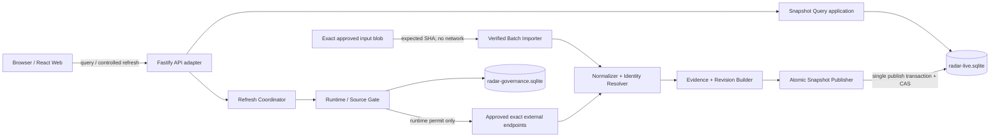
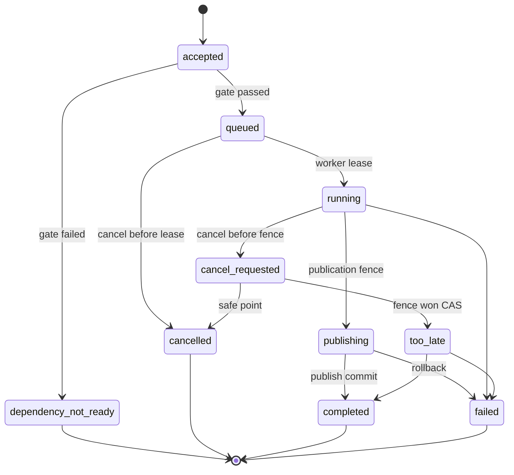

# AI Model Radar｜真实日更网页架构评估

> - 版本：1.0
> - 日期：2026-08-26（Asia/Shanghai）
> - 工作项：`AMR-ARCH-DAILY-WEB-001`
> - 变更编号：`architecture-20260826-radar-daily-web-001`
> - 产物 ID：`artifact-radar-daily-web-architecture-assessment-001`
> - 入场授权：`approval-20260826-radar-daily-web-architecture-entry`
> - 决策基线：`b2158c699396e0b04d2c23b8035b3389cf898b47`
> - 停止门：`architecture-review`
> - 生产发布：冻结

## 1. 评估结论

结论为：**架构有条件可行，可在本产物获批后重新拆解实现；当前运行态仍为 NO-GO。**

本增量不另起技术栈，继承已批准的 `docs/06-release-completeness-architecture.md` v1.5：现有 React 19 + TypeScript + Vite 前端，规划中的 Node.js + TypeScript strict + Fastify 模块化单体，以及本地 SQLite + WAL + foreign keys。Daily Web 只增加一次性已核验批次导入、稳定事件 identity/revision、不可变发布快照、current pointer、每日首次互动幂等刷新和对应查询接缝。

满足产品要求的最小真实纵切是：

1. 将 `output/daily/2026-08-25.json` 作为**内容寻址、一次性、人工核验输入**，经内部导入端口校验后持久化；浏览器和前端不得直接读取仓库 JSON。
2. 原始输入 ID 只作 lineage，系统以 canonical 主源、发布方、版本/tag/commit、事件动作与时间形成稳定事件 identity；更新形成追加式 revision，不覆盖历史。
3. 发布事务生成不可变 `PublishedSnapshot`、固定 `SnapshotItem(event_id,event_revision)`、证据与来源水位 manifest，再以 CAS 原子移动 current pointer。
4. `/today`、历史、事件、快照、来源质量与刷新详情只读真实服务结果；游标和页面返回上下文绑定 snapshot ID，不能跨快照拼页。
5. 每日首次互动和手动刷新共用 `RefreshRequest → RefreshRun → FetchRun` 身份链及幂等门。当前来源 runtime 为 0 时只持久化或复用 `dependency_not_ready` 请求决定，不生成假运行、不发网络字节。
6. 导入的 2026-08-25 已核验批次可形成真实历史快照，但其 `acquisition_mode=manual_verified_import`，不能把自动连接器、当日自动刷新或生产调度标成已就绪。到 2026-08-26 尚无当日成功快照时，不得继续标“今日”。
7. 刷新、导入、质量门或发布失败时，旧快照和 current pointer 保持不变；操作错误与旧内容真相并列返回，绝不静默回退 Demo。

当前仓库只有前端 Demo 纵切和 `backend/src/policy/` 下的来源 policy loader/bundle 文件；`backend/package.json`、Fastify API、Worker、迁移、SQLite 业务库和 Daily Web 集成测试均不存在。因此本文是实现契约，不是可运行证明。

## 2. 权威输入与完整性

| 输入 | 状态 | SHA-256 |
|---|---|---|
| `docs/02-daily-data-web-product-delta.md` v1.0 | 已批准 | `2661cfc4bcaecdd7eb57523b840f3f59f1befd88cb1311368371542b470700b2` |
| `ui/08-daily-web-ui-design.md` v1.0 | 已批准 | `5505f08f181ffea782e681d388fa8e73b45d6b888ca5b2695b3349b9e827cc3f` |
| `docs/06-release-completeness-architecture.md` v1.5 | 已批准架构基线 | `1529a866855eb1b5cbf34b349d38a7e2f50be8c8f914aeb7f8ed114fd2d99c10` |
| `output/daily/2026-08-25.json` | 已核验一次性输入，尚未入库 | `76d8f93aeac9a57f4e8fba959750a43e2775ca9da41eacb48de4de64f605be6c` |
| `docs/daily/2026-08-25.md` | 人类可读研究证据 | `4242377fe27121b6c5d5afdd4af5e7d1a973e573ecb30f772b6f0308d1becbd4` |

2026-08-25 JSON 含 6 条记录、1 条当日预发布、5 条覆盖缺口；`collection_mode=manual_public_web_verification`，且明确记录 `runtime_enabled=false`、live connector `0`、live snapshot `0`、database written `false`。导入后仍必须保留这些来源事实，不能把输入文件改写成自动采集结果。

## 3. 范围与不做项

### 3.1 本评估冻结

- 一次性已核验批次的输入、校验、幂等、lineage 与隔离边界。
- EventIdentity、EventRevision、Evidence、ImportBatch、PublishedSnapshot、CurrentSnapshotPointer 及运行记录边界。
- 不可变快照、内容哈希、事务发布、CAS 指针和失败保旧。
- 每日首次互动与手动刷新幂等、运行状态和来源/runtime 门。
- `/today`、事件、历史、快照、来源质量、刷新运行及 health/readiness API。
- anonymous-reader 与 local-owner 身份边界、revision/CAS、CORS/CSRF、审计和日志脱敏。
- 数据、后端、前端和 QA 的实现接缝与阻断验证。

### 3.2 明确不做

- 不执行数据导入，不写 SQLite，不创建 migration，不修改后端或前端代码。
- 不修改来源 registry、allowlist、policy bundle 或 2026-08-25 输入。
- 不启用 connector、canary、runtime、调度或真实网络采集。
- 不启动服务，不分配 API 端口，不创建账号、凭证、云资源或部署。
- 不把收藏、跨设备账号同步、生成式 AI 摘要或个性化推荐自动纳入本纵切。
- 不进入任务拆解、开发、代码审查或 QA。

## 4. 架构不变量

| ID | 不变量 | 违反结果 |
|---|---|---|
| `DW-INV-01` | 浏览器只读 API，不直接读取 Markdown/JSON/SQLite | P0 阻断 |
| `DW-INV-02` | 输入文件以 expected SHA + schema + importer revision 内容寻址 | `IMPORT_INPUT_MISMATCH` |
| `DW-INV-03` | 相同输入与 importer revision 的重试返回同一 ImportBatch 结果 | 不重复 Observation/Event/Evidence |
| `DW-INV-04` | EventIdentity 稳定；事实变化只追加 EventRevision | 禁止原地改写 |
| `DW-INV-05` | Observation、Evidence、已发布 Snapshot 和 SnapshotItem 不可更新/删除 | P0 阻断 |
| `DW-INV-06` | SnapshotItem 固定 event_revision，不跟随最新 revision | 历史不可发布 |
| `DW-INV-07` | Snapshot manifest 哈希覆盖有序内容、证据、规则、来源与输入 lineage | 哈希不可复算则拒绝发布 |
| `DW-INV-08` | current pointer 只在完整发布事务内以 revision CAS 移动 | 冲突或失败保留旧指针 |
| `DW-INV-09` | 每个逻辑刷新请求只有一个 RefreshRequest 和至多一个 RefreshRun | `IDEMPOTENCY_CONFLICT` |
| `DW-INV-10` | runtime 未登记时网络字节、live connector、自动 live snapshot 均为 0 | `DEPENDENCY_NOT_READY` |
| `DW-INV-11` | manual verified import 不改变 `runtime_enabled`，不冒充自动刷新 | UI 显示真实采集模式 |
| `DW-INV-12` | 当前自然日无成功快照时，历史记录不得标“今日” | truth 为 stale/not_ready/failed |
| `DW-INV-13` | failed run 不生成 Snapshot、不移动 pointer、不回退 Demo | 保旧并暴露错误 |
| `DW-INV-14` | `empty != not_ready`、`UNKNOWN != 0`、HTTP 200 != live | 契约测试阻断 |
| `DW-INV-15` | 查询 cursor 固定 snapshot_id + normalized query hash | 跨快照返回 409 |

## 5. 总体架构与模块边界



查询路径不依赖 Worker、连接器或 Control Center 才能读取最近成功快照；导入路径不调用网络；Connector 路径不能绕过治理/runtime gate。领域层只依赖 Repository、Clock、Hasher、PolicyGate 等端口，不依赖 Fastify、SQLite 或前端组件。

| 模块 | 必须负责 | 禁止负责 |
|---|---|---|
| `verified-import` | 输入 allowlist、SHA/schema/字段/主源/时间/权利校验、ImportBatch 幂等 | 接受浏览器任意路径、URL、凭证或联网补数 |
| `identity` | canonical URL、publisher、对象、动作、version/tag/commit 的稳定 identity | 仅用中文标题合并 |
| `revision` | 新增、更正、撤回、恢复的追加修订与 previous revision | 修改旧 revision |
| `evidence` | Observation/Evidence、主源/佐证/角色评估边界与 lineage | 复制受限正文或把转载当独立证据 |
| `refresh` | 请求幂等、1:1 run、1:N fetch、租约、状态 CAS、取消 fence | 从 GET 查询触发网络或重复入队 |
| `publisher` | 质量门、不可变 manifest、事务插入、pointer CAS | 失败清空页面、覆盖旧快照、全继承假发布 |
| `query` | snapshot-bound Today/Events/History/Sources/Run 视图 | 拼接不同 snapshot 或写业务数据 |
| `truth` | 内容真相与操作真相分离，给 UI 明确状态 | 把进程健康、Demo、输入文件可读当 live |
| `audit-observability` | 最小审计、日志、指标和 trace IDs | 记录正文、Cookie、Token、数据库绝对路径 |

建议在既有目录契约中新增 `modules/importing/`，但本评估不创建目录。`policy/coverage/refresh/publishing/query` 继续使用 v1.5 的既有边界。

## 6. 权威数据模型与存储边界

所有业务对象均落 `radar-live.sqlite`；policy/runtime 证据继续落 `radar-governance.sqlite`；Demo 仍在独立 `radar-seed-demo.sqlite`。live 查询禁止 attach 或回退 seed 数据库。

| 对象 | 核心字段 | 唯一性 / 不变量 |
|---|---|---|
| `ImportBatch` | import_batch_id, input_path_alias, input_sha256, schema_version, importer_revision, collection_mode, observed_at, record_count, status, validation_report_sha256 | `(input_sha256,schema_version,importer_revision)` 唯一；path 不是身份 |
| `ImportRecord` | import_batch_id, source_record_id, source_record_sha256, ordinal, status, safe_error | `(import_batch_id,source_record_id)` 唯一；保留失败原因，不原地补写 |
| `Observation` | observation_id, source_id, canonical_url, source_record_sha, obtained_at, published_at, content_fingerprint | 追加不可变；输入短摘要与来源元数据最小化 |
| `Evidence` | evidence_id, observation_id, evidence_root_id, role, relation, fact_or_assessment, confidence, evidence_sha256 | 追加不可变；角色评估不写成发布方事实 |
| `EventIdentity` | event_id, identity_scheme_revision, stable_identity_hash, created_at | stable hash 唯一；输入 record ID 不是 event ID |
| `EventRevision` | event_id, revision, previous_revision, normalized_payload_sha256, status, revision_reason, observed_at, as_of, rule_revision | `(event_id,revision)` 唯一且连续；撤回也新增 revision |
| `ImportEventLink` | import_record, observation, event_id, event_revision, decision_type | 可追溯导入如何生成/修订/去重/隔离 |
| `DuplicateDecision` | cluster_id, member_refs, decision, method_revision, reason, decided_at | 追加，可回放拆分/合并；不静默删除成员 |
| `RefreshRequest` | request_id, actor_id, trigger_kind, local_date, timezone, normalized_scope_hash, idempotency_key, request_hash, decision, requested_at | 同逻辑请求唯一；冲突 key + 不同 payload 拒绝 |
| `RefreshRun` | refresh_run_id, request_id, status, status_revision, target_as_of, frozen revisions/hashes, publication_fence_at | request_id 1:0..1；not_ready 决定可无 run |
| `FetchRun` | fetch_run_id, refresh_run_id, source_id, attempt, outcome, safe_error | 1:N；同 source/attempt 唯一；只在 runtime permit 后产生网络字节 |
| `PublishedSnapshot` | snapshot_id, snapshot_date, timezone, acquisition_mode, input_batch_sha?, schema/rule/policy revisions, as_of, published_at, previous_snapshot_id, manifest_sha256 | 发布后不可变；manual/runtime 明确区分 |
| `SnapshotItem` | snapshot_id, event_id, event_revision, rank, section, item_sha256 | 固定 revision；`(snapshot_id,event_id)` 唯一 |
| `SnapshotSourceWatermark` | snapshot_id, source_id, acquisition_mode, included_until, outcome, lineage_sha256 | manifest 一部分；manual import 不能伪造 connector 成功水位 |
| `CurrentSnapshotPointer` | pointer_scope, snapshot_id, revision, updated_at | scope 唯一；revision CAS；只能指向完整已发布快照 |
| `PublicationRecord` | publication_id, trigger_ref, candidate_manifest_sha, result, snapshot_id?, pointer_before/after, transaction_id | 成功/失败均追加，失败 snapshot_id=null |
| `AuditRecord` | actor, action, target refs, request/import/run IDs, transaction_id, time | 不含秘密/正文；支持责任追踪 |

关键索引至少包括：canonical URL、stable identity hash、`(event_id,revision desc)`、snapshot date/published_at、`(snapshot_id,rank)`、`(trigger_kind,local_date,timezone,scope_hash)`、refresh 状态与来源、ImportBatch content address。具体 SQLite driver/query layer 仍为 `TBD`，不得在本评估中假定某 ORM 已存在。

## 7. 一次性已核验批次导入契约

### 7.1 唯一入口

导入只允许内部 CLI adapter 调用 `ImportVerifiedBatch` application port。计划命令合同为：

```text
npm run import:verified-batch -- \
  --input output/daily/2026-08-25.json \
  --expected-sha256 76d8f93aeac9a57f4e8fba959750a43e2775ca9da41eacb48de4de64f605be6c \
  --authorization-id <approved-import-execution-id> \
  --idempotency-key <opaque-key>
```

该命令当前 `NOT_IMPLEMENTED`，本文未运行。未来执行仍需对应实现任务和输入执行授权；产品/UI/架构获批本身不写数据库。

CLI 必须：

1. 将相对路径解析后约束在项目 `output/daily/` allowlist；拒绝绝对路径、`..`、根外软链接、设备文件和超限输入。
2. 先读取不可变字节并计算 SHA，再校验 expected SHA；校验期间文件变化则整批拒绝。
3. 校验 UTF-8 JSON、schema_version、project_id、batch_date、timezone、collection_mode、runtime_truth、counts 与 records。
4. 每条校验 source ID 映射、canonical HTTPS URL、publisher/category/status、published/observed 时间、事实/评估、rights_access、fingerprint 与允许长度。
5. 不联网补齐缺字段，不用当前时间替代未知发布时间，不执行输入中的 HTML/脚本/提示词。
6. 将整个输入 blob SHA、逐记录 canonical SHA、schema 与 importer revision 写入 ImportBatch lineage。
7. 整批结构失败不写业务事实；单条业务失败时默认整批不发布，失败记录可进入隔离报告但不得进入 snapshot。

### 7.2 导入幂等与事务

- 内容身份为 `input_sha256 + schema_version + importer_revision`；路径、mtime、执行时间都不是身份。
- 同内容同 revision 重试返回原 ImportBatch、原 lineage 和原发布结果，不重复 Observation、Evidence、EventRevision 或 Snapshot。
- 同 Idempotency-Key 携带不同 expected SHA、schema 或参数时返回 `409 IDEMPOTENCY_CONFLICT`。
- 导入事务只持久化 ImportBatch、ImportRecord、Observation/Evidence、identity/revision 候选和去重决定；**不在同一步隐式移动 current pointer**。
- 发布是后续独立且幂等的 Publisher use case，以候选 manifest hash 唯一。导入成功但发布失败时，候选事实保留可诊断，页面仍读旧 pointer。

### 7.3 人工输入与 runtime 真相

manual verified import 是真实证据输入，但不是连接器成功：

- `acquisition_mode=manual_verified_import`。
- `runtime_enabled`、live connector、scheduled collection 均保持原值；本批当前均为 false/0/false。
- manual snapshot 的来源水位只引用 ImportBatch、人工核验时间和证据 SHA，不生成 ConnectorRevision、FetchRun 或 runtime watermark。
- 2026-08-25 历史页可明确显示“人工核验真实快照”；自动化状态仍为 `not_ready`。
- `truth=live` 仍只允许满足 v1.5 runtime、coverage 与当日新鲜度门的真实 connector snapshot。存在 manual snapshot 不能单独通过 live readiness。

## 8. Identity、Revision 与证据版本

### 8.1 稳定 identity

identity resolver 按版本化规则依次使用：

1. 发布方稳定对象 ID 或官方 release ID；
2. canonical URL + publisher + action + version/tag/commit；
3. publisher + product/object + action + normalized published time；
4. 信息不足时保持独立候选，绝不靠模糊标题强并。

`identity_scheme_revision` 与 normalized input 一起计算 `stable_identity_hash`。规则升级不重写旧 event_id；重算产生显式 `IdentityMigrationDecision` 或 DuplicateDecision，并保留前后引用。

### 8.2 Revision / CAS

- EventRevision 从 1 单调递增，新增、更正、状态变更、撤回、恢复各有 reason；旧 revision 永久可查。
- 写入时使用 `(event_id,expected_latest_revision)` CAS，失败返回 `REVISION_CONFLICT` 并重新评估，不使用 last-write-wins。
- Evidence 自身不可变；证据更新生成新 Evidence，并由新 EventRevision 引用。
- Published Snapshot 只引用具体 event_revision 和 evidence set hash，后续 revision 不改变历史页面。
- API 详情默认返回当前 snapshot 固定 revision；只有显式 `revision` 或“查看最新修订”才切换上下文。

### 8.3 事实与评估

导入字段 `fact_or_inference=fact` 不代表 `developer_impact` 是发布方事实。应用模型必须分开保存 `FactClaim`、`PublisherClaim`、`RoleAssessment`、`Unknown/NeedsVerification`，并将 evidence role、confidence、publisher、canonical URL 与观察时间显式返回。

## 9. 不可变快照与 current pointer

### 9.1 Manifest

manifest 使用确定性 canonical JSON，按稳定 key 排序并包含：

- snapshot schema、snapshot_date、timezone、acquisition_mode、as_of、rule/identity/dedup/policy revisions；
- ImportBatch SHA 或 runtime RefreshRun/coverage policy/registration set lineage；
- 有序 SnapshotItem：event_id、event_revision、rank、section、item SHA、evidence set SHA；
- 有序来源水位、覆盖、失败/排除、previous snapshot ID；
- candidate record count、正式/预发布/撤回计数及生成器 revision。

`manifest_sha256` 现场复算不一致时禁止写 pointer。快照、items、watermarks 和 manifest 一旦发布，Repository 和数据库约束都必须拒绝 UPDATE/DELETE；纠错只能发布新 revision 与新 snapshot。

### 9.2 原子发布

```text
freeze candidate revisions and pointer revision
  -> validate import/runtime lineage and quality gate
  -> rebuild identity/dedup/ranking from frozen input
  -> canonicalize manifest and compute SHA
  -> open SQLite IMMEDIATE transaction
  -> CAS publication fence / idempotency identity
  -> insert PublishedSnapshot + Items + Watermarks + PublicationRecord
  -> CAS CurrentSnapshotPointer(expected revision -> revision + 1)
  -> commit
  -> read back and recompute manifest SHA
```

任一步失败均 rollback；旧 pointer 不变。commit 后读回哈希失败时 readiness fail closed，旧安全快照可按完整性/新鲜度规则读取，但不得把可疑新 snapshot 当 current。

### 9.3 日期与 pointer 语义

- current pointer 表示“最新成功、可安全读取的真实快照”，不等于“今日”。
- `/today` 先按请求 timezone（P0 固定 Asia/Shanghai）和自然日选择该日成功 snapshot；当日不存在时返回真实状态和 last successful snapshot 链接，不能直接把 pointer 内容改标今日。
- 2026-08-25 输入在 2026-08-26 或以后只属于历史/最近成功；`published_at` 不覆盖事实 `as_of` 与 snapshot_date。
- 同日可有多份 snapshot；历史页按 published_at 追加显示，pointer 仅指最后一次成功且通过 CAS 的一份。

## 10. 刷新幂等、并发与状态机

### 10.1 幂等键

每日首次互动的服务器规范键：

```text
sha256(actor_id | trigger_kind=daily_first_interaction |
       local_date | timezone=Asia/Shanghai | normalized_scope_hash)
```

唯一约束为 `(actor_id,trigger_kind,local_date,timezone,normalized_scope_hash)`。同日重复进入复用第一次的 request/decision/run；不能因浏览器刷新、多个标签页或固定 00 重复交流再次抓取。

手动刷新必须提供 `Idempotency-Key`，并保存 canonical request hash。相同 key + 相同 payload 返回首次保存的 HTTP 状态、request_id、refresh_run_id 与 status_revision；相同 key + 不同 payload 返回 409。

### 10.2 未就绪分支

当前 runtime 为 0：

1. 接受并审计 RefreshRequest；现场验证 policy/runtime/coverage/服务门。
2. 保存 `decision=dependency_not_ready`、缺失门和操作响应；不创建 RefreshRun/FetchRun，不发网络字节。
3. 返回 `409 DEPENDENCY_NOT_READY` 的 OperationEnvelope；同日重复请求复用该决定。
4. 后续 runtime 门真正改变后，旧请求不能原地变成运行；用户再次明确触发时生成新逻辑请求/新 key。

### 10.3 可运行分支

runtime 门全部成立后才创建 1:1 RefreshRun，并为批准 scope 创建 1:N FetchRun。状态使用 `status_revision` CAS：



租约采用 owner、expires_at、heartbeat、revision；过期后只能 CAS 接管。任何重试必须重验同一冻结 policy/bundle/connector/coverage revision。发布 fence 前最后检查取消，越 fence 后不允许中断半发布。

## 11. 来源与 Runtime 硬门

本增量继承 v1.5 的唯一七步序列，不能缩短或并列执行：

1. 精确 endpoint policy 获批；conditional 条件完整，manual_only/disabled 不自动运行。
2. 形成精确、限时、同 endpoint/revision/environment 的独立执行授权。
3. 完成不可变 ConnectorRevision 实现，`runtime_enabled=false`。
4. 在步骤 1–3 成立且 mode=canary 的授权下运行 canary，仍保持 false。
5. 同一 tuple/revision 的独立 `.REV` 通过，必须 `P0=0/P1=0`。
6. 同一 tuple/revision/environment 的 `.QA` 为 PASS。
7. 获批 CoverageFreshnessPolicyVersion 后，事务登记 `EnvironmentRuntimeRegistration(enabled=true)`。

第 7 步之前 `runtime_enabled` 始终为 false；任一失败返回 owner 修复并保持 false。当前 N=22 只是政策基线；execution authorization、connector implementation、canary、对应 REV/QA、coverage policy、runtime registration、live connector 与 live snapshot 均未达到可运行门。一次性 manual import 不推进七步中的任何一步。

来源 API 必须同时暴露 policy 状态与 runtime 状态，不能用一个绿色状态合并：`allow/conditional/manual_only/disabled` 与 `runtime_enabled/registration/source watermark` 分轴；未观察值为 null/UNKNOWN，不填 0。

## 12. API 契约

所有业务路径继承 `/api/v1` 前缀，默认 `Cache-Control: private, no-store`。内容响应使用 `RadarContentEnvelope`，刷新/health 使用 `OperationEnvelope`；错误使用 v1.5 `RadarError`，并补充 import/snapshot 字段。

### 12.1 内容信封增量

```text
RadarContentEnvelope<T> {
  schema_version, request_id
  data_mode: live | seed_demo
  truth: live | empty | not_ready | stale | degraded | failed
  project_state
  snapshot: {
    id, revision, snapshot_date, timezone,
    acquisition_mode: manual_verified_import | runtime_connector,
    automation_state: not_ready | enabled,
    manifest_sha256, previous_snapshot_id
  } | null
  source_version: { input_batch_sha256?, policy_bundle_sha256?, rule_revision? }
  as_of, observed_at, last_success_at, freshness, coverage
  data, errors
}
```

manual verified snapshot 可是 `data_mode=live` 物理真实库中的真实数据，但只有 `acquisition_mode=manual_verified_import`；它不把 `automation_state` 变成 enabled，也不单独产生 truth=live。

### 12.2 查询 API

| 方法与路径 | 身份 | 关键参数 | 成功语义 |
|---|---|---|---|
| `GET /api/v1/radar/today` | anonymous-reader | `date?`, `timezone=Asia/Shanghai`, `window?`, `snapshot_id?` | 当日 snapshot-bound 事件；无当日快照不改标旧闻 |
| `GET /api/v1/radar/events` | anonymous-reader | `snapshot_id`, query/filter/sort/cursor | 只在同一 snapshot 内分页；筛选空与真实空分开 |
| `GET /api/v1/radar/events/{event_id}` | anonymous-reader | `snapshot_id?`, `revision?` | 返回固定 revision、证据、时间契约、revision 链与出现快照 |
| `GET /api/v1/radar/history` | anonymous-reader | date range, cursor | 按自然日返回不可变快照追加链和真实无快照日 |
| `GET /api/v1/radar/snapshots/{snapshot_id}` | anonymous-reader | include items/watermarks | manifest、输入/运行 lineage、差异与不可变元数据 |
| `GET /api/v1/radar/snapshots/{id}/diff` | anonymous-reader | `against` 相邻 snapshot | 新增/修订/撤回/合并；不可比时不伪造差值 |
| `GET /api/v1/radar/sources` | anonymous-reader | snapshot/current scope | policy 四态与公开来源目录，不含秘密/内部备注 |
| `GET /api/v1/radar/source-quality` | anonymous-reader | snapshot/run | policy、runtime、水位、覆盖和错误分轴 |
| `GET /api/v1/radar/refresh-runs/{live_refresh_run_id}` | local-owner | status cursor | 运行阶段、来源摘要、status_revision、publication decision |

cursor 必须签名或可验证地编码 `snapshot_id + normalized_query_hash + sort + last_key + expiry`。snapshot 不匹配返回 `409 SNAPSHOT_CHANGED`；未知筛选返回 400，不静默忽略。

### 12.3 刷新 API

| 方法与路径 | 请求 | 结果 |
|---|---|---|
| `POST /api/v1/radar/refresh` | local-owner；`Idempotency-Key`；trigger_kind/full-or-approved-subset；禁止 URL/凭证/policy override | 新任务 202；复用 200；依赖未就绪 409；冲突 key 409 |
| `POST /api/v1/radar/refresh-runs/{live_rr_id}/cancel` | local-owner；独立 Idempotency-Key | fence 前 cancel-requested/cancelled，之后 too-late；不删除证据 |

daily-first-interaction 由服务端生成规范 key；浏览器不能指定日期冒充“首次”。公开 GET 调用外部来源次数恒为 0。

### 12.4 Health / Readiness

| 路径 | 证明 | 不证明 |
|---|---|---|
| `GET /health/live` | 进程事件循环响应 | SQLite、查询、来源、快照或页面可用 |
| `GET /health/ready?capability=query` | schema 兼容、live DB 可读、pointer/manifest 可复算、查询契约可用 | 当日自动刷新已运行 |
| `GET /health/ready?capability=runtime` | v1.5 治理三方一致、coverage/runtime registration、Worker 与写路径可用 | 已发布当日快照 |

查询 readiness 与 runtime readiness 分离。manual snapshot 可以让 query capability 就绪，但 runtime capability 在七步未闭环时必须 not_ready；前端 TruthBar 同时展示两者，不能以单一 HTTP 200 变绿。

## 13. 错误码与失败保旧

| code | 场景 | 副作用与读取行为 |
|---|---|---|
| `IMPORT_INPUT_MISMATCH` | expected SHA/schema/project/date 不符或读取中变化 | 整批拒绝，业务写 0，pointer 不变 |
| `IMPORT_PATH_NOT_ALLOWED` | 根外路径、软链接穿越、特殊文件 | 拒绝且审计安全事件 |
| `IMPORT_RECORD_INVALID` | 字段、URL、时间、权利、fingerprint 失败 | 整批不发布；安全隔离报告 |
| `IMPORT_ALREADY_APPLIED` | 同 content address 重试 | 返回原结果，不重复写 |
| `IDEMPOTENCY_CONFLICT` | 同 key 不同 request/input hash | 409，无新 run/事实 |
| `IDENTITY_AMBIGUOUS` | 不能安全合并 | 保持独立候选，不覆盖另一事件 |
| `REVISION_CONFLICT` | expected latest revision 不符 | 重算候选，不 last-write-wins |
| `DEPENDENCY_NOT_READY` | runtime/coverage/DB/Worker/首快照缺失 | 保存/复用真实决定，不创建假运行 |
| `SNAPSHOT_MANIFEST_MISMATCH` | manifest 不能复算 | 不发布、不移动 pointer |
| `SNAPSHOT_CHANGED` | cursor 与 snapshot 不同 | 409，要求从新 snapshot 重新查询 |
| `SNAPSHOT_PUBLISH_FAILED` | 事务、磁盘、约束或读回失败 | rollback，旧 pointer/内容保留 |
| `CURRENT_POINTER_CONFLICT` | 并发发布 CAS 失败 | 当前候选失败或重建，不覆盖胜者 |
| `SOURCE_RUNTIME_SEQUENCE_VIOLATION` | 七步缺失/乱序/跨 revision | runtime=false，网络字节 0 |

内容与操作真相必须分开：本次 refresh 可以 `failed`，同时内容仍返回旧 snapshot 的 `degraded` 或 `stale`；错误信封在 TruthBar 中优先显示。只有旧 snapshot 的 manifest、rights 和 freshness 仍安全才可读取，否则为 failed/not_ready。

## 14. 身份、修订与接口安全

| 主体 | 权限 | 禁止 |
|---|---|---|
| `anonymous-reader` | Today/Event/History/Snapshot/Sources 只读 | refresh、cancel、import、runtime 配置、DB 路径 |
| `local-owner` | 明确 refresh/cancel；读取详细运行状态 | 导入任意路径、提交 URL/凭证、绕过 runtime/质量门 |
| `internal-importer` | 仅经已批准 CLI + exact input SHA 调用 ImportVerifiedBatch | 浏览器登录、网络采集、自动启用来源 |
| `worker-capability` | 仅处理已持久化且 permit 有效的 run | 作为更高权限人类、修改 policy 或 UI truth |

- 若使用 Cookie，只允许 API host-only、`HttpOnly`、适当 `SameSite`，生产必须 `Secure`；禁止父域 Cookie。
- CORS 仅允许对应环境精确 Web origin；禁止 `*` + credentials。Cookie 写操作必须 CSRF token + Origin/Referer 校验。
- Refresh 还需主体、scope、Idempotency-Key、限频、冷却和审计；import 不暴露 HTTP 端点。
- SQLite 使用参数化查询；排序/筛选只取枚举 allowlist；canonical 外链 HTML 转义并展示域名。
- 输入摘要按不可信文本处理，不执行 Markdown HTML、脚本或提示词；响应设置 CSP/安全头由实现与部署分别验证。
- 日志和错误不得包含 Authorization、Cookie、Token、完整外部正文、数据库绝对路径或用户浏览状态。
- localStorage 只能保存可丢弃的 UI 筛选/滚动缓存，不能证明 snapshot、revision、刷新或同步事实。

## 15. 事务、迁移、恢复与性能边界

### 15.1 SQLite

- foreign keys 必须开启；WAL、busy timeout、synchronous 级别由本地基准冻结，目前为 `TBD`。
- 所有时间保存 UTC + 原始时间/时区/精度；自然日由显式 `Asia/Shanghai` 计算。
- 迁移仅前进、编号、校验和、事务化；不兼容 schema 时 readiness 失败，不在启动时自动破坏性迁移。
- Snapshot publish 使用单一 SQLite 事务；Import persistence 与 publish 分事务，避免导入失败污染 pointer。
- current pointer、event revision、refresh status、worker lease 均使用 revision CAS；数据库 busy 不重试成重复写。

### 15.2 恢复

- 使用 SQLite online backup API 或已验证一致快照，不直接复制正在写的 WAL 文件组合。
- 恢复到隔离新路径，校验 manifest/DB SHA、schema、integrity、foreign keys、snapshot manifest 与 pointer 后才原子替换。
- 恢复后重放相同 ImportBatch 或 RefreshRequest 必须返回原身份，不产生重复 revision/snapshot。
- 数据恢复不能修改已发布 snapshot，也不能把 seed/demo 或旧输入复制为自动 runtime 数据。
- 发布失败、进程崩溃、磁盘满、CAS 冲突或迁移不兼容都保留最近安全 pointer；不能“先清空再重建”。

### 15.3 性能与容量

- Today/History/Snapshot 默认只读已发布结构，不在请求时重新去重/排名或访问外网。
- 事件列表 keyset cursor 绑定 snapshot，避免 offset 在新快照下漂移。
- 常用查询目标由实现基准冻结；当前数据量和 SLO 为 `UNKNOWN`，不得编造毫秒承诺。
- 输入/响应、记录数、摘要长度、分页上限、日期范围和导出大小必须有 schema 上限；具体值由任务拆解基于 6 条 fixture 和增长假设冻结。

## 16. 数据、后端、前端与 QA 接缝

| Owner | 交付边界 | 必须证明 | 不得声称 |
|---|---|---|---|
| 固定 08 数据 | import schema/fixture、identity/revision/dedup、snapshot replay 与 lineage | 6 条输入精确、预发布不变、重复导入为 0 新记录、历史 revision 可回放 | 已启用 connector 或完成网页 |
| 固定 07 后端 | Fastify/API/Worker、SQLite/migrations、publisher/pointer、refresh、readiness | 重启不丢、事务/CAS、失败保旧、公开 GET 外网 0、真实临时 SQLite 集成 | HTTP 200 即 live |
| 固定 06 前端 | API adapter、TruthBar、八态、History/Event/Snapshot/Source/Run 页面 | 正式模式 Demo 记录 0、snapshot-bound 返回、日期/错误/来源可见 | 静态卡片即真实日更 |
| 固定 09 审查 | identity/publish/runtime/security 独立审查 | P0/P1=0，特别检查 immutable/CAS/idempotency 与 runtime gate | 自审代替独立证据 |
| 固定 10 QA | AC-AMR-DW-01..15、跨层契约、失败恢复、可访问性 | 真实 SQLite + API + 浏览器；重启/并发/坏输入/失败旧快照 | Mock 或 Demo 代替持久化 |

前端只消费 API schema；数据/后端通过同一 domain contract 协作；不得让前端读取 `output/daily/*.json`，也不得让数据脚本直接改前端 fixture 作为接入。

## 17. 可观测性

结构化日志字段至少包括：`timestamp, level, request_id, import_batch_id?, refresh_request_id?, refresh_run_id?, fetch_run_id?, snapshot_id?, event_id?, source_id?, input_sha256_prefix?, rule_revision?, status_revision?, outcome, safe_error_code, duration_ms?`。

指标至少分开：

- Import：批次校验/应用/复用/隔离、记录数和耗时。
- Identity/Revision：新 identity、revision、ambiguous、merge/split。
- Refresh：accepted/reused/not_ready/running/failed/completed、租约与幂等冲突。
- Publish：候选、成功、rollback、manifest mismatch、pointer CAS 冲突、last success age。
- Query：truth 分布、snapshot changed、按路由延迟和错误。
- Runtime：policy approved、runtime enabled、网络请求、来源水位；manual import 不能贡献 connector success 指标。

页面展示的最近成功、as_of、覆盖、失败来源必须来自持久化事实，不从日志反推业务真相。

## 18. 验证矩阵

| 层 | 正向验证 | 必须失败的反例 |
|---|---|---|
| Input contract | exact SHA/schema/6 records/时间/rights/fingerprint | 文件读取中变化、错 SHA、根外路径、未知字段宽度 |
| Import idempotency | 同内容/同 revision 重放返回同 batch | 同 key 不同内容、同输入重复 Observation/Event/Snapshot |
| Identity/revision | stable identity、多 evidence、追加 revision/撤回 | 仅标题合并、旧 revision 被 UPDATE/DELETE |
| Snapshot immutable | manifest 可复算、items 固定 revision、历史 diff | 后续 event revision 改变旧 snapshot |
| Atomic publish | 事务 + pointer CAS + crash recovery | items 半写、失败移动 pointer、CAS 失败覆盖胜者 |
| Daily date | 2026-08-25 只在对应日期为历史真实输入 | 2026-08-26 无新快照仍显示“今日” |
| Refresh identity | daily first interaction 同日复用；manual key 重放 | 多 tab 重复 run、key/payload 冲突被接受 |
| Runtime gate | 七步同 revision；未启用网络字节 0 | manual import 或 HTTP 200 打开 runtime |
| Query contract | snapshot-bound cursor、事件/历史/来源/运行 | 跨 snapshot 拼页、UNKNOWN 变 0、empty 代 not_ready |
| Failure keeps old | bad input/source/publish/DB busy 后 pointer 不变 | 失败清空页面或静默回退 Demo |
| Persistence | 真实临时 SQLite、迁移、重启、online backup/restore | 只用 Mock 证明持久化 |
| Security | CORS/CSRF/host-only Cookie/path/SQL/XSS/secret scan | 父域 Cookie、任意 URL/path、日志正文/Token |
| Frontend E2E | 简中、320/390、200%、键盘/读屏、八态 | 目标态演示或 seed 计入正式完成 |

阻断级端到端 fixture：导入已批准 2026-08-25 SHA → 生成 6 条可追溯记录及至少一份 manual verified snapshot → 重启 API 后历史仍可查 → 在 2026-08-26 fake clock 下 `/today` 不把 8 月 25 日标今日 → 重复导入与重复首次互动不新增记录/run → 模拟发布失败后旧 pointer 与 6 条历史仍在。

## 19. AC 映射与完成门

| 产品 AC | 架构落点 |
|---|---|
| AC-01/02 | Verified Importer、真实 SQLite、PublishedSnapshot、输入 SHA/lineage |
| AC-03/04 | snapshot_date/Asia-Shanghai、时间契约、Evidence/Revision API |
| AC-05/06 | stable identity、多 Evidence、append-only EventRevision |
| AC-07/08 | immutable snapshot、atomic pointer CAS、失败保旧 |
| AC-09/10 | daily-first idempotency、not_ready/no_new_items 独立语义 |
| AC-11/12 | 来源水位/coverage、操作错误与旧内容真相分离 |
| AC-13 | snapshot-bound query/filter/count/empty |
| AC-14 | UI 合同、结构化图表数据和浏览器 QA 接缝 |
| AC-15 | 数据/后端/前端/审查/QA 五类独立证据门 |

只有以下全部成立才可解除 Daily Web 实现冻结：

1. exact input SHA 的导入、identity/revision、snapshot publish 和重放测试通过。
2. Fastify API、真实 SQLite migration/restart/backup/restore 与错误信封通过。
3. 前端正式模式静态 Demo 记录为 0，八态和日期边界接线通过。
4. runtime 未启用时网络请求为 0；若未来启用，则七步 `.REV/.QA` 同修订闭环。
5. 独立审查 P0/P1=0，QA 覆盖 AC-01..15 且失败保旧通过。

## 20. TBD、风险与重审触发

| TBD / 风险 | Owner / 解决门 | 未解决时阻断 |
|---|---|---|
| SQLite driver/query layer、后端精确依赖与 lockfile | 固定 07 提案，固定 05 复核；首批后端任务前 | 后端实现 |
| API 本地端口与 DB/backup 路径 | 固定 07/11；本地服务联调前 | 服务启动与联调 |
| importer/rule/identity/dedup revision 初始值 | 固定 08 + 固定 05；导入任务 DoR | 数据导入与 snapshot |
| manual snapshot 的 freshness 展示阈值 | 固定 03 + 固定 05；前端契约冻结前 | truth/live 文案与验收 |
| CoverageFreshnessPolicyVersion | 产品/架构/来源 owner；任一 runtime 登记前 | connector runtime/live readiness；不阻断 manual fixture 实现 |
| 本地数据容量、查询 SLO、备份保留实测 | 固定 07/10/11；完整联调/部署方案前 | 生产容量承诺 |
| 正式域名、云、证书、预算、账号、凭证 | 单独高风险授权；生产方案门 | 所有生产动作 |

以下变化必须重审架构：引入账号/跨设备、把 import 暴露为 Web 上传、允许任意来源 URL、改变物理 live/seed 隔离、修改 snapshot immutable 或 pointer CAS、改用多写节点/PostgreSQL、引入消息队列、将 manual snapshot 计作 connector live、改变来源七步门或进入生产部署。

## 21. 被拒绝的方案

| 方案 | 拒绝原因 |
|---|---|
| 前端直接读取 `output/daily/*.json` | 无持久化、revision、事务、API 或失败恢复，重启/历史不可证明 |
| 覆盖同一 `today.json` | 历史、证据与 revision 丢失，发布中断会清空当前内容 |
| 事件只存最新行 | 更正/撤回无法回看，旧 snapshot 会随最新事实漂移 |
| snapshot 查询动态 JOIN 最新 revision | 破坏不可变历史和可复算 manifest |
| 失败时切 Demo/seed | 冒充真实数据，污染 live 指标和用户判断 |
| manual import 自动置 `runtime_enabled=true` | 研究输入与 connector 执行授权是不同能力 |
| GET `/today` 顺便抓取来源 | 读请求产生不可控外部副作用，无法幂等和审计 |
| 用进程内 Map/定时器替代 SQLite/租约 | 重启丢状态，多实例/并发重复，无法满足 AC-15 |
| pointer 原地覆盖且无 revision CAS | 并发发布丢更新，失败可能指向半成品 |
| 用 localStorage 保存 snapshot/刷新真相 | 非权威、不可跨进程/恢复，用户可修改 |

## 22. 自查与停止门

- [x] 真实持久化、一次性输入、identity/revision、Evidence 与不可变 snapshot 已冻结。
- [x] current pointer、发布事务、CAS、幂等刷新、历史与失败保旧已冻结。
- [x] 来源 policy/runtime 双轴、唯一七步门和当前 runtime=0 真相未放宽。
- [x] 查询、来源、运行、health/readiness API 与身份/安全边界完整。
- [x] 数据/后端/前端/审查/QA 接缝与 AC-01..15 映射完整。
- [x] 未写代码、数据库、来源 registry，未运行导入/采集/服务/部署。

本产物只完成 `AMR-ARCH-DAILY-WEB-001` 架构评估。状态停在 `architecture-review`；不得自动进入任务拆解、开发、真实数据采集、连接器启用、服务启动或部署。
