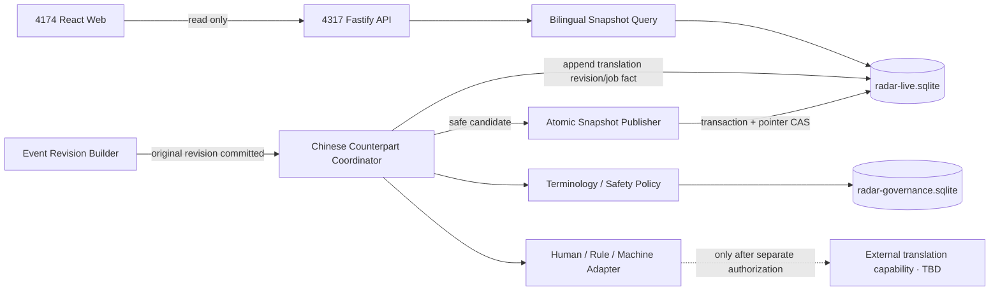

# AI Model Radar｜逐条中文对照架构影响评估

> - 版本：`1.0`
> - 日期：2026-08-28（Asia/Shanghai）
> - 工作项：`AMR-ARCH-BILINGUAL-001`
> - 变更 ID：`architecture-impact-20260828-radar-bilingual-chinese-counterpart-v1`
> - 产物 ID：`artifact-radar-bilingual-chinese-counterpart-architecture-impact-001`
> - 入场授权：`approval-20260828-radar-bilingual-chinese-counterpart-architecture-entry`
> - 权威固定角色：`05 架构师`（任务 `019fb74a-a1a4-7a90-9a35-ebb4f3d9d6db`）
> - 评估基线：`e92b9d15951c431e27bf374b98530390fcb238a4`
> - 停止门：`architecture-review`
> - 生产发布：冻结

## 1. 唯一结论

**结论：不能直接交给前端单独实现；必须先完成后端契约与数据模型变更，并由前端随后接入。**

这是唯一结论，不存在“前端先用静态中文、浏览器临时翻译或复用现有 `title/summary` 即可”的合规分支。理由如下：

1. 当前 `4317` 的事件模型只有一组语义不分层的 `title`、`summary`，没有原文语言、原文修订与中文修订的独立身份。
2. 当前 SQLite 只有 `events`、`event_revisions`、`snapshot_items` 等原始事件/快照表，没有中文对照修订、形成方式、处理状态、失败原因或快照版本配对表。
3. 当前查询 API 不返回 `original` 与 `chinese_counterpart`，也不支持中文/原文联合检索、形成方式筛选或固定 revision 配对。
4. 当前 `4174` 的 `EventCard` 只显示一套标题和摘要；字段回退 `title → title_zh_cn` 只是展示兼容，不是持久化、可追溯的双语契约。
5. 现有人工核验导入把 `title_zh` 和中文 `summary` 直接写进事件的 `title/summary`；该输入没有保存对应原文标题/原文摘录，无法由前端还原双语事实根。
6. 产品要求相同原文修订和策略重试幂等、旧快照不可变、翻译失败不阻断新闻。这些都是服务端事务、唯一约束和快照 manifest 责任，前端无法可靠补齐。

因此后续若本产物获批，任务拆解必须至少包含“数据迁移与双语 revision”“4317 查询/处理契约”“4174 双语展示与无障碍接入”三个独立实现接缝；本评估本身不授权这些实现。

## 2. 权威输入与现场事实

| 输入／实现证据 | 状态 | SHA-256 或基线 |
|---|---|---|
| `ui/10-bilingual-chinese-counterpart-ui-design.md` v1.0 | 已批准权威输入 | `b453bd0d6aae23cdd01210336cdcf51f87cd20ae21d913e83ab22a83e4924b40` |
| `docs/02-bilingual-chinese-counterpart-product-delta.md` v1.0 | 已批准产品约束 | `2497164c07c2e434f99e0b5e1374e47475b1f8f538fb7a7c444ff6914c86109e` |
| `docs/08-daily-web-architecture-assessment.md` v1.0 | 既有 revision/snapshot 架构基线 | 当前仓库版本 |
| `backend/migrations/live/0001_radar_live.sql` | 当前真实 live schema | 基线 commit `e92b9d1` |
| `backend/src/infrastructure/repository.ts` | 当前持久化/发布实现 | 基线 commit `e92b9d1` |
| `backend/src/http/radar.ts` | 当前 `4317` API | 基线 commit `e92b9d1` |
| `frontend/src/api/radar.ts`、`RadarUi.tsx` | 当前 `4174` 读取/展示 | 基线 commit `e92b9d1` |
| `output/daily/2026-08-25.json`、`import-verified.ts` | 人工中文输入与导入语义 | 基线 commit `e92b9d1` |

本轮只读检查确认：

- `4174` 是本地 React/Vite Web；默认从 `http://127.0.0.1:4317` 读取，`fetch` 使用 `cache: no-store`。
- `4317` 是 Fastify + SQLite 本地 API；响应统一 `Cache-Control: private, no-store`，CORS 只允许显式 loopback Web origin，不使用 credentials。
- `events.current_revision` 和 `event_revisions` 已存在，已发布 `snapshot_items` 固定 `event_revision`，快照/条目有禁止更新/删除触发器。
- 当前原始事件 payload SHA 只覆盖现有一套标题/摘要；快照 manifest 与 `item_sha256` 均未覆盖中文修订身份。
- 当前后端没有翻译端口、翻译作业、中文 revision、语言检测、术语策略或第三方翻译配置。
- 当前设计原型明确是目标态资产，不连接 `4174/4317`，不能作为能力证明。

本评估未启动或重启 `4174/4317`，未读取或修改本机 SQLite 数据；结论来自版本化代码、迁移和已批准产物，不把 HTTP 200 当成中文能力证据。

## 3. 影响范围与不做项

### 3.1 本评估冻结的影响边界

- 事件原文与中文对照的独立身份、revision、哈希和形成方式。
- 中文对照生成/导入/复核的应用端口、幂等和失败状态。
- PublishedSnapshot 中原文 revision 与中文 revision/status 的不可变配对。
- `/today`、事件列表/详情、历史快照、趋势下钻、开源发布和来源质量的读取契约。
- `4174` 对 `4317` 新契约的展示、缓存、错误降级、性能和无障碍边界。
- 外部翻译能力可能涉及的最小传输、安全、版权与可追溯边界。
- 数据、后端、前端、审查和 QA 的实现/验证接缝。

### 3.2 明确不做

- 不修改前端、后端、迁移、SQLite、采集器、来源 registry 或任何业务代码。
- 不选择或调用翻译供应商、模型、API、账号、凭证或付费能力。
- 不导入、回填、重翻、复核或发布任何一条真实中文对照。
- 不启动、停止或重启 `4174/4317`，不执行刷新或真实采集。
- 不修改 DNS、CDN、Nginx、云资源或生产部署；生产继续冻结。
- 不进入任务拆解、开发、代码审查或 QA，不自动授权下游。

## 4. 必须保持的架构不变量

| ID | 不变量 | 违反时结果 |
|---|---|---|
| `BI-INV-01` | 原文 revision 是事实根；中文对照只能附加，不能覆盖原文 | P0 阻断 |
| `BI-INV-02` | 每个可见事件都返回中文状态；成功内容可以为空，状态不能缺失 | `TRANSLATION_STATE_MISSING` |
| `BI-INV-03` | 中文 revision 必须绑定精确 `(event_id, original_revision, locale)` | 禁止用“当前事件”隐式漂移 |
| `BI-INV-04` | 形成方式与事实层级是两个维度 | 机器译文不得冒充人工/发布方事实 |
| `BI-INV-05` | 相同输入哈希 + 中文策略 revision 的重试复用同一结果 | 不新增重复作业或中文 revision |
| `BI-INV-06` | 原文修订后旧中文只能标 stale/历史，不得作为当前中文 | `TRANSLATION_REVISION_STALE` |
| `BI-INV-07` | 中文失败、超时或服务不可用不删除事件、不移动到 Demo、不阻断原文发布 | 旧安全新闻继续可读 |
| `BI-INV-08` | PublishedSnapshot、SnapshotItem 和中文配对发布后不可更新/删除 | P0 阻断 |
| `BI-INV-09` | 快照 manifest 覆盖原文 revision、中文 revision/status、策略和内容哈希 | 不可复算则拒绝发布 |
| `BI-INV-10` | 浏览器不生成、持久化或声明权威译文 | 前端临时翻译禁止计入完成 |
| `BI-INV-11` | 代码、版本、tag、commit、URL、时间、单位和许可证原样保留 | 保真测试失败 |
| `BI-INV-12` | 来源 truth 与中文处理 truth 分轴；中文成功不改变事件真实性 | `live` 不由翻译决定 |
| `BI-INV-13` | 既有历史快照不回写中文；补齐必须通过追加 revision/后续 snapshot | 历史审计不可破坏 |
| `BI-INV-14` | `untranslated != failed != pending != source_is_zh`，未知不能填成功 | 状态契约失败 |
| `BI-INV-15` | 正式模式不使用原型、硬编码或 localStorage 作为中文事实 | P0 阻断 |

## 5. 目标模块边界



| 模块 | 必须负责 | 禁止负责 |
|---|---|---|
| `event-revision` | 保存原文语言、标题/许可摘录、事实字段、原文 payload SHA | 把中文写回原文列 |
| `counterpart-coordinator` | 原文 revision 后排队、幂等、状态 CAS、重试上限、失败保旧 | 改变事件准入或来源 truth |
| `terminology-safety-policy` | 保真字段、术语表 revision、长度/语言/注入/版权规则 | 在没有证据时扩写事实 |
| `translation-adapter` | 人工、规则或机器形成方式的统一结果端口 | 让供应商响应直接成为 PublishedSnapshot |
| `counterpart-repository` | 作业、中文 revision、失败、复核、审计追加存储 | UPDATE/DELETE 已发布修订 |
| `snapshot-publisher` | 原文/中文绑定 manifest、质量门、事务、pointer CAS | 等待所有译文成功才发布新闻 |
| `bilingual-query` | snapshot-bound 双语投影、联合搜索、状态/方式筛选 | 请求时调用翻译能力 |
| `4174 presentation` | 安全渲染、双语语义、状态、筛选和无障碍 | 猜填缺失字段或把缓存当权威 |

不新增共享数据库或独立微服务。最小实现继续使用现有模块化单体与 `radar-live.sqlite`；翻译供应商只是可替换 adapter，且当前保持 `TBD/disabled`。

## 6. 数据模型影响

### 6.1 当前缺口

当前 `events.title/summary` 同时承载“来源原文”或“人工中文摘要”，语义取决于输入路径；`event_revisions.payload_json` 也没有显式 original language。人工导入路径把 `title_zh` 写到 `title`，因此现有数据不能被安全解释成“全部是原文”，也不能被安全解释成“全部是中文对照”。

这要求后续做前进式 migration，而不是在前端给现有列换标签。

### 6.2 建议新增/演进的权威对象

| 对象 | 核心字段 | 约束 |
|---|---|---|
| `EventOriginalRevision`（演进现有 `event_revisions`） | event_id, revision, source_language, original_title, permitted_excerpt?, fact_payload_json, payload_sha256, observed_at | 原文事实根；追加不可变 |
| `ChinesePolicyRevision` | policy_revision, locale=`zh-CN`, terminology_revision, safety_revision, adapter_contract_revision, approved_at | 内容寻址；策略变更显式产生新 revision |
| `TranslationJob` | job_id, event_id, original_revision, locale, input_sha256, policy_revision, formation_kind, state, attempt, lease_revision, safe_error, timestamps | `(event_id,original_revision,locale,input_sha256,policy_revision,formation_kind)` 唯一 |
| `ChineseCounterpartRevision` | event_id, original_revision, chinese_revision, locale, formation_kind, status, title_zh?, fact_summary_zh?, key_changes_json?, assessment_zh?, input_sha256, output_sha256, policy_revision, formed_at, reviewed_at? | `(event_id,original_revision,locale,chinese_revision)` 唯一；追加不可变 |
| `SnapshotCounterpartBinding` | snapshot_id, event_id, original_revision, locale, chinese_revision?, counterpart_status, formation_kind, binding_sha256 | 必须匹配同 snapshot 的 SnapshotItem；发布后不可变 |
| `TranslationAuditRecord` | actor/capability, action, job/revision refs, provider_class?, request_id, safe outcome, created_at | 不保存凭证或超出最小化范围的正文 |

实现可选择给现有表增加原文列或建立独立 original revision 表，但必须满足以下逻辑契约：原文和中文 revision 可单独寻址；旧事件列不能继续以“标题看起来像中文/英文”推断语义。

### 6.3 中文 revision 状态与形成方式

形成方式 `formation_kind` 只允许：

- `human`：有明确人工形成/复核证据；
- `machine`：自动翻译能力形成，不暗示人工确认；
- `rule`：仅依据 allowlist 结构化字段和版本化模板；
- `none`：没有译文，或原文已是中文无需另译。

持久化状态至少包括：

- `source_is_zh`：原文已是中文，不复制伪译文；
- `ready`：标题/事实摘要等必需字段完整；
- `partial`：只发布已完成字段，缺失字段显式为空；
- `processing`：作业已接受但无可发布 revision；
- `stale`：旧中文绑定旧原文 revision；
- `failed`、`timed_out`：终止或超时，保留 safe error；
- `untranslated`：尚未形成/明确不形成；
- `historical_pending`：历史回填待处理；
- `needs_review`：术语或安全门要求人工处理。

`service_unavailable` 是中文处理能力/作业层状态，不伪造为某个已经持久化的译文 revision。UI 的十二种视觉状态由“形成方式 + 持久化状态 + capability health”组合映射，不能另造第三套业务真相。

### 6.4 既有数据迁移与历史边界

1. Migration 只前进、编号、校验和、事务化；先建新表/列和索引，再由明确任务回填，不在启动请求中做大规模翻译。
2. 对 runtime connector 形成且仍有原始 payload 的事件，可从已有 revision 恢复原文层，但必须重新计算语言和 lineage。
3. 对 2026-08-25 人工批次等只有中文标题/摘要、没有原文标题的记录，必须标 `legacy_original_unavailable` 或重新从已批准主源核验；禁止把中文倒译成“原文”。
4. 既有 Snapshot 不新增 binding、不改 manifest；读取时显示“历史快照未记录中文配对”，不能用当前译文覆盖历史画面。
5. 新中文补齐通过新 CounterpartRevision 和后续 PublishedSnapshot 体现；原始发布时间、首次观测和旧快照均不变。
6. 原文缺失、来源权利不允许保存摘录或无法重新核验时，该事件可以保留原文标题/URL最小事实和明确状态，但不能声称 AC 双语完成。

## 7. 中文形成方式与传输边界

### 7.1 唯一处理顺序

```text
来源采集/人工核验
→ 规范化、相关性、证据和权利门
→ 持久化 EventOriginalRevision
→ 计算 translation input SHA 与 policy revision
→ 幂等预约 TranslationJob
→ 人工/规则/机器 adapter
→ 结构与保真校验
→ 追加 ChineseCounterpartRevision 或安全失败状态
→ 形成带固定配对的候选 Snapshot
→ manifest 复算 + 事务发布 + current pointer CAS
```

中文形成不得前置到来源准入之前，也不得由 GET 查询或 React render 触发。

### 7.2 机器翻译能力

当前供应商、模型、预算、网络位置、凭证和数据处理条款均为 `TBD`，默认 `disabled`。未来若选择第三方能力，执行前仍需单独授权和安全/隐私/版权审查，至少满足：

- 只传已获准保存/处理的最小公开标题、许可摘录和必要结构化字段；不传 Cookie、Token、内部路径、运行日志或完整受限正文。
- 请求中携带内部 opaque ID，不携带不必要的发布者之外个人信息；供应商响应不能直接进入事实层。
- 禁止训练/保留条款不明确时启用；区域、日志保留、删除、DPA/条款为未解决阻断项。
- Prompt/模板把来源文本当不可信数据，禁止执行其中的指令、脚本、URL 请求或工具调用。
- adapter 记录 provider class、model/rule revision、request hash、耗时和安全错误；凭证只在运行环境注入且永不入库/日志。
- 超时、限流或供应商失败只更新 job 状态，不改变原文事件、来源水位或 current snapshot pointer。

规则生成只适合版本、日期、动作等确定字段；人工译文必须有人工 actor/reviewer 证据。禁止把机器结果人工改一个字就标“人工译文”。

## 8. 幂等、并发与修订规则

### 8.1 作业幂等

规范请求哈希：

```text
SHA256(event_id | original_revision | locale | original_payload_sha256 |
       chinese_policy_revision | formation_kind | adapter_contract_revision)
```

- 相同哈希的重复刷新、进程重启或页面多次请求必须返回同一 job/result。
- 同 idempotency key 不同请求哈希返回 `409 TRANSLATION_IDEMPOTENCY_CONFLICT`。
- `ready/partial/source_is_zh` 的既有结果直接复用；`failed/timed_out` 只有在明确 retry policy 允许时增加 attempt，不产生假 revision。
- worker 领取使用 lease + revision CAS；过期接管必须重新核对 original/policy revision。
- 发布前若原文已产生新 revision，候选中文结果只能进入旧 revision 历史，当前绑定转为 stale/pending。

### 8.2 快照发布

每个 SnapshotItem 必须恰有一个同 locale 的状态 binding：成功时固定 `chinese_revision`，失败/处理中则 revision 为 null 并固定状态。状态覆盖率因此可以 100%，但不得叫“翻译成功率”。

快照 manifest 至少纳入：

```text
snapshot_id / previous_snapshot_id / event_id / rank
original_revision / original_payload_sha256 / source_language
locale / counterpart_status / formation_kind / chinese_revision?
translation_input_sha256? / translation_output_sha256? / chinese_policy_revision
source/evidence/policy revisions / published_at
```

若中文全部失败，仍可发布原文新闻 Snapshot（状态 binding 为失败/无译文）；若 manifest、外键、保真或 CAS 失败，则整个新 Snapshot rollback，旧 pointer 保持不变。

## 9. `4317` API 契约影响

### 9.1 兼容策略

建议将内容 schema 从 `1.0` 演进为向后兼容的 `1.1`，保留 `/api/v1` 路径。现有 `title/summary` 在迁移后只能作为 `original.title/permitted_excerpt` 的兼容 alias，绝不能随语言偏好切换成中文；新前端必须改读显式对象。

任何无法证明原文身份的 legacy 行都不能伪装成 original alias，应返回明确的 `legacy_original_unavailable` 质量状态。若实现无法安全维持 alias，则需在任务拆解中提案 `/api/v2` 并重新评估，不得悄悄改变 v1 语义。

### 9.2 事件投影

```text
BilingualEventView {
  event_id
  snapshot: { id, manifest_sha256 }
  original: {
    revision, payload_sha256, language,
    title?, permitted_excerpt?, canonical_url,
    publisher, published_at, observed_at,
    version_label?, evidence_refs[], quality_state
  }
  chinese_counterpart: {
    locale: "zh-CN"
    revision: number | null
    bound_original_revision
    status
    formation_kind
    title_zh: string | null
    fact_summary_zh: string | null
    key_changes_zh: string[]
    system_assessment_zh: string | null
    policy_revision: string | null
    input_sha256: string | null
    output_sha256: string | null
    formed_at: string | null
    reviewed_at: string | null
    safe_error: { code, retryable } | null
  }
}
```

`system_assessment_zh` 与译文事实字段分区，不得被计入译文完整度。API 默认不返回供应商秘密、prompt、完整受限正文或内部绝对路径。

### 9.3 受影响 API

| 路径 | 必须新增的契约 |
|---|---|
| `GET /api/v1/radar/today` | 每个 item 的 original + counterpart 固定配对；envelope 增加 translation coverage/health |
| `GET /api/v1/radar/events` | `q` 联合检索、`matched_language`、counterpart status/formation 筛选；cursor 绑定 snapshot + query hash |
| `GET /api/v1/radar/events/{id}` | `snapshot_id?`、`original_revision?`、`chinese_revision?`；返回配对历史与证据 |
| `GET /api/v1/radar/history` | 快照级中文状态覆盖/成功/失败分母，不能改旧快照 |
| `GET /api/v1/radar/snapshots/{id}` | 返回不可变 counterpart bindings 和 manifest revision |
| `GET /api/v1/radar/trends` | 聚合中文标签仍由结构化维度生成；下钻事件使用同一双语投影 |
| `GET /api/v1/radar/open-source` | 双语投影且 repo/tag/commit/license 保真 |
| `GET /api/v1/radar/source-quality` | 来源健康与中文处理健康分轴；供应商状态不冒充来源状态 |
| `POST /api/v1/radar/refresh` | 仍只负责真实刷新编排；返回 translation scheduling 摘要，不等待全量翻译 |

不建议给 anonymous reader 增加“重翻/确认/发布”API。若未来需要人工复核工作流，必须另行定义主体、权限、CSRF、审计和数据权利，不在本增量自动纳入。

### 9.4 Envelope 与错误

内容 envelope 继续保留新闻 `truth`，另增：

```text
translation {
  locale, policy_revision, capability_state,
  coverage: { total, ready, source_is_zh, partial, processing, stale,
              failed, untranslated, historical_pending, unknown }
  observed_at, last_success_at
}
```

错误至少包括：

| code | 语义 | 内容行为 |
|---|---|---|
| `TRANSLATION_NOT_AVAILABLE` | 尚无译文 | 原文正常返回，中文区空态 |
| `TRANSLATION_PROCESSING` | 幂等作业进行中 | 原文正常，禁止伪百分比 |
| `TRANSLATION_REVISION_STALE` | 原文已更新 | 新原文正常；旧中文仅历史可见 |
| `TRANSLATION_PARTIAL` | 部分字段通过 | 只返回通过字段，不由前端补齐 |
| `TRANSLATION_FAILED` | 安全/格式/能力失败 | 原文正常，safe error 可见 |
| `TRANSLATION_TIMEOUT` | 作业超时 | 原文正常；有旧版则明确旧版 |
| `TRANSLATION_SERVICE_UNAVAILABLE` | 中文能力不可用 | 新闻 truth 不变，处理 health 降级 |
| `TRANSLATION_IDEMPOTENCY_CONFLICT` | 同 key 不同请求 | 409，不新增作业/revision |
| `TRANSLATION_POLICY_MISMATCH` | 策略或术语 revision 不一致 | 拒绝发布候选，旧快照保留 |
| `TRANSLATION_BINDING_MISMATCH` | 中原 revision 配对失败 | 拒绝 snapshot 发布 |
| `LEGACY_ORIGINAL_UNAVAILABLE` | 既有中文行缺原文身份 | 不伪造原文，等待重新核验 |

错误对象继承现有 `request_id/source/version/as_of/observed_at/last_success_at/freshness/coverage/impact_scope/retryable` 信封；正文和第三方原始错误不得泄漏。

## 10. `4174` 前端影响

前端必须在后端/data contract 到位后实现：

1. `RadarEvent` 改为显式 `original` 与 `chinese_counterpart`，移除用字段回退猜语义的完成路径。
2. Today、Events、Detail、Open Source、Snapshot 共用一个 `BilingualEventCard/View` 投影，避免各页自行解释状态。
3. 联合搜索和筛选由 `4317` 对 snapshot-bound 数据执行；前端只提交规范参数并显示 `matched_language`，不得用当前页面子集伪装全库检索。
4. revision 切换必须原子替换 original/counterpart/status/timestamps；React key 至少包含 event + original revision + counterpart revision/status。
5. API 失败保持最近已渲染内容只可作为明确标注的非权威视觉缓存；页面重新加载仍以服务端为准，不能写 localStorage 作为双语事实。
6. 外部文本按纯文本渲染；不使用 `dangerouslySetInnerHTML` 展示译文/原文；链接只接受已验证的 `https` canonical URL。
7. 中文生成失败不进入全页 ErrorBoundary；只降级对应中文区域，同时保留原文、证据和新闻 truth。

现有 `4174` 只需保留其 local integration 身份和 API base；本增量不需要新浏览器端翻译库、IndexedDB 权威缓存或第二套服务端口。

## 11. 缓存、revision 与性能

### 11.1 缓存策略

- 当前 API/浏览器的 `private, no-store` + `fetch cache: no-store` 默认继续保持；本增量不要求 CDN/API 缓存。
- 服务端允许内部内容寻址复用，键必须包含 `original_payload_sha256 + locale + policy_revision + formation_kind + adapter_revision`，不能只按 event ID。
- 若未来引入条件请求，ETag 必须由 `snapshot_manifest_sha256 + bilingual_projection_schema_revision` 形成；不得用 CDN 新鲜度替代 snapshot truth。
- 翻译 provider 自身 cache 不是权威存储；结果通过校验并落 ChineseCounterpartRevision 后才可查询。
- 前端 query cache 的键必须含 `snapshot_id + query/filter/sort + schema_revision`；snapshot 变化后不得拼接旧页。

### 11.2 性能边界

- 译文在写路径异步形成，GET 请求禁止访问外部翻译能力，避免 N+1、抖动和费用不可控。
- 列表只返回卡片所需原文标题、中文标题/短摘要/状态；长证据、完整 revision 链和处理审计只在详情按需取。
- `key_changes_zh`、摘要长度、列表 page size、历史范围和错误详情必须有 schema 上限；精确阈值由实现基准冻结，当前为 `TBD`。
- SQLite 至少增加 `(event_id,original_revision,locale,chinese_revision desc)`、job request hash/state、snapshot binding/rank、中文搜索索引。
- 中文/原文联合检索可使用 SQLite FTS5 或受控等价方案；选型和中文 tokenizer 基准为 `TBD`，不能用 `LIKE` 承诺生产规模。
- 需要测量 40/200/1000 事件下 payload、查询 p95、翻译队列积压和 SQLite WAL 写竞争；当前不编造毫秒 SLO 或成本。

## 12. 安全、版权与隐私边界

| 风险 | 冻结边界 |
|---|---|
| 来源提示注入 | 原文/译文均是不可信数据；adapter 不具备工具、网络或系统指令权限 |
| XSS/链接 | JSON 纯文本、HTML 转义、HTTPS URL allowlist、安全新标签页属性 |
| 事实扩写 | 保真校验 + Evidence ref；系统评估独立字段和标签 |
| 受限正文 | 只处理现有权利规则允许的标题/短摘录/结构化事实，不为翻译复制全文 |
| 第三方传输 | 当前 disabled/TBD；单独授权、条款、区域、保留与删除审查通过前不得发送 |
| 凭证 | 仅环境注入；不进 DB、前端、错误、日志、Snapshot 或 workflow |
| SQL/筛选 | 参数化查询；sort/filter/status/locale 全部枚举 allowlist |
| 资源滥用 | 作业幂等、限频、超时、重试上限、队列容量和熔断；GET 外部调用为 0 |
| 日志泄露 | 只记 ID/哈希前缀/状态/耗时/safe code，不记正文、Token、Cookie、绝对 DB 路径 |
| 供应链 | 翻译 SDK/模型依赖需锁版本、许可/漏洞审查；当前不新增依赖 |

AI Model Radar 当前没有用户粘贴资料或账号同步数据；本增量处理的是已获准的公开来源最小内容。但这不等于可以无条件发给第三方：版权、供应商保留/训练条款和跨境区域仍是单独执行门。

身份继续分为 `anonymous-reader` 与 `local-owner`。匿名读者只能读取双语投影；刷新仍受现有幂等/限频边界。未来人工复核主体不是 anonymous reader，必须另行设计，不能复用宽松 CORS 或把 localStorage 当身份。

## 13. 无障碍边界

- 页面根语言 `zh-CN`；`original.language` 必须映射到原文容器 `lang`，未知时使用明确 `und` 语义而非猜测。
- 中文标题先读、原文标题紧邻；详情双栏在 DOM 中仍保持中文→原文→版本/证据的逻辑顺序。
- 版本号、tag、commit、URL 使用可换行文本和适当代码语义；不把整句中英混排错误标成单一中文。
- `formation_kind`、status、事实层级都有可读文字和非颜色标志；机器翻译绝不只靠蓝色表达。
- 展开原文、筛选结果、revision 切换使用 `aria-expanded`/`aria-live=polite`；同一变更只播报一次，避免中文和原文被重复朗读两遍。
- 锚点跳转详情双区后焦点可恢复；320/390/200% 下原文、中文、状态、版本和外链均不能隐藏。
- “处理中”不播报伪进度；“无译文”不是 loading；阻断错误才使用一次 assertive。

静态设计已定义这些目标，但最终必须由真实 `4174` + `4317` 数据完成键盘、VoiceOver/读屏、语言切换和 200% 验证。

## 14. 失败恢复

| 故障 | 必须行为 | 禁止行为 |
|---|---|---|
| 翻译超时/限流 | job 终止或可控重试，原文 Snapshot 可发布 | 阻塞所有来源刷新 |
| 部分字段失败 | 保存通过字段为 partial 或整次失败，由策略决定并可追溯 | 前端猜填剩余字段 |
| 原文在翻译中更新 | 旧结果归旧 revision；新 revision 标 pending/stale | 绑定到最新原文 |
| 进程在中文落库前崩溃 | 事务 rollback，lease 到期后幂等接管 | 产生半条 revision |
| Snapshot 发布失败 | rollback，旧 current pointer 不变 | 先清空页面再重建 |
| SQLite busy/磁盘满 | 有界重试或失败，记录 safe code | 重复 job/revision |
| policy/术语升级 | 新作业哈希；旧结果保留历史 | 原地覆盖旧译文 |
| 第三方不可用 | capability degraded，原文和已发布中文继续可读 | 静默切未知 provider/Demo |
| legacy 原文缺失 | 明确质量状态并排队重新核验 | 从中文倒译原文 |

备份/恢复沿用 SQLite 一致快照或 online backup 规则；恢复后需复算 migration checksum、foreign keys、中文 revision 哈希、Snapshot binding manifest 和 pointer。重放同一 job/request 必须返回原身份。

## 15. 实现责任接缝（非授权）

| Owner | 后续若获批的职责 | 必须证明 |
|---|---|---|
| 固定 08 数据 | migration、原文/中文 schema、legacy 分类/回填、FTS、fixture | 原中 revision 分离、旧快照不变、无原文不伪造 |
| 固定 07 后端 | coordinator/adapter port、幂等 job、API、publisher binding、错误/health | 重启不丢、并发不重、失败不阻断、GET 外部调用 0 |
| 固定 06 前端 | 显式双语 contract、8 页面/状态、搜索筛选、无障碍 | 正式模式硬编码译文 0、状态不猜填、版本原子切换 |
| 固定 09 审查 | 数据不可变、事实分层、传输/注入、API 兼容和资源滥用审查 | P0/P1=0 |
| 固定 10 QA | AC-AMR-BI-01..18、迁移、重启、并发、失败、移动/读屏 | 真实 SQLite + API + 浏览器证据；Demo/Mock 不替代 |

这里仅描述依赖顺序，不构成下游任务拆解或入场授权。若架构获批，唯一下一站仍需由治理决定并形成明确工作项。

## 16. 阻断验证矩阵

| 层 | 正向验证 | 必须失败的反例 |
|---|---|---|
| Migration | 新 schema 前进应用、重启校验和一致 | 改写 0001、旧快照 UPDATE/DELETE |
| Original fact root | 原文语言/标题/revision/证据可追溯 | 把 `title_zh` 标原文、中文倒译原文 |
| Job idempotency | 同输入/策略重放 0 新 job/revision | 同 key 不同哈希被接受 |
| Revision binding | 中文只绑定精确 original revision | 原文 r5 使用 zh-r4 当当前译文 |
| Snapshot immutable | binding/manifest 可复算，历史不漂移 | 当前中文覆盖旧 snapshot |
| Failure non-blocking | 中文失败后原文事件、证据、旧 pointer 可读 | 翻译失败清空 Today 或降为 Demo |
| API compatibility | v1 兼容 alias 不随 locale 变义，新对象完整 | 同一字段有时原文有时中文 |
| Search/filter | 中原联合检索显示命中语言且固定 snapshot | 只搜当前页、跨 snapshot 拼页 |
| Truth separation | 新闻 truth 与 translation health 分轴 | 译文成功把来源标 live |
| Preservation | tag/commit/version/URL/时间逐项相同 | 翻译改写结构化标识 |
| Security | 注入文本无工具能力、外传 disabled、日志脱敏 | 任意 prompt 执行、凭证/正文出日志 |
| Accessibility | lang、读屏顺序、状态文字、320/390/200% | 原文移动端隐藏、状态只靠颜色 |
| Performance | 列表无 N+1、GET 外部请求 0、有界 payload | render 时逐条翻译、无限历史响应 |
| Persistence | SQLite 重启/backup/restore 后配对不变 | 只用内存/Mock 证明 |

阻断级端到端 fixture：构造英文原文 r1 → 生成并持久化 zh-r1 → 发布 Snapshot A → 原文变为 r2 且翻译失败 → 发布 Snapshot B（原文 r2 + failed/stale 状态）→ Snapshot A 仍固定 r1/zh-r1 → 服务重启后两个快照可复算 → 重放 r2 作业不重复 → 4174 同时正确展示新闻 truth 与中文失败。

## 17. 产品 AC 映射

| 产品 AC | 架构落点 |
|---|---|
| `01–04` | BilingualEventView、formation/status、source_is_zh |
| `05–07` | 保真 policy、Evidence ref、system assessment 分区 |
| `08` | 中文失败非阻断、双轴 truth、错误信封 |
| `09–12` | job 幂等、revision pairing、不可变 snapshot、SQLite 持久化 |
| `13–15` | 趋势/开源统一投影、历史 binding、失败保旧 |
| `16` | 4174 移动/键盘/读屏/200% 接缝 |
| `17` | 状态覆盖率与成功率分母分离 |
| `18` | 数据/后端/前端/审查/QA 五层真实证据门 |

## 18. TBD、风险与重审触发

| TBD / 风险 | 解决 Owner / 阶段 | 未解决时阻断 |
|---|---|---|
| 翻译形成首选方式（人工/规则/机器组合） | 产品 + 固定 05/07/08；任务拆解前 | 自动中文实现 |
| 机器翻译供应商、模型、费用、区域、保留/训练条款 | 用户具体授权 + 安全/法务/架构；外传前 | 所有第三方传输 |
| 术语表、保真规则、质量阈值、人工复核标准 | 产品 + 数据 + QA；首个中文 policy 冻结前 | ready 状态发布 |
| legacy 人工中文批次的原文恢复率与权利 | 数据 + 来源 owner；migration/backfill 计划 | 既有事件双语完成声明 |
| schema `1.1` alias 兼容或 `/v2` | 后端提案 + 固定 05/09；实现前 | API/前端接线 |
| SQLite FTS5 中文 tokenizer 与索引容量 | 数据/后端基准；联合搜索前 | 全库联合检索 |
| 列表字段长度、page size、历史范围、性能 SLO | 后端/前端/QA 基准；联调前 | 性能完成声明 |
| 作业 worker/调度方式与积压上限 | 后端 + DevOps；自动处理前 | 自动翻译运行 |
| 人工复核主体、权限、审计和删除权 | 产品/安全/架构；P1 复核前 | 人工写入口 |
| 正式域名、云、证书、预算、凭证 | 单独高风险授权；生产门 | 生产部署 |

以下变化必须重新进入架构评估：允许浏览器直接翻译；改变 Snapshot 不可变/CAS；把中文写回原文列；引入用户编辑/术语偏好；发送用户或私有内容给第三方；新增账号/人工复核写面；更换数据库/多写节点/队列；把 API 放入 CDN 缓存；启用生产翻译或部署。

## 19. 被拒绝的方案

| 方案 | 拒绝原因 |
|---|---|
| 前端硬编码中文标题/摘要 | 无 revision、持久化、追溯和失败状态 |
| 浏览器调用翻译 API | 泄漏凭证/内容，无法幂等和跨端一致，刷新后丢失 |
| 继续复用单一 `title/summary` | 原文/中文语义混用，版本无法配对 |
| 按字符检测中文/英文决定字段身份 | 语言检测不是 lineage，混合文本和人工批次会误判 |
| 原文更新后继续展示旧译文但不标 stale | 中文会冒充新原文的当前对照 |
| 在旧 Snapshot 动态 JOIN 最新中文 | 破坏不可变历史、manifest 和审计 |
| 所有译文成功后才发布新闻 | 翻译故障会阻断真实新闻 |
| 翻译失败回退设计原型/Demo | 冒充能力并污染 live 判断 |
| 把状态覆盖率叫翻译成功率 | pending/failed 也有状态，分母语义错误 |
| 把机器译文标人工/发布方事实 | 形成方式和事实层级造假 |
| 把供应商 cache/localStorage 当权威 | 不可恢复、可漂移、不可审计 |
| 为翻译新增独立共享数据库/微服务 | 当前本地规模无必要，增加事务和恢复复杂度 |

## 20. 完成门与停止门

本架构结论只有在后续获批实现并满足以下条件时，才允许声明逐条中文对照完成：

1. 原文/中文 revision、job 幂等和 Snapshot binding migration/集成测试通过。
2. `4317` 在真实 SQLite 中返回完整双语投影、错误信封和联合检索；重启与失败保旧通过。
3. `4174` 不含硬编码/浏览器临时译文，在 Today→详情→证据→历史全链正确显示双语与状态。
4. 旧 Snapshot 不漂移，legacy 原文缺失不伪造，中文失败不阻断原文新闻。
5. 外部翻译仍 disabled，或已获得该供应商/环境的具体授权并通过安全、版权和费用门。
6. 独立代码审查 P0/P1=0，QA 覆盖 AC-AMR-BI-01..18、移动端和辅助技术。

本产物只完成 `AMR-ARCH-BILINGUAL-001` 的架构影响评估；没有修改代码、数据库、采集器、服务或部署。状态停在 `architecture-review`，不得自动进入任务拆解、后端、数据、前端、真实翻译、服务操作或生产部署。
