# AI Model Radar｜逐条中文对照任务与验收拆解

> - 版本：`1.0`
> - 日期：2026-08-28（Asia/Shanghai）
> - 项目 ID：`ai-model-radar`
> - 工作项：`AMR-PM-BILINGUAL-TASKS-001`
> - 变更 ID：`plan-20260828-radar-bilingual-chinese-counterpart-task-breakdown-v1`
> - 产物：`artifact-radar-bilingual-chinese-counterpart-task-breakdown-001`
> - 入场授权：`approval-20260828-radar-bilingual-chinese-counterpart-task-breakdown-entry`
> - 上游批准：`approval-20260828-radar-bilingual-chinese-counterpart-architecture-v1`
> - 上游产物：`docs/10-bilingual-chinese-counterpart-architecture-impact.md` v1.0
> - 上游 SHA-256：`e6b33a062727d84d1b0199d194820899276f6394bdd3ccdd2bde2d752a7c8b3a`
> - 写入基线：`6da5b38e6f73d1715cfdd45c57440cbc6d2fd37c`
> - 当前状态：`ready-for-review`；所有下游工作均为 `planned-not-authorized`
> - 停止门：`task-breakdown-review`
> - 生产发布：冻结

## 1. 管理结论与唯一首项

已批准的架构结论是：**逐条中文对照不能由 `4174` 前端单独完成；必须先形成可迁移、可追溯的原文／中文 revision 数据基础与 `4317` 服务端契约，再接入前端。**

本拆解将该结论收敛为下列严格顺序：

```text
原文／中文 revision 数据迁移
→ 4317 持久化、幂等作业与不可变快照契约
→ 4174 显式双语读取与简体中文界面接入
→ 独立代码审查与真实 SQLite／API／浏览器 QA
```

唯一首个候选工作项是 **`AMR-BI-DATA-101`**，负责人为固定 **08 数据工程师**，预估 `4h`。它只建立前进式、可校验的原文与中文 revision 数据迁移基础；不执行迁移到任何真实库、不翻译、不导入真实事件、不启动服务、不联网。它之所以唯一，是因为所有 `4317` 写入、幂等、快照绑定和 `4174` 展示都依赖其稳定 schema。

本文件通过前，`AMR-BI-DATA-101` 以及表内所有 `.REV`／`.QA` 仍然**未获开发入场授权**。即使本拆解获通过，也只会按一跳规则建议授权这一个首项；不自动启动其后的后端、前端、审查、QA、翻译能力或部署。

## 2. 权威输入、冻结事实与本轮边界

| 输入 | 版本／状态 | SHA-256 | 本轮用途 |
|---|---|---|---|
| `docs/10-bilingual-chinese-counterpart-architecture-impact.md` | v1.0，已批准 | `e6b33a062727d84d1b0199d194820899276f6394bdd3ccdd2bde2d752a7c8b3a` | 唯一架构结论、数据/API/快照不变量 |
| `docs/02-bilingual-chinese-counterpart-product-delta.md` | v1.0，已批准 | `2497164c07c2e434f99e0b5e1374e47475b1f8f538fb7a7c444ff6914c86109e` | 18 条产品验收标准、原文事实根与失败不阻断 |
| `ui/10-bilingual-chinese-counterpart-ui-design.md` | v1.0，已批准 | `b453bd0d6aae23cdd01210336cdcf51f87cd20ae21d913e83ab22a83e4924b40` | `4174` 双标题、十二状态、移动端和无障碍验收输入 |
| `docs/08-daily-web-architecture-assessment.md` | 既有架构基线 | 当前仓库版本 | 现有 SQLite、revision、快照与 local-only 服务边界 |
| `backend/package.json`／`backend/README.md` | 当前实现入口 | 当前仓库版本 | 已存在的 `4317` 命令、健康、测试和 local-only 边界 |
| `frontend/package.json` | 当前实现入口 | 当前仓库版本 | 已存在的 `4174` 前端构建、测试与 lint 命令 |

冻结事实：

- 当前 `4317`／SQLite 的事件模型仍以单一 `title`／`summary` 为主；尚无 `ChineseCounterpartRevision`、翻译作业或快照中文绑定。
- 既有人工中文导入记录可能没有可恢复的原文标题，必须保留为 `legacy_original_unavailable` 或在获准后从合规主源重新核验；**禁止中文倒译为原文**。
- 原文 revision 是事实根；中文内容只能追加并精确绑定 `(event_id, original_revision, locale)`。原文更新后，旧中文只能进入历史或标为 `stale`。
- PublishedSnapshot、SnapshotItem、中文 binding 和 manifest 必须不可变；失败必须保留旧 pointer，不能清空新闻或回退 Demo。
- 翻译供应商、模型、凭证、区域、费用、条款和处理方式仍为 `TBD/disabled`。本计划不把第三方能力作为任何首批任务的隐含前提。
- `4174` 的双语设计／原型是目标态，不等于当前页面或服务已具备持久化中文能力。
- 真实来源准入、连接器、runtime、采集、数据库实写、服务启停、账号／凭证、生产部署都不在本项目经理交付的执行范围内；生产继续冻结。

## 3. 共同 DoR、DoD 与失败／回滚边界

### 3.1 每个未来实施项的 DoR

每个表内项在其独立入场被批准后，仍须同时满足：

1. 本拆解及该项直接上游 `.REV`／`.QA` 已通过，输入 SHA、API schema 和 UI 设计未漂移；
2. 根仓 `HEAD == origin/main`、目标路径无重叠未提交改动、没有 `.git/index.lock`；只精确处理本项目路径；
3. 迁移和测试只使用隔离临时 SQLite／fixture，除非超级无敌帅超超总对真实库或真实数据另给本次精确授权；
4. 任何外传、机器翻译、来源访问、Connector、真实刷新、服务启停、凭证、付费或部署必须有单独授权；未获授权时外部网络字节为 `0`；
5. 所有用户可见新增文案均为完整简体中文，覆盖状态、错误、空态、320px／390px、键盘和读屏语义。

### 3.2 每个未来实施项的 DoD

- 结果满足本文件和上游不变量，真实数据、fixture、Demo、缓存、运行状态与未知项分别标明；
- 每项提交自己的实现、测试、输入／输出哈希和失败证据；不把 HTTP `200`、静态原型或内存结果当作完成；
- 变更后先由该项独立 `.REV` 审查，再由 `.QA` 用隔离环境验证；发现 P0/P1 或本轮 must-fix 时停止；
- 角色在自己的固定任务独立交付并停在其审核门，不连续启动下一项。

### 3.3 统一恢复规则

| 故障类别 | 必须行为 | 禁止行为 |
|---|---|---|
| migration／schema 校验失败 | 让 query readiness 保持 `not_ready`，保留现有 migration 与既有数据；在隔离库复现后再审查 | 改写既有 migration、原地覆盖生产/本地活动库 |
| job 幂等或 lease CAS 冲突 | 拒绝冲突或复用原身份，保留审计与 safe error | 新建重复 job／revision，或 last-write-wins |
| 中文生成失败／能力不可用 | 原文新闻与旧安全快照继续可读，写入明确状态 | 清空 Today、改成 Demo 或冒充翻译成功 |
| snapshot manifest／pointer 失败 | 回滚本次发布事务，保持旧 current pointer | 删除旧 snapshot、部分移动 pointer 或动态重写历史 |
| API／前端契约不兼容 | fail closed，显示结构化错误／状态，回退到上一个已审 API schema | 让 `title`／`summary` 在原文和中文之间静默变义 |
| 测试／浏览器验证失败 | 保留 fixture 与失败证据，停在 `.REV` 或 `.QA` 门 | 以截图、HTTP 200 或手工口述替代验证 |

## 4. 依赖图与容量

```mermaid
flowchart LR
  D1[AMR-BI-DATA-101\n原文/中文 revision migration]
  D2[DATA-102\njob/policy migration]
  D3[DATA-103\nsnapshot binding]
  D4[DATA-104\nlegacy 分类 fixture]
  B1[BE-101\nappend-only repository]
  B2[BE-102\n幂等 coordinator]
  B3[BE-103\nmanifest + pointer CAS]
  B4[BE-104/105\n4317 双语读取契约]
  F1[FE-101\nAPI types/adapter]
  F2[FE-102..105\n4174 页面与无障碍]
  R[REV-201\n跨层独立审查]
  Q[QA-201/202\n真实 SQLite + 浏览器 QA]

  D1 --> D2 --> D3 --> D4 --> B1 --> B2 --> B3 --> B4 --> F1 --> F2 --> R --> Q
```



- 固定 08、07、06、09、10 均按 `WIP=1` 串行处理自己已获准的项；跨角色的箭头是依赖关系，不是并行授权。
- 每个实施项 `X` 都预置两个独立、尚未授权的伴随项：`X.REV`（固定 09，`1–4h`）和 `X.QA`（固定 10，`1–4h`）。`X.QA` 依赖 `X.REV` 通过；下一个实施项依赖前一项 `.QA` 通过。
- 除最终 `REV-201`／`QA-201`／`QA-202` 外，伴随项用于连续发现问题；最终三项用于跨 revision、快照、API 和浏览器纵切的独立收口。

## 5. 原子任务清单

所有任务都是 `planned-not-authorized`，均为单个 `1–4h` 单元。表中命令是**未来执行的验证命令**；本项目经理交付没有运行它们、没有启动 `4317/4174`、没有写入数据库。

### 5.1 数据迁移与原文／中文 revision 基础

| 工作项／负责人／工时 | 依赖与特定 DoR | DoD 与验收证据 | 验证命令 | 失败／停止门 |
|---|---|---|---|---|
| **AMR-BI-DATA-101**／固定 08／**4h，唯一首项** | 本拆解通过；`docs/10` SHA 不变；隔离 SQLite fixture 可用 | 新增前进式、带 checksum 的 migration，建立原文与中文 revision 的最小可寻址 schema、外键／唯一约束和 locale=`zh-CN` 约束；原文字段与中文字段物理分离 | `cd backend && npm run test:migration-up-down` | migration 失败则 query readiness 保持 false，绝不改写既有 migration；停 `atomic-delivery-review` |
| AMR-BI-DATA-102／固定 08／4h | DATA-101.QA 通过；`ChinesePolicyRevision` 与 adapter contract revision 已固定为 schema 字段，不选择供应商 | 建立内容寻址的 `TranslationJob`、attempt／lease revision、safe error 与幂等唯一键的迁移和 fixture；状态覆盖与成功率分母分离 | `cd backend && npm run test:migration-up-down` | 同 key 不同 hash 必须被拒绝；adapter 始终 disabled、外部调用 0；停 `atomic-delivery-review` |
| AMR-BI-DATA-103／固定 08／4h | DATA-102.QA 通过；现有 Snapshot 不可变约束已读入 fixture | 建立 `SnapshotCounterpartBinding`、manifest 所需字段、外键和禁止更新／删除保护；每个 SnapshotItem 有一个明确中文状态 binding | `cd backend && npm run test:migration-up-down` | binding／manifest 缺失或不匹配时拒绝发布候选、旧 pointer 不变；停 `atomic-delivery-review` |
| AMR-BI-DATA-104／固定 08／3h | DATA-103.QA 通过；legacy 记录的原文可用性有 fixture 输入 | 建立 legacy 分类／lineage fixture：有原文依据的记录重新显式标记；仅中文记录为 `legacy_original_unavailable`；旧 snapshot 不回写 | `cd backend && npm run test:migration-up-down` | 禁止从中文反推原文或回填旧 snapshot；停 `atomic-delivery-review` |

### 5.2 `4317` 持久化、幂等与不可变发布契约

| 工作项／负责人／工时 | 依赖与特定 DoR | DoD 与验收证据 | 验证命令 | 失败／停止门 |
|---|---|---|---|---|
| AMR-BI-BE-101／固定 07／4h | DATA-104.QA 通过；data schema checksum 一致 | 实现 append-only 原文／中文 revision repository，读取精确 revision，不允许中文覆盖原文、更新已发布 revision 或泄漏正文／凭证 | `cd backend && npm run test:unit && npm run test:integration` | 外键、hash 或不变量失败时事务回滚且不产生半条 revision；停 `atomic-delivery-review` |
| AMR-BI-BE-102／固定 07／4h | BE-101.QA 通过；policy／formation 状态枚举稳定 | 实现 content-addressed coordinator：同输入复用、冲突返回 `TRANSLATION_IDEMPOTENCY_CONFLICT`、lease CAS、有限 retry；保留人／机器／规则／无译文的形成方式，不接第三方 adapter | `cd backend && npm run test:unit && npm run test:integration` | GET 与页面渲染不得创建作业或对外访问；超时／失败只写安全状态；停 `atomic-delivery-review` |
| AMR-BI-BE-103／固定 07／4h | BE-102.QA 通过；Snapshot binding migration 已验证 | 以单 SQLite 事务形成原文／中文配对 manifest、固定 SnapshotItem binding 并以 revision CAS 移动 current pointer；原文新 revision 让旧中文显式 stale／historical | `cd backend && npm run test:snapshot-replay-publish` | manifest、FK、hash 或 CAS 失败时 rollback，旧 pointer 和旧 snapshot 保持可读；停 `atomic-delivery-review` |
| AMR-BI-BE-104／固定 07／4h | BE-103.QA 通过；BilingualEventView schema 与 UI 输入未漂移 | 为 `GET /today`、`/events`、`/events/:id`、`/history`、`/snapshots/:id` 提供 snapshot-bound `original` + `chinese_counterpart` 投影、状态和历史配对；原 `title/summary` alias 不得随语言偏好变义 | `cd backend && npm run test:contract && npm run test:integration` | 无法证明 legacy 原文身份返回 `LEGACY_ORIGINAL_UNAVAILABLE`，而非猜填；停 `atomic-delivery-review` |
| AMR-BI-BE-105／固定 07／4h | BE-104.QA 通过；查询上限、筛选枚举和 schema version 已固定 | 完成联合检索／命中语言、状态与形成方式筛选、`/trends`、`/open-source`、`/source-quality` 与 translation health envelope；cursor 绑定 snapshot + query hash | `cd backend && npm run test:contract && npm run test:integration` | 非法筛选／跨快照拼页／能力状态误写来源 truth 均 fail closed；停 `atomic-delivery-review` |

### 5.3 `4174` 显式双语接入与简体中文可用性

| 工作项／负责人／工时 | 依赖与特定 DoR | DoD 与验收证据 | 验证命令 | 失败／停止门 |
|---|---|---|---|---|
| AMR-BI-FE-101／固定 06／3h | BE-105.QA 通过；`ui/10` SHA 与 API schema version 一致 | 更新 API client／类型，将正式读取路径改为显式 `original` + `chinese_counterpart`；query cache key 包含 snapshot／query／schema；不把 localStorage、原型或硬编码译文当事实 | `cd frontend && npm run typecheck && npm run test` | API schema 缺字段时显示结构化 not-ready／error，不猜填或静默回退；停 `atomic-delivery-review` |
| AMR-BI-FE-102／固定 06／4h | FE-101.QA 通过；Today、Events、Detail API fixture 已可复现 | 实现 `BilingualEventCard` 与详情双栏：中文在前、原文始终可见、形成方式／状态与事实层级分开；覆盖成功、无译文、处理中、待更新、失败分支 | `cd frontend && npm run lint && npm run test && npm run build` | 中文局部失败不得触发全页 ErrorBoundary 或隐藏原文、证据和原文链接；停 `atomic-delivery-review` |
| AMR-BI-FE-103／固定 06／4h | FE-102.QA 通过；history／snapshot API 通过契约测试 | 接入历史快照、`RevisionPairTimeline`、快照绑定与旧 snapshot 的明确状态；revision 切换原子更新中原内容、版本、状态与时间 | `cd frontend && npm run test && npm run build` | 禁止动态 JOIN 最新中文覆盖历史，或跨 revision 残留旧状态；停 `atomic-delivery-review` |
| AMR-BI-FE-104／固定 06／4h | FE-103.QA 通过；趋势、开源、来源质量投影稳定 | 接入趋势下钻、开源／发布与来源质量页面；版本、tag、commit、许可证、URL 原样保留；搜索显示 `matched_language` | `cd frontend && npm run lint && npm run test && npm run build` | 不把中文成功写成 `live`、不把结构化标识翻译丢失；停 `atomic-delivery-review` |
| AMR-BI-FE-105／固定 06／4h | FE-104.QA 通过；十二状态 fixture 与真实 API error envelope 完整 | 完成 `320px`、`390px`、200% 回流、键盘、原文 `lang`、读屏播报、非颜色状态和失效保旧；浏览器只显示明确标注的视觉缓存 | `cd frontend && npm run test && npm run build` | 任何横向遮挡、状态仅靠颜色、原文移动端隐藏或缓存冒充权威均阻断；停 `atomic-delivery-review` |

### 5.4 独立审查与 QA 收口

| 工作项／负责人／工时 | 依赖与特定 DoR | DoD 与验收证据 | 验证命令 | 失败／停止门 |
|---|---|---|---|---|
| AMR-BI-REV-201／固定 09／4h | 所有 DATA／BE／FE 项及其逐项 `.REV/.QA` 已闭合；diff、schema、测试证据齐备 | 独立审查原文事实根、migration 前进性、binding 不可变、job 幂等、GET 外部调用 0、API 兼容、XSS／链接、日志脱敏与前端缓存边界 | 在适用目录重跑 `npm run lint`、`npm run typecheck`、`npm run test`；输出独立审查结论 | P0/P1 未清零即停 `code-review-conclusion-review`，不得进入最终 QA |
| AMR-BI-QA-201／固定 10／4h | REV-201 通过；获准的隔离 SQLite／API fixture 和测试服务可用 | 执行端到端 fixture：英文原文 r1 → zh-r1 → Snapshot A → 原文 r2 + 中文失败 → Snapshot B；重启后两快照可复算且重放无重复 | `cd backend && npm run test` 与受控的隔离 API／SQLite 测试 | Mock、内存 Map、静态页面或 HTTP 200 不能替代真实 SQLite；停 `qa-delivery-review` |
| AMR-BI-QA-202／固定 10／4h | QA-201 通过；4174 与 4317 的隔离集成环境有本次启动授权 | 验收 `AC-AMR-BI-01..18`：Today→详情→证据→历史、十二状态、失败不阻断、320／390／200%、键盘与读屏；记录准确的成功率与状态覆盖率分母 | `cd frontend && npm run test && npm run build`，以及获授权后的浏览器 E2E | P0/P1、must-fix、读屏或真实数据链缺证据均停止；生产仍冻结 |

## 6. 连续 `.REV`／`.QA` 伴随任务规则

为避免“先堆积开发、最后一次性审查”，上表 DATA、BE、FE 每一项均配套以下两个独立任务，编号和工作量均在未来入场时落盘：

| 伴随项 | 负责人／工时 | DoR | 必须覆盖 | 停止门 |
|---|---|---|---|---|
| `X.REV` | 固定 09／`1–4h` | `X` 已交付、diff 与测试证据完整 | 该项的 revision 不变量、API/迁移兼容、事务/CAS、注入与日志、真实／Demo 边界 | `code-review-conclusion-review` |
| `X.QA` | 固定 10／`1–4h` | `X.REV` 通过、隔离 fixture／服务授权齐备 | 正向、负向、重启、并发、失败保旧、中文与无障碍；真实 SQLite／API／浏览器链 | `qa-delivery-review` |

这些伴随项是计划依赖，**不是本次对固定 09 或 10 的入场授权**。`X.REV` 出现 P0/P1 或 `X.QA` 出现 must-fix 时，只能返回唯一责任开发项修复并重新审核，不能越过质量门。

## 7. 真实完成验收口径

只有下列全部成立，才可声称“逐条中文对照”完成；本次计划交付并不声称任何一项已经成立：

1. 原文／中文 revision、policy、job、formation/status、input/output hash 和 Snapshot binding 已在真实 SQLite 中独立持久化、可重启复算；
2. 每个当前 snapshot item 有精确的 `zh-CN` binding 或明确状态，状态覆盖率与翻译成功率分开报告；
3. `4317` 返回 snapshot-bound BilingualEventView、错误信封和联合检索，GET 请求不调用外部翻译能力；
4. 原文更新、中文失败、超时、服务不可用、CAS 冲突与 migration 失败均不会删除原文、改写旧 snapshot 或移动旧 pointer；
5. `4174` 从 API 读取真实对照，Today／事件／详情／趋势／开源／历史／来源质量均显示完整简体中文状态、原文与可追溯证据；
6. 正式界面中的硬编码译文、浏览器临时翻译和 localStorage 权威事实均为 `0`；
7. 独立审查 P0/P1=`0`，QA 已以真实 SQLite、API 和浏览器证据覆盖 `AC-AMR-BI-01..18`、320px、390px、200%、键盘与读屏；
8. 第三方翻译能力仍 disabled，或者在未来已获针对供应商、区域、条款、费用、凭证和处理内容的单独明确授权；生产发布另需单独授权。

## 8. 风险、阻断与待裁决项

| 风险／待决项 | 当前处理 | 解除条件 |
|---|---|---|
| legacy 中文记录缺原文 | 用明确质量状态保留，不倒译 | 合规主源重新核验或接受历史无原文状态 |
| 机器翻译供应商及数据边界未知 | 全部 adapter disabled；不写入首批开发隐含前提 | 用户对具体供应商／条款／区域／费用／凭证单独授权，且安全审查通过 |
| API v1 alias 是否可安全兼容 | 后端项必须先做 schema/contract 负测 | 若 alias 会变义，固定 05/09 重新评估 `/v2`，不得悄改 |
| 中文联合检索性能与 tokenizer 未定 | 仅把基准与可测接口列为工作项 | 数据／后端基准通过，容量和查询证据落盘 |
| 数据库迁移、发布或恢复失效 | 事务、checksum、manifest、pointer CAS 和隔离恢复均为 gate | 审查和 QA 同时提供重启／恢复证据 |
| UI 设计目标态被误当完成 | 任务 DoD 要求真实 API/SQLite 纵切 | FE 与 QA 通过真实数据、状态和无障碍证据 |
| 生产、域名、云、证书、账号与凭证 | 继续冻结，不进入本计划的实施范围 | 未来独立方案与本次具体高风险授权 |

## 9. 本项目经理交付自查与停止点

- [x] 上游架构、产品、UI 输入 SHA 与已批准状态一致；
- [x] 数据 → `4317` → `4174` → 审查／QA 依赖无循环，所有直接项为 `3–4h`；
- [x] `AMR-BI-DATA-101`（固定 08）是唯一首项，其他项均为 `planned-not-authorized`；
- [x] 每项均列出负责人、依赖、DoR、DoD／证据、未来验证命令、失败／回滚边界和停止门；
- [x] 明确没有调用翻译、采集、数据库写入、服务启停、第三方账号／凭证或部署；
- [x] 明确独立 `.REV`／`.QA` 和最终跨层审查／QA，未把它们伪造成已授权；
- [x] 本交付只登记任务拆解与工作流事实，未启动任何下游角色。

本产物现在停在 `task-breakdown-review`。审核选择为：**通过 / 修改 / 打回**。通过只应授权唯一首项 `AMR-BI-DATA-101` 进入固定 08 的一个原子交付单元；该单元完成后仍须再次停在其审核门。
