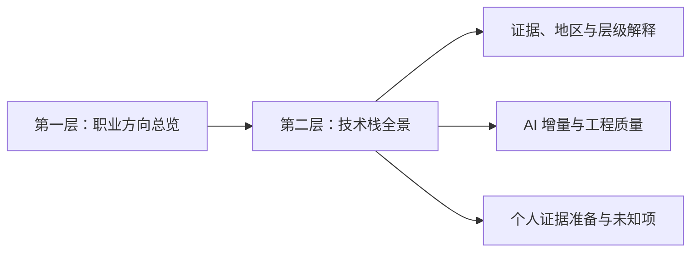
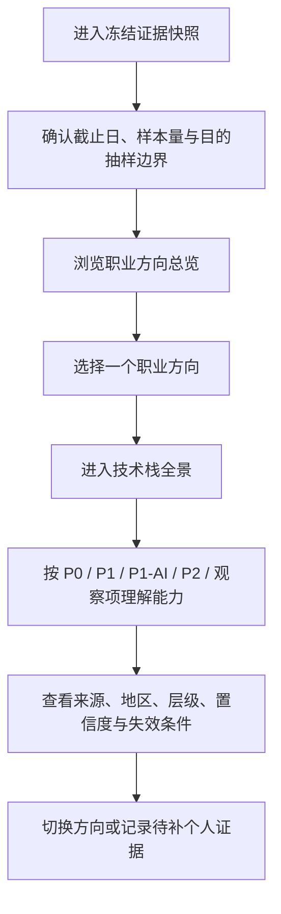
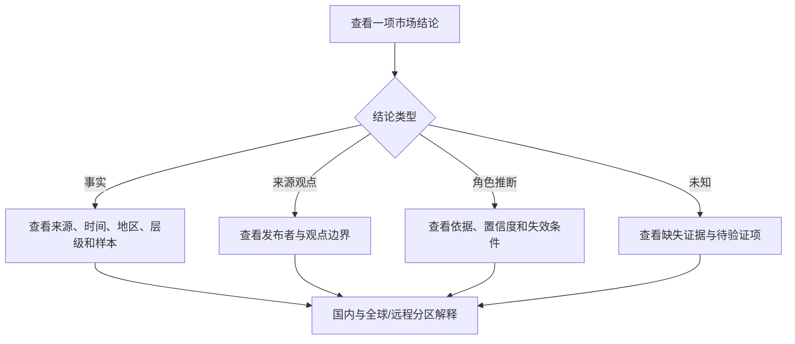
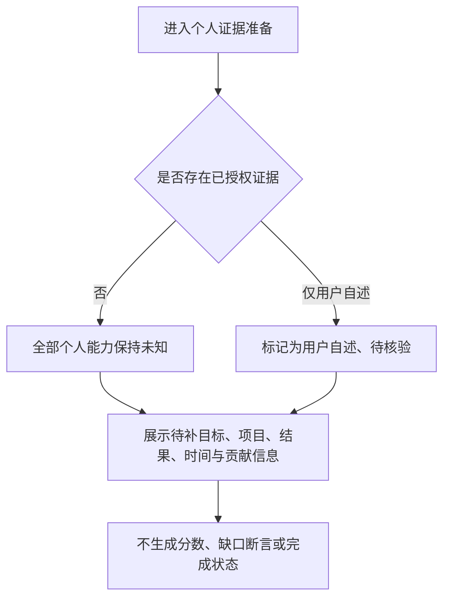
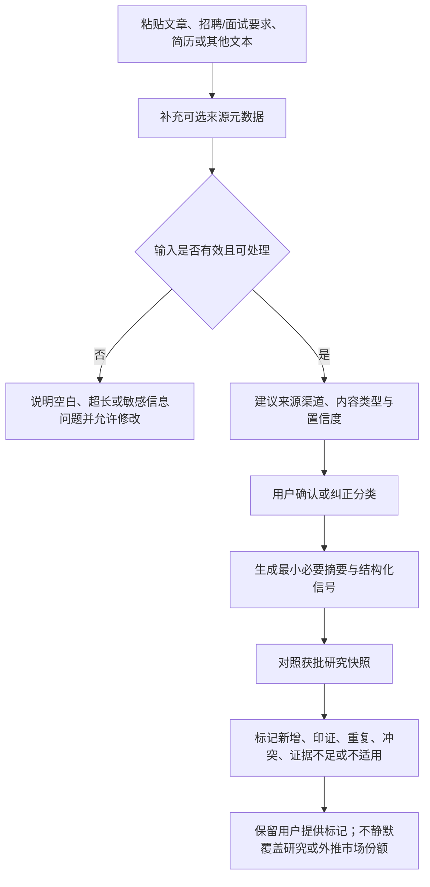

# Frontend Career Radar（前端职业成长雷达）产品需求文档

> 版本：1.3
> 日期：2026-08-14（Asia/Shanghai）
> 项目 ID：`market-analysis-dev`
> 负责角色：03 产品经理（`role-product-manager`）
> 变更编号：`prd-20260814-career-full-release-scope-001`
> 入场审批：`approval-20260814-career-release-scope-product-entry`
> 上游审批：`approval-20260804-project-plan-delivery`
> 上游市场调研：`docs/00-market-research.md` v1.0，SHA256 `79ce60b6aeb4fa227f5da02bf5d230092575340b20ae91aa95a04b18a0b33165`
> 上游项目计划：`docs/01-project-plan.md` v1.0，SHA256 `f9c5a5e2010425758c2c38e033e8ddfb7f41b28ebb593919b36d0ccf915f98d7`
> 证据截止日：2026-08-03
> 上一批准版本：`docs/02-prd.md` v1.2，SHA256 `0c2fab0bc4083dc3c16034eafcf3ce2177a5adc1c334ce548b2da5698632958f`
> 安全写入基线：`641fbe51ccc237d1716d03187c89bcf058561080`
> 原工作流返回点：`frontend-delivery-review`（含 `artifact-career-frontend-001` 与 F10 预览待审）及后端增量 `ui-prompt-review`；原门均保持冻结
> 交付状态：完整 P0 发布范围纠偏待超级无敌帅超超总审核
> 停止门：`product-release-scope-review`
> 本版修订：持续招聘／技术趋势、用户信息输入与整合、个人证据／差距／路线／未来方向／历史变化、账号与跨设备同步提升为正式发布 P0；v1.2 只读研究快照服务保留为公共研究子服务，不能代表全功能完成

## 1. 产品定位与本轮结论

### 1.1 一句话定位

Frontend Career Radar 是一个面向前端开发者的**证据型职业成长产品**：先帮助用户理解可选择的职业方向，再展开对应的技术栈全景；用户还可以主动粘贴文章、招聘／面试要求、简历等信息源，由产品分类、摘要并与既有调研证据对照，同时保留来源、日期、地区、岗位层级、样本边界、冲突和置信度。

### 1.2 本轮产品决定

1. 已完成的可浏览 Web 内容纵切与 v1.2 **只读研究快照服务**继续保留，但它们只是正式产品的子范围；静态快照、浏览器临时输入、禁用入口或空用户后端均不能代表全功能完成。
2. 信息架构前两层固定为：**职业方向总览 → 技术栈全景**。招聘证据、能力差距、学习路线和成长记录不得插入两者之间。
3. 正式发布同时使用已批准冻结研究、持续更新的合规招聘／技术趋势来源与用户主动提供的资料。所有招聘样本均须标注样本集合和方法；10 个核心岗位页及后续选择性样本都属于目的抽样，不代表市场份额、完整总体、岗位总量或薪资水平。
4. 国内招聘、全球／远程对照和 AI 增量分开表达；全球或美国信息不能替代中国市场事实。
5. 无用户个人证据时，所有个人能力、差距和建议状态均为“未知／待补充”；用户主动输入的简历或经历先标为“用户自述／待核验”，不得直接生成竞争力分数或把模型推断写成事实。
6. “用户信息源输入与研究整合”是正式发布 P0：接受用户主动粘贴的文章、招聘／面试要求、简历和经历文本及可选元数据；系统建议来源渠道与内容类型，用户确认／纠正后再摘要、提取事实并与研究和个人档案整合。
7. 用户输入不会静默覆盖获批研究。系统分别输出新增证据、相互印证、重复、冲突和证据不足，并保留“用户提供”标记；用户招聘样本仍是目的抽样，不参与市场份额估算。
8. 用户可选择“仅本次处理”或“保存到个人档案”；持久化、第三方模型处理、导出和删除必须清楚披露并由用户控制。默认不长期保存第三方完整招聘／文章正文，只保存必要元数据、最小摘要、允许的短摘录和用户确认的结构化证据；用户自己的简历／经历原文仅在明确选择保存时进入私有档案。
9. v1.2 只读研究快照服务继续只提供公共研究查询且不接收 F10／个人正文；v1.3 正式发布另需受控的用户资料、持续来源与整合能力。具体服务拆分属于后续架构，本 PRD 只冻结产品边界。

## 2. 输入、事实边界与已知限制

### 2.1 已批准输入

- 市场调研 v1.0：证据截止日 2026-08-03；核心样本 10 个，其中中国大陆一线城市 4 个、公开远程 6 个；另有 2 个 AI Native／全栈边界样本。
- 项目计划 v1.0：确定“浏览器可读内容优先，后端服务与正式部署后置”的交付策略。
- 项目治理约束：固定角色池、唯一根仓、逐站审批、UI/UX 提示词前置、生产与外部动作单独授权。

### 2.2 缺失输入

`docs/00-intake.md` 当前不存在；没有用户访谈、已提交的用户信息源、个人能力证据、目标地区／层级、时间预算、隐私授权或付费意愿数据。因此：

- 本 PRD 的用户画像是**待验证产品假设**，不是已证实的人群分布。
- 本 PRD 不判断超级无敌帅超超总或任何具体用户已经掌握、未掌握、完成或欠缺某项技能。
- 本 PRD 定义用户信息源如何输入、分类、摘要和进入对照，但没有虚构任何尚未提交的内容或整合结论。
- 本 PRD 只定义个人证据应如何分层和何时保持未知，不定义个人能力评分公式。

### 2.3 统一语义

| 标签 | 含义 | 产品规则 |
|---|---|---|
| 事实 | 来源直接支持、可核验的陈述 | 必须附来源和时间；超出来源口径的部分不得写入 |
| 来源观点 | 来源发布者的解释、预测或厂商主张 | 必须与事实分开，不转写成已证实结果 |
| 角色推断 | 基于多项证据形成的产品／研究判断 | 必须显示置信度、依据和可能失效条件 |
| 未知 | 当前证据不足或访问受限 | 不以默认值、模型猜测或空白分数替代 |
| 用户自述 | 用户自行描述的经历或熟练度 | 可记录来源为“用户自述”，不自动升级为已核验证据 |
| 可核验证据 | 项目、生产结果、测评、同行审查等可追溯材料 | 必须记录时间、版本、本人贡献和公开／保存限制 |
| 系统评估 | 按已批准规则对证据作出的结构化判断 | 必须保留规则版本和输入证据，不冒充外部事实 |
| 模型推断 | AI 根据输入生成的建议或判断 | 必须明确标识，不得写成用户已完成或已掌握的事实 |

## 3. 目标用户假设与核心场景

以下画像仅服务于 MVP 流程设计，须在 Web 内容可浏览后通过真实反馈验证。

### 3.1 画像 A：准备进入前端领域的人

- 假设年龄：20—26 岁。
- 典型身份：学生、应届生、转岗初期学习者。
- 假设痛点：面对大量框架和 AI 热点，不知道先学什么；容易把一个作品或课程完成等同于胜任力。
- 核心场景：先看可选职业方向，再按 P0 → P1 → P1-AI 理解基础与进阶顺序，并看清当前初级样本不足的限制。

### 3.2 画像 B：需要晋升或转型的中级前端

- 假设年龄：25—35 岁。
- 典型身份：有业务开发经验、希望提升工程能力或进入 AI 产品团队的前端开发者。
- 假设痛点：会多种工具但难以判断哪些能力能支持端到端交付；缺少把工作成果转成证据的方法。
- 核心场景：选择产品型前端、平台／设计系统、AI 应用、数据可视化／实时交互或全栈协作等方向，理解技术栈、工程质量和 AI 增量的关系。

### 3.3 画像 C：高级前端或技术负责人

- 假设年龄：30—42 岁。
- 典型身份：承担架构、平台、质量、带教或跨团队职责的高级从业者。
- 假设痛点：市场信息碎片化，框架热度难以映射到组织影响、质量责任和平台能力。
- 核心场景：从职业方向进入高级能力层，查看证据强弱、失效条件和组织级可验证行为，而不是只看技术名称。

### 3.4 共同待验证任务

1. 当我面对技术和岗位变化时，我想先理解职业方向，再决定学习技术，避免追逐孤立热点。
2. 当我看到市场结论时，我想知道来源、时间、地区、层级和样本边界，判断它是否适用于我的目标。
3. 当我考虑 AI 能力时，我想区分“使用工具、审核输出、构建 AI 产品”，避免用 AI 热度覆盖 Web 基础和工程质量。
4. 当我准备评估自己时，我想看见还缺哪些可核验证据；在证据不足时，系统应诚实显示未知。
5. 当我发现一篇长文章、一条招聘／面试要求或一份简历时，我想直接粘贴内容，让系统识别来源和内容类型，并告诉我它与既有调研是印证、补充、重复还是冲突。

## 4. 产品目标、成功口径与非目标

### 4.1 正式发布 P0 目标

- 让用户完成“职业方向总览 → 技术栈全景 → 市场与个人证据 → 差距与路线 → 历史变化”的端到端路径，并在登录后跨设备继续。
- 让用户能够明确区分中国样本、全球／远程对照、AI 增量、事实、推断和未知。
- 让用户建立可追溯的个人学习／成长事实档案；有证据时获得可解释差距和路线，无证据时保持未知，不生成能力分数、缺口断言或完成状态。
- 让用户通过多行文本入口主动补充文章、招聘／面试要求、简历和经历，经人工确认分类后获得摘要、证据提取、研究对照和可控的个人整合结果。
- 以合规、版本化的来源覆盖清单持续更新招聘和技术趋势，展示新增、变化、过期、来源故障与历史版本；只陈述已接入来源样本，不声称全市场覆盖。
- 让账号、个人档案、保存／导出／删除、跨设备同步、可恢复错误和可观测服务成为正式产品能力，而不是后置假设。

### 4.2 正式发布成功口径

1. 前两层顺序在所有入口与核心流程中保持为“职业方向总览 → 技术栈全景”。
2. 100% 的 P0 市场结论具有事实类型、来源或明确未知状态，并显示适用地区／层级与证据截止日。
3. 所有招聘频次都明确限定为“本次目的抽样样本内计数”；市场份额式表达数量为 0。
4. 国内与全球／远程证据混用导致的无标签结论数量为 0。
5. 无个人证据时，个人分数、能力缺口断言和“已掌握／已完成”陈述数量为 0。
6. 公共研究快照可在服务短暂不可用时受控降级阅读；持续更新、个人档案、整合和同步不可用时必须明确标记，不能把静态回退称为全功能可用。
7. 核心路径不存在阻断性的键盘、焦点、标题结构或非文本内容问题；正式“完全合规”结论须待后续独立审计。
8. 每条用户输入都保留“用户提供”身份、来源渠道、内容类型、处理状态和整合关系；自动分类可由用户纠正，纠正前不作永久合并。
9. 用户输入形成的招聘计数只在“用户提供的目的样本”内表达，不进入已批准研究样本的市场份额或总体推断。
10. 所有启用来源具有权利状态、地区、内容类型、刷新节奏、最近成功时间和失败状态；无来源依据的正式市场事实数量为 0。
11. 个人差距、路线和未来方向中的每项结论都能回溯到用户确认事实、市场证据或明确标注的系统推断；无法确认时显示未知。
12. 保存的个人数据可跨设备恢复、完整导出并按用户请求删除；跨账号泄露、静默保存和删除后仍可正常访问的记录均为 0。

### 4.3 正式发布 P0 非目标

- 全网、全行业或实时无遗漏覆盖；产品只承诺版本化允许来源清单及其可观测刷新，不估算市场份额。
- 自动抓取任意用户粘贴 URL、绕过访问限制、登录第三方账号或未经批准接入 GitHub／学习平台；用户主动粘贴文本仍是 P0。
- 无证据的自动能力评分、求职成功预测、薪资预测、人格判断或岗位替代率；个性化差距与路线必须基于确认事实并可解释。
- 自动替用户确认简历事实、证书、项目成果或掌握程度；系统建议必须等待人工确认。
- 选择本项目的前端框架、后端语言、数据库、图表库、云平台或部署方案。
- UI 提示词、视觉设计、原型、颜色、字体、布局细节或界面实现。
- 复制或长期保存受版权保护的完整职位正文，或绕过登录、验证码、robots、API、付费和反爬限制。
- 根据一份简历自动作出录用、薪资、人格、胜任力或求职成功率判断。

## 5. 信息架构与内容优先级

### 5.1 固定前两层

业务规则：

- 任一主入口先进入职业方向总览；用户选择或查看方向后进入技术栈全景。
- 招聘列表、学习计划、成长记录、个人评分或其他模块不得成为第二层之前的主路径。
- 证据、地区／层级、AI 增量和个人证据属于第二层之后的解释与行动信息，不改变固定顺序。

### 5.2 第一层：职业方向总览

MVP 覆盖以下研究方向：

1. 产品型前端／应用工程；
2. 前端平台／设计系统／开发者体验；
3. AI 应用前端／AI 产品工程；
4. 数据可视化／实时交互；
5. 跨端／桌面／移动；
6. 全栈产品协作；
7. Web 质量工程（性能、可访问性、安全）；
8. UX Engineering／设计开发融合。

每个方向至少包含：方向定义、用户价值、适用层级、市场证据信号、主要能力域、置信度、已知限制、失效条件和进入技术栈全景的关联。

### 5.3 第二层：技术栈全景

能力按研究优先级组织：

- P0 核心必备：Web 平台、JavaScript／TypeScript、一个主框架、Git／API／调试与协作。
- P1 就业增强：测试、性能、可访问性、安全、构建与依赖、CI/CD、可观测性、设计系统与基础全栈协作。
- P1-AI 增量：模型接口基础、AI 交互状态、评估与安全、AI 辅助研发的审核责任。
- P2 专项：数据可视化／实时、跨端、大规模前端、云与交付等按方向深入的能力。
- 观察项：WebGPU、WASM、本地 AI、WebNN、生成式 UI、MCP／代理协议等证据不足的前沿主题。

技术栈全景描述“市场和职业能力”，不决定本产品自身的实现技术栈。

## 6. 功能范围与优先级

| ID | 模块 | 功能 | 优先级 | MVP |
|---|---|---|---|---|
| F01 | 证据快照 | 显示版本、截止日、目的抽样、样本量和主要覆盖缺口 | P0 | 是 |
| F02 | 职业方向 | 浏览方向总览、适用层级、价值、证据信号和失效条件 | P0 | 是 |
| F03 | 技术全景 | 按 P0/P1/P1-AI/P2/观察项浏览能力域 | P0 | 是 |
| F04 | 方向映射 | 从任一职业方向进入关联技术栈，并保留方向语境 | P0 | 是 |
| F05 | 证据追溯 | 查看来源、时间、地区、层级、样本、类型、置信度和访问限制 | P0 | 是 |
| F06 | 地区对照 | 分开展示国内招聘、全球／远程对照和边界样本 | P0 | 是 |
| F07 | AI 增量 | 区分 AI 工具使用、AI 输出审核、AI 产品构建三类信号 | P0 | 是 |
| F08 | 个人证据准备 | 显示待补证据清单、证据等级和“未知”空状态 | P0 | 是 |
| F09 | 可访问阅读 | 键盘、焦点、语义层级、文本替代及非颜色唯一表达 | P0 | 是 |
| F10 | 用户信息源输入与整合 | 粘贴文本、建议分类、人工确认、摘要并与既有调研对照 | P0 | 是；首个只读切片后独立交付 |
| F11 | 内容反馈 | 对方向、技术栈和证据解释提交结构化反馈 | P1 | 否；首版可由人工访谈代替 |
| F12 | 个人证据档案 | 用户自述与可核验证据的持久编辑、确认、删除和历史管理 | P0 | 是；正式发布必需 |
| F13 | 个性化差距与路线 | 基于已授权个人证据生成可解释的差距、学习路线和未来方向 | P0 | 是；未知不强推 |
| F14 | 连续市场更新 | 合法来源清单、招聘／技术趋势采集、去重、过期和历史序列 | P0 | 是；正式发布必需 |
| F15 | 账号与同步 | 独立账号、跨设备保存、导出、删除和审计 | P0 | 是；正式发布必需 |
| F16 | 正式发布 | 生产部署、域名、监控、回滚和公开访问 | P2 | 否；需具体高风险授权 |
| F17 | 只读研究快照服务 | 健康／就绪、版本化快照、方向、能力、声明与证据元数据查询 | P0 | 是；v1.2 后端 MVP |

## 7. P0 功能详细需求

### F01 证据快照与范围声明

- **功能描述**：在核心内容入口和证据上下文中说明当前内容基于 2026-08-03 的获批研究快照。
- **输入**：研究版本、截止日、10 个核心样本、4 个中国样本、6 个公开远程样本、2 个边界样本及已知限制。
- **输出**：版本、截止日、目的抽样声明、样本结构、地域／层级缺口和“非市场份额”说明。
- **业务规则**：采集日不得冒充发布日期；没有发布日期的来源明确写“未披露”；样本计数只能描述本样本，不外推总体。
- **正常流程**：用户进入产品即可理解内容时效和统计边界，再浏览方向。
- **异常流程**：若某来源无法访问，保留最后核验日、最小事实摘要和不可用状态；不删除范围声明。
- **边界情况**：更新研究快照时必须形成新版本并更新证据截止日；旧版本不能静默覆盖。

### F02 职业方向总览

- **功能描述**：以第一层信息架构展示 8 类职业方向，帮助用户先选“向哪里发展”。
- **输入**：获批研究中的方向、适用层级、证据信号、置信度和反证。
- **输出**：方向定义、主要价值、适用层级、核心能力域、证据强度、限制和失效条件。
- **业务规则**：方向是职业路径假设，不是岗位数量排名；不按热度生成“最佳方向”；不同方向允许共享能力。
- **正常流程**：用户阅读多个方向，选择一个方向进入关联技术栈全景。
- **异常流程**：方向证据不足时显示较低置信度和待验证项，而不是隐藏或强行排序。
- **边界情况**：用户未选择方向时仍可浏览完整方向列表；不自动推断适合方向。

### F03 技术栈全景

- **功能描述**：作为第二层信息架构，按 P0、P1、P1-AI、P2 和观察项呈现能力全景。
- **输入**：获批研究的能力矩阵、层级行为和优先级解释。
- **输出**：能力域、建议知识、适用方向、适用层级、证据信号、优先级、置信度和边界。
- **业务规则**：React／Vue 等内容是职业市场能力，不是本项目技术选型；P1-AI 不得置于 P0 之前；观察项不得冒充通用必备。
- **正常流程**：用户从方向进入技术全景，理解基础、增强、AI 增量和专项能力之间的先后关系。
- **异常流程**：目标地区或层级未知时显示通用市场基线，并提示结果尚未个性化。
- **边界情况**：一项能力可属于多个方向；不得因多重归属重复计为多个独立市场信号。

### F04 方向—技术栈映射

- **功能描述**：把第一层方向与第二层能力连接起来，使用户知道某方向为什么需要这些能力。
- **输入**：方向 ID、能力域、优先级和关联理由。
- **输出**：当前方向下的 P0 基础、P1 增强、P1-AI 增量、P2 专项和观察项。
- **业务规则**：映射只说明研究建议，不表示用户已具备或必须一次学完；用户可切换方向并比较共同底座和差异能力。
- **正常流程**：选择方向 → 进入技术全景 → 查看能力与证据 → 返回或切换方向。
- **异常流程**：某方向缺少直接招聘证据时，显示证据缺口和相邻来源，不用模型补造频次。
- **边界情况**：切换方向不能丢失证据截止日和范围声明。

### F05 证据追溯与事实／推断分离

- **功能描述**：每个关键结论可追溯到证据或明确的推断／未知状态。
- **输入**：来源链接、来源类型、发布日期／采集日、地区、岗位层级、样本量、标签、置信度、访问限制和失效条件。
- **输出**：可阅读的证据说明与来源跳转。
- **业务规则**：关键结论必须属于事实、来源观点、角色推断或未知之一；角色推断不能没有依据或置信度；不复制完整职位正文。
- **正常流程**：用户从方向或能力结论查看证据详情，再返回原上下文。
- **异常流程**：外链失效时标记“当前不可访问”，保留最后核验时间和结论边界；不把链接失败写成岗位已关闭。
- **边界情况**：来源之间冲突时并列展示，不通过平均或单一分数隐藏冲突。

### F06 国内招聘与全球／远程对照

- **功能描述**：让用户比较不同地区证据，但不互相替代。
- **输入**：中国样本、全球／美国趋势、公开远程岗位和边界岗位。
- **输出**：地区、层级、工作许可／时区限制、样本量和可比较／不可比较说明。
- **业务规则**：中国样本仅覆盖北京、上海、深圳；“远程”不等于全球任意地点可申请；美国职业数据不能写成中国岗位事实。
- **正常流程**：用户分别阅读国内基线与全球／远程对照，再查看共同和差异信号。
- **异常流程**：某地区无有效样本时显示“当前样本不足”，不显示 0% 或“不需要”。
- **边界情况**：一个岗位同时具有地区和远程限制时，两类信息都必须保留。

### F07 AI 增量能力

- **功能描述**：在 Web 基础和工程质量之后，解释 AI 对前端职责的增量。
- **输入**：核心样本和边界样本中的 AI 信号，以及已批准的研究反证。
- **输出**：AI 工具使用、AI 输出审核、AI 产品构建三类能力及其适用场景、证据和限制。
- **业务规则**：AI 使用率不等于岗位替代率；生成速度不等于交付效率；P1-AI 不能覆盖 P0/P1；模型或工具品牌不是永久能力指标。
- **正常流程**：用户在技术全景中查看 AI 增量，理解流式状态、工具审批、评估、安全和审核责任等职业能力。
- **异常流程**：岗位只把 AI 列为加分项时必须标为加分，不升级为硬门槛。
- **边界情况**：AI 证据集中于特定公司或相邻岗位时，显示专项适用性，不泛化到所有前端岗位。

### F08 个人证据准备与未知状态

- **功能描述**：说明形成个人能力判断前需要哪些证据；F10 可以接收用户主动粘贴的个人材料，v1.2 预览只留当前会话，v1.3 正式范围允许用户明确选择保存到私有档案；任何模式都不得在证据不足时生成能力结论。
- **输入**：待用户后续提供的目标、地区／层级、年限、主栈、项目、生产结果、测评、同行评价、时间预算和授权边界。
- **输出**：个人证据清单、证据等级、缺失状态和隐私提示。
- **业务规则**：用户自述、可核验证据、系统评估和模型推断分开；阅读／收藏、练习、独立项目、生产结果、同行审查不互相等价；无证据时只显示未知。
- **正常流程**：用户查看待补证据清单，理解后续需要提供什么以及系统尚不能判断什么。
- **异常流程**：若用户只提供自述，状态显示“用户自述、待核验”，不生成已掌握结论。
- **边界情况**：涉及雇主机密、个人隐私或不可公开材料时，提示删除非必要信息并记录可否使用和公开限制；首版不要求文件上传或外部账号接入。

### F09 可访问阅读与异常状态

- **功能描述**：确保核心内容在键盘、辅助技术和非视觉场景下仍可理解。
- **输入**：职业方向、技术栈、证据、状态和任何后续图表化内容。
- **输出**：语义化内容顺序、清晰标题、可见焦点、键盘可达操作、文本替代、状态文本和错误说明。
- **业务规则**：状态不能只依赖颜色；任何图形化信息必须提供等价文本或表格；链接名称必须能说明目的；“完全符合 WCAG 2.2”只能在正式审计后声明。
- **正常流程**：用户只用键盘即可完成方向 → 技术全景 → 证据详情 → 返回的核心路径。
- **异常流程**：外链、内容或数据不可用时，错误信息解释发生了什么、仍可阅读什么和下一步是什么。
- **边界情况**：窄屏、放大、长文本、长链接和中英文混排不能导致核心信息丢失；具体视觉处理由 UI/UX 定义。

### F10 用户信息源输入、分类与研究整合

- **功能描述**：提供一个可直接粘贴长文本的输入入口，接收文章、招聘信息、面试要求／经验、简历／个人经历、项目材料或其他用户发现的信息；系统先给出分类建议和摘要，再由用户确认是否与既有调研对照。
- **交付顺序**：F10 历史预览作为首个只读 Web 内容切片之后的独立交互切片已形成；v1.3 正式发布须进一步完成账号、私有保存、持续来源和整合联调。生产部署仍需在全部 P0 完成后单独授权。
- **必填输入**：正文文本，去除首尾空白后长度为 1—100,000 个 Unicode 字符。
- **可选输入**：标题、原始网址、来源平台／发布方、作者、发布日期、采集日期、地区、岗位层级和用户备注。只提交网址而没有正文时，产品提示用户粘贴可处理内容，不自动抓取网址。
- **来源渠道分类**：搜索引擎结果、公司／机构官方来源、招聘平台／ATS、媒体／长文平台、政府／标准／研究机构、社区／社交平台、用户简历／个人材料、其他、未知。
- **内容类型分类**：行业／技术文章、招聘职位、面试要求、面试经验、简历／个人证据、项目／案例、学习资料、其他、未知。来源渠道与内容类型是两条独立轴；例如“BOSS 上的面试经验”可同时标为“招聘平台／ATS + 面试经验”。
- **分类规则**：系统给出建议分类、置信度和识别依据；置信度不足、多个分类同时成立或元数据缺失时显示候选项／未知，不强行唯一归类。用户可确认、纠正或补充，纠正后的值用于本次整合并保留“用户确认”状态。
- **摘要输出**：生成最小必要摘要、关键主张／要求、技术与能力信号、地区、层级、时间、来源限制和待核验项；不得以摘要名义大段复现受版权保护的原文。
- **整合输出**：逐项对照当前获批研究快照，标记为“新增证据、相互印证、重复、冲突、证据不足、不适用”之一，并说明对应研究结论、依据、置信度和可能影响；不直接改写获批研究原文。
- **招聘样本规则**：用户输入的招聘／面试材料进入独立的“用户提供目的样本”集合；必须保留来源、日期、地区、层级和样本量，不与既有 10 个核心样本静默相加，不形成市场份额或完整总体结论。
- **个人材料规则**：简历、经历和项目材料先标为“用户自述／用户提供，待核验”；可核验链接或结果也须保留本人贡献、时间、版本和使用限制。输入一份简历不等于系统已确认用户掌握某项能力。
- **敏感信息规则**：检测到姓名、联系方式、证件、地址、雇主机密或其他可能的个人／敏感信息时，在处理前提醒用户删除非必要内容并再次确认；v1.2 预览默认不持久保存输入正文和结果，v1.3 只有在用户选择保存后进入私有档案。跨设备同步按已保存范围执行；向第三方模型传输仍须单独披露并取得明确选择。
- **权利规则**：用户提交前确认其有权提供内容用于个人研究；产品不因用户提供文本而获得再发布权，不尝试绕过原来源的登录、付费、robots、API 或反爬限制。
- **正常流程**：粘贴正文 → 可选补充来源 → 提交 → 查看分类建议和敏感／权利提示 → 确认或纠正 → 生成摘要 → 查看与既有研究的印证、补充、重复、冲突或不足 → 选择仅留当前会话、保存到私有档案、修改后重试或删除。
- **异常流程**：空文本不可提交；超长内容提示拆分；处理失败时保留用户尚未离开的输入并给出重试／复制回退；无法分类时归为未知并允许人工选择；与研究冲突时并列呈现，不自动裁定任一方为真。
- **状态**：空白、编辑中、待确认分类、敏感信息待确认、处理中、处理成功、部分成功、重复、冲突、失败、已删除。状态必须有文本说明，不能只用颜色或动效表达。
- **编辑与撤销**：提交前可编辑；生成结果后可修改原文或元数据并重新处理。重新处理形成新结果并标记旧结果已被替代；用户可删除当前会话或私有档案中的输入和结果，不得留下仍参与对照的隐形副本；删除已用于差距／路线的证据后触发可解释重算。
- **键盘、移动端与无障碍**：多行输入、元数据、确认、取消、重试和删除均可用键盘操作；处理状态以可被辅助技术感知的方式更新；错误与提示关联到对应字段；移动端长文本输入不遮挡提交和取消操作。具体布局和视觉样式由 UI/UX 阶段定义。

## 8. 核心用户流程

### 8.1 浏览职业方向与技术全景

### 8.2 查看证据与地区边界

### 8.3 个人证据为空时

### 8.4 输入信息源并与研究整合

## 9. 验收标准（Given-When-Then）

### 9.1 信息架构与内容

- **AC-01**：Given 用户从任一主入口进入，When 开始核心浏览，Then 第一业务层必须是职业方向总览，第二业务层必须是技术栈全景，两者之间没有招聘、学习计划或成长记录主模块。
- **AC-02**：Given 用户选择任一职业方向，When 进入下一层，Then 能看到该方向关联的 P0、P1、P1-AI、P2 和观察项，并能返回或切换方向。
- **AC-03**：Given 用户没有选择职业方向，When 浏览第一层，Then 仍能查看全部 8 类方向，且产品不自动声称某方向最适合用户。
- **AC-04**：Given 用户查看技术全景，When 看到 React、Vue、TypeScript 或其他技术，Then 文案明确它们是职业市场能力内容，而不是本产品的实现技术选型。

### 9.2 样本、地区与事实边界

- **AC-05**：Given 用户查看任何核心市场结论，When 阅读证据说明，Then 能看到证据截止日 2026-08-03、结论标签、来源或未知状态、适用地区／层级和样本边界。
- **AC-06**：Given 页面出现 9/10、8/10 或其他招聘频次，When 用户阅读该数字，Then 同一上下文明确写明它是本次目的抽样样本内计数，不是市场份额或完整总体。
- **AC-07**：Given 用户查看中国证据，When 阅读覆盖说明，Then 能看到核心样本仅覆盖北京、上海、深圳 4 个岗位页，新一线和全国结论保持未知。
- **AC-08**：Given 用户查看全球／远程证据，When 阅读岗位信息，Then 能看到国家、地区、时区、工作许可或未披露限制，不出现“全球任意地点可申请”的推断。
- **AC-09**：Given 某来源没有发布日期，When 展示时间，Then 显示“发布日期未披露”和采集日，不用采集日替代发布日期。
- **AC-10**：Given 某地区当前无有效样本，When 用户筛选该地区，Then 显示“样本不足／未知”，不显示 0% 或“不需要该能力”。

### 9.3 AI 增量

- **AC-11**：Given 用户查看 AI 能力，When 展开该模块，Then 能区分 AI 工具使用、AI 输出审核和 AI 产品构建三类信号。
- **AC-12**：Given 某岗位仅把 AI 能力列为加分项，When 呈现岗位信号，Then 不把它标为硬性要求。
- **AC-13**：Given 用户查看 P1-AI，When 比较学习顺序，Then 产品明确 P0 Web／TypeScript／主框架与 P1 工程质量优先，AI 增量不能替代基础。
- **AC-14**：Given 用户阅读 AI 影响，When 查看结论，Then 不出现未经证据支持的岗位替代率、保证提效或“前端即将消失”等断言。

### 9.4 个人证据与推断

- **AC-15**：Given 用户尚未提供个人证据，When 进入个人证据准备，Then 所有个人能力保持“未知／待补充”，个人分数和缺口断言均不存在。
- **AC-16**：Given 用户只提供自述或简历文本，When 系统显示该信息，Then 明确标为“用户自述／用户提供、待核验”，不升级为已掌握事实。
- **AC-17**：Given 一项个人证据可使用，When 后续登记该证据，Then 必须能区分时间、技术版本、本人贡献、证据等级和公开／保存限制。
- **AC-18**：Given 存在模型生成建议，When 用户阅读建议，Then 它必须标为模型推断，并能追溯到输入证据；不得写成用户已完成、已学习或已掌握。

### 9.5 来源、权利与异常

- **AC-19**：Given 用户查看外部来源，When 打开证据说明，Then 能看到来源类型、访问限制和最后核验时间；产品不复制完整职位正文。
- **AC-20**：Given 外部来源链接失效，When 用户查看相关结论，Then 核心内容仍可阅读，并显示“当前不可访问”和最后核验信息；不自动判定岗位关闭。
- **AC-21**：Given 来源需要登录、验证码、付费、受限 API 或 robots 不允许，When MVP 运行，Then 该来源不成为运行依赖，产品不尝试绕过限制。
- **AC-22**：Given 多个来源对同一结论冲突，When 用户查看证据，Then 冲突并列显示，不通过单一分数隐藏。

### 9.6 可访问性与基本质量

- **AC-23**：Given 用户只使用键盘，When 完成方向 → 技术全景 → 证据详情 → 返回，Then 所有必要操作可达、焦点可见且顺序符合内容逻辑。
- **AC-24**：Given 内容以后以图表或图形呈现，When 辅助技术读取，Then 存在等价文本或表格，状态信息不只依赖颜色。
- **AC-25**：Given 页面处于窄屏、放大或长文本状态，When 用户阅读核心内容，Then 结论、标签、来源和操作不会被截断为不可访问状态。
- **AC-26**：Given 项目尚未经过正式可访问性审计，When 对外交付，Then 不得声称“完全符合 WCAG 2.2”，只报告已实际完成的检查。

### 9.7 MVP 技术边界

- **AC-27**：Given 后端服务不存在或不可用，When 用户打开 MVP，Then 所有 P0 核心内容仍可完整阅读。
- **AC-28**：Given MVP 运行，When 检查网络与数据行为，Then 浏览核心内容不需要登录、文件上传、自动招聘采集或受限来源访问；F10 只接收用户主动粘贴的文本和可选元数据。
- **AC-29**：Given 首个 Web 切片完成，When 团队报告结果，Then 只能称为“可浏览预览／内容切片”，除非另有正式生产发布审批和验证，不得称为已上线。
- **AC-30**：Given v1.3 已批准持久档案、账号和持续来源的产品范围，When 准备具体 UI、架构或实现，Then 仍须进入对应下游审核门；第三方模型传输、生产发布、付费或对外发送继续要求具体授权，不得由文本输入范围自动取得。

### 9.8 用户信息源输入与研究整合

- **AC-31**：Given 输入区为空或只有空白，When 用户尝试提交，Then 系统不开始处理，并用与输入字段关联的文字说明要求粘贴正文。
- **AC-32**：Given 用户粘贴 1—100,000 个 Unicode 字符，When 提交内容，Then 系统接受正文；超过上限时不截断原文，而是说明上限并提示拆分后重试。
- **AC-33**：Given 用户只输入网址且没有正文，When 提交，Then 系统提示粘贴可处理文本，不自动访问、抓取或绕过该网址的限制。
- **AC-34**：Given 一条有效输入，When 分类完成，Then 结果同时包含“来源渠道”和“内容类型”、各自置信度及识别依据；无法判断时显示未知或候选项，不伪造确定分类。
- **AC-35**：Given 系统建议的分类不正确或不完整，When 用户纠正来源平台、渠道或内容类型，Then 本次摘要和研究对照使用修正值，并显示该值已经用户确认。
- **AC-36**：Given 输入为文章、招聘／面试材料或项目内容，When 生成摘要，Then 输出最小必要摘要、关键主张／要求、技术与能力信号、时间、地区／层级、来源限制和待核验项；事实、来源观点、系统提取和模型推断可以区分。
- **AC-37**：Given 输入与获批研究存在关系，When 完成对照，Then 每个关键关系只标记为新增证据、相互印证、重复、冲突、证据不足或不适用之一，并能看到对应研究结论和理由。
- **AC-38**：Given 输入与获批研究冲突，When 用户查看结果，Then 两方内容和来源边界并列呈现；系统不静默覆盖研究，也不只保留一个综合分数。
- **AC-39**：Given 输入属于招聘职位、面试要求或招聘平台内容，When 进入对照，Then 它被标为“用户提供目的样本”，保留来源、日期、地区、层级和样本数，不与既有 10 个核心样本静默相加，也不生成市场份额。
- **AC-40**：Given 输入为简历或检测到可能的个人／敏感信息，When 开始处理前，Then 系统提示最小化与删除非必要信息，并要求用户再次确认；处理结果仍标为用户自述／待核验。
- **AC-41**：Given 首个交互切片没有长期保存授权，When 用户完成、取消或删除一次处理，Then 输入正文和结果不进入持久个人档案；任何第三方模型传输若未披露并获单独明确授权，则不得发生。
- **AC-42**：Given 输入可能受版权或平台限制，When 用户提交，Then 产品要求确认有权用于个人研究；结果不大段复现原文，也不把输入行为解释为再发布授权。
- **AC-43**：Given 处理失败、部分成功、重复或用户修改原文，When 状态变化，Then 用户可以读取失败／差异原因并执行重试、重新处理、复制回退或删除；旧结果不再隐形参与对照。
- **AC-44**：Given 用户仅使用键盘、辅助技术或移动设备，When 完成输入、分类确认、处理、查看结果和删除，Then 必要操作可达、焦点顺序合理、状态更新可感知、错误关联到字段，且长文本不会遮挡提交或取消入口。

## 10. 非功能需求

### 10.1 内容完整性与可追溯性

- 100% P0 市场结论具有事实类型；事实和来源观点具有来源，角色推断具有依据、置信度与失效条件，未知具有缺失原因。
- 100% 招聘样本展示地区、岗位层级、发布日期或“未披露”、采集日和访问限制。
- 内容版本、证据截止日和研究快照 SHA 可追溯；内容更新不得静默覆盖审核中的版本。

### 10.2 可访问性

- 以 WCAG 2.2 为设计与 QA 参考基线。
- 核心路径必须通过键盘操作、焦点检查、标题结构检查、链接目的检查和非颜色唯一编码检查。
- 图表化内容必须有等价文本或表格；任何自动化检查不能替代人工键盘和辅助技术检查。

### 10.3 性能与可靠性

- 在后续架构定义的标准测试环境中，核心首屏文本目标在 2.5 秒内可阅读；若无法达到，必须报告实际结果和原因，不得伪造通过。
- 公共研究基线可在后端或外部来源短暂不可用时从上一已核验快照受控阅读；持续更新、个人档案、整合与同步必须真实联调，不能由静态回退替代。
- 单个外链失效、加载超时或内容下架不得造成核心页面不可用。
- F10 处理超时、失败或暂不可用时不得清空用户尚未离开的输入；必须提供明确状态和可恢复操作。具体时延目标在架构与真实容量基线形成后冻结，PRD 不虚构未验证性能数字。

### 10.4 兼容性

- 正式 QA 至少覆盖 Chrome、Edge、Firefox、Safari 的最新两个主要版本；移动和桌面浏览均须验证核心阅读路径。
- 不以某一浏览器专属能力作为核心内容的唯一访问方式。

### 10.5 隐私、安全与数据权利

- 游客浏览公共内容不要求账号或真实个人数据；保存个人档案、跨设备同步、导出和删除要求登录且只处理用户主动提供或确认的内容。简历等敏感内容提交前提供最小化提示和再次确认。
- v1.2 预览默认不持久保存；v1.3 由用户选择仅本次处理或保存到私有档案。取消、删除或会话结束后的保留语义必须可验证，不得用隐藏副本继续参与对照。
- 在向任何第三方模型或外部服务传输用户输入前，必须披露接收方、用途、保存／训练边界和撤回方式，并取得单独明确授权；未获授权时不得传输。
- 产品不执行求职申请提交、受限 API、第三方登录自动化或绕过访问限制；v1.3 获准的私有个人数据写入仅用于用户明确选择的保存、同步、导出和删除。
- 来源内容坚持最小必要引用和事实摘要，不复制完整职位正文；生产采集前须逐源复核版权、条款、robots、API、登录、速率和保存边界。
- v1.3 长期个人档案必须具备用途限定、显式选择、最小采集、可撤销、可导出、可删除和审计；具体实现仍须通过 UI、架构、任务与开发审核，第三方传输和生产部署另行授权。

## 11. 产品数据与内容字段

### 11.1 职业方向

- `direction_id`
- 方向名称与定义
- 主要用户价值
- 适用层级
- 核心能力域
- 市场证据信号
- 事实类型与置信度
- 已知限制与失效条件
- 关联技术栈能力 ID

### 11.2 技术／能力项

- `capability_id` 与规范名称
- 别名、父子关系和适用版本（如适用）
- 优先级：P0／P1／P1-AI／P2／观察项
- 适用方向与层级
- 可验证行为
- 招聘或外部证据信号
- 事实类型、置信度、反证和未知项

### 11.3 招聘证据

- 来源名称、类型与直接链接
- 发布日期或“未披露”
- 采集日／最后核验日
- 地区、远程范围、岗位层级
- “必须／优先／加分／职责”分类
- 样本组与唯一页面计数
- 访问、版权、robots、API、登录和保存限制
- 最小事实摘要，不保存完整职位正文

### 11.4 个人证据准备项

- 目标：求职／晋升／转型／团队培养／长期趋势观察
- 目标地区、行业、公司类型、岗位层级和时间窗口
- 用户自述年限、主技术栈和熟练度
- 可核验证据类型、时间、版本、本人贡献和结果
- 证据等级：阅读／收藏、练习、独立项目、生产结果、同行审查
- 公开、保存、删除和 AI 评估授权边界
- 当前状态：未知／用户自述／已提供待核验／已核验／系统评估／模型推断

v1.3 正式发布允许用户将确认后的个人材料保存到私有档案；未确认内容保持“用户自述／待核验”，不得转为已掌握事实。v1.2 浏览器预览仍可仅在当前会话运行，但不能作为完整个人档案能力的完成证据。

### 11.5 用户信息源输入与整合结果

- `user_source_id`：当前会话内唯一标识
- 正文、标题、原始网址和用户备注
- 来源平台／发布方、作者、发布日期、采集日期
- 来源渠道、内容类型、分类置信度、识别依据和用户确认状态
- 地区、岗位层级、技术／能力信号、关键主张／要求和待核验项
- 内容语义：来源事实／来源观点／系统提取／模型推断／未知
- 敏感信息提示状态、用户确认状态、公开／保存／处理限制
- 与研究的关系：新增证据／相互印证／重复／冲突／证据不足／不适用
- 对应研究结论 ID、关系理由、置信度和可能影响
- 处理状态、错误原因、处理时间、重试／替代关系和删除状态
- 样本集合：用户提供目的样本；不得默认并入已批准研究样本

## 12. 内容反馈与验证计划

首个可浏览 Web 内容形成后，建议由后续项目管理或研究工作单独组织验证；本 PRD 不把尚未执行的验证写成成功：

1. 至少覆盖画像 A、B、C 的代表性用户或代理评审者，验证“职业方向 → 技术栈”顺序是否符合决策习惯。
2. 记录用户能否解释目的抽样、国内／全球边界和 AI 三类信号。
3. 记录用户是否误把市场基线当个人诊断；任何误读都进入文案或结构修订。
4. 用文章、招聘要求、面试经验和脱敏简历等代表性文本验证输入上限、双轴分类、人工纠正、摘要、冲突展示和删除流程。
5. 收集用户愿意提供的个人证据类型与隐私边界，不默认要求连接外部账号或长期保存。
6. 在形成有效访谈或行为样本前，不设置留存率、付费率或个性化效果目标。

## 13. 依赖、风险与应对

| 风险 | 产品影响 | 当前应对 |
|---|---|---|
| 目的抽样被误读为市场份额 | 误导职业决策 | 每个频次同上下文显示样本量、抽样性质和不可外推声明 |
| 中国样本与初级样本不足 | 方向与层级判断偏差 | 限定北京／上海／深圳和样本层级；其他地区保持未知 |
| 全球／远程证据替代中国事实 | 地区误导 | 独立分区，保留国家、时区、工作许可和口径 |
| AI 热度覆盖基础工程 | 学习顺序失真 | P1-AI 固定在 P0/P1 之后，三类 AI 信号分开 |
| 个人推断冒充事实 | 错误能力判断 | 自述、证据、评估和推断分层；无证据保持未知 |
| 来源下架或缺日期 | 证据不可复核 | 保存最小事实摘要、链接、最后核验时间和不可用状态 |
| 版权／robots／API／登录限制 | 合规与可用性风险 | 逐源登记允许用途与保存边界；受限来源不启用，不绕过限制 |
| 为追求 Web 预览跳过审核门 | 返工与治理失效 | 本 PRD 完成后停在 `product-release-scope-review`；不得自动启动 UI/UX、架构或开发 |
| 数据可视化牺牲可访问性 | 部分用户无法使用 | 要求等价文本／表格、键盘、焦点和非颜色唯一表达 |
| 用户目标和个人事实缺失 | 无法验证个性化价值 | 保持未知并引导用户确认；不得生成假差距、假路线或假完成 |
| 自动分类把来源渠道与内容类型混为一谈 | 搜索结果、招聘平台和文章属性被错误使用 | 采用双轴分类、显示置信度和依据，并允许用户确认或纠正 |
| 用户输入静默覆盖获批研究 | 审核链和证据边界失真 | 用户输入独立保存为用户证据集合；只显示整合关系，不直接改写获批研究 |
| 用户提供招聘样本被误算为市场份额 | 扩大样本后产生伪精确结论 | 保留“用户提供目的样本”集合、来源和样本量，不与核心样本静默相加 |
| 长文章或重复内容导致处理失败／浪费 | 用户丢失输入或获得重复结论 | 明示 100,000 字符上限、重复状态、拆分建议、可恢复重试和重新处理 |
| 简历、联系方式或雇主机密泄露 | 隐私、职业与合规风险 | 处理前最小化提示；原文保存和第三方处理分别确认；支持导出与删除 |
| 用户粘贴受版权或平台限制的全文 | 再发布与数据权利风险 | 仅作个人研究摘要，不大段复现；用户确认提供权利，不绕过原平台限制 |

## 14. 待超级无敌帅超超总补充的输入

以下输入不是批准本 PRD 的前置条件。F10 实现并经过相应隐私／处理授权后，可通过文本入口逐条补充；在实际提交前，它们仍然是未知：

1. 主要目标：求职、晋升、转型、团队培养或长期趋势观察；
2. 目标地区、行业、公司类型、岗位层级和目标时间窗口；
3. 从业年限、当前主技术栈及自述熟练度；
4. 可核验项目、工作成果、生产指标、代码／文档、测评或同行评价；
5. 每项证据的时间、技术版本、本人贡献、公开限制和可否长期保存；
6. 每周投入时间、学习偏好和优先补强方向；
7. 成功标准：面试、Offer、晋升、项目质量、学习连续性或其他；
8. 对简历、仓库、外部账号、薪资、隐私、数据保留、删除和 AI 评估的授权边界。

此外，超级无敌帅超超总后续可以直接粘贴文章、招聘信息、面试要求／经验和脱敏简历。每次输入都作为独立“用户提供”来源处理，不因多次提交自动升级为经批准市场研究。

## 15. v1.2 只读研究快照服务 MVP

本章是上一已批准 v1.2 的**公共研究子服务边界**，继续有效但不代表 v1.3 全功能完成。其 `AC-CFR-BE-*` 只验收 `approved_research_snapshot` 只读模式；“不接入真实来源／不接收 F10／不提供账号”均只约束该公共子服务，不能用于否定第十八章另行受控的持续来源与私有用户能力。若与 v1.3 正式发布范围冲突，以第十八章为准。

### 15.1 服务定位

Frontend Career Radar 只读研究快照服务是一个本地可用、无用户写入的内容查询服务。它把已经批准的研究快照以稳定、版本化、可追溯的形式提供给前端和本地验证者，服务对象是“获批研究内容”，不是用户个人材料或实时招聘市场。

本服务必须同时满足：

- 真实服务进程存在，健康与数据就绪可以独立验证；
- 只提供已经批准的快照版本，不生成新的市场事实；
- 固定保留“职业方向总览 → 技术栈全景”的前两层关系；
- 招聘样本始终保留来源、时间、地区、岗位层级、样本组和目的抽样边界；
- F10 用户正文、招聘原文、简历、面试材料和个人证据永不进入本服务。

### 15.2 功能范围与优先级

| ID | 功能 | 优先级 | MVP |
|---|---|---:|---:|
| CFR-BE-01 | 服务健康检查 | P0 | 是 |
| CFR-BE-02 | 研究快照就绪检查 | P0 | 是 |
| CFR-BE-03 | 当前与指定版本快照元数据查询 | P0 | 是 |
| CFR-BE-04 | 职业方向查询 | P0 | 是 |
| CFR-BE-05 | 技术／能力查询 | P0 | 是 |
| CFR-BE-06 | 声明与证据元数据查询 | P0 | 是 |
| CFR-BE-07 | 来源、时间、样本与事实语义 | P0 | 是 |
| CFR-BE-08 | 有界筛选、排序、分页和错误语义 | P0 | 是 |
| CFR-BE-09 | F10 网络与持久化隔离 | P0 | 是 |
| CFR-BE-10 | 用户输入、账号、评分与实时采集写入 | P2 | 否 |

### 15.3 健康、就绪与数据状态

| 状态 | 产品含义 |
|---|---|
| 健康 | 服务进程能响应；不证明研究内容有效 |
| 就绪 | 指定已批准快照完整加载，哈希、引用、枚举和关键事实边界通过检查 |
| 降级 | 当前重载失败，但进程内仍有上一份有效快照；必须显示旧版本和错误 |
| 未就绪 | 没有任何有效获批快照可查询；不得返回伪空成功 |

就绪检查至少确认：

- 快照 ID、版本、证据截止日、发布时间、内容 SHA256 和批准状态存在；
- 职业方向、能力、声明与来源引用不存在断链；
- 事实有来源，角色推断有依据、置信度和失效条件，未知有缺失原因；
- 目的抽样计数带样本组与样本量，不存在市场份额式字段或表达；
- 当前选择的版本与服务返回的内容版本一致。

### 15.4 版本化研究快照

每个可查询快照至少返回：

- `snapshot_id`、版本、批准状态、证据截止日、发布时间和内容 SHA256；
- 核心样本数、中国大陆样本数、公开远程样本数、边界样本数；
- 目的抽样声明、覆盖地区、岗位层级缺口和已知限制；
- `data_mode=approved_research_snapshot`；
- 本次服务 `observed_at` 与快照业务时间的分离说明。

规则：

- 已发布版本不可原地覆盖；内容变化必须形成新版本和新哈希。
- “当前快照”必须明确指向一个已批准版本；不能拼接多个版本的方向、能力或声明。
- 请求不存在的版本时返回明确未找到和可用版本提示，不静默替换为当前版本。
- `observed_at` 只表示本次响应时间，不表示招聘市场刚刚更新。

### 15.5 职业方向查询

每个方向至少包含：方向 ID、名称、定义、主要价值、适用层级、核心能力 ID、市场证据信号、事实类型、置信度、限制、失效条件和快照 ID。

业务规则：

- 方向是获批研究中的职业路径假设，不是岗位数量排名。
- 默认顺序来自获批内容；服务不根据点击、热度或用户材料改变排序。
- 方向详情必须能够关联到技术／能力集合；职业方向是第一层，能力全景是第二层。
- 缺少直接招聘证据时返回证据不足或相邻来源关系，不生成频次。

### 15.6 技术／能力查询

每项能力至少包含：能力 ID、规范名称、优先级、适用方向、适用层级、可验证行为、证据信号、事实类型、置信度、反证、未知项和快照 ID。

业务规则：

- 优先级只允许 P0、P1、P1-AI、P2 和观察项等获批枚举。
- P1-AI 不得被服务重新排到 P0/P1 之前。
- 一项能力可关联多个方向，但同一证据不能因多重关联被重复计算为多个市场样本。
- 服务不判断具体用户已掌握、未掌握或应聘成功概率。

### 15.7 声明与证据元数据查询

每条声明至少包含：声明 ID、文本摘要、语义标签、置信度、地区、岗位层级、样本组、样本量、依据／来源 ID、反证或冲突、限制、失效条件和快照 ID。

语义标签继续使用：事实、来源观点、角色推断、未知。个人相关的用户自述、可核验证据、系统评估和模型推断不属于本只读研究快照服务的输入。

招聘证据至少保留：

- 来源名称、类型和原文入口；
- 发布日期或“未披露”、采集日和最后核验日；
- 地区、远程范围和岗位层级；
- 必须／优先／加分／职责标签；
- 样本组、唯一页面计数和目的抽样声明；
- 版权、robots、API、登录和保存限制；
- 最小事实摘要，不含完整职位正文。

任何 9/10、8/10 或其他频次都必须同时返回分母、样本组和“非市场份额／非完整总体”说明。

### 15.8 查询、排序与空状态

- 方向支持按 ID、适用层级和证据状态查询；默认保持获批顺序。
- 能力支持按方向、优先级、层级和事实类型组合查询。
- 声明支持按地区、岗位层级、样本组、事实类型、置信度和来源组合查询。
- 列表采用有界分页或等价的有界返回；排序相同时有确定性次序。
- 无匹配结果必须回显有效条件和快照身份；“条件下 0 条”不能解释为市场不存在。
- 非法条件、未知版本、引用失效和快照不可用具有不同错误语义。

### 15.9 F10 隔离与隐私硬边界

F10 浏览器预览可以继续仅使用当前标签页内存；v1.3 私有用户资料能力由后续架构在本公共子服务之外隔离。无论采用何种拆分，以下内容都不得发送到只读研究快照服务：

- 用户粘贴的文章、招聘／面试正文、简历、个人经历、项目材料和备注；
- 用户输入的原始 URL、联系方式、姓名、证件、地址、雇主机密或个人证据；
- F10 分类建议、摘要、冲突对照、替代版本或删除前内容；
- 用户目标、熟练度、学习计划、收藏、反馈或个人能力判断。

禁止渠道包括请求正文、查询参数、路径、请求头、Cookie、日志、错误栈、缓存、遥测、数据库、队列和第三方服务。服务也不得提供 F10 上传、分析、分类、摘要、对照、保存或删除入口。

前端可用本服务读取获批研究快照作为 F10 对照基线；实际用户正文与运算上下文只能留在浏览器当前会话，或在用户明确选择保存后进入受控私有用户范围，不得回传本公共服务。v1.2 预览关闭标签页后丢失的语义保留，但不能作为 v1.3 个人档案完成证据。

### 15.10 失败与恢复

| 场景 | 产品行为 |
|---|---|
| 快照不存在 | 明确未找到，返回可用版本提示，不静默切换 |
| 快照哈希／引用无效 | 未就绪，不返回伪空数据 |
| 当前版本加载失败但有上一有效版本 | 可降级读取上一版，显示旧版本、真实截止日和失败原因 |
| 筛选条件非法 | 字段级错误，不回退为默认全量查询 |
| 查询无匹配 | 返回 0 条、有效条件和样本边界，不解释为市场事实 |
| 单个方向或能力不存在 | 明确未找到，不返回空对象 |
| 来源链接失效 | 保留最小证据摘要和最后核验日，标当前不可访问 |
| 客户端发送 F10／个人内容 | 拒绝处理且不得把正文写入日志或错误响应 |

### 15.11 验收标准（Given-When-Then）

- **AC-CFR-BE-01**：Given 服务进程可响应但快照未加载，When 检查健康和就绪，Then 健康可成功而就绪失败，二者可独立判断。
- **AC-CFR-BE-02**：Given 已批准快照的哈希与引用完整，When 检查就绪，Then 返回已就绪及快照 ID、版本、证据截止日和内容哈希。
- **AC-CFR-BE-03**：Given 快照哈希不符或引用断裂，When 加载服务，Then 就绪失败且不返回伪空方向、能力或声明集合。
- **AC-CFR-BE-04**：Given 查询当前快照，When 查看元数据，Then 能看到 `approved_research_snapshot`、版本、批准状态、截止日、样本结构、目的抽样声明和观测时间。
- **AC-CFR-BE-05**：Given 请求一个不存在的快照版本，When 查询，Then 返回明确未找到和可用版本提示，不静默替换为当前版本。
- **AC-CFR-BE-06**：Given 查询职业方向，When 返回列表，Then 方向保持获批顺序并携带关联能力 ID、证据、置信度、限制和快照 ID。
- **AC-CFR-BE-07**：Given 从一个方向查询能力，When 返回结果，Then 只包含关联能力并保持 P0/P1/P1-AI/P2/观察项语义，不把 P1-AI 提前为基础能力。
- **AC-CFR-BE-08**：Given 一项能力关联多个方向，When 查询不同方向，Then 关联可重复出现但底层招聘样本不会被重复计数。
- **AC-CFR-BE-09**：Given 查询一条声明，When 查看详情，Then 事实／来源观点／角色推断／未知、置信度、地区、层级、样本组、来源和失效条件可区分。
- **AC-CFR-BE-10**：Given 声明含 9/10 等频次，When 返回数据，Then 同一结果含分母、目的抽样集合和“非市场份额／非完整总体”说明。
- **AC-CFR-BE-11**：Given 来源没有发布日期，When 查询证据，Then 显示发布日期未披露、采集日和最后核验日，不用采集日冒充发布日期。
- **AC-CFR-BE-12**：Given 用户组合方向、优先级、地区、层级和事实类型，When 查询，Then 只返回满足条件的记录，并回显有效条件与快照身份。
- **AC-CFR-BE-13**：Given 查询条件下没有结果，When 返回空集合，Then 说明是当前条件下 0 条，不推断市场份额、需求为零或用户不需要该能力。
- **AC-CFR-BE-14**：Given 当前快照重载失败但有上一有效内存快照，When 查询，Then 上一版可读但显示降级、旧版本真实截止日和失败原因。
- **AC-CFR-BE-15**：Given 前端完成正常快照、方向、能力和声明查询，When 审计请求，Then 请求中不包含 F10 正文、简历、个人材料、用户备注或个人能力证据。
- **AC-CFR-BE-16**：Given 客户端尝试上传 F10 正文或文件，When 调用本服务，Then 不存在对应能力或请求被拒绝，正文不进入日志、缓存、遥测或持久化。
- **AC-CFR-BE-17**：Given 客户端尝试新增、修改或删除研究、方向、能力、声明或来源，When 调用本服务，Then 不存在可执行写入能力或明确拒绝，获批快照保持不变。
- **AC-CFR-BE-18**：Given MVP 运行，When 检查网络与存储，Then 实时招聘采集、URL 抓取、第三方模型、账号、数据库写入、用户正文上传和生产发布次数均为 0。

### 15.12 MVP 不做项

- 不接入真实招聘源、搜索引擎、ATS、媒体、社区或外部 API。
- 不抓取 URL，不绕过 robots、登录、验证码、付费墙或平台限制。
- 不保存或再分发完整招聘正文、文章、简历、面试材料或个人证据。
- 不提供 F10 后端分析、分类、摘要、研究整合或跨设备同步。
- 不提供账号、权限、收藏、反馈、个人档案、能力评分或学习推荐写入。
- 不生成新的市场结论，不改变获批快照，不把目的抽样外推为市场份额。
- 不指定技术栈、接口路径、数据库、部署拓扑或 UI 视觉。
- 不修改现有前端、架构、后端代码或根级常驻服务。
- 不进行生产部署、外部通知或真实用户数据处理。

### 15.13 下游影响

- 本增量把只读研究快照服务从后置能力提升为后端 MVP，后续架构与任务拆解必须单独评估。
- 现有 `artifact-career-frontend-001` 的待审状态、前端代码和既有 UI 均保持不变；本产品增量不批准、不否决也不解冻任何下游工作。
- 产品审核通过后是否需要 UI/UX 或架构增量必须由超级无敌帅超超总单独裁决；本轮不自动启动固定 04、05 或 07。

## 16. 阶段边界与下一审核门

本次只交付 `docs/02-prd.md` v1.3 产品范围与验收标准：

- 不制作 UI/UX 提示词或设计；
- 不选择技术栈或架构；
- 不修改业务代码；
- 不建设后端代码、数据采集、账号、模型处理或部署；
- 不修改既有 F10 预览、前端、后端、项目架构或根级服务文件；
- 不启动固定 `04 UI/UX设计师`、`05 架构师`或`07 后端工程师`；
- 不自动批准本 PRD。

当前停止在 `product-release-scope-review`。超级无敌帅超超总可选择：**通过 / 修改 / 打回**。本次“通过”只批准完整 P0 发布范围；生产部署仍冻结，且下一站涉及多角色重新规划、并不唯一，因此不自动启动固定 04、05、06 或 07，也不改变任何既有下游审核结论。

## 17. v1.2 公共研究子服务历史自查（保留）

- [x] 产品定位、目标用户假设和核心价值清晰。
- [x] “职业方向总览 → 技术栈全景”固定为前两层。
- [x] v1.2 历史子范围以前置只读研究快照服务为止；v1.3 已将用户数据与真实来源提升为正式发布 P0，生产部署仍后置。
- [x] P0/P1/P1-AI/P2/观察项及本期非目标明确。
- [x] 每个 P0 功能包含描述、业务规则、输入输出、正常、异常和边界流程。
- [x] 关键功能具有可测试的 Given-When-Then 验收标准。
- [x] 目的抽样没有被写成市场份额或完整总体。
- [x] 国内、全球／远程、AI 增量、可访问性及数据权利边界已覆盖。
- [x] 用户自述、可核验证据、系统评估和模型推断已分离。
- [x] 已定义多行文本输入、来源渠道／内容类型双轴分类、用户确认与纠正、摘要和研究对照。
- [x] 用户输入与获批研究分离，覆盖重复、冲突、证据不足和目的样本不可外推规则。
- [x] 已覆盖长文本、空白、网址-only、处理失败、重新处理、删除、移动端、键盘和辅助技术边界。
- [x] v1.2 预览默认不持久保存；v1.3 保存原文与第三方处理分别要求明确选择，并提供导出和删除。
- [x] `docs/00-intake.md` 缺失及个人事实缺口已如实记录，没有补造。
- [x] 未指定实现技术栈、视觉规范、架构或生产发布方案。
- [x] 完成后停在 PRD 审核门，不自动进入下一阶段。
- [x] 已定义健康、就绪、版本化快照、方向、能力、声明、来源与失败语义。
- [x] 已提供 AC-CFR-BE-01..AC-CFR-BE-18，覆盖正常、异常、隐私与只读边界。
- [x] v1.2 公共研究子服务禁止 F10 正文、招聘原文、简历和个人证据进入请求、日志、缓存与持久化；v1.3 私有用户范围另按第十八章受控保存。
- [x] 现有前端待审产物与原工作流返回点已保留。

---

## 18. v1.3 正式发布完整性范围

### 18.1 “全功能完成”的产品定义

Frontend Career Radar 只有在公共研究、持续来源更新、用户信息输入与整合、个人证据档案、差距与路线、未来方向、历史变化和账号同步全部使用真实数据端到端运行后，才可称为“全功能完成”。v1.2 只读快照、静态页面、浏览器临时 F10 预览、禁用入口、空后端、预置用户档案、Mock 摘要／趋势或仅返回 HTTP 200 均不能作为完整发布证据。

允许在真实依赖失败时展示上一份已核验快照或保持用户输入，但必须同时显示版本、`as_of`、最近成功刷新、失败范围和重试状态；受控降级不能伪装成当前成功，也不能生成无证据的个人结论。

### 18.2 信息架构与完整技术栈

正式产品仍固定“**职业方向总览 → 技术栈全景**”为前两层。第二层之后依次提供市场证据、用户资料整合、个人差距与路线、未来方向和历史变化；不得用个人推荐覆盖公共技术全景。

技术栈全景至少覆盖下列能力域，并为每项给出适用方向、岗位层级、优先级、证据、地区、时间、版本和失效条件：

1. Web 平台：HTML、CSS、JavaScript、TypeScript、浏览器与网络基础；
2. 主流前端框架与状态／数据获取范式；
3. 工程化：构建、包与依赖、代码质量、测试、CI/CD、版本发布；
4. 产品质量：性能、可访问性、安全、国际化、兼容性、可观测性；
5. 设计与协作：设计系统、UX Engineering、API、Git、文档与跨职能交付；
6. 方向专项：数据可视化／实时、跨端／桌面／移动、大规模前端与基础全栈协作；
7. AI 增量：模型接口、流式与工具状态、评估、安全、审核责任和 AI 辅助研发；
8. 观察项：只在证据充分时展示 WebGPU、WASM、本地 AI、WebNN、生成式 UI、MCP／Agent 等，并明确观察状态。

“完整”表示上述能力域和当前来源覆盖下的重要版本均有位置与证据，不表示穷尽所有框架、库、公司或市场。

### 18.3 持续招聘与技术趋势更新

- 所有自动更新来源必须先进入版本化允许清单，登记来源身份、所有者、地区、内容类型、允许用途、版权／条款／robots／API／登录边界、访问方式、刷新节奏、最近成功、失败状态与停用原因。
- 官方招聘页、合法招聘 API、官方技术文档／发布说明／项目 Release 等主源优先；社区和搜索结果可以用于发现，但未经主源核验只能标为“待核验线索”，不能成为正式事实。
- 默认产品基线：权利允许且机器可读的技术发布源每 6 小时检查一次，招聘来源每个 Asia/Shanghai 自然日至少检查一次；每日 09:00 前生成当日研究快照。服务未持续运行或来源未刷新时记录“错过／失败”，不得补造检查。
- 任何来源超过 24 小时未成功刷新标“可能过期”；超过 48 小时且无成功刷新时不得称为“当前”。已下架职位、修订页面和迟到发现须保留历史状态，不静默删除。
- 同一招聘或技术事件跨站传播应合并；版本、地区、岗位层级、有效期或要求不同的内容不能误合并。所有聚合数字同时展示样本量、样本集合、覆盖来源和缺失来源。
- 趋势按 7／30／90 日窗口显示样本量、来源覆盖、缺失天数、规则版本和 `as_of`；只称“本雷达已接入来源样本趋势”，不得称市场份额或全行业完整趋势。

### 18.4 用户信息输入、分类与整合

- F10 提供一个可输入 1–100,000 个 Unicode 字符的多行文本入口；接受文章、搜索结果摘录、招聘／面试要求、简历、个人经历、项目材料和其他用户主动取得的信息。不自动打开或抓取用户粘贴的 URL，本期不要求文件上传。
- 自动分类采用两个独立维度：
  - **来源渠道**：搜索引擎、招聘平台、公司招聘页、媒体／文章平台、社区／社交、GitHub／技术文档、学校／培训、用户原创、其他／未知；
  - **内容类型**：文章／报告、职位描述、面试要求／经验、简历、工作／学习经历、项目证据、技术发布、其他／未知。
- 系统必须显示建议值、置信度和识别依据；多重属性可以并存。用户确认或纠正前，内容保持“待确认”，不得永久合并为市场或个人事实。
- 处理结果至少包括摘要、结构化事实候选、来源观点、与既有研究的印证／新增／重复／冲突／证据不足关系、可能的个人证据候选和建议下一步。原始文字、模型摘要和系统推断必须可区分。
- 招聘／面试内容进入“用户提供目的样本”集合，不与公共样本静默相加。第三方文章或招聘正文默认只保留必要元数据、最小事实摘要与允许的短摘录；完整正文不公开再分发。
- 用户可选择“仅本次处理”或“保存到私有档案”。简历、经历和项目原文只有在用户明确选择保存后持久化；任何第三方模型处理须先说明提供方、数据范围和保存政策，不以接受普通条款代替本次知情选择。

### 18.5 个人事实、证据与人工确认

个人记录至少区分以下状态：

| 状态 | 产品含义 | 可否直接支持差距／路线 |
|---|---|---|
| `unknown` | 尚无信息 | 否 |
| `user-stated` | 用户提供但未确认／未核验 | 否，只能列待确认 |
| `user-confirmed` | 用户明确确认其个人事实 | 是，需显示来源为用户确认 |
| `externally-verifiable` | 有可核验项目、文档、指标或证书 | 是，保留证据与核验状态 |
| `system-inferred` | 系统基于证据作出的推断 | 仅作为推断，显示依据、置信度和失效条件 |
| `conflict` | 多份材料相互矛盾 | 否，等待用户解决 |

- 系统不能把摘要、关键词命中、简历措辞或一次练习自动升级为“已掌握”。用户确认也不等同外部核验，两种状态不得合并。
- 每条个人事实记录内容、能力映射、时间范围、本人贡献、证据来源、公开限制、确认人／时间、历史版本和删除状态。
- 用户可逐条接受、编辑、拒绝或标为未知；批量确认不得隐藏每项变化。

### 18.6 差距、路线、未来方向与历史变化

- 差距比较由“用户确认的目标方向／层级 + 当前版本公共能力要求 + 用户确认或可核验证据”组成。任一输入缺失时保持未知并指出需补证据，不生成伪精确分数。
- 每项差距须显示目标要求、当前证据、判断类型、置信度、影响、来源和可推翻条件；事实、来源观点、系统推断和未知必须分栏或等价明确表达。
- 学习／成长路线按依赖、市场重要性、个人差距和用户时间约束排序；每一步包含目标能力、建议证据产物、完成判定、预计投入区间、关联来源与重新评估条件。用户可以确认、调整、暂停或删除路线。
- “未来方向”只能基于 7／30／90 日已接入来源趋势、用户目标和能力邻接关系形成带置信度的建议；必须显示它是系统推断，不作岗位、薪资、晋升或成功保证。
- 历史至少保留公共快照版本、来源覆盖变化、技术／岗位要求新增或过期、个人事实版本、差距重算原因、路线调整和用户确认记录。用户能查看“当时依据”而不是只看到当前结论。

### 18.7 账号、同步与个人数据权利

- 正式发布支持多个相互隔离的独立账号；每个账号一个职业档案，可包含多个明确区分的目标方向。游客可浏览公共研究，但不能作为保存、跨设备、个性化、导出或删除功能的完成证据。
- 用户确认的个人资料、整合结果、目标、差距、路线、历史和设置以私有服务端记录为准；两个在线设备在下一次成功同步后 10 秒内收敛。重试不得重复创建证据或覆盖另一设备已确认的历史。
- 用户可导出机器可读数据和人类可读摘要，至少包含个人资料、原始内容保存清单、结构化证据、目标、差距／路线、确认历史、数据版本和生成时间。
- 删除账号后立即撤销登录和个人访问，活动个人数据在 24 小时内删除；备份残留按公开周期、最长 30 天到期且不得恢复为活动账号。单条来源／证据删除后，相关差距和路线须重新计算并说明变化原因。
- 用户可以查看哪些内容仅本次处理、哪些已保存、哪些发送给外部处理方；静默保存、隐形二次使用和跨账号访问均不允许。

### 18.8 受控降级与统一完成门

| 场景 | 产品行为 |
|---|---|
| 单一公共来源失败 | 使用上一已核验版本并显示过期／失败；其他来源继续 |
| 全部来源刷新失败 | 不生成“当前趋势”；保留上一快照、失败范围和重试 |
| 私有用户服务不可用 | 公共研究可读，但保存、整合、差距和同步标不可用 |
| 分类／摘要失败 | 保留用户输入，不自动确认或保存错误结果，可安全重试 |
| 证据冲突 | 同时展示冲突项并等待用户裁决，不按最新文本静默覆盖 |
| 个人数据写入超时 | 标“待确认／未保存”，幂等重试后只写一次 |
| 快照与个人路线版本不一致 | 标记需重算，继续展示当时依据，不冒充当前结论 |

除业务 AC 外，正式完成必须同时具备：真实前后端联调；跨重启持久化；加载、空、部分、过期、离线、未就绪和恢复状态；完整简体中文；320px 移动端、键盘、屏幕阅读器与 200% 放大；健康与就绪分离；安全、隐私和权限检查；单元／契约／集成／端到端／回归测试；备份恢复与版本回滚演练；未关闭 P0／P1 缺陷为 0。页面 HTTP 200 不代表任一业务能力完成。

### 18.9 v1.3 Given-When-Then 验收标准

- **AC-CFR-REL-01 固定前两层**：Given 任一主入口，When 用户进入职业内容，Then 第一层为职业方向总览、第二层为技术栈全景，个人推荐不覆盖公共顺序。
- **AC-CFR-REL-02 技术域覆盖**：Given 当前正式快照，When 检查技术全景，Then 8 类能力域均有明确内容或有证据的未知状态，且每项带方向、层级、证据、地区、时间和版本。
- **AC-CFR-REL-03 来源允许清单**：Given 自动更新来源启用，When 审计来源，Then 100% 具有身份、权利边界、地区、类型、刷新节奏、最近成功和状态；未登记来源正式入库数为 0。
- **AC-CFR-REL-04 受限来源**：Given 来源要求登录、验证码、付费或禁止自动访问，When 调度运行，Then 不绕过限制，来源保持禁用／待审批并显示覆盖缺口。
- **AC-CFR-REL-05 每日检查**：Given 服务在一个完整 Asia/Shanghai 学习日持续运行，When 到当日结束，Then 每个启用招聘来源至少有一次成功或真实失败记录，不存在补造刷新。
- **AC-CFR-REL-06 技术刷新**：Given 可机器读取且权利允许的技术源持续可用，When 跨过 6 小时检查窗口，Then 形成成功、无变化或失败记录之一，三者可区分。
- **AC-CFR-REL-07 新鲜度**：Given 来源超过 24／48 小时未成功，When 用户查看，Then 分别标可能过期／不得称当前，并显示最近成功和失败原因。
- **AC-CFR-REL-08 去重**：Given 同一职位或技术事件被多个页面传播，When 规范化，Then 相同事实合并并保留全部来源；版本、地区或层级不同的记录不会误合并。
- **AC-CFR-REL-09 趋势口径**：Given 用户查看 7／30／90 日趋势，When 读取指标，Then 同时看到样本量、覆盖来源、缺失天数、规则版本和 `as_of`，且市场份额式声明数量为 0。
- **AC-CFR-REL-10 历史变化**：Given 来源内容新增、更新、过期或下架，When 查看历史，Then 能看到前后版本、发生时间、发现时间和变化原因，不静默改写过去。
- **AC-CFR-REL-11 输入范围**：Given 用户输入 1–100,000 个 Unicode 字符，When 提交，Then 原文保留至处理完成；空白、超限或仅 URL 输入得到字段级说明且不自动抓取。
- **AC-CFR-REL-12 双轴分类**：Given 输入同时来自搜索引擎且内容为招聘要求，When 系统建议分类，Then 来源渠道与内容类型分别表达，可多选且不互相覆盖。
- **AC-CFR-REL-13 人工确认**：Given 分类尚未确认，When 系统准备整合，Then 内容保持待确认；用户纠正后使用修正值并保留确认时间与历史。
- **AC-CFR-REL-14 事实分层**：Given 输入包含事实、作者观点和系统推断，When 查看结果，Then 三类及未知分别标识、依据可追溯，模型摘要不冒充原文。
- **AC-CFR-REL-15 整合关系**：Given 用户内容与公共研究有新增、印证、重复、冲突或证据不足，When 处理完成，Then 每条候选明确属于其中一种关系且不静默覆盖研究。
- **AC-CFR-REL-16 用户目的样本**：Given 用户输入招聘或面试材料，When 更新计数，Then 只进入“用户提供目的样本”，不进入公共市场份额或完整总体推断。
- **AC-CFR-REL-17 保存选择**：Given 用户选择仅本次处理，When 关闭会话，Then 私有长期档案不保留原文；选择保存时明确显示保存范围、用途和删除入口。
- **AC-CFR-REL-18 敏感与外部处理**：Given 内容含简历、联系方式或雇主机密且需要第三方模型，When 发送前，Then 显示数据范围与接收方并取得明确选择；未同意时发送次数为 0。
- **AC-CFR-REL-19 版权最小化**：Given 输入为第三方完整文章或职位正文，When 保存或展示，Then 不公开再分发全文，只保留允许的元数据、摘要和短摘录；用户私有原文受保存选择控制。
- **AC-CFR-REL-20 个人事实状态**：Given 一条简历陈述尚未核验，When 进入档案，Then 保持 `user-stated`／`user-confirmed`，不会自动成为 `externally-verifiable` 或已掌握。
- **AC-CFR-REL-21 证据操作**：Given 系统提出个人证据候选，When 用户逐条接受、编辑、拒绝或标未知，Then 每项结果和历史独立保存，批量操作不隐藏差异。
- **AC-CFR-REL-22 差距输入**：Given 目标、市场要求或个人证据任一缺失，When 计算差距，Then 显示未知和待补项，不生成伪精确分数。
- **AC-CFR-REL-23 差距解释**：Given 差距已形成，When 查看任一结论，Then 能看到目标要求、个人证据、类型、置信度、影响、来源和可推翻条件。
- **AC-CFR-REL-24 路线可执行**：Given 用户确认目标与可用时间，When 生成路线，Then 每一步包含能力、证据产物、完成判定、投入区间、依赖和复评条件，用户可调整或暂停。
- **AC-CFR-REL-25 未来方向**：Given 系统建议未来方向，When 用户查看，Then 显示 7／30／90 日证据、个人关联、推断标签、置信度与限制，不作成功或薪资保证。
- **AC-CFR-REL-26 历史重现**：Given 用户查看过去任一已保存结论，When 打开“当时依据”，Then 可还原当时公共快照、个人证据版本、规则版本和确认记录。
- **AC-CFR-REL-27 多账号隔离**：Given 账号 A 与 B 都有私有档案，When 登录、退出和切换，Then 跨账号可见或可修改记录为 0。
- **AC-CFR-REL-28 跨设备收敛**：Given 两个在线设备编辑同一账号，When 一端成功同步并触发另一端下一次同步，Then 10 秒内收敛且不丢失已确认历史或重复创建证据。
- **AC-CFR-REL-29 数据导出**：Given 用户请求导出，When 成功，Then 获得人类可读摘要和机器可读数据，覆盖保存清单、证据、目标、差距、路线、历史、版本与生成时间。
- **AC-CFR-REL-30 删除与重算**：Given 用户删除一条个人证据，When 删除完成，Then 关联差距／路线重新计算并说明原因；删除账号时登录立即失效、活动数据 24 小时内删除、备份不超过 30 天。
- **AC-CFR-REL-31 降级真实性**：Given 公共来源或私有服务失败，When 页面仍可打开，Then 明确区分可用、降级、过期、未就绪和失败，不用静态内容声称全功能可用。
- **AC-CFR-REL-32 错误恢复**：Given 分类、摘要、保存或同步失败，When 故障恢复并重试，Then 用户输入与已确认数据不丢失且重复写入为 0。
- **AC-CFR-REL-33 简体中文**：Given 用户选择简体中文，When 遍历全部 P0 路径，Then 导航、操作、状态、错误、证据、图表、隐私与移动端文案中文覆盖率为 100%。
- **AC-CFR-REL-34 移动与无障碍**：Given 320px 视口、键盘、屏幕阅读器或 200% 放大，When 完成浏览、输入、确认、整合、档案、差距、路线、导出和删除，Then 核心内容与操作均可达且状态不只依赖颜色。
- **AC-CFR-REL-35 安全恢复**：Given 权限错误、服务重启、备份恢复或版本回滚，When 核对结果，Then 私有数据隔离不变、已确认历史不倒退、敏感正文不进入公共日志，并形成演练证据。
- **AC-CFR-REL-36 完成门**：Given 准备声明全功能完成，When 审查 P0、真实数据、联调、持久化、测试、健康／就绪、安全、备份和回滚，Then 全部通过且未关闭 P0／P1 缺陷为 0；Mock、禁用入口、空后端和仅 HTTP 200 证据数量均为 0。

### 18.10 不做项

- 不承诺抓取“所有招聘”“所有技术”或实时无遗漏市场；不把目的抽样外推为市场份额。
- 不绕过版权、robots、API、登录、验证码、付费、速率或平台条款；不公开再分发完整招聘／文章正文。
- 不自动登录用户的招聘、GitHub、学习平台或雇主系统；本期不要求文件上传。
- 不做无证据能力评分、求职／薪资／晋升保证、人格判断或自动替用户确认事实。
- 不把系统推断写成事实，不让用户资料静默改写获批公共研究。
- 不在本轮指定技术栈、接口、数据库、部署拓扑、视觉设计或实现任务。
- 不在本轮修改前端／后端代码、UI Prompt、架构、任务拆解或根级服务。
- 不进行生产部署；生产继续冻结，需在完整 P0 实现与验证后另行授权。

### 18.11 工作流影响与自查

- 现有 `artifact-career-frontend-001`、F10 前端预览和后端 UI Prompt 增量保持原审核状态，不因本 PRD 自动通过、打回或解冻。
- v1.2 公共只读服务继续是有效子范围；它不接受 F10／个人正文的硬边界继续有效，但不能再被描述为整个产品后端或正式发布完成。
- 本次只交付产品逻辑和 AC。通过后需要跨角色重新规划，下一站不唯一，故不得自动路由固定 04／05／06／07。
- 已覆盖持续招聘／技术趋势、完整技术栈、用户输入分类整合、个人事实与证据、差距、路线、未来方向、历史变化、保存／导出／删除、事实／推断隔离和人工确认。
- 本交付停在 `product-release-scope-review`，审核选项：**通过 / 修改 / 打回**。
