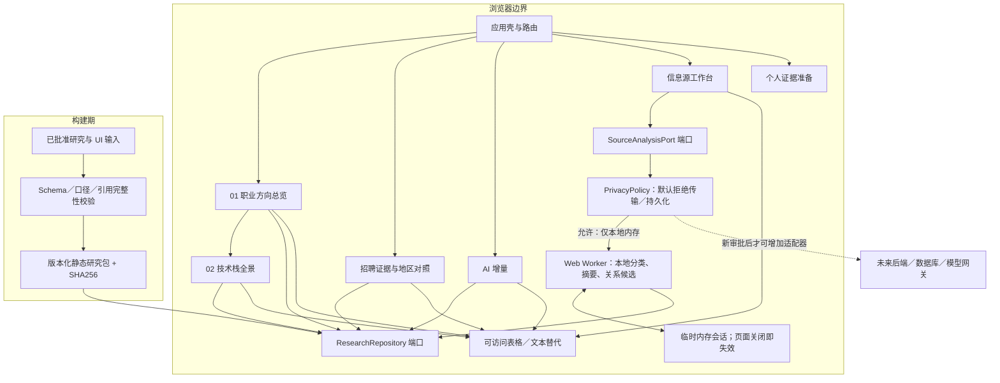
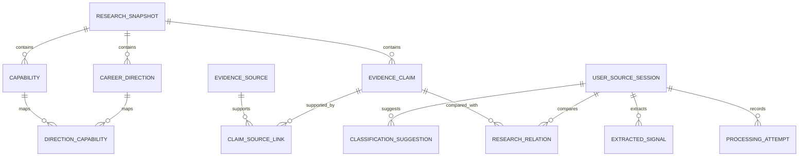
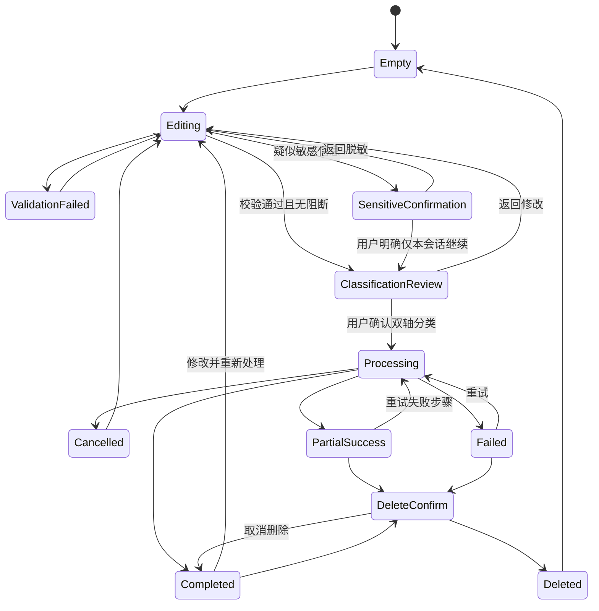

# Frontend Career Radar（前端职业成长雷达）技术架构方案

> 版本：1.0  
> 日期：2026-08-04（Asia/Shanghai）  
> 项目 ID：`market-analysis-dev`  
> 负责角色：固定 05 架构师（`role-architect`）  
> 变更编号：`arch-20260804-frontend-career-radar-001`  
> 入场审批：`approval-20260804-career-architecture-entry`  
> 上游 PRD：`docs/02-prd.md` v1.1，SHA256 `8842f2c7c974bb9ac5fef2ad47f0d35e068a66cfd510ce0088c092ab884ce1e9`  
> 上游 UI Prompt：`ui/03-ui-prompt.md` v1.0，SHA256 `f75762b14b5cdcb536cdb58801cd77380ea4a3a276aa906515c137e129ad33b0`  
> 视觉基线：`ui/` 下 10 张已批准图片，审批 `approval-20260804-career-ui-baseline`  
> 当前状态：待超级无敌帅超超总审核  
> 停止门：`architecture-review`

## 0. 架构结论摘要

本方案采用“**静态证据内容内核 + 浏览器内交互工作台 + 可替换端口**”的 Web 优先架构：

1. 第一交付切片是无需账号、后端、数据库、第三方模型或实时数据即可完整浏览的静态 Web 应用。
2. 信息架构和路由硬约束为 `01 职业方向总览 → 02 技术栈全景`；招聘、AI、信息源和个人证据均位于其后。
3. 获批研究快照作为只读、版本化、带 SHA256 的内容包进入构建；页面不得把目的抽样改写为市场份额或实时数据。
4. F10 信息源工作台的首个交互切片默认只在浏览器内存和 Web Worker 中处理；不写入 `localStorage`、`sessionStorage`、IndexedDB、Cache Storage、日志、分析平台或后端。
5. F10 首版使用可解释的本地规则完成双轴分类建议、最小摘要和研究关系候选；需要第三方模型时必须启用新的、默认拒绝的策略门，披露接收方、用途、保存／训练边界后再单独获批。
6. 当前不部署网络 API，但先定义同构应用端口和未来 HTTP 契约，使本地实现可在后续审批后替换为后端实现，而不改动页面领域模型。
7. 后端、数据库、持续采集、账号、跨设备同步、真实用户数据持久化和生产部署均后置；本架构不授权其实现。

## 1. 范围、目标与非目标

### 1.1 本次架构目标

- 为 6 个核心页面、10 类图表／数据映射和信息源工作台 24 个状态提供可实现的模块边界。
- 保证职业方向和技术栈两层关系在路由、导航、数据模型和自动化验收中均不可被后续模块插队。
- 建立事实、来源观点、角色推断、未知、用户提供、系统提取和模型推断的结构化证据链。
- 在无后端条件下交付完整只读体验，并为 F10 提供隐私优先、可失败恢复的本地处理边界。
- 明确未来 API、数据库、模型和部署的接入条件，避免 MVP 为假想扩展提前承担运行成本。

### 1.2 明确非目标

- 不编写前端、后端、数据采集、模型接入、部署或基础设施代码。
- 不接入真实招聘源，不自动抓取 URL，不绕过登录、验证码、付费、robots、API 或反爬限制。
- 不实现账号、文件上传、个人档案、跨设备同步、实时刷新、生产监控或正式上线。
- 不把视觉基线中的错误日期、英文标题、乱码、虚构计数、个人分数、自动保存或“系统运行中”文案视为真实能力。
- 不定义个人能力评分、薪资预测、岗位替代率、市场份额或“最适合用户”的排序算法。

## 2. 架构原则与优先级

| 优先级 | 原则 | 设计约束 |
|---|---|---|
| P0 | 浏览器可读优先 | 核心内容不依赖后端、网络 API、登录或外链可用性 |
| P0 | 信息架构不变式 | 主入口、导航、路由和页面标题均保持方向为 01、技术栈为 02 |
| P0 | 证据可追溯 | 每条关键结论都必须关联来源、时间、地区、层级、样本边界与事实类型，或明确为未知 |
| P0 | 隐私默认拒绝 | 用户正文默认只驻留当前页面内存；未获单独授权时第三方传输和持久化适配器必须拒绝 |
| P0 | 失败可恢复 | 外链、单图表、单处理步骤失败不拖垮核心阅读；用户输入失败时仍可复制、修改、重试或删除 |
| P1 | 简体中文完整 | 导航、操作、状态、图表、错误、空状态、无障碍文案和移动端均有完整简体中文版 |
| P1 | 可访问等价 | 图形必须有表格／列表和文本摘要；状态不只依赖颜色；所有关键操作可键盘完成 |
| P1 | 可替换边界 | UI 依赖领域端口，不直接依赖静态文件、模型供应商或未来后端 |
| P2 | 少依赖、低成本 | 初始版本不引入服务端、消息队列、缓存、数据库或遥测平台 |

## 3. 技术选型

### 3.1 当前 Web 切片

| 领域 | 选择 | 选择理由 | 未选择方案与原因 |
|---|---|---|---|
| 前端框架 | React + TypeScript | 适合复杂交互状态、组件化数据视图和固定团队默认栈；类型系统可锁定证据语义 | 不选纯静态模板：F10 与图表状态复杂；不选多框架：增加治理和包体成本 |
| 构建工具 | Vite | 静态构建快、配置面小，适合当前无服务端的浏览器应用 | 不选自建 Webpack 配置：MVP 维护成本高；不选全栈框架：当前没有 SSR、服务端动作或账号需求 |
| 路由 | React Router，路由状态与筛选可序列化到 URL | 支持页面直达、浏览器返回、方向上下文和证据抽屉深链 | 不用单页本地 Tab：无法形成稳定的 01 → 02 路由验收和可分享上下文 |
| 状态管理 | React reducer/context + TypeScript 判别联合；URL 保存可分享筛选 | 当前状态范围有限，避免引入全局状态库；F10 状态机可显式穷举 | 不选 Redux/Zustand：首版没有跨域写模型；复杂度尚不值得额外依赖 |
| 内容校验 | JSON Schema + Zod（构建期和运行期双校验） | 研究快照是结构化内容而非自由 HTML；可阻止缺来源、缺口径或非法枚举进入构建 | 不用任意 MDX 执行业务组件：内容与代码边界模糊且扩大供应链面 |
| 图表 | Apache ECharts 作为渲染适配器，同时强制 HTML 表格与文本摘要 | 覆盖点图、矩阵、分组条图和关系图；适配器隔离后可替换 | 不用纯 Canvas 自研：无障碍与交互成本高；不只依赖图表库 ARIA：不能替代表格与人工验收 |
| F10 处理 | Web Worker + 本地确定性规则／词典／结构提取 | 处理 100,000 字符时不阻塞 UI；结果可解释、无第三方传输和按量费用 | 不默认调用云端 LLM：隐私、成本、训练／保留边界未获授权；不在主线程跑重处理：影响可用性 |
| 测试 | Vitest + Testing Library + Playwright + axe-core | 覆盖领域规则、组件、跨页路径、键盘和基础可访问性 | 自动化不宣称等于 WCAG 审计；仍需人工键盘与辅助技术验证 |
| 包管理 | 根仓既有包管理规范；实现时锁定精确版本并提交 lockfile | 遵守唯一根仓并保证可复现 | 不在架构阶段虚构未安装的精确补丁版本 |

### 3.2 当前明确不引入

| 能力 | 当前决定 | 重新评估触发条件 |
|---|---|---|
| 后端框架 | 不引入 | 获批持久化、第三方模型代理、账号或持续采集中的至少一项 |
| 数据库 | 不引入 | 获批保存真实用户输入或服务器管理的研究版本 |
| Redis／队列 | 不引入 | 已有后端且存在可证明的异步吞吐、重试或限流需求 |
| 服务端渲染 | 不引入 | SEO、首屏或内容分发数据证明静态 SPA 不满足目标 |
| PWA／Service Worker | 不引入 | 单独评估缓存隐私、版本回滚和离线收益后获批 |
| 第三方分析 | 不引入 | 有明确指标、事件最小化方案且确认绝不采集用户正文后获批 |
| 云端模型 | 默认禁止 | 披露供应商、用途、区域、保留、训练、删除和成本并取得单独授权 |

## 4. 总体架构



### 4.1 运行边界

- 构建期读取获批研究，生成只读静态包；运行时不依赖 Git 仓库、外部职位页或实时采集源。
- 浏览器运行时只读取同源静态资源。首版 CSP 的 `connect-src` 设为 `'none'`；若开发预览需要 HMR，只在开发配置放开本地连接。
- 所有用户输入处理在独立 Worker 内执行，页面只持有状态和可复制原文；Worker 不具备网络适配器。
- 用户输入不得进入研究静态包，也不得反向修改已批准研究快照。

## 5. 信息架构与路由契约

| 顺序 | 路由 | 模块 | 必须保持的上下文 |
|---:|---|---|---|
| 01 | `/directions` | 职业方向总览 | 快照版本、截止日、目的抽样边界 |
| 02 | `/stacks?direction={id}` | 技术栈全景 | 来源方向、P0/P1/P1-AI/P2/观察项、层级筛选 |
| 03 | `/evidence` | 招聘证据 | 中国／远程／边界样本分区、来源状态 |
| 04 | `/ai-increment` | AI 增量 | 工具使用／输出审核／产品构建三轨与要求类型 |
| 05 | `/source-workbench` | 信息源工作台 | 当前内存会话、分类确认、处理阶段、研究关系 |
| 06 | `/personal-evidence` | 个人证据准备 | 未知／用户自述／待核验等事实边界 |

路由守卫规则：

- `/stacks` 没有 `direction` 时展示全部方向基线，但仍标识为第二层。
- 任何页面不得把“招聘”“成长路径”“个人证据”插入 01 与 02 的面包屑之间。
- 证据详情用 `/evidence/{claim_id}` 或可恢复的抽屉子路由；关闭后焦点返回触发项。
- 移动端可改变呈现，不得改变路由语义和第一、第二层顺序。

## 6. 模块划分与依赖方向

| 模块 | 职责 | 可依赖 | 禁止直接依赖 |
|---|---|---|---|
| `app-shell` | 路由、导航、快照条、错误边界、中文语言包 | `shared-*`、各 feature 公共入口 | 具体静态 JSON、Worker 内部实现 |
| `career-directions` | 方向布局、比较、选择方向 | `research-domain`、`evidence-ui` | 用户输入会话、未来后端 SDK |
| `tech-landscape` | 能力分层、方向映射、层级筛选 | `research-domain`、`evidence-ui` | 个人评分、招聘采集器 |
| `recruitment-evidence` | 样本分区、证据表、来源状态、地区边界 | `research-domain`、`chart-adapter` | 原始受限正文、实时源 |
| `ai-increment` | 三类 AI 信号、要求类型、反证与限制 | `research-domain`、`chart-adapter` | 替代率或未批准推断 |
| `source-workbench` | 输入、确认、处理状态、摘要、研究关系、删除 | `source-analysis-domain`、`privacy-policy` | 网络、存储、遥测供应商 |
| `personal-evidence` | 未知状态、证据等级和隐私说明 | `research-domain` | 自动能力评分 |
| `research-domain` | 快照、方向、能力、声明、证据和口径模型 | 无 UI 依赖 | React、ECharts、网络 |
| `source-analysis-domain` | 分类、摘要、关系与状态机 | `research-domain` | React、持久化、供应商 SDK |
| `research-repository` | 读取、校验版本化静态包 | Schema 校验器 | UI 组件 |
| `local-analysis-worker` | 在 Worker 内执行本地分析 | `source-analysis-domain` | `fetch`、XHR、Beacon、存储 API |
| `chart-adapter` | 把领域数据转换为图表并提供等价表格 | `research-domain` | 业务规则写回 |
| `privacy-policy` | 对传输、持久化、日志和遥测做默认拒绝决策 | 配置与 consent 状态 | 具体页面文案 |

依赖只允许从页面／适配器指向领域端口，领域层不得反向依赖 React、图表库、浏览器存储或未来服务端实现。

## 7. 数据与证据模型

### 7.1 实体关系



### 7.2 核心实体

| 实体 | 关键字段 | 不变式 |
|---|---|---|
| `ResearchSnapshot` | `snapshot_id`、`version`、`evidence_cutoff`、`purpose_sample_count`、`content_sha256`、`status` | 只有 `approved` 快照可进入正式内容构建；旧版不可被静默覆盖 |
| `CareerDirection` | `direction_id`、中文名称、定义、适用层级、证据强度、限制、失效条件 | 固定属于信息架构第一层；证据强度不是岗位排名 |
| `Capability` | `capability_id`、名称、优先级、方向、层级、可验证行为、事实类型 | 优先级枚举只能为 P0/P1/P1-AI/P2/观察项 |
| `DirectionCapability` | `direction_id`、`capability_id`、关联理由、直接／相邻证据 | 多对多映射不重复累计同一证据信号 |
| `EvidenceClaim` | `claim_id`、文本、`claim_type`、地区、层级、样本组、置信度、失效条件 | `claim_type` 必须是事实／来源观点／角色推断／未知之一 |
| `EvidenceSource` | `source_id`、名称、类型、URL、发布日、采集日、最后核验日、版权／robots／API／登录／保存限制 | 采集日不得冒充发布日期；只保存最小事实摘要，不保存完整职位正文 |
| `ClaimSourceLink` | `claim_id`、`source_id`、支持／反证／冲突、摘录摘要 | 摘要必须最小化并可追溯，不复制长原文 |
| `UserSourceSession` | 会话内 ID、正文、可选元数据、敏感确认、权利确认、处理状态、替代／删除状态 | MVP 仅内存；与研究快照分离；删除后不得继续参与对照 |
| `ClassificationSuggestion` | 来源渠道、内容类型、各自置信度、依据、候选、用户确认值 | 来源渠道与内容类型为两个独立轴；允许未知和多个候选 |
| `ExtractedSignal` | 语义类型、主张、技术／能力、时间、地区、层级、待核验项 | 必须标明来源事实／观点／系统提取／模型推断／未知 |
| `ResearchRelation` | 用户主张、`claim_id`、关系、理由、置信度、可能影响 | 关系只能为新增／印证／重复／冲突／证据不足／不适用；冲突不可压成综合分数 |
| `ProcessingAttempt` | attempt ID、输入哈希、开始／结束、完成步骤、失败步骤、错误码、替代关系 | 不记录原文到日志；旧结果被替代后不再生效 |

### 7.3 静态内容包结构

```text
research-snapshot/
├── manifest.json              # 版本、截止日、样本口径、文件哈希
├── directions.json            # 8 个职业方向
├── capabilities.json          # P0/P1/P1-AI/P2/观察项
├── direction-capabilities.json
├── claims.json                # 事实／观点／推断／未知
├── sources.json               # 来源元数据与访问限制
├── claim-source-links.json
└── schemas/                   # 对应 JSON Schema
```

构建门必须验证：ID 唯一、引用完整、枚举合法、事实有来源、推断有依据和置信度、未知有缺失原因、所有计数带样本组与 N、日期语义未混用、快照哈希匹配。

### 7.4 未来数据库设计边界

当前 MVP **没有数据库，也不会创建下列表**。若后续持久化获批，推荐 PostgreSQL，并保持以下关系模型；用户正文与研究证据分 schema／权限域：

| 表 | 主键与主要字段 | 索引建议 |
|---|---|---|
| `research_snapshots` | `id`、`version`、`evidence_cutoff`、`sha256`、`status` | unique(`version`)，index(`status`,`evidence_cutoff`) |
| `career_directions` | `id`、`snapshot_id`、`slug`、`name_zh_cn` | unique(`snapshot_id`,`slug`) |
| `capabilities` | `id`、`snapshot_id`、`priority`、`name_zh_cn` | index(`snapshot_id`,`priority`) |
| `direction_capabilities` | `direction_id`、`capability_id`、`reason` | unique(`direction_id`,`capability_id`) |
| `evidence_claims` | `id`、`snapshot_id`、`claim_type`、`region`、`level`、`sample_group` | index(`snapshot_id`,`claim_type`)，index(`region`,`level`) |
| `evidence_sources` | `id`、URL 指纹、发布日期、核验日、访问限制 | unique(URL 指纹)，index(`last_verified_at`) |
| `claim_source_links` | `claim_id`、`source_id`、`relation_type` | unique(`claim_id`,`source_id`,`relation_type`) |
| `user_source_sessions` | `id`、主体 ID、consent ID、状态、过期时间、删除时间；正文应单独加密 | index(`subject_id`,`expires_at`)，部分索引 `deleted_at IS NULL` |
| `processing_attempts` | `id`、`session_id`、步骤、状态、错误码、输入哈希 | index(`session_id`,`created_at`) |
| `consent_receipts` | `id`、用途、供应商、保留／训练政策版本、决定、撤回时间 | index(`subject_id`,`purpose`,`decided_at`) |

任何数据库实施前必须补齐数据分类、密钥管理、备份删除一致性、保留 TTL、访问审计、数据主体删除验证和迁移回滚方案。

## 8. F10 信息源处理架构

### 8.1 状态机



所有状态使用判别联合和穷举 reducer；非法跃迁在开发环境抛错，在生产环境记录不含正文的错误码并回到最近安全状态。

### 8.2 本地处理流水线

1. **输入校验**：按 Unicode 码点计数 1—100,000；只含 URL 时拒绝自动抓取；原文不截断。
2. **规范化**：只处理换行、空白和 Unicode 规范化；保留原文副本供用户回退，不把 HTML 当作可执行内容。
3. **敏感信息提示**：本地规则只返回类别和大致位置，不回显完整值；这是提示，不声称能发现所有敏感信息。
4. **双轴分类建议**：来源渠道和内容类型分别给出候选、置信度和可解释依据；低置信允许未知。
5. **用户确认**：后续摘要和关系分析只使用用户确认后的分类值，同时保留系统原建议。
6. **最小摘要**：首版用标题、段落、列表和技术词典做抽取式摘要；不生成未经来源支持的新事实。
7. **信号提取**：识别技术、能力、时间、地区、层级和限制，并给出 `system_extraction` 标签。
8. **研究对照**：基于规范 ID、关键词和证据规则生成关系候选；冲突和证据不足必须并列展示。
9. **结果管理**：修改后形成新 attempt；旧 attempt 标为 superseded，不能继续参与当前关系矩阵。
10. **删除**：清空页面和 Worker 内存引用，终止进行中的任务；不得声称能控制浏览器扩展、OS 内存、崩溃转储或用户主动复制的副本。

### 8.3 隐私、持久化与第三方传输边界

| 数据位置／动作 | MVP 默认 | 技术控制 |
|---|---|---|
| React 页面状态 | 允许，当前标签页内存 | 页面卸载、删除或新会话时释放引用 |
| Web Worker 内存 | 允许，当前处理生命周期 | 取消／删除时终止 Worker 并重建空实例 |
| URL 查询参数／历史 | 禁止写入正文或敏感元数据 | 只允许非敏感筛选 ID |
| `localStorage`／`sessionStorage` | 禁止 | 不提供存储适配器；静态扫描禁止相关调用持有用户正文 |
| IndexedDB／Cache Storage／Service Worker | 禁止 | 首版不注册 Service Worker，不缓存 F10 请求或结果 |
| 控制台、日志、错误监控、分析事件 | 禁止正文、摘要和敏感元数据 | 只允许固定枚举错误码、阶段、耗时桶和匿名计数；首版默认无第三方遥测 |
| 剪贴板 | 仅用户点击“复制输入作为回退” | 明确操作和成功／失败反馈，不自动复制 |
| 第三方模型／API | 禁止 | `PrivacyPolicy` 返回 `POLICY_BLOCKED_THIRD_PARTY_TRANSFER`；CSP `connect-src 'none'` |
| 后端持久化 | 禁止 | 当前无后端地址、鉴权或数据库适配器 |
| 浏览器下载／导出 | 首版不提供用户内容导出 | 后续需单独定义脱敏与文件权限 |

任何第三方处理方案必须先形成单独架构变更，至少说明：接收方、数据类别、用途、区域、加密、保存期、训练使用、子处理方、删除／撤回、失败回退、费用上限和用户可理解的授权文案。

## 9. 应用端口与 API 契约

### 9.1 当前进程内端口

| 端口 | 方法 | 输入 | 输出 | 失败 |
|---|---|---|---|---|
| `ResearchRepository` | `getSnapshot()` | 无 | 已批准快照 manifest | `CONTENT_INVALID`、`CONTENT_VERSION_MISMATCH` |
| `ResearchRepository` | `listDirections(filter)` | 层级／证据筛选 | 方向列表 | `FILTER_INVALID` |
| `ResearchRepository` | `listCapabilities(directionId, level)` | 方向与层级 | 分层能力列表 | `DIRECTION_NOT_FOUND` |
| `ResearchRepository` | `listClaims(query)` | 地区、层级、样本组、类型 | 声明与证据引用 | `QUERY_INVALID` |
| `SourceAnalysisPort` | `validate(input)` | 正文与元数据 | 长度、URL-only、敏感类别候选 | `EMPTY_INPUT`、`INPUT_TOO_LARGE` |
| `SourceAnalysisPort` | `suggestClassification(input)` | 当前会话输入 | 双轴候选、置信度、依据 | `CLASSIFICATION_UNAVAILABLE` |
| `SourceAnalysisPort` | `analyze(confirmedInput, signal)` | 用户确认分类、AbortSignal | 摘要、信号、关系、步骤结果 | `CANCELLED`、`PARTIAL_FAILURE`、`PROCESSING_TIMEOUT` |
| `SourceAnalysisPort` | `delete(sessionId)` | 会话 ID | 内存清理回执 | `SESSION_NOT_FOUND` |
| `PrivacyPolicy` | `authorize(action, context)` | transfer／persist／log／copy | allow／deny + policy code | 默认 deny |

### 9.2 未来 HTTP API（仅冻结契约，不实现、不部署）

未来只有在服务端能力获批后，才可用 HTTP adapter 替换本地端口：

| 方法 | 路径 | 用途 | 请求要点 | 响应要点 |
|---|---|---|---|---|
| GET | `/api/v1/research-snapshots/current` | 获取当前获批快照 | `If-None-Match` | manifest、ETag、内容 SHA |
| GET | `/api/v1/directions` | 查询方向 | `level`、`claim_type` | 分页方向与口径 |
| GET | `/api/v1/capabilities` | 查询能力 | `direction_id`、`priority`、`level` | 分层能力与证据引用 |
| GET | `/api/v1/claims` | 查询声明 | 地区、层级、样本组、事实类型 | 声明、来源链接和限制 |
| POST | `/api/v1/user-source-analyses` | 创建临时分析 | consent receipt、正文、元数据、幂等键 | 202、analysis ID、TTL、状态 |
| PATCH | `/api/v1/user-source-analyses/{id}/classification` | 确认双轴分类 | 建议值、用户确认值、版本 | 已确认分类 |
| POST | `/api/v1/user-source-analyses/{id}/comparisons` | 对照快照 | `snapshot_id`、attempt version | 关系结果与依据 |
| GET | `/api/v1/user-source-analyses/{id}` | 查询处理状态 | 仅所属主体 | 状态、成功／失败步骤、TTL |
| DELETE | `/api/v1/user-source-analyses/{id}` | 删除分析 | 幂等删除 | 204 或已删除回执 |

未来写接口必须具备：短期身份会话、CSRF 防护或同等机制、请求体上限、速率限制、幂等键、审计事件、TTL、加密、租户／主体隔离和可验证删除。未具备时不得上线。

### 9.3 统一响应与错误格式

```json
{
  "data": {},
  "meta": {
    "request_id": "req_...",
    "schema_version": "1",
    "snapshot_id": "snapshot_..."
  },
  "error": null
}
```

```json
{
  "data": null,
  "meta": {"request_id": "req_...", "schema_version": "1"},
  "error": {
    "code": "POLICY_BLOCKED_THIRD_PARTY_TRANSFER",
    "message": "当前未授权向第三方传输用户输入。",
    "retryable": false,
    "field": null,
    "details": []
  }
}
```

错误信息不得包含用户原文、简历字段、URL 查询敏感信息或内部堆栈。

## 10. 安全设计

### 10.1 威胁与控制

| 威胁 | 当前控制 | 剩余风险 |
|---|---|---|
| 用户粘贴 HTML／脚本造成 XSS | 全部作为纯文本渲染；禁止 `dangerouslySetInnerHTML`；链接需显式解析并转义 | 浏览器扩展仍可能读取页面内容，需用户脱敏提示 |
| 恶意长文本造成卡顿 | 100,000 码点上限、Worker、超时、AbortSignal、分步处理 | 极端 Unicode／正则输入仍需模糊测试 |
| ReDoS | 只使用线性／有界规则；禁用未经审计的复杂回溯正则 | 新规则进入前需性能测试 |
| 第三方脚本窃取输入 | 不加载远程脚本／字体／分析 SDK；CSP 限制同源 | 浏览器自身和用户环境不在应用完全控制内 |
| 输入进入错误日志 | 固定错误码和字段白名单；无正文日志 | 开发者手工调试时仍需守则和审查 |
| URL 自动抓取引发 SSRF／权利风险 | 当前无服务端、无 URL fetch | 未来抓取器必须独立威胁建模和逐源审批 |
| 静态证据被篡改或版本混用 | manifest SHA、构建校验、只读包、页面显示版本和截止日 | Git／发布供应链仍需后续 CI 与制品签名 |
| 研究与用户材料混淆 | 数据模型、样本组、视觉标签和查询域分离 | 文案错误仍需 QA 和内容审查 |
| 外链反向控制窗口 | `target=_blank` 时强制 `rel=noopener noreferrer` | 外部内容本身仍不受本项目控制 |

### 10.2 浏览器安全基线

- 生产候选的 CSP 基线：`default-src 'self'; script-src 'self'; style-src 'self'; img-src 'self' data:; font-src 'self'; connect-src 'none'; object-src 'none'; frame-src 'none'; base-uri 'none'; form-action 'none'`。
- 设置 `Referrer-Policy: strict-origin-when-cross-origin`、`X-Content-Type-Options: nosniff` 和合适的 `Permissions-Policy`。
- 不把用户原文放入 DOM 属性、URL、错误对象 message、性能 mark 名称或图表 label formatter 的可执行模板。
- 依赖在实现阶段锁定版本、生成 SBOM／依赖审计结果；高危问题阻断发布候选。

## 11. 失败恢复与可靠性

| 故障 | 用户体验 | 恢复策略 |
|---|---|---|
| 静态研究包缺失／哈希不符 | 显示“内容校验失败”，不展示可能错误的结论 | 阻断该版本构建；运行时回退到同制品内最后验证包，若不存在则安全失败 |
| 单个图表渲染失败 | 保留页面结论、口径和数据表 | feature 级错误边界重建图表；不刷新整页 |
| 外链失效 | 核心事实摘要仍可读，标记当前不可访问和最后核验日 | 允许复制来源信息；不自动判为岗位关闭 |
| Worker 初始化失败 | 输入仍保留，可复制回退 | 重建一次 Worker；仍失败则进入“处理能力不可用” |
| 处理超时 | 显示已完成／未完成步骤 | 用户可取消、重试失败步骤或复制输入；不自动无限重试 |
| 部分成功 | 展示成功摘要与失败模块 | 失败步骤单独重试，关系结果标记不完整 |
| 用户取消 | 保留原文和已确认元数据 | 中止 Worker，回到可编辑状态 |
| 修改后重处理 | 旧结果显示已替代 | 新 attempt 成功前旧结果可阅读但不继续参与新对照 |
| 删除 | 返回空状态并播报完成 | 终止 Worker、释放内存引用、清空页面状态；不做无法验证的“永久擦除”承诺 |

重试采用用户触发、最多一次自动 Worker 重建；不得在后台静默重试第三方或未来付费服务。

## 12. 性能与容量边界

- 核心静态首屏以低端移动设备和中等网络为基线，目标 LCP ≤ 2.5 秒；这是实现与 QA 目标，不是当前已验证结论。
- 初始路由只加载应用壳、方向页和最小快照；其他页面、图表适配器和 F10 Worker 按路由拆包。
- 研究包按领域拆分，避免把所有来源详情一次解析；列表和表格使用分页或虚拟化前先以真实数据量验证必要性。
- 10 张批准图片只作为设计输入，不进入产品运行包，避免无必要的图片体积。
- F10 支持 100,000 Unicode 字符，但 Worker 任务按阶段让出／可取消；定义 10 秒软超时和 30 秒硬上限候选值，需实现基准后冻结。
- 图表动效尊重 `prefers-reduced-motion`；数据更新不做伪实时轮询。

## 13. 可访问性、响应式与简体中文

- 页面唯一 H1、连续标题层级、跳到主要内容、可见焦点、44×44 CSS px 触控目标。
- 图表必须有可聚焦图例、口径文本、结果摘要和等价表格；Tooltip 不能承载唯一信息。
- 动态步骤使用礼貌级 live region，只播报阶段变化与完成／失败。
- 敏感信息、删除和清空对话框管理焦点；默认焦点放取消，Escape 可退出。
- 1440、1024、390、320 px 四档布局共享相同领域数据；移动矩阵改为语义行列表，抽屉改全屏详情。
- 系统键盘、200% 文本放大、中英文长词和长 URL 不得遮挡提交／取消或造成整页横向滚动。
- 所有用户可见字符串从 `zh-CN` 语言资源读取；产品的首个完整版本不得只有英文标题、导航、状态、图表标签或错误信息。
- axe 自动化只作为基础检查；键盘、VoiceOver／NVDA 等人工测试结果单独记录，不宣称自动达到 WCAG 2.2 AA。

## 14. 推荐目录结构

以下是实施阶段的目标结构，不在本次创建代码目录：

```text
projects/market-analysis-dev/
├── docs/
│   └── 04-architecture.md
├── ui/
├── frontend/
│   ├── src/
│   │   ├── app/                    # 应用壳、路由、错误边界、语言入口
│   │   ├── features/
│   │   │   ├── career-directions/
│   │   │   ├── tech-landscape/
│   │   │   ├── recruitment-evidence/
│   │   │   ├── ai-increment/
│   │   │   ├── source-workbench/
│   │   │   └── personal-evidence/
│   │   ├── domain/
│   │   │   ├── research/
│   │   │   └── source-analysis/
│   │   ├── adapters/
│   │   │   ├── static-research-repository/
│   │   │   ├── local-analysis-worker/
│   │   │   └── echarts/
│   │   ├── shared/
│   │   │   ├── a11y/
│   │   │   ├── ui/
│   │   │   ├── errors/
│   │   │   ├── i18n/
│   │   │   └── privacy/
│   │   ├── content/research-snapshot/
│   │   └── workers/source-analysis.worker.ts
│   ├── tests/
│   │   ├── contract/
│   │   ├── integration/
│   │   ├── e2e/
│   │   └── accessibility/
│   └── package.json
├── backend/                        # 保留；未获批前为空且无运行入口
├── docker/                         # 保留；生产部署获批前不创建配置
└── workflow/
```

命名规则：领域实体用单数 PascalCase；文件和路由用 kebab-case；Schema 名称包含版本；错误码使用稳定的 UPPER_SNAKE_CASE；测试文件与被测模块同名。

## 15. 测试与架构验收策略

### 15.1 构建期契约测试

- 所有 JSON 通过 Schema 与 Zod 双校验。
- 每个事实有至少一条来源链接；每个推断有依据、置信度和失效条件；每个未知有缺失原因。
- 计数总是携带 `sample_group`、`n`、`N` 和“目的抽样”口径。
- 路由清单固定验证 `/directions` 为 01、`/stacks` 为 02。
- UI 文案扫描禁止“市场份额”“你已掌握”“完全符合 WCAG”“自动保存”等未经实现或不合规断言。

### 15.2 领域与状态测试

- F10 24 个 UI 状态均可通过合法事件到达；非法事件不能破坏会话。
- 空白、URL-only、100,000 边界、100,001、复杂 Unicode、超长 URL 和恶意 HTML 输入均有覆盖。
- 来源渠道和内容类型独立确认；纠正值可追溯，且研究关系只使用确认版本。
- 冲突并列、重复不累计、招聘用户样本不并入核心 10 样本。
- 删除、取消、部分成功、重试和 superseded 结果不会继续参与当前对照。

### 15.3 端到端与人工检查

- 键盘完成方向 → 技术栈 → 证据详情 → 返回。
- 键盘完成输入 → 分类确认 → 处理 → 结果 → 重试／删除。
- 1440、1024、390、320 px 和移动键盘场景截图回归。
- Chrome、Edge、Firefox、Safari 最新两个主要版本在正式 QA 时验证。
- 无网络和外链失败下，核心内容仍完整可读。
- 浏览器存储检查确认用户正文未进入 Storage、Cache、URL 或日志。
- 开发者工具网络检查确认首版 F10 不发出第三方请求。

## 16. 成本与部署边界

### 16.1 当前成本形态

- 构建与本地预览：固定开发成本，无运行后端、数据库、队列或模型调用费。
- 浏览器处理：使用用户设备 CPU／内存，不产生按次模型费用。
- 研究更新：由受审查的内容包提交触发，不做定时采集和伪实时刷新。

### 16.2 部署阶段

| 阶段 | 允许内容 | 明确禁止 |
|---|---|---|
| 架构审核前 | 本文档与治理记录 | 代码、真实源、部署 |
| 首批实现候选 | 本地开发、构建、测试和预览；需架构通过及项目经理拆解 | 生产域名、公开发布、真实用户数据 |
| 静态预览候选 | 经过 QA 的静态制品，可准备部署方案 | 未经授权对外发布 |
| 生产发布 | 需单独生产审批、回滚方案、安全／无障碍／性能验证 | 普通“通过”不能自动执行发布 |
| 服务端扩展 | 需新的产品、隐私、架构和高风险审批 | 用本架构文档冒充已批准后端或模型接入 |

生产候选优先采用静态对象存储／CDN 或等价静态托管；具体云平台、域名、区域和预算在部署方案阶段决定。当前不创建 Docker、Serverless、CI/CD 或云资源。

## 17. 视觉基线到架构模块映射

| 视觉基线表达 | 架构承载 | 约束修正 |
|---|---|---|
| 职业方向卡／方向图 | `career-directions` | 不生成“最佳方向”、市场需求或薪资总分；必须保留证据边界 |
| 技术栈矩阵／热力图 | `tech-landscape` + `chart-adapter` | 固定 P0 → P1 → P1-AI → P2 → 观察项，并提供表格 |
| 招聘地区对照 | `recruitment-evidence` | 数字为 n/N 目的样本；不采用图片中的虚构日期与岗位 |
| AI 增量卡片 | `ai-increment` | 分为工具使用、输出审核、产品构建；不显示伪实时趋势 |
| 信息源输入与关系结果 | `source-workbench` | 首版 100,000 字符、默认内存、无自动保存／URL 抓取／云传输 |
| 个人证据阶梯 | `personal-evidence` | 不使用个人分数、成熟度百分比或“已掌握”；只有事实状态 |
| 图表与组件总览 | `shared-ui` + `chart-adapter` | 视觉状态不得替代领域状态与无障碍等价内容 |

PRD、UI Prompt、研究证据治理和完整简体中文版规则高于图片中的示例文案与占位数据。

## 18. 关键架构决策记录

| ADR | 决策 | 原因 | 代价 |
|---|---|---|---|
| ADR-001 | 先静态 Web 内容，后端后置 | 最快验证内容价值并满足无后端可读 | 初期没有跨设备保存和实时更新 |
| ADR-002 | F10 首版本地确定性处理 | 默认保护隐私、零第三方成本、结果可解释 | 摘要和语义分类能力有限，必须明确未知／低置信 |
| ADR-003 | 研究快照与用户输入分域 | 防止用户材料静默覆盖获批研究 | 对照模型和 UI 标签更复杂 |
| ADR-004 | 领域端口隔离实现 | 未来可换后端／模型而不重写页面规则 | 需要额外契约测试和适配器结构 |
| ADR-005 | 不引入 PWA／本地持久化 | 避免输入被浏览器持久缓存 | 刷新或关闭页面会丢失未复制内容，需明确提示与复制回退 |
| ADR-006 | 图表必须有表格和摘要 | 满足可访问性和证据复核 | 设计与开发工作量高于只画图 |

## 19. 风险与应对

| 风险 | 严重度 | 应对与停止条件 |
|---|---:|---|
| 本地规则被误解为 AI 权威判断 | 高 | 所有结果标系统提取／候选，显示依据与低置信；不得写成已核验事实 |
| 用户误认为内存处理绝对无痕 | 高 | 说明应用不持久化，但浏览器扩展、OS、剪贴板不受完全控制；建议先脱敏 |
| 图片中的伪数据进入实现 | 高 | 运行内容只能来自获批快照；视觉资产不打包；文案／日期禁词与快照契约测试 |
| 静态 SPA 首屏过重 | 中 | 路由拆包、研究包分片、方向首屏最小加载，基于真实 bundle 再优化 |
| 100,000 字符导致性能问题 | 中 | Worker、可取消、分阶段、基准测试和软／硬超时 |
| 图表无障碍不足 | 高 | 强制表格和文本摘要；键盘／辅助技术人工测试不过则不进入发布候选 |
| 后续接模型时绕过审批 | 高 | 默认拒绝适配器和 CSP；模型接入必须新 change_id、风险审批和成本上限 |
| 研究版本更新破坏旧链接 | 中 | snapshot ID、schema version、ETag／hash 和迁移验证；不静默覆盖 |

## 20. 架构自查 Checklist

- [x] 技术选型以成熟、低复杂度和 Web 内容优先为准，没有为后置能力提前建设服务。
- [x] “职业方向总览 → 技术栈全景”已在路由、模块、数据和测试中锁定。
- [x] 模块职责单一，依赖从页面／适配器指向领域端口，不存在循环依赖设计。
- [x] 静态内容、用户输入、未来后端与第三方模型边界清楚。
- [x] 数据模型覆盖研究快照、方向、技术栈、来源、声明、用户输入、分类、摘要、关系和处理尝试。
- [x] 当前无数据库，仍给出未来关系表、约束和索引边界。
- [x] 应用端口覆盖 PRD P0 功能；未来 API 有方法、路径、输入、响应与错误约束。
- [x] API 使用统一响应与错误格式，不回显用户正文或堆栈。
- [x] 安全覆盖 XSS、长文本、ReDoS、第三方脚本、日志泄露、SSRF 和内容完整性。
- [x] 性能覆盖路由拆包、静态包分片、Worker、取消和容量基准。
- [x] 失败恢复覆盖外链、图表、Worker、超时、部分成功、取消、替代和删除。
- [x] 成本明确为静态／本地处理优先，后端、模型和部署费用后置审批。
- [x] 可访问性、响应式和完整简体中文版要求进入架构验收。
- [x] 未把 10 张视觉基线中的错误日期、英文标题、个人分数或占位数据当成系统事实。
- [x] 本次未写代码、未接真实源、未持久化或传输用户输入、未部署。

## 21. 审核门与后续边界

本架构只交付 `docs/04-architecture.md` v1.0，当前停止在 `architecture-review`：

- 未创建前端、后端、数据库、采集器、模型接入或部署配置；
- 未运行真实用户输入，未向任何第三方传输数据；
- 未把视觉基线视为已实现页面；
- 未授权固定 02 项目经理拆解或任何开发角色入场；
- 超级无敌帅超超总可选择：**通过 / 修改 / 打回**；按本轮明确指令，即使“通过”也不由固定 05 架构师自动路由下一角色。

