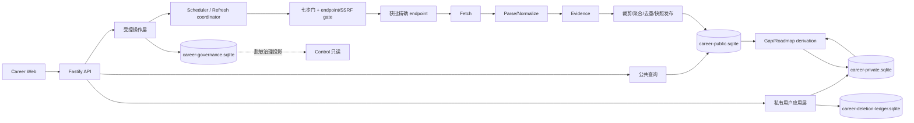

# Frontend Career Radar（前端职业成长雷达）发布完整性架构

> - 版本：v1.0
> - 日期：2026-08-17（Asia/Shanghai）
> - 项目 ID：`market-analysis-dev`
> - 工作项：`CR-ARC-101`
> - 变更编号：`arch-20260817-career-release-completeness-001`
> - 入场授权：`approval-20260817-career-release-architecture-entry`
> - 产物：`artifact-career-release-completeness-architecture-001`
> - 负责角色：固定 `05 架构师`（`role-architect`）
> - 状态：`ready-for-review`
> - 停止门：`architecture-review`
> - 生产发布：冻结

## 1. 决策摘要

本架构采用“**公共职业研究、私有用户事实、来源治理三域分离的模块化单体 + 本地 SQLite 完整纵切 + 可替换生产适配器**”。它扩展而不覆盖 `docs/04-architecture.md` v1.0：旧文档继续描述静态浏览器切片，本文件冻结 PRD v1.3 正式发布完整性所需的服务、来源、身份、同步、恢复与真相边界。

1. 信息架构继续锁定“`01 职业方向总览 → 02 技术栈全景`”；个人推荐、招聘、AI 增量与路线不得插入两层之间。
2. 公共研究、私有用户资料和来源治理分别使用独立物理存储、owner、权限和恢复流程。用户正文、简历、个人证据、差距与路线不得进入公共研究库、CDN、Control、普通日志或 trace。
3. 公共研究只接收获批精确 endpoint 经七步门产生的证据。当前 registry 为 **60 条数据记录 × 35 列**，`T=13`、`R=0`；`CAR-END-017` 在 registry 外且权利未决，`CR-CONN-002=blocked-not-instantiated`，所以整体为 `not_ready`。
4. 技术源按 6 小时检查，招聘源按 Asia/Shanghai 自然日检查，09:00 形成每日快照候选；`success / no_change / missed / failed` 分开记录。HTTP 200、robots、canary、设计稿和旧静态快照均不等于 live。
5. 差距、路线、未来方向与历史是版本化派生事实，每个结果绑定 `public_snapshot_id + target_revision + evidence_revision_set + rule_version`。用户确认只表示 `user-confirmed`，不升级为 `externally-verifiable`。
6. 正式私有能力使用 Career 独立账户域、服务端 revision、CAS/`If-Match`、幂等键和操作 ID；禁止客户端时间戳 LWW、localStorage 权威同步、父域 Cookie和跨项目账号复用。
7. 本地完整纵切选择 Node.js + TypeScript + Fastify + SQLite；生产数据库、正式域名、API 端口、云厂商、预算、凭证和外部模型供应商继续 `UNKNOWN/TBD`，不得编造。

本文件只交架构。不修改 registry，不实现连接器或业务代码，不采集数据，不启停服务，不部署，也不授权 `CR-PM-101`。

## 2. 权威输入与完整性

下列 SHA-256 已在 `HEAD=a68f881a1ceebaac50c22417c968700a50e74750` 的干净工作树逐项复算并匹配：

| 输入 | SHA-256 |
|---|---|
| `architecture/03-four-project-shared-boundary-adr.md` | `e3073a01ceda280b8dda4d77b58de7e9755d3f77d21f6ebb5497c8882508840a` |
| `docs/04-four-project-release-completeness-replanning-plan.md` | `96decb8f1835cc85bd530c21b2969d4d077f31e6086425ea911f9d5b187bbe26` |
| `docs/05-four-project-real-usable-product-delta.md` | `e613e79f44100840542fb6531e155cf0edd0079a6fc213af328fba075750bc01` |
| `architecture/02-domain-cdn-service-boundary.md` | `d8d7a594b18195e85795b01c7c9c6829222571ba65ddb9629256fab2cf29114b` |
| `projects/market-analysis-dev/docs/02-prd.md` | `680a399c4984c443e7bf5f5c0aa0c628e919a061839d5659c3ddbc22ddf08705` |
| `projects/market-analysis-dev/docs/04-architecture.md` | `bcc782409ebde28e003c9e4a1c20d45ddcb3b787f8a2de020c451ef05957d144` |
| `projects/market-analysis-dev/ui/04-release-completeness-ui-prompt.md` | `983638cb6a802effe4148281233aa381802a7d542ce12e8c694640eee04f3900` |
| `projects/market-analysis-dev/ui/12-release-completeness-ui-design-v1.7.md` | `636d3fcecc3266b8cdc3234614dda68222f67294016d9f22129f87fd552d7fae` |
| `projects/market-analysis-dev/docs/00-source-allowlist.md` | `8e590b31a19b8d4aecd910561ebcc5ee5e423d1dc299ebc4c2d6e4379c3e607e` |
| `projects/market-analysis-dev/docs/00-source-registry.csv` | `43355d302df64a323e3ee6fe299530d72fd6df8a54bb4b24a06158a9f3621b06` |
| `projects/market-analysis-dev/docs/00-source-runtime-readiness.md` | `ee6f32549187ed51939a3b2c11accf4c9cd67b9e50d3c5fbcc70c29949536dbd` |

`docs/00-intake.md` 不存在；它是历史缺口，不用猜测内容补齐，也不替代上述明确输入。

## 3. 范围与不变量

### 3.1 本架构冻结

- 发布完整性技术栈、模块、目录、数据 owner、持久化和事务边界。
- 公共来源政策、执行、采集、规范化、证据、去重、快照、调度和 API 契约。
- 用户材料、个人事实、目标、差距、路线、未来方向、历史、同步、导出与删除契约。
- 身份、租户隔离、隐私、安全、可观测性、备份恢复、迁移、测试和五类地址。
- 当前真相、UNKNOWN/TBD、实现完成门和生产阻断条件。

### 3.2 架构不变量

| ID | 不变量 | 违反结果 |
|---|---|---|
| `INV-01` | 第一层职业方向、第二层技术栈，顺序不可改 | 阻断实现/发布 |
| `INV-02` | 公共研究、私有用户、治理物理与逻辑分域 | P0 阻断 |
| `INV-03` | Career 与 English 身份、subject、Cookie、数据库均不复用 | P0 阻断 |
| `INV-04` | Control 只读脱敏治理状态，正文/简历/证据/差距/路线可见数为 0 | P0 阻断 |
| `INV-05` | 事实、观点、提取、推断、个人六态、冲突、UNKNOWN 不混写 | P0 阻断 |
| `INV-06` | 用户确认不等于外部核验；自动结果不能升级“已掌握” | P0 阻断 |
| `INV-07` | 所有派生结论绑定公共快照、目标、证据和规则版本 | 不得发布该结论 |
| `INV-08` | 来源政策四态与 runtime 布尔轴分离；第七步前 runtime=false | 网络 fail closed |
| `INV-09` | canary 不进入 coverage、快照、current pointer 或 readiness | P0 阻断 |
| `INV-10` | live 新快照至少有 1 个本轮 `current_success` | 全源失败不移动指针 |
| `INV-11` | 共同 `as_of` 先确定并裁剪，再聚合、去重、排序 | 快照作废 |
| `INV-12` | 私有写使用服务端 revision + CAS + 幂等；禁客户端时间 LWW | 返回 409，不覆盖 |
| `INV-13` | 删除代际在恢复前重放；旧备份不能复活数据 | readiness fail closed |
| `INV-14` | 用户域、静态 CDN、API、origin、internal 五类地址不混用 | 部署阻断 |
| `INV-15` | demo/seed/HTTP 200/CDN 新鲜度不能冒充 live | 发布阻断 |

### 3.3 明确不做

- 不选择云厂商、生产数据库或正式域名，不申请账号、权限、凭证或预算。
- 不改 `docs/00-source-registry.csv`；不把 `CAR-END-017` 写入 registry 或将 R 改为 1。
- 不实现 `CR-CONN-002`、连接器、Worker、API、账号、数据库、前端或测试。
- 不运行 canary、联网采集、真实用户材料、第三方模型、服务或部署。
- 不替代 `CR-PM-101` 任务拆解，不路由下游。

## 4. 技术选型与当前可运行性

### 4.1 选型

| 层 | 选择 | 决策边界 |
|---|---|---|
| Web | 现有 React 19 + TypeScript + Vite + React Router | 保留现有入口；新增 API adapter，不以静态内容回退冒充 live |
| 运行时 | Node.js `>=22.12.0` + npm | 与前端 engine/lockfile 对齐；后端精确 patch 和 lockfile 由实现冻结 |
| 语言 | TypeScript strict | API、Worker、领域、契约同一类型语义；禁隐式 `any` |
| HTTP | Fastify + JSON Schema/OpenAPI | 运行时输入输出校验；OpenAPI 是契约生成物，不是手改第二真相 |
| 本地持久化 | SQLite、WAL、foreign keys、busy timeout | 支持本地真实纵切、事务、迁移、在线备份；库文件不进 Git |
| 数据访问 | 显式 Repository/UnitOfWork；driver/query layer `TBD` | 领域层不依赖 ORM；生产数据库适配器可替换 |
| 调度 | DB 租约 + Worker + fake clock 可测时钟 | 本地不引入 Redis；调度未运行必须显示 not_ready/missed |
| 契约校验 | JSON Schema + 领域不变量 + 内容哈希 | 外部输入、数据库读、API 出口三处校验 |
| 日志/指标 | 结构化 JSON + OpenTelemetry 语义 | exporter、留存和费用 `UNKNOWN`；正文、Cookie、Token、高基数 URL 禁入 |
| 测试 | Vitest + Fastify inject + 临时真实 SQLite + Playwright | Mock 不替代迁移、隔离、恢复和端到端证据 |

本地纵切选择 SQLite，不等于选择生产数据库。当并发写、跨进程租约、容量、可用性或多地域要求超过实测边界时再评审 PostgreSQL 或等价服务；Redis、队列、向量库、对象存储和 LLM 默认不引入。

### 4.2 当前真相

- `frontend/` 已有 npm 工程，本地 Web 权威入口为 `http://127.0.0.1:4177/directions`。
- `backend/` 只有 `.gitkeep`；无 `package.json`、源码、迁移、数据库、API、Worker 和测试。
- 后端 `dev/build/lint/typecheck/test` 全部为 `NOT_IMPLEMENTED`，API 端口为 `TBD`。
- 当前实现只证明方向页和浏览器内 Source Workbench 预览可浏览；它不证明 8/8 方向、技术栈、来源、账号、个人证据、同步或后端完成。
- `runtime_enabled=false`、live connector `0`、live snapshot `0`、R=0，因此全产品 readiness 为 `not_ready`。

## 5. 总体架构与数据流



依赖方向只能是 `delivery adapter → application use case → domain → contract primitives`。领域层不得依赖 Fastify、SQLite、React、网络客户端或 Control；公开 GET 不得隐式触发刷新，私有处理不得反向写公共事实。

### 5.1 数据 owner、存储与流向

| 数据类 | 权威 owner | 权威存储 | 可重建派生 | 允许写者 | 禁止流向 |
|---|---|---|---|---|---|
| 来源治理/运行证据 | Career 来源治理 owner | `career-governance.sqlite` + 获批 Git registry bundle | 脱敏状态投影 | 受控治理 use case | 浏览器、CDN、其他项目账号 |
| 公共 Observation/Event/Claim/Evidence | Career 公共研究域 | `career-public.sqlite` | 已批准公开快照、索引、CDN 静态制品 | Worker/Publisher | 私有正文、未经授权全文 |
| 用户原文/简历/项目材料 | Career 用户主体 | `career-private.sqlite` 加密字段 | 请求级内存摘要 | 资源 owner 的 Career 服务 | 公共库、CDN、Control、日志、trace、其他用户 |
| 个人事实/证据/目标 | Career 用户主体 | `career-private.sqlite` | Gap/Roadmap/Future 派生版本 | 同租户主体 + 受控服务 | English/Model/Control 正文投影 |
| 删除代际/tombstone | Career 隐私 owner | `career-deletion-ledger.sqlite` + 独立单调锚点 | 恢复验证报告 | 删除/恢复受控 use case | 普通业务更新、旧备份 |
| seed/demo | Career demo owner | `career-seed-demo.sqlite` | demo UI | demo loader | live 查询、live 指标、live readiness |

公共源事实可以被私有派生结果**引用**，不能由私有材料修改；私有结论保存公共 `snapshot_id/hash` 外部引用，不跨库 `ATTACH` 建万能查询。用户材料若要成为公共研究候选，必须先脱离用户身份、确认权利并走新的来源政策/证据审核，不能由“合并”按钮直接提升。

### 5.2 模块责任

| 模块 | 责任 | 禁止责任 |
|---|---|---|
| `identity-access` | Career subject、session、租户、权限、CSRF | 复用 English 身份或父域 Cookie |
| `source-policy` | registry bundle、CoverageFreshnessPolicy、七步证据 | 修改 registry、自批来源 |
| `refresh` | Request→Run→FetchRun、租约、幂等、状态与遗漏窗 | 公共查询触发采集 |
| `acquisition` | endpoint/SSRF/redirect、条件 GET、限流、超时 | 任意用户 URL、绕登录/403/验证码 |
| `normalization` | 时间、技术、岗位、层级、地区、URL 规范化 | 当前时间填未知发布时间 |
| `research-evidence` | Observation/Claim/Evidence、事实标签、反证 | 观点/提取/推断冒充事实 |
| `snapshot-publishing` | 水位、as_of、裁剪、重聚合、原子 pointer | 全源失败或 canary 发布 |
| `public-catalog` | 方向、技术栈、招聘、趋势、来源质量查询 | 个性化写入 |
| `material-intake` | 1–100000 Unicode、保存模式、双轴分类、敏感/权利确认 | 自动 URL 抓取、静默保存/外发 |
| `personal-evidence` | 六态事实、证据 CRUD、确认/冲突/历史 | user-confirmed 自动升级外部核验 |
| `growth-derivation` | Gap、Roadmap、Future、History 可解释派生 | 缺输入生成分数或路线 |
| `sync-rights` | revision/CAS、sync delta、导出、删除、恢复 | 客户端时间 LWW、只删 UI |
| `observability` | 脱敏日志、指标、审计 ID | 原文/简历/Token/Cookie |

### 5.3 目标目录契约

```text
projects/market-analysis-dev/
├── frontend/                         # 现有 React/Vite；保留入口
├── backend/                          # 后续实现，本轮不创建
│   ├── package.json
│   ├── src/
│   │   ├── apps/{api,worker}/
│   │   ├── modules/{identity,policy,refresh,acquisition,normalization,evidence,publishing,public-catalog,material-intake,personal-evidence,growth,sync-rights,observability}/
│   │   ├── contracts/
│   │   ├── domain/
│   │   └── infrastructure/sqlite/{governance,public,private,seed,ledger}/
│   ├── migrations/{governance,public,private,seed,ledger}/
│   ├── tests/{unit,contract,integration,security,fixtures}/
│   └── var/                           # DB/backup/runtime，gitignored
└── docs/06-release-completeness-architecture.md
```

## 6. 语义、证据与派生模型

### 6.1 不得合并的语义类型

| 类型 | 含义 | 可支持个人差距 |
|---|---|---|
| `source_fact` | 来源明确陈述且可回到原证据 | 仅作为公共要求输入 |
| `source_opinion` | 作者/机构观点、调查解释 | 只作带来源观点 |
| `system_extraction` | 系统从原材料提取的候选 | 否，需确认/核验 |
| `system_inference` | 规则/模型推断，带依据、置信度、失效条件 | 仅以推断参与 |
| `user-stated` | 用户提供、尚未确认/核验 | 否，只列待确认 |
| `user-confirmed` | 用户明确确认个人陈述 | 是，但标签必须保持用户确认 |
| `externally-verifiable` | 有可核验项目、文档、指标、证书或审查记录 | 是，保留核验状态 |
| `conflict` | 多证据矛盾或版本冲突 | 否，等待解决 |
| `UNKNOWN` | 未观察、不可判断或缺输入 | 否；绝不等于 0 |

`user-confirmed` 不等于 `externally-verifiable`；确认时间不改变证据类别。关键词命中、摘要、一次练习、简历措辞或模型建议都不能写成“已掌握”。

### 6.2 权威对象

| 对象 | 关键键/字段 | 不变量 |
|---|---|---|
| `SourcePolicyVersion` | source/endpoint、policy revision/hash、四态、rights/robots/API/login、用途/留存 | 不可变，只承载政策，不塞运行证据 |
| `CoverageFreshnessPolicyVersion` | policy id/revision/hash、environment、eligible/required set、min count/ratio、逐源 stale 上限 | immutable；UNKNOWN/invalid 阻断 runtime live |
| `ExecutionAuthorization` | endpoint、purpose、mode、environment、expires、revision/hash | canary/runtime 分模式、限时、不可泛化 |
| `ConnectorRevision` | connector id、source id、artifact SHA、schema、endpoint policy | 与 policy/endpoint 精确绑定 |
| `CanaryEvidence/.REV/.QA/EnvironmentRuntimeRegistration` | 同 tuple 的独立追加证据 | 第七步环境登记前 runtime=false |
| `RefreshRequest/RefreshRun/FetchRun` | aggregate id、mode、scope、revision、状态、publication fence | 1:N；取消只接受 refresh_run_id |
| `Observation` | source、known-at 时间、payload hash、取得证据 | 原始观察不可变；受限原文 TTL |
| `Claim/Evidence` | semantic type、support/refute/conflict、source/version/time | 每个结论可回溯 |
| `PublicSnapshot` | immutable manifest/hash/as_of/coverage/policy/rule | 只由事务 publisher 创建 |
| `SnapshotSourceWatermark` | attempted/success/included_until/last_success/error/revisions/hash | 只继承已发布水位 |
| `PrivateResource` | tenant/account/resource id、revision、deletion_generation | 所有私有键带租户复合约束 |
| `PersonalFactRevision` | 六态、evidence links、confirm/review history | 旧 revision 不覆盖 |
| `DerivedGrowthRevision` | public snapshot、target revision、evidence set、rule version、result hash | 输入任一变化生成新 revision |
| `Tombstone` | subject/resource、deletion_generation、deleted_at、reason hash | 追加式、恢复前重放 |

### 6.3 复合约束与跨域引用

- 私有表主键或唯一键至少含 `(tenant_id, account_id, resource_id)`；所有子表 FK 同时携带 tenant/account，不接受只按 `resource_id` 关联。
- `target_revision` 必须属于同一 tenant/account；`evidence_revision_set` 每项必须属于同一主体且未被 tombstone。
- `DerivedGrowthRevision` 保存公共 `snapshot_id + snapshot_sha256`，但不在私有库复制公共受限正文；公共快照删除/撤回时标派生结果 stale/recompute-required，不静默改写历史。
- 历史视图读取对应 revision 的当时证据；当前视图只能使用当前 pointer 和最新未删除私有 revisions。
- Control 仅收到诸如 `private_service=not_ready/degraded`、匿名计数和错误码的批准投影；不得读取 `PrivateResource`、正文哈希、证据内容或个人派生结论。

## 7. 来源运行硬门与网络安全

### 7.1 当前冻结事实

- registry：60 条数据记录、35 列、16 个 endpoint-policy 原子裁决。
- `T=13`：批准的 P0/allow 技术 endpoint；这不等于已实现或 runtime enabled。
- `R=0`：批准可执行招聘实例为 0；技术来源不能替代招聘分母。
- `CAR-END-017`：registry 外 `conditional` 候选，Wikimedia/Greenhouse 权利范围 unresolved，不计入 R。
- `CR-CONN-002=blocked-not-instantiated`。
- `runtime_enabled=false`、live connectors=0、live snapshots=0、批准 coverage policy=0（当前未形成权威对象）。

HTTP 200、robots 未禁止、ETag/304、研究报告通过、canary 成功或动态缩小分母都不能改变以上事实。

### 7.2 唯一七步序列

1. 精确 endpoint 的政策获批；conditional 全部条件形成命名证据。
2. 对该 endpoint、用途、模式、环境形成单独执行授权。
3. 连接器实现形成不可变 revision/SHA，安全、失败开关、权利、限流和留存可验证。
4. 隔离 canary 通过。
5. 同 policy/connector/canary/environment revision 的独立 `.REV` 为 P0=0/P1=0。
6. 同一证据 tuple 的独立 `.QA` PASS。
7. 在获批环境原子追加 `EnvironmentRuntimeRegistration(runtime_enabled=true)` 与 AuditRecord。

步骤 7 是唯一 false→true 点。任一步缺失、失效、乱序、条件变化或 revision 不一致，均保持/恢复 false；新的 policy/connector/endpoint/environment 不能自动继承旧登记。

### 7.3 canary 与 runtime 模式

- canary 只在步骤 1–3 完成且存在精确、限时、同修订授权时联网；`runtime_enabled` 始终 false。
- canary 的 `coverage_policy_id/revision/hash` 必须为 `null + not_applicable`；不得进入 coverage denominator、快照、pointer、趋势、readiness 或 live 指标。
- runtime 请求必须满足完整七步，并精确匹配 active registration、coverage policy、environment、source、policy 和 connector revision。
- 两模式共用 endpoint、DNS/IP、redirect、MIME、响应上限、限流、预算和日志脱敏门；canary 结果永不隐式启用 runtime。

### 7.4 唯一网络请求前门

`NetworkRequestPermit` 必须在每次 socket 打开前签发，并包含：`request_mode`、source/endpoint、policy/connector revisions、environment、exact method/scheme/host/port/path/query allowlist、resolved IP set、redirect policy、timeout、byte budget、rate budget、authorization/registration IDs、permit expiry 和 nonce。

硬规则：

- 只允许 registry/授权中的精确 HTTPS GET；禁止用户 URL、模板通配 host、URL userinfo、非标准端口和未声明 query。
- DNS 解析后与连接前/后复核；拒绝 loopback、RFC1918、link-local、metadata、multicast、IPv6 ULA、DNS rebinding。
- redirect 每跳重新验完整门；跨 host/scheme/path 默认拒绝。
- MIME、压缩后大小、header/body 上限、连接/首字节/总超时固定在 endpoint policy；超限立即取消。
- 401/403/login/captcha/paywall/terms/robots/host 变化不重试、不换 IP/UA/账号、不回退隐藏接口。
- 429 遵守 `Retry-After`；重试有界、指数退避+jitter，同一 request/run 幂等，不形成风暴。
- 原始招聘/文章正文只按许可和最小化 TTL 保存；候选人/申请/联系字段在 parser 前丢弃。

## 8. 调度、快照与失败恢复

### 8.1 时间合同

| 范围 | 计划 | 业务时间语义 |
|---|---|---|
| P0 技术 endpoint | 每 6 小时检查一次 | 条件请求 304=`no_change`，不是失败或新事件 |
| 获批招聘 endpoint | 每个 Asia/Shanghai 自然日至少一次 | 当前 R=0，故调度保持 blocked，不生成假 missed/success |
| 每日公共快照 | Asia/Shanghai 09:00 候选 | 仅 runtime eligible 来源形成；服务停机后记录 `missed`，不补造 |
| 7/30/90 日趋势 | 从已发布不可变快照重放 | 显示样本、coverage、缺失日、rule version、as_of |

状态必须分开：`success` 表示取得并通过验证；`no_change` 表示条件请求确认无变化且可延续最近成功；`failed` 表示到期尝试失败；`missed` 表示窗口内没有合法尝试。调度恢复后为 missed 建审计记录，再按当前窗口运行；不得回填过去成功时间。

每个 eligible source 距最近成功超过 24 小时标 `possibly_stale`，超过 48 小时即不得称为 current；界面和 API 必须同时显示最近成功、年龄、失败/遗漏原因与政策版本。这两个阈值是 PRD v1.3 的当前硬门，后续 CoverageFreshnessPolicy 只能按来源设得更严格，不能静默放宽。

### 8.2 CoverageFreshnessPolicyVersion

正式 runtime/live 前必须有不可变、获批且内容寻址的 policy，至少包含：environment、同一批准 SourcePolicyBundle 的 eligible/required source set、minimum_count（0..eligible_count 整数）、minimum_ratio（0..1）、每个 eligible（含 optional）的 stale 上限、技术/招聘分组底线和时区。

- eligible 必须非空，required⊆eligible；任一 source 缺 stale 上限、属于其他 bundle/environment 或 hash 不符即 policy invalid。
- coverage 分母来自获批 eligible set，不能因超时、401/403、未实现、runtime revoked、circuit-open、not-due 或手动子 scope 动态缩小。
- `runtime_not_enabled/runtime_revoked` 为 blocked disposition，`included_until=null`。eligible 缺同 tuple active registration 时 runtime RefreshRun 阻断，不能伪装 skipped/not_due。
- R=0 时招聘组无法满足正式产品 coverage；即使技术组成功，整体只能呈现公共技术子域局部状态，不能把产品变绿。

### 8.3 Refresh 身份、幂等与取消

`RefreshRequest → RefreshRun → 1:N FetchRun`：

- `refresh_run_id` 带模式前缀 `cny_`/`live_`；FetchRun 使用独立 `fetch_run_id`，同库 FK。
- 请求幂等唯一键：`(subject_or_scheduler, mode, environment, normalized_scope_hash, idempotency_key)`；重复请求返回原 run。
- 状态使用 `status_revision` CAS；调度租约、cancel flag 和 publication fence 在同一 RefreshRun。
- 取消 API 只接受聚合 `refresh_run_id`；状态为 `queued/running/cancel-requested/cancelled/too-late/completed/failed`。
- queued 可立即取消；running 在网络前、响应体读取间、parse 前和 publish fence 前检查；fence 后返回 too-late；重复取消返回同一终态。
- canary run/cancel 物理落 `career-governance.sqlite`，runtime run/cancel 落 `career-public.sqlite`；API 先按前缀路由，不做跨库 FK。

### 8.4 新快照发布算法

固定顺序，不得交换：

1. 校验 runtime active registrations、CoverageFreshnessPolicyVersion 和完整 RefreshRun。
2. 为每个 eligible source 形成水位：`attempted/disposition/succeeded/current_success/included_until/last_success_at/error/policy_revision/connector_revision/watermark_sha256`。
3. 仅允许继承上一份**已发布** `SnapshotSourceWatermark`；canary、evidence-only、失败 run 的临时水位不得继承。
4. 根据 required、stale 上限、coverage count/ratio、招聘/技术分组规则判定 inclusion/block；未知不等于 0。
5. 要求 `current_success >= 1`。全源失败即使旧水位可继承，也只记录 operation failed 并保持旧 pointer。
6. 从最终 included 水位求唯一共同 `as_of=min(included_until)`。
7. 裁掉 `observed_at/announced_at/published_at/evidence_acquired_at > as_of` 的 Observation/Evidence/EventRevision；未来 `effective_at` 仅保留为 `future-effective` 业务属性，不参与 known-at 最大值。真正未来 published/observed 时间进入 quarantine。
8. 在裁剪后的集合重新做证据聚合、事实/观点/推断分层、去重、趋势和排序；不得先排名再回退 as_of。
9. 生成逐源水位、coverage、source/version/as_of/observed_at/last_success/freshness/rule/hash 的 manifest。
10. 同一 SQLite 事务写不可变 snapshot、manifest、source watermarks、audit，并用 current pointer CAS 发布。

子 scope 手动刷新只有在形成完整 eligible 集合且通过同一政策时才可更新唯一 current pointer；否则只保存非发布运行证据。`attempted=false/not_due/skipped/circuit_open` 必须保留 disposition 和分母语义，不能让 scope 变小。

### 8.5 部分/全部失败

| 场景 | 结果 |
|---|---|
| 单源失败但旧已发布水位未超 stale、coverage 仍满足且本轮有 current_success | 可发布 `degraded` 新快照，明确 inherited source 与 age |
| optional source 排除后 coverage 仍合法且本轮有 current_success | 可发布 `degraded`，缺失源仍在分母/manifest |
| required/hard rights/registration/policy 失败 | 不移动 pointer；operation failed，公开读按旧快照 freshness 决定 degraded/stale |
| 全源失败 | 不生成新快照；旧快照未超门为 degraded，超门为 stale，无旧快照为 not_ready/failed |
| 全继承、current_success=0 | 禁止生成“新”快照 |
| 旧 pointer/manifest/hash 损坏 | readiness failed；不回退 seed/demo |

## 9. 私有主体、同步与冲突

### 9.1 主体与会话

- 公共研究允许匿名 GET；保存、个人化、同步、导出和删除要求 Career 账号主体。
- “仅本次处理”使用请求级 `EphemeralSubject` 和内存/短 TTL 临时密文；不进入长期档案、跨设备或 Control。TTL、加密和清理须可测试。
- Career `subject_id/account_id` 不复用或推导 English 主体；不批准跨项目 SSO。
- 浏览器凭证使用 Career API host-only `Secure; HttpOnly` Cookie，`SameSite=Lax` 为同站默认候选；任何跨站需求另审。禁止 `Domain=.parent`。
- API CORS 只允许当前环境精确 Career 用户域；`* + credentials`、静态域、origin 域、其他项目域和 `Origin:null` 默认拒绝。
- Cookie 状态变更使用 CSRF token + Origin/Referer 校验；高风险删除要求近期认证或等价 step-up，具体身份提供方 `TBD`。

### 9.2 revision/CAS/幂等

- 每个 PrivateResource 有服务端单调 `revision`、`updated_at` 和 `operation_id`；写请求必须带 `If-Match` 或 create-only `If-None-Match:*`。
- 幂等键与 `(tenant_id, account_id, operation_kind, resource_id)` 唯一；相同键不同 payload hash 返回 `IDEMPOTENCY_KEY_REUSED`。
- 两设备并发：revision 匹配才提交；不匹配返回 409 `REVISION_CONFLICT`、服务器 current revision、字段级安全 diff 元数据和 rebase token。
- 不使用客户端时钟 LWW；客户端 `occurred_at` 只是证据字段，服务端 commit order/revision 为权威。
- 离线操作按原 base revision 重放；冲突由用户选择合并/保留双方/放弃，系统不得静默覆盖已确认历史。
- 成功同步后的 10 秒是产品 SLO，非架构当前达成事实；需双客户端集成/E2E 证明。

### 9.3 分类、确认与第三方处理

- F10 接受 1–100000 Unicode 正文，URL-only 返回字段错误且外部网络字节为 0。
- 来源渠道和内容类型为独立轴；系统建议、置信度、依据与用户确认 revision 分开存。
- 只有用户确认后的分类可进入私有整合；用户招聘材料只进入 `user_provided_purpose_sample`，不进入公共市场分母。
- 保存模式在处理前冻结为 `ephemeral` 或 `private_saved`；失败保留输入，重复提交不重复建证据。
- 第三方模型默认 `DENY`。未来只有披露 provider、字段、区域、用途、保留、训练、子处理方、删除、成本并取得本次 consent receipt 后才可发送；当前 provider/预算/条款为 UNKNOWN，发送数必须为 0。

## 10. 差距、路线、未来与历史

### 10.1 派生身份链

每个 `GapRevision/RoadmapRevision/FutureDirectionRevision` 至少绑定：

```text
tenant_id + account_id
public_snapshot_id + public_snapshot_sha256
target_id + target_revision
sorted evidence_revision_ids + evidence_set_sha256
rule_id + rule_version + rule_sha256
created_from_operation_id + created_at
result_sha256 + supersedes_revision
```

- 目标、公共要求、可用个人证据任一缺失或冲突时，输出 `UNKNOWN/evidence_required`，不生成伪分数。
- Gap 每项保留 requirement、evidence、semantic type、confidence、impact、source 和 falsification condition。
- Roadmap 是独立 revision，包含依赖、证据产物、完成判定、投入区间、用户调整/暂停和复评条件。
- FutureDirection 只使用已发布 7/30/90 日趋势、用户目标和能力邻接，始终为 `system_inference`，不作求职/薪资/晋升保证。
- 用户确认路线不改变底层公共事实或个人证据类别。

### 10.2 重算与历史

- public pointer、target revision、evidence set 或 rule version 变化时，当前派生标 `recompute_required`；后台重算生成新 revision，不原地覆盖。
- 单证据删除先提交 tombstone，再使引用它的派生 current pointer 失效，随后幂等重算；失败时显示“证据已删除、结论待重算”，不能继续冒充当前。
- 历史保留“当时依据”，包括公共快照、个人证据 revision、规则版本、用户确认和删除/冲突事件。
- 删除账号后历史正文不可再访问；只保留依法/治理允许的最小删除证明和匿名审计，不保留可恢复档案。

## 11. 导出、删除、备份与恢复

### 11.1 导出

- 导出是私有异步 operation，使用幂等键、revision snapshot 和短期一次性下载令牌。
- 机器可读包与人类可读摘要至少包含保存清单、个人事实/证据、目标、派生版本、确认历史、schema/revisions 和生成时间。
- 第三方原文按权利与用户范围处理；不得因导出公开再分发。下载文件默认 `Cache-Control: private, no-store`，静态 CDN 不承载。
- 导出制品 TTL、加密和清理可验证；访问日志不含文件名中的个人信息或内容。

### 11.2 删除状态机与代际

| 删除 | 事务顺序 |
|---|---|
| 单资源/证据 | CAS 校验 → 追加 tombstone/deletion_generation → 失效引用 → 删除活动密文 → 触发派生重算 → 回执 |
| 账号 | 立即撤销 session/token → 冻结写 → 追加账号 tombstone/generation → 24h 内删除活动私有数据/导出 → 记录进度 → 备份最长 30 天到期 |

每个私有 DB metadata、表记录和备份 manifest 都含 `deletion_generation` 与 `applied_tombstone_generation`。tombstone ledger/单调删除锚点独立于私有数据库及其备份，不能被旧备份覆盖或从旧备份生成。

### 11.3 分模式备份与隔离恢复

- governance/public/private/seed/ledger 分模式生成 manifest，包含 schema、mode、generation、page/integrity/hash、snapshot/policy heads、deletion generations、created_at 和工具版本；禁止跨模式恢复。
- 使用 SQLite online backup 或停写快照；简单复制 WAL 活跃文件不算备份。
- 恢复先到隔离路径，执行 integrity/FK/schema/hash/manifest 检查，不直接替换活动库。
- governance 另维护独立于治理库及其备份的单调 rollback anchor（至少含 generation、audit head、revocation head、active-registration-set hash）。旧于锚点、缺锚点或头/hash 不一致的备份一律 fail closed；恢复出的 registration 先全部 quarantined，重新核验当前 policy/rights/revocation，并追加新的步骤 7 registration + 同事务 AuditRecord 后才能开放 runtime/readiness，禁止“丢库后默认启用”。
- 私有恢复必须取得外部删除锚点，比较 `backup.deletion_generation <= anchor.generation`，加载最新 ledger，重放所有大于 `applied_tombstone_generation` 的 tombstone，验零已删除主体/资源/派生/导出，再把水位更新到 anchor。
- 缺锚点、代际倒退、ledger 缺损、hash 不符、已删数据仍可见均拒绝替换；readiness=false。不能把缺锚点当新安装。
- 恢复替换使用原子 rename/CAS，保留失败前库；恢复后撤销旧 session，重新核对租户复合约束和 current derived pointers，再开放 readiness。
- 备份保留上限 30 天是账号删除产品硬门；更短具体周期、加密密钥和存放介质 `TBD`。到期备份不得被恢复到活动账户。

## 12. API 与三类状态信封

### 12.1 公共合同头

所有响应包含 `request_id/schema_version/project_id/source/version/as_of/observed_at/last_success_at/freshness/coverage/root_head?/revision?/impact_scope`。未知值为 `null/UNKNOWN`，不是 0。

禁止万能 `data_mode`。使用三类正交信封：

```text
ResearchContentEnvelope<T> {
  project_id: "market-analysis-dev"
  content_mode: "live" | "approved_static" | "seed_demo"
  truth: live|empty|not_ready|stale|degraded|failed
  public_snapshot_id, source, version, as_of, observed_at,
  last_success_at, freshness, coverage, data, errors
}

PrivateResourceEnvelope<T> {
  project_id: "market-analysis-dev"
  storage_scope: "ephemeral_user" | "private_user"
  tenant_id, account_id, resource_id, revision,
  sync_state, deletion_generation, data, errors
}

OperationEnvelope<T> {
  project_id: "market-analysis-dev"
  request_mode: "canary" | "runtime" | "private_control"
  data_mode: "live" | "seed_demo" | null
  operation_id, refresh_run_id?, status, status_revision,
  impact_scope, data, errors
}
```

`live` 只属于 ResearchContent 的真实公共快照；它不能表示 private user 已同步或 canary 成功。

### 12.2 P0 API 映射

| 方法/路径 | 信封 | 核心合同 |
|---|---|---|
| `GET /healthz` | Operation | 进程存活；200 不证明数据库、来源或快照就绪 |
| `GET /readyz` | Operation | 分 public/private/worker 依赖；当前应 503/not_ready |
| `GET /api/v1/research/snapshots/current` | Research | current manifest/ETag；无快照返回 not_ready，不伪空 |
| `GET /api/v1/directions` | Research | 固定第一层，版本化 8/8 目标内容 |
| `GET /api/v1/capabilities` | Research | 固定第二层，direction/priority/level/evidence 查询 |
| `GET /api/v1/recruitment-evidence` | Research | n/N、地区、层级、目的样本与 R 状态 |
| `GET /api/v1/trends` | Research | 7/30/90、coverage、missing days、rule/as_of |
| `GET /api/v1/sources/quality` | Research | policy/runtime 双轴、逐源水位和权利边界 |
| `POST /api/v1/session` | Operation | Career 独立 session；Cookie host-only |
| `POST /api/v1/materials:analyze` | Operation→Private | 1–100000、保存模式、幂等；不自动抓 URL |
| `PATCH /api/v1/materials/{id}/classification` | Private | 双轴确认，`If-Match` 必填 |
| `POST /api/v1/materials/{id}:merge` | Private | 逐条接受/编辑/拒绝/unknown；不写公共域 |
| `GET/POST/PATCH/DELETE /api/v1/personal-evidence...` | Private | tenant 复合约束、CAS、删除代际、重算 |
| `GET/PUT /api/v1/targets...` | Private | 目标 revision；跨账号为 404/forbidden 安全语义 |
| `POST /api/v1/gaps:recompute` | Operation→Private | 四版本链齐全才形成新 revision |
| `GET/PATCH /api/v1/roadmaps...` | Private | 调整/暂停/恢复，CAS 和历史 |
| `GET /api/v1/history` | Private | 返回当时依据，不静默替换当前 |
| `GET /api/v1/sync/delta` | Private | since revision、分页、删除 tombstone |
| `POST /api/v1/exports` | Operation | 人类/机器可读异步导出、短期 no-store 下载 |
| `DELETE /api/v1/account` | Operation | step-up、幂等、立即撤权、24h/30d 进度 |
| `POST /api/v1/internal/refresh-runs` | Operation | 内部主体；runtime/canary 明确，公共用户不可用 |
| `POST /api/v1/internal/refresh-runs/{id}:cancel` | Operation | 只接受 aggregate refresh_run_id，七态取消 |

分页使用稳定 cursor + snapshot/revision pin；不存在版本不得静默回 current。所有状态变更要求身份、CSRF、幂等键和 `If-Match`（create/命令按合同例外）。

### 12.3 错误信封

```text
ErrorEnvelope {
  schema_version, code, message_zh_cn,
  impact_scope: { project_id:"market-analysis-dev", domain, source_id?, account_id_hash?, resource_id?, field? },
  retryable, occurred_at, request_id,
  source, version, as_of, observed_at, last_success_at,
  freshness, coverage, root_head?, revision?, safe_details
}
```

稳定错误码至少包括：`DEPENDENCY_NOT_READY`、`SOURCE_NOT_AUTHORIZED`、`SOURCE_RUNTIME_SEQUENCE_VIOLATION`、`COVERAGE_POLICY_INVALID`、`SNAPSHOT_PUBLICATION_BLOCKED`、`REVISION_CONFLICT`、`IDEMPOTENCY_KEY_REUSED`、`TENANT_SCOPE_FORBIDDEN`、`PRIVATE_DATA_REDACTED`、`CONSENT_REQUIRED`、`DELETION_IN_PROGRESS`、`RESTORE_TOMBSTONE_REPLAY_FAILED`。错误不含正文、简历、Cookie、Token、完整 URL query 或堆栈秘密。

## 13. 真相态、health/readiness 与缓存

| 状态 | Career 语义 |
|---|---|
| `live` | 七步来源、coverage、快照和查询均满足；当前没有该状态 |
| `empty` | 在真实、已就绪的明确查询范围内 0 条；显示 scope/as_of，不表示市场为零 |
| `not_ready` | 授权、实现、服务、coverage 或首个快照缺失；当前整体状态 |
| `stale` | 曾有真实快照但超过 freshness；显示 last_success/age/policy |
| `degraded` | 仍有合规真实子集或上一未过门快照，且明确影响范围 |
| `failed` | 本次操作失败且没有可安全作为当前的结果 |

优先级：身份/权利/政策硬失败 > failed/not_ready > stale > degraded > live/empty。没有首次 live 不能 stale；200 只能证明 transport success。

- `/healthz` 仅检查 event loop/进程基本响应，不查询外部来源。
- `/readyz` 分 component 返回 API schema、governance/public/private DB、迁移、active policy/registration、current snapshot、worker lease 和 deletion replay 状态。
- 公共内容响应按 snapshot ETag；API 默认 `private, no-store`。只有明确获批、无用户差异的公共版本制品可用 CDN 缓存。
- HTML 不 immutable；hash JS/CSS/font/image 才长缓存。私有正文、API、health/readiness、错误、导出、SSE/WS 永不进入静态 CDN 缓存。

## 14. 安全、隐私与可观测性

### 14.1 安全

- 请求体限制、Unicode/压缩炸弹、XSS、CSV/公式注入、路径穿越、ReDoS、SSRF、速率与资源耗尽均有负测。
- 用户正文按纯文本处理；禁止执行 HTML/脚本/外部提示。展示短摘录时转义并遵守权利。
- 数据库文件权限最小化；私有敏感字段应用层 envelope encryption，密钥设施 `TBD` 且不进 Git/日志。
- 会话撤销、密码/身份 provider、MFA/step-up 实现 `TBD`，但跨租户拒绝、host-only Cookie、CSRF、精确 CORS 是硬门。
- 公共 Worker 网络身份与私有用户服务身份分离；浏览器/用户不能签发 NetworkRequestPermit。

### 14.2 日志、trace 和指标

允许字段：request/operation/refresh/fetch IDs、source ID、endpoint policy revision、status、错误码、耗时桶、字节桶、coverage、snapshot ID/hash 短码、匿名租户哈希。禁止用户正文、简历、摘要、证据文本、原始 URL/query、Cookie、Token、consent payload 和导出内容。

最低指标：

- `career_http_requests_total{route,status_class}`、`career_readiness{component}`；
- `career_refresh_runs_total{mode,status}`、`career_fetch_total{source,outcome}`、`career_network_bytes_total{mode,source}`；
- `career_source_last_success_age_seconds{source}`、`career_snapshot_publish_total{outcome}`、`career_snapshot_age_seconds`；
- `career_private_writes_total{resource,outcome}`、`career_revision_conflicts_total{resource}`；
- `career_delete_jobs_total{scope,status}`、`career_restore_checks_total{check,outcome}`。

禁止以高基数 account/resource/URL 作为 metric label。告警阈值、exporter、on-call 和留存 `TBD`；未配置时必须如实显示无外部观测能力。

## 15. 五类地址与部署边界

| 地址类 | local | staging 命名契约 | production 命名契约 | 规则 |
|---|---|---|---|---|
| 用户访问域 | `http://127.0.0.1:4177/directions` | `career-radar.stg.${PUBLIC}` | `career-radar.${PUBLIC}` | 浏览器访问走 Web CDN；模板不证明资源存在 |
| 静态 CDN 域 | 与本地 Web 同进程，仅开发例外 | `static-career-radar.stg.${PUBLIC}` | `static-career-radar.${PUBLIC}` | 仅 hash 静态资源；无 Cookie |
| API/服务域 | `TBD` | `api-career-radar.stg.${PUBLIC}` | `api-career-radar.${PUBLIC}` | 默认 private/no-store，精确 CORS/CSRF |
| 源站回源域 | 不适用 | `origin-career-radar.stg.${ORIGIN}` | `origin-career-radar.${ORIGIN}` | 仅 CDN 回源，浏览器不得直连 |
| internal | Web 4177；API `TBD` | Web/API 私网名与端口 `TBD` | Web/API 私网名与端口 `TBD` | 不进前端配置/公共 DNS |

`${PUBLIC}`/`${ORIGIN}` 是未赋值模板。证书/SNI、DNS/CNAME、WAF/LB、回源 Host、CDN 身份、安全组、真实 IP 信任链、SSE/WS、端口、域名、owner 和预算均未创建或核验。

- API 只信任明确代理链写入且经入口覆盖的真实 IP header；直连/多头冲突拒绝或标 unknown。
- SSE/WS（若后续需要）只能连 API 域，校验 Origin/身份/超时/连接上限，不走静态缓存。
- origin 需网络 ACL/安全组 + TLS Host/SNI + CDN 回源身份三层防绕过；不得作为备用用户入口。
- 生产厂商与 Nginx 配置不在本单元；未来只能新增经审查配置，不删除旧配置。

## 16. 迁移、事务与回滚

- 每个物理库独立 migration stream、schema_version 和 checksum；启动时有 pending/failed migration 则对应 component not_ready。
- governance registration+AuditRecord、public snapshot+manifest+watermarks+pointer、private resource revision+history+outbox、delete tombstone+generation 各自在单库事务内原子提交。
- 不用跨库分布式事务。跨域流程采用 operation/outbox + 幂等补偿；public snapshot 引用和 private derivation 之间只形成版本化外部引用。
- 应用回滚只能回到兼容当前 schema 的已验证制品；不可逆迁移通过备份隔离恢复演练，不伪造 down SQL。
- 规则回滚以旧 rule revision 对同一冻结输入重算并发布新 revision，绝不原地改历史快照/差距/路线。
- 发布 pointer、private current revision 和恢复替换都使用 CAS；并发失败保留原权威状态。

## 17. 唯一命令合同与验证矩阵

### 17.1 后端命令合同

以下均以 `cd projects/market-analysis-dev/backend` 为前置，当前全部 `NOT_IMPLEMENTED`：

| 类型 | 唯一命令 | Owner | 最晚解决门 |
|---|---|---|---|
| 操作：开发 | `npm run dev` | 固定07 | 首批后端交付前 |
| 操作：构建 | `npm run build` | 固定07 | 首批后端交付前 |
| 验证：lint | `npm run lint` | 固定07 | 首批后端交付前 |
| 验证：typecheck | `npm run typecheck` | 固定07 | 首批后端交付前 |
| 验证聚合 | `npm test` | 固定07 | 首次联调前 |
| 验证：unit | `npm run test:unit` | 固定07 | 首批后端交付前 |
| 验证：contract | `npm run test:contract` | 固定07/06 | 首次联调前 |
| 验证：integration | `npm run test:integration` | 固定07 | 首次联调前 |
| 验证：scheduler fake clock | `npm run test:scheduler-fake-clock` | 固定07 | 调度 `.REV` 前 |
| 验证：snapshot replay/publish | `npm run test:snapshot-replay-publish` | 固定07 | Publisher `.REV` 前 |
| 验证：canary fixtures | `npm run test:canary` | 固定07 | 任一真实 canary 前 |
| 操作：授权 canary | `npm run canary:run -- --source-id <id> --environment-id <id> --authorization-id <id>` | 固定07+来源 owner | 仅精确授权后 |
| 操作：迁移 | `npm run db:migrate` | 固定07 | 首个持久化启动前 |
| 验证：迁移 up/down | `npm run test:migration-up-down` | 固定07 | 持久化联调前 |
| 验证：备份恢复 | `npm run test:backup-restore` | 固定07/10 | 发布 QA 前 |
| 验证：安全 | `npm run test:security` | 固定09/07 | 首个 `.REV` 前 |
| 验证：E2E | `npm run test:e2e` | 固定10/06/07 | 发布 QA 前 |

`npm test` 只按 `unit → contract → integration` 聚合并传播失败；不隐式联网、迁移、canary、E2E、安全或备份。`db:migrate` 是操作，不是验证。`test:restore` 不是别名，备份恢复只有 `test:backup-restore`。`test:canary` 仅 fixture；真实 `canary:run` 不得在当前授权下运行。

前端现有 `npm run dev/build/typecheck/test/lint` 是代码入口，但本架构未执行、未声称它们通过；正式联调还须增加契约/E2E 消费证据。

### 17.2 必测矩阵

| 层 | 正向证据 | 强制负向断言 |
|---|---|---|
| Domain semantics | 九类语义、六态个人事实、版本链 | confirmed≠verified；UNKNOWN≠0；提取/推断不升级事实 |
| Tenant/identity | account/tenant复合 FK、host-only Cookie、CSRF/CORS | 跨账号读写=0；English subject/Cookie 不接受；父域 Cookie 拒绝 |
| Revision/sync | If-Match、幂等、离线 rebase、10 秒 SLO | stale revision=409；客户端时间 LWW 必须失败；重复操作不重复建证据 |
| Source bundle | 60×35、T13/R0、四态、hash | CAR-END-017 不在 registry/不计 R；HTTP200/robots 不放行 |
| Seven-step gate | 同 endpoint/policy/connector/environment `.REV/.QA` | 缺步/乱序/旧 revision 网络字节=0；canary 不启 runtime |
| Canary/coverage | canary null/not_applicable；runtime policy 有效 | canary 入分母/快照/pointer/readiness 必须失败；缩分母变绿失败 |
| SSRF/fetch | exact endpoint、ETag/304、Retry-After | 用户 URL、私网、metadata、rebind、跨域 redirect、401/403 绕过阻断 |
| Scheduler | 6h、daily、09:00、fake clock、restart | success/no_change/missed/failed 混写失败；停机补造成功失败 |
| Snapshot | 水位→as_of→裁剪→重聚合→事务 pointer | 先排名后回退失败；current_success=0 不发布；全源失败 pointer 不动 |
| Partial source | 只继承已发布水位、coverage 固定 | evidence-only/canary 水位继承失败；跨时点混合称 current 失败 |
| API envelopes | Research/Private/Operation 逐路径映射 | canary/private 冒充 live；万能 data_mode；200 冒充 ready 失败 |
| Private intake | 长度、双轴、保存模式、consent | URL-only 外部字节=0；正文进公共库/CDN/log/trace/Control=0 |
| Growth | 四版本链、缺输入 unknown、历史重现 | 缺目标/证据仍出分数路线失败；删除证据后旧结论称 current 失败 |
| Delete/export | step-up、撤权、24h、30d、重算 | 只删 UI/活动表仍可访问/导出泄漏第三方全文失败 |
| Backup/restore | 分模式、隔离、FK/hash、治理 rollback anchor、ledger重放 | 旧 generation、missing anchor、audit/revocation/active-set mismatch、tombstone缺失、deleted复活一律 fail closed |
| Migration | 每库 checksum、up/down/restore、并发启动 | 半迁移、跨库 attach、旧应用写新 schema 阻断 |
| Security/observability | XSS/ReDoS/CSRF/SSRF/日志白名单 | 正文/简历/Token/Cookie 出现在 log/trace/metric/CDN 为 P0 |
| UI/E2E | 01→02、全简中、320px、200%、键盘/读屏、真相态 | disabled/设计资产/seed/static/HTTP200 对完成率贡献 0 |

## 18. TBD、风险与重审触发

### 18.1 TBD/UNKNOWN

| 未知项 | 解决 owner | 最晚阶段 | 阻断范围 |
|---|---|---|---|
| CAR-END-017 权利结论/或其他公司 ATS 实例 | 产品 + 来源 owner + 命名权利审核人 | CR-CONN-002 实例化前 | R 仍 0；招聘 runtime/完整产品 blocked |
| CoverageFreshnessPolicy 的 eligible/required/阈值 | 产品 + 固定05 + 来源 owner | 任一 runtime 环境步骤7前 | runtime/live snapshot/readiness |
| API 本地端口、SQLite 路径、driver、精确 Node patch | 固定07，固定02拆解 | 首批后端启动前 | 本地联调/常驻服务 |
| 身份 provider、凭证策略、session TTL、step-up | 产品 + 固定05/07/09 | 私有服务开发前 | 账号/同步/导出/删除 |
| 私有字段加密/KMS/密钥轮换 | 安全/DevOps + 固定07 | 真实用户数据前 | 私有持久化/备份 |
| 第三方模型 provider/条款/区域/留存/训练/预算 | 产品/隐私/采购 | 任一外发前 | 第三方发送数保持 0 |
| 生产数据库、容量、HA、RPO/RTO | 固定05/08/11 | staging 架构评审前 | staging/production |
| 正式域名、DNS、CDN、WAF、证书、origin、端口 | 固定11 + owner | 部署方案前 | 所有部署 |
| 日志 exporter、留存、告警、on-call、预算 | 固定11 + 安全/财务 owner | staging 前 | 运维验收/生产 |
| 备份介质、具体周期、加密密钥 | 固定08/11 | 首次备份前 | 恢复/发布 QA |

实现关键边界已在本文冻结，以上 UNKNOWN 不能用代码默认值静默放行。

### 18.2 主要风险

| 风险 | 控制 |
|---|---|
| R=0 被 T=13 或技术切片掩盖 | coverage 分组硬门；招聘组分母不可缩；整体保持 not_ready |
| 私有正文泄到公共/Control | 物理库、身份、repository、日志/CDN/trace 零内容负测 |
| 用户确认冒充外部核验 | 不可合并枚举、API/schema/UI 文案与重算规则 |
| 全源失败仍发“新”快照 | current_success>=1 + pointer CAS 负测 |
| 多设备丢历史 | revision/CAS/幂等/outbox；禁客户端 LWW |
| 删除数据被旧备份复活 | 独立删除锚点、generation、隔离恢复、ledger重放验零 |
| 目的抽样外推市场 | n/N、sample group、coverage、非市场份额固定合同 |
| 设计目标态被当实现 | readiness/制品/测试门；设计/HTTP200 完成贡献=0 |

### 18.3 重审触发

- 新增/变更 endpoint、rights、robots、terms、登录、用途、字段、留存或 runtime 环境。
- 引入外部模型、文件上传、自动 URL 抓取、跨项目身份/SSO、父域 Cookie或 Control 私有数据读取。
- 从 SQLite 迁移生产数据库、引入队列/对象存储/新故障域或跨地域部署。
- 改变 01→02 信息架构、个人事实枚举、coverage/as_of/快照算法、删除/备份期限。
- 任何正式域名、云资源、付费、凭证、真实用户数据或生产发布动作。

## 19. DoD、阻断条件与停止门

### 19.1 本架构交付自查

- [x] 权威输入 SHA 全部匹配，旧 v1.0 架构保留不覆盖。
- [x] 公共/私有/治理 owner、物理存储、禁止流向和 Control 零正文明确。
- [x] 九类语义与 user-confirmed≠externally-verifiable 明确。
- [x] Gap/路线/未来/历史绑定 public/target/evidence/rule 四版本链。
- [x] registry 60×35、T=13、R=0、CAR-END-017/CR-CONN-002 真相冻结。
- [x] 七步门、canary/runtime、SSRF、coverage、as_of、current_success 与继承规则明确。
- [x] 6h/daily/09:00/24h/48h 及 success/no_change/missed/failed 可区分。
- [x] 账号/租户复合约束、CAS/If-Match、幂等和离线 409 明确。
- [x] 导出、删除、generation、独立锚点、隔离恢复和防复活明确。
- [x] 三类信封、P0 API、health/readiness、错误信封明确。
- [x] 五类地址仅 Web 4177 已知，API/生产未知未编造。
- [x] 模块/目录/迁移/事务/唯一命令和完整负测矩阵明确。

### 19.2 实现完成门

只有同时满足以下条件，才能把正式 P0 标完成：

1. 后端、迁移、真实持久化、前后端契约与 E2E 通过；重启可恢复。
2. T=13 和至少 R>=1 的获批运行范围按各自七步到达目标环境登记；coverage policy 已批准。
3. 存在首个真实不可变 public snapshot，来源/证据/as_of/freshness/coverage 可追溯。
4. 私有账号、F10、个人证据、差距、路线、历史、同步、导出、删除和恢复形成真实闭环。
5. 简中、320px、200%、键盘、读屏、空/未就绪/陈旧/降级/失败/冲突全部通过。
6. 安全、隐私、租户隔离、日志零正文、备份恢复和回滚演练通过。
7. 独立代码审查 P0/P1=0，QA must_fix=0；所有制品/manifest/SHA 与环境一致。

当前 1–7 均未形成完整证据，整体必须为 `not_ready/NO-GO`。设计资产、旧静态前端、seed、Mock、disabled 入口和 HTTP 200 对完成率贡献均为 0。

### 19.3 生产阻断

生产继续冻结。以下任一项都阻断：T/R/coverage/runtime/快照未满足；私有隔离或删除恢复未证；P0/P1 未清零；正式域名/证书/CDN/WAF/origin/数据库/RPO/RTO/on-call/预算/凭证 UNKNOWN；未取得本次生产授权。

## 20. 被拒绝方案

| 方案 | 拒绝原因 |
|---|---|
| 公共研究与私有用户共库共 schema | 扩大泄漏、备份和权限半径，Control/查询易误读 |
| Career/English 共账号或父域 Cookie | 破坏项目独立主体、越权与隐私边界 |
| user-confirmed 自动升级 externally-verifiable | 混淆确认与核验，生成虚假能力事实 |
| 以 HTTP200/robots/allowlist/canary 自动启 runtime | 绕过权利、实现、REV、QA和环境登记 |
| 通过跳过失败源缩 coverage 分母 | R=0/失败来源可被隐藏，制造假绿 |
| 先聚合排名再回退 as_of | 混合时点事实并冒充同一当前快照 |
| 全源失败用旧水位发布新 snapshot | 把“无本轮成功”伪装成新鲜结果 |
| localStorage/客户端时间作为同步真相 | 无法保证租户、并发、历史与跨设备收敛 |
| 删除只删活动表、恢复直接覆盖 | 旧备份可复活正文、证据与账号 |
| 一个万能 API 信封/data_mode | canary、private、live 语义互相冒充 |
| seed/demo 静默回退 | 破坏真相态、完成门和审计 |
| 源站作为 CDN 故障备用入口 | 绕过 WAF/CDN、Cookie/CORS 与回源安全 |

## 21. 停止门

本产物完成后停在 `architecture-review`：

- 不自动进入 `CR-PM-101`、开发、连接器、服务、测试、部署或生产；
- 不修改 registry、approvals、业务代码或运行状态；
- 后续独立审查如发现 P0/P1，只在同一 `CR-ARC-101` 定向修订；
- 达到独立审查 P0=0/P1=0 前，不得解释为架构通过或授权下游。
