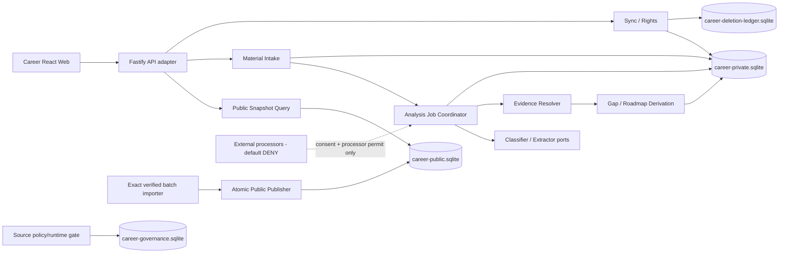

# Frontend Career Radar｜日更网页与用户分析架构评估

> - 版本：1.0
> - 日期：2026-08-26（Asia/Shanghai）
> - 项目 ID：`market-analysis-dev`
> - 工作项：`CFR-ARCH-DAILY-WEB-001`
> - 变更编号：`architecture-20260826-career-daily-web-user-analysis-001`
> - 产物 ID：`artifact-career-daily-web-user-analysis-architecture-assessment-001`
> - 入场授权：`approval-20260826-career-daily-web-user-analysis-architecture-entry`
> - 队列前置：Radar `AMR-ARCH-DAILY-WEB-001` 已交付并停 `architecture-review`
> - 写入基线：`966ef74518a097cd0412a83ae9ee2f48a2886314`
> - 停止门：`architecture-review`
> - 生产发布：冻结

## 1. 评估结论

结论为：**架构有条件可行，可在本产物获批后重新拆解公共日更与私有分析两个纵切；当前业务闭环仍为 NO-GO。**

本增量不推翻 `docs/06-release-completeness-architecture.md` v1.0，而是把已批准的日更网页与用户分析产品/UI 增量落实为更窄的实现契约：

1. 固定信息架构仍为“01 职业方向总览 → 02 技术栈全景”；公共日更证据、用户资料和个人分析均在其后。
2. 公共研究快照、私有用户材料/证据/分析、来源治理、删除账本和 seed/demo 保持五种物理边界，禁止万能 schema、跨库 `ATTACH` 或公共/私有混写。
3. `output/daily/2026-08-25.json` 可作为内容寻址、一次性人工核验输入，发布后只能成为 2026-08-25 历史公共快照；它不能打开来源 runtime、不能冒充 2026-08-26 今日自动更新。
4. 用户原文先形成不可变 `MaterialVersion`；分类建议先由独立 `ClassificationRequest/Job` 产生并等待用户确认，确认后的提取、证据关系、分析结果、差距与路线再分别形成追加式 revision。任何结果都必须绑定当时的原文、公共快照、规则和确认版本。
5. 正式分析采用持久化 `AnalysisRequest → AnalysisJob → AnalysisStepAttempt → AnalysisRevision` 链；重复提交、离线重放和失败重试均通过幂等键、payload hash、服务端 revision 与 CAS 收敛，不能重复建证据或覆盖上次成功结果。
6. 账号同步以 Career 独立主体和服务端单调 sync sequence 为权威；localStorage 只可做非权威 UI 缓存，不得充当跨端同步事实。
7. 导出与删除是独立、可恢复、可审计的私有操作。删除先写外部代际 tombstone，再撤权、删除活动数据、失效派生引用；恢复旧备份前必须重放删除账本，防止数据复活。
8. 第三方模型/服务默认 `DENY`。在 provider、字段、用途、区域、保留、训练、子处理方、删除、成本和本次用户 consent receipt 未冻结前，外发字节必须为 0；用户粘贴 URL 不自动访问。

当前仓库已有 Fastify 本地进程基座、loopback-only 配置、`/healthz`、诚实返回 503 的 `/readyz`、五种 SQLite migration manifest 合同和单元测试；但 manifest 明确 `database_materialized=false`、schema head=0。尚无 SQLite 业务库、账号/session、公共导入/查询、用户保存、分析 Worker、同步、导出或删除服务。前端 Source Workbench 仍是当前标签页内存预览。因此“后端能启动”和 HTTP 200 不能计为本增量完成。

## 2. 权威输入与完整性

| 输入 | 状态 | SHA-256 |
|---|---|---|
| `docs/02-daily-web-user-analysis-product-delta.md` v1.0 | 已批准 | `6f3319cdabad6dfcaf24f2ad9cba2b67e2fdde4b2596b64c177f17cf55ef5f7a` |
| `ui/14-daily-web-user-analysis-ui-design.md` v1.0 | 已批准 | `a084faf2dbcc4a5eae2489017706119c1ada68a46ca25da1aa10f40a19126ede` |
| `docs/06-release-completeness-architecture.md` v1.0 | 已批准架构基线 | `0f6cebe45056ea5171805348f1ecc92bb5ac97b7ee3b6404aa4e05cfad9e6029` |
| `output/daily/2026-08-25.json` | 已核验一次性输入，尚未入库 | `0bbc8c56794e5e14dea5780616b40729464ffdb6fa6f20ab6df25f604b9d5c6f` |
| `docs/daily/2026-08-25.md` | 人类可读研究证据 | `201c9de1fafe11e8be74349329f577d7975abb327a5a374b6a9cfa9ea61a0d67` |
| `docs/00-source-runtime-readiness.md` | 来源运行事实 | `ee6f32549187ed51939a3b2c11accf4c9cd67b9e50d3c5fbcc70c29949536dbd` |
| `backend/package.json` | 已实现本地服务基座 | `77cc30f46860d78e3e68359cac0f026d31e664b687ee6ec9bbf68f7aab93bd2a` |
| `backend/README.md` | 当前服务边界 | `76fb7eeff923302620a04199f944d536bd78a622296abdfb472d40343ae42e69` |

2026-08-25 JSON 含 8 条公共记录：4 条官方技术更新、4 条北美招聘用途样本，中国大陆招聘样本 0、用户输入 0；`collection_mode=manual_public_web_verification`，`R=0`、`runtime_enabled=false`、live connectors=0、database written=false、`CAR-END-017=rights_unresolved`、`CR-CONN-002=blocked_not_instantiated`。导入不得改变这些来源事实。

## 3. 范围与不做项

### 3.1 本评估冻结

- 一次性公共批次导入、规范化、identity/revision、证据 lineage、不可变快照及 current pointer。
- 私有原文、元数据、敏感信息确认、双轴分类、结构化提取和事实分层。
- 用户材料版本、分析作业、分步尝试、幂等重试、部分成功和失败保旧。
- 公共快照、目标、个人证据与规则的精确历史引用；差距和路线 revision。
- Career 独立账户、跨端同步、CAS/冲突、导出、删除、恢复和数据权利。
- API、错误信封、安全、隐私、第三方传输、可观测性、成本和部署边界。
- 数据、后端、前端、审查与 QA 的实现接缝及 AC-CFR-DW-01..18 阻断门。

### 3.2 明确不做

- 不执行 2026-08-25 批次导入，不物化 SQLite，不创建或应用 migration。
- 不修改来源 registry/allowlist/readiness，不启 connector/canary/runtime/调度，不联网补采。
- 不修改前端/后端/数据业务代码，不启动服务，不进行前后端联调。
- 不创建账号、真实用户材料、第三方模型请求、云资源、域名、凭证或部署。
- 不自动抓取用户粘贴 URL，不把用户材料提升为公共样本。
- 不进入任务拆解、开发、代码审查、QA 或生产发布。

## 4. 架构不变量

| ID | 不变量 | 违反结果 |
|---|---|---|
| `CDA-INV-01` | 第一层职业方向、第二层技术栈，公共日更和私有分析在其后 | 阻断实现 |
| `CDA-INV-02` | public/private/governance/ledger/seed 物理与逻辑分域 | P0 阻断 |
| `CDA-INV-03` | 每个私有键含 tenant/account；Career 主体不复用 English | P0 阻断 |
| `CDA-INV-04` | 用户正文、简历、证据、分析、差距和路线进入 CDN/Control/log/trace 的数量为 0 | P0 阻断 |
| `CDA-INV-05` | MaterialVersion、EvidenceRevision、AnalysisRevision 和已发布快照追加且不可原地覆盖 | P0 阻断 |
| `CDA-INV-06` | user-stated/user-confirmed/externally-verifiable/system-extraction/system-inference/conflict/UNKNOWN 不混写 | P0 阻断 |
| `CDA-INV-07` | 每个分析结果固定 material/public snapshot/target/evidence/rule 版本链 | 缺项只能 uncertain/not_ready |
| `CDA-INV-08` | 相同 idempotency key + 相同 payload 返回同一决定；不同 payload 返回冲突 | `IDEMPOTENCY_KEY_REUSED` |
| `CDA-INV-09` | 分析重试新增 step attempt，不重复成功步骤或覆盖上次成功 revision | 事务回滚/409 |
| `CDA-INV-10` | sync 以服务端 revision/sequence 为权威，客户端时间不参与 LWW | `REVISION_CONFLICT` |
| `CDA-INV-11` | 公共快照引用固定 snapshot SHA；历史不得静默跟随 current pointer | 历史查询失败而非漂移 |
| `CDA-INV-12` | manual verified import 不改变 runtime_enabled；approved_static 与 runtime live pointer 按模式/环境隔离 | 不得移动 live pointer 或冒充 connector |
| `CDA-INV-13` | 2026-08-26 无成功快照时，8 月 25 日批次不得标“今日” | truth 为 stale/not_ready/failed |
| `CDA-INV-14` | URL-only 分析请求外部网络字节为 0；第三方处理默认 DENY | `EXTERNAL_PROCESSING_NOT_AUTHORIZED` |
| `CDA-INV-15` | 删除先记 tombstone/generation，旧备份恢复前必须重放 | readiness fail closed |
| `CDA-INV-16` | 导出制品 private/no-store、短 TTL、一次性下载，不经静态 CDN | P0 阻断 |
| `CDA-INV-17` | failed/partial 不丢原文和上次成功结果，不静默回退 Demo | 操作错误并列返回 |
| `CDA-INV-18` | empty≠not_ready、UNKNOWN≠0、HTTP 200≠业务 ready/completed/live | 契约测试阻断 |

## 5. 继承技术栈与当前差距

| 层 | 冻结选择 | 本增量边界 |
|---|---|---|
| Web | React 19 + TypeScript + Vite + React Router | 九页正式模式只读服务信封；现有内存预览保留为明确 preview |
| HTTP | Node >=22.12 + TypeScript strict + Fastify | 继承现有 loopback 基座；业务路由必须 JSON Schema/OpenAPI 校验 |
| 本地持久化 | 五个独立 SQLite，WAL/FK/busy timeout | manifest 已有、schema head=0；driver/query layer 仍 TBD |
| 后台任务 | 同进程 Worker + DB lease/outbox + fake clock | 本地不引入 Redis/外部队列；分析必须可重启恢复 |
| 领域边界 | Repository/UnitOfWork/Clock/Hasher/Processor ports | 领域不得依赖 Fastify/SQLite/React/外部模型 |
| 测试 | Vitest + Fastify inject + 临时真实 SQLite + Playwright | Mock 不替代迁移、重启、并发、跨账号、删除恢复证据 |

当前可复用：显式 `PORT`/`DATA_DIR`、仅 `127.0.0.1` 监听、优雅启停、health/readiness 信封、migration manifest checksum/path/symlink 防护和五库命名。当前缺失：数据库 materializer、migration executor、Repositories、session、public importer/publisher/query、private material/profile、analysis worker、sync/export/delete API、outbox、备份恢复及 E2E。

## 6. 总体架构与依赖方向



允许依赖方向：delivery adapter → application use case → domain → ports；infrastructure 只实现 ports。公共快照可被私有分析按 ID/hash 引用，私有域不得写公共域；Control 不在业务运行 DAG 中。

## 7. 数据 owner、存储与写权限

| 数据类 | 权威 owner | 权威存储 | 派生缓存 | 允许写者 |
|---|---|---|---|---|
| SourcePolicy/RuntimeRegistration/permit/audit | Career 来源治理 owner | `career-governance.sqlite` + 获批 Git bundle | 脱敏治理投影 | 受控治理 use case |
| ImportBatch/Observation/PublicEventRevision/Evidence/PublicSnapshot | Career 公共研究域 | `career-public.sqlite` | 查询索引、无用户差异公共制品 | Importer/Publisher |
| Material/MaterialVersion/ClassificationRevision | 当前 Career 用户主体 | `career-private.sqlite` | 请求级/设备级非权威草稿缓存 | 同租户 material use case |
| PersonalEvidenceRevision/ConfirmationRevision | 当前 Career 用户主体 | `career-private.sqlite` | profile read model | 同租户 evidence use case |
| ClassificationRequest/Job、AnalysisRequest/Job/StepAttempt/Revision | 当前 Career 用户主体 | `career-private.sqlite` | 处理状态 read model | Classification/Analysis Coordinator/Worker |
| Target/Gap/Roadmap revisions | 当前 Career 用户主体 | `career-private.sqlite` | 当前视图 | Growth Derivation use case |
| SyncChange/Outbox/OperationReceipt | Career 私有同步 owner | `career-private.sqlite` | 设备 cursor | 同一事务内业务 use case |
| Tombstone/DeletionGeneration | Career 隐私 owner | `career-deletion-ledger.sqlite` + 外部单调锚点 | 删除进度视图 | Delete/Restore use case |
| ExportJob/ExportArtifact metadata | Career 用户主体 | `career-private.sqlite`；制品在受控本地临时区 | 一次性下载 | Export use case |
| seed/demo | Career demo owner | `career-seed-demo.sqlite` | Demo UI | demo loader；正式模式禁读 |

用户原文和敏感字段使用应用层 envelope encryption；密钥 provider/轮换仍 TBD。正文哈希也属于私有可关联数据，不得进入 Control 或普通指标。

## 8. 公共日更快照纵切

### 8.1 一次性核验批次导入

计划中的受控内部命令（当前 `NOT_IMPLEMENTED`，本轮不运行）：

```text
npm run import:verified-batch -- \
  --input <repo-relative-approved-path> \
  --expected-sha256 <64-lowercase-hex> \
  --batch-date 2026-08-25 \
  --importer-revision <content-addressed-revision> \
  --actor <approved-internal-actor> \
  --idempotency-key <opaque-key>
```

安全顺序：锁定允许的 repo-relative path → `lstat/open(O_NOFOLLOW)/fstat/realpath` → 从已打开 handle 读 exact bytes → 前后复核 inode/size/mtime → 计算 SHA → strict schema/字段宽度/URL/时间/rights 校验 → 8 条 staging → 在 `career-public.sqlite` 单事务写 `ImportBatch`、Observation、identity/revision、evidence 与审计。任一变化整批隔离。

幂等身份为 `(input_sha256, schema_version, importer_revision)`；相同身份复用既有结果，不重复 8 条事实。用户给出的 idempotency key 只约束请求，不替代内容身份。

### 8.2 公共 identity、revision 与快照

技术事件 identity 至少含 publisher + canonical project + release/tag/commit + event kind；招聘事件至少含 employer/ATS + external job ID/canonical URL + region + role family。输入 `id` 只作 lineage，标题不能单独决定 identity。

变化生成 `PublicEventRevision`；岗位下架/页面不可用形成 status revision，不删除历史。`published_at=null` 保持未知，只使用 `observed_at` 表达 8 月 25 日可访问，不以导入时间补造发布日期。

`PublicSnapshot` manifest 至少覆盖：

- snapshot_id/date/timezone/schema/rule/importer revision；
- 有序 `(event_id,event_revision,evidence_ids)`；
- source/version/as_of/observed_at/last_success/freshness/coverage/rights；
- input batch SHA、record count、technology=4、recruitment=4、mainland China=0；
- acquisition mode=`manual_verified_import`、runtime_enabled=false、live_connectors=0；
- `content_mode=approved_static|live`、environment、previous snapshot/mode-scoped pointer expected revision、完整 manifest SHA。

发布在单一 public DB 事务中写 snapshot/items/manifest/audit，再以 revision CAS 移动 `(content_mode, environment)` 唯一 pointer。2026-08-25 人工批次只允许移动 `approved_static/local` pointer，绝不创建或移动 `live/*` pointer；正式查询不得静默从 live 回退 approved_static。失败不产生半快照、不移动任一 pointer。2026-08-26 查询必须把 8 月 25 日显示为历史/上次成功，并以 `content_mode=approved_static` 和 `truth=stale`（或因依赖未就绪为 `not_ready`）表达，不能标今日或 live。

## 9. 私有原文、版本和分类

### 9.1 核心对象

| 对象 | 关键字段 | 不变量 |
|---|---|---|
| `Material` | tenant/account/material_id、current_version、revision、storage_scope | 资源壳不承载可变正文 |
| `MaterialVersion` | version_id、body_ciphertext、body_sha256、unicode_count、metadata、created_at | 创建后不可更新；1..100000 Unicode |
| `SensitiveDataDecision` | detected categories、user action、policy revision、receipt | 未确认不得进入后续处理 |
| `ClassificationSuggestion` | source_channel/content_type 两轴、basis、confidence、rule/model revision | 建议不是用户确认 |
| `ClassificationDecisionRevision` | 两轴确认/纠正、base revision、actor、reason | 每次确认追加 revision |
| `MaterialRelationRevision` | added/supports/duplicate/conflict/insufficient/not_applicable | 每候选在同 revision 内互斥 |

空白、URL-only、超长或非法 Unicode 在保存前返回字段错误。URL 仅作为用户提供元数据保存，不触发 HTTP/DNS。`ephemeral_user` 和 `private_user` 在处理前冻结；ephemeral 不进入长期档案、跨设备或导出，TTL 清理必须可验证。

### 9.2 事实分层

每个提取项保存原文位置（字符区间 + version hash）、依据、置信度、rule/model revision 与状态。允许层级：`system_extraction`、`user-stated`、`user-confirmed`、`externally-verifiable`、`system_inference`、`conflict`、`UNKNOWN`。升级 externally-verifiable 必须追加独立核验记录，用户点击确认不能直接升级。

招聘/文章材料只能进入 `user_provided_purpose_sample`，不进入公共招聘分母、方向排名或趋势。任何公共候选转化必须脱离用户身份并重新走来源政策与证据审核。

## 10. 分类与分析作业、幂等及失败恢复

### 10.1 两阶段作业身份链

```text
MaterialVersion
  → ClassificationRequest
    → ClassificationJob
      → ClassificationStepAttempt
    → ClassificationSuggestion
  → awaiting_confirmation
  → ClassificationDecisionRevision
  → AnalysisRequest
    → AnalysisJob
      → ExtractionStepAttempt
      → RelationStepAttempt
      → MarketComparisonStepAttempt
      → GapStepAttempt
      → RoadmapStepAttempt
    → AnalysisRevision
```

`ClassificationRequest` 固定 tenant/account、material version ID/hash、classification rule/model revision、processor permit/consent revision 或 NONE、locale/timezone 和 payload hash。它只生成两轴建议，不生成个人证据、差距或路线。用户确认/纠正后产生不可变 `ClassificationDecisionRevision`；没有该 revision 时禁止创建 AnalysisRequest。

`AnalysisRequest` 固定：tenant/account、material_version_id/hash、classification decision revision、target revision、public snapshot ID/hash、evidence set hash、analysis rule bundle ID/hash、processor policy/consent revision、locale/timezone、normalized payload hash。

逻辑作业 identity：

```text
sha256(tenant_id | account_id | material_version_sha256 |
       classification_revision | target_revision |
       public_snapshot_sha256 | evidence_set_sha256 |
       analysis_rule_bundle_sha256 | processor_permit_sha256_or_NONE)
```

API 幂等唯一键为 `(tenant_id, account_id, operation_kind, resource_id, idempotency_key)`：

- 同 key + 同 payload hash：返回同一 AnalysisRequest/Job/终态，不新建证据。
- 同 key + 不同 payload hash：409 `IDEMPOTENCY_KEY_REUSED`。
- 同逻辑 identity + 新 key：可复用已有 completed revision；若 running 返回既有 job；若 failed 则按 retry policy 新增 attempt。

### 10.2 状态、租约与重试

聚合 UI 状态可按产品显示 `saved → classifying → awaiting_confirmation → analyzing → partial|completed|uncertain|failed`，但持久化上分类和分析是两个 job：ClassificationJob 终态为 `suggested|failed|cancelled`；AnalysisJob 终态为 `partial|completed|uncertain|failed|cancelled`。二者各自 `status_revision` CAS、DB lease、fencing token 和 heartbeat。进程崩溃后，过期 lease 只允许新 attempt 接管，旧 Worker 的 fence 不能提交。

每个 step attempt 保存 input hash、processor/rule revision、started/completed、outcome、safe error、result hash。自动重试仅限明确 retryable 的内部错误，次数/退避有界；校验、权限、consent、revision、证据不足不自动重试。

失败恢复：

- 保存失败：不进入分类/分析，保留前端未提交文本但不得声称已保存。
- 分类失败：原文已保存，ClassificationJob 为 failed，可重试同 material version；未产生用户确认 revision，分析保持不可创建。
- 后续步骤失败：成功步骤 immutable，状态 partial；仅重试失败/受影响步骤。
- 发布 AnalysisRevision 失败：上次成功 current pointer 保持；新 attempt 可重放。
- processor 超时/撤销：取消请求、丢弃迟到响应；未获 permit 时外发字节为 0。
- evidence/target/public snapshot 变化：旧 job 不改输入；新请求生成新 revision 并说明原因。

`completed` 只表示固定输入与规则下全部必需步骤完成，不表示材料外部真实、用户掌握或就业结果确定。

## 11. 历史引用、差距与路线

每个 `AnalysisRevision/GapRevision/RoadmapRevision` 至少固定：

```text
tenant_id + account_id
material_id + material_version_id + material_version_sha256
classification_decision_revision
public_snapshot_id + public_snapshot_sha256
target_id + target_revision
sorted personal_evidence_revision_ids + evidence_set_sha256
analysis_rule_bundle_id + version + sha256
processor_policy_revision + consent_receipt_id_or_NONE
analysis_job_id + result_sha256 + created_at + supersedes_revision
```

历史 API 不解析 current aliases，只按上述版本键读取；公共 snapshot hash 不匹配返回 `HISTORICAL_REFERENCE_MISMATCH`，不得静默换成最新快照。公共快照因权利撤回而不可展示受限内容时，保留最小 manifest/引用证明并标 `content_redacted`，历史结论保持当时版本且不冒充当前。

差距门要求：已确认目标 + 可用公共快照 + 用户确认/可核验证据。任一缺失/冲突时生成 `uncertain/evidence_required`，不生成伪精确能力分数。路线每一步绑定目标能力、证据产物、完成判定、依赖、投入区间、市场依据和复评条件。新输入只生成新 revision；旧版本可回看。

## 12. Career 独立账户与跨端同步

- 公共研究允许匿名 GET；保存、分析、同步、导出、删除要求 Career account subject。
- Cookie 使用 Career API host-only `Secure; HttpOnly; SameSite=Lax` 候选；禁止 `Domain=.parent`、跨项目 Cookie、English subject 和 localStorage token。
- CORS 只允许当前环境精确 Career 用户域；credentials 时禁止 `*`。状态变更要求 CSRF token + Origin/Referer 校验。
- 私有资源主/FK/唯一键含 `(tenant_id, account_id, resource_id)`；跨账号按安全语义返回 404/forbidden，不能泄漏存在性。

每次私有事务同时写业务 revision、append-only `SyncChange(server_sequence, resource_type, resource_id, revision, operation_id, safe_delta)` 和 outbox。同步 cursor 是服务端签发的 opaque token，绑定 account、上次 sequence、schema 和 expiry；客户端不能自造 sequence。

`GET /sync/delta?cursor=` 返回稳定分页、tombstone、next cursor 和 snapshot revision。离线写携带 `base_revision + idempotency_key`：匹配则提交；不匹配返回 409、current revision 和不含正文的安全 diff metadata/rebase token。客户端可显式选择合并、保留双方或放弃；不得用客户端时间 LWW。

浏览器 localStorage/sessionStorage/IndexedDB 最多缓存筛选、滚动和加密离线草稿提示；服务器仍是已保存/已同步/分析状态的唯一权威。缓存清空不得删除服务器数据，缓存存在不得证明同步成功。

## 13. 导出、删除与数据权利

### 13.1 导出

原始材料包与分析结果包是两个可并行、独立授权的 `ExportJob`。创建时固定 account revision snapshot、对象清单、schema、format、rights filters 和 idempotency key；Worker 生成后记录 artifact hash、size、expiry、download count。

- 人类可读与机器可读包必须标事实层、原文/分析/市场快照/规则版本。
- 第三方材料按用户权利与来源边界处理，不能因导出公开再分发。
- 下载使用短 TTL、一次性随机 token、`Cache-Control: private, no-store` 和 `Content-Disposition` 安全文件名。
- 制品不进 Git、静态 CDN、普通备份或日志；到期/删除后不可访问。

### 13.2 删除状态机

单资源：`step-up/CAS → ledger tombstone+generation → session-visible deny → private current 失效 → 活动密文删除 → 引用派生标 recompute_required → export cleanup → receipt`。

账号：`step-up → 幂等 operation → 立即撤销 session/token → 冻结写 → ledger account tombstone/generation → 活动私有数据/导出 24h 内删除 → 备份最长 30 天到期 → 最小删除回执`。

删除失败保持 `deletion_in_progress/failed`，默认拒绝相关读取；重试复用 operation，不重复增加不一致 generation。恢复私有备份必须先加载外部单调 deletion anchor，重放所有较新 tombstone，验证已删 account/material/evidence/analysis/export 可见数为 0，再原子替换。缺 anchor/ledger、generation 倒退、hash 不符或数据复活一律 readiness=false。

## 14. 第三方处理与隐私传输

默认只允许本地确定性规则/解析器。第三方 ProcessorPermit 必须绑定：provider 法体、endpoint、用途、字段 allowlist、数据区域、加密、保留、训练/人工审阅、子处理方、删除、审计、预算、processor revision、到期和用户 `ConsentReceipt`。

发送前执行：同账号 consent 未撤销 → permit active 且精确 revision → 敏感字段扫描/最小化/脱敏 → 字节预算 → request audit。响应只能作为 `system_extraction/system_inference`，携 model/revision/confidence；不能升级公共事实或 externally-verifiable。

当前 provider、条款、区域、保留、训练、预算和凭证均 `UNKNOWN`，因此 `external_processing_enabled=false`、第三方发送数=0。用户撤回 consent 后阻断新发送并按合同发起删除；历史结果保留撤回事实并按数据权利策略处理。

## 15. API 合同

### 15.1 信封

继承三类正交信封：

```text
ResearchContentEnvelope<T> {
  project_id, content_mode, truth,
  public_snapshot_id, source, version, as_of, observed_at,
  last_success_at, freshness, coverage, data, errors
}

PrivateResourceEnvelope<T> {
  project_id, storage_scope, tenant_id, account_id,
  resource_id, revision, sync_state, deletion_generation,
  data, errors
}

OperationEnvelope<T> {
  project_id, request_mode, operation_id, analysis_job_id?,
  status, status_revision, impact_scope, data, errors
}
```

未知为 `null/UNKNOWN`，不是 0。用户分析信封不能用 `live` 表示完成；public live、private synced 和 operation completed 是不同轴。

### 15.2 最小 API

| 方法/路径 | 信封 | 核心合同 |
|---|---|---|
| `GET /healthz` | Operation | 现有进程存活；不证明数据库/分析 ready |
| `GET /readyz` | Operation | 分 api_schema/public_db/private_db/ledger/worker/account/processor；当前 503 |
| `GET /api/v1/research/snapshots/current?content_mode=` | Research | mode-scoped current manifest/ETag；禁止 live 静默回退 approved_static |
| `GET /api/v1/research/snapshots/{id}` | Research | exact immutable snapshot/hash，不回退 current |
| `GET /api/v1/directions` | Research | 固定第一层、snapshot-bound cursor |
| `GET /api/v1/capabilities` | Research | 固定第二层、方向/层级/证据查询 |
| `GET /api/v1/evidence` | Research | 技术/招聘分域、地区/层级/n/N/rights |
| `GET /api/v1/sources/quality` | Research | policy/runtime 双轴与真实水位 |
| `POST /api/v1/session` | Operation | Career 独立主体、host-only Cookie |
| `POST /api/v1/materials` | Private | 保存模式、正文、双轴元数据、敏感确认、幂等 |
| `GET /api/v1/materials/{id}/versions` | Private | exact history；正文按权限返回 |
| `POST /api/v1/materials/{id}:classify` | Operation | 固定 material version、分类规则/processor、幂等，返回 ClassificationJob |
| `PATCH /api/v1/materials/{id}/classification` | Private | `If-Match`、两轴确认追加 revision |
| `POST /api/v1/materials/{id}:analyze` | Operation | 必须已有 ClassificationDecisionRevision；固定全部输入版本、幂等、返回 job |
| `GET /api/v1/analysis-jobs/{id}` | Operation | 状态/steps/errors/last success；无伪百分比 |
| `POST /api/v1/analysis-jobs/{id}:retry` | Operation | 仅失败/受影响 steps，新 attempt，幂等 |
| `GET /api/v1/analyses/{id}/revisions/{revision}` | Private | exact input/reference chain |
| `GET/POST/PATCH/DELETE /api/v1/personal-evidence...` | Private | 租户复合约束、CAS、tombstone |
| `GET/PUT /api/v1/targets...` | Private | target revision/CAS |
| `POST /api/v1/gaps:recompute` | Operation | 三条件与版本链齐全才生成 revision |
| `GET/PATCH /api/v1/roadmaps...` | Private | 历史、暂停/恢复/调整，CAS |
| `GET /api/v1/history` | Private | exact snapshot/material/evidence/rule references |
| `GET /api/v1/sync/delta` | Private | server sequence cursor、tombstones、稳定分页 |
| `POST /api/v1/exports` | Operation | scope 分离、异步、短 TTL/no-store |
| `GET /api/v1/exports/{id}/download` | Operation | 一次性 token、权限/expiry/hash |
| `DELETE /api/v1/materials/{id}` | Operation | step-up/CAS/generation/receipt |
| `DELETE /api/v1/account` | Operation | 立即撤权、24h/30d 进度、幂等 |

所有私有状态变更要求身份、CSRF、幂等和 `If-Match`（create-only 用 `If-None-Match:*`）。分页 cursor 固定 snapshot/revision/query hash；跨版本返回 409，不拼页。

### 15.3 错误信封与稳定错误码

```text
ErrorEnvelope {
  schema_version, code, message_zh_cn,
  impact_scope, retryable, occurred_at, request_id,
  source, version, as_of, observed_at, last_success_at,
  freshness, coverage, revision, safe_details
}
```

至少包括：`DEPENDENCY_NOT_READY`、`IMPORT_INPUT_MISMATCH`、`SNAPSHOT_REFERENCE_MISMATCH`、`HISTORICAL_REFERENCE_MISMATCH`、`MATERIAL_VALIDATION_FAILED`、`SENSITIVE_CONFIRMATION_REQUIRED`、`ANALYSIS_INPUT_INCOMPLETE`、`ANALYSIS_JOB_LEASE_LOST`、`ANALYSIS_PARTIAL`、`IDEMPOTENCY_KEY_REUSED`、`REVISION_CONFLICT`、`TENANT_SCOPE_FORBIDDEN`、`EXTERNAL_PROCESSING_NOT_AUTHORIZED`、`CONSENT_REQUIRED`、`EXPORT_EXPIRED`、`DELETION_IN_PROGRESS`、`RESTORE_TOMBSTONE_REPLAY_FAILED`。

错误不含正文、简历、原始 URL query、Cookie、Token、processor payload、完整堆栈或可反查账号的原始 ID。

## 16. 安全、缓存与可观测性

### 16.1 安全

- 请求体/Unicode/压缩炸弹、XSS、CSV/公式注入、路径穿越、symlink、ReDoS、SQL 注入、SSRF、越权、资源耗尽均有负测。
- 原文按纯文本处理，渲染时转义；用户 HTML/Markdown 中脚本、远程图片和链接预取默认禁用。
- 导入文件与 migration 沿用 handle-based exact bytes、no-follow、根路径和前后指纹校验。
- DB 文件最小权限；private/ledger/exports 使用独立目录和密钥边界，路径/密钥均不进 Git。
- 来源 Worker、私有 API 和导出 Worker 使用不同能力；浏览器不能签发 NetworkRequestPermit/ProcessorPermit。

### 16.2 缓存

- Hash JS/CSS/font/image 可长缓存；HTML 不 immutable。
- 公共 snapshot API 可用 ETag，但默认 API no-store；只有审查确认无用户差异的版本化公共制品才可 CDN 缓存。
- 私有 API、Cookie 响应、分析状态、sync、错误、health/readiness、导出全部 `private, no-store`，静态 CDN 永不承载。
- 设备缓存非权威、可删除；cache freshness 不能替代 server revision/snapshot truth。

### 16.3 日志与指标

允许字段：request/operation/job/attempt IDs、匿名 account hash、material ID 的请求级安全别名、public snapshot ID、rule/processor revisions、状态、错误码、耗时/字节桶。禁止正文、摘要、证据文本、正文哈希、原始 URL、Cookie、Token、consent 内容和导出文件名。

最低指标：保存/分类/分析作业与 step outcome、幂等复用/冲突、lease recovery、revision conflict、sync lag、export created/downloaded/expired、delete state、tombstone replay、跨租户拒绝、第三方 outbound bytes（当前必须为 0）、public snapshot age/coverage。

## 17. 事务、迁移、备份与成本

- 五库各自独立 migration stream/checksum；当前 manifest schema head=0、未物化。任何 pending/failed migration 使对应 readiness component=false。
- public snapshot+manifest+items+pointer、private resource+revision+sync change+outbox、analysis revision+current pointer、ledger tombstone+generation 各自在单库事务中原子提交。
- 不做跨库分布式事务；public/private 引用只用 ID+hash，失败由 operation/outbox 幂等补偿。
- SQLite online backup 或停写快照；不得复制活跃 WAL 文件冒充备份。恢复先隔离校验，再 ledger 重放和原子替换。
- 本地成本以单进程 Fastify/Worker + 五库 SQLite 为上限；外部模型、对象存储、队列、邮件、云数据库默认不引入。
- 生产数据库、容量、并发、RPO/RTO、密钥、身份 provider、模型、预算、正式域名、端口和云厂商继续 TBD/UNKNOWN；未解决不能形成生产承诺。

## 18. 数据/后端/前端实现接缝

| Owner | 首批责任 | 必须交出的真实证据 | 禁止替代 |
|---|---|---|---|
| 固定 08 数据 | 五库 schema/migration、导入、identity/revision、public snapshot、private revisions/ledger | 临时真实 SQLite、migration/replay/hash/失败保旧 | CSV/JSON/Mock 代数据库 |
| 固定 07 后端 | session、Repositories、API、analysis jobs/worker、sync/export/delete | Fastify inject + SQLite integration + restart/concurrency | health 200 代业务 ready |
| 固定 06 前端 | 九页真实 API adapter、全状态、版本/冲突/权利交互 | 浏览器 E2E、刷新恢复、简中/响应式/无障碍 | 当前标签页回显代保存/分析 |
| 固定 09 审查 | 隔离、幂等、lease、历史、第三方/删除边界 | P0/P1=0 | 只读 happy path |
| 固定 10 QA | AC-01..18、跨账号、重启、部分失败、导出删除恢复 | 真实 API+DB+浏览器、fake clock、负测 | 设计/seed/demo 计完成 |

建议拆成两个独立实现纵切并各自评审：A）2026-08-25 公共批次 → SQLite → 不可变历史快照 → 方向/技术栈/证据查询；B）Career session → MaterialVersion → 分类确认 → 本地确定性分析 job → Evidence/Gap/Roadmap revision → sync/export/delete。两者通过版本化 public snapshot 引用连接，不共享事务或万能模型。

## 19. 验证矩阵与 AC 映射

| 层 | 正向验证 | 必须失败的反例 |
|---|---|---|
| Public import | exact SHA、8 records、4+4、rights/time、幂等 | 读取中变化、重复行、错 SHA、未知发布时间被补造 |
| Public snapshot | immutable manifest、pointer CAS、8/25 历史 | 8/26 标今日、失败移动 pointer、manual import 打开 runtime |
| Material persistence | 1..100000、刷新/重启恢复、immutable versions | URL-only 外部字节>0、浏览器内回显冒充保存 |
| Classification/evidence | 双轴确认、原文定位、七态事实层 | confirmed=verified、提取/推断称已掌握 |
| Classification/Analysis jobs | 两阶段、确认硬门、stable identity、step attempts、lease/fence、部分重试 | 无确认启动分析、同 key 不同 payload 接受、重复证据、迟到 Worker 提交 |
| History | exact material/snapshot/evidence/rule hashes | exact version 缺失时回退 current、旧结果静默改写 |
| Gap/roadmap | 三条件齐全、UNKNOWN、版本变化重算 | 缺输入仍出分数/路线、北美 4 样本外推中国 |
| Account/sync | 复合 tenant FK、server sequence、CAS/rebase | 跨账号读写、客户端时间 LWW、父域 Cookie |
| Third party | permit+consent+minimization，撤回阻断 | 未授权发送、URL 抓取、正文进入 log/Control/CDN |
| Export/delete | scope 分离、no-store、step-up、generation | 一次性 token 重放、只删 UI、旧备份复活 |
| Failure keeps old | DB busy/crash/processor timeout 后原文与上次成功保留 | 失败清空档案或静默切 Demo |
| Frontend E2E | 01→02、九页、七公共+九分析态、320/390/200%、键盘/读屏 | disabled/目标态/HTTP200 对完成率贡献>0 |

| 产品 AC | 架构落点 |
|---|---|
| AC-CFR-DW-01..05 | 第 8 节公共导入、identity/revision、快照、日期与失败保旧 |
| AC-CFR-DW-06..10 | 第 9–10 节 MaterialVersion、双轴、原文定位、事实分层、幂等 |
| AC-CFR-DW-11..15 | 第 11 节公共快照/目标/证据/规则版本链、差距与路线历史 |
| AC-CFR-DW-16 | 第 10 节 partial/failed、step retry、上次成功保留 |
| AC-CFR-DW-17 | 第 18–19 节前端接缝、简中/响应式/无障碍 E2E |
| AC-CFR-DW-18 | 第 5、18–20 节真实 DB/API/浏览器/审查/QA 联合完成门 |

## 20. TBD、阻断门与重审触发

| TBD / 风险 | 解决 owner / 最晚门 | 未解决时阻断 |
|---|---|---|
| SQLite driver/query layer、首个 schema/repository revision | 固定 08/07，固定 05 复核；首个 DB 任务前 | 数据/后端实现 |
| Career identity provider、session TTL、step-up、recovery | 产品+05/07/09；私有服务前 | 保存/同步/导出/删除 |
| envelope encryption/KMS/轮换与本地密钥方案 | 07/09/11；任何真实用户数据前 | private_saved |
| 本地 API 固定端口与 DATA_DIR 约定 | 07/11；联调前 | 常驻联调入口 |
| 分析规则 bundle v1、确定性处理范围和资源预算 | 03/05/07/08；分析任务 DoR | analysis completed |
| 第三方 processor/条款/区域/训练/保留/预算 | 产品/隐私/采购；任一外发前 | 外发字节保持 0 |
| CAR-END-017 权利和 R>=1/coverage policy | 来源/产品/权利 owner；runtime 前 | 招聘 runtime/live |
| 导出 TTL/格式、账号删除/备份具体执行配置 | 产品/隐私/07/08/11；数据权利实现前 | export/delete QA |
| 容量、并发、sync SLO、RPO/RTO 实测 | 05/08/10/11；staging 前 | 生产容量/恢复承诺 |
| 正式域名/CDN/API/origin/internal、证书/WAF/预算 | 11+owner；部署方案前 | 所有部署 |

以下变化必须重审：自动 URL 抓取、文件上传、外部模型、跨项目 SSO/身份、父域 Cookie、Control 读取私有数据、公共/私有共库、删除期限变化、从 SQLite 迁移、多写节点/队列/对象存储、允许离线自动合并、修改 01→02 信息架构、改变 public snapshot 或历史不可变性、进入生产。

## 21. 被拒绝方案

| 方案 | 拒绝原因 |
|---|---|
| 前端直接读取 daily JSON | 无服务、事务、版本、账号或历史；不能证明持久化 |
| 公共研究与私有用户共库/万能 schema | 扩大泄漏、备份、查询与权限半径 |
| Material 表原地覆盖正文 | 历史分析无法还原，编辑会漂移旧结论 |
| 一个 `analysis_status` 行覆盖全部尝试 | 无 step 证据、无法幂等重试或崩溃恢复 |
| 重试重新跑全部步骤并覆盖 current | 重复外发/证据/成本，破坏上次成功结果 |
| 以 localStorage 作为同步事实 | 用户可改、跨设备不可收敛、清缓存即丢数据 |
| 客户端时间 LWW | 时钟漂移会静默覆盖已确认历史 |
| 用户确认自动升级 externally-verifiable | 混淆自述、确认与外部核验 |
| 用户招聘材料并入公共样本 | 污染市场分母，泄露身份与权利上下文 |
| 粘贴 URL 自动抓取 | 绕过 consent、SSRF、登录/rights/robots 边界 |
| 未经 permit/consent 调第三方模型 | 隐私、条款、训练、区域和成本未知 |
| 导出走静态 CDN | 私有内容可缓存、复用和绕过撤权 |
| 删除只删活动表 | outbox/分析/导出/备份可继续泄漏或复活 |
| HTTP 200/health/设计目标态算业务完成 | 混淆进程、UI 和真实闭环 |

## 22. 完成门与停止门

只有以下全部成立，才能解除本增量实现冻结：

1. exact 2026-08-25 SHA 导入、8 条 lineage、不可变历史快照和 8/26 日期边界通过。
2. Career session、真实 SQLite material/version/evidence/analysis/job/sync/ledger 数据重启可恢复。
3. 分析幂等、lease/fence、partial/retry、历史版本链和失败保旧通过。
4. 跨账号读取/写入为 0，host-only Cookie/CORS/CSRF/CAS 通过。
5. 第三方默认 DENY、URL-only 网络字节 0、正文不进公共/CDN/Control/log/trace。
6. 导出 no-store/过期/撤权与删除 generation/旧备份防复活通过。
7. 前端九页接入真实信封，01→02、全简中、响应式、无障碍和全状态 E2E 通过。
8. 独立代码审查 P0/P1=0，QA 覆盖 AC-CFR-DW-01..18 且 must_fix=0。

本产物只完成 `CFR-ARCH-DAILY-WEB-001` 架构评估。状态停在 `architecture-review`；不得自动进入重新拆解、数据、后端、前端、真实来源、第三方处理、服务、部署或生产。
