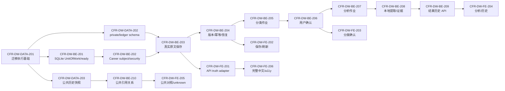

# Frontend Career Radar｜真实用户分析最短可见纵切任务拆解

> 版本：1.0
>
> 日期：2026-08-26（Asia/Shanghai）
>
> 项目 ID：market-analysis-dev
>
> 工作项：CFR-PM-DAILY-WEB-001
>
> 变更编号：plan-20260826-career-daily-web-user-analysis-001
>
> 产物：artifact-career-daily-web-user-analysis-task-breakdown-001
>
> 入场授权：approval-20260826-career-daily-web-user-analysis-task-breakdown-entry
>
> 上游批准：approval-20260826-career-daily-web-user-analysis-architecture-v1
>
> 停止门：task-breakdown-review
>
> 当前状态：待审核；所有下游工作项均为 planned-not-authorized
>
> 生产发布：冻结

## 1. 管理结论：最短可见的真实用户分析纵切

本拆解将“信息源工作台不能只作当前标签页预览”收敛为下列最短、诚实的本地纵切：

1. 用户主动粘贴 1–100,000 Unicode 的材料后，服务端在 Career 私有域创建不可变的 `MaterialVersion`；刷新页面或重启后，用户只能经真实 API 读取同一版本、哈希与保存时间，浏览器内存、localStorage 或原样回显不得冒充保存。
2. 服务端基于实际原文发起独立的双轴分类作业，返回来源渠道与内容类型建议、依据和置信度；用户确认或纠正后才形成追加式 `ClassificationDecisionRevision`，未确认时不得启动分析。
3. 分析作业读取该真实原文和已确认分类，以本地确定性规则/解析器形成可回链的提取、事实层、证据关系与未知项；外部模型、用户 URL 访问和网络字节均为 0。没有可用公共快照、目标或已确认个人证据时，市场对照、差距和路线必须显示 `not_ready` 或 `uncertain`，不能伪造结论。
4. 已完成、部分完成和失败的分析均追加 `AnalysisRevision`，固定当时的材料、分类、公共快照、证据集合与规则版本；历史 API 和完整简体中文页面能按精确版本回看，失败保留原文及上次成功结果。
5. 导出、删除与恢复不是把按钮做出来即完成：它们保留为独立的后续原子任务和数据权利门。任何真实导出、真实删除、账户权限或外发仍需届时的具体授权。

公开日更批次与私有用户材料保持分库、分权限、分 truth 状态。已核验的 2026-08-25 批次可在后续受控导入后成为 `approved_static/local` 历史快照；它不打开来源 runtime，也不得被改标为 2026-08-26 的“今日”。本轮拆解本身不实现、不写数据库、不调用外部分析、不启动服务或部署。

唯一首个候选开发工作项为 **CFR-DW-DATA-201**，由固定 08 数据工程师执行，预估 4 小时。它只把已批准的五个 SQLite 物理边界从 manifest 合同扩展为可在隔离临时目录验证的迁移执行基础；它不保存用户原文、不导入真实批次、不启用运行时。该项只有在本拆解审核通过、输入不漂移、固定 08 无 WIP 冲突且工作树安全时，才能按一跳规则单独登记入场；当前仍是 planned-not-authorized。

## 2. 权威输入、当前事实与历史边界

| 输入 | 版本／状态 | SHA-256 | 本轮使用方式 |
|---|---|---|---|
| docs/08-daily-web-user-analysis-architecture-assessment.md | v1.0，已批准 | d2993ba8a8be4a57d0f9188028f4e982c70d0c355d9464a8758cc4dd969c4e31 | 公共/私有隔离、版本、作业、隐私与 API 的架构边界 |
| docs/02-daily-web-user-analysis-product-delta.md | v1.0，已批准 | 6f3319cdabad6dfcaf24f2ad9cba2b67e2fdde4b2596b64c177f17cf55ef5f7a | 用户流程、18 条阻断验收和真实状态定义 |
| ui/14-daily-web-user-analysis-ui-design.md | v1.0，已批准 | a084faf2dbcc4a5eae2489017706119c1ada68a46ca25da1aa10f40a19126ede | 九页简体中文、工作台、历史、权利与无障碍接缝 |
| docs/06-release-completeness-architecture.md | v1.0，已批准基线 | 0f6cebe45056ea5171805348f1ecc92bb5ac97b7ee3b6404aa4e05cfad9e6029 | 已批准发布完整性边界 |
| output/daily/2026-08-25.json | 已核验一次性输入，尚未入库 | 0bbc8c56794e5e14dea5780616b40729464ffdb6fa6f20ab6df25f604b9d5c6f | 后续公共历史快照的唯一允许导入输入 |
| docs/daily/2026-08-25.md | 人类可读研究证据 | 201c9de1fafe11e8be74349329f577d7975abb327a5a374b6a9cfa9ea61a0d67 | 人工追溯，不作为浏览器直接数据源 |
| docs/00-source-runtime-readiness.md | 来源运行事实 | ee6f32549187ed51939a3b2c11accf4c9cd67b9e50d3c5fbcc70c29949536dbd | 来源权利与 runtime fail-closed 限制 |
| backend/package.json | 已有本地进程基座 | 77cc30f46860d78e3e68359cac0f026d31e664b687ee6ec9bbf68f7aab93bd2a | 真实命令与已有 Fastify 边界 |
| backend/README.md | 已有本地服务边界 | 76fb7eeff923302620a04199f944d536bd78a622296abdfb472d40343ae42e69 | 127.0.0.1、health 与 ready 的真相区分 |

当前冻结事实：

- 现有 backend 只有 Fastify 本地进程基座、loopback-only 配置、`/healthz` 与诚实 503 的 `/readyz`；五个 SQLite manifest 均是 `contract-only-not-applied`，业务数据库物化、用户输入、业务 API、分析 Worker、同步、导出和删除均为 0。
- `/source-workbench` 仍是当前标签页预览；用户输入记录与业务数据库写入均为 0，不能称为已保存、已分析、已同步或可跨端恢复。
- 公开批次有 4 条官方技术更新和 4 条北美招聘用途样本；中国大陆有效招聘样本为 0，`CAR-END-017=rights_unresolved`、`CR-CONN-002=blocked_not_instantiated`、`runtime_enabled=false`、live connectors=0。它们不能被页面或分析任务伪装成完整市场事实。
- `docs/07-release-completeness-task-breakdown.md` 是早期发布完整性历史路径；本文件是本次日更与用户分析的权威拆解，不覆盖、不移动或复用旧路径为本轮授权。

## 3. 范围、非目标与不可突破的门

### 3.1 本轮计划范围

- 五个物理 SQLite 边界的可验证迁移、私有原文和版本、分类确认、分析作业/尝试/修订、证据关系、精确历史引用和 API 接缝。
- 已核验公共批次的受控导入、不可变历史快照与 `approved_static/local` 指针；公共快照仅按 ID/hash 被私有分析引用。
- 完整简体中文 Workbench 的真实 API 提交、刷新恢复、分类确认、分析结果、历史、错误和 `unknown/not_ready` 状态。
- 以任务、审查、QA、恢复、隐私和权利门为单位的可追溯实施顺序。

### 3.2 本轮明确不做

- 不执行任何表内开发任务，不写入 SQLite、不导入批次、不创建真实用户材料、不调用外部处理器、不访问用户粘贴 URL、不联网补采或启动服务。
- 不修改来源 allowlist、registry、runtime readiness、审批、UI 设计、产品、架构或业务代码。
- 不把北美目的样本外推为中国大陆、市场份额或完整招聘趋势；没有精确公共快照时不输出市场对照、差距分数或路线结论。
- 不把导出、删除、账号、凭证、云资源、生产发布、域名或 CDN 作为本次自动后续动作。

### 3.3 所有实施项的共同 DoR

每项获得独立入场授权后，仍须满足：

1. 对应上游 `.REV`、`.QA`、输入 SHA、契约和 UI 设计未漂移；根仓 `HEAD==origin/main`、无 index.lock、目标路径没有并发重叠。
2. 只操作本项目；真实用户正文、正文哈希、简历、分析、差距、路线、Cookie、Token、导出制品及可关联私有标识不得进入 public/governance/seed、CDN、Control、普通日志或 Git。
3. SQLite driver/query 适配不得改变已批准的五库物理边界、追加式版本或 fail-closed 语义；若需引入新的存储/ORM/外部服务选择，先停在架构决策门，不由项目经理或开发人员静默决定。
4. 真实私有保存前，Career 独立 subject、host-only session、最小密钥/加密边界、CSRF/CORS 与数据目录策略须有当时可验证输入；缺失时返回 `not_ready`，不落原文。
5. 第三方 processor 无精确 permit 与本次 consent receipt 时外发字节必须为 0；用户粘贴 URL 只作为元数据，绝不自动解析 DNS/HTTP。
6. 任何真实导出、真实删除、不可逆覆盖、账号权限或对外发送须另有当时的具体授权；没有授权时仅可用隔离 fixture 验证代码路径。

### 3.4 所有实施项的共同 DoD

- 只交付本项范围内的代码、迁移、测试或操作说明，并精确暂存；真实结果、fixture、seed、manual import、runtime 和演示状态分别命名。
- 验证命令有实际证据；未执行、失败与限制如实登记，HTTP 200、页面可开或静态回显不能替代持久化、分析或恢复证据。
- 每项交付后独立停在 `atomic-delivery-review`；伴随 `.REV/.QA` 未通过时不得自动进入下项。

## 4. 依赖图、里程碑与固定角色容量

| 里程碑 | 达成条件 | 不得误称为 |
|---|---|---|
| M0：可验证数据基础 | D201/B201 的隔离迁移、SQLite 配置与 readiness 接缝通过 | 已有业务库、真实用户数据或服务已启动 |
| M1：真实私有保存 | MaterialVersion、幂等、重启恢复与访问边界通过 | 自动分析、跨端同步或用户技能已核验 |
| M2：分类确认 | 两轴建议与用户确认 revision 通过 | 用户确认等于外部核验，或分析已完成 |
| M3：真实本地分析 | 作业、step attempt、原文定位、证据/未知和历史结果通过 | 外部模型、市场事实或就业结论 |
| M4：公共历史引用 | 8/25 静态历史快照可被精确引用，日期/覆盖/rights 真实呈现 | live runtime、当日自动更新或中国大陆招聘结论 |
| M5：可见中文闭环 | Workbench 真实 API 提交、刷新、确认、结果、历史和完整无障碍状态通过 | 仅前端预览、HTTP 200 或静态示例 |
| M6：数据权利与恢复 | 导出/删除/备份恢复只在授权与隔离验证下闭合 | 已生产发布或可执行真实删除 |

固定 08 的顺序泳道为 D201 → D202 → D203；固定 07 的顺序泳道为 B201 → B202 → B203 → B204 → B205 → B206 → B207 → B208 → B209 → B210 → B211 → B212；固定 06 仅在相关 API/契约通过后进入 F201 → F202 → F203 → F204 → F205 → F206 → F207。每个固定角色 WIP=1；该排程描述依赖，不等同于开发授权。

## 5. 原子任务清单

表内 27 个工作项全部为 planned-not-authorized，单项估时均为 3–4 小时。表内“预期命令”是未来 DoD 所需命令，不代表本轮已经存在或执行。

### 5.1 M0：数据基础、私有边界与公共历史接缝

| ID／owner／工时 | 依赖与特定 DoR | DoD | 预期验证与交付 | 风险与停止门 |
|---|---|---|---|---|
| CFR-DW-DATA-201／固定 08／4h／唯一首项 | 本拆解通过；五个 manifest 与 architecture SHA 未漂移；仅在隔离临时目录操作 | 把 governance/public/private/seed/ledger 五个 migration stream 变为可校验、可应用、可回放的本地 SQLite 迁移执行基础，保留 WAL/FK/busy timeout 与独立目录；不导入批次、不写用户正文 | 临时 SQLite migration fixture、checksum/up/down/restore-only 负测；预期 `npm run test:migration`、`npm run test:integration`；backend/migrations、migration runner/tests | 不允许 `ATTACH`、万能库或隐式 ORM 语义；任何新存储语义先停 architecture-decision-review；atomic-delivery-review |
| CFR-DW-BE-201／固定 07／4h | D201.QA；本地 `DATA_DIR`、路径权限与运行时配置可验证 | 建立五库连接工厂、UnitOfWork、事务边界与分量化 `readyz`；缺 schema、迁移或目录时诚实 `not_ready` | SQLite/WAL/FK/busy/跨库隔离 integration tests；预期 `npm run typecheck`、`npm run test:integration`；backend/infrastructure、health | 不以 `/healthz`、空库或 seed 代替业务 ready；atomic-delivery-review |
| CFR-DW-DATA-202／固定 08／4h | D201.QA；私有数据密钥/tenant 字段契约可实现 | 追加 private 与 ledger schema：Material、MaterialVersion、Classification/Analysis 请求/作业/尝试/revision、Operation/Idempotency、Evidence/Relation、Tombstone/DeletionGeneration；所有私有键含 tenant/account | migration/FK/unique/append-only/ledger replay fixture；预期 `npm run test:migration`；backend/migrations/private、ledger | 用户正文、哈希或可关联私有字段进入 public/governance/seed 即 P0；atomic-delivery-review |
| CFR-DW-DATA-203／固定 08／4h | D201.QA；exact 8/25 input SHA 与 rights 状态未漂移；真实导入执行另获授权前只用 fixture | 建立 public schema、ImportBatch、Observation、PublicEventRevision、Evidence、PublicSnapshot、manifest 与 mode-scoped pointer；manual batch 只允许 `approved_static/local` | 8 条 fixture、4+4、R=0、日期与 pointer CAS/replay 负测；预期 `npm run test:public-snapshot`；backend/migrations/public、fixtures | 本项不运行真实导入，不移动 live pointer，不把 8/25 标今日或打开 runtime；atomic-delivery-review |
| CFR-DW-BE-202／固定 07／4h | B201.QA、D202.QA；Career 独立 subject/session、最小密钥/加密和 CSRF/CORS 输入已明确 | 实现本地 Career subject port、tenant/account 复合约束、host-only session 候选、私有操作权限和无配置时 not_ready；不复用 English/父域 Cookie | tenant isolation、CSRF/CORS/no-parent-cookie、no-key no-write 负测；预期 `npm run test:security`、`npm run test:contract`；identity/security modules | 未明确私有保存安全输入时不得落原文；该项不创建真实账号或发送 Cookie；atomic-delivery-review |

### 5.2 M1–M3：真实原文、分类确认、分析作业与历史

| ID／owner／工时 | 依赖与特定 DoR | DoD | 预期验证与交付 | 风险与停止门 |
|---|---|---|---|---|
| CFR-DW-BE-203／固定 07／4h | B202.QA、D202.QA；真实 private 保存的本次授权与安全配置齐全 | 实现 `POST /materials`：1–100,000 Unicode、空白/URL-only/非法 Unicode 拒绝、保存范围、双轴元数据、敏感确认和实际 `MaterialVersion` 写入；URL 网络字节为 0 | 真 SQLite 保存、重启恢复、长度/XSS/URL-only/敏感确认 tests；预期 `npm run test:integration`；material-intake API/repository | 浏览器回显、内存 Map 或 localStorage 不算保存；缺密钥/subject 只能 not_ready；atomic-delivery-review |
| CFR-DW-BE-204／固定 07／4h | B203.QA；私有 revision/API 契约稳定 | 以 idempotency key、payload hash、If-Match/If-None-Match 形成不可覆盖的版本、重复关联和精确版本读取；同 key 异 payload 返回 `IDEMPOTENCY_KEY_REUSED` | duplicate/CAS/restart/history integration tests；预期 `npm run test:contract`；material version/history API | 不得因编辑或重试覆盖旧正文、旧分析或跨账号读取；atomic-delivery-review |
| CFR-DW-BE-205／固定 07／3h | B204.QA；本地确定性分类规则版本已登记 | 创建 ClassificationRequest/Job/StepAttempt，仅基于实际 MaterialVersion 生成来源渠道与内容类型双轴建议、依据、置信度及 awaiting_confirmation 状态 | dual-axis/offset/empty/unknown/restart fixtures；预期 `npm run test:unit`、`npm run test:integration`；classification module | 不调用模型/网络，不将建议或用户自述升级为 externally-verifiable；atomic-delivery-review |
| CFR-DW-BE-206／固定 07／3h | B205.QA；分类建议和 UI 交互契约稳定 | 实现用户确认/纠正分类的 CAS API，追加 ClassificationDecisionRevision；无确认 revision 时分析请求必须拒绝 | confirm/correct/history/conflict/confirmed-not-verified tests；预期 `npm run test:contract`；classification confirmation API | 一轴不能覆盖另一轴，用户确认不得直接变市场事实；atomic-delivery-review |
| CFR-DW-BE-207／固定 07／4h | B206.QA；分析规则 bundle、输入链和 retry policy 可复算 | 实现 `AnalysisRequest → AnalysisJob → AnalysisStepAttempt → AnalysisRevision`、DB lease/fencing、幂等复用、部分成功、失败保旧、只重试失败步骤和重启恢复 | duplicate/retry/lease-lost/crash/restart/partial tests；预期 `npm run test:integration`；analysis job coordinator | 不以进度百分比、HTTP 200 或旧缓存冒充 completed；atomic-delivery-review |
| CFR-DW-BE-208／固定 07／4h | B207.QA；仅本地确定性 parser/rule port 可用，外部 ProcessorPermit=NONE | 从实际原文生成可回链的技能/工具/项目/职责/成果候选、字符区间、依据、置信度、事实层和 unknown/conflict；每条生成 Evidence/Relation revision | Unicode/HTML/偏移/误报/未知/去重/原文回链 tests；预期 `npm run test:analysis-local`；local analysis/evidence modules | 任何第三方处理、URL fetch、无依据摘要或“已掌握”断言均阻断；atomic-delivery-review |
| CFR-DW-BE-209／固定 07／3h | B208.QA；历史查询信封已冻结 | 提供 exact material/version/classification/analysis 读取；结果固定原文、规则、证据与 public snapshot reference，缺引用返回 `HISTORICAL_REFERENCE_MISMATCH` 而非回退 current | version/history/redaction/cross-tenant tests；预期 `npm run test:contract`；history/result APIs | 结果不得静默漂移到最新材料、快照或规则；atomic-delivery-review |
| CFR-DW-BE-210／固定 07／3h | D203.QA；若真实 public import 未获执行授权则仅 fixture snapshot | 让分析结果按 PublicSnapshot ID/hash 读取技术/招聘证据关系：新增、印证、重复、冲突、证据不足；无有效快照时输出 `not_ready/uncertain` | snapshot mismatch/R=0/date/rights/unknown relation tests；预期 `npm run test:analysis-relations`；research relation module | 北美 4 样本不能替代中国招聘；manual batch 不打开 runtime；atomic-delivery-review |

### 5.3 M4–M5：真实 API 的中文 Workbench 联调

| ID／owner／工时 | 依赖与特定 DoR | DoD | 预期验证与交付 | 风险与停止门 |
|---|---|---|---|---|
| CFR-DW-FE-201／固定 06／3h | B201.QA；ui/14 与 API 信封未漂移 | 建立 Research/Private/Operation API adapter、truth state、错误信封和正式/preview 隔离；正式路径不读仓库 JSON 或浏览器假数据 | adapter contract fixtures；预期 `npm run lint`、`npm run test`、`npm run build`；frontend API/state | UI 目标态、HTTP 200 或 localStorage 不能成为真实服务证据；atomic-delivery-review |
| CFR-DW-FE-202／固定 06／4h | F201.QA、B204.QA；真实私有 API 有隔离集成证据 | `/workbench` 实际提交 → 服务端保存 → 状态/版本/哈希回显 → 刷新恢复；明确未就绪、保存失败与 URL 不访问 | 浏览器真实 API submission/reload/privacy E2E；预期 `npm run test:e2e`；Source Workbench integration | 当前标签页预览、原样回显或未持久化状态均不合格；atomic-delivery-review |
| CFR-DW-FE-203／固定 06／3h | F202.QA、B206.QA | 展示双轴分类建议、依据、置信度与分别确认/纠正；确认历史从 API 回读，未确认时分析入口禁用且说明原因 | keyboard/CAS conflict/confirmation history E2E；预期 `npm run test:e2e`；classification UI | “建议”“用户确认”“外部核验”必须有不同中文标签和状态；atomic-delivery-review |
| CFR-DW-FE-204／固定 06／4h | F203.QA、B209.QA | 展示真实分析 job、步骤、partial/failed/uncertain、原文定位、证据关系与分析版本历史；刷新后读取服务端结果 | analysis/retry/history/reload E2E；预期 `npm run test:e2e`；analysis/history UI | 不显示伪进度、伪结论或静默替换上次成功版本；atomic-delivery-review |
| CFR-DW-FE-205／固定 06／3h | F204.QA、B210.QA | 在方向→技术栈后的页面呈现 snapshot 日期、coverage、R=0、rights 和公共/私有关联；输入缺失时明确 unknown/not_ready | stale/date/R=0/unknown relation E2E；预期 `npm run test:e2e`；evidence/gap entry UI | 不以 public sample 夸大市场，也不得将私有材料写入公共视图；atomic-delivery-review |
| CFR-DW-FE-206／固定 06／4h | F202–F205.QA；ui/14 真相/文案要求稳定 | 收口九页的完整简体中文状态、错误、空态、320px、390px、200%、键盘、读屏、非颜色状态与焦点管理 | 浏览器 320/390/200%、键盘/读屏/状态矩阵 E2E；预期 `npm run test:e2e`；a11y/UI files | 静态稿、截图或仅桌面成功路径不能替代完整中文联调；atomic-delivery-review |

### 5.4 M6：导出、删除、恢复与伴随质量门

| ID／owner／工时 | 依赖与特定 DoR | DoD | 预期验证与交付 | 风险与停止门 |
|---|---|---|---|---|
| CFR-DW-BE-211／固定 07／3h | B209.QA；数据权利范围、格式和 TTL 经过当时审查；真实导出另获具体授权 | 建立原始材料包与分析包分离的 ExportJob 元数据、私有/no-store/短 TTL/一次性令牌及 fixture 路径 | expiry/replay/redaction/no-store fixture tests；预期 `npm run test:export`；export module | 不生成真实用户导出、不写 Git/CDN/普通备份；atomic-delivery-review |
| CFR-DW-BE-212／固定 07／4h | B204/B209.QA、D202.QA；真实删除另获具体授权 | 建立 step-up/CAS、ledger tombstone/generation、撤权、派生失效、失败重试与隔离恢复前重放契约 | delete/retry/generation/restore-no-resurrection fixture tests；预期 `npm run test:delete-restore`；deletion/ledger modules | 删除实际数据或覆盖活动库前必须有本次明确授权；任何复活数据为 P0；atomic-delivery-review |
| CFR-DW-FE-207／固定 06／3h | F206.QA、B211/B212.QA；权利 API 和文案已稳定 | 展示账号未就绪、导出/删除范围、二次确认、执行状态、错误与恢复，不默认触发操作 | keyboard/dialog/no-store/error state E2E；预期 `npm run test:e2e`；rights UI | 不把 UI 点击或不可用按钮误称为导出/删除完成；atomic-delivery-review |
| CFR-DW-OPS-201／固定 11／4h | D201/B201.QA；本地备份目录与保留策略明确 | 对五库形成 online backup、隔离 restore、integrity/FK/schema/manifest/ledger replay 的本地恢复演练契约 | 临时数据库 backup/restore tests；预期 `npm run test:backup-restore`；scripts/docs/evidence | 不直接复制活动 WAL，不原地覆盖真实数据，不承诺生产 RPO/RTO；atomic-delivery-review |
| CFR-DW-REV-201／固定 09／4h | M1–M6 适用实现项与测试证据完整 | 独立审查私有隔离、append-only/CAS、job lease、历史、第三方 deny、URL、export/delete、日志和前后端真实接线 | 重跑适用命令并输出 code review；预期 review evidence | P0/P1 非 0 时停止 code-review-conclusion-review；本项不是 QA 授权 |
| CFR-DW-QA-201／固定 10／4h | REV-201 通过；隔离真实 SQLite/本地服务环境已授权 | 验收真实原文保存→重启恢复→分类确认→本地分析→历史版本的主纵切 | 真 SQLite/API/浏览器 E2E，记录材料与结果均为测试 fixture；预期 `npm run test:e2e` | Mock、Demo、内存 Map 或 HTTP 200 不计通过；停 qa-delivery-review |
| CFR-DW-QA-202／固定 10／4h | QA-201 通过 | 覆盖空白/URL-only/敏感确认/重复提交/CAS 冲突/lease 丢失/partial/重试/无公共快照/R=0/外发字节 0 | 负测、重启、隐私、安全和历史回放证据 | 任何用户正文泄漏、自动 URL 访问、confirmed=verified 或伪市场结论均阻断；停 qa-delivery-review |
| CFR-DW-QA-203／固定 10／4h | QA-202、OPS-201 通过；导出删除功能仅用授权 fixture | 覆盖完整简中、320/390/200%、键盘/读屏、backup/restore、delete tombstone 防复活、P0/P1=0 与 AC-CFR-DW-01..18 | AC 矩阵、浏览器、恢复和安全证据；预期 `npm run test:backup-restore`、`npm run test:e2e` | 不因生产仍冻结、R=0 或无真实来源运行给出 production GO；停 qa-delivery-review |

## 6. 真实分析验收口径

用户可见的 Workbench 只有在下列全部成立时，才能称为“使用其输入内容、真实保存并完成本地分析”：

1. 用户的实际正文在服务端以 `MaterialVersion` 保存，包含版本、内容哈希、提交时间、保存范围与 tenant/account 边界；刷新、重启后返回同一版本，浏览器内预览不能取代它。
2. 所有分析步骤从该精确 MaterialVersion 读取；结果中的技能、项目、职责、成果或关系均能回到原文字符区间、依据、置信度和规则版本。
3. 分类建议与用户确认是两步；未确认不得创建 AnalysisRequest，用户确认不等于外部可核验事实。
4. AnalysisJob、StepAttempt 与 AnalysisRevision 以幂等键、payload hash、lease/fence 和 CAS 处理重复/重试/崩溃；失败保留原文和上次成功结果，不能覆盖历史。
5. 市场对照固定 public snapshot ID/hash。没有已发布快照、目标或充分个人证据时，系统显示 `not_ready/uncertain/evidence_required`，不输出确定能力分数、就业承诺或伪精确路线。
6. 默认外部处理、用户 URL 抓取和连接器运行均为 0；若未来满足精确 permit/consent，也只能产生新的分析 revision，不能改写旧结论。
7. 页面正式路径只读服务信封，完整简体中文覆盖保存、确认、分析、未知、失败、历史、权限和移动/无障碍状态；所有公共样本、地区、层级、日期、权利和覆盖缺口如实展示。

## 7. 风险、阻断与恢复策略

| 风险／未知项 | 当前约束与恢复策略 |
|---|---|
| SQLite driver/query layer、首个 schema/repository 仍有实施细节 | 数据/后端在 D201 前核对架构边界；需要新技术语义时停 architecture-decision-review，不暗改 |
| Career subject、session、加密密钥和数据目录策略未冻结 | 私有保存 fail closed 为 not_ready；不以单用户前端状态冒充账号或安全存储 |
| 没有真实用户输入、业务库或已发布公共快照 | 当前页面应保持预览/not_ready；未来使用隔离 fixture 验证后才可接受当时授权的真实输入 |
| 招聘 R=0、CAR-END-017 权利未解决 | 招聘与中国大陆视图保持 not_ready，不能用北美 4 样本替代；不启动 connector/runtime |
| 第三方模型、网络、费用和隐私条件未知 | `external_processing_enabled=false`、网络字节 0；本地确定性规则只输出可解释证据或 UNKNOWN |
| 分析、删除或恢复中断 | 追加 version/job/attempt、pointer/CAS、tombstone generation、隔离 restore 和失败保旧；不可原地覆盖 |
| 用户正文泄漏至日志、CDN、Control 或导出 | 私有域白名单日志、no-store、脱敏、路径隔离与 QA 负测；发现泄漏停止并按安全门处理 |
| 生产部署参数未知 | 域名/CDN/云、证书、生产数据库与容量全部后置，本计划不形成部署承诺 |

## 8. 本轮验证、停止点与唯一下一站建议

本项目经理交付只验证拆解和 workflow 登记：权威输入 SHA、任务 ID/工时/依赖、DoR/DoD/命令边界、真实分析验收、YAML/JSONL、项目结构、Skill drift、Git 边界与精确差异。它不运行未来命令、不创建数据库、不保存用户材料、不启动 backend/frontend、不调用网络或外部模型。

本文件列出 27 个直接工作项，全部为 3–4 小时、planned-not-authorized；唯一候选首项是 `CFR-DW-DATA-201`（固定 08 数据工程师）。若本拆解通过，只能按一跳规则审查并登记该一个数据基础单元；不得同时启动后端、前端、审查、QA、来源连接器或数据权利实现。

本产物停在 `task-breakdown-review`。审核结论仅决定本任务拆解是否合格；不代表真实数据库、用户输入、分析、页面联调、导出、删除、来源 runtime 或生产部署已经发生。

审核选项：通过 / 修改 / 打回。
